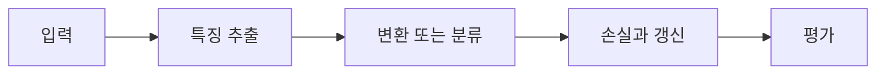

> [!abstract] 핵심
> VGGNet 실습은 작은 합성곱 커널의 반복과 pooling으로 깊은 특징 추출 구조를 만들고, 실습에서는 계산량을 고려한 간소화 모델을 사용한다.

## 구조와 학습의 연결

VGG-16 구조는 3×3 합성곱을 반복하고 2×2 max pooling으로 공간 크기를 줄이는 흐름으로 소개된다. 실습에서는 원래 구조의 계산 시간이 크기 때문에 간소화된 모델을 사용한다. Conv2d 구현에서 입력·출력 채널과 커널 크기가 핵심 매개변수다.



| 요소 | 역할 | 확인 |
| --- | --- | --- |
| 3×3 합성곱 | 작은 커널의 반복 | 채널·padding을 확인한다 |
| 2×2 pooling | 공간 크기 축소 | stride와 출력 크기를 기록한다 |
| 간소화 모델 | 실습 시간 조절 | 원 구조와 변경점을 구분한다 |

> [!note] 실행 흐름
> 간소화된 블록을 기본 단위로 만들고, 블록마다 채널과 공간 크기가 어떻게 바뀌는지 기록한다. 마지막 분류기 이전의 특징맵 형태와 학습 시간을 함께 점검한다.

```html preview h=165
<div style="font-family:system-ui,sans-serif;padding:16px;border:1px solid var(--border);background:var(--card);color:var(--foreground);border-radius:var(--radius)">
  <div style="font-weight:700;margin-bottom:10px">01. VGGNet 실습 · 설계 점검</div>
  <div style="display:grid;grid-template-columns:repeat(4,minmax(0,1fr));gap:8px">
    <div style="padding:9px;border:1px solid var(--border);border-radius:var(--radius)">입력</div>
    <div style="padding:9px;border:1px solid var(--border);border-radius:var(--radius)">층</div>
    <div style="padding:9px;border:1px solid var(--border);border-radius:var(--radius)">손실</div>
    <div style="padding:9px;border:1px solid var(--border);border-radius:var(--radius)">검증</div>
  </div>
</div>
```

## 세 관점

<Tabs>
<Tab label="개념">

VGG 계열은 작은 커널을 반복해 깊은 특징 추출을 구성한다. pooling은 단계적으로 공간 크기를 줄인다.

</Tab>
<Tab label="구현">

실습 모델은 원 구조의 모든 층을 그대로 옮기기보다 계산 가능성을 고려해 축소할 수 있다. 축소한 층과 채널을 명시한다.

</Tab>
<Tab label="검증">

간소화 모델의 성능은 원 구조의 성능과 같은 조건에서 직접 등치할 수 없다. 데이터·epoch·평가 기준을 함께 기록한다.

</Tab>
</Tabs>

<details>
<summary>복습 질문</summary>

작은 커널을 반복하는 이유를 층의 깊이와 특징 추출 관점에서 설명해 보자. 간소화 모델을 사용할 때 무엇을 명시해야 하는가?

</details>

> [!tip] 학습 전략
> 텐서의 모양, 파라미터 선택, 평가 기준을 함께 기록한다. 한 번에 하나의 설정만 바꾸어 변화의 원인을 분리한다.
> [!warning] 해석 주의
> 모델을 간소화하면 연산 시간뿐 아니라 표현력도 달라질 수 있다. 결과를 원래 구조의 결과처럼 해석하지 않는다.
