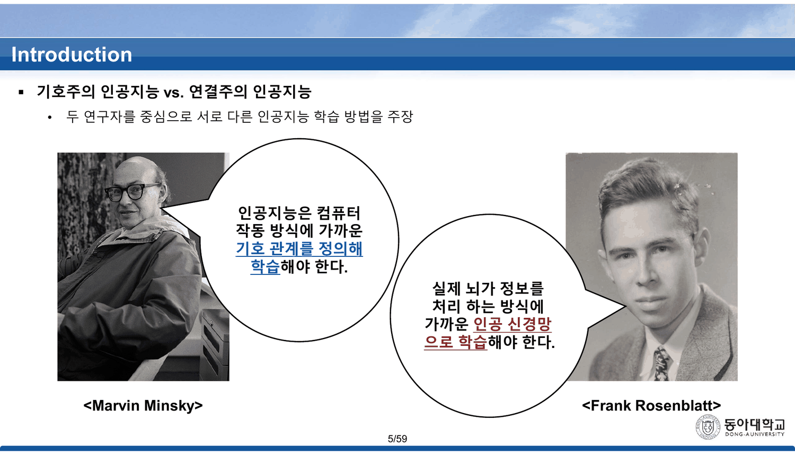
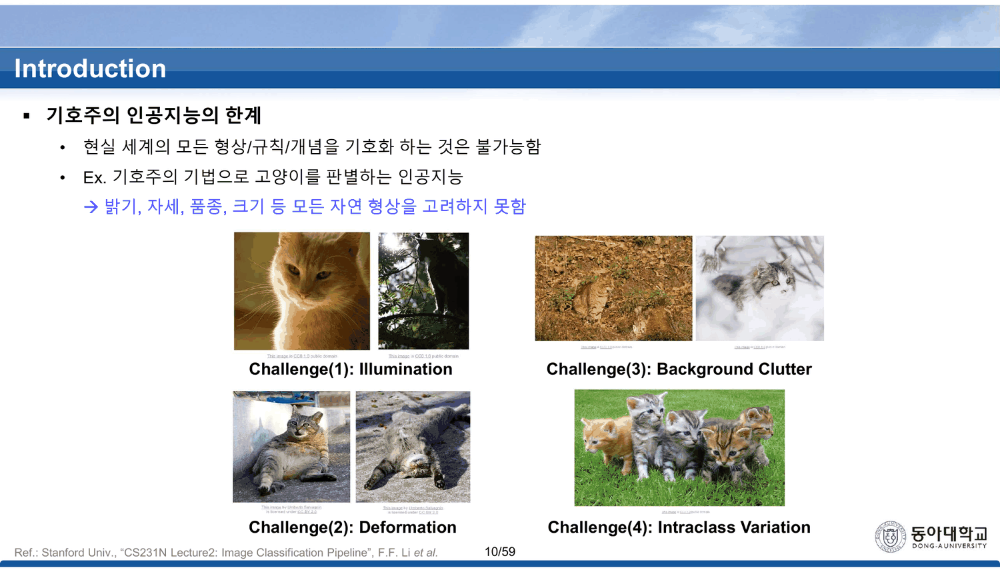
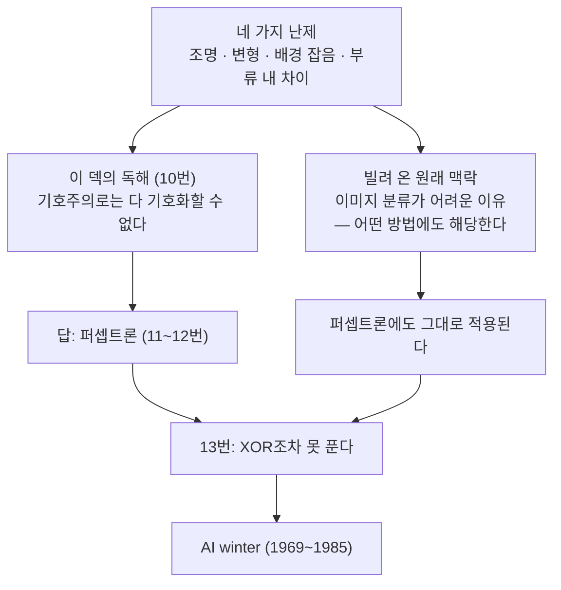
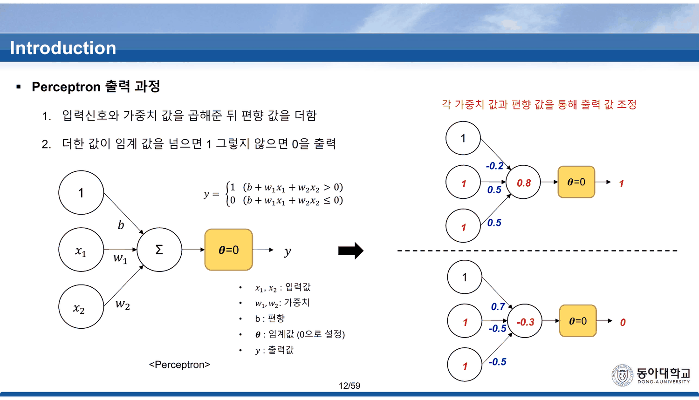
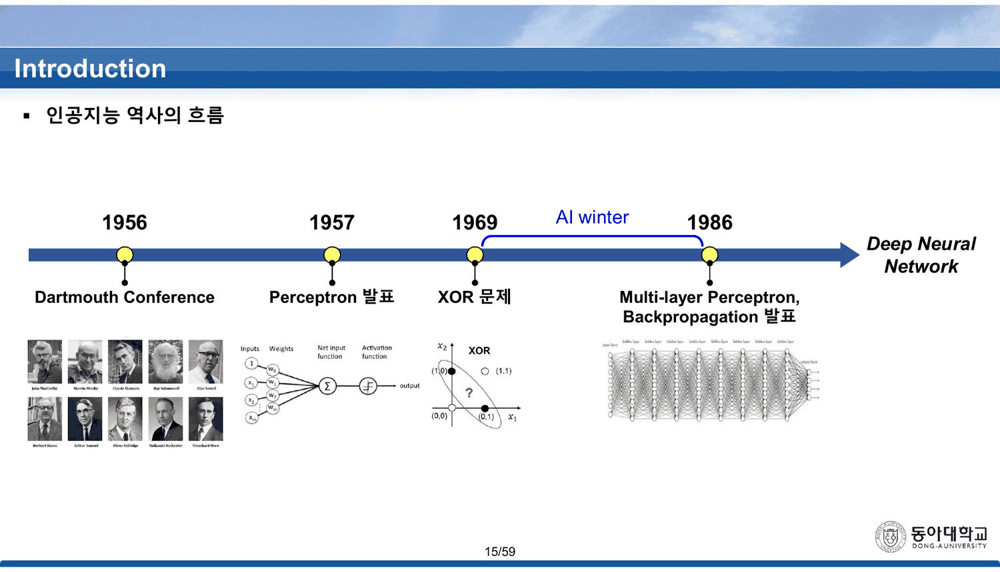
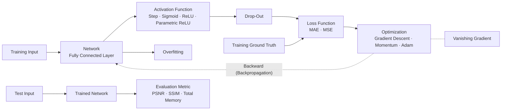

## 두 얼굴이 마주 본다

5번 슬라이드는 초상 두 장이다. 왼쪽에 마빈 민스키, 오른쪽에 프랭크 로젠블랫. 각자 말풍선을 하나씩 달고 있다.



> **민스키** — 인공지능은 컴퓨터 작동 방식에 가까운 **기호 관계를 정의해** 학습해야 한다.
> **로젠블랫** — 실제 뇌가 정보를 처리 하는 방식에 가까운 **인공 신경망으로** 학습해야 한다.

6번이 같은 그림에 이름표만 붙인다 — `기호주의 인공지능` 과 `연결주의 인공지능`. 이 덱은 인공지능의 역사를 **두 사람의 논쟁**으로 세우고 시작한다. 그리고 7~10번이 한쪽을 무너뜨린다.

> [!important] 이 노트의 척추
> 기호주의를 무너뜨리는 장면의 마지막 슬라이드(10번)는 **스탠퍼드 CS231N에서 통째로 빌려 온 것**이고, 슬라이드 아래에 출처가 인쇄되어 있다. 그런데 거기 적힌 네 가지 난제 — 조명 · 자세 변형 · 배경 잡음 · 같은 부류 안의 차이 — 는 **기호주의의 약점 목록이 아니라 이미지 분류라는 문제 자체의 난이도 목록**이다. CS231N에서 그 장은 신경망을 소개하기 **전에** 「왜 이 문제가 어려운가」를 말하는 자리다. 빌려 온 그림이 기호주의를 찌르는 동시에, 세 장 뒤에 등장하는 퍼셉트론도 함께 찌른다. 그리고 이 덱은 그 사실을 13번에서 스스로 인정한다 — 퍼셉트론은 XOR도 못 푼다.

---

## 기호주의를 세 장으로 무너뜨린다

7번이 기호주의를 정의한다. 삼단논법이 예시다.

> (1) 인간의 지식을 기호화 → (2) 기호 간 관계 정의 → (3) 연역적 추론
>
> Knowledge1: 사람은 죽는다. / Knowledge2: 소크라테스는 사람이다. / Inference: 소크라테스는 죽는가? / **Result: 죽는다.**

8~9번이 한계를 보인다. 예시는 고양이 판별이다.

| 단계 | 슬라이드가 적은 것 |
| --- | --- |
| [1] Training | 픽셀 값 `20 100 / 52 173` → `Cat = [ 20, 100, 52, 173 ]` |
| [2] Inference | 픽셀 값 `120 200 / 152 255` → `[ 120, 200, 152, 255 ] is Cat? No` |

「현실 세계의 모든 형상/규칙/개념을 기호화 하는 것은 불가능함」이 결론이다.

> [!caution] 이 예시는 기호주의가 아니라 「외운 값과 정확히 같은가」다
> 8~9번이 보여 주는 절차는 **픽셀 벡터 하나를 통째로 기억했다가 새 벡터와 비교**하는 것이다. 이것은 기호주의(기호화 → 관계 정의 → 연역)가 아니라 **완전 일치 검색**이고, 7번이 방금 정의한 세 단계 중 두 번째와 세 번째가 빠져 있다. 소크라테스 예시에서 지식은 「사람은 죽는다」라는 **관계**였지 개별 값이 아니었다.
>
> 더 중요한 것은, **같은 시험을 이 덱의 답에 들이대도 결과가 같다**는 점이다. 12번의 퍼셉트론은 입력 네 개에 가중치를 곱해 임계값과 비교한다. 훈련 데이터가 `[20,100,52,173]` 한 개뿐이라면 학습된 퍼셉트론 역시 `[120,200,152,255]` 를 고양이로 부를 근거가 없다. 두 방법의 차이는 「하나만 외우는가」가 아니라 **여러 예로부터 일반화하는가**인데, 그 대비는 어느 슬라이드에도 없다.

그리고 10번이 결정타를 놓는다.



> Challenge(1): **Illumination** · Challenge(2): **Deformation** · Challenge(3): **Background Clutter** · Challenge(4): **Intraclass Variation**
>
> `Ref.: Stanford Univ., "CS231N Lecture2: Image Classification Pipeline", F.F. Li et al.`

이 덱은 네 난제를 「밝기, 자세, 품종, 크기 등 모든 자연 형상을 고려하지 못함」이라는 기호주의의 한계로 읽는다. 출처는 정직하게 인쇄되어 있고, 그 출처의 맥락은 다르다.



11번이 답을 내놓고, 12번이 계산 규칙을 적고, **13번이 그 답을 무너뜨린다.** 덱이 기호주의를 세 장에 걸쳐 눕히고 자기 답을 두 장 만에 눕힌다.

---

## 12번 — 첫 두 계산이 이미 마지막 장의 두 게이트다

11번이 퍼셉트론을 소개하고, 12번이 계산 규칙을 적는다.

$$y = \begin{cases} 1 & (b + w_1x_1 + w_2x_2 > 0) \\ 0 & (b + w_1x_1 + w_2x_2 \le 0) \end{cases}$$

오른쪽에 예시 둘이 붙는다.



| | $b$ | $w_1$ | $w_2$ | 입력 | 합 | $y$ |
| --- | ---: | ---: | ---: | --- | ---: | ---: |
| 위 | $-0.2$ | $0.5$ | $0.5$ | $(1,1)$ | $0.8$ | **1** |
| 아래 | $0.7$ | $-0.5$ | $-0.5$ | $(1,1)$ | $-0.3$ | **0** |

> [!tip] 이 두 줄은 무작위로 고른 수가 아니다 (원본에 없는 관찰)
> 위 조합 $(b, w_1, w_2) = (-0.2,\ 0.5,\ 0.5)$ 는 **49번이 `OR gate` 로 제시할 값과 정확히 같고**, 아래 조합 $(0.7,\ -0.5,\ -0.5)$ 는 **50번의 `NAND gate` 값과 정확히 같다.** 37장 뒤에 이름을 얻을 두 게이트가 12번에서 이미 계산되고 있다.
>
> 게다가 두 예시 모두 입력이 $(1,1)$ 이다. 네 입력 중 **OR과 NAND의 답이 갈리는 유일한 자리**이고, 그것이 곧 XOR이 0이 되어야 하는 자리다. 60번이 XOR을 만들 때 쓰는 것이 정확히 이 대비다 — `S1 AND S2`. 덱은 이 연결을 어디서도 말하지 않지만, **첫 계산 두 줄이 마지막 계산의 재료다.**

규칙을 직접 굴려 보면 임계값 $\theta = 0$ 이 무엇을 하는지가 보인다.

```html preview
<div id="pc" style="font-family:system-ui,-apple-system,sans-serif;color:var(--foreground);background:var(--card);border:1px solid var(--border);border-radius:12px;padding:18px 16px;">
  <p style="margin:0 0 12px;font-size:13px;color:var(--muted-foreground);line-height:1.7;">
    12번의 규칙 그대로 — <b>y = 1 if b + w₁x₁ + w₂x₂ &gt; 0 else 0</b>. 기본값은 12번 위쪽 예시(= 49번의 OR)다.</p>
  <div style="display:flex;flex-wrap:wrap;gap:6px;margin-bottom:12px;font-size:12px;">
    <button class="pb" data-p="-0.2,0.5,0.5">12번 위 = OR (49번)</button>
    <button class="pb" data-p="0.7,-0.5,-0.5">12번 아래 = NAND (50번)</button>
    <button class="pb" data-p="-0.7,0.5,0.5">AND (48번)</button>
  </div>
  <div style="display:flex;flex-wrap:wrap;gap:14px;align-items:center;margin-bottom:10px;font-size:13px;">
    <label style="display:flex;gap:6px;align-items:center;flex:1;min-width:160px;">b
      <input id="pb0" type="range" min="-1.5" max="1.5" step="0.1" value="-0.2" style="flex:1;accent-color:var(--chart-1);">
      <output id="pv0" style="font-variant-numeric:tabular-nums;font-weight:700;min-width:2.6em;">-0.2</output></label>
    <label style="display:flex;gap:6px;align-items:center;flex:1;min-width:160px;">w₁
      <input id="pb1" type="range" min="-1.5" max="1.5" step="0.1" value="0.5" style="flex:1;accent-color:var(--chart-1);">
      <output id="pv1" style="font-variant-numeric:tabular-nums;font-weight:700;min-width:2.6em;">0.5</output></label>
    <label style="display:flex;gap:6px;align-items:center;flex:1;min-width:160px;">w₂
      <input id="pb2" type="range" min="-1.5" max="1.5" step="0.1" value="0.5" style="flex:1;accent-color:var(--chart-1);">
      <output id="pv2" style="font-variant-numeric:tabular-nums;font-weight:700;min-width:2.6em;">0.5</output></label>
  </div>
  <svg id="ps" viewBox="0 0 620 230" style="width:100%;height:auto;display:block;"></svg>
  <div id="po" style="margin-top:8px;font-size:13.5px;line-height:1.9;font-variant-numeric:tabular-nums;min-height:3.4em;"></div>
  <style>#pc .pb{font:inherit;font-size:12px;padding:4px 10px;cursor:pointer;border:1px solid var(--border);
    background:transparent;color:var(--muted-foreground);border-radius:6px;}
    #pc .pb:hover{border-color:var(--chart-1);color:var(--foreground);}</style>
</div>
<script>
(function(){
  const NS='http://www.w3.org/2000/svg', svg=document.getElementById('ps');
  const el=(t,a,x)=>{const e=document.createElementNS(NS,t);for(const k in a)e.setAttribute(k,a[k]);
    if(x!==undefined)e.textContent=x;return e;};
  const GATES={'0001':'AND','0111':'OR','1110':'NAND','1000':'NOR','0110':'XOR','1001':'XNOR',
               '0000':'항상 0','1111':'항상 1'};
  const PTS=[[0,0],[0,1],[1,0],[1,1]];
  function draw(b,w1,w2){
    svg.textContent='';
    const L=330,R=596,T=22,B=200;         // 오른쪽 평면
    const sx=v=>L+(v+0.4)/1.8*(R-L), sy=v=>B-(v+0.4)/1.8*(B-T);
    svg.appendChild(el('line',{x1:sx(-0.4),y1:sy(0),x2:sx(1.4),y2:sy(0),stroke:'var(--border)'}));
    svg.appendChild(el('line',{x1:sx(0),y1:sy(-0.4),x2:sx(0),y2:sy(1.4),stroke:'var(--border)'}));
    svg.appendChild(el('text',{x:sx(1.4),y:sy(0)+16,'text-anchor':'end','font-size':11,fill:'var(--muted-foreground)'},'x₁'));
    svg.appendChild(el('text',{x:sx(0)-8,y:sy(1.4),'text-anchor':'end','font-size':11,fill:'var(--muted-foreground)'},'x₂'));
    // 결정 경계 b + w1 x1 + w2 x2 = 0
    if(Math.abs(w2)>1e-9){
      const f=x=>-(b+w1*x)/w2;
      svg.appendChild(el('line',{x1:sx(-0.4),y1:sy(f(-0.4)),x2:sx(1.4),y2:sy(f(1.4)),
        stroke:'var(--chart-1)','stroke-width':2}));
    } else if(Math.abs(w1)>1e-9){
      const xv=-b/w1;
      svg.appendChild(el('line',{x1:sx(xv),y1:sy(-0.4),x2:sx(xv),y2:sy(1.4),stroke:'var(--chart-1)','stroke-width':2}));
    }
    const rows=[];
    PTS.forEach(([x1,x2])=>{
      const s=+(b+w1*x1+w2*x2).toFixed(4), y=s>0?1:0;
      rows.push([x1,x2,s,y]);
      svg.appendChild(el('circle',{cx:sx(x1),cy:sy(x2),r:8,
        fill: y? 'var(--chart-1)':'var(--card)', stroke:'var(--foreground)','stroke-width':1.6}));
      svg.appendChild(el('text',{x:sx(x1),y:sy(x2)-15,'text-anchor':'middle','font-size':10,
        fill:'var(--muted-foreground)'},'('+x1+','+x2+')'));
    });
    // 왼쪽 표
    const TL=10, TT=30, RH=34;
    ['x₁','x₂','합 s','y'].forEach((h,i)=>svg.appendChild(el('text',{x:TL+22+i*72,y:TT,
      'text-anchor':'middle','font-size':11.5,fill:'var(--muted-foreground)','font-weight':700},h)));
    rows.forEach((r,i)=>{
      const y=TT+22+i*RH;
      r.forEach((v,j)=>svg.appendChild(el('text',{x:TL+22+j*72,y:y,'text-anchor':'middle','font-size':12.5,
        fill: j===3? (v? 'var(--chart-1)':'var(--muted-foreground)') : 'var(--foreground)',
        'font-weight': j===3?700:400}, j===2? v.toFixed(2): v)));
    });
    return rows;
  }
  function upd(){
    const b=+document.getElementById('pb0').value, w1=+document.getElementById('pb1').value,
          w2=+document.getElementById('pb2').value;
    ['pv0','pv1','pv2'].forEach((id,i)=>document.getElementById(id).textContent=[b,w1,w2][i].toFixed(1));
    const rows=draw(b,w1,w2);
    const key=rows.map(r=>r[3]).join('');
    const nm=GATES[key];
    document.getElementById('po').innerHTML =
      '출력 패턴 <b>'+key+'</b> → '+(nm? '<b style="color:var(--chart-1)">'+nm+' 게이트</b>' :
        '이름 붙은 게이트가 아니다')+
      '<p style="margin:5px 0 0;font-size:12.5px;color:var(--muted-foreground);line-height:1.75">'+
      (key==='0110'||key==='1001'
        ? '<b style="color:var(--chart-2)">여기에는 도달할 수 없다.</b> 직선 하나로 대각선 두 점을 나머지 둘과 가를 수 없기 때문이고, 그것이 13번이 말하는 XOR 문제다.'
        : '직선 하나가 네 점을 가른다. 16가지 출력 패턴 중 <b>이렇게 만들 수 있는 것은 14가지</b>이고, 못 만드는 둘이 XOR과 XNOR이다.')+'</p>';
  }
  ['pb0','pb1','pb2'].forEach(id=>document.getElementById(id).addEventListener('input',upd));
  document.querySelectorAll('#pc .pb').forEach(btn=>btn.addEventListener('click',()=>{
    const [b,w1,w2]=btn.dataset.p.split(',').map(Number);
    document.getElementById('pb0').value=b; document.getElementById('pb1').value=w1;
    document.getElementById('pb2').value=w2; upd();
  }));
  upd();
})();
</script>

손잡이를 어떻게 움직여도 출력 패턴 `0110`(XOR)과 `1001`(XNOR)에는 닿지 않는다. **네 점에 대한 출력 패턴 16가지 중 14가지만 만들 수 있다.** 13번이 「어떤 방법으로도 XOR 문제를 풀 수 없음」이라 적은 것이 이 뜻이고, 12번의 규칙만 있으면 그 자리에서 확인된다. 덱은 13번에서 결론만 말하고 확인은 하지 않는다.


---

## 세 개의 연도, 두 개의 값

15번이 역사를 한 줄로 정리한다.



```html preview
<div id="tl" style="font-family:system-ui,-apple-system,sans-serif;color:var(--foreground);background:var(--card);border:1px solid var(--border);border-radius:12px;padding:18px 16px;">
  <p style="margin:0 0 12px;font-size:13px;color:var(--muted-foreground);line-height:1.7;">
    15번 연표를 그대로 옮기고, 같은 덱의 다른 슬라이드가 같은 사건에 붙인 연도를 겹쳐 놓았다. 점을 눌러 본다.</p>
  <svg id="tls" viewBox="0 0 620 210" style="width:100%;height:auto;display:block;"></svg>
  <div id="tlo" style="margin-top:10px;font-size:13.5px;line-height:1.9;min-height:4.4em;"></div>
</div>
<script>
(function(){
  const NS='http://www.w3.org/2000/svg', svg=document.getElementById('tls');
  const el=(t,a,x)=>{const e=document.createElementNS(NS,t);for(const k in a)e.setAttribute(k,a[k]);
    if(x!==undefined)e.textContent=x;return e;};
  const E=[
    {y:1956,n:'Dartmouth Conference',s:'4 · 15',d:'「목적: 지능을 가진 기계 연구 → 인공지능 / 주요 성과: 초기 인공지능의 개념 및 분야 확립」 (4번). 연표와 본문이 같다.',c:false},
    {y:1957,n:'Perceptron 발표',s:'15',d:'연표(15번)는 <b>1957</b>이라 적는다. 그런데 같은 덱 <b>11번</b>은 「대표적인 알고리즘으로 perceptron이 존재함 <b>(1958)</b>」이라 적는다. 한 덱 안에서 같은 사건에 두 연도가 붙어 있다.',c:true},
    {y:1969,n:'XOR 문제',s:'13 · 15',d:'13번의 제목은 「XOR 문제와 AI winter <b>(1969 ~ 1985)</b>」다. 연표에는 1969만 점으로 찍히고 그 뒤 구간이 <b>AI winter</b> 라는 이름의 띠로 그려진다.',c:false},
    {y:1986,n:'MLP · Backpropagation 발표',s:'14 · 15',d:'14번이 「Multi-layer Perceptron (MLP, <b>1986</b>)」과 러멜하트·힌턴·윌리엄스를 든다. 13번이 적은 겨울의 끝(1985)과 한 해 차이로 이어진다.',c:false},
    {y:2012,n:'Deep Neural Network',s:'15 · 17',d:'연표의 마지막 칸에는 <b>연도가 적혀 있지 않다</b> — 「Deep Neural Network」라는 이름만 있다. 17번의 ILSVRC 그래프가 그 자리를 대신한다.',c:true,noyear:true}];
  let sel=1;
  const L=54,R=596,Y=92;
  const px=i=>L+i*(R-L)/(E.length-1);
  function draw(){
    svg.textContent='';
    svg.appendChild(el('line',{x1:L,y1:Y,x2:R,y2:Y,stroke:'var(--border)','stroke-width':2}));
    // AI winter 띠
    svg.appendChild(el('rect',{x:px(2),y:Y-9,width:px(3)-px(2),height:18,fill:'var(--chart-2)',opacity:0.28,rx:3}));
    svg.appendChild(el('text',{x:(px(2)+px(3))/2,y:Y+30,'text-anchor':'middle','font-size':11,
      fill:'var(--chart-2)','font-weight':700},'AI winter'));
    E.forEach((e,i)=>{
      const g=el('g',{style:'cursor:pointer'});
      g.appendChild(el('circle',{cx:px(i),cy:Y,r:i===sel?9:6.5,
        fill: e.c?'var(--chart-2)':'var(--chart-1)', opacity:i===sel?1:0.6,
        stroke:i===sel?'var(--foreground)':'none','stroke-width':1.6}));
      const lab=e.noyear? '연도 없음' : e.y;
      svg.appendChild(el('text',{x:px(i),y:Y-20,'text-anchor':'middle','font-size':12,
        fill: e.c?'var(--chart-2)':'var(--foreground)','font-weight':i===sel?700:500},lab));
      const ws=e.n.split(' ');
      ws.forEach((w,k)=>svg.appendChild(el('text',{x:px(i),y:Y+52+k*14,'text-anchor':'middle',
        'font-size':10,fill:'var(--muted-foreground)'},w)));
      g.addEventListener('click',()=>{sel=i;upd();});
      svg.appendChild(g);
    });
    svg.appendChild(el('text',{x:L,y:196,'font-size':10.5,fill:'var(--muted-foreground)'},
      '주황 점 = 같은 덱 안에서 값이 갈리거나 비어 있는 자리'));
  }
  function upd(){ draw();
    document.getElementById('tlo').innerHTML='<b>'+(E[sel].noyear?'':E[sel].y+' · ')+E[sel].n+'</b> '+
      '<span style="font-size:12px;color:var(--muted-foreground)">(슬라이드 '+E[sel].s+'번)</span>'+
      '<div style="margin-top:5px;font-size:12.5px;color:var(--muted-foreground);line-height:1.8">'+E[sel].d+'</div>';
  }
  upd();
})();
</script>

**11번은 `perceptron이 존재함 (1958)` 이라 적고, 네 장 뒤 15번의 연표는 `Perceptron 발표` 를 1957에 찍는다.** 같은 덱 안에서 같은 사건이 두 해를 갖는다. 어느 쪽이 옳은지를 덱은 말하지 않고, 두 값이 나란히 남는다.

연표의 마지막 칸에는 **연도가 없다.** 1956 · 1957 · 1969 · (AI winter) · 1986 까지는 숫자가 붙고, 그 오른쪽 `Deep Neural Network` 만 이름뿐이다. 그 빈 자리를 16 · 17번이 채운다.

---

## 겨울을 끝낸 것이 셋이라고 적고, 하나만 이야기한다

16번이 세 가지를 든다.

| | 슬라이드가 적은 것 | 이 덱이 이어서 다루는가 |
| --- | --- | --- |
| (1) | 오차 역전파법 개발 (Back-propagation) | **그렇다** — 14번이 1986년에 이미 배치했고, 다음 덱 전체가 이것이다 |
| (2) | 대규모 데이터셋 확보 (Big data) | 17번의 ImageNet 한 장 |
| (3) | 하드웨어 기술 발전 | 그림 한 칸(`GPU를 이용한 학습`) — 본문 없음 |

세 번째는 슬라이드 안에서 그림 한 칸으로만 존재한다. 그런데 **역사적으로 이 셋의 순서가 곧 이 과목의 순서**이기도 하다 — 역전파는 다음 덱에서 유도되고, 데이터셋과 하드웨어는 실습 덱에서 코랩과 CIFAR-10으로 돌아온다. 16번은 그 예고편이다.

17번이 숫자로 마무리한다 — 이미지넷 대회에서 「딥러닝 기반 기법이 제안된 이후 분류 성능이 급격히 높아짐」. 여기서 영문 표기가 흔들린다.

> 이미지넷 대규모 시각 인식 대회 (**Image** Large Scale Visual Recognition Challenge, **ILSVR**)

한국어는 「이미지넷」이라 쓰고 영어에서는 `Net` 이 빠졌다. 약자도 마지막 `C`(Challenge)가 빠진 `ILSVR` 이다. **한 줄 안에서 이름과 약자가 각각 한 글자씩 부족하다.**

---

## 2번 슬라이드 — 학기 전체가 한 장에 들어 있다

이 덱의 두 번째 장은 강의 내용이 아니라 **지도**다. `Overall Architecture of Deep Learning` 이라는 제목 아래 학기에 다룰 것이 전부 배치되어 있다.



이 한 장이 `sources/` 의 덱 목록과 거의 그대로 대응한다 — `Perceptron` · `MLP` · `Backpropagation` · `Optimizer` · `Overfitting` · `Vanishing Gradient Effect` · `CNN`. **강의 계획서가 그림으로 그려져 있고, 같은 장이 뒤따르는 덱마다 맨 앞에 다시 나온다.** MLP 덱의 같은 장은 여기에 `BN`(배치 정규화)과 `(Activation Function)` 이라는 꼬리표가 더 붙어 있어, **지도가 학기 동안 조금씩 자란다.**

---

## 원본에서 발견한 것

`값의 불일치`

- **퍼셉트론 발표 연도가 1958(11번)과 1957(15번 연표)로 갈린다.** 네 장 간격이고 어느 쪽도 다른 쪽을 언급하지 않는다
- **15번 연표의 마지막 칸 `Deep Neural Network` 에만 연도가 없다.** 앞의 네 칸은 모두 숫자를 갖는다

`표기 오류`

- **17번 — `Image Large Scale Visual Recognition Challenge, ILSVR`.** 한국어 제목은 「이미지넷」인데 영문에서 `Net` 이 빠졌고, 약자에서도 마지막 `C`(Challenge)가 빠졌다. 한 줄에 두 군데다
- **7번 `기호주의 인공지능 (Symbolism AI)` · 11번 `연결주의 인공지능 (Connection AI)`.** 통용 표기는 각각 Symbolic AI / Connectionism(또는 Connectionist AI)이다. 두 표기가 같은 방식으로 어긋나 있어 한 사람이 같은 규칙으로 만든 것으로 보인다

`빌려 온 자료의 맥락`

- **10번은 스탠퍼드 CS231N Lecture 2의 슬라이드이고 출처가 인쇄되어 있다.** 거기 나열된 네 난제(Illumination · Deformation · Background Clutter · Intraclass Variation)는 **이미지 분류 문제 전반의 난이도 목록**이지 기호주의의 약점 목록이 아니다. 이 덱은 그것을 기호주의의 한계로 읽고, 세 장 뒤에 내놓는 답(퍼셉트론)이 같은 난제에 해당한다는 점은 다루지 않는다
- **8~9번의 고양이 예시가 7번이 정의한 기호주의와 맞지 않는다.** 7번은 「기호화 → 관계 정의 → 연역」 세 단계인데, 8~9번이 보이는 절차는 픽셀 벡터 하나를 그대로 기억했다가 새 벡터와 비교하는 **완전 일치 검색**이다. 관계 정의도 연역도 없다

`덱 구성`

- **쪽 번호가 총 쪽수를 넘는다** — 모든 슬라이드의 꼬리표가 `n/59` 인데 PDF는 **61쪽**이라 마지막 두 장이 `60/59` · `61/59` 다. 같은 과목의 `Perceptron (실습)` 덱도 같은 방식으로 마지막 장이 `8/7` 이다
- **12번의 두 계산 예시가 49번(OR)·50번(NAND)의 값과 정확히 같다.** 이름은 37장 뒤에 붙는다. 두 예시 모두 입력이 `(1,1)` 인데, 그 자리가 OR과 NAND의 답이 갈리는 유일한 입력이자 60번이 XOR을 만들 때 쓰는 대비다. 덱은 이 연결을 언급하지 않는다
- **5번과 6번은 같은 그림이고 6번에 이름표 둘(`기호주의 인공지능` · `연결주의 인공지능`)이 추가된다.** 8번과 9번, 18·28·41·52번의 목차 반복도 같은 단계적 공개 방식이다. 이 덱에서 **목차 슬라이드만 네 번(3 · 18 · 28 · 41 · 52번, 다섯 번)** 나온다
- **2번 슬라이드는 이 과목의 모든 덱에 공통으로 붙는 지도다.** MLP 덱의 같은 장에는 `Drop-out / BN` 과 `Vanishing Gradient (Activation Function)` 이라는 꼬리표가 추가되어 있다 — 같은 그림이 학기 동안 갱신된다

---

## 근거 자료

`sources/Perceptron (이론).pdf` 1~17쪽 (인쇄 번호 1~17, 꼬리표는 `/59`). 이 덱은 **61쪽 중 52쪽에서 텍스트 추출이 정상 작동**한다(전체 약 10,900자). 추출이 빈약한 아홉 쪽(1 · 3 · 18 · 28 · 41 · 44 · 45 · 52 · 57번)만 130 dpi로 렌더해 직접 읽었고, 본문 대조는 추출 텍스트로 했다.

| 슬라이드 | 내용 |
| ---: | --- |
| 2 | 학기 전체 지도 — `Overall Architecture of Deep Learning` |
| 4~6 | 다트머스 회의, 기호주의 대 연결주의의 대립 구도 |
| 7~10 | 기호주의의 정의와 한계 — 고양이 예시, CS231N의 네 난제 |
| 11~12 | 연결주의와 퍼셉트론의 출력 규칙, 두 개의 계산 예시 |
| 13~15 | XOR, AI winter, MLP, 연표 |
| 16~17 | 겨울을 끝낸 세 가지와 이미지넷 |

인용한 슬라이드 네 장 — 5 · 10 · 12 · 15번. 12번 두 예시의 합(0.8 · −0.3)과 49·50번 게이트 값의 일치는 파이썬으로 네 입력 전부를 다시 계산해 확인했다.

### 이어지는 곳

- [[02. 예측을 먼저 보여 주고, 그 예측이 나오지 않는 모델을 보여 준다]] — 같은 덱 18~40번. 회귀와 분류 예제가 이어진다
- [[03. 다섯 장에 걸쳐 XOR을 쌓는 동안 이름이 두 번 바뀌고 부호가 한 번 틀린다]] — 같은 덱 41~61번. 13번이 던진 XOR이 여기서 풀린다
- [[04. 목록은 길고 고르는 기준은 한 줄이다]] — `MLP (이론)` 덱. 2번 슬라이드의 지도가 거기서 한 칸 자란다
