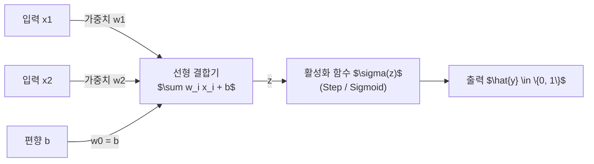
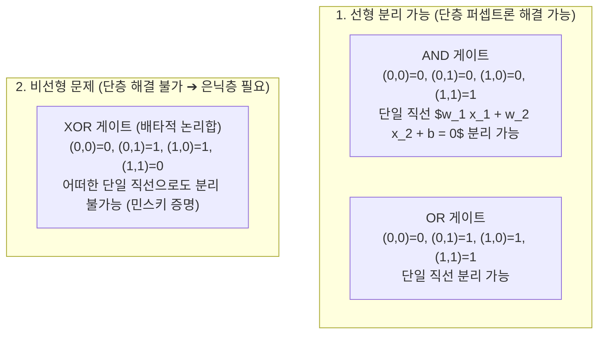

> [!abstract] 핵심 요약
> **퍼셉트론(Perceptron)**은 1957년 프랑크 로젠블랫이 제안한 인공신경망(ANN)의 가장 기초적인 수학적 연산 단위이다.
> 입력 벡터와 가중치의 선형 결합($z = \mathbf{w}^T \mathbf{x} + b$)을 활성화 함수에 통과시켜 이진 결정을 내리는 구조를 가지며, AND·OR·NAND와 같은 **선형 분리 가능(Linearly Separable)** 문제는 완벽히 학습할 수 있으나, 단 하나의 직선으로 분리할 수 없는 **XOR 문제**는 단층 퍼셉트론으로 해결이 불가능함을 마빈 민스키가 증명하며 다층 퍼셉트론(MLP)의 필요성을 촉발했다.

---

## 1. 퍼셉트론의 수학적 모델링과 동작 원리

$$z = \sum_{i=1}^{n} w_i x_i + b = \mathbf{w}^T \mathbf{x} + b$$
$$\hat{y} = \sigma(z) = \begin{cases} 1 & \text{if } z \ge 0 \\ 0 & \text{if } z < 0 \end{cases}$$



---

## 2. 논리 게이트 진리표와 XOR 선형 분리 불가 한계



---

## 3. 실시간 2D 단층 퍼셉트론 논리 게이트 결정 경계 시뮬레이터

```html preview
<div style="font-family:system-ui,-apple-system,sans-serif;padding:20px;background:var(--card);color:var(--card-foreground);border:1px solid var(--border);border-radius:var(--radius)">
  <div style="font-size:16px;font-weight:700;margin-bottom:14px;color:var(--primary);display:flex;align-items:center;gap:8px">
    <span>🧠 단층 퍼셉트론 논리 게이트(AND / OR / XOR) 결정 경계 분류기</span>
  </div>

  <div style="display:flex;gap:10px;align-items:center;margin-bottom:14px">
    <label style="font-size:12px;font-weight:700">논리 게이트 선택:</label>
    <select id="gateSelect" style="padding:4px 8px;background:var(--background);color:var(--foreground);border:1px solid var(--border);border-radius:var(--radius);font-weight:700">
      <option value="AND">AND Gate (선형 분리 가능)</option>
      <option value="OR">OR Gate (선형 분리 가능)</option>
      <option value="XOR">XOR Gate (선형 분리 불가능 ❌)</option>
    </select>
  </div>

  <div style="display:grid;grid-template-columns:1fr 1fr;gap:12px;margin-bottom:12px">
    <div style="padding:10px;background:var(--background);border:1px solid var(--border);border-radius:var(--radius)">
      <div style="font-size:11px;font-weight:700;color:var(--chart-1);margin-bottom:4px">학습된 파라미터 (w1, w2, b):</div>
      <div id="paramOut" style="font-family:monospace;font-size:12px;line-height:1.6">
        • w1 = 0.5, w2 = 0.5<br/>• b = -0.7
      </div>
    </div>
    <div style="padding:10px;background:var(--background);border:1px solid var(--border);border-radius:var(--radius)">
      <div style="font-size:11px;font-weight:700;color:var(--chart-2);margin-bottom:4px">4개 입력점 예측 결과:</div>
      <div id="truthOut" style="font-family:monospace;font-size:11px;line-height:1.6">
        (0,0)➔0 | (0,1)➔0<br/>(1,0)➔0 | (1,1)➔1 ✅ 100% 정답
      </div>
    </div>
  </div>

  <div id="gateDesc" style="padding:10px;background:var(--background);border:1px solid var(--border);border-radius:var(--radius);font-size:11px">
    AND 게이트는 두 입력이 모두 1일 때만 1을 출력하며, 2차원 평면에서 단일 직선 0.5x1 + 0.5x2 - 0.7 = 0으로 완벽히 분리됩니다.
  </div>

  <script>
    document.getElementById('gateSelect').onchange = function() {
      var g = this.value;
      var p = document.getElementById('paramOut');
      var t = document.getElementById('truthOut');
      var d = document.getElementById('gateDesc');

      if (g === 'AND') {
        p.innerHTML = '• w1 = 0.5, w2 = 0.5<br/>• b = -0.7';
        t.innerHTML = '(0,0)➔0 | (0,1)➔0<br/>(1,0)➔0 | (1,1)➔1 ✅ 100% 정답';
        d.textContent = 'AND 게이트는 2차원 평면에서 단일 직선으로 1과 0의 영역을 완벽하게 선형 분리할 수 있습니다.';
      } else if (g === 'OR') {
        p.innerHTML = '• w1 = 0.5, w2 = 0.5<br/>• b = -0.2';
        t.innerHTML = '(0,0)➔0 | (0,1)➔1<br/>(1,0)➔1 | (1,1)➔1 ✅ 100% 정답';
        d.textContent = 'OR 게이트 역시 단일 직선 0.5x1 + 0.5x2 - 0.2 = 0으로 완벽히 선형 분리됩니다.';
      } else {
        p.innerHTML = '• w1 = ?, w2 = ?<br/>• b = ? (단일 해 없음)';
        t.innerHTML = '<span style="color:var(--destructive,#ef4444);font-weight:700">(0,0)➔0 | (0,1)➔1<br/>(1,0)➔1 | (1,1)➔0 ❌ 최대 75% 정확도 한계</span>';
        d.innerHTML = '❌ <b>[XOR의 한계]</b> 대각선에 위치한 (0,1), (1,0)을 (0,0), (1,1)과 단 하나의 직선으로 가르는 것은 기하학적으로 불가능합니다. 은닉층(Hidden Layer)을 추가한 다층 퍼셉트론(MLP)이 반드시 필요합니다.';
      }
    };
  </script>
</div>
```
