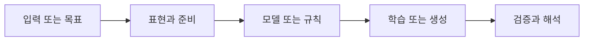

> [!abstract] 핵심
> 이 자료는 읽을 수 있는 본문 텍스트가 안정적으로 추출되지 않아, 원본 이미지를 사용하지 않는 조건에서는 과제 내용을 확정할 수 없다.

## 문제를 학습 흐름으로 바꾸기

확인 가능한 본문이 없거나 판독이 불안정한 상태에서는 수식·지시문·예시를 추정해 적지 않는다. 이 문서는 과제의 대체 해설이 아니라, 현재 재구성 가능한 근거의 경계를 기록한다.



| 관점 | 확인할 질문 | 학습할 때의 점검 |
| --- | --- | --- |
| 확인 가능 | 자료명 수준의 정보 | 세부 주장으로 확장하지 않는다 |
| 확인 불가 | 수식·지시문·판서 | 추정이나 외부 지식으로 채우지 않는다 |
| 후속 조건 | 읽을 수 있는 본문 | 문장 단위로 근거를 연결한다 |

> [!note] 흐름
> 읽을 수 있는 텍스트가 확보되기 전에는 자료명 수준의 분류만 유지한다. 이후 텍스트가 제공되면 과제 목표·입력·요구 산출물·평가 기준을 분리해 근거화한다.

```html preview h=170
<div style="font-family:system-ui,sans-serif;padding:16px;border:1px solid var(--border);background:var(--card);color:var(--foreground);border-radius:var(--radius)">
  <div style="font-weight:700;margin-bottom:10px">01. 필기 과제 자료의 텍스트 추출 한계 · 점검 흐름</div>
  <div style="display:grid;grid-template-columns:repeat(4,minmax(0,1fr));gap:8px">
    <div style="padding:9px;border:1px solid var(--border);border-radius:var(--radius)">입력</div>
    <div style="padding:9px;border:1px solid var(--border);border-radius:var(--radius)">준비</div>
    <div style="padding:9px;border:1px solid var(--border);border-radius:var(--radius)">실행</div>
    <div style="padding:9px;border:1px solid var(--border);border-radius:var(--radius)">점검</div>
  </div>
</div>
```

## 관점을 나누어 보기

<Tabs>
<Tab label="개념">

이 문서는 과제의 내용 노트가 아니라 근거 상태를 구분하는 기록이다.

</Tab>
<Tab label="실행">

원본 이미지를 읽거나 옮기지 않는다. 본문 텍스트가 확보될 때까지 해설 재구성을 보류한다.

</Tab>
<Tab label="검증">

세부 과제 질문은 이 문서만으로 확정하지 않는다. 텍스트 근거가 추가됐는지 먼저 확인한다.

</Tab>
</Tabs>

<details>
<summary>복습 질문</summary>

왜 부분적으로 판독된 문자만으로 수식과 지시문을 복원하면 안 되는가? 읽을 수 있는 본문이 생기면 어떤 정보를 먼저 확인해야 하는가?

</details>

> [!tip] 학습 전략
> 목표, 입력, 평가 기준을 한 문장으로 연결해 본다. 한 번에 여러 조건을 바꾸지 말고 결과 변화의 원인을 기록한다.
> [!warning] 원문 텍스트 추출 한계
> 원문 텍스트 추출이 불안정해 과제 내용을 보정하거나 추정하지 않았다. 원본 이미지는 사용하지 않았다.
