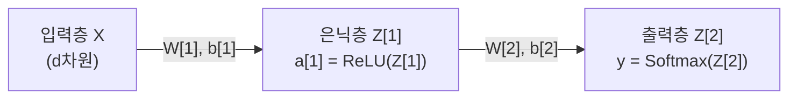
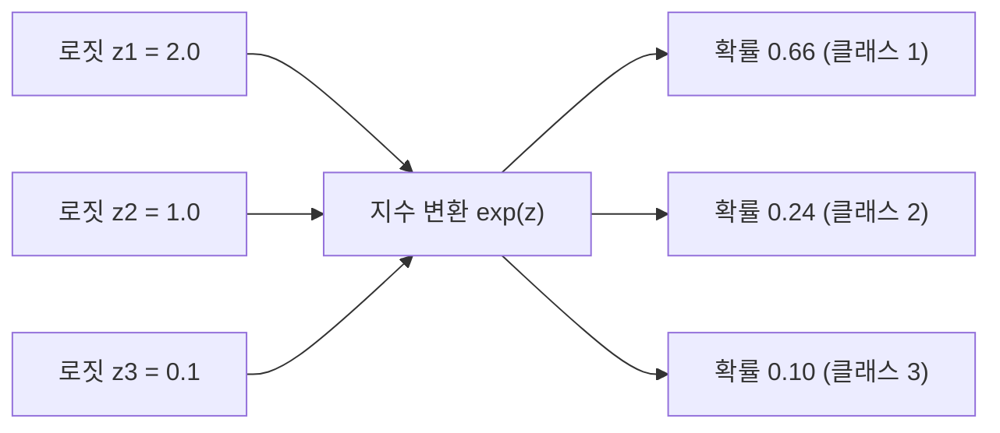

> [!abstract] 핵심 요약
> **다층 퍼셉트론(MLP, Multi-Layer Perceptron)**은 입력층과 출력층 사이에 하나 이상의 **은닉층(Hidden Layer)**과 비선형 활성화 함수를 배치하여 복잡한 비선형 결정 경계를 학습하는 피드포워드 신경망이다.
> 시벤코(Cybenko)와 호닉(Hornik)의 **범용 근사 정리(Universal Approximation Theorem)**에 따라 단 하나의 은닉층만으로도 임의의 연속 함수를 원하는 정밀도로 근사할 수 있으며, 다중 클래스 확률 분포를 출력하기 위해 **소프트맥스(Softmax)** 활성화를 적용한다.

---

## 1. 다층 퍼셉트론(MLP)의 행렬 순전파 연산

$$\mathbf{z}^{[1]} = \mathbf{W}^{[1]} \mathbf{x} + \mathbf{b}^{[1]}, \quad \mathbf{a}^{[1]} = \sigma(\mathbf{z}^{[1]})$$
$$\mathbf{z}^{[2]} = \mathbf{W}^{[2]} \mathbf{a}^{[1]} + \mathbf{b}^{[2]}, \quad \hat{\mathbf{y}} = 	ext{Softmax}(\mathbf{z}^{[2]})$$



---

## 2. 소프트맥스(Softmax) 함수와 다중 분류 확률 변환

$$	ext{Softmax}(z_i) = rac{e^{z_i}}{\sum_{j=1}^{C} e^{z_j}}, \quad \sum_{i=1}^C \hat{y}_i = 1$$



---

## 3. 실시간 2층 MLP 순전파(Forward Propagation) 연산기

```html preview
<div style="font-family:system-ui,-apple-system,sans-serif;padding:20px;background:var(--card);color:var(--card-foreground);border:1px solid var(--border);border-radius:var(--radius)">
  <div style="font-size:16px;font-weight:700;margin-bottom:14px;color:var(--primary);display:flex;align-items:center;gap:8px">
    <span>🧮 2층 다층 퍼셉트론(MLP) 순전파 행렬 연산기</span>
  </div>

  <div style="display:grid;grid-template-columns:1fr 1fr;gap:12px;margin-bottom:14px">
    <div>
      <label style="font-size:11px;color:var(--muted-foreground)">입력 x1:</label>
      <input id="inMlpX1" type="number" value="1.0" step="0.5" style="width:100%;padding:4px 8px;background:var(--background);color:var(--foreground);border:1px solid var(--border);border-radius:var(--radius);font-weight:700" />
    </div>
    <div>
      <label style="font-size:11px;color:var(--muted-foreground)">입력 x2:</label>
      <input id="inMlpX2" type="number" value="2.0" step="0.5" style="width:100%;padding:4px 8px;background:var(--background);color:var(--foreground);border:1px solid var(--border);border-radius:var(--radius);font-weight:700" />
    </div>
  </div>

  <div style="display:grid;grid-template-columns:1fr 1fr;gap:12px;margin-bottom:12px">
    <div style="padding:10px;background:var(--background);border:1px solid var(--border);border-radius:var(--radius)">
      <div style="font-size:10px;color:var(--muted-foreground)">은닉층 활성화 a[1] (ReLU)</div>
      <div id="hiddenActOut" style="font-family:monospace;font-size:13px;font-weight:800;color:var(--chart-1);margin-top:2px">[2.5, 0.0]</div>
    </div>
    <div style="padding:10px;background:var(--background);border:1px solid var(--border);border-radius:var(--radius)">
      <div style="font-size:10px;color:var(--muted-foreground)">최종 Softmax 확률 y_hat</div>
      <div id="softmaxOut" style="font-family:monospace;font-size:13px;font-weight:800;color:var(--primary);margin-top:2px">P(C0)=0.88, P(C1)=0.12</div>
    </div>
  </div>

  <script>
    function updateMlpForward() {
      var x1 = parseFloat(document.getElementById('inMlpX1').value) || 0;
      var x2 = parseFloat(document.getElementById('inMlpX2').value) || 0;

      var z1_0 = 0.5 * x1 + 1.0 * x2 - 0.5;
      var z1_1 = -1.0 * x1 + 0.5 * x2 - 0.5;

      var a1_0 = Math.max(0, z1_0);
      var a1_1 = Math.max(0, z1_1);

      var z2_0 = 1.2 * a1_0 - 0.8 * a1_1 + 0.1;
      var z2_1 = -0.5 * a1_0 + 1.0 * a1_1 - 0.1;

      var maxZ = Math.max(z2_0, z2_1);
      var exp0 = Math.exp(z2_0 - maxZ);
      var exp1 = Math.exp(z2_1 - maxZ);
      var sumExp = exp0 + exp1;

      var p0 = exp0 / sumExp;
      var p1 = exp1 / sumExp;

      document.getElementById('hiddenActOut').textContent = '[' + a1_0.toFixed(2) + ', ' + a1_1.toFixed(2) + ']';
      document.getElementById('softmaxOut').textContent = 'P(0)=' + (p0*100).toFixed(1) + '%, P(1)=' + (p1*100).toFixed(1) + '%';
    }

    ['inMlpX1', 'inMlpX2'].forEach(function(id) {
      document.getElementById(id).addEventListener('input', updateMlpForward);
    });
    updateMlpForward();
  </script>
</div>
```
