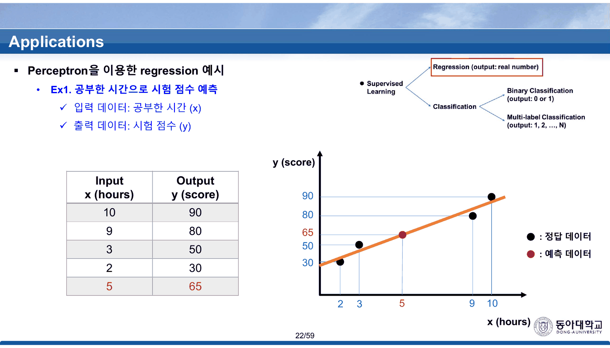
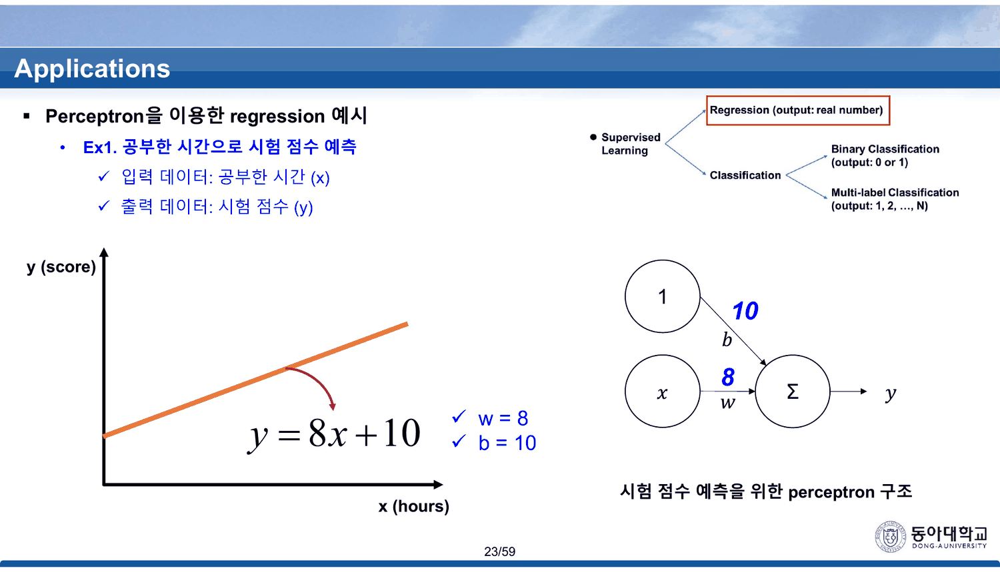
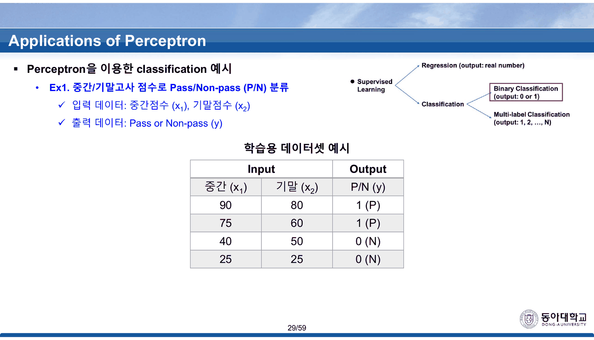
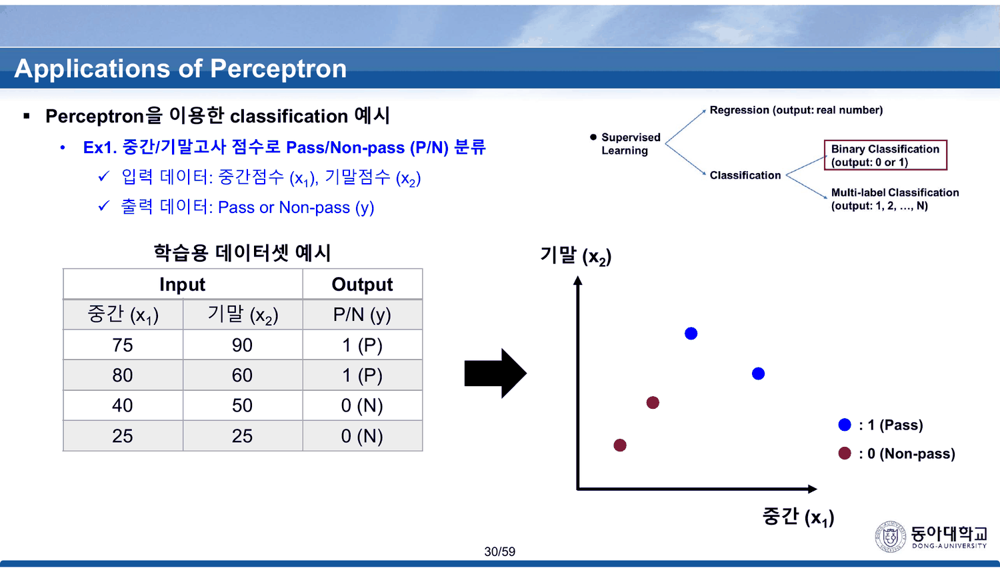
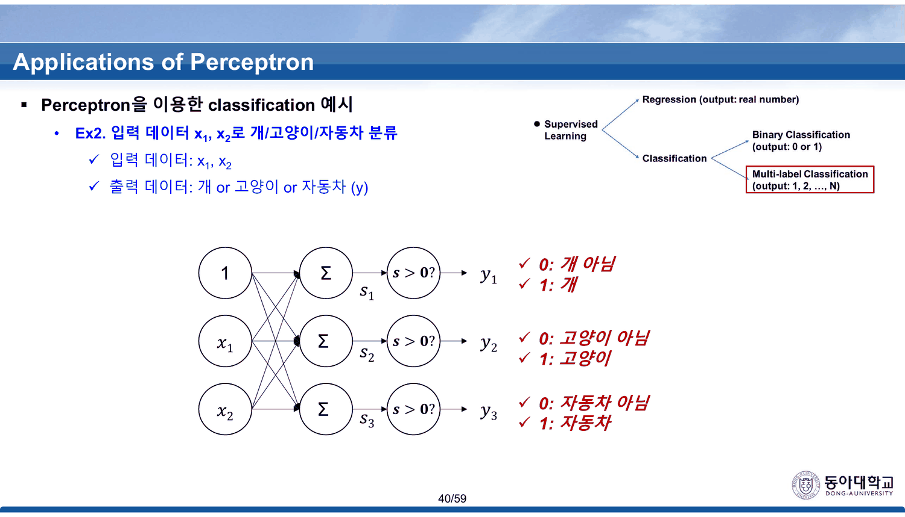
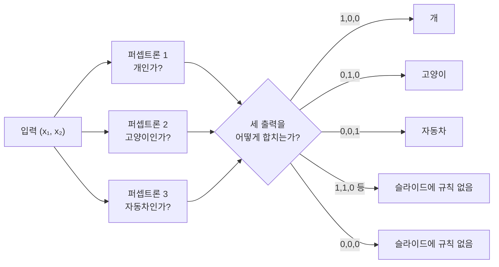

## 두 장 사이에서 15점이 사라진다

19번이 지도학습을 둘로 가른다 — 회귀(실수 출력)와 분류(0/1 또는 0…N). 그리고 20~23번이 회귀를 예제 하나로 끝까지 끌고 간다.

20번의 훈련 데이터는 네 줄이다.

| $x$ (공부한 시간) | $y$ (시험 점수) |
| ---: | ---: |
| 10 | 90 |
| 9 | 80 |
| 3 | 50 |
| 2 | 30 |

21번이 `5 → ?` 한 줄을 더한다. 22번이 답을 준다 — **65**.



23번이 그 예측을 만든 모델을 보여 준다.



$$y = 8x + 10 \qquad (w = 8,\ b = 10)$$

$x = 5$ 를 넣으면 $8 \times 5 + 10 = 50$ 이다. **22번이 답한 65와 15점 차이다.**

> [!important] 이 노트의 척추
> 22번은 「이렇게 예측된다」를 먼저 보이고, 23번은 「그 예측을 만든 퍼셉트론은 이것이다」를 보인다. **두 장의 순서 자체가 이 절의 교육적 설계**인데, 그 이음매에서 숫자가 맞지 않는다. 같은 일이 분류 쪽에서 더 눈에 띄게 반복된다 — 29번과 30번이 같은 제목 아래 **서로 다른 학습 데이터**를 인쇄한다. 이 덱의 예제들은 결론을 먼저 그려 놓고 재료를 나중에 채운 흔적을 남긴다.

### 8x+10 은 데이터의 어디에 맞는가

네 점에 대해 직접 계산해 보면 이렇게 된다.

```html preview
<div id="rg" style="font-family:system-ui,-apple-system,sans-serif;color:var(--foreground);background:var(--card);border:1px solid var(--border);border-radius:12px;padding:18px 16px;">
  <p style="margin:0 0 12px;font-size:13px;color:var(--muted-foreground);line-height:1.7;">
    20번의 네 점과 23번의 모델 <b>y = 8x + 10</b>. 손잡이로 w와 b를 움직여 22번의 빨간 점(x=5 → 65)에 닿는지 본다.</p>
  <div style="display:flex;flex-wrap:wrap;gap:6px;margin-bottom:10px;font-size:12px;">
    <button class="rb" data-p="8,10">23번의 모델 (w=8, b=10)</button>
    <button class="rb" data-p="6.6,22.9">네 점의 최소제곱 적합</button>
  </div>
  <div style="display:flex;flex-wrap:wrap;gap:14px;align-items:center;margin-bottom:8px;font-size:13px;">
    <label style="display:flex;gap:6px;align-items:center;flex:1;min-width:180px;">w
      <input id="rw" type="range" min="3" max="12" step="0.1" value="8" style="flex:1;accent-color:var(--chart-1);">
      <output id="rwv" style="font-variant-numeric:tabular-nums;font-weight:700;min-width:2.6em;">8.0</output></label>
    <label style="display:flex;gap:6px;align-items:center;flex:1;min-width:180px;">b
      <input id="rbb" type="range" min="0" max="45" step="0.1" value="10" style="flex:1;accent-color:var(--chart-1);">
      <output id="rbv" style="font-variant-numeric:tabular-nums;font-weight:700;min-width:2.8em;">10.0</output></label>
  </div>
  <svg id="rs" viewBox="0 0 620 260" style="width:100%;height:auto;display:block;"></svg>
  <div id="ro" style="margin-top:8px;font-size:13.5px;line-height:1.9;font-variant-numeric:tabular-nums;min-height:3.6em;"></div>
  <style>#rg .rb{font:inherit;font-size:12px;padding:4px 10px;cursor:pointer;border:1px solid var(--border);
    background:transparent;color:var(--muted-foreground);border-radius:6px;}
    #rg .rb:hover{border-color:var(--chart-1);color:var(--foreground);}</style>
</div>
<script>
(function(){
  const NS='http://www.w3.org/2000/svg', svg=document.getElementById('rs');
  const el=(t,a,x)=>{const e=document.createElementNS(NS,t);for(const k in a)e.setAttribute(k,a[k]);
    if(x!==undefined)e.textContent=x;return e;};
  const D=[[10,90],[9,80],[3,50],[2,30]];
  const L=52,R=596,T=18,B=212;
  const sx=v=>L+v/12*(R-L), sy=v=>B-v/110*(B-T);
  function draw(w,b){
    svg.textContent='';
    for(const g of [0,30,50,65,80,90]){
      svg.appendChild(el('line',{x1:L,y1:sy(g),x2:R,y2:sy(g),stroke:'var(--border)',
        'stroke-dasharray':'3 5',opacity:0.55}));
      svg.appendChild(el('text',{x:L-8,y:sy(g)+4,'text-anchor':'end','font-size':10,
        fill: g===65?'var(--chart-2)':'var(--muted-foreground)','font-weight':g===65?700:400},g));
    }
    for(const t of [2,3,5,9,10])
      svg.appendChild(el('text',{x:sx(t),y:B+18,'text-anchor':'middle','font-size':10.5,
        fill: t===5?'var(--chart-2)':'var(--muted-foreground)','font-weight':t===5?700:400},t));
    svg.appendChild(el('text',{x:(L+R)/2,y:B+36,'text-anchor':'middle','font-size':11,
      fill:'var(--muted-foreground)'},'x (공부한 시간)'));
    svg.appendChild(el('line',{x1:sx(0),y1:sy(b),x2:sx(12),y2:sy(w*12+b),
      stroke:'var(--chart-1)','stroke-width':2.4}));
    D.forEach(([x,y])=>{
      svg.appendChild(el('line',{x1:sx(x),y1:sy(y),x2:sx(x),y2:sy(w*x+b),
        stroke:'var(--chart-2)','stroke-width':1.4,'stroke-dasharray':'2 3'}));
      svg.appendChild(el('circle',{cx:sx(x),cy:sy(y),r:6,fill:'var(--foreground)'}));
    });
    // 22번의 예측점
    svg.appendChild(el('circle',{cx:sx(5),cy:sy(65),r:7,fill:'var(--chart-2)'}));
    svg.appendChild(el('text',{x:sx(5),y:sy(65)-13,'text-anchor':'middle','font-size':10.5,
      fill:'var(--chart-2)','font-weight':700},'22번: 65'));
    const p=w*5+b;
    svg.appendChild(el('circle',{cx:sx(5),cy:sy(p),r:6,fill:'none',
      stroke:'var(--chart-1)','stroke-width':2}));
    svg.appendChild(el('text',{x:sx(5)+10,y:sy(p)+4,'font-size':10.5,
      fill:'var(--chart-1)','font-weight':700},'모델: '+p.toFixed(1)));
    svg.appendChild(el('text',{x:L,y:250,'font-size':10.5,fill:'var(--muted-foreground)'},
      '점선 = 각 훈련점의 잔차'));
  }
  function upd(){
    const w=+document.getElementById('rw').value, b=+document.getElementById('rbb').value;
    document.getElementById('rwv').textContent=w.toFixed(1);
    document.getElementById('rbv').textContent=b.toFixed(1);
    draw(w,b);
    const mse=D.reduce((a,[x,y])=>a+(w*x+b-y)**2,0)/D.length;
    const p=w*5+b, gap=p-65;
    document.getElementById('ro').innerHTML =
      'x=5 에서 모델값 <b>'+p.toFixed(1)+'</b> · 22번의 예측 <b style="color:var(--chart-2)">65</b> · 차이 <b>'+
      gap.toFixed(1)+'</b> &nbsp;|&nbsp; 네 훈련점의 MSE <b>'+mse.toFixed(2)+'</b>'+
      '<p style="margin:5px 0 0;font-size:12.5px;color:var(--muted-foreground);line-height:1.75">'+
      (Math.abs(w-8)<0.05&&Math.abs(b-10)<0.05
        ? '<b style="color:var(--chart-2)">23번이 인쇄한 값이다.</b> x=10 은 정확히 맞히지만(90) x=3 에서 16점 어긋나고, 22번이 약속한 65 대신 50을 낸다.'
        : Math.abs(w*5+b-65)<0.6
        ? '여기서는 65가 나온다. 그런데 이 직선은 x=10 에서 '+(w*10+b).toFixed(1)+'점을 내므로 데이터의 최고점(90)과 어긋난다 — <b>두 값을 동시에 맞히는 직선은 없다.</b>'
        : '네 점의 최소제곱 적합은 y = 6.6x + 22.9 이고, x=5 에서 <b>55.9</b>다. 65도 50도 아니다.')+'</p>';
  }
  ['rw','rbb'].forEach(id=>document.getElementById(id).addEventListener('input',upd));
  document.querySelectorAll('#rg .rb').forEach(btn=>btn.addEventListener('click',()=>{
    const [w,b]=btn.dataset.p.split(',').map(Number);
    document.getElementById('rw').value=w; document.getElementById('rbb').value=b; upd();
  }));
  upd();
})();
</script>

| $x$ | 데이터 $y$ | $8x+10$ | 차이 |
| ---: | ---: | ---: | ---: |
| 10 | 90 | **90** | 0 |
| 9 | 80 | 82 | $+2$ |
| 3 | 50 | 34 | $-16$ |
| 2 | 30 | 26 | $-4$ |
| **5** | (예측) **65** | **50** | $-15$ |

$8x+10$ 은 **네 점 중 하나($x=10$)만 정확히 맞힌다.** 네 점의 최소제곱 적합은 $y = 6.6x + 22.9$ 이고 MSE가 24.25인데, $8x+10$ 의 MSE는 69.00으로 세 배 가까이 크다. 그리고 최소제곱 직선도 $x=5$ 에서 55.9를 낼 뿐 65는 아니다.

> [!tip] 65는 어느 직선에서도 나오지 않는다 (원본에 없는 보충)
> 22번의 빨간 점이 직선 위에 놓인 것처럼 보이는 이유는 **세로축의 눈금이 균등하지 않기 때문**이다. 축 라벨이 30 · 50 · 65 · 80 · 90 으로 **데이터 값이 있는 자리에만** 찍혀 있어, 그림상으로는 65가 선 위에 있다. 눈금을 일정하게 다시 그리면 $x=5$ 에서 직선은 50 근처를 지난다.
>
> 그래서 이 예제의 교훈은 원래 의도와 다른 자리에서 나온다 — **「모델이 예측한다」와 「그림이 그렇게 보인다」는 다른 일**이고, 23번의 $w$ 와 $b$ 를 실제로 계산해 보는 것만이 그 둘을 가른다.

24~27번의 두 번째 회귀 예제(주택 가격, 입력 넷)에는 숫자가 하나도 없다. 그림 네 개와 $y = w_1x_1 + b$ 꼴의 식 네 개가 있을 뿐이고, **넷을 하나로 합치는 퍼셉트론은 27번에 구조만 그려진다.** 값을 확인할 수 있는 회귀 예제는 20~23번 하나뿐이다.

---

## 같은 표가 한 장 만에 바뀐다

29번이 분류 예제를 연다. 중간·기말 점수로 Pass/Non-pass를 가르는 문제다.



30번이 같은 제목, 같은 표 머리, 같은 「학습용 데이터셋 예시」라는 이름으로 표를 다시 인쇄하고 오른쪽에 산점도를 붙인다.



| | 29번 | 30번 |
| --- | --- | --- |
| 1행 | 중간 **90**, 기말 **80**, 1 (P) | 중간 **75**, 기말 **90**, 1 (P) |
| 2행 | 중간 **75**, 기말 **60**, 1 (P) | 중간 **80**, 기말 **60**, 1 (P) |
| 3행 | 40, 50, 0 (N) | 40, 50, 0 (N) |
| 4행 | 25, 25, 0 (N) | 25, 25, 0 (N) |

**Non-pass 두 줄은 같고 Pass 두 줄만 바뀐다.** 그리고 30번의 산점도를 보면 파란 점 두 개 중 **위쪽 점이 오른쪽 점보다 왼쪽에** 있다 — 즉 (75, 90)과 (80, 60)이다. 그림은 30번의 표와 맞고, 29번의 표와는 맞지 않는다.

31~33번이 그 위에 결정 경계를 올린다. 31번의 문장이 이 절의 핵심이다.

> Perceptron은 weight, bias를 이용해 **decision boundary** 를 구현함

33번이 퍼셉트론 구조와 경계식 $w_1x_1 + w_2x_2 + b$ 를 나란히 놓는다. **가중치의 구체적인 값은 끝내 주어지지 않는다.** 회귀 예제에서는 $w=8,\ b=10$ 까지 갔는데, 분류 예제에서는 그림에 선 하나가 그려질 뿐이다.

### 값이 없는 경계를 직접 그어 본다

31번은 「퍼셉트론은 weight, bias를 이용해 decision boundary를 구현함」이라 말하고 그림에 선 하나를 긋는다. **그 선을 만드는 값은 끝내 나오지 않는다.** 30번의 네 점 위에서 직접 그어 보면, 31번이 말하지 않은 것이 무엇인지가 드러난다.

```html preview
<div id="db" style="font-family:system-ui,-apple-system,sans-serif;color:var(--foreground);background:var(--card);border:1px solid var(--border);border-radius:12px;padding:18px 16px;">
  <p style="margin:0 0 12px;font-size:13px;color:var(--muted-foreground);line-height:1.7;">
    30번 표의 네 점 — Pass (75, 90) · (80, 60), Non-pass (40, 50) · (25, 25).
    경계는 <b>w₁x₁ + w₂x₂ + b &gt; 0 이면 Pass</b>. 29번 표로 바꿔 같은 값이 통하는지도 볼 수 있다.</p>
  <div style="display:flex;flex-wrap:wrap;gap:6px;margin-bottom:10px;font-size:12px;">
    <button class="db-b on" data-t="30">30번 표 (75,90)·(80,60)</button>
    <button class="db-b" data-t="29">29번 표 (90,80)·(75,60)</button>
  </div>
  <div style="display:flex;flex-wrap:wrap;gap:12px;align-items:center;margin-bottom:8px;font-size:13px;">
    <label style="display:flex;gap:6px;align-items:center;flex:1;min-width:150px;">w₁
      <input id="dw1" type="range" min="-1" max="1" step="0.05" value="0.5" style="flex:1;accent-color:var(--chart-1);">
      <output id="dv1" style="font-variant-numeric:tabular-nums;font-weight:700;min-width:2.8em;">0.50</output></label>
    <label style="display:flex;gap:6px;align-items:center;flex:1;min-width:150px;">w₂
      <input id="dw2" type="range" min="-1" max="1" step="0.05" value="0.5" style="flex:1;accent-color:var(--chart-1);">
      <output id="dv2" style="font-variant-numeric:tabular-nums;font-weight:700;min-width:2.8em;">0.50</output></label>
    <label style="display:flex;gap:6px;align-items:center;flex:1;min-width:150px;">b
      <input id="dbb" type="range" min="-140" max="0" step="1" value="-70" style="flex:1;accent-color:var(--chart-1);">
      <output id="dvb" style="font-variant-numeric:tabular-nums;font-weight:700;min-width:3em;">-70</output></label>
  </div>
  <svg id="ds" viewBox="0 0 620 250" style="width:100%;height:auto;display:block;"></svg>
  <div id="do" style="margin-top:8px;font-size:13.5px;line-height:1.9;font-variant-numeric:tabular-nums;min-height:3.6em;"></div>
  <style>#db .db-b{font:inherit;font-size:12px;padding:4px 10px;cursor:pointer;border:1px solid var(--border);
    background:transparent;color:var(--muted-foreground);border-radius:6px;}
    #db .db-b.on{background:var(--chart-1);border-color:var(--chart-1);color:var(--card);font-weight:700;}</style>
</div>
<script>
(function(){
  const NS='http://www.w3.org/2000/svg', svg=document.getElementById('ds');
  const el=(t,a,x)=>{const e=document.createElementNS(NS,t);for(const k in a)e.setAttribute(k,a[k]);
    if(x!==undefined)e.textContent=x;return e;};
  const T={'30':[[75,90,1],[80,60,1],[40,50,0],[25,25,0]],
           '29':[[90,80,1],[75,60,1],[40,50,0],[25,25,0]]};
  let tab='30';
  const L=54,R=420,T0=16,B=210;
  const sx=v=>L+v/110*(R-L), sy=v=>B-v/110*(B-T0);
  function draw(w1,w2,b){
    svg.textContent='';
    for(const g of [0,25,50,75,100]){
      svg.appendChild(el('line',{x1:L,y1:sy(g),x2:R,y2:sy(g),stroke:'var(--border)','stroke-dasharray':'3 5',opacity:0.5}));
      svg.appendChild(el('text',{x:L-7,y:sy(g)+4,'text-anchor':'end','font-size':9.5,fill:'var(--muted-foreground)'},g));
      svg.appendChild(el('text',{x:sx(g),y:B+16,'text-anchor':'middle','font-size':9.5,fill:'var(--muted-foreground)'},g));
    }
    svg.appendChild(el('text',{x:(L+R)/2,y:B+34,'text-anchor':'middle','font-size':11,fill:'var(--muted-foreground)'},'중간 (x₁)'));
    svg.appendChild(el('text',{x:L-34,y:T0+10,'font-size':11,fill:'var(--muted-foreground)'},'기말 (x₂)'));
    if(Math.abs(w2)>1e-9){
      const f=x=>-(b+w1*x)/w2;
      svg.appendChild(el('line',{x1:sx(0),y1:sy(f(0)),x2:sx(110),y2:sy(f(110)),
        stroke:'var(--chart-1)','stroke-width':2.4}));
    }
    const rows=[];
    T[tab].forEach(([x1,x2,y])=>{
      const s=w1*x1+w2*x2+b, pred=s>0?1:0, ok=pred===y;
      rows.push([x1,x2,y,s,pred,ok]);
      svg.appendChild(el('circle',{cx:sx(x1),cy:sy(x2),r:7,
        fill: y? 'var(--chart-1)':'var(--chart-2)',
        stroke: ok? 'none':'var(--foreground)','stroke-width':2.4,
        'stroke-dasharray': ok? '':'3 2'}));
    });
    const TL=452;
    ['입력','s','예측'].forEach((h,i)=>svg.appendChild(el('text',{x:TL+i*58,y:T0+16,
      'font-size':10.5,fill:'var(--muted-foreground)','font-weight':700},h)));
    rows.forEach((r,i)=>{
      const y=T0+40+i*26;
      svg.appendChild(el('text',{x:TL,y:y,'font-size':11,fill:'var(--foreground)'},r[0]+','+r[1]));
      svg.appendChild(el('text',{x:TL+58,y:y,'font-size':11,fill:'var(--foreground)'},r[3].toFixed(1)));
      svg.appendChild(el('text',{x:TL+116,y:y,'font-size':11,'font-weight':700,
        fill: r[5]? 'var(--chart-1)':'var(--chart-2)'}, r[4]+(r[5]?'':' ✗')));
    });
    return rows;
  }
  function upd(){
    const w1=+document.getElementById('dw1').value, w2=+document.getElementById('dw2').value,
          b=+document.getElementById('dbb').value;
    document.getElementById('dv1').textContent=w1.toFixed(2);
    document.getElementById('dv2').textContent=w2.toFixed(2);
    document.getElementById('dvb').textContent=b;
    const rows=draw(w1,w2,b);
    const ok=rows.every(r=>r[5]);
    const other=tab==='30'?'29':'30';
    const cross=T[other].every(([x1,x2,y])=>((w1*x1+w2*x2+b>0)?1:0)===y);
    document.getElementById('do').innerHTML =
      (ok? '<b style="color:var(--chart-1)">네 점을 모두 맞힌다.</b>' :
           '<b style="color:var(--chart-2)">틀린 점이 '+rows.filter(r=>!r[5]).length+'개 있다.</b>')+
      ' &nbsp;|&nbsp; 같은 값으로 '+other+'번 표를 채점하면 '+(cross? '<b>역시 모두 맞는다</b>':'<b style="color:var(--chart-2)">틀린다</b>')+
      '<p style="margin:5px 0 0;font-size:12.5px;color:var(--muted-foreground);line-height:1.75">'+
      (ok? '경계를 조금씩 밀어도 계속 맞는다 — <b>네 점을 가르는 직선은 하나가 아니라 무한히 많다.</b> 31번이 「구현함」이라고만 적고 값을 주지 않은 자리에 실제로 있는 것은 <b>하나의 답이 아니라 답의 영역</b>이고, 어느 것을 고를지가 학습 규칙이 하는 일이다. 이 덱은 그 규칙을 다루지 않는다.'
          : '두 부류를 가르도록 손잡이를 맞춰 보라. 성공하는 조합이 많다는 것 자체가 이 예제의 요점이다.')+'</p>';
  }
  ['dw1','dw2','dbb'].forEach(id=>document.getElementById(id).addEventListener('input',upd));
  document.querySelectorAll('#db .db-b').forEach(btn=>btn.addEventListener('click',()=>{
    tab=btn.dataset.t;
    document.querySelectorAll('#db .db-b').forEach(o=>o.classList.toggle('on',o===btn)); upd();
  }));
  upd();
})();
</script>

두 표 중 어느 쪽을 써도 같은 $(w_1, w_2, b)$ 로 네 점이 갈린다 — Pass 두 점과 Non-pass 두 점이 잘 떨어져 있어서 29번과 30번의 차이가 **결과를 바꾸지 않기 때문**이다. 그래서 이 오식은 강의 중에 잡히기 어렵다.

더 중요한 것은 손잡이를 흔들어 보면 바로 보인다 — **맞는 조합이 하나가 아니다.** 31번이 「weight, bias를 이용해 decision boundary를 구현함」이라 적은 자리에 실제로 있는 것은 답 하나가 아니라 **답의 영역**이고, 그중 어느 것을 고를지가 학습 규칙이 하는 일이다. 이 덱은 학습 규칙을 다루지 않는다(`Backpropagation (이론)` 덱으로 넘어간다).


---

## 세 개의 퍼셉트론이 각자 대답한다

34~40번이 세 부류(개 · 고양이 · 자동차) 분류로 넘어간다. 35번이 방법을 정한다.

> **개를 판단하는 perceptron** (개 / 개 아님) · **고양이를 판단하는 perceptron** (고양이 / 고양이 아님) · **자동차를 판단하는 perceptron** (자동차 / 자동차 아님)

세 개의 이진 분류기를 각각 학습시키는 방식이다. 37~39번이 하나씩 붙여 나가고, 40번이 완성형을 보인다.



| 퍼셉트론 | 출력 0 | 출력 1 |
| --- | --- | --- |
| 첫째 | 개 아님 | 개 |
| 둘째 | 고양이 아님 | 고양이 |
| 셋째 | 자동차 아님 | 자동차 |



> [!caution] 여덟 가지 출력 조합 중 셋만 답이 정해져 있다
> 세 이진 분류기의 출력은 $2^3 = 8$ 가지다. 그중 정확히 하나만 1인 세 경우는 40번의 표가 답을 준다. 나머지 다섯 — **모두 0인 경우 하나, 둘 이상이 1인 경우 넷** — 은 이 덱 어디에도 처리 규칙이 없다.
>
> 그리고 이 경우들은 예외가 아니다. 34번의 산점도에서 세 부류는 평면 위에 흩어져 있고, 세 직선이 만드는 영역은 일반적으로 서로 겹치거나 아무것도 덮지 않는 틈을 남긴다. **세 개의 직선으로 평면을 정확히 세 조각으로 나누는 것은 특수한 경우**다.
>
> 이 빈자리를 채우는 것이 `MLP (이론)` 덱 15~17번의 **softmax** 다 — 세 점수를 확률 셋으로 바꾸고 가장 큰 것을 고르면 여덟 조합 문제가 사라진다. 두 덱은 그 연결을 말하지 않지만, 같은 예시(개 · 고양이 · 자동차)를 쓴다. **40번이 남긴 구멍을 다음 덱이 같은 그림으로 메운다.**

---

## 원본에서 발견한 것

`계산이 맞지 않는 것`

- **22번 ↔ 23번** — 22번이 $x=5$ 의 예측을 **65**로 적고, 23번이 그 예측을 만든 모델로 $y = 8x + 10$ 을 제시한다. 이 식에 5를 넣으면 **50**이다. 15점 차이가 난다. 같은 식은 네 훈련점 중 $x=10$ 하나만 정확히 맞히고($8\cdot3+10 = 34$ 대 데이터 50), 네 점의 최소제곱 적합($y = 6.6x + 22.9$, $x=5$ 에서 55.9)과도 다르다
- **22번 그래프의 세로축 눈금이 균등하지 않다** — 30 · 50 · 65 · 80 · 90 으로 데이터 값이 있는 자리에만 라벨이 찍혀 있어, 65가 직선 위에 놓인 것처럼 보인다. 균등 눈금으로 다시 그리면 그렇지 않다

`같은 것이 두 값을 갖는 것`

- **29번 ↔ 30번** — 같은 제목의 「학습용 데이터셋 예시」인데 Pass 두 줄이 다르다. 29번은 `(90, 80)` · `(75, 60)`, 30번은 `(75, 90)` · `(80, 60)`. Non-pass 두 줄은 같다. **30번의 산점도는 30번의 표와 일치**하므로(위쪽 파란 점이 오른쪽 파란 점보다 왼쪽에 있다) 29번 쪽이 어긋난 것으로 읽힌다

`정의되지 않은 자리`

- **34~40번의 세 이진 분류기 방식에 출력 결합 규칙이 없다.** 여덟 가지 조합 중 「정확히 하나만 1」인 세 경우만 40번의 표가 다루고, 모두 0인 경우와 둘 이상이 1인 네 경우는 어느 슬라이드에도 없다
- **31~33번의 분류 예제에는 가중치 값이 주어지지 않는다.** 회귀 예제(23번)가 $w = 8$, $b = 10$ 까지 명시한 것과 대비된다. 분류 쪽에서 구체적인 값이 나오는 것은 47번의 논리 게이트부터다
- **24~27번의 주택 가격 예제에는 숫자가 하나도 없다.** 네 개의 산점도와 네 개의 일차식 꼴만 있고, 27번이 넷을 합치는 퍼셉트론의 구조만 그린다

`표기`

- **19번의 `Multi-label Classification (output: 0, 1, 2, …, N)`** — 여기 적힌 정의(부류 중 하나를 고름)는 multi-class classification 이다. multi-label 은 한 입력에 여러 부류가 동시에 붙는 경우를 가리킨다. 같은 표기가 `MLP (이론)` 덱 15~17번의 softmax 설명에도 그대로 반복된다
- **29번부터 슬라이드 제목 띠가 `Applications` 에서 `Applications of Perceptron` 으로 바뀐다.** 19~28번은 `Applications`, 29~40번은 `Applications of Perceptron` 이고 목차(18 · 28번)는 둘 다 `2. Applications` 로 적는다

---

## 근거 자료

`sources/Perceptron (이론).pdf` 18~40쪽. 이 구간은 추출 텍스트가 쪽당 약 180자로 정상 작동해, 표 값과 문장을 그대로 대조할 수 있었다(추출이 빈약한 것은 목차 슬라이드 18 · 28번뿐).

| 슬라이드 | 내용 |
| ---: | --- |
| 19 | 지도학습의 두 갈래 — 회귀와 분류 |
| 20~23 | 회귀 예제 1 — 공부 시간과 시험 점수, 값이 끝까지 주어지는 유일한 예제 |
| 24~27 | 회귀 예제 2 — 주택 가격, 입력 넷 |
| 29~33 | 분류 예제 1 — Pass/Non-pass와 결정 경계 |
| 34~40 | 분류 예제 2 — 세 부류를 세 개의 이진 퍼셉트론으로 |

인용한 슬라이드 네 장 — 22 · 23 · 29 · 30 · 40번. 회귀 예제의 수치는 파이썬으로 네 점의 최소제곱 해($a = S_{xy}/S_{xx} = 330/50 = 6.6$, $b = 22.9$)와 두 모델의 MSE(69.00 대 24.25)를 구해 인쇄값과 대조했다.

### 이어지는 곳

- [[01. 빌려 온 그림이 양쪽을 다 찌른다]] — 같은 덱 1~17번. 12번의 계산 규칙이 여기 예제들의 바탕이다
- [[03. 다섯 장에 걸쳐 XOR을 쌓는 동안 이름이 두 번 바뀌고 부호가 한 번 틀린다]] — 같은 덱 41~61번. 31번이 말한 결정 경계에 처음으로 구체적인 값이 붙는 자리
- [[04. 목록은 길고 고르는 기준은 한 줄이다]] — `MLP (이론)` 덱. 40번이 남긴 「여덟 조합 중 다섯은 규칙이 없다」를 softmax가 메운다
