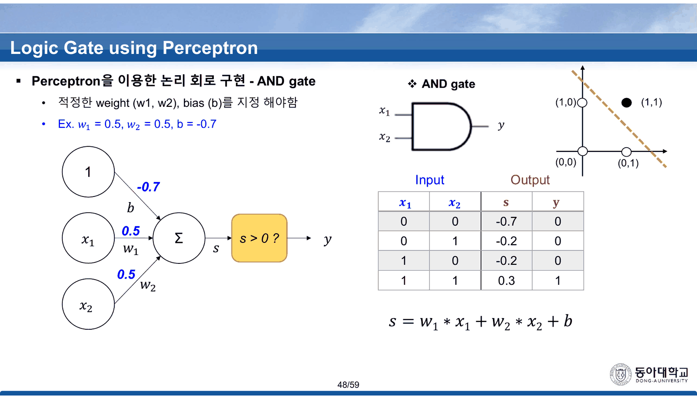
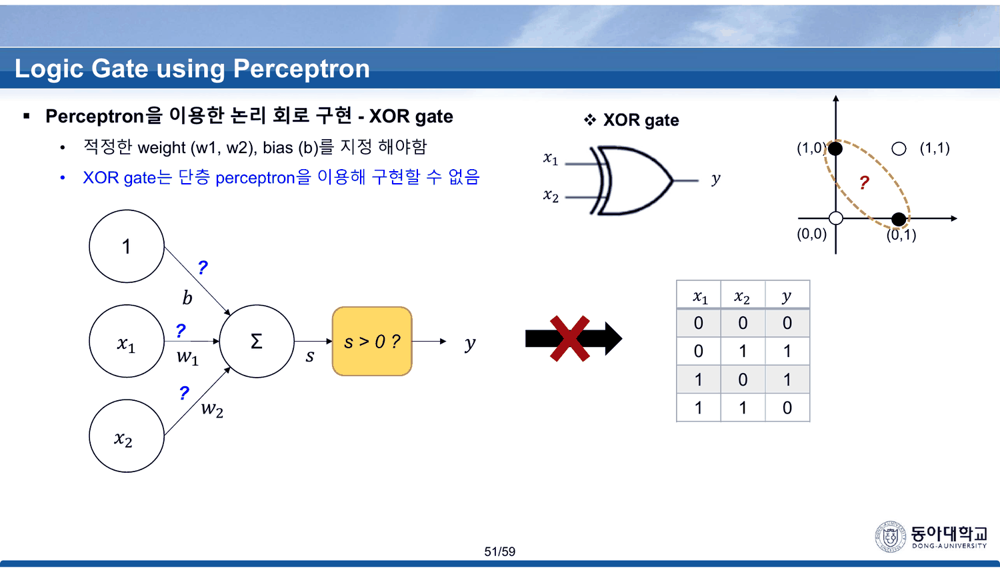
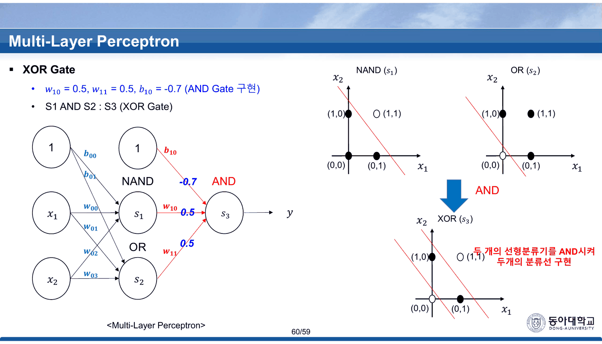
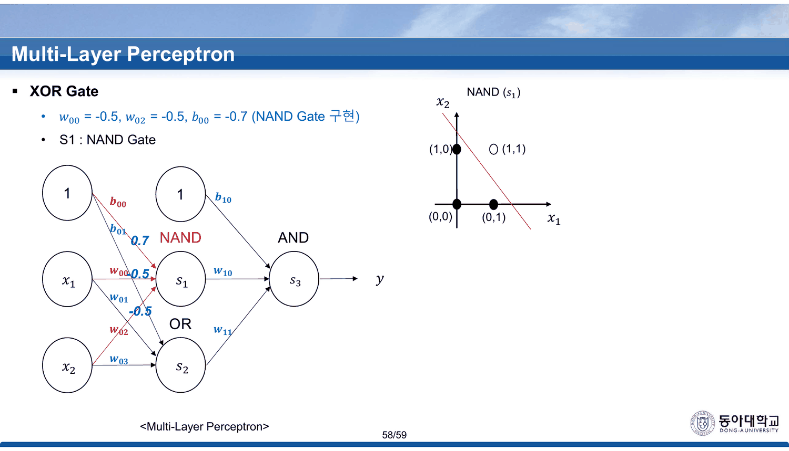
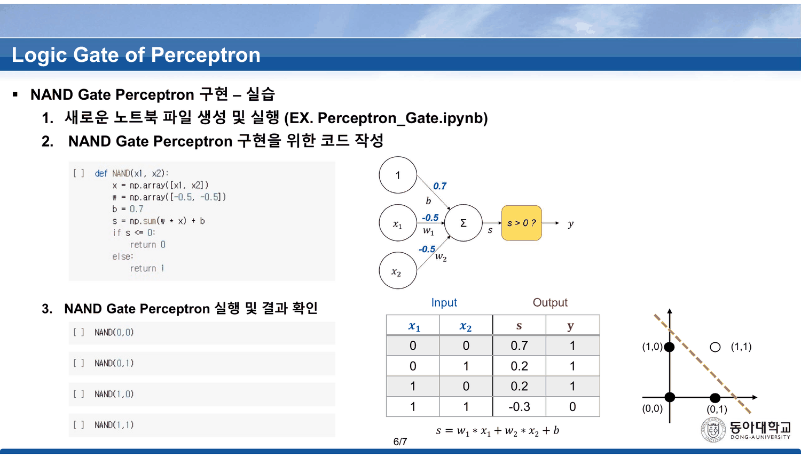
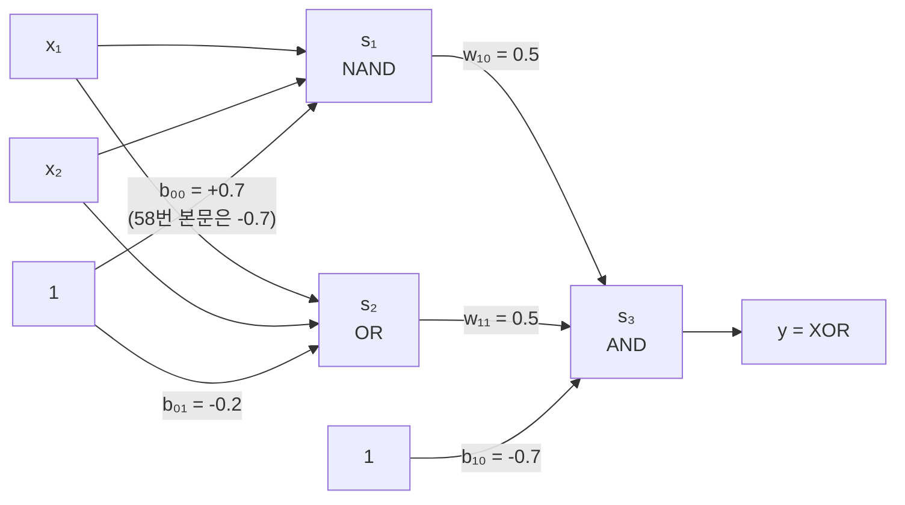

## 물음표 세 개

47~50번이 게이트 넷에 값을 붙인다. 이 덱에서 **가중치의 구체적인 값이 처음 나오는 자리**다(회귀 예제의 $w=8,\ b=10$ 이후 스물다섯 장 만이다).



| 슬라이드 | 게이트 | $w_1$ | $w_2$ | $b$ | $s$ 네 값 | 출력 |
| ---: | --- | ---: | ---: | ---: | --- | --- |
| 48 | AND | 0.5 | 0.5 | $-0.7$ | $-0.7 \cdot -0.2 \cdot -0.2 \cdot 0.3$ | 0 0 0 1 |
| 49 | OR | 0.5 | 0.5 | $-0.2$ | $-0.2 \cdot 0.3 \cdot 0.3 \cdot 0.8$ | 0 1 1 1 |
| 50 | NAND | $-0.5$ | $-0.5$ | $0.7$ | $0.7 \cdot 0.2 \cdot 0.2 \cdot -0.3$ | 1 1 1 0 |

셋 다 다시 계산해 보면 인쇄된 $s$ 값과 출력이 정확히 맞는다. 그리고 51번이 네 번째를 시도한다.



> XOR gate는 **단층 perceptron을 이용해 구현할 수 없음**

$w_1$, $w_2$, $b$ 자리에 `?` 가 셋, 그리고 평면 그림의 경계선 자리에도 `?` 가 하나 더 있다. 13번이 38장 앞에서 선언했던 것이 여기서 그림으로 확인된다.

> [!important] 이 노트의 척추
> 51번에서 52번으로 넘어가는 자리가 이 과목 전체의 전환점이다 — **한 층으로 안 되면 층을 쌓는다.** 53~60번 여덟 장이 그 쌓기를 한 단계씩 보여 주고, 마지막 60번에서 XOR이 완성된다. 그런데 그 여덟 장 안에서 **같은 네 개의 가중치가 이름을 한 번 바꾸고(55·56번 대 57~60번), 58번은 NAND의 편향을 본문에 $-0.7$, 그림에 $0.7$ 로 동시에 인쇄한다.** 본문 값을 그대로 따라가면 XOR은 네 입력 모두에 0을 낸다. 덱이 정확히 옳은 일을 하는 여덟 장에서, 따라 적기만 하면 틀리는 자리가 둘 생긴다.

---

## 쌓기 — 세 게이트로 XOR을 만든다

53번이 MLP를 꺼내고, 54번이 조립법을 준다.

> NAND Gate, OR Gate, AND Gate 서로 연결 하여 XOR Gate 구현가능

54번의 진리표가 중간 신호 $s_1$(NAND)과 $s_2$(OR)를 드러낸다.

| $x_1$ | $x_2$ | $s_1$ (NAND) | $s_2$ (OR) | $y$ (AND) | XOR 정답 |
| ---: | ---: | ---: | ---: | ---: | ---: |
| 0 | 0 | 1 | 0 | 0 | 0 |
| 0 | 1 | 1 | 1 | 1 | 1 |
| 1 | 0 | 1 | 1 | 1 | 1 |
| 1 | 1 | 0 | 1 | 0 | 0 |

$s_1$ 은 $(1,1)$ 에서만 0이고 $s_2$ 는 $(0,0)$ 에서만 0이다. **둘을 AND하면 두 모서리가 동시에 잘려 나가고 남는 것이 대각선 두 점**이다. 60번이 그것을 한 문장으로 적는다 — 「두 개의 선형분류기를 AND시켜 두개의 분류선 구현」.



### 세 게이트가 겹쳐 XOR이 되는 과정

```html preview
<div id="xr" style="font-family:system-ui,-apple-system,sans-serif;color:var(--foreground);background:var(--card);border:1px solid var(--border);border-radius:12px;padding:18px 16px;">
  <p style="margin:0 0 12px;font-size:13px;color:var(--muted-foreground);line-height:1.7;">
    58 · 59 · 60번이 붙여 나가는 순서 그대로 — NAND(s₁) → OR(s₂) → AND(s₃). 단계를 눌러 각 평면과 진리표를 본다.
    값은 전부 슬라이드에 인쇄된 것이다.</p>
  <div id="xrb" style="display:flex;flex-wrap:wrap;gap:5px;margin-bottom:12px;"></div>
  <svg id="xrs" viewBox="0 0 620 230" style="width:100%;height:auto;display:block;"></svg>
  <div id="xro" style="margin-top:8px;font-size:13.5px;line-height:1.9;font-variant-numeric:tabular-nums;min-height:3.4em;"></div>
  <style>#xr .xb{font:inherit;font-size:12px;padding:4px 11px;cursor:pointer;border:1px solid var(--border);
    background:transparent;color:var(--muted-foreground);border-radius:6px;}
    #xr .xb.on{background:var(--chart-1);border-color:var(--chart-1);color:var(--card);font-weight:700;}</style>
</div>
<script>
(function(){
  const NS='http://www.w3.org/2000/svg', svg=document.getElementById('xrs');
  const el=(t,a,x)=>{const e=document.createElementNS(NS,t);for(const k in a)e.setAttribute(k,a[k]);
    if(x!==undefined)e.textContent=x;return e;};
  const P=[[0,0],[0,1],[1,0],[1,1]];
  const nand=(a,b)=>(-0.5*a-0.5*b+0.7)>0?1:0;
  const or  =(a,b)=>(0.5*a+0.5*b-0.2)>0?1:0;
  const and =(a,b)=>(0.5*a+0.5*b-0.7)>0?1:0;
  const ST=[
    {n:'① NAND (58번)',s:'w₀₀ = -0.5, w₀₂ = -0.5, b₀₀ = 0.7', f:(a,b)=>nand(a,b),
     d:'(1,1) 하나만 0이 된다. 58번의 평면 그림에서 그 점만 빈 원으로 그려져 있다.'},
    {n:'② OR (59번)',s:'w₀₁ = 0.5, w₀₃ = 0.5, b₀₁ = -0.2', f:(a,b)=>or(a,b),
     d:'(0,0) 하나만 0이 된다. NAND가 자른 모서리와 <b>반대쪽 모서리</b>다.'},
    {n:'③ AND (60번)',s:'w₁₀ = 0.5, w₁₁ = 0.5, b₁₀ = -0.7', f:(a,b)=>and(nand(a,b),or(a,b)),
     d:'두 결과를 AND한다. 양쪽 모서리가 동시에 잘려 <b>대각선 두 점만 1</b>로 남는다 — XOR이다.'},
    {n:'⚠ 58번 본문의 b = -0.7 로 계산하면',s:'w₀₀ = -0.5, w₀₂ = -0.5, b₀₀ = -0.7 (본문 표기)',
     f:(a,b)=>{const s1=(-0.5*a-0.5*b-0.7)>0?1:0; return and(s1,or(a,b));},
     d:'<b style="color:var(--chart-2)">네 입력 모두 0이 된다.</b> b가 음수면 NAND의 s₁이 어디서도 켜지지 않고, 그러면 AND도 켜지지 않는다.', bad:true}];
  let sel=0;
  const L=60,R=300,T=24,B=186;
  const sx=v=>L+(v+0.35)/1.7*(R-L), sy=v=>B-(v+0.35)/1.7*(B-T);
  function draw(){
    const st=ST[sel]; svg.textContent='';
    svg.appendChild(el('line',{x1:sx(-0.35),y1:sy(0),x2:sx(1.35),y2:sy(0),stroke:'var(--border)'}));
    svg.appendChild(el('line',{x1:sx(0),y1:sy(-0.35),x2:sx(0),y2:sy(1.35),stroke:'var(--border)'}));
    svg.appendChild(el('text',{x:sx(1.35),y:sy(0)+16,'text-anchor':'end','font-size':11,fill:'var(--muted-foreground)'},'x₁'));
    svg.appendChild(el('text',{x:sx(0)-8,y:sy(1.35),'text-anchor':'end','font-size':11,fill:'var(--muted-foreground)'},'x₂'));
    const rows=[];
    P.forEach(([a,b])=>{
      const v=st.f(a,b); rows.push([a,b,v]);
      svg.appendChild(el('circle',{cx:sx(a),cy:sy(b),r:9,
        fill: v? (st.bad?'var(--chart-2)':'var(--chart-1)') : 'var(--card)',
        stroke:'var(--foreground)','stroke-width':1.8}));
      svg.appendChild(el('text',{x:sx(a),y:sy(b)-16,'text-anchor':'middle','font-size':10,
        fill:'var(--muted-foreground)'},'('+a+','+b+')'));
    });
    const TL=346;
    svg.appendChild(el('text',{x:TL,y:T+6,'font-size':11.5,fill:'var(--muted-foreground)','font-weight':700},'x₁  x₂'));
    svg.appendChild(el('text',{x:TL+96,y:T+6,'font-size':11.5,fill:'var(--muted-foreground)','font-weight':700},'출력'));
    svg.appendChild(el('text',{x:TL+164,y:T+6,'font-size':11.5,fill:'var(--muted-foreground)','font-weight':700},'XOR 정답'));
    rows.forEach((r,i)=>{
      const y=T+32+i*30, xr=r[0]^r[1], ok=(sel<2)||r[2]===xr;
      svg.appendChild(el('text',{x:TL,y:y,'font-size':13,fill:'var(--foreground)'},r[0]+'   '+r[1]));
      svg.appendChild(el('text',{x:TL+96,y:y,'font-size':13,'font-weight':700,
        fill: r[2]? (st.bad?'var(--chart-2)':'var(--chart-1)'):'var(--muted-foreground)'}, r[2]));
      svg.appendChild(el('text',{x:TL+172,y:y,'font-size':13,
        fill: ok?'var(--muted-foreground)':'var(--chart-2)','font-weight': ok?400:700}, xr+(ok?'':'  ✗')));
    });
    svg.appendChild(el('text',{x:L-6,y:216,'font-size':10.5,fill:'var(--muted-foreground)'},
      '채워진 원 = 출력 1 · 빈 원 = 출력 0'));
  }
  function upd(){ draw();
    document.getElementById('xro').innerHTML='<b style="color:'+(ST[sel].bad?'var(--chart-2)':'var(--chart-1)')+'">'+
      ST[sel].n+'</b> &nbsp;<span style="font-size:12.5px;color:var(--muted-foreground)">'+ST[sel].s+'</span>'+
      '<div style="margin-top:5px;font-size:12.5px;color:var(--muted-foreground);line-height:1.8">'+ST[sel].d+'</div>';
  }
  const bar=document.getElementById('xrb');
  ST.forEach((st,i)=>{const b=document.createElement('button');b.className='xb'+(i===0?' on':'');
    b.textContent=st.n; b.onclick=()=>{sel=i;[...bar.children].forEach((c,j)=>c.classList.toggle('on',j===i));upd();};
    bar.appendChild(b);});
  upd();
})();
</script>

---

## 같은 네 개의 가중치가 이름을 바꾼다

55~60번은 같은 그림 하나를 조금씩 채워 가는 여섯 장이다. 입력 둘, 은닉 노드 둘($s_1$, $s_2$), 출력 하나($s_3$). 입력에서 은닉으로 가는 선은 넷이고, 그 넷에 이름이 붙는다.

| 슬라이드 | $x_1 \to s_1$ | $x_1 \to s_2$ | $x_2 \to s_1$ | $x_2 \to s_2$ |
| ---: | --- | --- | --- | --- |
| 55 · 56 | $w_{00}$ | $w_{01}$ | $w_{03}$ | $w_{04}$ |
| 57 · 58 · 59 · 60 | $w_{00}$ | $w_{01}$ | $w_{02}$ | $w_{03}$ |

**55·56번은 $w_{02}$ 를 건너뛰고 $w_{04}$ 를 쓴다.** 57번부터 네 이름이 $w_{00}$~$w_{03}$ 으로 정리되고, 그 뒤로는 바뀌지 않는다. 같은 그림의 같은 선이 슬라이드 하나를 넘으면서 다른 이름을 갖는다.

편향 쪽은 반대로 일관된다 — $b_{00}$, $b_{01}$(은닉층), $b_{10}$(출력층)이 여섯 장 내내 같다.

---

## 58번 — 본문과 그림이 부호를 두고 갈린다

58번은 NAND를 채워 넣는 장이다. 본문 첫 줄이 이렇게 적혀 있다.

> $w_{00}$ = -0.5, $w_{02}$ = -0.5, $b_{00}$ = **-0.7** (NAND Gate 구현)

그런데 같은 슬라이드의 그림에서 편향 선 옆에 붉게 적힌 값은 **0.7** 이다.



어느 쪽이 맞는지는 여덟 장 앞의 50번이 이미 말해 두었다 — NAND는 $w_1 = w_2 = -0.5$, $b = +0.7$ 이다. 그리고 같은 과목의 `Perceptron (실습)` 덱 6번이 코랩 실행 결과로 같은 값을 다시 확인한다.



> [!caution] 본문 값을 그대로 쓰면 XOR이 통째로 죽는다
> $b_{00} = -0.7$ 로 두면 NAND의 가중합은 네 입력에서 $-0.7,\ -1.2,\ -1.2,\ -1.7$ 이 되어 **어디서도 임계값을 넘지 못한다.** $s_1$ 이 항상 0이면 마지막 AND($0.5 s_1 + 0.5 s_2 - 0.7$)도 최대 $-0.2$ 라 항상 0이다.
>
> | $x_1$ | $x_2$ | $b_{00}=0.7$ (그림) | $b_{00}=-0.7$ (본문) | XOR 정답 |
> | ---: | ---: | ---: | ---: | ---: |
> | 0 | 0 | 0 | 0 | 0 |
> | 0 | 1 | **1** | 0 | 1 |
> | 1 | 0 | **1** | 0 | 1 |
> | 1 | 1 | 0 | 0 | 0 |
>
> 두 줄이 틀리는 것이 아니라 **분류기 전체가 상수 함수가 된다.** 위 인터랙티브의 네 번째 단추가 그 상태다.

59번과 60번은 본문 표기가 정확하다 — 59번 `$w_{01}$ = 0.5, $w_{02}$ = 0.5, $b_{01}$ = -0.2 (OR Gate 구현)`, 60번 `$w_{10}$ = 0.5, $w_{11}$ = 0.5, $b_{10}$ = -0.7 (AND Gate 구현)`. **여덟 장 중 한 장에서만 부호가 빠졌다.**



---

## 여섯을 소개하고 셋만 만든다

42~44번이 논리 회로를 소개한다. 표와 기호가 함께 인쇄된다.

| 슬라이드 | 소개된 게이트 | 퍼셉트론으로 구현되는가 |
| ---: | --- | --- |
| 42 | AND · OR · **NOT** | AND(48번) · OR(49번) / NOT은 **없음** |
| 43 | NAND · **NOR** | NAND(50번) / NOR은 **없음** |
| 44 | XOR | 51번에서 불가능 선언 → 53~60번에서 층을 쌓아 구현 |

**NOT과 NOR은 표만 나오고 가중치가 붙지 않는다.** 둘 다 어렵지 않다 — NOT은 입력이 하나뿐이고($w = -1$, $b = 0.5$), NOR은 50번의 NAND에서 편향만 바꾸면 된다($w_1 = w_2 = -0.5$, $b = 0.2$). 덱이 고른 셋(AND · OR · NAND)은 **60번에서 XOR을 조립할 때 실제로 쓰이는 셋**이고, 나머지 둘은 소개만 되고 지나간다.

### 단층 퍼셉트론이 만들 수 있는 것 전부

두 입력에 대한 불 함수는 $2^{2^2} = 16$ 가지다. 12번의 규칙으로 만들 수 있는 것이 몇 개인지 직접 세어 보면 이렇게 된다.

```html preview
<div id="bf" style="font-family:system-ui,-apple-system,sans-serif;color:var(--foreground);background:var(--card);border:1px solid var(--border);border-radius:12px;padding:18px 16px;">
  <p style="margin:0 0 12px;font-size:13px;color:var(--muted-foreground);line-height:1.7;">
    두 입력 불 함수 16가지 전부. 각 칸을 눌러 12번의 규칙으로 그 출력을 낼 수 있는지,
    낼 수 있다면 한 가지 해를 본다. (가중치와 편향을 −1.5~1.5 범위에서 0.1 간격으로 전수 탐색한 결과다.)</p>
  <div id="bfg" style="display:grid;grid-template-columns:repeat(4,1fr);gap:6px;margin-bottom:12px;"></div>
  <div id="bfo" style="font-size:13.5px;line-height:1.95;font-variant-numeric:tabular-nums;min-height:5em;"></div>
  <style>#bf .bc{font:inherit;font-size:12px;padding:8px 6px;cursor:pointer;border:1px solid var(--border);
    background:transparent;color:var(--foreground);border-radius:7px;text-align:center;line-height:1.5;}
    #bf .bc.no{border-color:var(--chart-2);color:var(--chart-2);}
    #bf .bc.on{background:var(--chart-1);border-color:var(--chart-1);color:var(--card);font-weight:700;}
    #bf .bc.no.on{background:var(--chart-2);border-color:var(--chart-2);color:var(--card);}</style>
</div>
<script>
(function(){
  // 출력 순서는 (0,0) (0,1) (1,0) (1,1)
  const D=[
    [[0,0,0,0],'항상 0',[-1.5,-1.5,-1.5],''],
    [[0,0,0,1],'AND',[0.5,0.5,-0.7],'48번'],
    [[0,0,1,0],'x₁ ∧ ¬x₂',[1.5,-1.5,-1.4],''],
    [[0,0,1,1],'x₁',[1.5,0.0,-1.4],''],
    [[0,1,0,0],'¬x₁ ∧ x₂',[-1.5,1.5,-1.4],''],
    [[0,1,0,1],'x₂',[0.0,1.5,-1.4],''],
    [[0,1,1,0],'XOR',null,'51번 · 60번'],
    [[0,1,1,1],'OR',[0.5,0.5,-0.2],'49번'],
    [[1,0,0,0],'NOR',[-0.5,-0.5,0.2],'43번(표만)'],
    [[1,0,0,1],'XNOR',null,''],
    [[1,0,1,0],'¬x₂',[0.0,-1.5,0.1],''],
    [[1,0,1,1],'x₁ ∨ ¬x₂',[0.1,-0.1,0.1],''],
    [[1,1,0,0],'¬x₁',[-1.5,0.0,0.1],''],
    [[1,1,0,1],'¬x₁ ∨ x₂',[-1.5,1.5,0.1],''],
    [[1,1,1,0],'NAND',[-0.5,-0.5,0.7],'50번'],
    [[1,1,1,1],'항상 1',[0.0,0.0,0.1],'']];
  const P=[[0,0],[0,1],[1,0],[1,1]];
  const g=document.getElementById('bfg'), o=document.getElementById('bfo');
  let sel=6;
  function paint(){
    g.innerHTML='';
    D.forEach((d,i)=>{
      const b=document.createElement('button');
      b.className='bc'+(d[2]?'':' no')+(i===sel?' on':'');
      b.innerHTML='<b>'+d[1]+'</b><br><span style="font-size:10.5px;opacity:.75">'+d[0].join('')+'</span>';
      b.onclick=()=>{sel=i;paint();};
      g.appendChild(b);
    });
    const d=D[sel];
    let h='<b>'+d[1]+'</b> — 출력 패턴 '+d[0].join(' ')+(d[3]?' <span style="font-size:12px;color:var(--muted-foreground)">('+d[3]+')</span>':'');
    if(d[2]){
      const [w1,w2,b0]=d[2];
      h+='<div style="margin-top:5px;font-size:12.5px">한 가지 해: <b>w₁ = '+w1+', w₂ = '+w2+', b = '+b0+'</b></div>'+
         '<div style="margin-top:4px;font-size:12px;color:var(--muted-foreground)">'+
         P.map(([a,c],k)=>'('+a+','+c+') → s = '+(w1*a+w2*c+b0).toFixed(2)+' → '+d[0][k]).join(' &nbsp;·&nbsp; ')+'</div>';
    } else {
      h+='<div style="margin-top:5px;font-size:12.5px;color:var(--chart-2)"><b>직선 하나로는 만들 수 없다.</b> '+
         '1을 내야 할 두 점이 평면의 대각선 양 끝에 있어, 어떤 직선을 그어도 0을 내야 할 점 하나가 같은 쪽에 남는다.</div>';
    }
    const n=D.filter(x=>x[2]).length;
    h+='<div style="margin-top:8px;font-size:12.5px;color:var(--muted-foreground)">16가지 중 <b style="color:var(--foreground)">'+
       n+'가지</b>를 단층으로 만들 수 있고, 못 만드는 둘이 <b style="color:var(--chart-2)">XOR</b>과 <b style="color:var(--chart-2)">XNOR</b>이다. '+
       '덱이 실제로 값을 붙이는 것은 그중 <b style="color:var(--foreground)">셋</b>(AND · OR · NAND)뿐이다.</div>';
    o.innerHTML=h;
  }
  paint();
})();
</script>

**16가지 중 14가지가 단층으로 만들어지고, 못 만드는 둘이 XOR과 XNOR이다.** 51번이 물음표를 남긴 자리는 이 둘뿐이고, 둘은 서로의 부정이라 사실상 하나의 벽이다. 13번이 「어떤 방법으로도」라고 적은 것의 정확한 크기가 이 정도다 — **못 하는 것은 전체의 1/8이고, 그 1/8 때문에 열여섯 해의 겨울이 온다.**


---

## 평면 그림의 점 이름이 축과 뒤바뀌어 있다

47 · 48 · 49 · 50 · 51 · 53 · 58 · 59 · 60번에 같은 형태의 작은 평면 그림이 붙는다. 네 점의 이름표 배치가 이렇다.

```text
 (1,0)      (1,1)          ← 위쪽 줄
 (0,0)      (0,1)          ← 아래쪽 줄
```

가로축이 $x_1$, 세로축이 $x_2$ 이므로 **오른쪽 아래 점은 $(x_1, x_2) = (1, 0)$ 이어야 하는데 `(0,1)` 로 적혀 있고, 왼쪽 위는 $(0,1)$ 이어야 하는데 `(1,0)` 이다.** 이름표가 $(x_2, x_1)$ 순서로 읽히고 있다.

이 뒤바뀜이 눈에 띄지 않는 이유가 있다 — **이 덱에 나오는 게이트가 전부 대칭이기 때문**이다. AND · OR · NAND · XOR 모두 $x_1$ 과 $x_2$ 를 바꿔도 같은 함수라, 두 점의 이름이 서로 바뀌어도 그림의 색칠이 달라지지 않는다. 비대칭 게이트(예컨대 $x_1 \land \lnot x_2$) 하나만 들어왔어도 즉시 드러났을 것이다.

---

## 45~46번 — 두 방법을 나란히 놓는다

논리 게이트 절의 시작에 작은 대비가 하나 있다. 45번이 **조건문으로 짠 AND 게이트**를 순서도로 그린다.

> Input (x1, x2) → `x1 == 1 ?` → No면 `y = 0` / Yes면 → `x2 == 1 ?` → No면 `y = 0` / Yes면 `y = 1`

그리고 46번이 같은 AND를 **이진 분류**로 다시 그린다 — 평면 위의 네 점과 직선 하나.

두 그림은 같은 진리표를 만들지만 성격이 다르다. 45번은 **규칙을 사람이 써 넣은 것**이고, 46번은 **경계를 값으로 정한 것**이다. 7번이 기호주의를 「규칙 기반(Rule-based)」이라 정의했던 것을 떠올리면, 45번과 46번은 **덱이 처음에 세운 두 진영을 한 문제 위에 겹쳐 놓은 자리**다. 45번의 제목은 `일반적인 방법을 통한 logic gate 구현 예시` 이고, 덱은 두 방법을 비교하지는 않는다.

---

## 원본에서 발견한 것

`부호 오류`

- **58번 — 본문은 $b_{00} = -0.7$, 같은 슬라이드의 그림은 $0.7$.** 여덟 장 앞 50번과 `Perceptron (실습)` 덱 6번이 모두 $+0.7$ 이므로 본문 쪽이 틀렸다. 본문 값으로 계산하면 NAND의 $s_1$ 이 네 입력에서 모두 0이 되고, 그 결과 XOR 전체가 **네 입력 모두 0을 내는 상수 함수**가 된다. 59 · 60번의 본문 표기는 정확하다

`이름이 바뀌는 것`

- **입력층 가중치 네 개의 이름이 56번과 57번 사이에서 바뀐다** — 55 · 56번은 $w_{00} \cdot w_{01} \cdot w_{03} \cdot w_{04}$ 로 $w_{02}$ 를 건너뛰고, 57~60번은 $w_{00} \cdot w_{01} \cdot w_{02} \cdot w_{03}$ 이다. 같은 그림의 같은 네 선이다. 편향 $b_{00} \cdot b_{01} \cdot b_{10}$ 은 여섯 장 내내 일관된다

`그림의 좌표 표기`

- **평면 그림의 점 이름표가 축 순서와 뒤바뀌어 있다** — 오른쪽 아래가 `(0,1)`, 왼쪽 위가 `(1,0)` 으로, $(x_2, x_1)$ 순으로 읽힌다. 47 · 48 · 49 · 50 · 51 · 53 · 58 · 59 · 60번에 같은 방식으로 반복된다. 이 덱의 게이트가 모두 대칭 함수라 그림의 결과는 달라지지 않는다

`덱 구성`

- **꼬리표가 총 쪽수를 넘는다** — 모든 장이 `n/59` 인데 PDF는 61쪽이라 마지막 두 장이 `60/59` · `61/59` 다. `Perceptron (실습)` 덱도 같은 방식으로 마지막 장이 `8/7` 이다
- **`Perceptron (실습)` 덱 4~6번의 계산표가 이론 덱 48~50번과 값까지 같다.** 실습 덱은 코랩에서 같은 값을 실행해 확인하는 구성이고, 7번의 XOR 자리는 이론 덱 51번처럼 `?` 로 남아 있다
- **목차 슬라이드가 다섯 번 나온다** — 3 · 18 · 28 · 41 · 52번. 같은 다섯 줄이 매번 그대로 인쇄된다
- **45번의 순서도와 46번의 이진 분류가 같은 AND 게이트를 두 방식으로 그린다.** 덱은 둘을 비교하지 않는다
- **42~44번이 여섯 게이트를 소개하고 47~50번은 셋에만 값을 붙인다.** NOT과 NOR은 표만 나오고 퍼셉트론 구현이 없다. 값을 얻는 셋(AND · OR · NAND)은 정확히 60번에서 XOR을 조립할 때 쓰이는 셋이다

---

## 근거 자료

`sources/Perceptron (이론).pdf` 41~61쪽과 `sources/Perceptron (실습).pdf` 전체(8쪽). 이론 덱 이 구간에서 추출 텍스트가 정상 작동하지 않는 쪽은 41 · 44 · 45 · 52 · 57번 다섯 장이라 130 dpi로 렌더해 읽었고, 55 · 57 · 58번은 첨자와 부호를 확인하려고 150 dpi로 다시 확대했다.

| 슬라이드 | 내용 |
| ---: | --- |
| 42~44 | 논리 회로 여섯 종의 진리표 — AND · OR · NOT · NAND · NOR · XOR |
| 45~46 | 같은 AND를 순서도와 이진 분류 두 방식으로 |
| 47~50 | AND · OR · NAND에 가중치와 계산표가 붙는다 |
| 51 | XOR — 물음표 셋 |
| 53~60 | NAND · OR · AND를 쌓아 XOR을 만든다 |

인용한 슬라이드 다섯 장 — 이론 덱 48 · 51 · 58 · 60번과 실습 덱 6번. 네 게이트의 진리표는 인쇄된 $(w_1, w_2, b)$ 로 네 입력을 전부 다시 계산해 대조했고, 58번 본문의 $b_{00} = -0.7$ 이 XOR 전체를 상수 함수로 만드는 것도 같은 방식으로 확인했다. 두 입력 불 함수 16가지의 분리 가능성은 $w_1, w_2, b$ 를 $-1.5$~$1.5$ 범위에서 $0.1$ 간격으로 전수 탐색해 구했다(가능 14, 불가능 2).

### 이어지는 곳

- [[02. 예측을 먼저 보여 주고, 그 예측이 나오지 않는 모델을 보여 준다]] — 같은 덱 18~40번. 31번이 「구현함」이라고만 적은 결정 경계에 여기서 처음으로 값이 붙는다
- [[01. 빌려 온 그림이 양쪽을 다 찌른다]] — 12번의 두 계산 예시가 여기 49번(OR)·50번(NAND)의 값과 같다는 관찰
- [[04. 목록은 길고 고르는 기준은 한 줄이다]] — `MLP (이론)` 덱. 여기서 손으로 정한 가중치를 **어떻게 찾을 것인가**가 그 덱과 `Backpropagation (이론)` 덱의 주제다
