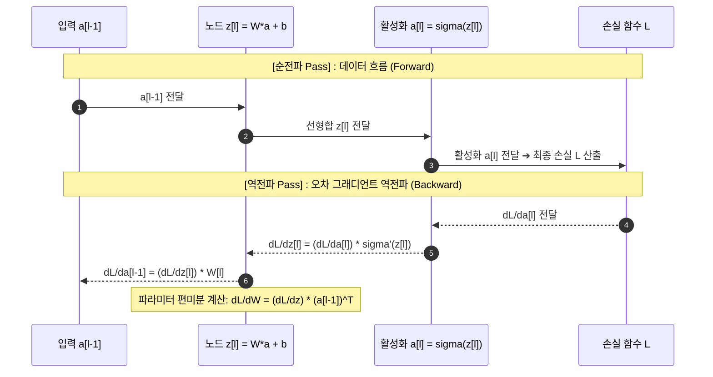

> [!abstract] 핵심 요약
> **오차역전파(Backpropagation)**는 출력층에서 발생한 오차(Loss)를 역방향으로 전파하며 미분의 **연쇄 법칙(Chain Rule)**을 통해 각 계층의 가중치와 편향에 대한 편미분(Gradient)을 효율적으로 계산하는 알고리즘이다.
> 순전파(Forward Pass) 시 중간 활성화 값을 캐싱하고, 역전파(Backward Pass) 시 출력단에서 입력단으로 거슬러 올라가며 국소 미분(Local Gradient)을 곱해줌으로써 $O(N)$의 계산 복잡도로 모든 파라미터의 그래디언트를 구한다.

---

## 1. 연쇄 법칙(Chain Rule)과 계산 그래프 역전파

$$rac{\partial \mathcal{L}}{\partial w_{ij}^{[l]}} = rac{\partial \mathcal{L}}{\partial z_i^{[l]}} \cdot rac{\partial z_i^{[l]}}{\partial w_{ij}^{[l]}} = \delta_i^{[l]} \cdot a_j^{[l-1]}$$



---

## 2. 출력층 및 은닉층의 오차 델타($\delta$) 수식

### 1) 평균 제곱 오차(MSE) + 시그모이드 출력층
$$\delta^{[L]} = rac{\partial \mathcal{L}}{\partial z^{[L]}} = (\hat{y} - y) \cdot \sigma'(z^{[L]}) = (\hat{y} - y) \cdot \hat{y}(1 - \hat{y})$$

### 2) 교차 엔트로피(Cross-Entropy) + 소프트맥스 출력층
$$\delta^{[L]} = \hat{\mathbf{y}} - \mathbf{y} \quad (	ext{경이로운 단순성!})$$

---

## 3. 실시간 2노드 오차역전파 그래디언트 계산기

```html preview
<div style="font-family:system-ui,-apple-system,sans-serif;padding:20px;background:var(--card);color:var(--card-foreground);border:1px solid var(--border);border-radius:var(--radius)">
  <div style="font-size:16px;font-weight:700;margin-bottom:14px;color:var(--primary);display:flex;align-items:center;gap:8px">
    <span>🔄 2노드 오차역전파(Backpropagation) 그래디언트 연산기</span>
  </div>

  <div style="display:grid;grid-template-columns:1fr 1fr;gap:12px;margin-bottom:14px">
    <div>
      <label style="font-size:11px;color:var(--muted-foreground)">타깃 정답 레이블 (y):</label>
      <input id="inBpTarget" type="number" value="1.0" step="0.1" style="width:100%;padding:4px 8px;background:var(--background);color:var(--foreground);border:1px solid var(--border);border-radius:var(--radius);font-weight:700" />
    </div>
    <div>
      <label style="font-size:11px;color:var(--muted-foreground)">현재 예측값 (y_hat):</label>
      <input id="inBpPred" type="number" value="0.4" step="0.1" style="width:100%;padding:4px 8px;background:var(--background);color:var(--foreground);border:1px solid var(--border);border-radius:var(--radius);font-weight:700" />
    </div>
  </div>

  <div style="display:grid;grid-template-columns:1fr 1fr;gap:12px;margin-bottom:12px">
    <div style="padding:10px;background:var(--background);border:1px solid var(--border);border-radius:var(--radius)">
      <div style="font-size:10px;color:var(--muted-foreground)">오차 델타 delta = (y_hat - y)</div>
      <div id="deltaOut" style="font-family:monospace;font-size:16px;font-weight:800;color:var(--destructive,#ef4444);margin-top:2px">-0.60</div>
    </div>
    <div style="padding:10px;background:var(--background);border:1px solid var(--border);border-radius:var(--radius)">
      <div style="font-size:10px;color:var(--muted-foreground)">가중치 그래디언트 dL/dw (x=2.0)</div>
      <div id="gradWOut" style="font-family:monospace;font-size:16px;font-weight:800;color:var(--primary);margin-top:2px">-1.20</div>
    </div>
  </div>

  <div id="bpDesc" style="padding:10px;background:var(--background);border:1px solid var(--border);border-radius:var(--radius);font-size:11px">
    dL/dw가 음수(-1.20)이므로 경사하강법(w := w - lr * grad)에 의해 가중치 w는 양의 방향으로 증가하여 오차를 줄입니다.
  </div>

  <script>
    function updateBp() {
      var y = parseFloat(document.getElementById('inBpTarget').value) || 1.0;
      var yHat = parseFloat(document.getElementById('inBpPred').value) || 0.4;
      var x = 2.0;

      var delta = yHat - y;
      var gradW = delta * x;

      document.getElementById('deltaOut').textContent = delta.toFixed(2);
      document.getElementById('gradWOut').textContent = gradW.toFixed(2);
      document.getElementById('bpDesc').innerHTML = "가중치 갱신 방향: <code>w := w - (" + (0.1 * gradW).toFixed(3) + ")</code> (학습률 lr=0.1 적용 시 가중치 +" + (-0.1 * gradW).toFixed(3) + " 증가)";
    }

    ['inBpTarget', 'inBpPred'].forEach(function(id) {
      document.getElementById(id).addEventListener('input', updateBp);
    });
    updateBp();
  </script>
</div>
```
