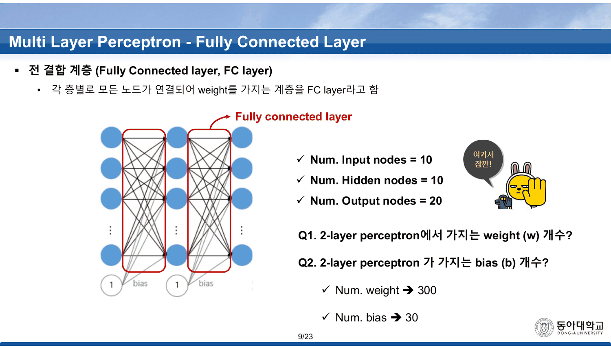
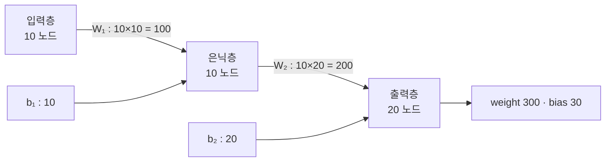
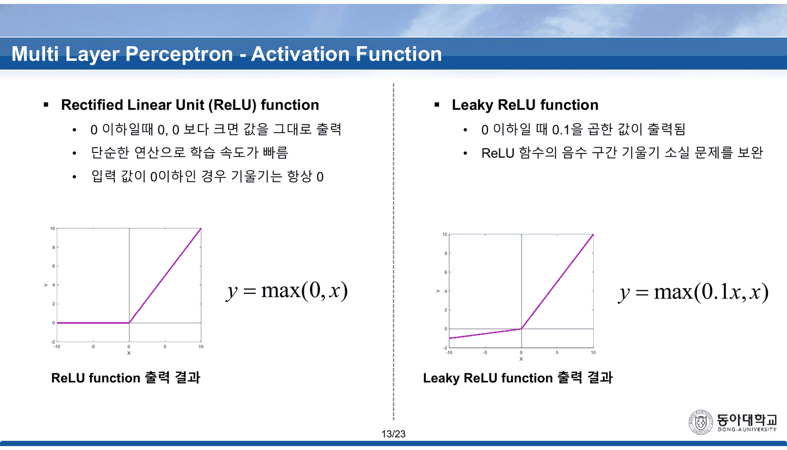
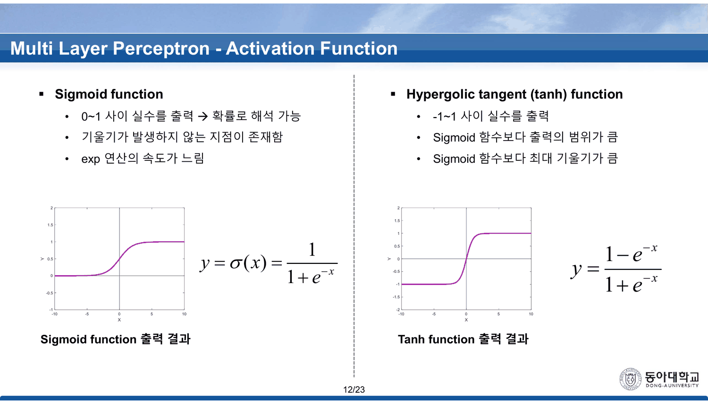
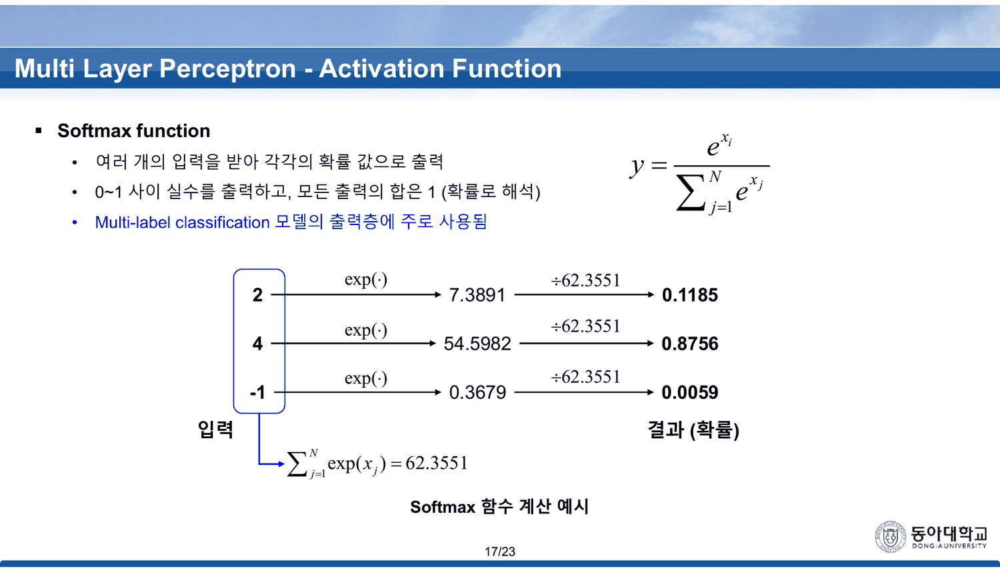
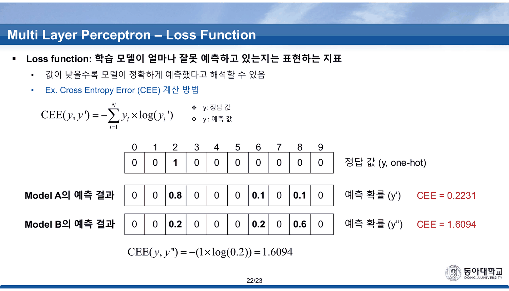

## 층을 행렬 두 줄로 접는다

3~7번이 퍼셉트론에서 MLP로 넘어간다. 방식은 **표기를 바꾸는 것**이다.

| 슬라이드 | 무엇이 되는가 |
| ---: | --- |
| 4 | 노드 하나 — $y = h(w_1x_1 + \cdots + w_{10}x_{10} + b)$, 그리고 같은 것을 $W$ 와 $X$ 로 |
| 5 | 노드 둘 — $W$ 가 $10 \times 2$ 가 되고 $y_1, y_2$ 가 나온다 |
| 6 | 그 둘을 한 줄로 — $h\!\left(W^{T}X + \boldsymbol b\right)$, $(2 \times 10)(10 \times 1) \to (2 \times 1)$ |
| 7 | 층 둘 — $\;Y = h\!\left(W_2\,h(W_1X + \boldsymbol b_1) + \boldsymbol b_2\right)$ |

세 장에 걸쳐 합이 행렬곱이 되고, 네 번째 장에서 **그 행렬곱이 자기 자신 안에 한 번 더 들어간다.** 이것이 층을 쌓는다는 말의 수식판이고, [[03. 다섯 장에 걸쳐 XOR을 쌓는 동안 이름이 두 번 바뀌고 부호가 한 번 틀린다|앞 덱 55~60번]]이 그림으로 한 것과 같은 일이다.

8~9번이 곧바로 비용을 계산하게 한다.



> Num. Input nodes = 10 · Num. Hidden nodes = 10 · Num. Output nodes = 20
> **Q1.** 2-layer perceptron에서 가지는 weight (w) 개수? → **300**
> **Q2.** 2-layer perceptron 가 가지는 bias (b) 개수? → **30**

다시 세어 보면 맞는다 — 가중치 $10 \times 10 + 10 \times 20 = 100 + 200 = 300$, 편향 $10 + 20 = 30$. **이 덱에서 학생이 직접 계산하게 하는 자리는 여기 하나다.**



> [!important] 이 노트의 척추
> 10번부터 19번까지가 활성화 함수 **여덟 개**, 20번부터 22번까지가 손실 함수 **셋**이다. 열한 개의 선택지가 각각 두세 줄씩 설명과 함께 놓인다. 그런데 **「언제 이것을 고르는가」가 적힌 것은 셋뿐**이다 — Linear(회귀 출력층), Step(이진분류 출력층), Softmax(다중 분류 출력층). Sigmoid · tanh · ReLU · Leaky ReLU · PReLU 다섯에는 그런 문장이 없고, 손실 함수 셋에는 아예 없다. **이 덱에서 두 선택지가 실제로 맞붙는 자리는 마지막 두 장뿐이다** — 같은 정답에 대한 두 모델의 교차 엔트로피.

---

## 여덟 개의 함수, 세 개의 용도

10~17번을 표로 접으면 이렇게 된다. 오른쪽 칸이 비어 있는 다섯 개가 이 절의 공백이다.

| 슬라이드 | 함수 | 인쇄된 식 | 어디에 쓰는지 적혀 있는가 |
| ---: | --- | --- | --- |
| 11 | Linear | $y = x$ | **회귀 문제의 출력층** |
| 11 | Step | $x \le 0 \to 0$ | **이진분류 출력층** (단, 「역전파를 통한 학습 불가능(미분불가)」) |
| 12 | Sigmoid | $\sigma(x) = \dfrac{1}{1+e^{-x}}$ | — |
| 12 | tanh | $\dfrac{1-e^{-x}}{1+e^{-x}}$ | — |
| 13 | ReLU | $\max(0, x)$ | — |
| 13 | Leaky ReLU | $\max(0.1x,\ x)$ | — |
| 14 | PReLU | $\max(\alpha x,\ x)$, $\alpha$ 는 학습 대상 | — |
| 15~17 | Softmax | $y_i = \dfrac{e^{x_i}}{\sum_j e^{x_j}}$ | **다중 분류 출력층** |



Step 함수의 두 줄이 서로 당긴다 — 「역전파를 통한 학습 불가능 (미분불가)」과 「이진분류시 출력층에서 사용하기 적합함」이 같은 칸에 있다. 학습이 안 되는 함수를 출력층에 쓸 수 있는 이유(출력층의 계단은 손실 계산이 아니라 최종 판정에만 쓰인다)는 적혀 있지 않다.

### 여덟 함수를 같은 축 위에 겹친다

```html preview
<div id="af" style="font-family:system-ui,-apple-system,sans-serif;color:var(--foreground);background:var(--card);border:1px solid var(--border);border-radius:12px;padding:18px 16px;">
  <p style="margin:0 0 12px;font-size:13px;color:var(--muted-foreground);line-height:1.7;">
    11~14번에 <b>인쇄된 식 그대로</b> 그렸다. 「tanh (인쇄된 식)」과 「tanh (실제)」를 나란히 켜 보면 둘이 다르다.</p>
  <div id="afb" style="display:flex;flex-wrap:wrap;gap:5px;margin-bottom:12px;"></div>
  <svg id="afs" viewBox="0 0 620 260" style="width:100%;height:auto;display:block;"></svg>
  <div id="afo" style="margin-top:8px;font-size:13.5px;line-height:1.9;font-variant-numeric:tabular-nums;min-height:4.2em;"></div>
  <style>#af .ab{font:inherit;font-size:11.5px;padding:4px 9px;cursor:pointer;border:1px solid var(--border);
    background:transparent;color:var(--muted-foreground);border-radius:6px;}
    #af .ab.on{background:var(--chart-1);border-color:var(--chart-1);color:var(--card);font-weight:700;}
    #af .ab.warn.on{background:var(--chart-2);border-color:var(--chart-2);}</style>
</div>
<script>
(function(){
  const NS='http://www.w3.org/2000/svg', svg=document.getElementById('afs');
  const el=(t,a,x)=>{const e=document.createElementNS(NS,t);for(const k in a)e.setAttribute(k,a[k]);
    if(x!==undefined)e.textContent=x;return e;};
  const F=[
    {n:'Linear',s:'11',f:x=>x,d:'y = x — 「입력 값을 그대로 출력」. <b>회귀 문제의 출력층</b>에서 쓴다고 적혀 있다.',g:1},
    {n:'Step',s:'11',f:x=>x>0?1:0,d:'「0 이하이면 0, 0보다 크면 1」. 미분이 0이거나 정의되지 않아 <b>역전파로 학습할 수 없다</b>.',g:0},
    {n:'Sigmoid',s:'12',f:x=>1/(1+Math.exp(-x)),d:'σ(x) = 1/(1+e⁻ˣ). 0~1 출력이라 확률로 읽을 수 있고, 양 끝에서 기울기가 0에 가까워진다. x=0 에서 기울기 <b>0.25</b>.',g:0.25},
    {n:'tanh (인쇄된 식)',s:'12',f:x=>(1-Math.exp(-x))/(1+Math.exp(-x)),
     d:'슬라이드에 인쇄된 (1−e⁻ˣ)/(1+e⁻ˣ). 이것은 <b style="color:var(--chart-2)">tanh(x)가 아니라 tanh(x/2)</b>다. x=0 에서 기울기 <b>0.5</b>.',g:0.5,warn:true},
    {n:'tanh (실제)',s:'—',f:x=>Math.tanh(x),
     d:'진짜 tanh(x) = (1−e⁻²ˣ)/(1+e⁻²ˣ). x=0 에서 기울기 <b>1.0</b> — 시그모이드의 <b>네 배</b>다. 인쇄된 식은 두 배에 그친다.',g:1,warn:true},
    {n:'ReLU',s:'13',f:x=>Math.max(0,x),d:'max(0, x). 「단순한 연산으로 학습 속도가 빠름」·「입력 값이 0이하인 경우 기울기는 항상 0」.',g:1},
    {n:'Leaky ReLU',s:'13',f:x=>Math.max(0.1*x,x),d:'max(0.1x, x). 「ReLU 함수의 음수 구간 기울기 소실 문제를 보완」.',g:1},
    {n:'PReLU (α=0.2)',s:'14',f:x=>Math.max(0.2*x,x),d:'max(αx, x) — α가 <b>학습 가능한 파라미터</b>다. 14번의 예시는 노드마다 α = 0.2 · 0.05 · 0.1.',g:1}];
  const on=new Set([2,3,4]);
  const L=48,R=596,T=16,B=214;
  const sx=v=>L+(v+5)/10*(R-L), sy=v=>B-(v+1.6)/4.2*(B-T);
  function draw(){
    svg.textContent='';
    for(const g of [-1,0,1,2]){
      svg.appendChild(el('line',{x1:L,y1:sy(g),x2:R,y2:sy(g),stroke:'var(--border)',
        'stroke-dasharray': g===0?'':'3 5', opacity: g===0?1:0.5}));
      svg.appendChild(el('text',{x:L-7,y:sy(g)+4,'text-anchor':'end','font-size':10,
        fill:'var(--muted-foreground)'},g));
    }
    svg.appendChild(el('line',{x1:sx(0),y1:T,x2:sx(0),y2:B,stroke:'var(--border)'}));
    for(const t of [-5,-2.5,0,2.5,5])
      svg.appendChild(el('text',{x:sx(t),y:B+17,'text-anchor':'middle','font-size':10,
        fill:'var(--muted-foreground)'},t));
    const pal=['var(--chart-1)','var(--chart-2)','var(--chart-3,var(--chart-1))',
               'var(--chart-4,var(--chart-2))','var(--chart-5,var(--foreground))'];
    let k=0;
    F.forEach((fn,i)=>{
      if(!on.has(i)) return;
      const col = fn.warn? 'var(--chart-2)' : pal[k%pal.length];
      let d='';
      for(let px=0;px<=240;px++){
        const x=-5+px/24, y=Math.max(-1.6,Math.min(2.6,fn.f(x)));
        d+=(px?'L':'M')+sx(x)+' '+sy(y);
      }
      svg.appendChild(el('path',{d:d,fill:'none',stroke:col,'stroke-width':2.2,
        'stroke-dasharray': fn.n==='tanh (실제)'?'6 4':''}));
      svg.appendChild(el('text',{x:L+6,y:T+16+k*16,'font-size':11,fill:col,'font-weight':700},fn.n));
      k++;
    });
    svg.appendChild(el('text',{x:L,y:250,'font-size':10.5,fill:'var(--muted-foreground)'},
      '점선 = 실제 tanh(x) · 실선(같은 색) = 슬라이드에 인쇄된 식'));
  }
  function upd(){
    draw();
    const list=[...on].sort((a,b)=>a-b);
    document.getElementById('afo').innerHTML = list.length
      ? list.map(i=>'<div style="margin-bottom:3px"><b>'+F[i].n+'</b> <span style="font-size:11.5px;color:var(--muted-foreground)">('+F[i].s+'번)</span> — <span style="font-size:12.5px;color:var(--muted-foreground)">'+F[i].d+'</span></div>').join('')
      : '<span style="color:var(--muted-foreground)">함수를 하나 이상 켜 보라.</span>';
  }
  const bar=document.getElementById('afb');
  F.forEach((fn,i)=>{const b=document.createElement('button');
    b.className='ab'+(fn.warn?' warn':'')+(on.has(i)?' on':'');
    b.textContent=fn.n;
    b.onclick=()=>{ on.has(i)?on.delete(i):on.add(i); b.classList.toggle('on'); upd(); };
    bar.appendChild(b);});
  upd();
})();
</script>

> [!caution] 12번에 인쇄된 tanh 식은 tanh가 아니다
> 슬라이드는 이렇게 적는다.
>
> $$y = \frac{1 - e^{-x}}{1 + e^{-x}}$$
>
> 실제 쌍곡탄젠트는 $\tanh x = \dfrac{1 - e^{-2x}}{1 + e^{-2x}}$ 이고, 지수에 **2가 빠져 있다.** 인쇄된 식은 정확히 $\tanh(x/2)$ 다 — 값을 대 보면 바로 보인다.
>
> | $x$ | 인쇄된 식 | $\tanh x$ | $\tanh(x/2)$ |
> | ---: | ---: | ---: | ---: |
> | 0.5 | 0.244919 | 0.462117 | **0.244919** |
> | 1 | 0.462117 | 0.761594 | **0.462117** |
> | 2 | 0.761594 | 0.964028 | **0.761594** |
>
> 출력 범위(−1~1)는 같아서 「Sigmoid 함수보다 출력의 범위가 큼」은 그대로 참이다. 어긋나는 것은 **기울기**다. 같은 슬라이드가 「Sigmoid 함수보다 최대 기울기가 큼」이라 적는데, 원점 기울기가 시그모이드는 0.25, 인쇄된 식은 **0.5**(두 배), 진짜 tanh는 **1.0**(네 배)이다. 주장의 방향은 맞고 크기가 절반이 된다. 그리고 tanh를 시그모이드 대신 쓰는 이유가 바로 그 기울기이므로, 잘못된 식이 **이유를 반으로 깎는다.**
>
> 같은 슬라이드의 제목은 `**Hypergolic** tangent (tanh) function` 이다 — `Hyperbolic` 의 오타다.



18~19번이 「왜 비선형이어야 하는가」에 답한다. 답은 그림 두 장이다 — 곡선 형태의 회귀 문제와 곡선 경계의 분류 문제를 보이고, 「비선형 함수를 거쳐 표현 및 해결 가능」이라 적는다. **선형 함수를 여러 층 쌓아도 한 층과 같아진다는 사실(합성이 다시 선형이다)은 나오지 않는다.** 여덟 개를 다 소개한 뒤에야 오는 이 두 장이, 사실은 10번보다 먼저 와야 하는 이유다.

---

## Softmax — 앞 덱이 남긴 구멍을 메운다

15~17번이 softmax를 세 장에 걸쳐 편다. 예시가 **개 · 고양이 · 자동차**인데, 이것은 [[02. 예측을 먼저 보여 주고, 그 예측이 나오지 않는 모델을 보여 준다|`Perceptron (이론)` 34~40번]]의 바로 그 예시다.



| 점수 $x_i$ | $e^{x_i}$ | $e^{x_i}/\sum$ |
| ---: | ---: | ---: |
| 2 (개) | 7.3891 | **0.1185** |
| 4 (고양이) | 54.5982 | **0.8756** |
| −1 (자동차) | 0.3679 | **0.0059** |
| | 합 **62.3551** | 합 1.0000 |

인쇄된 네 자리가 전부 맞는다($e^2 = 7.38906$, $e^4 = 54.59815$, $e^{-1} = 0.36788$, 합 $62.35509$). 세 확률의 합도 정확히 1이다.

> [!tip] 이것이 앞 덱 40번의 미완성을 끝낸다 (원본에 없는 연결)
> `Perceptron (이론)` 40번은 세 개의 이진 퍼셉트론을 나란히 두고 각각 0/1을 내게 했다. 여덟 가지 출력 조합 중 다섯(모두 0인 경우와 둘 이상이 1인 네 경우)에 **답을 정하지 않은 채** 절이 끝났다.
>
> softmax는 그 문제를 아예 없앤다. 세 노드가 각자 판정하는 대신 **셋의 점수를 함께 정규화**하므로, 항상 정확히 하나가 가장 크다. 17번의 예시로 말하면 $(2, 4, -1)$ 이라는 어떤 점수 조합이 와도 답은 하나로 정해진다.
>
> 두 덱은 같은 세 부류 그림을 쓰면서 이 연결을 말하지 않는다. 같은 강의자의 연속된 두 덱이고 예시까지 같으므로, **읽는 쪽에서 이어 붙이면 40번이 남긴 구멍의 크기와 메우는 방식이 동시에 보인다.**

다만 15~17번이 세 번 반복하는 한 줄에는 용어가 어긋나 있다 — 「**Multi-label** classification 모델의 출력층에 주로 사용됨」. 여기서 다루는 것은 세 부류 중 **하나**를 고르는 문제(multi-class)이고, multi-label 은 한 입력에 여러 부류가 동시에 붙는 경우를 가리킨다. 그 경우에는 softmax가 아니라 부류별 sigmoid를 쓴다. 같은 표기가 `Perceptron (이론)` 19번에도 `Multi-label Classification (output: 0, 1, 2, …, N)` 으로 나오므로, **두 덱에 걸쳐 네 번 반복된다.**

---

## 마지막 두 장 — 이 덱에서 유일하게 두 선택지가 맞붙는다

20번이 손실 함수 셋을 한 장에 놓는다.

$$\text{MAE} = \frac{1}{N}\sum_{i=1}^{N} |y_i - y_i'| \qquad \text{MSE} = \frac{1}{N}\sum_{i=1}^{N} (y_i - y_i')^2 \qquad \text{CEE} = -\sum_{i=1}^{N} y_i \log(y_i')$$

> [!note] 세 식의 $i$ 와 $N$ 이 같은 것을 가리키지 않는다
> MAE와 MSE의 $i$ 는 **표본 번호**이고 $N$ 은 표본 수다. CEE의 $i$ 는 **클래스 번호**이고 $N$ 은 클래스 수다 — 21번의 예시에서 $N$ 이 10인 것이 그 증거다(0~9 열 개 숫자 분류). 그래서 CEE에만 $1/N$ 이 없다. 같은 기호가 한 장 안에서 두 뜻으로 쓰이는데 슬라이드는 구분하지 않는다.

21번과 22번이 실제 비교를 한다. 정답은 클래스 2에 대한 원-핫이고, 두 모델의 예측 확률이 주어진다.



| | 클래스 2 | 클래스 6 | 클래스 8 | CEE |
| --- | ---: | ---: | ---: | ---: |
| 정답 (원-핫) | 1 | 0 | 0 | — |
| **Model A** | 0.8 | 0.1 | 0.1 | $-\log 0.8 = $ **0.2231** |
| **Model B** | 0.2 | 0.2 | 0.6 | $-\log 0.2 = $ **1.6094** |

두 값 모두 정확하다. 그리고 이 한 장이 **이 덱에서 두 선택지를 나란히 놓고 수치로 가르는 유일한 자리**다.

```html preview
<div id="ls" style="font-family:system-ui,-apple-system,sans-serif;color:var(--foreground);background:var(--card);border:1px solid var(--border);border-radius:12px;padding:18px 16px;">
  <p style="margin:0 0 12px;font-size:13px;color:var(--muted-foreground);line-height:1.7;">
    21·22번의 두 모델을 20번의 세 손실 함수로 모두 채점했다. 슬라이드가 계산한 것은 CEE 두 값뿐이다.
    손잡이는 정답 클래스에 준 확률을 움직인다(나머지는 비례 배분).</p>
  <div style="display:flex;gap:10px;align-items:center;margin-bottom:10px;font-size:13px;">
    <label style="display:flex;gap:8px;align-items:center;flex:1;min-width:230px;">정답 클래스의 예측 확률
      <input id="lsp" type="range" min="0.02" max="0.98" step="0.01" value="0.8" style="flex:1;accent-color:var(--chart-1);">
      <output id="lspv" style="font-variant-numeric:tabular-nums;font-weight:700;min-width:3em;">0.80</output></label>
  </div>
  <svg id="lss" viewBox="0 0 620 200" style="width:100%;height:auto;display:block;"></svg>
  <div id="lso" style="margin-top:8px;font-size:13.5px;line-height:1.9;font-variant-numeric:tabular-nums;min-height:4em;"></div>
</div>
<script>
(function(){
  const NS='http://www.w3.org/2000/svg', svg=document.getElementById('lss');
  const el=(t,a,x)=>{const e=document.createElementNS(NS,t);for(const k in a)e.setAttribute(k,a[k]);
    if(x!==undefined)e.textContent=x;return e;};
  const L=64,R=596,T=16,B=150;
  const px=p=>L+(p-0.02)/0.96*(R-L);
  const py=v=>B-Math.min(v,4)/4*(B-T);
  function draw(p){
    svg.textContent='';
    for(const g of [0,1,2,3,4]){
      svg.appendChild(el('line',{x1:L,y1:py(g),x2:R,y2:py(g),stroke:'var(--border)','stroke-dasharray':'3 5',opacity:0.5}));
      svg.appendChild(el('text',{x:L-7,y:py(g)+4,'text-anchor':'end','font-size':10,fill:'var(--muted-foreground)'},g));
    }
    for(const t of [0.1,0.2,0.4,0.6,0.8,0.95])
      svg.appendChild(el('text',{x:px(t),y:B+17,'text-anchor':'middle','font-size':10,
        fill:'var(--muted-foreground)'},t));
    svg.appendChild(el('text',{x:(L+R)/2,y:B+36,'text-anchor':'middle','font-size':11,
      fill:'var(--muted-foreground)'},'정답 클래스에 준 확률'));
    // CEE 곡선
    let d='';
    for(let i=0;i<=200;i++){ const q=0.02+i/200*0.96; d+=(i?'L':'M')+px(q)+' '+py(-Math.log(q)); }
    svg.appendChild(el('path',{d:d,fill:'none',stroke:'var(--chart-1)','stroke-width':2.4}));
    // MSE 곡선(오답 확률을 나머지 9칸에 균등 배분한 경우)
    let d2='';
    for(let i=0;i<=200;i++){ const q=0.02+i/200*0.96;
      const r=(1-q)/9, mse=((q-1)**2+9*r*r)/10; d2+=(i?'L':'M')+px(q)+' '+py(mse*10); }
    svg.appendChild(el('path',{d:d2,fill:'none',stroke:'var(--chart-2)','stroke-width':2,'stroke-dasharray':'5 4'}));
    svg.appendChild(el('text',{x:L+8,y:T+14,'font-size':11,fill:'var(--chart-1)','font-weight':700},'CEE = −log p'));
    svg.appendChild(el('text',{x:L+8,y:T+30,'font-size':11,fill:'var(--chart-2)','font-weight':700},'MSE × 10 (비교용)'));
    for(const [q,lab,col] of [[0.8,'Model A','var(--foreground)'],[0.2,'Model B','var(--foreground)']]){
      svg.appendChild(el('circle',{cx:px(q),cy:py(-Math.log(q)),r:5,fill:'var(--chart-1)'}));
      svg.appendChild(el('text',{x:px(q),y:py(-Math.log(q))-11,'text-anchor':'middle','font-size':10.5,
        fill:col,'font-weight':700},lab));
    }
    svg.appendChild(el('circle',{cx:px(p),cy:py(-Math.log(p)),r:7,fill:'none',
      stroke:'var(--foreground)','stroke-width':2}));
  }
  function upd(){
    const p=+document.getElementById('lsp').value;
    document.getElementById('lspv').textContent=p.toFixed(2);
    draw(p);
    const cee=-Math.log(p), r=(1-p)/9;
    const mse=((p-1)**2+9*r*r)/10, mae=(Math.abs(p-1)+9*r)/10;
    document.getElementById('lso').innerHTML =
      'CEE <b style="color:var(--chart-1)">'+cee.toFixed(4)+'</b> &nbsp;·&nbsp; MSE <b>'+mse.toFixed(4)+
      '</b> &nbsp;·&nbsp; MAE <b>'+mae.toFixed(4)+'</b>'+
      '<p style="margin:6px 0 0;font-size:12.5px;color:var(--muted-foreground);line-height:1.8">'+
      (p>0.79&&p<0.81 ? '<b>21번의 Model A</b> — 슬라이드가 계산한 0.2231이다. 같은 예측의 MSE는 0.0060, MAE는 0.0400이고 <b>둘 다 슬라이드에 없다</b>.'
       : p>0.19&&p<0.21 ? '<b>22번의 Model B</b> — 슬라이드가 계산한 1.6094다. 같은 예측의 MSE는 0.1040이다. <b>CEE로는 7.2배, MSE로는 17.3배</b>의 차이 — 두 손실이 같은 두 모델을 다른 배율로 벌린다.'
       : p<0.1 ? '확률이 0에 가까워지면 CEE는 위로 발산한다. MSE는 최대 0.1 남짓에서 멈춘다 — <b>이것이 분류에서 CEE를 쓰는 이유</b>이고, 20번은 세 식을 나란히 놓기만 한다.'
       : 'CEE는 로그라 정답에 낮은 확률을 준 것을 크게 벌하고, MSE는 위로 갇혀 있다. 20번의 세 식 중 무엇을 언제 쓸지는 슬라이드에 없다.')+'</p>';
  }
  document.getElementById('lsp').addEventListener('input',upd); upd();
})();
</script>

> [!tip] 같은 두 모델을 세 손실로 채점하면 (원본에 없는 보충)
> | | CEE | MSE | MAE | 최댓값 클래스 |
> | --- | ---: | ---: | ---: | ---: |
> | Model A | 0.2231 | 0.0060 | 0.0400 | **2** (정답) |
> | Model B | 1.6094 | 0.1040 | 0.1600 | 8 (오답) |
> | **B / A** | **7.21배** | **17.33배** | **4.00배** |
>
> 세 손실 모두 A를 좋다고 하지만 **벌리는 정도가 다르다.** 그리고 결정적인 차이는 극단에서 나온다 — 정답 클래스의 확률이 0에 가까워지면 CEE는 위로 끝없이 커지는 반면 MSE와 MAE는 각각 0.1과 0.2 근처에서 멈춘다. 「정답에 0에 가까운 확률을 주는 것」을 얼마나 심하게 벌할 것인가가 세 함수를 가르는 축이고, **20번은 세 식을 나란히 놓기만 한다.**

---

## 원본에서 발견한 것

`식과 표기`

- **12번에 인쇄된 tanh 식이 tanh가 아니다** — $\frac{1-e^{-x}}{1+e^{-x}}$ 는 $\tanh(x/2)$ 이고, 실제 $\tanh x$ 는 지수에 2가 들어간 $\frac{1-e^{-2x}}{1+e^{-2x}}$ 다. 출력 범위(−1~1)는 같지만 원점 기울기가 0.5 대 1.0으로 갈린다. 같은 슬라이드가 「Sigmoid 함수보다 최대 기울기가 큼」이라 적는데, 시그모이드의 0.25 대비 인쇄된 식은 두 배, 진짜 tanh는 네 배다 — **주장은 살고 크기가 절반이 된다**
- **12번 제목 `Hypergolic tangent (tanh) function`** — `Hyperbolic` 의 오타다
- **15 · 16 · 17번이 softmax를 「Multi-label classification 모델의 출력층에 주로 사용됨」이라 세 번 적는다** — 여기 다루는 것은 세 부류 중 하나를 고르는 multi-class 이고, multi-label 에는 부류별 sigmoid를 쓴다. `Perceptron (이론)` 19번의 `Multi-label Classification (output: 0, 1, 2, …, N)` 까지 합하면 두 덱에서 네 번 반복된다
- **20번의 세 식이 같은 $i$ 와 $N$ 을 쓰는데 가리키는 것이 다르다** — MAE·MSE의 $N$ 은 표본 수, CEE의 $N$ 은 클래스 수다(21번 예시에서 10). 그래서 CEE에만 $1/N$ 이 없는데 슬라이드는 이유를 적지 않는다

`덱 구성`

- **2번 슬라이드의 쪽 꼬리표가 `2/39` 다.** 이 덱은 23쪽이고 나머지 슬라이드는 전부 `n/23` 이다. 다른 덱의 두 번째 장을 그대로 가져오면서 꼬리표가 따라온 것으로 보인다. 같은 장이 `Perceptron (이론)` 덱에서는 정확히 `2/59` 였고, 이 덱 판에는 `Drop-out / **BN**` 과 `Vanishing Gradient **(Activation Function)**` 이라는 꼬리표가 추가되어 있다 — **공통 지도가 덱마다 조금씩 자란다**
- **활성화 함수 여덟 개 중 용도가 적힌 것은 셋뿐이다** — Linear(회귀 출력층) · Step(이진분류 출력층) · Softmax(분류 출력층). Sigmoid · tanh · ReLU · Leaky ReLU · PReLU 다섯에는 「어디에 쓰는가」가 없다. 손실 함수 셋에는 아예 없다
- **11번의 Step 함수 칸에 서로 당기는 두 줄이 함께 있다** — 「역전파를 통한 학습 불가능 (미분불가)」과 「이진분류시 출력층에서 사용하기 적합함」. 출력층의 계단은 손실 계산 경로 밖이라는 설명이 없다
- **18~19번의 「왜 비선형이어야 하는가」가 여덟 개를 다 소개한 뒤에 온다.** 답은 그림 두 장이고, 선형 함수를 여러 층 쌓아도 한 층과 같아진다는 사실은 나오지 않는다

`맞는 것`

- **9번의 파라미터 개수(가중치 300 · 편향 30)가 정확하다** — $10\times10 + 10\times20 = 300$, $10+20 = 30$. 이 덱에서 학생이 직접 계산하게 하는 유일한 자리다
- **16~17번의 softmax 수치가 전부 정확하다** — $e^2 = 7.3891$, $e^4 = 54.5982$, $e^{-1} = 0.3679$, 합 $62.3551$, 확률 $0.1185 \cdot 0.8756 \cdot 0.0059$(합 1.0000)
- **21~22번의 교차 엔트로피 두 값이 정확하다** — $-\log 0.8 = 0.2231$, $-\log 0.2 = 1.6094$

---

## 근거 자료

`sources/MLP(이론).pdf` — 23쪽, 인쇄 번호 1~23(2번만 꼬리표가 `2/39`). 이 덱은 **추출이 거의 완전히 작동한다**(23쪽 중 이미지가 필요한 쪽이 표지 한 장뿐, 총 약 5,200자). 그래서 식과 수치를 추출 텍스트로 대조하고, 첨자와 부호가 걸린 12번만 150 dpi로 다시 렌더해 확인했다.

| 슬라이드 | 내용 |
| ---: | --- |
| 3~7 | 노드 하나 → 노드 둘 → 행렬 한 줄 → 2층 합성 |
| 8~9 | 전결합 계층과 파라미터 개수 계산 |
| 10~17 | 활성화 함수 여덟 개 |
| 18~19 | 왜 비선형이어야 하는가 |
| 20~22 | 손실 함수 셋과 두 모델의 교차 엔트로피 비교 |

인용한 슬라이드 다섯 장 — 9 · 12 · 13 · 17 · 22번. softmax와 교차 엔트로피의 인쇄값은 파이썬으로 다시 계산해 네 자리까지 대조했고, 인쇄된 tanh 식이 $\tanh(x/2)$ 와 일치하는 것도 네 점($x = 0.5,\ 1,\ 2,\ 4$)에서 확인했다. 두 모델의 MSE·MAE(0.0060/0.0400 대 0.1040/0.1600)는 슬라이드에 없는 보충 계산이다.

### 이어지는 곳

- [[02. 예측을 먼저 보여 주고, 그 예측이 나오지 않는 모델을 보여 준다]] — 40번이 세 이진 분류기의 출력 결합 규칙을 남겨 두고 끝나는 자리. 15~17번의 softmax가 그것을 메운다
- [[03. 다섯 장에 걸쳐 XOR을 쌓는 동안 이름이 두 번 바뀌고 부호가 한 번 틀린다]] — 7번의 $Y = h(W_2h(W_1X + b_1) + b_2)$ 가 그 덱 55~60번의 그림을 수식으로 옮긴 것이다
- [[01. 빌려 온 그림이 양쪽을 다 찌른다]] — 2번 슬라이드의 공통 지도가 여기서 `BN` 과 `(Activation Function)` 만큼 자란다
