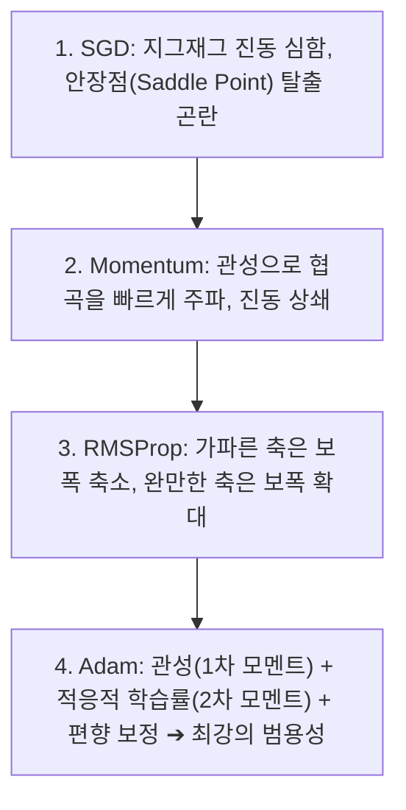

> [!abstract] 핵심 요약
> 신경망 학습은 손실 함수(Loss Function)의 값을 최소화하는 최적의 가중치 파라미터를 탐색하는 고차원 최적화(Optimization) 과정이다.
> 진동(Oscillation)과 안장점(Saddle Point) 병목을 극복하기 위해 물리적 관성을 부여한 **Momentum**, 파라미터별 그래디언트 크기에 따라 적응적으로 학습률을 조절하는 **RMSProp**, 그리고 이 둘의 장점을 통합하여 현대 딥러닝의 표준으로 자리 잡은 **Adam**의 수식과 동작 원리를 이해해야 한다.

---

## 1. 4대 핵심 옵티마이저 수식 비교

### 1) SGD (Stochastic Gradient Descent)
$$\mathbf{w}_{t+1} = \mathbf{w}_t - \eta \nabla \mathcal{L}(\mathbf{w}_t)$$

### 2) Momentum (관성 가속)
$$\mathbf{v}_t = \gamma \mathbf{v}_{t-1} + \eta \nabla \mathcal{L}(\mathbf{w}_t), \quad \mathbf{w}_{t+1} = \mathbf{w}_t - \mathbf{v}_t$$

### 3) RMSProp (적응적 학습률)
$$\mathbf{s}_t = \beta \mathbf{s}_{t-1} + (1 - \beta) (\nabla \mathcal{L}(\mathbf{w}_t))^2, \quad \mathbf{w}_{t+1} = \mathbf{w}_t - \frac{\eta}{\sqrt{\mathbf{s}_t + \epsilon}} \nabla \mathcal{L}(\mathbf{w}_t)$$

### 4) Adam (Adaptive Moment Estimation)
$$\mathbf{m}_t = \beta_1 \mathbf{m}_{t-1} + (1 - \beta_1) \mathbf{g}_t, \quad \mathbf{v}_t = \beta_2 \mathbf{v}_{t-1} + (1 - \beta_2) \mathbf{g}_t^2$$
$$\hat{\mathbf{m}}_t = \frac{\mathbf{m}_t}{1 - \beta_1^t}, \quad \hat{\mathbf{v}}_t = \frac{\mathbf{v}_t}{1 - \beta_2^t}, \quad \mathbf{w}_{t+1} = \mathbf{w}_t - \frac{\eta}{\sqrt{\hat{\mathbf{v}}_t} + \epsilon} \hat{\mathbf{m}}_t$$

---

## 2. 옵티마이저별 수렴 궤적 비교



---

## 3. 실시간 옵티마이저(SGD vs Momentum vs Adam) 수렴 시뮬레이터

```html preview
<div style="font-family:system-ui,-apple-system,sans-serif;padding:20px;background:var(--card);color:var(--card-foreground);border:1px solid var(--border);border-radius:var(--radius)">
  <div style="font-size:16px;font-weight:700;margin-bottom:14px;color:var(--primary);display:flex;align-items:center;gap:8px">
    <span>🧭 최적화 알고리즘(Optimizer) 수렴 궤적 비교기</span>
  </div>

  <div style="display:flex;gap:8px;align-items:center;margin-bottom:12px">
    <button id="btnStepSgd" style="padding:6px 12px;background:var(--chart-1);color:#fff;border:none;border-radius:var(--radius);font-weight:700;cursor:pointer">SGD Step</button>
    <button id="btnStepMom" style="padding:6px 12px;background:var(--chart-2);color:#fff;border:none;border-radius:var(--radius);font-weight:700;cursor:pointer">Momentum Step</button>
    <button id="btnStepAdam" style="padding:6px 12px;background:var(--primary);color:#fff;border:none;border-radius:var(--radius);font-weight:700;cursor:pointer">Adam Step</button>
    <button id="btnResetOpt" style="padding:6px 10px;background:var(--muted);color:var(--foreground);border:1px solid var(--border);border-radius:var(--radius);font-size:11px;cursor:pointer">초기화</button>
  </div>

  <div style="display:grid;grid-template-columns:repeat(3, 1fr);gap:10px;margin-bottom:12px">
    <div style="padding:10px;background:var(--background);border:1px solid var(--border);border-radius:var(--radius);text-align:center">
      <div style="font-size:10px;color:var(--muted-foreground)">현재 위치 (w)</div>
      <div id="optWOut" style="font-family:monospace;font-size:16px;font-weight:800;color:var(--primary);margin-top:2px">w = 5.00</div>
    </div>
    <div style="padding:10px;background:var(--background);border:1px solid var(--border);border-radius:var(--radius);text-align:center">
      <div style="font-size:10px;color:var(--muted-foreground)">현재 손실 L(w) = w^2</div>
      <div id="optLossOut" style="font-family:monospace;font-size:16px;font-weight:800;color:var(--destructive,#ef4444);margin-top:2px">25.00</div>
    </div>
    <div style="padding:10px;background:var(--background);border:1px solid var(--border);border-radius:var(--radius);text-align:center">
      <div style="font-size:10px;color:var(--muted-foreground)">총 스텝 수 (Steps)</div>
      <div id="optStepOut" style="font-family:monospace;font-size:16px;font-weight:800;color:var(--chart-3);margin-top:2px">0</div>
    </div>
  </div>

  <div id="optLogDesc" style="padding:10px;background:var(--background);border:1px solid var(--border);border-radius:var(--radius);font-size:11px">
    시작 지점: w=5.0 (손실 25.0). 각 옵티마이저 버튼을 클릭하여 최솟값(w=0)으로의 수렴 속도를 비교하세요.
  </div>

  <script>
    var w = 5.0;
    var v = 0.0;
    var m = 0.0, s = 0.0, t = 0;
    var steps = 0;
    var lr = 0.1;

    function updateUI(name) {
      document.getElementById('optWOut').textContent = "w = " + w.toFixed(3);
      document.getElementById('optLossOut').textContent = (w * w).toFixed(3);
      document.getElementById('optStepOut').textContent = steps;
      document.getElementById('optLogDesc').innerHTML = "⚡ <b>[" + name + "]</b> 현재 손실: " + (w * w).toFixed(4) + " (w=" + w.toFixed(3) + ")";
    }

    document.getElementById('btnStepSgd').onclick = function() {
      var grad = 2 * w;
      w = w - lr * grad;
      steps++;
      updateUI("SGD");
    };

    document.getElementById('btnStepMom').onclick = function() {
      var grad = 2 * w;
      v = 0.9 * v + lr * grad;
      w = w - v;
      steps++;
      updateUI("Momentum");
    };

    document.getElementById('btnStepAdam').onclick = function() {
      steps++;
      t++;
      var grad = 2 * w;
      m = 0.9 * m + 0.1 * grad;
      s = 0.999 * s + 0.001 * grad * grad;
      var mHat = m / (1 - Math.pow(0.9, t));
      var sHat = s / (1 - Math.pow(0.999, t));
      w = w - (lr / (Math.sqrt(sHat) + 1e-8)) * mHat;
      updateUI("Adam");
    };

    document.getElementById('btnResetOpt').onclick = function() {
      w = 5.0; v = 0.0; m = 0.0; s = 0.0; t = 0; steps = 0;
      document.getElementById('optWOut').textContent = "w = 5.00";
      document.getElementById('optLossOut').textContent = "25.00";
      document.getElementById('optStepOut').textContent = "0";
      document.getElementById('optLogDesc').textContent = "초기화 완료: w = 5.0";
    };
  </script>
</div>
```
