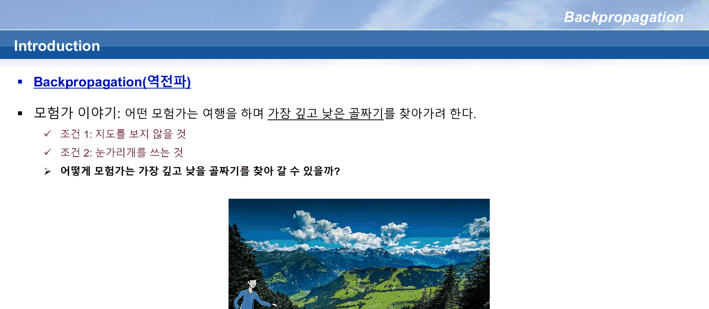
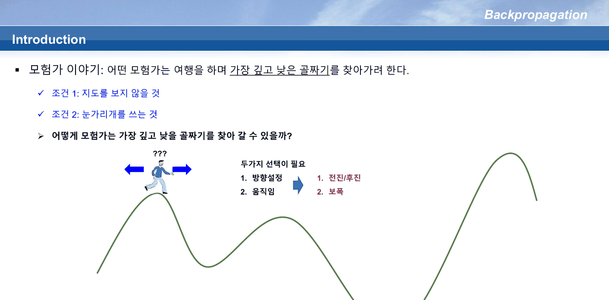
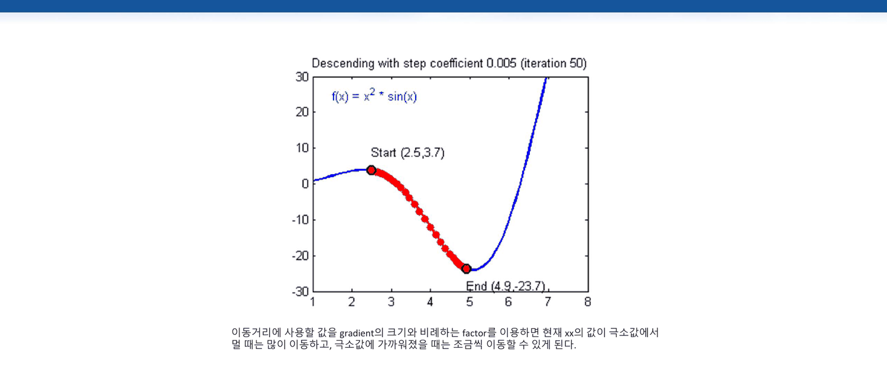
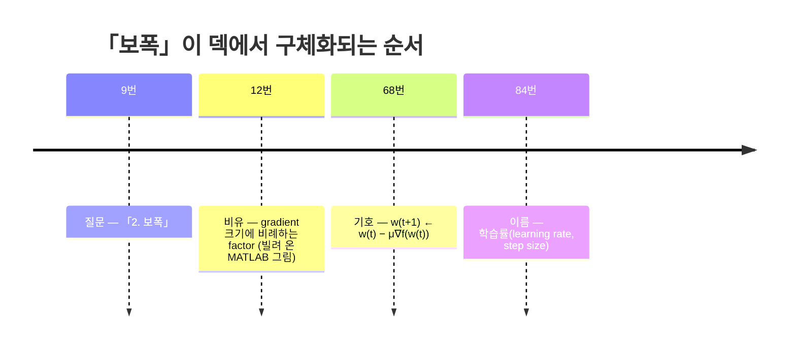
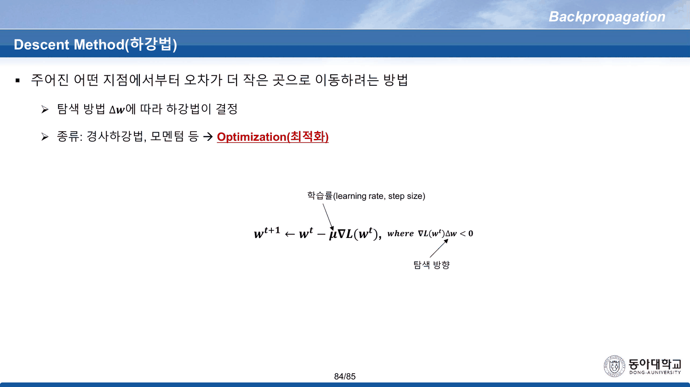
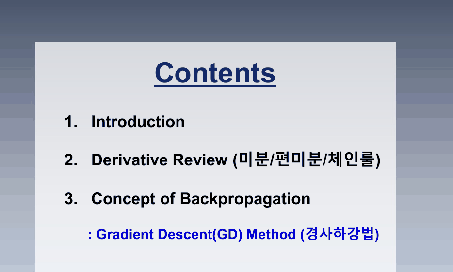
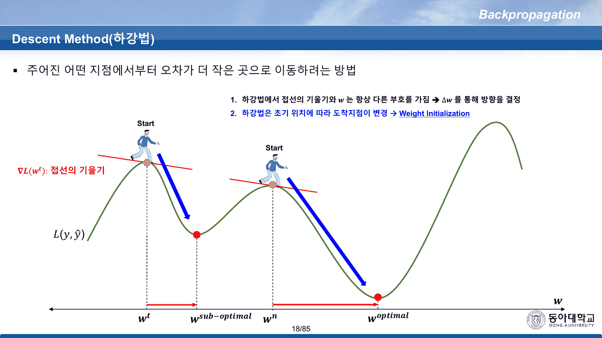

85쪽짜리 덱이다. 이 과목에서 가장 길고, 앞선 세 노트가 남긴 빚 — 「그래서 가중치를 어떻게 찾는가」 — 이 전부 여기로 모인다. 그런데 덱은 그 질문에 곧바로 답하지 않는다. 먼저 **눈을 가린 사람 이야기**를 한다.

이 노트는 그 이야기가 끝나는 18번까지를 읽는다. 계산 그래프는 [[06. 곱셈 게이트의 국소 기울기는 상대방의 값이다]], 회로와 행렬은 [[07. 54번이 답을 먼저 주고, 덱은 그 답을 쓰지 않고 열여섯 장을 간다]]가 이어받는다.

---

## 9번이 던지는 두 개의 질문

3번이 이야기를 연다.

> 모험가 이야기: 어떤 모험가는 여행을 하며 가장 깊고 낮은 골짜기를 찾아가려 한다.
> 조건 1: 지도를 보지 않을 것 · 조건 2: 눈가리개를 쓰는 것



이 이야기는 8·9·10·11번에 **네 번 더** 나온다. 매번 같은 세 줄로 시작해 한 덩이씩 붙는다. 그리고 그중 **9번 한 장만이 질문을 둘로 쪼갠다**.

| 9번의 왼쪽 칸 | 9번의 오른쪽 칸 |
| --- | --- |
| 1. 방향설정 | 1. 전진/후진 |
| 2. 움직임 | 2. 보폭 |



이 두 칸이 이 절의 척추다. **덱은 왼쪽을 완전히 답하고 오른쪽을 계속 미룬다.**

### 반복이 자라는 모양

같은 이야기를 다섯 번 인쇄하면서 무엇이 늘어나는지는 추출된 글자 수로도 보인다.

| 슬라이드 | 글자 수 | 새로 붙은 것 |
| ---: | ---: | --- |
| 3 | 140 | 이야기 세 줄 |
| 8 | 237 | **부호 규칙 세 줄** — 기울기가 양수면 음의 방향, 음수면 양의 방향, 이동거리는 gradient 크기 |
| 9 | 152 | `???` 와 두 개의 선택 (방향 / 보폭) |
| 10 | 126 | `기울기를 활용` 한 줄 |
| 11 | 144 | 그 위에 `→ Optimization (최적화)` 한 줄 |

8번이 이미 답을 다 말하고, 9번이 질문으로 되돌아가고, 10·11번이 답을 두 단어로 줄인다. **순서가 답 → 질문 → 요약**이다. 강의에서 말로 채우기 좋은 배치이지만, 슬라이드만 읽으면 9번의 `???` 가 이미 앞 장에서 해결된 뒤에 등장한다.

---

## 왼쪽 칸: 방향은 부호 하나로 끝난다

8번의 세 줄을 식으로 옮기면 한 줄이다.

$$\nabla L(w_t)\,\Delta w < 0$$

17번이 이 부등식을 그대로 인쇄하고 **「하강법에서 접선의 기울기와 $w$ 는 항상 다른 부호를 가짐」**이라 적는다. 14~17번이 같은 그림 위에 한 단계씩 얹는 방식도 앞의 반복과 같다.

| 슬라이드 | 얹히는 것 |
| ---: | --- |
| 14 | 시작점과 접선. 「현재 위치한 곳에서 낮은 곳으로 이동하려면?」 |
| 15 | $w_t + \Delta w_t \to w_{t+1}$ — **한 걸음** |
| 16 | 같은 것을 $w_n$ 까지 — **반복** |
| 17 | $\nabla L(w_t)\Delta w < 0$ — **부호 규칙** |
| 18 | 시작점을 하나 더 그린다 — **초기 위치 문제** |

방향에 관한 한 이것으로 끝이다. 왼쪽 칸은 완결된다.

### 오른쪽 칸: $\Delta w$ 의 크기는 그려지기만 한다

14~17번의 그림에는 $\Delta w_t$, $\Delta w_{t+1}$ 이 **화살표 길이로만** 있다. 길이를 정하는 규칙은 없다. 8번이 「이동거리 → Gradient 크기를 이용」이라 적지만, 그것은 비례한다는 말이지 배수를 주지 않는다.

배수를 다루는 유일한 장이 12번인데, 이 장은 **덱의 슬라이드가 아니다.**



파란 머리띠 안의 제목이 **비어 있다.** 덱의 다른 모든 장에는 `Backpropagation` / `Introduction` 같은 머리글이 들어 있는데 이 장만 공백이고, 안에 든 것은 MATLAB 그림 한 장이다 — `Descending with step coefficient 0.005 (iteration 50)`, $f(x) = x^2\sin(x)$, `Start (2.5, 3.7)`, `End (4.9, -23.7)`.

그림 아래 한 줄이 이 덱에서 보폭에 관해 말하는 전부다.

> 이동거리에 사용할 값을 gradient의 크기와 비례하는 factor를 이용하면 현재 xx의 값이 극소값에서 멀 때는 많이 이동하고, 극소값에 가까워졌을 때는 조금씩 이동할 수 있게 된다.

(`현재 xx의 값` — `x` 가 두 번 찍혀 있다.)

### 그 그림을 직접 내려가 본다

인쇄된 조건 그대로 — 같은 함수, 같은 시작점, 같은 계수 — 내려가 보면 그림이 말하는 것과 말하지 않는 것이 갈린다.

```html preview
<div id="gd" style="font-family:system-ui,-apple-system,sans-serif;color:var(--foreground);background:var(--card);border:1px solid var(--border);border-radius:12px;padding:18px 16px;">
  <p style="margin:0 0 14px;font-size:13px;color:var(--muted-foreground);line-height:1.75;">
    12번에 인쇄된 곡선 <b>f(x) = x²·sin(x)</b> 위에서 <b>x = 2.5</b> 에서 출발해
    <code style="font-size:12px">x ← x − c·f′(x)</code> 를 반복한다. 슬라이드의 조건은
    <b>c = 0.005 · 50회</b>다.</p>
  <div style="display:flex;flex-wrap:wrap;gap:16px;align-items:center;margin-bottom:12px;">
    <label style="font-size:12.5px;">계수 c
      <input id="gdc" type="range" min="1" max="60" value="5" step="1" style="vertical-align:middle;width:150px;">
      <b id="gdcv" style="font-variant-numeric:tabular-nums;color:var(--chart-1);">0.005</b></label>
    <label style="font-size:12.5px;">반복 횟수
      <input id="gdn" type="range" min="1" max="120" value="50" step="1" style="vertical-align:middle;width:150px;">
      <b id="gdnv" style="font-variant-numeric:tabular-nums;color:var(--chart-1);">50</b></label>
    <button id="gdr" style="font:inherit;font-size:11.5px;padding:4px 10px;border:1px solid var(--border);background:transparent;color:var(--muted-foreground);border-radius:6px;cursor:pointer;">슬라이드 조건으로</button>
  </div>
  <svg id="gds" viewBox="0 0 640 300" style="width:100%;height:auto;display:block;"></svg>
  <div id="gdo" style="margin-top:10px;font-size:13.5px;line-height:1.95;font-variant-numeric:tabular-nums;"></div>
</div>
<script>
(function(){
  const NS='http://www.w3.org/2000/svg', svg=document.getElementById('gds');
  const el=(t,a,x)=>{const e=document.createElementNS(NS,t);for(const k in a)e.setAttribute(k,a[k]);
    if(x!==undefined)e.textContent=x;return e;};
  const f=x=>x*x*Math.sin(x), df=x=>2*x*Math.sin(x)+x*x*Math.cos(x);
  const L=52,R=624,T=14,B=254;
  const sx=v=>L+(v-1)/7*(R-L), sy=v=>B-(v+30)/62*(B-T);
  const cEl=document.getElementById('gdc'), nEl=document.getElementById('gdn');
  function draw(){
    const c=+cEl.value/1000, n=+nEl.value;
    document.getElementById('gdcv').textContent=c.toFixed(3);
    document.getElementById('gdnv').textContent=n;
    svg.textContent='';
    for(const g of [-30,-20,-10,0,10,20,30]){
      svg.appendChild(el('line',{x1:L,y1:sy(g),x2:R,y2:sy(g),stroke:'var(--border)',
        'stroke-dasharray':g===0?'':'3 5',opacity:g===0?1:0.45}));
      svg.appendChild(el('text',{x:L-8,y:sy(g)+4,'text-anchor':'end','font-size':10,
        fill:'var(--muted-foreground)'},g));
    }
    for(const t of [1,2,3,4,5,6,7,8])
      svg.appendChild(el('text',{x:sx(t),y:B+17,'text-anchor':'middle','font-size':10,
        fill:'var(--muted-foreground)'},t));
    let d='';
    for(let i=0;i<=560;i++){const x=1+i/80, y=Math.max(-32,Math.min(32,f(x)));
      d+=(i?'L':'M')+sx(x)+' '+sy(y);}
    svg.appendChild(el('path',{d:d,fill:'none',stroke:'var(--chart-1)','stroke-width':2}));
    let x=2.5; const pts=[x];
    for(let i=0;i<n;i++){ x=x-c*df(x); if(!isFinite(x)||x<1||x>8) break; pts.push(x); }
    pts.forEach((p,i)=>svg.appendChild(el('circle',{cx:sx(p),cy:sy(f(p)),r:i===0||i===pts.length-1?5:2.4,
      fill:i===0?'var(--chart-2)':(i===pts.length-1?'var(--chart-3,var(--chart-2))':'var(--chart-2)'),
      opacity:i===0||i===pts.length-1?1:0.55})));
    const last=pts[pts.length-1];
    svg.appendChild(el('text',{x:sx(2.5)-6,y:sy(f(2.5))-12,'text-anchor':'end','font-size':11,
      fill:'var(--chart-2)','font-weight':700},'Start (2.5, '+f(2.5).toFixed(1)+')'));
    svg.appendChild(el('text',{x:sx(last)+8,y:sy(f(last))+18,'font-size':11,
      fill:'var(--foreground)','font-weight':700},'End ('+last.toFixed(2)+', '+f(last).toFixed(2)+')'));
    svg.appendChild(el('line',{x1:sx(5.087),y1:T,x2:sx(5.087),y2:B,stroke:'var(--muted-foreground)',
      'stroke-dasharray':'2 6',opacity:0.8}));
    svg.appendChild(el('text',{x:sx(5.087)+5,y:T+12,'font-size':10,fill:'var(--muted-foreground)'},
      '참 극소 x=5.087'));
    const at49 = Math.abs(last-4.9)<0.02;
    document.getElementById('gdo').innerHTML =
      '도착 <b>x = '+last.toFixed(3)+'</b> · <b>f = '+f(last).toFixed(3)+'</b>'+
      ' &nbsp;|&nbsp; 이 곡선의 참 극소는 <b>x = 5.087, f = −24.083</b>'+
      '<br><span style="color:var(--muted-foreground);font-size:12.5px;">'+
      (Math.abs(c-0.005)<1e-9 && n===50
        ? '슬라이드가 적은 조건(c = 0.005 · 50회)으로는 <b style="color:var(--chart-2)">x = 4.703</b> 에 닿는다. 인쇄된 끝점 x = 4.9 에 닿으려면 <b>55회</b>가 필요하다.'
        : (at49 ? '인쇄된 끝점 x ≈ 4.9 에 닿았다. 이때 f = −23.57 이고, 인쇄된 −23.7 은 x ≈ 4.92 의 값이다.'
                : '계수를 키우면 극소를 지나치고, 줄이면 50회로는 훨씬 못 간다.'))+
      '</span>';
  }
  cEl.oninput=nEl.oninput=draw;
  document.getElementById('gdr').onclick=()=>{cEl.value=5;nEl.value=50;draw();};
  draw();
})();
</script>
```

> [!note] 빌려 온 그림의 라벨은 서로 맞지 않는다
> $f(x) = x^2\sin x$ 에서 $f(4.9) = -23.589$ 이고, 인쇄된 $-23.70$ 이 나오는 자리는 $x \approx 4.923$ 이다. 그리고 $x = 2.5$ 에서 계수 $0.005$ 로 50번 내려가면 $x = 4.703$ 에 닿는다 — $x = 4.9$ 까지는 **55번**이 걸린다. 갱신 규칙이 그림 안에 적혀 있지 않으므로 어느 쪽이 어긋난 것인지는 이 덱만으로는 단정할 수 없다. 다만 **이 덱에서 보폭을 다루는 유일한 장이 검산되지 않는 외부 그림**이라는 사실은 남는다. (위 계산은 원본에 없는 보충이다.)

---

## 보폭이 이름을 얻기까지 걸리는 거리

$\Delta w$ 의 크기를 정하는 상수는 덱 안에서 세 단계에 걸쳐 나타난다.



68번은 시그모이드 회로의 역전파를 끝낸 자리에서 식을 툭 내놓고, **84번**이 그 $\mu$ 위에 말풍선으로 `학습률(learning rate, step size)` 를 붙인다. 84번은 마지막 내용 슬라이드다(85번은 Q&A).



84번은 이름만 주는 것이 아니라 9번의 오른쪽 칸을 **다음 덱으로 넘긴다**.

> 탐색 방법 $\Delta w$ 에 따라 하강법이 결정 · 종류: 경사하강법, 모멘텀 등 → Optimization(최적화)

즉 이 덱의 구조는 이렇다 — **9번이 두 질문을 던지고, 왼쪽은 17번에서 끝나고, 오른쪽은 84번에서 다음 덱으로 넘어간다.** 그 사이 66장은 전부 왼쪽 칸(기울기를 어떻게 얻는가)에 쓰인다. 오른쪽 칸은 [[10. 한 줄에 붙은 마이너스가 여섯 장을 타고 내려온다]]가 받는다.

---

## 목차가 두 번 인쇄되고, 서로 다르다

5번과 13번이 둘 다 `Contents` 다. 같은 배경 사진, 같은 상자, 다른 내용이다.

| | 5번 | 13번 |
| --- | --- | --- |
| 1 | Introduction | Introduction |
| 2 | Concept of Backpropagation | **Derivative Review (미분/편미분/체인룰)** |
| 3 | — | Concept of Backpropagation |
| 강조 | 없음 | 3번 항목의 부제만 파란색 |



13번이 끼워 넣은 `Derivative Review` 는 **덱 안에 해당하는 절이 없다.** 13번 다음 장은 14번 `Descent Method(하강법)` 이고, 19번부터는 `Backpropagation 동작원리` 다. 미분·편미분·체인룰을 복습하는 장은 한 장도 없다.

> [!important] 그 절은 공책에 있다
> 「미분/편미분/체인룰」은 강의 노트 `필기 과제.pdf` 의 **2·3·7쪽**에 손으로 적혀 있다 — 치환적분·부분적분·야코비안·$\partial(Ax)/\partial x = A$ 까지. 목차의 2번은 없는 절이 아니라 **칠판에서 진행된 절**이고, 그 판서가 따로 PDF로 남아 있다. [[08. 덱이 약속만 하고 넘어간 절은 공책에 있다]]에서 읽는다.

또 하나 — **두 장의 내용 슬라이드가 첫 목차보다 앞에 있다.** 3번(Introduction: 모험가)과 4번(`GD Method (역전파를 위한 최적화)`)이 5번 목차 앞에 놓여 있고, 4번은 그 자체로 17번의 부호 규칙을 미리 한 줄 적어 둔다. 목차가 나오기 전에 이미 결론 한 줄이 지나간 셈이다.

---

## 18번이 남기는 외상

방향과 보폭이 정해져도 남는 것이 하나 있다 — **어디서 출발하는가.**



18번은 같은 곡선에 `Start` 를 둘 그려 놓고 한 줄을 적는다.

> (2번 항목) 하강법은 초기 위치에 따라 도착지점이 변경 → **Weight Initialization**

왼쪽 시작점은 $w_{sub\ optimal}$ 로, 오른쪽 시작점은 $w_{optimal}$ 로 간다. 화살표 오른쪽의 `Weight Initialization` 이 이 덱에서 가중치 초기화가 언급되는 **처음이자 마지막**이다. 방법은 나오지 않는다.

이 외상은 `Vanishing Gradient Effect` 덱이 갚는다 — 그 덱의 19~22번이 「0으로 초기화 / 표준편차 1 / 표준편차 0.01」 세 경우를 비교하고, 26~31번이 Xavier와 He를 준다. [[13. 덱은 1을 양쪽에서 배제한다]]에서 읽는다.

### 세 개의 미룸을 한 자리에

```html preview
<div id="dbt" style="font-family:system-ui,-apple-system,sans-serif;color:var(--foreground);background:var(--card);border:1px solid var(--border);border-radius:12px;padding:18px 16px;">
  <p style="margin:0 0 14px;font-size:13px;color:var(--muted-foreground);line-height:1.75;">
    1~18번이 꺼내 놓고 끝내지 않은 것 셋. 막대를 누르면 어디서 갚히는지 나온다.</p>
  <div id="dbtb" style="display:flex;flex-direction:column;gap:9px;"></div>
  <div id="dbto" style="margin-top:14px;font-size:13.5px;line-height:1.9;border-top:1px solid var(--border);padding-top:12px;min-height:5em;"></div>
</div>
<script>
(function(){
  const D=[
    {k:'방향 — 어느 쪽으로 가는가', a:8, b:17, tot:85, done:true,
     t:'<b style="color:var(--chart-1)">이 덱 안에서 완결된다.</b> 8번이 세 줄로 말하고 17번이 ∇L(w)·Δw &lt; 0 으로 못 박는다. 9장 만에 끝난다.'},
    {k:'보폭 — 얼마나 가는가', a:9, b:84, tot:85, done:false,
     t:'9번이 묻고 12번이 빌려 온 그림으로 비유만 준다. 기호 μ 는 <b>68번</b>, 이름 「학습률」은 <b>84번</b>에서 붙는다. 그리고 같은 84번이 「종류: 경사하강법, 모멘텀 등 → Optimization」 이라 적으며 <b style="color:var(--chart-2)">다음 덱으로 넘긴다</b>.'},
    {k:'출발점 — 어디서 시작하는가', a:18, b:null, tot:85, done:false,
     t:'18번이 그림 둘로 문제를 보여 주고 「→ Weight Initialization」 한 줄을 남긴다. <b style="color:var(--chart-2)">이 덱에 방법은 없다.</b> Vanishing Gradient Effect 덱 19~22번(0 · σ=1 · σ=0.01)과 26~31번(Xavier · He)이 갚는다.'}];
  const box=document.getElementById('dbtb'), out=document.getElementById('dbto');
  D.forEach((d,i)=>{
    const row=document.createElement('div');
    row.style.cssText='cursor:pointer;';
    const end = d.b||d.tot;
    row.innerHTML =
      '<div style="font-size:12.5px;margin-bottom:3px;display:flex;justify-content:space-between;">'+
        '<span><b>'+d.k+'</b></span>'+
        '<span style="color:var(--muted-foreground);font-variant-numeric:tabular-nums;">'+
        d.a+'번 → '+(d.b? d.b+'번' : '덱 밖')+'</span></div>'+
      '<div style="position:relative;height:16px;background:var(--border);border-radius:4px;overflow:hidden;">'+
        '<div style="position:absolute;left:'+(d.a/d.tot*100).toFixed(1)+'%;width:'+
          ((end-d.a)/d.tot*100).toFixed(1)+'%;top:0;bottom:0;background:'+
          (d.done?'var(--chart-1)':'var(--chart-2)')+';opacity:'+(d.done?1:0.75)+';"></div>'+
      '</div>';
    row.onclick=()=>{ out.innerHTML='<b>'+d.k+'</b><br>'+d.t;
      [...box.children].forEach(c=>c.style.opacity=0.45); row.style.opacity=1; };
    box.appendChild(row);
  });
  box.children[1].click();
})();
</script>
```

---

## 발견한 원본 문제

> [!caution] 이 절이 가리키는 것
> 아래 다섯 건은 모두 1~18번 범위에서 슬라이드 원문과 대조해 확인한 것이다. 수치가 걸린 건은 파이썬으로 재계산했다.

`구조가 어긋나는 것`

- **5번 ↔ 13번** — 같은 `Contents` 가 두 번 인쇄되고, 13번이 2번 자리에 `Derivative Review (미분/편미분/체인룰)` 를 끼워 넣는다. **덱 어디에도 그 절이 없다.** 13번 다음은 곧바로 `Descent Method` 다
- **3·4번이 첫 목차(5번)보다 앞에 있다** — 4번은 `GD Method (역전파를 위한 최적화)` 라는 제목으로 17번의 부호 규칙을 한 줄 먼저 인쇄한다. 목차 전에 결론이 지나간다
- **12번만 머리글이 비어 있다** — 덱의 모든 내용 슬라이드가 파란 띠 안에 제목을 갖는데 12번만 공백이고, 안에 MATLAB 그림 한 장과 설명 두 줄만 있다. 출처 표기는 없다

`표기 오류`

- **12번 본문 `현재 xx의 값`** — `x` 가 두 번 찍혀 있다

`값이 맞지 않는 것 (빌려 온 그림)`

- **12번 그림의 `End (4.9, -23.7)`** — $f(x)=x^2\sin x$ 에서 $f(4.9) = -23.589$ 다. $-23.70$ 은 $x \approx 4.923$ 의 값이다. 그리고 그림의 제목이 적은 조건(`step coefficient 0.005`, `iteration 50`)으로 $x=2.5$ 에서 출발하면 50회 뒤 $x = 4.703$ ($f = -22.11$)에 닿고, $x=4.9$ 까지는 55회가 걸린다. 이 곡선의 참 극소는 $x = 5.087$, $f = -24.083$ 이므로 **어느 계산으로도 그림은 극소에 도달하지 않았다** — 이 점만은 슬라이드의 주장(「극소값에 가까워졌을 때는 조금씩 이동」)과 오히려 맞는다

---

## 다른 문서와의 연결

- [[06. 곱셈 게이트의 국소 기울기는 상대방의 값이다]] — 19~53번. 이 노트가 「방향은 기울기가 준다」에서 멈춘 자리에서, 그 기울기를 실제로 얻는 기계가 시작된다
- [[07. 54번이 답을 먼저 주고, 덱은 그 답을 쓰지 않고 열여섯 장을 간다]] — 54~85번. 68번의 $\mu$ 와 84번의 「학습률」이 거기서 나온다
- [[08. 덱이 약속만 하고 넘어간 절은 공책에 있다]] — 13번 목차의 `Derivative Review`
- [[10. 한 줄에 붙은 마이너스가 여섯 장을 타고 내려온다]] — 84번이 넘긴 「종류: 경사하강법, 모멘텀 등」
- [[13. 덱은 1을 양쪽에서 배제한다]] — 18번이 남긴 `Weight Initialization`
- [[02. 예측을 먼저 보여 주고, 그 예측이 나오지 않는 모델을 보여 준다]] — 31번이 「퍼셉트론은 weight, bias를 이용해 decision boundary를 구현함」이라 적고 그 값을 어떻게 찾는지 말하지 않았던 자리

---

## 근거 자료

`Backpropagation (이론).pdf` (85쪽) 중 이 노트가 읽은 범위와 인용한 슬라이드.

| 슬라이드 | 무엇이 있는가 | 인용 |
| ---: | --- | --- |
| 1 | 표지 — `컴퓨터AI공학부 / 2024년 1학기 인공지능` | |
| 2 | `Review: MLP by Linear Algebra` — $q = \sigma(W^Tx+b)$ | |
| 3 | 모험가 이야기 (첫 등장) | ✔ |
| 4 | `GD Method` — 부호 규칙 한 줄 (목차보다 앞) | |
| 5 | `Contents` (2항목) | |
| 6~7 | Backpropagation 정의 · Mini-batch/Epoch 언급 | |
| 8~11 | 모험가 이야기 네 번 반복 | ✔ (9) |
| 12 | 빌려 온 MATLAB 하강 그림 | ✔ |
| 13 | `Contents` (3항목 — `Derivative Review` 추가) | ✔ |
| 14~17 | `Descent Method` 네 단계 | |
| 18 | 초기 위치 문제 → `Weight Initialization` | ✔ |
| 68 · 84 | $\mu$ 의 등장과 「학습률」이라는 이름 | ✔ (84) |

수치 검산은 파이썬으로 수행했다 — $f(x)=x^2\sin x$ 의 값·도함수·극소점, 그리고 `step coefficient 0.005` 로 50·55회 반복한 도착점. 검산 결과는 위 본문에 그대로 적었고, 원본에 없는 보충임을 해당 자리에 밝혔다.
