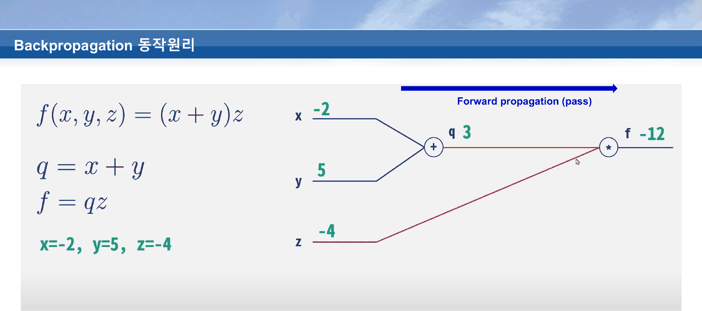
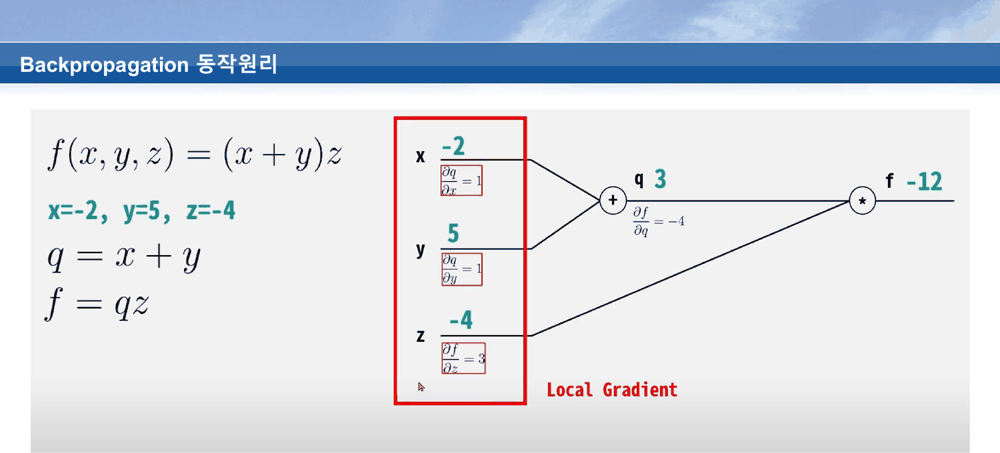
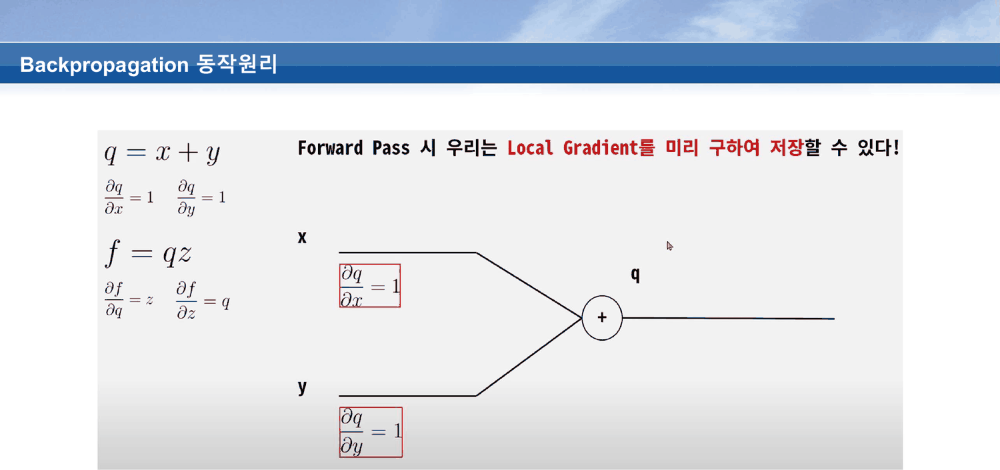
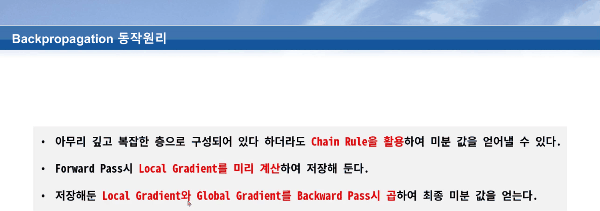
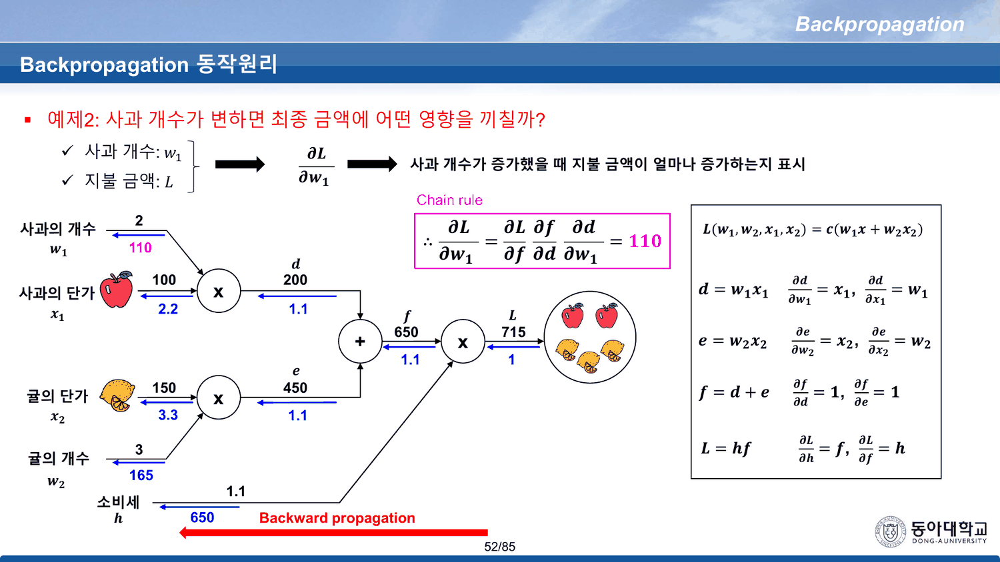
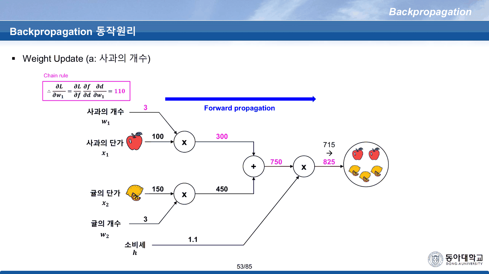

[[05. 방향은 열 장, 보폭은 이름이 없다]]가 읽은 18번까지에서 덱은 「기울기가 방향을 준다」까지 왔다. 남은 질문은 하나다 — **그 기울기를 무엇으로 얻는가.**

19번부터 53번까지 35장이 그 답을 만든다. 그리고 그 35장의 무게 중심은 **36번 한 장**에 있다.

---

## 여섯 장에 걸쳐 네 개의 이름표를 붙인다

19~24번은 같은 그림을 여섯 번 인쇄한다. 그림은 게이트 하나다 — 입력 $x$, $y$, 연산 하나, 출력 $z$.

| 슬라이드 | 새로 붙는 이름표 | 추출된 글자 수 |
| ---: | --- | ---: |
| 19 | (그림만) `operation` · $x$ · $y$ · $z$ | 61 |
| 20 | **Local gradient** — $\partial z/\partial x$, $\partial z/\partial y$ | 82 |
| 21 | **Global gradient** — $\partial L/\partial z$ | 100 |
| 22 | (21번과 추출 텍스트가 글자까지 같다) | 100 |
| 23 | (21번과 추출 텍스트가 글자까지 같다) | 100 |
| 24 | 21~23번에서 **제목 `Chain rule` 만 사라진다** | 90 |

21·22·23번은 텍스트 층이 동일하고, 달라지는 것은 그림 위에 얹히는 화살표뿐이다. 발표에서는 애니메이션이었을 것이고, PDF로 굳으면 **같은 장이 세 번 인쇄된 것**이 된다. 24번은 거기서 제목만 뗀다.

이 여섯 장이 주는 어휘는 둘이다.

- **Local gradient** — 게이트가 자기 입력에 대해 자기 출력을 미분한 것. 게이트 혼자 알 수 있다
- **Global gradient** — 최종 손실 $L$ 이 게이트 출력에 대해 갖는 기울기. 뒤에서 흘러 들어온다

그리고 체인룰은 **둘의 곱**이다. 이 구조가 이후 60장을 지배한다.

---

## 빌려 온 회로 — $f = (x+y)z$

25번이 갑자기 서체가 다른 그림 한 장을 연다. 스탠퍼드 CS231N의 계산 그래프다(같은 과목 [[01. 빌려 온 그림이 양쪽을 다 찌른다]]에서 이미 한 번 빌려 왔던 강의다).



$$f(x,y,z) = (x+y)z,\qquad q = x+y,\qquad f = qz$$

$x=-2$, $y=5$, $z=-4$ 이므로 $q = 3$, $f = -12$. 여기까지가 25번이다.

26~32번이 뒤로 돌아간다. 32번에서 $\partial f/\partial x = \partial f/\partial y = -4$, $\partial f/\partial z = 3$ 이 모두 채워진다. 값은 파이썬으로 다시 계산해도 그대로다.

> [!warning] 여덟 장이 계속 `Forward propagation (pass)` 라고 적혀 있다
> 25~32번은 모두 오른쪽 위에 파란 화살표와 `Forward propagation (pass)` 라벨을 달고 있다. 그런데 **26번부터 32번까지는 역전파를 진행하는 장**이다. 32번 화면에는 빨간 상자에 `Chain Rule` 과 $\frac{\partial f}{\partial y} = \frac{\partial f}{\partial q}\frac{\partial q}{\partial y} = (-4)(1) = -4$ 가 적혀 있는데, 그 위에서 화살표는 여전히 오른쪽을 가리키며 순전파라고 말한다. 라벨이 지워지는 것은 33번부터다.

33번이 세 칸을 빨간 상자로 묶고 `Local Gradient` 라 적는다.



---

## 36번 — 이 절의 문장

34~38번이 그 세 칸이 왜 미리 구해질 수 있는지를 보여 준다. 36번이 그것을 한 문장으로 쓴다.



> **Forward Pass 시 우리는 Local Gradient를 미리 구하여 저장할 수 있다!**

같은 슬라이드 왼쪽에 네 개의 도함수가 인쇄되어 있다.

$$\frac{\partial q}{\partial x} = 1,\quad \frac{\partial q}{\partial y} = 1,\qquad \frac{\partial f}{\partial q} = z,\quad \frac{\partial f}{\partial z} = q$$

**이 네 개는 성격이 완전히 다르다.**

| 게이트 | 국소 기울기 | 알기 위해 필요한 것 |
| --- | --- | --- |
| 덧셈 $q = x+y$ | $1$, $1$ | **아무것도 없다.** 입력 값을 보지 않아도 안다 |
| 곱셈 $f = qz$ | $z$, $q$ | **상대편 입력의 값.** 순전파가 지나가야만 안다 |

36번의 문장이 참인 이유가 오른쪽 줄에 있다. **곱셈 게이트의 국소 기울기는 상대방 입력의 값 그 자체**이므로, 순전파에서 두 입력을 곱하는 그 순간에 서로의 국소 기울기가 이미 손에 있다. 따로 미분할 일이 없고, 저장할 것은 이미 흘러간 값뿐이다.

덱은 이 대비를 말하지 않는다. 네 식을 나란히 인쇄해 놓고 「미리 구할 수 있다」는 결론만 적는다. 39번이 그 결론을 세 줄로 닫는다.



> - 아무리 깊고 복잡한 층으로 구성되어 있다 하더라도 **Chain Rule을 활용**하여 미분 값을 얻어낼 수 있다.
> - Forward Pass시 **Local Gradient를 미리 계산**하여 저장해 둔다.
> - 저장해둔 Local Gradient와 Global Gradient를 Backward Pass시 **곱**하여 최종 미분 값을 얻는다.

### 두 게이트를 직접 열어 본다

```html preview
<div id="gt" style="font-family:system-ui,-apple-system,sans-serif;color:var(--foreground);background:var(--card);border:1px solid var(--border);border-radius:12px;padding:18px 16px;">
  <p style="margin:0 0 14px;font-size:13px;color:var(--muted-foreground);line-height:1.75;">
    25번의 값(<b>x = −2 · y = 5 · z = −4</b>)으로 시작한다. 슬라이더를 움직이면
    두 게이트의 국소 기울기가 어떻게 반응하는지가 갈린다.</p>
  <div style="display:flex;flex-wrap:wrap;gap:18px;margin-bottom:14px;font-size:12.5px;">
    <label>x <input id="gx" type="range" min="-6" max="6" step="1" value="-2" style="width:110px;vertical-align:middle;"> <b id="gxv" style="color:var(--chart-1);font-variant-numeric:tabular-nums;">−2</b></label>
    <label>y <input id="gy" type="range" min="-6" max="6" step="1" value="5" style="width:110px;vertical-align:middle;"> <b id="gyv" style="color:var(--chart-1);font-variant-numeric:tabular-nums;">5</b></label>
    <label>z <input id="gz" type="range" min="-6" max="6" step="1" value="-4" style="width:110px;vertical-align:middle;"> <b id="gzv" style="color:var(--chart-1);font-variant-numeric:tabular-nums;">−4</b></label>
  </div>
  <svg id="gsv" viewBox="0 0 640 250" style="width:100%;height:auto;display:block;"></svg>
  <div id="gto" style="margin-top:10px;font-size:13.5px;line-height:2;font-variant-numeric:tabular-nums;"></div>
</div>
<script>
(function(){
  const NS='http://www.w3.org/2000/svg', svg=document.getElementById('gsv');
  const el=(t,a,x)=>{const e=document.createElementNS(NS,t);for(const k in a)e.setAttribute(k,a[k]);
    if(x!==undefined)e.textContent=x;return e;};
  const num=v=>(v<0?'−':'')+Math.abs(v);
  function node(cx,cy,r,label,val,col){
    svg.appendChild(el('circle',{cx:cx,cy:cy,r:r,fill:'none',stroke:col||'var(--foreground)','stroke-width':1.6}));
    svg.appendChild(el('text',{x:cx,y:cy+5,'text-anchor':'middle','font-size':15,
      fill:col||'var(--foreground)','font-weight':700},label));
    if(val!==undefined) svg.appendChild(el('text',{x:cx,y:cy-r-9,'text-anchor':'middle','font-size':13,
      fill:'var(--chart-1)','font-weight':700},val));
  }
  function draw(){
    const x=+document.getElementById('gx').value, y=+document.getElementById('gy').value,
          z=+document.getElementById('gz').value;
    document.getElementById('gxv').textContent=num(x);
    document.getElementById('gyv').textContent=num(y);
    document.getElementById('gzv').textContent=num(z);
    const q=x+y, f=q*z;
    svg.textContent='';
    // edges
    const E=[[95,55,255,105],[95,165,255,105],[95,215,455,125],[295,105,415,125]];
    E.forEach(e=>svg.appendChild(el('line',{x1:e[0],y1:e[1],x2:e[2],y2:e[3],
      stroke:'var(--border)','stroke-width':1.8})));
    // inputs
    [['x',x,55],['y',y,165],['z',z,215]].forEach(([n,v,cy])=>{
      svg.appendChild(el('text',{x:58,y:cy+5,'text-anchor':'end','font-size':14,
        fill:'var(--foreground)','font-weight':700},n));
      svg.appendChild(el('text',{x:80,y:cy-9,'text-anchor':'middle','font-size':14,
        fill:'var(--chart-1)','font-weight':700},num(v)));
    });
    node(275,105,20,'+');
    node(435,125,20,'×');
    svg.appendChild(el('text',{x:355,y:96,'text-anchor':'middle','font-size':13,
      fill:'var(--chart-1)','font-weight':700},'q = '+num(q)));
    svg.appendChild(el('text',{x:520,y:118,'font-size':13,fill:'var(--chart-1)','font-weight':700},
      'f = '+num(f)));
    // local gradient labels
    svg.appendChild(el('text',{x:175,y:48,'text-anchor':'middle','font-size':11.5,
      fill:'var(--chart-3,var(--muted-foreground))'},'∂q/∂x = 1'));
    svg.appendChild(el('text',{x:175,y:158,'text-anchor':'middle','font-size':11.5,
      fill:'var(--chart-3,var(--muted-foreground))'},'∂q/∂y = 1'));
    svg.appendChild(el('text',{x:360,y:82,'text-anchor':'middle','font-size':11.5,
      fill:'var(--chart-2)','font-weight':700},'∂f/∂q = z = '+num(z)));
    svg.appendChild(el('text',{x:300,y:236,'text-anchor':'middle','font-size':11.5,
      fill:'var(--chart-2)','font-weight':700},'∂f/∂z = q = '+num(q)));
    document.getElementById('gto').innerHTML =
      '<span style="color:var(--chart-3,var(--muted-foreground))">덧셈 게이트</span>의 국소 기울기는 '+
      '<b>1 · 1</b> — 슬라이더를 아무리 움직여도 변하지 않는다. 값을 몰라도 안다.<br>'+
      '<span style="color:var(--chart-2)">곱셈 게이트</span>의 국소 기울기는 '+
      '<b>'+num(z)+' · '+num(q)+'</b> — <b>상대편 입력의 값 그 자체</b>다. 순전파가 지나가야만 알 수 있다.<br>'+
      '<span style="color:var(--muted-foreground);font-size:12.5px;">따라서 ∂f/∂x = ∂f/∂y = '+num(z)+
      ' (덧셈은 기울기를 그대로 흘려보낸다), ∂f/∂z = '+num(q)+'.</span>';
  }
  ['gx','gy','gz'].forEach(id=>document.getElementById(id).oninput=draw);
  draw();
})();
</script>
```

---

## 사과 두 개와 귤 세 개

40번이 같은 구조를 숫자로 다시 한다. 이번에는 빌려 온 그림이 아니라 덱이 그린 회로다.

> 예제1: 슈퍼에서 사과를 2개, 귤을 3개 구매 시 지불금액은? 사과는 1개 100원, 귤은 1개 150원, 소비세 10%

회로의 이름 붙이기가 이 예제의 핵심이다.

| 기호 | 무엇 | 신경망에서는 |
| --- | --- | --- |
| $w_1 = 2$ | 사과의 **개수** | 가중치 — 내가 정하는 값 |
| $x_1 = 100$ | 사과의 **단가** | 입력 — 주어지는 값 |
| $w_2 = 3$ | 귤의 개수 | 가중치 |
| $x_2 = 150$ | 귤의 단가 | 입력 |
| $h = 1.1$ | 소비세 | (그래프의 세 번째 입력) |

42번이 순전파를 채운다 — $200$, $450$, $650$, $715$. 45~52번이 역전파를 채운다.



52번이 결론을 쓴다.

$$\frac{\partial L}{\partial w_1} = \frac{\partial L}{\partial f}\frac{\partial f}{\partial d}\frac{\partial d}{\partial w_1} = 1.1 \times 1 \times 100 = 110$$

전부 유리수 연산으로 재계산해 대조했다. 덱이 그래프에 찍은 다섯 값이 모두 맞는다.

| 기울기 | 덱 | 재계산 | 이것이 뜻하는 것 |
| --- | ---: | ---: | --- |
| $\partial L/\partial h$ | 650 | $f = 650$ | 소비세가 1p 오르면 650원 |
| $\partial L/\partial f$ | 1.1 | $h = 1.1$ | 세전 금액 1원당 1.1원 |
| $\partial L/\partial w_1$ | **110** | $h x_1 = 110$ | 사과 한 개당 110원 |
| $\partial L/\partial w_2$ | 165 | $h x_2 = 165$ | 귤 한 개당 165원 |
| $\partial L/\partial x_1$ | 2.2 | $h w_1 = 2.2$ | 사과 단가 1원당 2.2원 |
| $\partial L/\partial x_2$ | 3.3 | $h w_2 = 3.3$ | 귤 단가 1원당 3.3원 |

여기서도 **곱셈 게이트의 국소 기울기는 상대방**이라는 규칙이 그대로 보인다. $\partial L/\partial w_1$ 을 얻는 데 쓰인 $100$ 은 사과의 **단가**이고, $\partial L/\partial x_1$ 을 얻는 데 쓰인 $2$ 는 사과의 **개수**다. 두 값 모두 순전파 때 이미 회로를 지나갔다.

그리고 여섯 개를 다 구해 놓고 **덱이 쓰는 것은 110 하나뿐**이다. 단가에 대한 기울기 2.2와 3.3은 계산만 되고 어디에도 쓰이지 않는다 — 신경망에서 입력에 대한 기울기가 하는 일(앞 층으로 흘려보내기)은 71번의 다층 회로에 가서야 나온다.

### 110이 예언하는 것

```html preview
<div id="ap" style="font-family:system-ui,-apple-system,sans-serif;color:var(--foreground);background:var(--card);border:1px solid var(--border);border-radius:12px;padding:18px 16px;">
  <p style="margin:0 0 14px;font-size:13px;color:var(--muted-foreground);line-height:1.75;">
    40~53번의 회로다. 값은 전부 원본 그대로(<b>사과 100원 · 귤 150원 · 소비세 1.1</b>).
    개수를 움직이면 순전파 금액과 역전파 기울기가 같이 바뀐다.</p>
  <div style="display:flex;flex-wrap:wrap;gap:20px;margin-bottom:14px;font-size:12.5px;">
    <label>사과 개수 w₁ <input id="aw1" type="range" min="0" max="8" step="1" value="2" style="width:120px;vertical-align:middle;"> <b id="aw1v" style="color:var(--chart-1);">2</b></label>
    <label>귤 개수 w₂ <input id="aw2" type="range" min="0" max="8" step="1" value="3" style="width:120px;vertical-align:middle;"> <b id="aw2v" style="color:var(--chart-1);">3</b></label>
  </div>
  <table style="width:100%;border-collapse:collapse;font-size:13px;font-variant-numeric:tabular-nums;">
    <tbody id="apb"></tbody>
  </table>
  <div id="apo" style="margin-top:12px;font-size:13.5px;line-height:1.95;border-top:1px solid var(--border);padding-top:11px;"></div>
</div>
<script>
(function(){
  const x1=100, x2=150, h=1.1;
  const w1E=document.getElementById('aw1'), w2E=document.getElementById('aw2');
  function row(k,v,note,hi){
    return '<tr><td style="padding:5px 8px 5px 0;border-bottom:1px solid var(--border);">'+k+
      '</td><td style="padding:5px 0;text-align:right;border-bottom:1px solid var(--border);font-weight:700;'+
      (hi?'color:var(--chart-2);':'')+'">'+v+'</td>'+
      '<td style="padding:5px 0 5px 14px;border-bottom:1px solid var(--border);color:var(--muted-foreground);font-size:12px;">'+
      note+'</td></tr>';
  }
  function draw(){
    const w1=+w1E.value, w2=+w2E.value;
    w1E.nextElementSibling.textContent=w1; w2E.nextElementSibling.textContent=w2;
    document.getElementById('aw1v').textContent=w1;
    document.getElementById('aw2v').textContent=w2;
    const d=w1*x1, e=w2*x2, f=d+e, L=h*f;
    const g1=h*x1, g2=h*x2;
    const Lnext=h*((w1+1)*x1+e);
    document.getElementById('apb').innerHTML=
      row('d = w₁·x₁ (사과 소계)', d.toFixed(0)+' 원','')+
      row('e = w₂·x₂ (귤 소계)', e.toFixed(0)+' 원','')+
      row('f = d + e (세전)', f.toFixed(0)+' 원','')+
      row('L = h·f (지불 금액)', L.toFixed(0)+' 원','소비세 1.1배', true)+
      row('∂L/∂w₁', g1.toFixed(0),'= h·x₁ — 사과 <b>단가</b>가 곱해진다', true)+
      row('∂L/∂w₂', g2.toFixed(0),'= h·x₂')+
      row('∂L/∂x₁', (h*w1).toFixed(1),'= h·w₁ — 사과 <b>개수</b>가 곱해진다')+
      row('∂L/∂h', f.toFixed(0),'= f');
    document.getElementById('apo').innerHTML =
      '사과를 <b>한 개 더</b> 사면 지불 금액은 <b>'+L.toFixed(0)+' → '+Lnext.toFixed(0)+
      '</b> 원, 차이 <b style="color:var(--chart-2)">'+(Lnext-L).toFixed(0)+'</b> 원.<br>'+
      '<span style="color:var(--muted-foreground);font-size:12.5px;">기울기 ∂L/∂w₁ = '+g1.toFixed(0)+
      ' 이 그 차이와 <b>정확히</b> 같다 — L 이 w₁ 에 대해 1차식이기 때문이다. '+
      '53번이 2 → 3 으로 바꿔 715 → 825 를 보이는 것이 바로 이 등식이다.</span>';
  }
  w1E.oninput=w2E.oninput=draw; draw();
})();
</script>
```

---

## 53번 — 「Weight Update」라 적고 사과를 한 개 더 산다

53번의 제목은 `Weight Update (a: 사과의 개수)` 다. 하는 일은 개수를 $2 \to 3$ 으로 올리고 순전파를 다시 돌리는 것이다.



$100 \times 3 = 300$, $300 + 450 = 750$, $750 \times 1.1 = 825$. 그리고 $825 - 715 = 110$ — 52번이 구한 기울기와 **소수점 없이** 같다. $L$ 이 $w_1$ 에 대해 1차식이므로 그럴 수밖에 없다.

이것은 기울기가 옳다는 아름다운 검산이다. 다만 제목이 말하는 것과는 다른 일이다.

> [!warning] 하강법이라면 방향이 반대다
> 5번 이후 이 덱이 줄곧 말해 온 규칙은 $\nabla L(w_t)\,\Delta w < 0$ — 기울기가 양수면 $w$ 를 **줄인다**. $\partial L/\partial w_1 = +110$ 이므로 하강법은 사과 개수를 2보다 **작게** 밀어야 한다. 53번은 3으로 올린다. 슬라이드가 실제로 하는 것은 갱신이 아니라 **유한차분 검산**이고, 제목만 `Weight Update` 다.
>
> 이 어긋남은 예제 자체의 성격에서 온다. 지불 금액은 **작을수록 좋은 것이 아니다.** 손실 함수가 아니라 값을 계산하는 식일 뿐이고, 사과 개수를 0으로 미는 것은 이 문제의 답이 아니다. 덱은 계산 그래프의 기계만 빌려 오면서 「무엇을 최소화하는가」는 가져오지 않았다. 목표값이 등장하지 않는 이 성질은 54번 이후에도 이어진다 — [[07. 54번이 답을 먼저 주고, 덱은 그 답을 쓰지 않고 열여섯 장을 간다]]를 보라.

---

## 발견한 원본 문제

> [!caution] 이 절이 가리키는 것
> 19~53번 범위. 수치는 전부 파이썬 유리수 연산으로 재계산해 대조했고, 여섯 개의 편미분 값은 모두 인쇄된 것과 일치했다.

`라벨이 맞지 않는 것`

- **25~32번이 전부 `Forward propagation (pass)` 로 인쇄되어 있다** — 26번부터는 역전파를 진행하는 장이고, 32번에는 `Chain Rule` 과 $\partial f/\partial y = (-4)(1) = -4$ 가 빨간 상자로 들어 있는데도 오른쪽 위 파란 화살표는 오른쪽을 가리키며 순전파라고 말한다. 라벨이 사라지는 것은 33번부터다
- **53번 제목 `Weight Update`** — 실제로 하는 것은 $w_1$ 을 1 늘려 순전파를 다시 도는 유한차분 검산이다. 같은 덱의 하강 규칙($\nabla L\,\Delta w<0$)을 따르면 부호가 반대여야 한다

`식의 오탈자`

- **45~52번의 정의식 `L(w₁, w₂, x₁, x₂) = c(w₁x + w₂x₂)`** — 한 줄에 두 군데가 어긋난다. ① 소비세가 그래프에서는 $h$ 인데 식에서는 $c$ 다(그리고 $c$ 는 55번 이후 시그모이드 회로에서 중간 노드 이름으로 쓰인다). ② $w_1x$ 의 아래첨자 1이 빠져 있다. 게다가 이 식은 **인자를 넷으로 선언해 놓고** 바로 다음 줄부터 $\partial L/\partial h$ 를 계산한다 — 서명에 없는 다섯 번째 변수다

`중복`

- **21·22·23번은 추출 텍스트가 글자까지 동일하다** — 달라지는 것은 그림 위의 화살표뿐이고, 24번은 거기서 제목 `Chain rule` 만 뗀다. 25~32번(여덟 장)도 마찬가지로 텍스트가 48자로 고정되어 있다. 33~39번은 24자다. PDF만 읽으면 **열아홉 장이 세 종류의 텍스트**를 갖는다

`덱에 없는 연결`

- **36번이 네 개의 국소 기울기를 나란히 인쇄하면서 둘의 성격 차이를 말하지 않는다** — 덧셈의 $1,1$ 은 입력 값과 무관하고 곱셈의 $z, q$ 는 상대편 입력 그 자체다. 「Forward Pass 시 미리 구할 수 있다」가 성립하는 이유가 정확히 후자인데, 그 문장은 없다 *(이 대비는 원본에 없는 보충이다 — 다만 식 네 개는 36번에 그대로 인쇄되어 있다)*
- **40~52번이 여섯 개의 편미분을 모두 구해 놓고 하나만 쓴다** — $\partial L/\partial x_1 = 2.2$, $\partial L/\partial x_2 = 3.3$ 은 계산되고 버려진다. 입력에 대한 기울기가 **앞 층으로 흘러가는 것**이라는 역할은 71번 이후에야 등장한다

---

## 다른 문서와의 연결

- [[05. 방향은 열 장, 보폭은 이름이 없다]] — 1~18번. 「기울기가 방향을 준다」까지
- [[07. 54번이 답을 먼저 주고, 덱은 그 답을 쓰지 않고 열여섯 장을 간다]] — 54~85번. 같은 기계를 시그모이드 회로와 행렬에 적용한다
- [[08. 덱이 약속만 하고 넘어간 절은 공책에 있다]] — 공책 4쪽이 이 절의 체인룰을 $\partial i/\partial x = \frac{\partial i}{\partial g}\frac{\partial g}{\partial h}\frac{\partial h}{\partial x}$ 로 먼저 적어 둔다
- [[13. 덱은 1을 양쪽에서 배제한다]] — `Vanishing Gradient Effect` 15~18번이 이 곱의 사슬을 일곱 개로 늘려 놓고 「1보다 작은 것을 일곱 번 곱하면」을 보인다
- [[01. 빌려 온 그림이 양쪽을 다 찌른다]] — 이 과목이 CS231N에서 빌려 오는 두 번째 자리

---

## 근거 자료

`Backpropagation (이론).pdf` 19~53번.

| 슬라이드 | 무엇이 있는가 | 인용 |
| ---: | --- | --- |
| 19~24 | 게이트 하나 — Local / Global gradient 이름표 | |
| 25~32 | CS231N 회로 $f=(x+y)z$ 순전파와 역전파 | ✔ (25) |
| 33 | 세 칸을 `Local Gradient` 로 묶는다 | ✔ |
| 34~38 | 왜 미리 구할 수 있는가 | ✔ (36) |
| 39 | 세 줄짜리 결론 | ✔ |
| 40~42 | 사과 2 · 귤 3 · 소비세 10% — 순전파 715 | |
| 43~52 | 역전파 — $\partial L/\partial w_1 = 110$ | ✔ (52) |
| 53 | `Weight Update` — 715 → 825 | ✔ |

수치 검산: 사과/귤 회로의 순전파 네 값과 편미분 여섯 개를 파이썬 `Fraction` 으로 정확 계산했고, $f=(x+y)z$ 회로의 $q=3$, $f=-12$, $\partial f/\partial x = \partial f/\partial y = -4$, $\partial f/\partial z = 3$ 도 대조했다. 전부 인쇄된 값과 일치한다.
