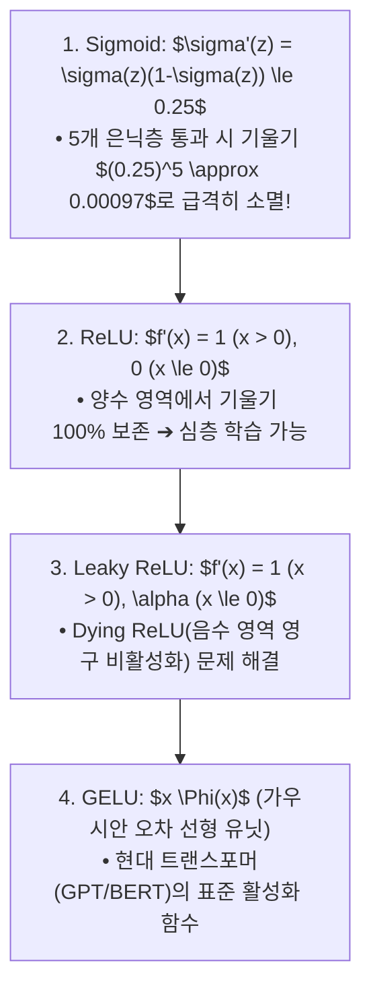

> [!abstract] 핵심 요약
> 심층 신경망을 깊게 쌓을 때 역전파되는 그래디언트가 앞쪽 계층으로 갈수록 지수적으로 감소하여 학습이 정체되는 현상을 **기울기 소실(Vanishing Gradient Effect)**이라 한다.
> 시그모이드 활성화 함수의 도함수 상한($\sigma'(z) \le 0.25$)이 주요 원인이었으며, 이를 해결하기 위해 양수 영역에서 도함수가 1로 유지되는 **ReLU 계열 활성화 함수**와 계층 간 분산을 일정하게 보존하는 **He(Kaiming) 가중치 초기화($\operatorname{Var}(W) = \frac{2}{n_{\text{in}}}$)**가 도입되었다.

---

## 1. 활성화 함수별 도함수 및 기울기 전파 비교



---

## 2. 가중치 초기화(Weight Initialization) 분산 보존 공식

| 초기화 기법 | 권장 활성화 함수 | 분산 $\operatorname{Var}(W)$ 공식 | 설계 철학 |
| :-- | :-- | :--: | :-- |
| **Xavier (Glorot)** | Sigmoid, Tanh | $\frac{2}{n_{\text{in}} + n_{\text{out}}}$ | 선형/대칭 활성화 함수에서 입력/출력 분산 일치 |
| **He (Kaiming)** | **ReLU, LeakyReLU** | **$\frac{2}{n_{\text{in}}}$** | ReLU가 음수 영역을 50% 차단하므로 분산을 2배 보상 |

---

## 3. 실시간 심층 신경망 계층별 기울기 소실(Vanishing Gradient) 시뮬레이터

```html preview
<div style="font-family:system-ui,-apple-system,sans-serif;padding:20px;background:var(--card);color:var(--card-foreground);border:1px solid var(--border);border-radius:var(--radius)">
  <div style="font-size:16px;font-weight:700;margin-bottom:14px;color:var(--primary);display:flex;align-items:center;gap:8px">
    <span>📉 심층 신경망 활성화 함수별 기울기 역전파 소실 시뮬레이터</span>
  </div>

  <div style="display:grid;grid-template-columns:1fr 1fr;gap:12px;margin-bottom:14px">
    <div>
      <label style="font-size:11px;color:var(--muted-foreground)">활성화 함수 선택:</label>
      <select id="inActType" style="width:100%;padding:4px 8px;background:var(--background);color:var(--foreground);border:1px solid var(--border);border-radius:var(--radius);font-weight:700">
        <option value="sigmoid">Sigmoid (f'(z) <= 0.25)</option>
        <option value="relu">ReLU (f'(z) = 1.0 for z>0)</option>
      </select>
    </div>
    <div>
      <label style="font-size:11px;color:var(--muted-foreground)">신경망 은닉층 깊이 (Layers):</label>
      <input id="inLayerDepth" type="number" min="1" max="10" value="6" style="width:100%;padding:4px 8px;background:var(--background);color:var(--foreground);border:1px solid var(--border);border-radius:var(--radius);font-weight:700" />
    </div>
  </div>

  <div style="display:grid;grid-template-columns:1fr 1fr;gap:12px;margin-bottom:12px">
    <div style="padding:10px;background:var(--background);border:1px solid var(--border);border-radius:var(--radius);text-align:center">
      <div style="font-size:10px;color:var(--muted-foreground)">입력층 도달 잔여 기울기 비율</div>
      <div id="gradSurviveOut" style="font-family:monospace;font-size:16px;font-weight:800;color:var(--destructive,#ef4444);margin-top:2px">0.024 %</div>
    </div>
    <div style="padding:10px;background:var(--background);border:1px solid var(--border);border-radius:var(--radius);text-align:center">
      <div style="font-size:10px;color:var(--muted-foreground)">학습 가능 여부 진단</div>
      <div id="trainableStatusOut" style="font-size:12px;font-weight:800;color:var(--destructive,#ef4444);margin-top:4px">❌ 기울기 소실로 학습 불능</div>
    </div>
  </div>

  <script>
    function updateGradSim() {
      var act = document.getElementById('inActType').value;
      var layers = parseInt(document.getElementById('inLayerDepth').value) || 6;

      if (act === 'sigmoid') {
        var survive = Math.pow(0.25, layers) * 100;
        document.getElementById('gradSurviveOut').textContent = survive.toFixed(6) + " %";
        document.getElementById('trainableStatusOut').textContent = (layers >= 4) ? "❌ 기울기 소실로 초기 계층 학습 불능" : "⚠️ 약한 학습 가능";
        document.getElementById('trainableStatusOut').style.color = "var(--destructive,#ef4444)";
      } else {
        document.getElementById('gradSurviveOut').textContent = "100.00 %";
        document.getElementById('trainableStatusOut').textContent = "✅ 기울기 100% 보존 (심층 학습 가능)";
        document.getElementById('trainableStatusOut').style.color = "var(--primary)";
      }
    }

    ['inActType', 'inLayerDepth'].forEach(function(id) {
      document.getElementById(id).addEventListener('input', updateGradSim);
    });
    updateGradSim();
  </script>
</div>
```
