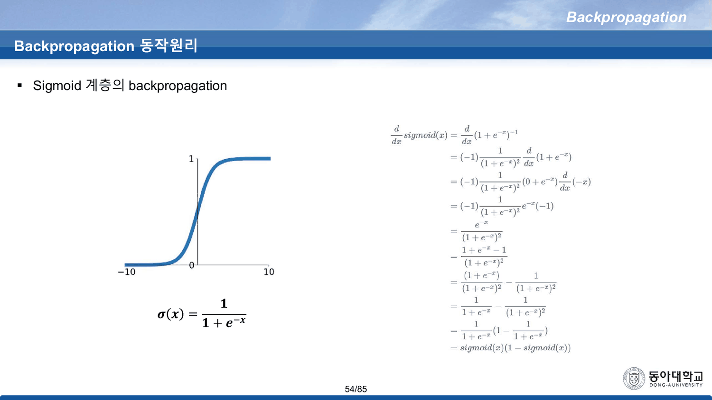
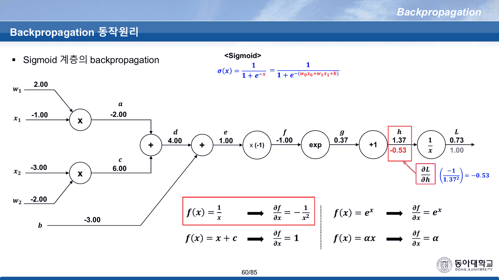
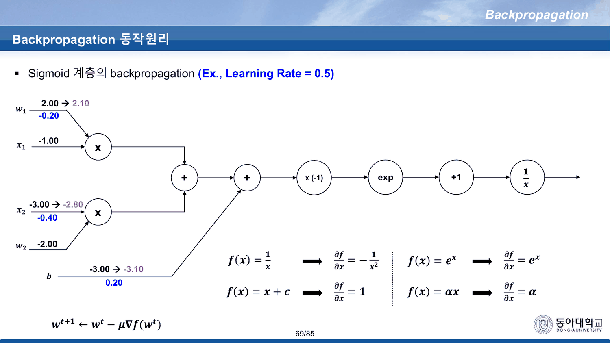
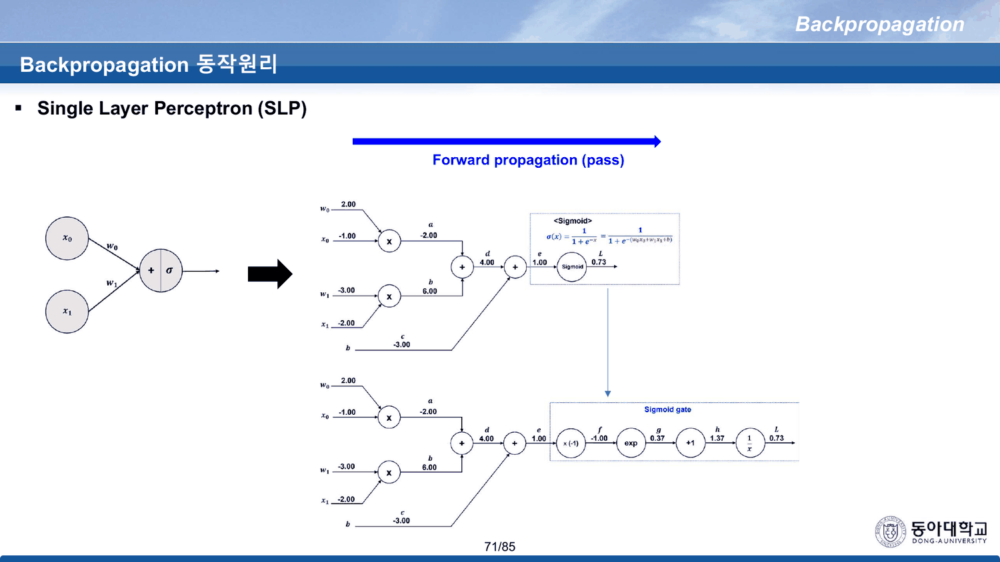
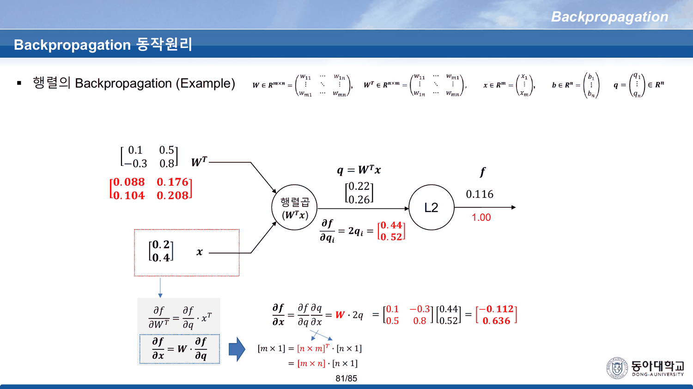

[[06. 곱셈 게이트의 국소 기울기는 상대방의 값이다]]가 읽은 53번까지에서 기계는 완성되었다. 남은 32장은 그 기계를 두 번 더 돌린다 — 한 번은 시그모이드 회로에, 한 번은 행렬에.

그 두 번 중 첫 번째가 이 덱에서 가장 긴 한 덩이이고, 동시에 **가장 먼 길**이다.

---

## 54번이 답을 먼저 준다

54번은 그림 하나와 유도 하나로 되어 있다. 왼쪽에 시그모이드 곡선과 $\sigma(x) = \frac{1}{1+e^{-x}}$, 오른쪽에 **열 줄짜리 미분**이 있다.



$$\frac{d}{dx}\,\text{sigmoid}(x) \;=\; \cdots \;=\; \text{sigmoid}(x)\,\bigl(1 - \text{sigmoid}(x)\bigr)$$

이 한 줄이 시그모이드 층의 국소 기울기다. 출력값 하나만 있으면 곱셈 한 번으로 얻는다.

그리고 55번부터 68번까지 **열네 장이 그 식을 쓰지 않는다.**

---

## 열네 장의 우회

55번이 회로를 연다. $\sigma$ 를 다섯 개의 게이트로 분해한 것이다.

$$x \xrightarrow{\times(-1)} f \xrightarrow{\exp} g \xrightarrow{+1} h \xrightarrow{1/x} L$$

앞에는 선형부가 붙는다. 인쇄된 값은 이렇다 — $w_1 = 2.00$, $x_1 = -1.00$, $x_2 = -3.00$, $w_2 = -2.00$, $b = -3.00$.

| 노드 | $a$ | $c$ | $d$ | $e$ | $f$ | $g$ | $h$ | $L$ |
| --- | ---: | ---: | ---: | ---: | ---: | ---: | ---: | ---: |
| 덱 | −2.00 | 6.00 | 4.00 | 1.00 | −1.00 | 0.37 | 1.37 | 0.73 |
| 재계산 | −2 | 6 | 4 | 1 | −1 | 0.367879 | 1.367879 | 0.731059 |

56~57번이 게이트를 하나씩 드러내고, 58번이 네 개의 도함수 공식을 오른쪽 아래에 붙인다.

$$f(x)=\tfrac1x \Rightarrow -\tfrac1{x^2},\quad f(x)=e^x \Rightarrow e^x,\quad f(x)=x+c \Rightarrow 1,\quad f(x)=\alpha x \Rightarrow \alpha$$

> [!note] 13번 목차가 약속한 `Derivative Review` 는 여기 네 줄이 전부다
> [[05. 방향은 열 장, 보폭은 이름이 없다]]에서 본 두 번째 목차는 2번 항목으로 `Derivative Review (미분/편미분/체인룰)` 를 걸어 두었다. 덱에서 그 이름에 대응하는 인쇄물은 **58번 오른쪽 아래 네 줄**뿐이고, 목차로부터 **45장** 뒤다. 그리고 그 네 줄은 복습이 아니라 이 회로를 풀기 위한 준비물이다.

59~68번이 역전파를 한 게이트씩 진행한다.



| 슬라이드 | 구하는 것 | 인쇄된 식 | 값 |
| ---: | --- | --- | ---: |
| 59 | $\partial L/\partial L$ | — | 1.00 |
| 60 | $\partial L/\partial h$ | $-1/1.37^2$ | **−0.53** |
| 61 | $\partial L/\partial g$ | $(-0.53)(1)$ | −0.53 |
| 62 | $\partial L/\partial f$ | $(-0.53)(1)e^{-1}$ | **−0.20** |
| 63 | $\partial L/\partial e$ | $\cdots(-1)$ | **0.20** |
| 64 | $\partial L/\partial d$, $\partial L/\partial b$ | $\cdots(1)$ | 0.20 |
| 65 | $\partial L/\partial a$ | $\cdots(1)$ | 0.20 |
| 66 | $\partial L/\partial w_1$ | $\cdots(-1)$ | −0.20 |
| 67 | 나머지 셋 | | 0.40 · −0.40 · −0.60 |

63번이 도착하는 **0.20** 이 시그모이드 층 전체의 국소 기울기다. 그리고 54번의 식은 같은 값을 이렇게 준다.

$$\sigma(1-\sigma) = 0.731059 \times 0.268941 = 0.196612 \;\approx\; 0.20$$

인쇄된 반올림값으로 해도 $0.73 \times 0.27 = 0.1971$ 이다. **네 단계와 곱셈 한 번이 같은 곳에 도착한다.**

### 두 경로를 나란히 돌려 본다

```html preview
<div id="sg" style="font-family:system-ui,-apple-system,sans-serif;color:var(--foreground);background:var(--card);border:1px solid var(--border);border-radius:12px;padding:18px 16px;">
  <p style="margin:0 0 14px;font-size:13px;color:var(--muted-foreground);line-height:1.75;">
    선형부의 합 <b>e</b> 를 움직인다. 슬라이드의 값은 <b>e = 1.00</b> 이다.
    왼쪽은 55~63번이 가는 네 단계, 오른쪽은 54번이 유도한 한 줄.</p>
  <label style="font-size:12.5px;display:block;margin-bottom:14px;">e = w₁x₁ + x₂w₂ + b
    <input id="sge" type="range" min="-50" max="50" step="1" value="10" style="width:200px;vertical-align:middle;">
    <b id="sgev" style="color:var(--chart-1);font-variant-numeric:tabular-nums;">1.00</b></label>
  <div style="display:grid;grid-template-columns:1fr 1fr;gap:14px;">
    <div style="border:1px solid var(--border);border-radius:9px;padding:12px;">
      <div style="font-size:12px;font-weight:700;color:var(--chart-2);margin-bottom:8px;">55~63번 — 게이트 네 개</div>
      <div id="sgl" style="font-size:12.5px;line-height:2.05;font-variant-numeric:tabular-nums;"></div>
    </div>
    <div style="border:1px solid var(--border);border-radius:9px;padding:12px;">
      <div style="font-size:12px;font-weight:700;color:var(--chart-1);margin-bottom:8px;">54번 — 곱셈 한 번</div>
      <div id="sgr" style="font-size:12.5px;line-height:2.05;font-variant-numeric:tabular-nums;"></div>
    </div>
  </div>
  <svg id="sgs" viewBox="0 0 640 170" style="width:100%;height:auto;display:block;margin-top:14px;"></svg>
  <div id="sgo" style="margin-top:8px;font-size:13px;line-height:1.9;"></div>
</div>
<script>
(function(){
  const NS='http://www.w3.org/2000/svg', svg=document.getElementById('sgs');
  const el=(t,a,x)=>{const e=document.createElementNS(NS,t);for(const k in a)e.setAttribute(k,a[k]);
    if(x!==undefined)e.textContent=x;return e;};
  const E=document.getElementById('sge');
  function draw(){
    const e=+E.value/10;
    document.getElementById('sgev').textContent=e.toFixed(2);
    const f=-e, g=Math.exp(f), h=g+1, L=1/h;
    const dh=-1/(h*h), dg=dh, df=dg*g, de=df*(-1);
    document.getElementById('sgl').innerHTML=
      '∂L/∂h = −1/h² = <b>'+dh.toFixed(4)+'</b><br>'+
      '∂L/∂g = ∂L/∂h · 1 = <b>'+dg.toFixed(4)+'</b><br>'+
      '∂L/∂f = ∂L/∂g · e<sup>f</sup> = <b>'+df.toFixed(4)+'</b><br>'+
      '∂L/∂e = ∂L/∂f · (−1) = <b style="color:var(--chart-2)">'+de.toFixed(4)+'</b>';
    document.getElementById('sgr').innerHTML=
      'σ(e) = <b>'+L.toFixed(4)+'</b><br>'+
      '1 − σ(e) = <b>'+(1-L).toFixed(4)+'</b><br>'+
      '<span style="color:var(--muted-foreground)">곱한다</span><br>'+
      'σ(1−σ) = <b style="color:var(--chart-1)">'+(L*(1-L)).toFixed(4)+'</b>';
    // curve
    svg.textContent='';
    const Lx=46,Rx=624,T=12,B=138;
    const sx=v=>Lx+(v+6)/12*(Rx-Lx), sy=v=>B-v/0.28*(B-T);
    for(const gg of [0,0.1,0.2,0.25]){
      svg.appendChild(el('line',{x1:Lx,y1:sy(gg),x2:Rx,y2:sy(gg),stroke:'var(--border)',
        'stroke-dasharray':gg===0?'':'3 5',opacity:gg===0?1:0.5}));
      svg.appendChild(el('text',{x:Lx-7,y:sy(gg)+4,'text-anchor':'end','font-size':10,
        fill:'var(--muted-foreground)'},gg.toFixed(2)));
    }
    let d='';
    for(let i=0;i<=480;i++){const v=-6+i/40, s=1/(1+Math.exp(-v));
      d+=(i?'L':'M')+sx(v)+' '+sy(s*(1-s));}
    svg.appendChild(el('path',{d:d,fill:'none',stroke:'var(--chart-1)','stroke-width':2.2}));
    svg.appendChild(el('circle',{cx:sx(e),cy:sy(L*(1-L)),r:5,fill:'var(--chart-2)'}));
    svg.appendChild(el('text',{x:sx(e),y:sy(L*(1-L))-11,'text-anchor':'middle','font-size':11,
      fill:'var(--chart-2)','font-weight':700},(L*(1-L)).toFixed(3)));
    for(const t of [-6,-4,-2,0,2,4,6])
      svg.appendChild(el('text',{x:sx(t),y:B+16,'text-anchor':'middle','font-size':10,
        fill:'var(--muted-foreground)'},t));
    svg.appendChild(el('text',{x:Lx+4,y:T+12,'font-size':11,fill:'var(--muted-foreground)'},
      'σ(e)·(1−σ(e)) — 최댓값은 e=0 에서 0.25'));
    document.getElementById('sgo').innerHTML =
      '두 칸의 굵은 숫자가 <b>항상 같다</b>. 55~63번이 인쇄한 −0.53 → −0.20 → 0.20 은 '+
      'e = 1.00 일 때의 이 곡선 위 한 점이다.'+
      (Math.abs(e-1)<1e-9?'':' <span style="color:var(--muted-foreground)">(슬라이드 값은 e = 1.00)</span>');
  }
  E.oninput=draw; draw();
})();
</script>
```

> [!important] 57번은 상자를 그려 놓고 접지 않는다
> 57번은 다섯 게이트를 점선 상자로 묶고 `Sigmoid gate` 라 이름 붙인다. 상자를 그렸다는 것은 **그 안을 하나의 게이트로 다룰 수 있다**는 뜻이고, 그 게이트의 국소 기울기가 54번의 $\sigma(1-\sigma)$ 다. 덱은 상자를 그린 뒤 다시 열어서 한 칸씩 지나간다. 왜 굳이 분해하는지(체인룰이 임의의 깊이에서 작동함을 보이려는 것)는 39번의 첫 줄이 이미 말했으므로 목적은 짐작되지만, **접는 쪽이 왜 같은 값을 주는지는 어디에도 없다.**

---

## 69번 — 한 걸음. 그런데 무엇을 갱신했는가

68번이 갱신 규칙을 처음 인쇄한다.

$$w_{t+1} \leftarrow w_t - \mu \nabla f(w_t)$$

69번이 학습률 0.5로 한 걸음을 간다.



| 노드 | 55~70번의 이름표 | 값 | 기울기 | 69번 | 검산 |
| --- | --- | ---: | ---: | --- | --- |
| 2.00 | $w_1$ | 2.00 | −0.20 | **→ 2.10** | $2.00 - 0.5(-0.20) = 2.10$ ✔ |
| −1.00 | $x_1$ | −1.00 | 0.40 | 그대로 | (입력) |
| −3.00 | $x_2$ | −3.00 | −0.40 | **→ −2.80** | $-3.00 - 0.5(-0.40) = -2.80$ ✔ |
| −2.00 | $w_2$ | −2.00 | −0.60 | **그대로** | 갱신했다면 −1.70 |
| −3.00 | $b$ | −3.00 | 0.20 | **→ −3.10** | $-3.00 - 0.5(0.20) = -3.10$ ✔ |

**55~70번의 이름표로 읽으면 이 갱신은 입력 $x_2$ 를 바꾸고 가중치 $w_2$ 를 건너뛴다.** 산수는 세 칸 모두 정확하다. 틀린 것은 어느 칸을 갱신 대상으로 골랐는가다.

70번이 새 값으로 순전파를 다시 돈다 — $a = -2.10$, $c = 5.60$, $d = 3.50$, $e = 0.40$, $g = 0.67$, $h = 1.67$, $L = 0.60$. 전부 재계산과 맞는다($1/(1+e^{-0.4}) = 0.5987$).

---

## 71번이 다른 이름표를 꺼낸다

한 장 뒤, 71번이 같은 회로를 다시 인쇄한다. 이번에는 SLP 그림과 나란히 놓고.



| 값 | 55~70번 | 71번 |
| ---: | --- | --- |
| 2.00 | $w_1$ | $w_0$ |
| −1.00 | $x_1$ | $x_0$ |
| −3.00 | **$x_2$** | **$w_1$** |
| −2.00 | **$w_2$** | **$x_1$** |
| −3.00 | $b$ | $b$ |

**가중치와 입력이 서로 바뀌어 있다.** 그리고 어느 쪽이 원본인지는 덱 자신이 알려 준다 — 55번부터 70번까지 오른쪽 위에 계속 인쇄되어 있는 정의식이

$$\sigma(x) = \frac{1}{1+e^{-x}} = \frac{1}{1+e^{-(w_0x_0 + w_1x_1 + b)}}$$

**$w_0, x_0, w_1, x_1$ 을 쓴다.** 회로 그림의 이름표($w_1, x_1, x_2, w_2$)와 같은 슬라이드에서 맞지 않는다. 71번의 이름표만이 그 식과 맞는다.

그러면 69번의 갱신도 설명된다. **69번은 71번의 이름표를 따랐다** — $w_0$(2.00), $w_1$(−3.00), $b$(−3.00), 즉 세 개의 가중치를 전부 갱신하고 두 입력 $x_0$(−1.00), $x_1$(−2.00)을 건드리지 않았다. 71번 기준으로는 완벽하게 옳다. 55번 기준으로는 입력을 갱신하고 가중치를 건너뛴 것이 된다.

### 한 회로, 두 이름표

```html preview
<div id="lb" style="font-family:system-ui,-apple-system,sans-serif;color:var(--foreground);background:var(--card);border:1px solid var(--border);border-radius:12px;padding:18px 16px;">
  <p style="margin:0 0 12px;font-size:13px;color:var(--muted-foreground);line-height:1.75;">
    같은 다섯 개의 값이다. 이름표만 바꿔 끼운다.</p>
  <div style="display:flex;gap:8px;margin-bottom:14px;">
    <button class="lbb on" data-k="0" style="font:inherit;font-size:11.5px;padding:5px 11px;border-radius:6px;cursor:pointer;">55~70번의 이름표</button>
    <button class="lbb" data-k="1" style="font:inherit;font-size:11.5px;padding:5px 11px;border-radius:6px;cursor:pointer;">71번의 이름표</button>
  </div>
  <table style="width:100%;border-collapse:collapse;font-size:13px;font-variant-numeric:tabular-nums;">
    <thead><tr style="font-size:11.5px;color:var(--muted-foreground);text-align:left;">
      <th style="padding:4px 0;">값</th><th>이름</th><th>역할</th><th>기울기</th><th>69번이 한 일</th><th>판정</th></tr></thead>
    <tbody id="lbb2"></tbody>
  </table>
  <div id="lbo" style="margin-top:12px;font-size:13.5px;line-height:1.95;border-top:1px solid var(--border);padding-top:11px;"></div>
  <style>#lb .lbb{border:1px solid var(--border);background:transparent;color:var(--muted-foreground);}
    #lb .lbb.on{background:var(--chart-1);border-color:var(--chart-1);color:var(--card);font-weight:700;}</style>
</div>
<script>
(function(){
  const V=[
    {v:'2.00',  n:['w₁','w₀'], g:'−0.20', act:'→ 2.10'},
    {v:'−1.00', n:['x₁','x₀'], g:'0.40',  act:'그대로'},
    {v:'−3.00', n:['x₂','w₁'], g:'−0.40', act:'→ −2.80'},
    {v:'−2.00', n:['w₂','x₁'], g:'−0.60', act:'그대로'},
    {v:'−3.00', n:['b','b'],   g:'0.20',  act:'→ −3.10'}];
  const body=document.getElementById('lbb2'), out=document.getElementById('lbo');
  function render(k){
    body.innerHTML = V.map(r=>{
      const nm=r.n[k], isW = nm[0]==='w'||nm==='b';
      const role = isW ? '<b style="color:var(--chart-1)">가중치</b>' :
                         '<span style="color:var(--muted-foreground)">입력</span>';
      const moved = r.act!=='그대로';
      const ok = (isW===moved);
      return '<tr><td style="padding:5px 0;border-bottom:1px solid var(--border);">'+r.v+'</td>'+
        '<td style="border-bottom:1px solid var(--border);font-weight:700;">'+nm+'</td>'+
        '<td style="border-bottom:1px solid var(--border);">'+role+'</td>'+
        '<td style="border-bottom:1px solid var(--border);">'+r.g+'</td>'+
        '<td style="border-bottom:1px solid var(--border);">'+r.act+'</td>'+
        '<td style="border-bottom:1px solid var(--border);font-weight:700;color:'+
          (ok?'var(--chart-1)':'var(--chart-2)')+';">'+(ok?'맞다':'어긋난다')+'</td></tr>';
    }).join('');
    out.innerHTML = k===0
      ? '55~70번의 이름표로 읽으면 <b style="color:var(--chart-2)">두 칸이 어긋난다</b> — '+
        '입력 x₂ 를 갱신하고 가중치 w₂ 를 건너뛴다.'
      : '71번의 이름표로 읽으면 <b style="color:var(--chart-1)">다섯 칸이 모두 맞는다</b> — '+
        '가중치 셋(w₀·w₁·b)만 갱신하고 입력 둘(x₀·x₁)은 그대로다. '+
        '같은 슬라이드 오른쪽 위의 정의식 σ = 1/(1+e<sup>−(w₀x₀+w₁x₁+b)</sup>) 도 이쪽과 맞는다.';
  }
  document.querySelectorAll('#lb .lbb').forEach(b=>b.onclick=()=>{
    document.querySelectorAll('#lb .lbb').forEach(x=>x.classList.remove('on'));
    b.classList.add('on'); render(+b.dataset.k);});
  render(0);
})();
</script>
```

---

## 목표값이 한 번도 나오지 않는다

6번이 역전파를 이렇게 정의했다.

> Backpropagation: **계산 결과와 정답의 오차**를 구해서 오차에 관여하는 노드 값들의 가중치와 편향을 수정하는데, 오차가 작아지는 방향으로 반복해서 수정하는 기법

그런데 55~70번의 $L = 0.73$ 은 오차가 아니라 **네트워크 자신의 출력**이다. 정답 $\hat y$ 도, 손실 함수 $L(y,\hat y)$ 도 이 회로에 없다. 69번이 하강법 한 걸음을 가면 $L$ 은 $0.73 \to 0.60$ 으로 내려가는데, 그것은 「오차가 줄었다」가 아니라 **시그모이드의 출력이 0 쪽으로 밀렸다**는 뜻이다. 계속 돌리면 이 네트워크는 무엇을 입력하든 0을 내는 방향으로 간다.

같은 성질은 71~83번의 행렬 예제에도 있다 — 거기서 최소화되는 $f$ 는 $\sum_i q_i^2$, 즉 **출력 자체의 제곱합**이다. 정답이 없으니 최소점은 자명하게 $q = 0$ 이다.

6번의 정의에 등장하는 「정답」은 이 덱의 어떤 계산에도 들어오지 않는다. 실제로 정답을 넣는 것은 `MLP(실습)` 의 `loss_function(pred, label)` 한 줄이다 — [[09. 예순 장을 손으로 미분하고, 실습은 한 줄로 끝낸다]]에서 만난다.

---

## 71~83번 — 같은 기계를 행렬로

72~74번이 $q = \sigma(W^Tx+b)$ 를 다시 적고 활성화와 편향을 떼어 $q = W^Tx$ 로 **간소화**한다. 75번이 숫자를 넣는다.

$$W^T = \begin{pmatrix}0.1 & 0.5\\ -0.3 & 0.8\end{pmatrix},\quad x = \begin{pmatrix}0.2\\0.4\end{pmatrix},\quad q = \begin{pmatrix}0.22\\0.26\end{pmatrix},\quad f = 0.116$$

$f$ 는 `L2` 라 적혀 있고 실제로는 $q_1^2+q_2^2 = 0.0484+0.0676 = 0.116$ — **제곱합**이다(노름이라면 $\sqrt{0.116} = 0.3406$). 76번이 $\partial f/\partial q_i = 2q_i$ 를 주고 $(0.44, 0.52)$ 를 채운다.



| 슬라이드 | 식 | 인쇄된 값 | 재계산 |
| ---: | --- | --- | --- |
| 77~79 | $\dfrac{\partial f}{\partial W} = \dfrac{\partial f}{\partial q}x^T = 2qx^T$ | $\begin{pmatrix}0.088 & 0.176\\0.104 & 0.208\end{pmatrix}$ | 일치 |
| 80~82 | $\dfrac{\partial f}{\partial x} = W\dfrac{\partial f}{\partial q} = W(2q)$ | $(-0.112,\ 0.636)$ | 일치 |

이 두 줄이 [[06. 곱셈 게이트의 국소 기울기는 상대방의 값이다]]의 규칙 그대로다. $W$ 에 대한 기울기에는 **입력 $x$** 가 곱해지고, $x$ 에 대한 기울기에는 **가중치 $W$** 가 곱해진다. 스칼라 곱셈 게이트에서 상대방이 붙던 자리에 여기서는 상대방의 전치가 붙는다.

77번이 차원 맞추기까지 인쇄한다 — $n\times m = (n\times 1)(1\times m)$, $m\times1 = (m\times n)(n\times 1)$.

```html preview
<div id="mx" style="font-family:system-ui,-apple-system,sans-serif;color:var(--foreground);background:var(--card);border:1px solid var(--border);border-radius:12px;padding:18px 16px;">
  <p style="margin:0 0 12px;font-size:13px;color:var(--muted-foreground);line-height:1.75;">
    75~83번의 행렬 예제다. 기본값은 원본 그대로 —
    Wᵀ = [[0.1, 0.5], [−0.3, 0.8]], x = (0.2, 0.4).</p>
  <div id="mxi" style="display:flex;flex-wrap:wrap;gap:10px;margin-bottom:14px;font-size:12px;"></div>
  <div id="mxo" style="font-size:13px;line-height:2.1;font-variant-numeric:tabular-nums;"></div>
  <div id="mxn" style="margin-top:10px;font-size:12.5px;color:var(--muted-foreground);line-height:1.85;"></div>
</div>
<script>
(function(){
  const init={wt00:0.1,wt01:0.5,wt10:-0.3,wt11:0.8,x0:0.2,x1:0.4};
  const box=document.getElementById('mxi');
  const labels={wt00:'Wᵀ₁₁',wt01:'Wᵀ₁₂',wt10:'Wᵀ₂₁',wt11:'Wᵀ₂₂',x0:'x₁',x1:'x₂'};
  Object.keys(init).forEach(k=>{
    const w=document.createElement('label');
    w.innerHTML=labels[k]+' <input id="mx_'+k+'" type="number" step="0.1" value="'+init[k]+
      '" style="width:62px;font:inherit;font-size:12px;padding:2px 4px;border:1px solid var(--border);background:transparent;color:var(--foreground);border-radius:5px;">';
    box.appendChild(w);
  });
  const g=k=>parseFloat(document.getElementById('mx_'+k).value)||0;
  const F=(v,n)=>(v<0?'−':'')+Math.abs(v).toFixed(n===undefined?3:n);
  function draw(){
    const a=g('wt00'),b=g('wt01'),c=g('wt10'),d=g('wt11'),x0=g('x0'),x1=g('x1');
    const q0=a*x0+b*x1, q1=c*x0+d*x1;
    const f=q0*q0+q1*q1;
    const dq0=2*q0, dq1=2*q1;
    const dW=[[dq0*x0,dq0*x1],[dq1*x0,dq1*x1]];
    const dx0=a*dq0+c*dq1, dx1=b*dq0+d*dq1;
    document.getElementById('mxo').innerHTML=
      '<b>q = Wᵀx</b> = ( '+F(q0)+' , '+F(q1)+' )<br>'+
      '<b>f = Σqᵢ²</b> = '+F(q0)+'² + '+F(q1)+'² = <b style="color:var(--chart-1)">'+F(f)+'</b><br>'+
      '<b>∂f/∂q = 2q</b> = ( '+F(dq0)+' , '+F(dq1)+' )<br>'+
      '<b>∂f/∂W = 2q·xᵀ</b> = [ ['+F(dW[0][0])+', '+F(dW[0][1])+'], ['+F(dW[1][0])+', '+F(dW[1][1])+'] ]<br>'+
      '<b>∂f/∂x = W·2q</b> = ( '+F(dx0)+' , '+F(dx1)+' )';
    const orig = Math.abs(a-0.1)<1e-9&&Math.abs(b-0.5)<1e-9&&Math.abs(c+0.3)<1e-9&&
                 Math.abs(d-0.8)<1e-9&&Math.abs(x0-0.2)<1e-9&&Math.abs(x1-0.4)<1e-9;
    document.getElementById('mxn').innerHTML = orig
      ? '원본 값이다. 덱이 인쇄한 <b>0.22 · 0.26 · 0.116 · (0.44, 0.52) · [[0.088, 0.176], [0.104, 0.208]] · (−0.112, 0.636)</b> 과 모두 일치한다.'
      : '값을 바꿔도 구조는 같다 — ∂f/∂W 에는 <b>x</b> 가, ∂f/∂x 에는 <b>W</b> 가 붙는다.';
  }
  box.oninput=draw; draw();
})();
</script>
```

83번이 마지막으로 $w_{t+1} \leftarrow w_t - \mu\nabla f(w_t)$ 를 다시 붙이고, 84번이 그 $\mu$ 에 `학습률` 이라는 이름과 「→ Optimization(최적화)」 라는 다음 행선지를 준다.

---

## 발견한 원본 문제

> [!caution] 이 절이 가리키는 것
> 54~85번 범위. 회로의 순전파 여덟 값, 역전파 아홉 값, 행렬 예제의 모든 성분을 파이썬으로 재계산해 대조했다. **산술은 전부 맞는다.** 어긋나는 것은 이름표와 배치다.

`같은 것이 두 이름을 갖는 것`

- **55~70번 ↔ 71번** — 같은 다섯 값의 이름표가 다르다. $-3.00$ 이 한쪽에서는 입력 $x_2$, 다른 쪽에서는 가중치 $w_1$ 이고 $-2.00$ 은 그 반대다. **판정 근거는 덱 안에 있다** — 55~70번 오른쪽 위에 계속 인쇄된 정의식이 $w_0x_0 + w_1x_1 + b$ 를 쓰므로 71번 쪽이 원본이다
- **69번의 갱신은 71번의 이름표를 따른다** — 그래서 55번 기준으로 읽으면 **입력 $x_2$ 를 갱신하고 가중치 $w_2$ 를 건너뛴다**. 세 칸의 산술은 정확하다($2.00\to2.10$, $-3.00\to-2.80$, $-3.00\to-3.10$ 모두 $\mu=0.5$ 로 검산됨). 만약 55번의 이름표대로 $w_2$ 를 갱신했다면 $-2.00 \to -1.70$ 이었어야 한다

`정의와 계산이 맞지 않는 것`

- **6번은 「계산 결과와 정답의 오차」로 역전파를 정의하는데, 54~83번의 어떤 계산에도 정답이 없다** — 시그모이드 회로가 최소화하는 $L=0.73$ 은 네트워크의 출력 그 자체이고, 행렬 예제가 최소화하는 $f = \sum q_i^2$ 도 출력의 제곱합이다. 둘 다 최소점이 자명하게 0이다
- **75번의 `L2`** — $0.22^2 + 0.26^2 = 0.116$ 은 L2 **노름의 제곱**이다. 노름이라면 $\sqrt{0.116}=0.3406$ 이어야 하고, 그랬다면 $\partial f/\partial q_i = 2q_i$ 도 성립하지 않는다. 뒤의 모든 계산은 제곱합 기준으로 일관되므로 이름만 느슨하다

`구조가 어긋나는 것`

- **57번이 `Sigmoid gate` 상자를 그린 뒤 다시 분해한다** — 상자 하나로 접으면 54번이 이미 준 $\sigma(1-\sigma)$ 로 끝난다. 열네 장의 우회가 같은 0.20 에 도착하는데, 두 길이 같다는 말은 어디에도 없다
- **13번 목차의 `Derivative Review (미분/편미분/체인룰)` 에 대응하는 인쇄물은 58번 오른쪽 아래 네 줄뿐이다** — 목차로부터 45장 뒤이고, 복습이 아니라 이 회로의 준비물이다

---

## 다른 문서와의 연결

- [[05. 방향은 열 장, 보폭은 이름이 없다]] — 68번의 $\mu$, 84번의 「학습률」, 13번 목차의 약속
- [[06. 곱셈 게이트의 국소 기울기는 상대방의 값이다]] — 77~82번의 $x^T$ 와 $W$ 가 그 규칙의 행렬판이다
- [[04. 목록은 길고 고르는 기준은 한 줄이다]] — `MLP(이론)` 12번이 시그모이드를 소개하며 「기울기가 작다」를 언급만 하고 넘어간 자리. 54번의 $\sigma(1-\sigma)$ 와 그 최댓값 0.25가 그 답이다
- [[13. 덱은 1을 양쪽에서 배제한다]] — 그 0.25가 층을 타고 곱해지면 무엇이 되는지
- [[09. 예순 장을 손으로 미분하고, 실습은 한 줄로 끝낸다]] — 정답 $\hat y$ 가 들어오는 자리
- [[08. 덱이 약속만 하고 넘어간 절은 공책에 있다]] — 공책 9쪽이 75~76번의 $\partial f/\partial q = 2q$ 를 그대로 담고 있다

---

## 근거 자료

`Backpropagation (이론).pdf` 54~85번.

| 슬라이드 | 무엇이 있는가 | 인용 |
| ---: | --- | --- |
| 54 | $\sigma'(x) = \sigma(1-\sigma)$ 열 줄 유도 | ✔ |
| 55~57 | 시그모이드 회로 순전파 · `Sigmoid gate` 상자 | |
| 58 | 네 개의 도함수 공식 | |
| 59~67 | 역전파 아홉 단계 | ✔ (60) |
| 68 | $w_{t+1} \leftarrow w_t - \mu\nabla f(w_t)$ | |
| 69~70 | 학습률 0.5로 한 걸음, 재순전파 $L=0.60$ | ✔ (69) |
| 71 | SLP 그림 + 같은 회로의 다른 이름표 | ✔ |
| 72~74 | $q = \sigma(W^Tx+b)$ → $q = W^Tx$ 간소화 | |
| 75~83 | 행렬 예제 — $f=0.116$, $\partial f/\partial W$, $\partial f/\partial x$ | ✔ (81) |
| 84 | 「학습률」이라는 이름과 Optimization 으로의 인계 | |
| 85 | Q&A | |

수치 검산: 시그모이드 회로의 순전파 여덟 노드와 역전파 아홉 값, $\sigma(1-\sigma)$ 와의 일치, 학습률 0.5 갱신 세 칸과 재순전파 여섯 값, 행렬 예제의 $q$·$f$·$2q$·$2qx^T$·$W(2q)$ 를 모두 파이썬으로 계산했다. 인쇄된 값과 어긋난 자리는 없었다.
