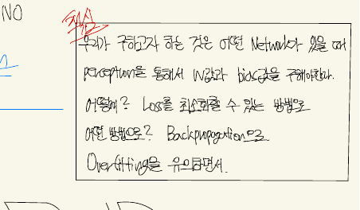
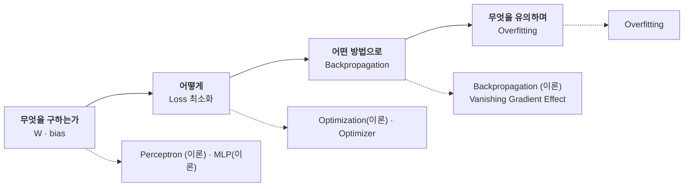
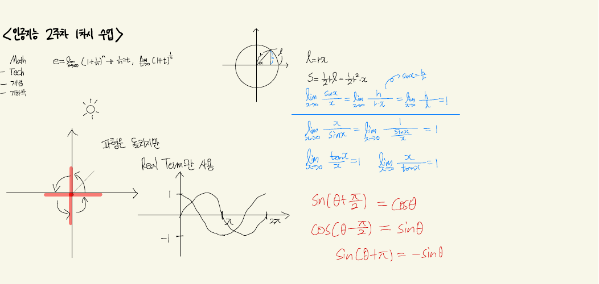
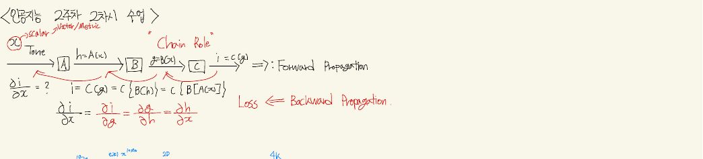
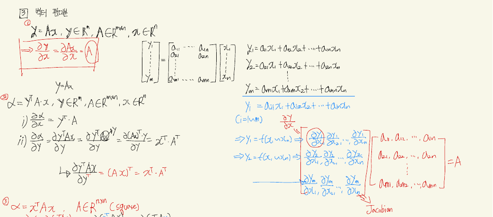
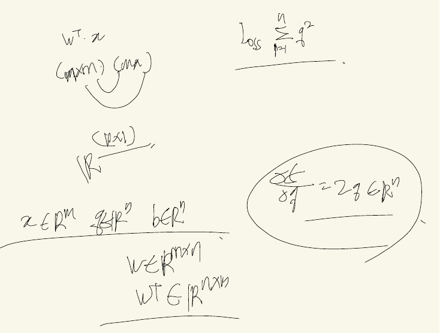
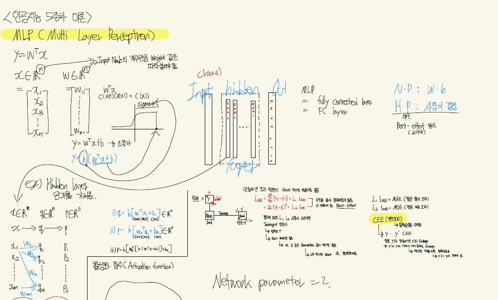
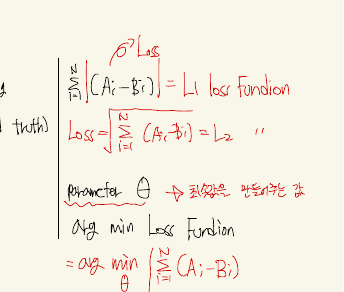
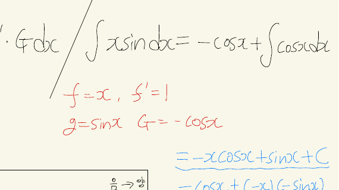

`sources/` 의 열아홉 덱 가운데 하나만 PowerPoint가 아니다. `필기 과제.pdf` 10쪽은 **손으로 적은 노트를 찍은 것**이다. 추출된 텍스트는 의미를 이루지 않는다 — 2쪽은 `1 tnyrf n = , fi- Cltt )`, 3쪽은 `Y Du <tan ccosa ) )` 로 시작한다. 열 쪽을 전부 이미지로 읽어야 한다.

그렇게 읽으면 이 파일이 **덱들이 남긴 구멍을 정확히 메우고 있다**는 것이 보인다.

---

## 열 쪽의 지도

각 쪽 맨 위에 꺾쇠로 날짜가 적혀 있다.

| 쪽 | 머리글 | 내용 |
| ---: | --- | --- |
| 1 | — | **전부 어두운 사진.** 글자가 없다(추출 0자) |
| 2 | `<인공지능 2주차 1차시 수업>` | $e$ 의 정의, $\lim \frac{\sin x}{x}=1$ 네 개, 삼각함수 공식 셋, 스칼라/벡터, 복소수와 2D Rotation, 부정적분·정적분 |
| 3 | (이어짐) | 치환적분 네 예제, **부분적분**, 평균·분산·표준편차, 1차 미분방정식 $\frac{df}{dt}=kf(t)$ |
| 4 | `<인공지능 2주차 2차시 수업>` | **체인룰과 Forward/Backward Propagation**, 영상 텐서 모양, 스칼라·벡터·행렬·텐서, 단위벡터·기저·span, L1/L2 노름, rank와 역행렬 |
| 5 | `<인공지능 3주차 1차시 수업>` | 노름 복습, 기저와 선형독립, 직교와 정규직교, **지도학습·L1 loss·L2 loss·$\arg\min_\theta$** |
| 6 | (이어짐) | 전치·대칭·역행렬 성질, rank, 그리고 **$y = W^Tx \in \mathbb{R}^{n\times1}$ 과 완전연결 그림** |
| 7 | `<인공지능 3주차 2차시 수업>` | 선형회귀 정규방정식, 내적, **사영(projection)**, **벡터 편미분과 야코비안** |
| 8 | `<인공지능 4주차 이론>` | 퍼셉트론, 덱 슬라이드 캡처 한 장, 지도학습의 분류, 시그모이드 대 계단, **논리 게이트 여섯 개**, 그리고 **빨간 상자** |
| 9 | — | $W^Tx$ 의 차원, $\text{Loss} = \sum_{i=1}^n q_i^2$, 동그라미 친 $\partial f/\partial q = 2q$ |
| 10 | `<인공지능 5주차 이론>` | MLP, N.P 대 H.P, L1/L2/CEE, **배치·이터레이션·에폭** |

2주차부터 5주차까지, 강의 여섯 회분이다. 덱으로 치면 `Perceptron (이론)` 부터 `MLP(이론)` 까지에 해당하고, 9쪽은 `Backpropagation (이론)` 의 마지막 절까지 닿는다.

---

## 8쪽의 빨간 상자

8쪽 오른쪽 아래에 빨간 펜으로 네모를 치고 네 줄이 적혀 있다. 위에는 빨간 글씨로 `요약` 이라 쓴 흔적이 있다.



> 우리가 구하고자 하는 것은 **어떤 Network가 있을 때 Perceptron을 통해서 W값과 bias값을 구해야한다.**
> 어떻게? **Loss를 최소화할 수 있는 방향으로.**
> 어떤 방법으로? **Backpropagation으로.**
> **Overfitting을 유의하면서.**

네 줄이 넷을 지목한다.



이 네 줄이 앞선 네 노트가 남긴 빚의 **전부**를 한 번에 갚는다.

| 넘겼던 빚 | 어디서 | 빨간 상자의 답 |
| --- | --- | --- |
| 「퍼셉트론은 weight, bias를 이용해 decision boundary를 구현함」이라 적고 그 값을 어떻게 찾는지 말하지 않는다 | [[02. 예측을 먼저 보여 주고, 그 예측이 나오지 않는 모델을 보여 준다]] | 첫째 줄이 그것이 **구해야 할 대상**임을 명시한다 |
| 47~50번·58~60번의 가중치가 전부 손으로 정해진 값이다 | [[03. 다섯 장에 걸쳐 XOR을 쌓는 동안 이름이 두 번 바뀌고 부호가 한 번 틀린다]] | 둘째·셋째 줄 — Loss 최소화 방향으로, Backpropagation 으로 |
| 손실 함수 셋을 나란히 놓기만 하고 언제 무엇을 쓰는지 적지 않는다 | [[04. 목록은 길고 고르는 기준은 한 줄이다]] | 10쪽이 용도까지 적는다(아래) |
| 2번 슬라이드 공통 지도의 `Drop-Out`·`Overfitting` 이 아직 어느 덱에서도 설명되지 않았다 | [[01. 빌려 온 그림이 양쪽을 다 찌른다]] | 넷째 줄이 그것을 **네 단계의 마지막 조건**으로 놓는다 |

> [!important] 이 상자가 놓인 자리
> 같은 8쪽 가운데에 `Overall Architecture of Deep Learning` 슬라이드 캡처가 붙어 있다. 꼬리표가 **`2/59`** 다 — `Perceptron (이론)` 덱의 2번 슬라이드, [[01. 빌려 온 그림이 양쪽을 다 찌른다]]가 「이 과목의 공통 지도」라 부른 바로 그 장이다. 빨간 상자는 그 캡처 **오른쪽 아래**에 있다. 지도 옆에 순서를 적어 둔 셈이다.

---

## 13번 목차가 약속한 절

`Backpropagation (이론)` 13번의 목차는 2번 항목으로 `Derivative Review (미분/편미분/체인룰)` 를 걸어 놓고 덱 안에 해당 절을 두지 않았다([[05. 방향은 열 장, 보폭은 이름이 없다]]). 그 절은 여기 있다.



| 항목 | 공책 | 덱에서 쓰이는 자리 |
| --- | --- | --- |
| 미분 · 적분 기초 | 2쪽 — 부정적분/정적분, 치환적분 | 58번의 네 도함수 공식 |
| 부분적분 | 3쪽 | (덱에 없음) |
| 체인룰 | **4쪽** | 19~24번, 32번, 52번, 61~66번 |
| 벡터 편미분 · 야코비안 | **7쪽** | 77~82번 |
| $\partial f/\partial q = 2q$ | **9쪽** | 76번 |

4쪽 맨 위가 체인룰을 상자 네 개로 그린다 — $x \to A \to B \to C \to i$, 그리고 그 아래에

$$\frac{\partial i}{\partial x} = \frac{\partial i}{\partial g}\frac{\partial g}{\partial h}\frac{\partial h}{\partial x}$$

오른쪽에 파란 글씨로 `Forward Propagation`, 빨간 글씨로 `Loss ← Backward Propagation` 이 적혀 있다.



**2주차 2차시**다. `Backpropagation (이론)` 은 4주차 이후의 덱이므로, 공책이 덱보다 두 주 앞선다. 덱의 19~24번이 여섯 장에 걸쳐 붙이는 `Local gradient` / `Global gradient` 이름표는, 공책에서는 이 한 줄의 각 분수에 이미 대응하고 있다.

7쪽은 더 멀리 간다.



$$\frac{\partial (Ax)}{\partial x} = A,\qquad \frac{\partial (y^TAx)}{\partial x} = y^TA,\qquad \frac{\partial (x^TAx)}{\partial x} = x^T(A+A^T)$$

그리고 그 오른쪽에 $m\times n$ 야코비안 전체를 성분으로 펼쳐 놓고 `= A` 라 적는다. 덱 77~82번이 $\partial f/\partial W = 2qx^T$, $\partial f/\partial x = W(2q)$ 를 **결과만** 인쇄하는 자리의 근거가 이 쪽이다.

9쪽은 아예 덱의 한 장면이다 — $W^Tx$ 의 차원 $(n\times m)(m\times 1) \to \mathbb{R}^{n\times1}$, $\text{Loss} = \sum_{i=1}^{n}q_i^2$, 그리고 크게 동그라미 친 $\frac{\partial f}{\partial q} = 2q \in \mathbb{R}^n$.



이 쪽은 **아홉 줄밖에 없다.** 열 쪽 중 가장 비어 있고, 적힌 것은 전부 덱 75~76번의 것이다. 그 시간의 판서가 여기서 끝났다는 뜻으로 읽힌다.

---

## 덱에 없고 공책에만 있는 것

반대 방향도 있다. 공책이 다루는데 열아홉 덱 어디에도 없는 것들이다.

| 공책 | 내용 | 덱 |
| ---: | --- | --- |
| 3쪽 | 평균 · 분산 · 표준편차, `Std1 < Std2 → 얼마만큼 퍼졌나` | 없음 |
| 3쪽 | 1차 미분방정식 $\frac{df}{dt}=k\,f(t) \Rightarrow f(t)=ce^{kt}$ (개체수 예제: $t=0$ 일 때 100마리, $t=1$ 일 때 300마리) | 없음 |
| 4·5쪽 | 기저 · span · 선형독립 · 직교 · 정규직교 | 없음 |
| 6쪽 | 전치·대칭·역행렬 성질, $(AB)^T=B^TA^T$, $(A+B)^{-1}\neq A^{-1}+B^{-1}$, rank와 full rank | 없음 |
| 7쪽 | 선형회귀 정규방정식 $x = (A^TA)^{-1}A^Tb$ | 없음 |
| 7쪽 | 사영 — $\text{proj}_v(x) = \frac{v^Tx}{v^Tv}v$ | 없음 |

4쪽이 영상 데이터의 모양을 텐서로 적는 대목도 덱에 없다 — full-HD $1920\times1080$, 4K UHD $3840\times2160$, 그리고 `UHD 60Hz 1초` 를 $[\text{프레임}][\text{row}][\text{col}]$ 로 쌓은 직육면체. 이 과목이 영상신호처리연구실(ISPL)에서 열린 강의라는 흔적이다.

---

## 10쪽 — 파라미터가 둘로 갈린다

마지막 쪽이 `5주차 이론` 이다. MLP의 층을 $q = h(W_1^Tx + b_1)$, $p = h(W_2^Tq + b_2)$ 로 적어 내려가다가 오른쪽 위에 두 줄을 크게 쓴다.



> **N.P : W · b**
> **H.P : 사람이 결정** — opt., Best-effort 방식

그리고 아래쪽에 `Network parameter = 2` 라 적고 동그라미를 친다. 네트워크가 **학습으로 얻는 것은 둘뿐**이고 나머지는 전부 사람이 고른다는 선 긋기다. 이 구분은 열아홉 덱 어디에도 이렇게 명시되어 있지 않다.

같은 쪽 오른쪽이 손실 함수 셋에 **용도**를 붙인다 — [[04. 목록은 길고 고르는 기준은 한 줄이다]]가 「식만 나란히 놓고 언제 무엇을 쓰는지 적지 않는다」고 지적했던 자리다.

| 공책 | 적힌 것 |
| --- | --- |
| $L_1$ Loss | **MAE** (평균 절대 오차) |
| $L_2$ Loss | **MSE** (평균 제곱 오차) |
| CEE | **(엔트로피)** — 「$y$ · $y'$ 의 확률분포를 비교」, 「$y$, $y'$ 의 차이가 크면 크게 Entropy」 |

5쪽은 한 발 더 앞에서 같은 것을 적어 두었다 — `Supervised Learning`, `A(정답): Label(ground truth)`, `B(예측)`, 그리고

$$\sum_{i=1}^{N}|A_i - B_i| = L_1 \text{ loss function},\qquad \sqrt{\textstyle\sum_{i=1}^{N}(A_i-B_i)^2} = L_2,\qquad \arg\min_\theta \sum_{i=1}^{N}(A_i-B_i)$$



$\arg\min_\theta$ 가 이 과목에서 **목적함수를 명시적으로 쓴 유일한 자리**다. [[07. 54번이 답을 먼저 주고, 덱은 그 답을 쓰지 않고 열여섯 장을 간다]]에서 본 대로 `Backpropagation (이론)` 의 어떤 계산에도 정답 $A_i$ 가 들어오지 않는데, 공책은 3주차에 이미 $A$ 와 $B$ 를 구분해 놓았다.

### 10쪽의 배치 계산을 돌려 본다

10쪽 아래쪽이 배치·이터레이션·에폭을 그림과 숫자로 정리한다. 적힌 값 그대로 계산해 본다.

```html preview
<div id="ep" style="font-family:system-ui,-apple-system,sans-serif;color:var(--foreground);background:var(--card);border:1px solid var(--border);border-radius:12px;padding:18px 16px;">
  <p style="margin:0 0 14px;font-size:13px;color:var(--muted-foreground);line-height:1.75;">
    공책 10쪽의 값 — <b>Full batch 10,000 · Mini batch 1,000 → 10번의 Iteration = 1 epoch</b>.
    「이때 Mini batch, epoch은 Hyper parameter 즉, 사람이 직접 정함」이라 적혀 있다.</p>
  <div style="display:flex;flex-wrap:wrap;gap:18px;margin-bottom:14px;font-size:12.5px;">
    <label>전체 데이터
      <select id="epN" style="font:inherit;font-size:12px;padding:3px 6px;border:1px solid var(--border);background:transparent;color:var(--foreground);border-radius:5px;">
        <option value="10000" selected>10,000 (공책)</option>
        <option value="60000">60,000 (MNIST 실습)</option>
        <option value="300">300 (Overfitting 실습)</option></select></label>
    <label>Mini batch 크기
      <input id="epB" type="range" min="1" max="20" step="1" value="10" style="width:150px;vertical-align:middle;">
      <b id="epBv" style="color:var(--chart-1);font-variant-numeric:tabular-nums;">1,000</b></label>
    <label>Epoch
      <input id="epE" type="range" min="1" max="30" step="1" value="2" style="width:130px;vertical-align:middle;">
      <b id="epEv" style="color:var(--chart-1);font-variant-numeric:tabular-nums;">2</b></label>
  </div>
  <svg id="eps" viewBox="0 0 640 120" style="width:100%;height:auto;display:block;"></svg>
  <div id="epo" style="margin-top:10px;font-size:13.5px;line-height:2;font-variant-numeric:tabular-nums;"></div>
</div>
<script>
(function(){
  const NS='http://www.w3.org/2000/svg', svg=document.getElementById('eps');
  const el=(t,a,x)=>{const e=document.createElementNS(NS,t);for(const k in a)e.setAttribute(k,a[k]);
    if(x!==undefined)e.textContent=x;return e;};
  const N=document.getElementById('epN'), B=document.getElementById('epB'), E=document.getElementById('epE');
  const fmt=n=>n.toLocaleString('en-US');
  function draw(){
    const n=+N.value, frac=+B.value/20, ep=+E.value;
    let bs=Math.max(1,Math.round(n*frac/10));
    document.getElementById('epBv').textContent=fmt(bs);
    document.getElementById('epEv').textContent=ep;
    const it=Math.ceil(n/bs);
    svg.textContent='';
    const L=14,R=626,T=26,H=30;
    svg.appendChild(el('text',{x:L,y:16,'font-size':11,fill:'var(--muted-foreground)'},
      '전체 데이터 '+fmt(n)+' 장을 '+fmt(bs)+' 장씩'));
    const show=Math.min(it,40), w=(R-L)/show;
    for(let i=0;i<show;i++){
      svg.appendChild(el('rect',{x:L+i*w+1,y:T,width:Math.max(1,w-2),height:H,
        fill:'var(--chart-1)',opacity:0.35+0.4*((i%2)?1:0),rx:2}));
    }
    svg.appendChild(el('text',{x:L,y:T+H+17,'font-size':11.5,fill:'var(--foreground)'},
      (it>40?'… ':'')+'1 epoch = '+fmt(it)+' iteration'));
    svg.appendChild(el('line',{x1:L,y1:T+H+26,x2:R,y2:T+H+26,stroke:'var(--chart-2)','stroke-width':3}));
    svg.appendChild(el('text',{x:L,y:T+H+45,'font-size':11.5,fill:'var(--chart-2)','font-weight':700},
      ep+' epoch = 총 '+fmt(it*ep)+' 번의 파라미터 갱신'));
    const noteMatch = (n===10000 && bs===1000);
    document.getElementById('epo').innerHTML =
      '1 epoch 안의 iteration 수 = ⌈'+fmt(n)+' / '+fmt(bs)+'⌉ = <b>'+fmt(it)+'</b>'+
      ' &nbsp;|&nbsp; '+ep+' epoch → 갱신 <b style="color:var(--chart-2)">'+fmt(it*ep)+'</b> 회'+
      (noteMatch? '<br><span style="color:var(--muted-foreground);font-size:12.5px;">공책의 숫자 그대로다 — '+
        '「Full batch(10,000)를 Mini batch(1,000)로 나눠서 Iteration 하면 10이 되고, 10번의 Iteration이 끝나면 1 epoch」.</span>'
        : '');
  }
  N.onchange=B.oninput=E.oninput=draw; draw();
})();
</script>
```

---

## 공책이 물려받은 오류와, 공책 자신의 실수

8쪽 가운데가 지도학습을 분류한다.

> Regression (Output: real Number) / Classification → Binary Classification (Output: 0 or 1) · **Multi-label** (Output: 0, 1, 2, …, N)

세 번째 줄이 틀렸다. 출력이 $\{0,1,\dots,N\}$ 중 **하나**인 것은 multi-class 다. Multi-label은 여러 개가 동시에 참일 수 있는 문제를 말한다. 그런데 이것은 공책의 실수가 아니다 — `Perceptron (이론)` 19번과 `MLP(이론)` 15·16·17번이 같은 오류를 네 번 인쇄한다([[04. 목록은 길고 고르는 기준은 한 줄이다]]에서 기록했다). **슬라이드의 오류가 공책으로 옮겨 적혔다.**

공책 자신의 실수도 있다. 3쪽의 부분적분이다.



공식은 정확히 적혀 있다 — $\int f\cdot g\,dx = f\cdot G - \int f'\cdot G\,dx$, 그리고 빨간 글씨로 $f=x$, $f'=1$, $g=\sin x$, $G=-\cos x$. 그런데 그 오른쪽 검은 글씨가

$$\int x\sin x\,dx = -\cos x + \int \cos x\,dx$$

라 적는다. 첫 항에 $x$ 가 빠졌다 — $f\cdot G = x\cdot(-\cos x) = -x\cos x$ 여야 한다. 그리고 바로 아래 파란 글씨가 정답을 준다.

$$= -x\cos x + \sin x + C$$

중간 줄에서 사라졌던 $x$ 가 마지막 줄에서 돌아온다. **판서 중에 한 번 빠뜨리고 검토에서 되찾은 자국**으로 읽힌다.

---

## 발견한 원본 문제

> [!caution] 이 절이 가리키는 것
> 필기 10쪽 전체를 이미지로 읽어 확인한 것이다. 수식이 걸린 건은 파이썬으로 검산했다.

`계산이 어긋나는 것`

- **3쪽 부분적분의 중간 줄** — $\int x\sin x\,dx = -\cos x + \int\cos x\,dx$ 에서 첫 항의 $x$ 가 빠져 있다. 같은 쪽 파란 글씨의 최종 결과 $-x\cos x + \sin x + C$ 는 정확하다

`덱에서 옮겨 온 오류`

- **8쪽 `Multi-label (Output: 0, 1, 2, …, N)`** — multi-class 다. 같은 오류가 `Perceptron (이론)` 19번과 `MLP(이론)` 15~17번에 인쇄되어 있다. 네 번의 슬라이드가 한 번의 판서로 이어졌다

`덱과 공책의 어긋남`

- **`Backpropagation (이론)` 13번 목차의 `Derivative Review (미분/편미분/체인룰)`** — 덱 안에 절이 없고 공책 2·3·4·7쪽에 있다. 슬라이드만 배포하면 이 절은 사라진다
- **1쪽이 내용 없는 어두운 사진이다** — 추출 0자. 표지로 쓰려던 것인지 촬영 실수인지 알 수 없다. 10쪽 중 한 쪽이 비어 있다
- **9쪽에 아홉 줄뿐이다** — 적힌 것은 전부 덱 75~76번의 것이고, 쪽의 3분의 2가 비어 있다

`검산해 얻은 것 (원본에 없는 보충)`

- **5쪽의 노름 예제는 정확하다** — $x = (3, -5, 2)$ 에 대해 $\ell_1 = 3+5+2 = 10$ 이 적혀 있고, $\ell_2 = \sqrt{3^2+(-5)^2+2^2} = \sqrt{38} = 6.164$ 다
- **4쪽의 단위벡터 예제도 정확하다** — $x = (3,4)$, $\|x\|_2 = 5$, $u_x = (3/5,\ 4/5)$
- **10쪽의 배치 산수도 맞는다** — $10{,}000 / 1{,}000 = 10$ iteration = 1 epoch, 2 epoch이면 갱신 20회

---

## 다른 문서와의 연결

- [[05. 방향은 열 장, 보폭은 이름이 없다]] — 13번 목차의 `Derivative Review`
- [[06. 곱셈 게이트의 국소 기울기는 상대방의 값이다]] — 공책 4쪽의 체인룰 한 줄
- [[07. 54번이 답을 먼저 주고, 덱은 그 답을 쓰지 않고 열여섯 장을 간다]] — 공책 7·9쪽의 야코비안과 $\partial f/\partial q = 2q$
- [[04. 목록은 길고 고르는 기준은 한 줄이다]] — 공책 5·10쪽이 손실 함수 셋에 용도를 붙인다
- [[01. 빌려 온 그림이 양쪽을 다 찌른다]] — 공책 8쪽에 붙은 캡처가 그 노트가 읽은 `2/59` 슬라이드다
- [[10. 한 줄에 붙은 마이너스가 여섯 장을 타고 내려온다]] · [[12. 여섯 가지를 가르치고 셋을 해 본다]] — 빨간 상자의 둘째·넷째 줄이 가리키는 덱

---

## 근거 자료

`필기 과제.pdf` 10쪽 전체. 텍스트 추출이 무의미하므로 150 dpi로 열 쪽 전부를 렌더해 이미지로 읽었다.

| 쪽 | 인용 |
| ---: | --- |
| 2 | ✔ 2주차 1차시 — 극한·삼각함수·복소수·적분 |
| 3 | ✔ 부분적분 (중간 줄의 누락) |
| 4 | ✔ 체인룰과 Forward/Backward Propagation |
| 5 | ✔ 지도학습 · L1/L2 loss · $\arg\min_\theta$ |
| 7 | ✔ 벡터 편미분과 야코비안 |
| 8 | ✔ 빨간 상자 네 줄 |
| 9 | ✔ $\partial f/\partial q = 2q$ |
| 10 | ✔ N.P / H.P, 손실 함수 셋, 배치·에폭 |

검산은 파이썬으로 했다 — 노름 예제 $\ell_1 = 10$ · $\ell_2 = \sqrt{38}$, 단위벡터 $(3/5, 4/5)$, 부분적분 $\int x\sin x\,dx = -x\cos x + \sin x + C$, 배치 산수 $10{,}000/1{,}000 = 10$.
