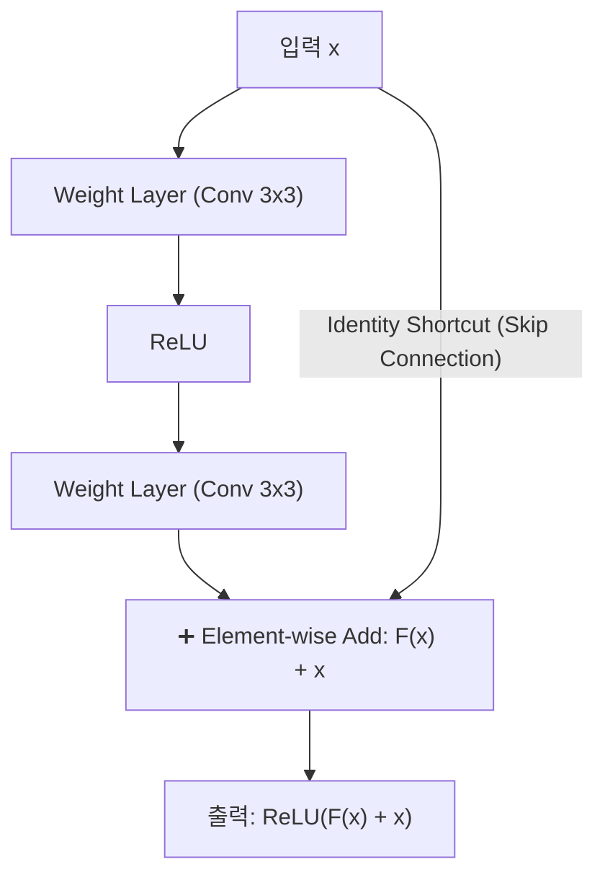

> [!abstract] 핵심 요약
> 컴퓨터 비전의 역사적 도약은 CNN 아키텍처의 혁신과 함께 이루어졌다.
> 2012년 ILSVRC를 석권한 **AlexNet**, $3 \times 3$ 필터를 연속으로 쌓아 비선형성은 높이고 파라미터는 줄인 **VGGNet**, 그리고 152층 이상의 초심층 네트워크에서도 기울기가 막힘없이 흐르도록 지름길(Shortcut/Skip Connection)을 제공하는 **ResNet 잔차 학습(Residual Learning)**의 수학적 원리를 이해해야 한다.

---

## 1. ResNet 잔차 학습(Residual Learning)의 수학적 정식화

$$\mathcal{H}(\mathbf{x}) = \mathcal{F}(\mathbf{x}, \{W_i\}) + \mathbf{x} \implies \frac{\partial \mathcal{L}}{\partial \mathbf{x}} = \frac{\partial \mathcal{L}}{\partial \mathcal{H}} \left( \frac{\partial \mathcal{F}}{\partial \mathbf{x}} + 1 \right)$$



---

## 2. 3대 대표 비전 백본 네트워크 비교

| 아키텍처 | 층수 (Layers) | 핵심 혁신 사항 | Top-5 에러율 |
| :-- | :--: | :-- | :--: |
| **AlexNet (2012)** | 8 | 최초의 심층 GPU CNN, ReLU, Dropout, Data Augmentation | 16.4 % |
| **VGGNet-16 (2014)** | 16 | $3 \times 3$ Conv의 2회 중첩 = $5 \times 5$ 수용장 (파라미터 28% 절감) | 7.3 % |
| **ResNet-50/152 (2015)** | 50 ~ 152 | 잔차 연결(Skip Connection)을 통해 기울기 소실 완전 극복 (인간 초과) | **3.57 %** |

---

## 3. 실시간 ResNet 스킵 연결 vs 일반 Plain Net 역전파 기울기 비교기

```html preview
<div style="font-family:system-ui,-apple-system,sans-serif;padding:20px;background:var(--card);color:var(--card-foreground);border:1px solid var(--border);border-radius:var(--radius)">
  <div style="font-size:16px;font-weight:700;margin-bottom:14px;color:var(--primary);display:flex;align-items:center;gap:8px">
    <span>⚡ ResNet 스킵 연결(Skip Connection) 기울기 고속도로 시뮬레이터</span>
  </div>

  <div style="margin-bottom:14px">
    <div style="display:flex;justify-content:space-between;font-size:11px;color:var(--muted-foreground);margin-bottom:4px">
      <span>네트워크 깊이 (Depth - 블록 수):</span>
      <span id="resnetDepthOut" style="font-weight:700;color:var(--primary)">50 Layers</span>
    </div>
    <input id="inResnetDepth" type="range" min="10" max="150" step="10" value="50" style="width:100%" />
  </div>

  <div style="display:grid;grid-template-columns:1fr 1fr;gap:12px;margin-bottom:12px">
    <div style="padding:10px;background:var(--background);border:1px solid var(--border);border-radius:var(--radius);text-align:center">
      <div style="font-size:10px;color:var(--muted-foreground)">일반 Plain Net 입력단 도달 기울기</div>
      <div id="plainNetGradOut" style="font-family:monospace;font-size:16px;font-weight:800;color:var(--destructive,#ef4444);margin-top:2px">0.000000 %</div>
    </div>
    <div style="padding:10px;background:var(--background);border:1px solid var(--border);border-radius:var(--radius);text-align:center">
      <div style="font-size:10px;color:var(--muted-foreground)">ResNet 스킵 연결 적용 기울기</div>
      <div id="resNetGradOut" style="font-family:monospace;font-size:16px;font-weight:800;color:var(--primary);margin-top:2px">100.00 % (완전 보존)</div>
    </div>
  </div>

  <div id="resLogDesc" style="padding:10px;background:var(--background);border:1px solid var(--border);border-radius:var(--radius);font-size:11px">
    50개 층에서도 dL/dx = dL/dH * (dF/dx + 1)의 항등 덧셈 '+1' 덕분에 그래디언트가 손실 없이 입력층까지 직접 전파됩니다.
  </div>

  <script>
    document.getElementById('inResnetDepth').oninput = function() {
      var depth = parseInt(this.value);
      document.getElementById('resnetDepthOut').textContent = depth + " Layers";

      var plainGrad = Math.pow(0.85, depth) * 100;
      document.getElementById('plainNetGradOut').textContent = plainGrad.toFixed(6) + " %";
      document.getElementById('resNetGradOut').textContent = "100.00 % (보존)";
      document.getElementById('resLogDesc').innerHTML = "💡 " + depth + "층의 심층 구조에서도 잔차 연결은 기울기 소실을 원천 차단하여 100% 학습 수렴을 보장합니다.";
    };
  </script>
</div>
```
