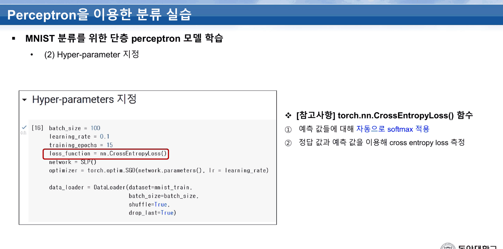
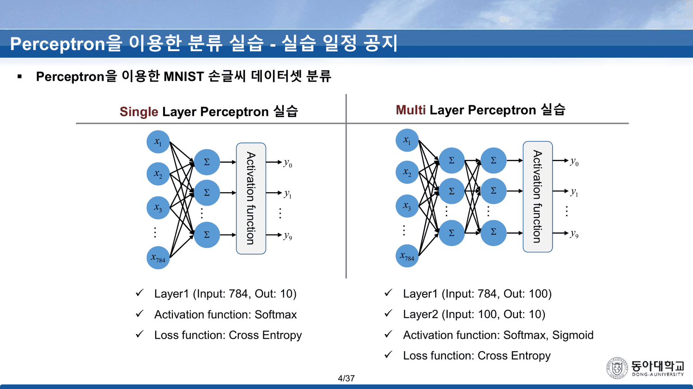
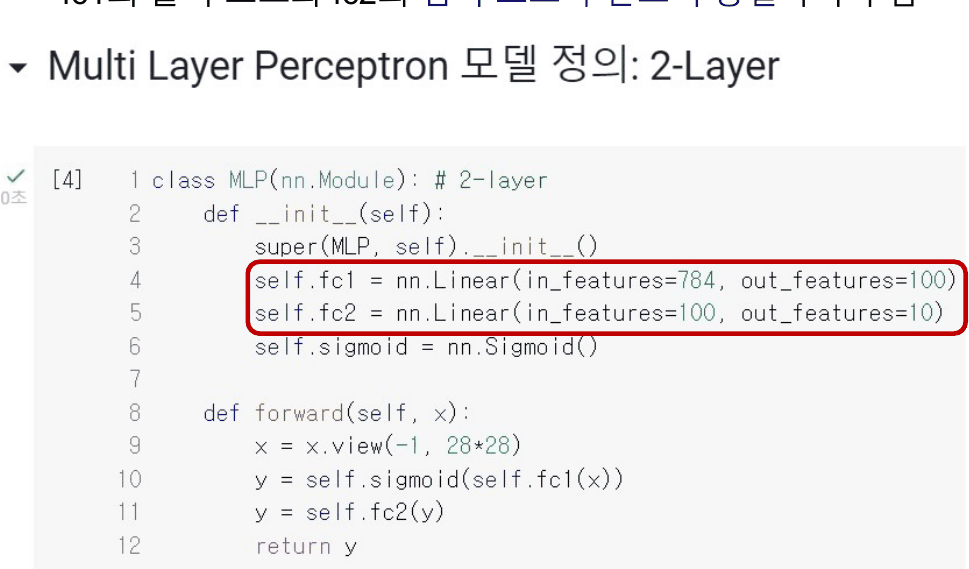
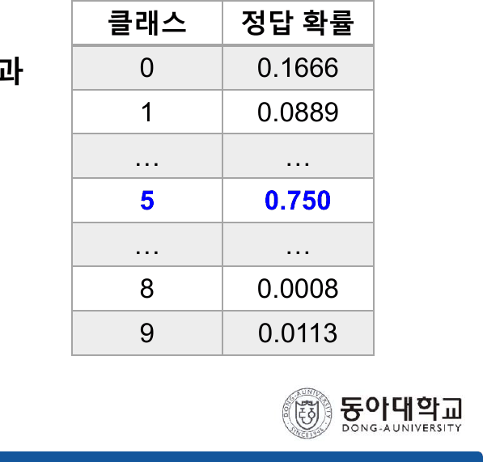
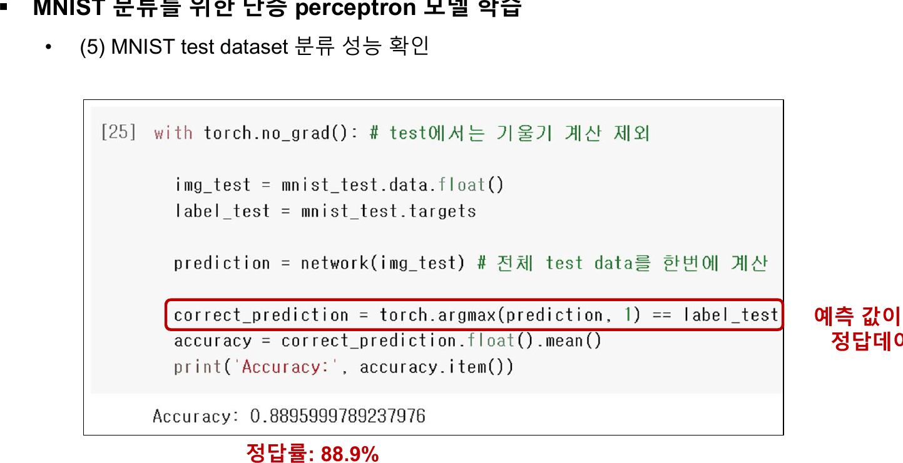
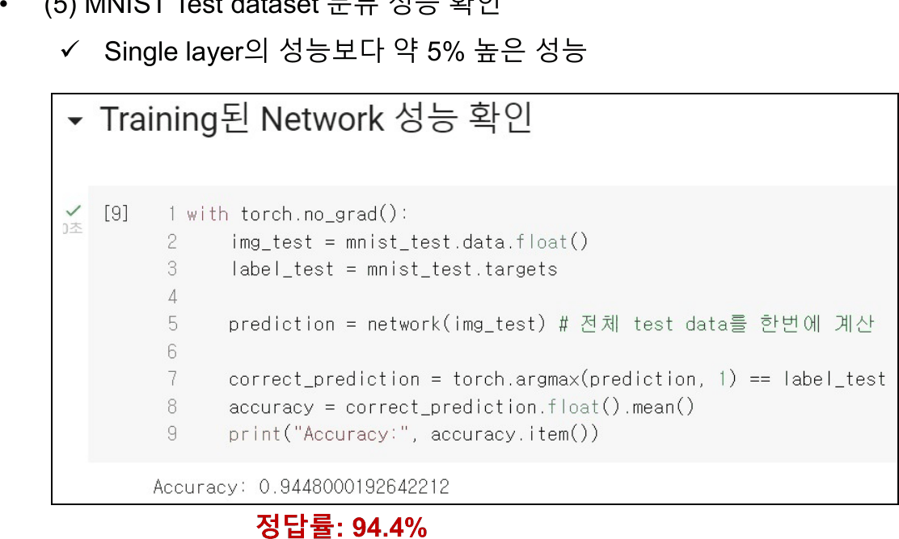
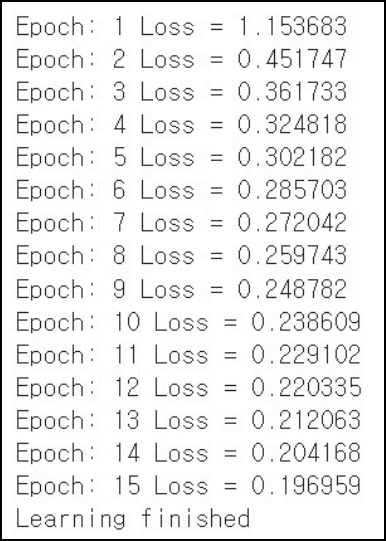

이 과목의 실습 덱 가운데 첫 편이고, 이후 네 편(`Overfitting` · `Vanishing Gradient Effect` · `Optimizer` · CNN 계열)이 전부 이 덱의 코드를 이어받는다. MNIST 60,000장, 배치 100, 학습률 0.1, 15 에폭, 크로스 엔트로피, SGD — 이 여섯 개가 이후 세 덱에서 한 글자도 바뀌지 않는다.

---

## 23번의 네 줄

23번이 학습 반복문을 네 단계로 설명한다.

> 1) 입력 이미지에 대해 forward pass
> 2) 예측 값, 정답을 이용해 loss 계산
> 3) **모든 weight에 대해 편미분 값 계산**
> 4) 파라미터 업데이트

24번이 그 네 줄에 대응하는 코드를 보여 준다.

```python
for epoch in range(training_epochs):
    avg_cost = 0
    total_batch = len(data_loader)
    for img, label in data_loader:
        pred = network(img)                 # 1) forward pass
        loss = loss_function(pred, label)   # 2) loss
        optimizer.zero_grad()
        loss.backward()                     # 3) 모든 weight에 대해 편미분
        optimizer.step()                    # 4) update
        avg_cost += loss / total_batch
```

세 번째 줄이 이 노트의 척추다. `Backpropagation (이론)` 이 **예순 장**(19~83번)을 들여 한 게이트씩 따라간 것이 여기서는 `loss.backward()` 한 줄이다.

| | 이론 덱 | 실습 덱 |
| --- | --- | --- |
| 체인룰의 어휘 | 19~24번 (여섯 장) | — |
| 회로 하나 역전파 | 25~39번 (열다섯 장) | — |
| 숫자 예제 | 40~53번 (열네 장) | — |
| 시그모이드 층 | 54~70번 (열일곱 장) | `nn.Sigmoid()` 한 줄 |
| 행렬로 일반화 | 71~83번 (열세 장) | `nn.Linear(784, 100)` 한 줄 |
| 갱신 | 68·83·84번 | `optimizer.step()` 한 줄 |

그리고 두 번째 줄에서 **이 과목에서 처음으로 정답이 등장한다.**

---

## `label` 이 들어오는 자리

[[07. 54번이 답을 먼저 주고, 덱은 그 답을 쓰지 않고 열여섯 장을 간다]]에서 본 대로, `Backpropagation (이론)` 6번은 역전파를 「계산 결과와 **정답**의 오차를 구해서」라고 정의해 놓고 한 번도 정답을 쓰지 않는다. 55~70번이 최소화하는 $L=0.73$ 은 네트워크 자신의 출력이고, 75~83번의 $f = \sum q_i^2$ 도 출력의 제곱합이다.

`loss_function(pred, label)` 이 그 자리를 메운다. `label` 은 `mnist_train.targets`, 즉 사람이 붙인 숫자다.

21번이 그 손실 함수의 정체를 밝힌다.



> `torch.nn.CrossEntropyLoss()` 함수
> ① 예측 값들에 대해 **자동으로 softmax 적용**
> ② 정답 값과 예측 값을 이용해 cross entropy loss 측정

여기서 이 덱 안의 모순이 하나 생긴다.

---

## 4번은 Softmax를 모델에 적고, 29번의 코드에는 없다

4번이 두 실습의 설계도를 나란히 놓는다.



| | Single Layer Perceptron 실습 | Multi Layer Perceptron 실습 |
| --- | --- | --- |
| 층 | Layer1 (784 → 10) | Layer1 (784 → 100), Layer2 (100 → 10) |
| **Activation function** | **Softmax** | **Softmax, Sigmoid** |
| Loss function | Cross Entropy | Cross Entropy |

그런데 29번의 코드에는 소프트맥스가 없다.



```python
class MLP(nn.Module):           # 2-layer
    def __init__(self):
        super(MLP, self).__init__()
        self.fc1 = nn.Linear(in_features=784, out_features=100)
        self.fc2 = nn.Linear(in_features=100, out_features=10)
        self.sigmoid = nn.Sigmoid()
    def forward(self, x):
        x = x.view(-1, 28*28)
        y = self.sigmoid(self.fc1(x))
        y = self.fc2(y)
        return y
```

`fc2` 의 출력이 그대로 반환된다. 소프트맥스는 21번이 말한 대로 **손실 함수 안에** 있다. 4번의 표가 그것을 모델의 활성화 함수 칸에 적어 두었을 뿐이다.

**이 구분은 실습에서 곧바로 문제가 된다.** 26번과 34번이 정확도를 재는 코드는

```python
correct_prediction = torch.argmax(prediction, 1) == label_test
```

인데, `prediction` 은 소프트맥스를 통과하지 않은 **로짓**이다. `argmax` 는 단조 변환에 불변이므로 결과는 같지만, 6번이 약속한 「0~9까지 숫자들의 정답 **확률**」은 실습 어디에서도 출력되지 않는다.

---

## 6번의 확률표가 1을 넘는다

그 6번의 표를 그대로 옮기면 이렇다.



| 클래스 | 정답 확률 |
| ---: | ---: |
| 0 | 0.1666 |
| 1 | 0.0889 |
| ⋯ | ⋯ |
| **5** | **0.750** |
| ⋯ | ⋯ |
| 8 | 0.0008 |
| 9 | 0.0113 |

인쇄된 **다섯 개만 더해도 1.0176** 이다. 나머지 다섯 클래스(2·3·4·6·7)에 남은 몫은 $-0.0176$ — 확률분포가 될 수 없다. 소프트맥스 출력이라면 열 개의 합이 정확히 1이어야 한다.

```html preview
<div id="pb" style="font-family:system-ui,-apple-system,sans-serif;color:var(--foreground);background:var(--card);border:1px solid var(--border);border-radius:12px;padding:18px 16px;">
  <p style="margin:0 0 14px;font-size:13px;color:var(--muted-foreground);line-height:1.75;">
    6번이 인쇄한 다섯 값(<b>파랑</b>)을 쌓는다. 회색은 숨겨진 다섯 클래스에 남아야 할 몫이다.</p>
  <svg id="pbs" viewBox="0 0 640 210" style="width:100%;height:auto;display:block;"></svg>
  <div id="pbo" style="margin-top:8px;font-size:13.5px;line-height:1.95;font-variant-numeric:tabular-nums;"></div>
</div>
<script>
(function(){
  const NS='http://www.w3.org/2000/svg', svg=document.getElementById('pbs');
  const el=(t,a,x)=>{const e=document.createElementNS(NS,t);for(const k in a)e.setAttribute(k,a[k]);
    if(x!==undefined)e.textContent=x;return e;};
  const P=[{c:'0',v:0.1666},{c:'1',v:0.0889},{c:'2',v:null},{c:'3',v:null},{c:'4',v:null},
           {c:'5',v:0.750},{c:'6',v:null},{c:'7',v:null},{c:'8',v:0.0008},{c:'9',v:0.0113}];
  const shown=P.filter(p=>p.v!==null).reduce((a,p)=>a+p.v,0);
  const rest=1-shown;
  const L=44,R=620,T=16,B=168;
  const bw=(R-L)/10;
  const sy=v=>B-v/0.8*(B-T);
  for(const g of [0,0.2,0.4,0.6,0.8]){
    svg.appendChild(el('line',{x1:L,y1:sy(g),x2:R,y2:sy(g),stroke:'var(--border)',
      'stroke-dasharray':g===0?'':'3 5',opacity:g===0?1:0.5}));
    svg.appendChild(el('text',{x:L-7,y:sy(g)+4,'text-anchor':'end','font-size':10,
      fill:'var(--muted-foreground)'},g.toFixed(1)));
  }
  P.forEach((p,i)=>{
    const x=L+i*bw+bw*0.18, w=bw*0.64;
    const v = p.v!==null? p.v : rest/5;
    const h = Math.abs(sy(Math.abs(v))-sy(0));
    svg.appendChild(el('rect',{x:x,y:v>=0?sy(v):sy(0),width:w,height:Math.max(1.5,h),
      fill:p.v!==null?'var(--chart-1)':'var(--chart-2)',opacity:p.v!==null?1:0.65,rx:2}));
    svg.appendChild(el('text',{x:x+w/2,y:B+16,'text-anchor':'middle','font-size':11,
      fill:'var(--foreground)'},p.c));
    if(p.v!==null) svg.appendChild(el('text',{x:x+w/2,y:sy(p.v)-6,'text-anchor':'middle',
      'font-size':10.5,fill:'var(--chart-1)','font-weight':700},p.v.toFixed(4)));
  });
  svg.appendChild(el('text',{x:L,y:196,'font-size':11,fill:'var(--chart-2)'},
    '회색 다섯 칸 = (1 − 인쇄된 다섯 값의 합) ÷ 5 = '+(rest/5).toFixed(4)+' — 음수다'));
  document.getElementById('pbo').innerHTML =
    '인쇄된 다섯 값의 합 = <b style="color:var(--chart-2)">'+shown.toFixed(4)+'</b>'+
    ' &nbsp;|&nbsp; 열 클래스의 합은 <b>1</b> 이어야 한다'+
    '<br><span style="color:var(--muted-foreground);font-size:12.5px;">'+
    '남은 다섯 클래스에 배정할 수 있는 총량이 '+rest.toFixed(4)+' 이다. '+
    '5번의 0.750 을 0.7324 이하로 내리거나, 0번의 0.1666 을 0.1490 이하로 내려야 성립한다.</span>';
})();
</script>
```

---

## 두 모델, 두 숫자

26번과 34번이 결과를 낸다.





| | Single Layer | 2-layer MLP |
| --- | ---: | ---: |
| 구조 | 784 → 10 | 784 → 100 → 10 |
| 파라미터 | $784\cdot10+10 = 7{,}850$ | $78{,}500 + 1{,}010 = 79{,}510$ |
| 첫 에폭 손실 | — | 1.153683 |
| 마지막 에폭 손실 | — | 0.196959 |
| 시험 정확도 (원문) | 0.8895999789237976 | 0.9448000192642212 |
| 슬라이드 표기 | 88.9% | 94.4% |



34번이 한 줄 덧붙인다 — 「Single layer의 성능보다 **약 5%** 높은 성능」. 실제 차이는 $94.48 - 88.96 = 5.52$ **퍼센트 포인트**다.

그 5.52pp를 위해 파라미터가 **10.13배**가 되었다. 2번 슬라이드가 말하는 「일반적으로 신경망을 깊게 설계할수록 더 좋은 성능을 기대함」(`Vanishing Gradient Effect` 3번의 표현)의 첫 증거이고, 동시에 그 대가의 첫 청구서다.

```html preview
<div id="cmp" style="font-family:system-ui,-apple-system,sans-serif;color:var(--foreground);background:var(--card);border:1px solid var(--border);border-radius:12px;padding:18px 16px;">
  <p style="margin:0 0 14px;font-size:13px;color:var(--muted-foreground);line-height:1.75;">
    32번의 손실 로그 15줄(원본 값 그대로)과 두 모델의 정확도. 막대를 누르면 전환된다.</p>
  <div style="display:flex;gap:8px;margin-bottom:14px;">
    <button class="cb on" data-k="0" style="font:inherit;font-size:11.5px;padding:5px 11px;border-radius:6px;cursor:pointer;">정확도</button>
    <button class="cb" data-k="1" style="font:inherit;font-size:11.5px;padding:5px 11px;border-radius:6px;cursor:pointer;">2층 MLP 손실 곡선</button>
  </div>
  <svg id="cs" viewBox="0 0 640 220" style="width:100%;height:auto;display:block;"></svg>
  <div id="co" style="margin-top:10px;font-size:13.5px;line-height:1.95;font-variant-numeric:tabular-nums;"></div>
  <style>#cmp .cb{border:1px solid var(--border);background:transparent;color:var(--muted-foreground);}
    #cmp .cb.on{background:var(--chart-1);border-color:var(--chart-1);color:var(--card);font-weight:700;}</style>
</div>
<script>
(function(){
  const NS='http://www.w3.org/2000/svg', svg=document.getElementById('cs');
  const el=(t,a,x)=>{const e=document.createElementNS(NS,t);for(const k in a)e.setAttribute(k,a[k]);
    if(x!==undefined)e.textContent=x;return e;};
  const loss=[1.153683,0.451747,0.361733,0.324818,0.302182,0.285703,0.272042,0.259743,
              0.248782,0.238609,0.229102,0.220335,0.212063,0.204168,0.196959];
  const acc=[{n:'Single Layer (784→10)',v:0.8895999789237976,p:7850},
             {n:'2-layer MLP (784→100→10)',v:0.9448000192642212,p:79510}];
  const out=document.getElementById('co');
  function drawAcc(){
    svg.textContent='';
    const L=52,R=620,T=22,B=170;
    const sy=v=>B-(v-0.85)/0.12*(B-T);
    for(const g of [0.85,0.88,0.91,0.94,0.97]){
      svg.appendChild(el('line',{x1:L,y1:sy(g),x2:R,y2:sy(g),stroke:'var(--border)',
        'stroke-dasharray':'3 5',opacity:0.6}));
      svg.appendChild(el('text',{x:L-7,y:sy(g)+4,'text-anchor':'end','font-size':10,
        fill:'var(--muted-foreground)'},(g*100).toFixed(0)+'%'));
    }
    acc.forEach((a,i)=>{
      const x=L+60+i*250;
      svg.appendChild(el('rect',{x:x,y:sy(a.v),width:150,height:B-sy(a.v),
        fill:i?'var(--chart-1)':'var(--chart-2)',rx:3}));
      svg.appendChild(el('text',{x:x+75,y:sy(a.v)-9,'text-anchor':'middle','font-size':13,
        fill:'var(--foreground)','font-weight':700},(a.v*100).toFixed(2)+'%'));
      svg.appendChild(el('text',{x:x+75,y:B+17,'text-anchor':'middle','font-size':11,
        fill:'var(--muted-foreground)'},a.n));
      svg.appendChild(el('text',{x:x+75,y:B+33,'text-anchor':'middle','font-size':10.5,
        fill:'var(--muted-foreground)'},'파라미터 '+a.p.toLocaleString('en-US')));
    });
    out.innerHTML='차이 <b style="color:var(--chart-1)">+5.52 퍼센트 포인트</b> '+
      '(슬라이드 표기: 「약 5%」) &nbsp;|&nbsp; 파라미터는 <b>10.13배</b>'+
      '<br><span style="color:var(--muted-foreground);font-size:12.5px;">'+
      '오류 기준으로 보면 11.04% → 5.52% 로 <b>정확히 절반</b>이 된다.</span>';
  }
  function drawLoss(){
    svg.textContent='';
    const L=52,R=620,T=18,B=172;
    const sx=i=>L+i/14*(R-L), sy=v=>B-v/1.25*(B-T);
    for(const g of [0,0.25,0.5,0.75,1.0,1.25]){
      svg.appendChild(el('line',{x1:L,y1:sy(g),x2:R,y2:sy(g),stroke:'var(--border)',
        'stroke-dasharray':g===0?'':'3 5',opacity:g===0?1:0.5}));
      svg.appendChild(el('text',{x:L-7,y:sy(g)+4,'text-anchor':'end','font-size':10,
        fill:'var(--muted-foreground)'},g.toFixed(2)));
    }
    let d='';
    loss.forEach((v,i)=>{d+=(i?'L':'M')+sx(i)+' '+sy(v);});
    svg.appendChild(el('path',{d:d,fill:'none',stroke:'var(--chart-1)','stroke-width':2.4}));
    loss.forEach((v,i)=>svg.appendChild(el('circle',{cx:sx(i),cy:sy(v),r:3,fill:'var(--chart-1)'})));
    [0,4,9,14].forEach(i=>svg.appendChild(el('text',{x:sx(i),y:B+16,'text-anchor':'middle',
      'font-size':10.5,fill:'var(--muted-foreground)'},'ep '+(i+1))));
    svg.appendChild(el('text',{x:sx(0)+6,y:sy(loss[0])-8,'font-size':11,
      fill:'var(--chart-1)','font-weight':700},loss[0].toFixed(3)));
    svg.appendChild(el('text',{x:sx(14)-6,y:sy(loss[14])-10,'text-anchor':'end','font-size':11,
      fill:'var(--chart-1)','font-weight':700},loss[14].toFixed(3)));
    out.innerHTML='첫 에폭에서 <b>'+loss[0].toFixed(3)+'</b> → 둘째 에폭 <b>'+loss[1].toFixed(3)+
      '</b> 로 한 번에 <b>'+((1-loss[1]/loss[0])*100).toFixed(0)+'%</b> 떨어진다. '+
      '나머지 열세 에폭이 0.452 → 0.197 을 마저 간다.'+
      '<br><span style="color:var(--muted-foreground);font-size:12.5px;">'+
      '이 곡선을 기억해 둘 것 — 같은 코드에 층을 셋 더 얹으면 '+
      '첫 줄부터 2.308 에서 꿈쩍하지 않는다(Vanishing Gradient Effect 38번).</span>';
  }
  document.querySelectorAll('#cmp .cb').forEach(b=>b.onclick=()=>{
    document.querySelectorAll('#cmp .cb').forEach(x=>x.classList.remove('on'));
    b.classList.add('on'); (+b.dataset.k? drawLoss: drawAcc)();});
  drawAcc();
})();
</script>
```

---

## 13~16번 — 2차원을 펴는 이유

이 덱이 이론 덱보다 잘하는 것이 하나 있다. **입력의 모양**이다.

13번이 `Perceptron의 각 노드는 한번에 1개의 값을 입력 받을 수 있음` 이라 적고 28×28 이미지에 `입력 불가!` 를 붙인다. 14번이 「평탄화」로 $28\times28\times1 \to 784\times1$ 을 만들고, 15번이 전체 경로를 $28\times28 \to 784\times1 \to 10\times1$ 로 그린다. 16번이 `torch.Tensor.view` 문서 링크를 준다.

`Backpropagation (이론)` 72~74번이 $x \in \mathbb{R}^m$ 이라 쓰고 넘어간 자리에서, 이 덱은 $m = 784$ 가 어디서 오는지를 네 장에 걸쳐 보인다. 공책 4쪽이 full-HD와 4K를 텐서로 적어 둔 것과 같은 계열의 설명이다([[08. 덱이 약속만 하고 넘어간 절은 공책에 있다]]).

---

## 발견한 원본 문제

> [!caution] 이 절이 가리키는 것
> 37쪽 전체를 읽고, 인쇄된 정확도·손실·확률을 파이썬으로 재계산해 대조했다.

`확률이 되지 않는 표`

- **6번의 「정답 확률」** — 인쇄된 다섯 값(0.1666 · 0.0889 · 0.750 · 0.0008 · 0.0113)의 합이 **1.0176** 이다. 열 클래스의 합이 1이어야 하므로 숨겨진 다섯 클래스의 몫이 $-0.0176$ 이 된다. 또 다섯 값 중 `0.750` 만 소수 셋째 자리까지이고 나머지는 넷째 자리까지다

`설계도와 코드가 맞지 않는 것`

- **4번의 `Activation function: Softmax` (SLP) · `Softmax, Sigmoid` (MLP)** — 17~19번과 29번의 코드 어디에도 소프트맥스 선언이 없다. 21번이 그 이유를 밝힌다(`CrossEntropyLoss` 가 자동으로 적용). 같은 덱 안에서 **4번은 모델의 일부로, 21번은 손실의 일부로** 같은 함수를 배치한다
- **그래서 6번이 약속한 「0~9까지 숫자들의 정답 확률」은 실습에서 출력되지 않는다** — 26·34번이 쓰는 `torch.argmax(prediction, 1)` 의 `prediction` 은 로짓이다. `argmax` 는 단조 변환에 불변이라 정확도는 영향을 받지 않는다 *(이 판정은 원본에 없는 보충이다)*

`중복`

- **2번과 3번이 같은 `Contents` 다** — 추출 텍스트가 56자로 동일하다. 27번에도 같은 목차가 한 번 더 나온다(57자). 37쪽 덱에 목차가 **세 번** 인쇄된다

`표기`

- **34번의 「약 5% 높은 성능」** — $94.48\% - 88.96\% = 5.52$ 퍼센트 포인트다. 백분율 차이와 퍼센트 포인트를 구분하지 않는 표기이고, 상대 개선으로 계산하면 $+6.21\%$ 다
- **26·34번의 「정답률」이 절사 표기다** — $0.8895999\ldots \to 88.9\%$, $0.9448000\ldots \to 94.4\%$. 이 덱에서는 절사와 반올림이 같은 값을 주므로 문제가 없지만, 같은 관행이 `Overfitting` 28번과 `Vanishing Gradient Effect` 48번에서는 틀린 숫자를 만든다

---

## 다른 문서와의 연결

- [[07. 54번이 답을 먼저 주고, 덱은 그 답을 쓰지 않고 열여섯 장을 간다]] — 정답이 없던 회로. `loss_function(pred, label)` 이 그 자리를 메운다
- [[04. 목록은 길고 고르는 기준은 한 줄이다]] — `MLP(이론)` 15~17번의 소프트맥스. 21번이 그것을 손실 함수 안으로 넣는다
- [[08. 덱이 약속만 하고 넘어간 절은 공책에 있다]] — 공책 10쪽의 `Network parameter = 2` 와 배치·에폭. 이 덱의 20·30번 하이퍼파라미터 목록과 그대로 대응한다
- [[12. 여섯 가지를 가르치고 셋을 해 본다]] — 이 덱의 코드가 300장으로 줄어든다
- [[14. 다섯 층을 쌓으면 손실이 ln 10 에 붙는다]] — 이 덱의 2층 구조에 층 셋을 더한 것이 그 덱의 출발점이다
- [[11. 여섯 장을 들여 더 좋은 옵티마이저를 소개하고, 실습 결과는 전부 더 나쁘다]] — 같은 SLP를 2023년판으로 다시 돌린다

---

## 근거 자료

`MLP(실습).pdf` 37쪽.

| 슬라이드 | 무엇이 있는가 | 인용 |
| ---: | --- | --- |
| 2 · 3 · 27 | `Contents` (세 번) | |
| 4 | 두 실습의 설계도 — 층 구성과 활성화 함수 | ✔ |
| 5 | MNIST 소개 — train 60,000 / test 10,000 | |
| 6 | 입출력 — 「0~9까지 숫자들의 정답 확률」 표 | ✔ |
| 7~12 | 구글 드라이브 마운트, 데이터셋 저장, 형상 확인 | |
| 13~16 | 평탄화 $28\times28\times1 \to 784\times1$ | |
| 17~19 | SLP 모델 정의 (`__init__` / `forward`) | |
| 20~22 | 하이퍼파라미터 · `CrossEntropyLoss` · `DataLoader` | ✔ (21) |
| 23~24 | 학습 반복문 네 단계 | |
| 25~26 | 파라미터 저장 · 시험 정확도 88.9% | ✔ (26) |
| 28~31 | MLP 모델 정의와 하이퍼파라미터 | ✔ (29) |
| 32 | 손실 로그 15줄 | ✔ |
| 33~34 | 저장 · 시험 정확도 94.4% | ✔ (34) |
| 35~36 | 첫 시험 이미지의 예측값 확인 | |

수치 검산: 두 정확도의 원문 값(`0.8895999789237976`, `0.9448000192642212`)과 그 차이, 파라미터 수 $7{,}850$ 대 $79{,}510$, 6번 확률표 다섯 값의 합 $1.0176$, 32번 손실 로그 15줄을 모두 파이썬으로 계산했다.
