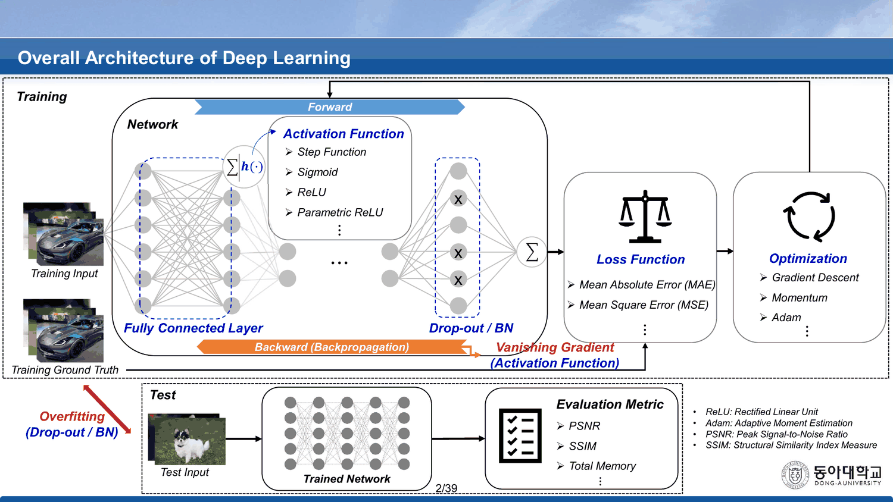
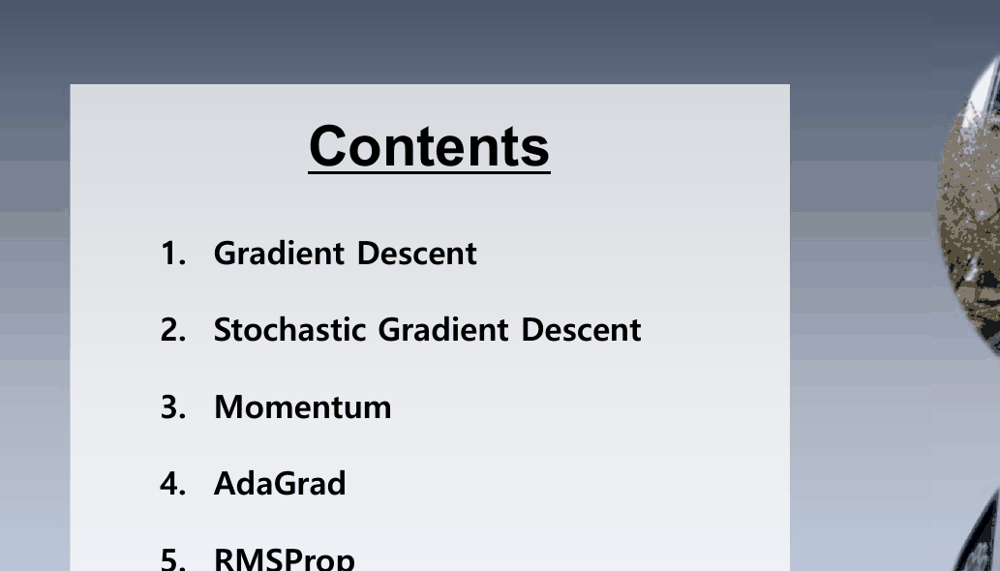
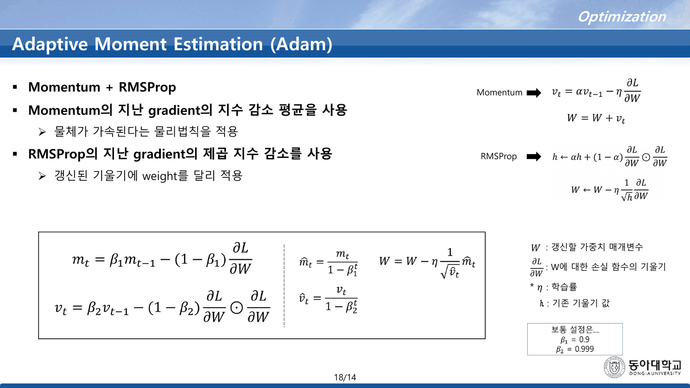
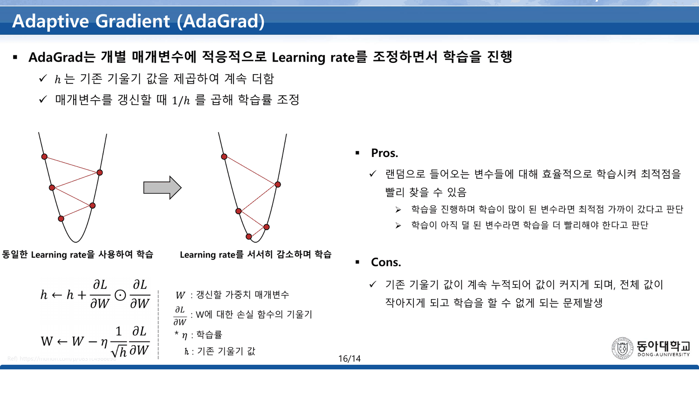

`Backpropagation (이론)` 84번이 마지막 내용 슬라이드에서 「탐색 방법 $\Delta w$ 에 따라 하강법이 결정 · 종류: 경사하강법, 모멘텀 등 → Optimization(최적화)」이라 적고 넘긴 그 자리를 이 덱이 받는다([[05. 방향은 열 장, 보폭은 이름이 없다]]). 21쪽이고, 그중 여섯 장이 다섯 개의 갱신식을 인쇄한다.

그 다섯 식이 **한 줄에서 시작한 부호 관례를 끝까지 끌고 간다.**

---

## 먼저: 쪽번호가 세 가지다

이 덱의 꼬리표를 그대로 옮기면 이렇다.

| 쪽 | 인쇄된 꼬리표 |
| ---: | --- |
| 1 | `1/14` |
| **2** | **`2/39`** |
| 3 · 8 | `3/14` · `8/14` |
| 15 ~ 20 | **`15/14` · `16/14` · `17/14` · `18/14` · `19/14` · `20/14`** |
| **21** | **`21/76`** |

21쪽짜리 PDF에 분모가 **14 · 39 · 76** 셋이고, 여섯 장은 분자가 분모보다 크다.

39의 출처는 찾을 수 있다. 2번은 이 과목 모든 덱의 두 번째 장인 `Overall Architecture of Deep Learning` 이고, `MLP(이론)` 에서도 이 장만 `2/39` 였다([[04. 목록은 길고 고르는 기준은 한 줄이다]]). **원본 덱의 꼬리표를 달고 통째로 옮겨 다니는 슬라이드**다.



그리고 14는 이 덱이 한때 14쪽이었다는 뜻으로 읽힌다 — 15번부터 여섯 장이 나중에 붙었고, 그 여섯 장이 바로 **Momentum · AdaGrad · RMSprop · Adam · 비교 그림 둘**이다. 이 덱의 핵심이 증축된 부분에 있다.

---

## 목차 앞의 다섯 장

8번이 `Contents` 다. 그런데 덱은 3번부터 시작한다.

| 쪽 | 제목 |
| ---: | --- |
| 3 | `Normalization (정규화)` |
| 4 | `(1) Min-Max 정규화 · (2) 표준 정규화` |
| 5 | `Min-Max 정규화` |
| 6 | `표준 정규화` |
| 7 | `정규분포 (표준정규분포)` |
| **8** | **`Contents`** |

정규화 다섯 장이 목차보다 **앞**에 있고, 목차 여섯 줄 어디에도 정규화가 없다. 목차는 이렇게 시작한다.



> 1. Gradient Descent 2. Stochastic Gradient Descent 3. Momentum 4. AdaGrad 5. RMSProp 6. Adam

그런데 덱이 실제로 다루는 것은 **일곱 개**다 — 12번 GD, **13번 Mini-batch GD**, 14번 SGD, 15번 Momentum, 16번 AdaGrad, 17번 RMSprop, 18번 Adam. 목차에 없는 것이 13번 Mini-batch GD인데, 이 덱에서 가장 실용적인 장이다(`MLP(실습)` 이후 모든 실습이 `batch_size = 100` 으로 하는 것이 정확히 이것이다).

> [!note] 정규화 다섯 장에는 여백의 잉크가 있다
> 5번은 외부 자료의 캡처이고, 그 위에 **빨간 펜 주석**이 얹혀 있다 — `⇒ i) X = X_min ; X' = 0`, `ii) X = X_max ; X' = 1` 을 형광펜 상자로 묶었다. 인쇄된 식 $X' = \frac{X - X_{min}}{X_{max}-X_{min}}$ 이 왜 0과 1 사이로 가는지를 두 경계에서 확인하는 손글씨다. 슬라이드 본문에는 「0과 1 사이의 값으로 변함」 한 줄뿐이다.
>
> 두 표는 검산된다. 5번의 `feature_3` 열 열한 개를 Min-Max로 변환하면 인쇄된 값과 $5\times10^{-7}$ 이내로 일치하고, 6번의 표준화 열은 **표본표준편차**($n-1$, $\sigma = 69.2283$)로 나눈 값과 소수 여섯째 자리까지 정확히 일치한다(모표준편차 $66.0066$ 으로 나누면 최대 0.083 어긋난다). *(이 검산은 원본에 없는 보충이다.)*

---

## 12~14번 — 배치의 세 가지 크기

| 슬라이드 | 이름 | 한 번의 갱신에 쓰는 데이터 |
| ---: | --- | --- |
| 12 | Gradient Descent (GD) | **전체 학습데이터** — 「※ 일반적인 Batch 단위가 아닌 전체 데이터 셋이라는 점을 유의할 것」 |
| 13 | Mini-batch GD | 여러 개의 Batch 단위로 나눈 한 덩이 |
| 14 | Stochastic GD (SGD) | 「학습데이터 세트들 중 **하나의 데이터**를 Random하게 선택」 |

14번의 정의는 엄격한 한 표본 방식이다. 그런데 **같은 덱 19·20번의 비교 그림과 `Optimizer` 실습의 `SGD` 는 그 뜻이 아니다** — 실습 코드는 `torch.optim.SGD(...)` 에 `batch_size = 100` 짜리 `DataLoader` 를 물린 미니배치 SGD다([[11. 여섯 장을 들여 더 좋은 옵티마이저를 소개하고, 실습 결과는 전부 더 나쁘다]]). 덱은 13번에서 미니배치를 별도 항목으로 세워 놓고, 뒤에서는 그것을 SGD라 부른다.

12번의 단점 목록에 오탈자가 하나 있다 — 「모델 파라미터의 **업데이터**가 이루어지기 전까지」.

---

## 15~18번 — 다섯 개의 식과 하나의 관례

15번이 Momentum을 이렇게 인쇄한다.

$$v_t = \alpha v_{t-1} - \eta\frac{\partial L}{\partial W},\qquad W = W + v_t$$

**속도 $v$ 안에 부호와 학습률이 함께 들어 있다.** 그래서 마지막 줄이 $W = W + v_t$ 로 더하기다. 이것은 널리 쓰이는 표기이고 그 자체로 옳다.

16번 AdaGrad와 17번 RMSprop은 다른 관례를 쓴다 — 누적량 $h$ 는 부호 없이 쌓고, 갱신 줄에서 $-\eta$ 를 붙인다.

$$h \leftarrow h + \frac{\partial L}{\partial W}\odot\frac{\partial L}{\partial W},\qquad W \leftarrow W - \eta\frac{1}{\sqrt h}\frac{\partial L}{\partial W}$$

$$h \leftarrow \alpha h + (1-\alpha)\frac{\partial L}{\partial W}\odot\frac{\partial L}{\partial W},\qquad W \leftarrow W - \eta\frac{1}{\sqrt h}\frac{\partial L}{\partial W}$$

한 덱 안에 **두 관례**가 있다. 그리고 18번 Adam이 둘을 합칠 때 15번 쪽 부호를 가져오면서 16·17번 쪽 갱신 줄도 함께 가져온다.



$$m_t = \beta_1 m_{t-1} \;{\color{red}-}\; (1-\beta_1)\frac{\partial L}{\partial W}$$
$$v_t = \beta_2 v_{t-1} \;{\color{red}-}\; (1-\beta_2)\frac{\partial L}{\partial W}\odot\frac{\partial L}{\partial W}$$
$$\hat m_t = \frac{m_t}{1-\beta_1^t},\quad \hat v_t = \frac{v_t}{1-\beta_2^t},\qquad W = W - \eta\frac{1}{\sqrt{\hat v_t}}\hat m_t$$

오른쪽 아래 상자에 `보통 설정은… β₁ = 0.9, β₂ = 0.999` 가 있다.

**두 개의 빼기가 문제를 만든다.**

- $m_t$ 에 붙은 빼기는 15번의 관례대로 부호를 속도 안에 넣은 것이다. 그런데 마지막 줄이 $-\eta$ 를 **다시** 곱한다. 부호가 두 번 뒤집혀 갱신 방향이 **상승**이 된다
- $v_t$ 에 붙은 빼기는 훨씬 심각하다. $v_0 = 0$ 이고 $\frac{\partial L}{\partial W}\odot\frac{\partial L}{\partial W} \ge 0$ 이므로, $v_t$ 는 **첫 스텝부터 음수**이고 영원히 음수다. $\sqrt{\hat v_t}$ 가 실수가 아니다

### 인쇄된 식을 세 스텝만 돌려 본다

```html preview
<div id="ad" style="font-family:system-ui,-apple-system,sans-serif;color:var(--foreground);background:var(--card);border:1px solid var(--border);border-radius:12px;padding:18px 16px;">
  <p style="margin:0 0 14px;font-size:13px;color:var(--muted-foreground);line-height:1.75;">
    18번에 인쇄된 상수 그대로 — <b>β₁ = 0.9 · β₂ = 0.999</b>. 기울기 g 하나를 정하고
    세 스텝을 돌린다. 왼쪽이 슬라이드의 식, 오른쪽은 두 빼기를 더하기로 바꾼 식.</p>
  <label style="font-size:12.5px;display:block;margin-bottom:14px;">∂L/∂W = g
    <input id="adg" type="range" min="-30" max="30" step="1" value="5" style="width:190px;vertical-align:middle;">
    <b id="adgv" style="color:var(--chart-1);font-variant-numeric:tabular-nums;">0.5</b></label>
  <div style="display:grid;grid-template-columns:1fr 1fr;gap:14px;">
    <div style="border:1px solid var(--chart-2);border-radius:9px;padding:12px;">
      <div style="font-size:12px;font-weight:700;color:var(--chart-2);margin-bottom:8px;">18번에 인쇄된 식</div>
      <div id="adl" style="font-size:12px;line-height:1.95;font-variant-numeric:tabular-nums;"></div>
    </div>
    <div style="border:1px solid var(--border);border-radius:9px;padding:12px;">
      <div style="font-size:12px;font-weight:700;color:var(--chart-1);margin-bottom:8px;">빼기를 더하기로</div>
      <div id="adr" style="font-size:12px;line-height:1.95;font-variant-numeric:tabular-nums;"></div>
    </div>
  </div>
  <div id="ado" style="margin-top:12px;font-size:13.5px;line-height:1.95;border-top:1px solid var(--border);padding-top:11px;"></div>
</div>
<script>
(function(){
  const b1=0.9, b2=0.999, eta=0.1;
  const G=document.getElementById('adg');
  const f=(v,n)=>(v<0?'−':'')+Math.abs(v).toFixed(n===undefined?5:n);
  function run(sign){
    let m=0,v=0,out='';
    for(let t=1;t<=3;t++){
      m = b1*m + sign*(1-b1)*g;
      v = b2*v + sign*(1-b2)*(g*g);
      const mh=m/(1-Math.pow(b1,t)), vh=v/(1-Math.pow(b2,t));
      const sq = vh<0 ? null : Math.sqrt(vh);
      const upd = sq===null? null : -eta*mh/sq;
      out += 't='+t+' &nbsp; m̂ = <b>'+f(mh,4)+'</b> &nbsp; v̂ = <b>'+f(vh,5)+'</b><br>'+
        '<span style="padding-left:1.2em;">√v̂ = '+(sq===null
          ? '<b style="color:var(--chart-2)">실수 아님</b>' : '<b>'+f(sq,4)+'</b>')+
        ' &nbsp; ΔW = '+(upd===null
          ? '<b style="color:var(--chart-2)">정의되지 않음</b>'
          : '<b style="color:'+(upd*g<0?'var(--chart-1)':'var(--chart-2)')+'">'+f(upd,4)+'</b>')+
        '</span><br>';
    }
    return out;
  }
  let g=0.5;
  function draw(){
    g=+G.value/10 || 0.1;
    document.getElementById('adgv').textContent=f(g,1);
    document.getElementById('adl').innerHTML=run(-1);
    document.getElementById('adr').innerHTML=run(+1);
    document.getElementById('ado').innerHTML=
      '<b style="color:var(--chart-2)">왼쪽</b>: v₀ = 0 에서 음수만 빼므로 v̂ 이 항상 음수 → '+
      '√v̂ 가 실수가 아니고 갱신량이 정의되지 않는다. m̂ 도 부호가 뒤집혀 있어, '+
      '설령 √ 를 |v̂| 로 우회해도 마지막 줄의 −η 와 곱해져 <b>기울기와 같은 방향</b>(경사 상승)으로 간다.<br>'+
      '<b style="color:var(--chart-1)">오른쪽</b>: 두 빼기를 더하기로 바꾸면 ΔW 의 부호가 g 와 반대가 되어 하강한다. '+
      '<span style="color:var(--muted-foreground);font-size:12.5px;">(η = 0.1 로 두고 계산했다 — 18번에 η 값은 적혀 있지 않다.)</span>';
  }
  G.oninput=draw; draw();
})();
</script>
```

> [!caution] 이것은 표기 차이가 아니라 값이 달라지는 오류다
> 15번의 $v_t = \alpha v_{t-1} - \eta\frac{\partial L}{\partial W}$ 는 **$\eta$ 를 안에 품고 있고** 갱신 줄이 $W = W + v_t$ 다. 부호가 한 번만 뒤집힌다. 18번의 $m_t$ 는 $\eta$ 를 품지 않은 채 빼기만 가져왔고 갱신 줄은 $W = W - \eta(\cdots)$ 다. **부호가 두 번 뒤집힌다.** 15번을 그대로 베끼면서 갱신 줄만 16·17번 것을 쓴 결과로 보인다.

---

## 16번 — 본문은 $1/h$, 수식은 $1/\sqrt h$

같은 성격의 어긋남이 한 장 더 있다. 16번 AdaGrad의 본문 두 번째 줄은

> 매개변수를 갱신할 때 $1/h$ 를 곱해 학습률 조정

인데, 바로 아래 수식은 $\frac{1}{\sqrt h}$ 다.



차이는 작지 않다. $h$ 가 기울기 제곱의 **누적**이므로 스텝이 쌓일수록 커지고, $1/h$ 와 $1/\sqrt h$ 는 그 감쇠 속도가 완전히 다르다.

```html preview
<div id="ag" style="font-family:system-ui,-apple-system,sans-serif;color:var(--foreground);background:var(--card);border:1px solid var(--border);border-radius:12px;padding:18px 16px;">
  <p style="margin:0 0 14px;font-size:13px;color:var(--muted-foreground);line-height:1.75;">
    16번의 누적식 <b>h ← h + g²</b> 를 그대로 돌리면서, 실효 학습률을
    본문이 말하는 <b>η/h</b> 와 수식이 말하는 <b>η/√h</b> 로 각각 계산한다.</p>
  <div style="display:flex;flex-wrap:wrap;gap:18px;margin-bottom:12px;font-size:12.5px;">
    <label>기울기 크기 |g|
      <input id="agg" type="range" min="1" max="30" step="1" value="10" style="width:150px;vertical-align:middle;">
      <b id="aggv" style="color:var(--chart-1);font-variant-numeric:tabular-nums;">1.0</b></label>
    <label>η
      <input id="age" type="range" min="1" max="20" step="1" value="10" style="width:120px;vertical-align:middle;">
      <b id="agev" style="color:var(--chart-1);font-variant-numeric:tabular-nums;">0.10</b></label>
  </div>
  <svg id="ags" viewBox="0 0 640 230" style="width:100%;height:auto;display:block;"></svg>
  <div id="ago" style="margin-top:8px;font-size:13.5px;line-height:1.95;font-variant-numeric:tabular-nums;"></div>
</div>
<script>
(function(){
  const NS='http://www.w3.org/2000/svg', svg=document.getElementById('ags');
  const el=(t,a,x)=>{const e=document.createElementNS(NS,t);for(const k in a)e.setAttribute(k,a[k]);
    if(x!==undefined)e.textContent=x;return e;};
  const Gg=document.getElementById('agg'), Ge=document.getElementById('age');
  function draw(){
    const g=+Gg.value/10, eta=+Ge.value/100;
    document.getElementById('aggv').textContent=g.toFixed(1);
    document.getElementById('agev').textContent=eta.toFixed(2);
    const N=40; let h=0; const a=[],b=[];
    for(let t=1;t<=N;t++){ h+=g*g; a.push(eta/h); b.push(eta/Math.sqrt(h)); }
    const L=56,R=622,T=14,B=182;
    const top=Math.max(a[0],b[0])*1.08;
    const sx=i=>L+i/(N-1)*(R-L), sy=v=>B-v/top*(B-T);
    svg.textContent='';
    for(let k=0;k<=4;k++){
      const v=top*k/4;
      svg.appendChild(el('line',{x1:L,y1:sy(v),x2:R,y2:sy(v),stroke:'var(--border)',
        'stroke-dasharray':k?'3 5':'',opacity:k?0.5:1}));
      svg.appendChild(el('text',{x:L-7,y:sy(v)+4,'text-anchor':'end','font-size':10,
        fill:'var(--muted-foreground)'},v.toFixed(3)));
    }
    [[a,'var(--chart-2)','본문 — η/h'],[b,'var(--chart-1)','수식 — η/√h']].forEach(([arr,col,nm],k)=>{
      let d='';
      arr.forEach((v,i)=>{d+=(i?'L':'M')+sx(i)+' '+sy(v);});
      svg.appendChild(el('path',{d:d,fill:'none',stroke:col,'stroke-width':2.4}));
      svg.appendChild(el('text',{x:R-6,y:T+16+k*17,'text-anchor':'end','font-size':11.5,
        fill:col,'font-weight':700},nm));
    });
    [0,9,19,29,39].forEach(i=>svg.appendChild(el('text',{x:sx(i),y:B+16,'text-anchor':'middle',
      'font-size':10.5,fill:'var(--muted-foreground)'},'t='+(i+1))));
    document.getElementById('ago').innerHTML=
      't = 1 에서 <b style="color:var(--chart-2)">'+a[0].toFixed(4)+'</b> 대 '+
      '<b style="color:var(--chart-1)">'+b[0].toFixed(4)+'</b>, '+
      't = 40 에서 <b style="color:var(--chart-2)">'+a[39].toFixed(5)+'</b> 대 '+
      '<b style="color:var(--chart-1)">'+b[39].toFixed(5)+'</b> — 비율 <b>'+
      (b[39]/a[39]).toFixed(1)+'배</b>.<br>'+
      '<span style="color:var(--muted-foreground);font-size:12.5px;">'+
      '본문대로 η/h 를 쓰면 학습률이 t 에 반비례해 떨어지고, 수식대로 η/√h 를 쓰면 √t 에 반비례한다. '+
      '16번의 단점 설명(「기존 기울기 값이 계속 누적되어 … 학습을 할 수 없게 되는 문제」)은 두 경우 모두에 해당하지만 속도가 다르다.</span>';
  }
  Gg.oninput=Ge.oninput=draw; draw();
})();
</script>
```

---

## $\alpha$ 는 두 번 나오고 한 번도 정의되지 않는다

15~18번은 모두 같은 범례를 오른쪽에 달고 있다.

> $W$ : 갱신할 가중치 매개변수 / $\frac{\partial L}{\partial W}$ : W에 대한 손실 함수의 기울기 / $*\ \eta$ : 학습률 / $\hbar$ : 기존 기울기 값

**$\alpha$ 가 없다.** 그런데 $\alpha$ 는 두 군데에 서로 다른 뜻으로 등장한다.

| 슬라이드 | $\alpha$ 의 역할 | 덱이 주는 설명 |
| ---: | --- | --- |
| 15 | 이전 속도를 얼마나 유지하는가 (관성 계수) | 없음 |
| 17 | 과거 누적을 얼마나 감쇠시키는가 | 「$\alpha$값은 사용자가 별도로 지정」 |

같은 기호가 두 가지 역할을 하는데 값의 예시는 어느 쪽에도 없다. 18번만이 $\beta_1 = 0.9$, $\beta_2 = 0.999$ 를 준다. `Optimizer` 실습이 `momentum = 0.9` 를 쓰는 것을 보면 15번의 $\alpha$ 도 0.9였겠지만, 이 덱에는 적혀 있지 않다.

그리고 범례의 마지막 줄은 `h` 가 아니라 **`ℏ`(플랑크 상수 기호)** 로 조판되어 있다. 본문과 수식은 모두 평범한 $h$ 다.

17번의 설명 한 줄도 조심해서 읽어야 한다.

> 과거의 기울기를 균일하게 더하지 않고 **새로운 기울기 정보를 크게 반영**

$\alpha = 0.9$ 라면 새 기울기의 가중치는 $1-\alpha = 0.1$ 로, 절대값으로는 **작다**. 「크게」가 성립하는 것은 **AdaGrad와 비교했을 때**다 — AdaGrad는 과거를 하나도 줄이지 않으므로 $t$ 가 커질수록 새 기울기의 상대적 비중이 $1/t$ 로 사라지는 반면, RMSprop에서는 10스텝 전 기울기의 가중치가 $0.1 \times 0.9^{10} = 0.0349$ 로 기하급수적으로 잊힌다. 비교 대상이 문장에 없다.

---

## 19·20번 — 그림으로 끝낸다

19번이 `SGD · Momentum · AdaGrad · Adam` 네 궤적을 나란히 놓고, 20번이 `GD · SGD · Momentum · NAG · Adagrad · RMSProp · Adam` 일곱을 한 그림에 놓는다(`Ref) https://truman.tistory.com/164`).

20번에 **NAG**가 있다. 덱 안에서 한 번도 설명되지 않은 이름이고 목차에도 없다. 그림이 외부 출처이기 때문에 따라 들어온 것으로 보인다.

이 두 장이 이 덱의 결론이다 — 식은 다섯 개를 주고, 어느 것을 언제 쓸지는 그림 두 장에 맡긴다. 실제로 골라 보는 것은 다음 덱의 일이다.

---

## 발견한 원본 문제

> [!caution] 이 절이 가리키는 것
> 21쪽 전체를 읽고, 다섯 개의 갱신식을 인쇄된 상수($\beta_1=0.9$, $\beta_2=0.999$)로 파이썬에서 직접 돌려 확인했다. 정규화 두 표도 재계산해 대조했다.

`부호가 틀린 것 — 계산이 성립하지 않는다`

- **18번 Adam의 2차 모멘트 $v_t = \beta_2 v_{t-1} - (1-\beta_2)\frac{\partial L}{\partial W}\odot\frac{\partial L}{\partial W}$** — $v_0 = 0$ 에서 음이 아닌 양을 빼기만 하므로 $v_t < 0$ 이 되고, 갱신 줄의 $\sqrt{\hat v_t}$ 가 실수가 아니다. $g = 0.5$, $\beta_2 = 0.999$ 로 $t=1$ 을 계산하면 $v_1 = -0.00025$, $\hat v_1 = -0.25$ 다
- **18번 Adam의 1차 모멘트 $m_t = \beta_1 m_{t-1} - (1-\beta_1)\frac{\partial L}{\partial W}$** — 15번 Momentum의 관례($\eta$ 와 부호를 속도 안에 넣고 $W = W + v$)를 가져왔는데 Adam의 갱신 줄은 $W = W - \eta(\cdots)$ 다. 부호가 두 번 뒤집혀 **기울기와 같은 방향**으로 가게 된다
- 두 건 모두 **빼기를 더하기로 바꾸면** 널리 쓰이는 Adam과 일치하고, 15번 Momentum 자체는 그 관례 안에서 정확하다

`본문과 수식이 갈리는 것`

- **16번 AdaGrad** — 본문 「매개변수를 갱신할 때 $1/h$ 를 곱해」, 수식 $W \leftarrow W - \eta\frac{1}{\sqrt h}\frac{\partial L}{\partial W}$. 40스텝 뒤 두 실효 학습률의 비는 $\sqrt h$ 배로 벌어진다

`정의되지 않은 기호`

- **$\alpha$ 가 15번과 17번에 서로 다른 역할로 등장하는데 범례에 없다** — 15번은 관성 계수, 17번은 감쇠율이다. 17번만 「사용자가 별도로 지정」이라 적고 값의 예시는 어디에도 없다
- **범례의 `ℏ`** — 네 장 모두 마지막 줄이 플랑크 상수 기호로 조판되어 있다. 본문·수식은 평범한 $h$ 다

`구조가 어긋나는 것`

- **쪽번호의 분모가 셋이다** — `1/14`, `2/39`(다른 덱에서 온 공통 지도), `21/76`. 그리고 15~20번 여섯 장은 `15/14` ~ `20/14` 로 분자가 분모를 넘는다
- **목차(8번)가 여섯 줄인데 덱은 일곱을 다룬다** — 13번 Mini-batch GD가 목차에 없다. 이후 모든 실습이 실제로 쓰는 방식이 그것이다
- **정규화 다섯 장(3~7번)이 목차보다 앞에 있고 목차에 없다**
- **14번의 SGD 정의(한 표본)와 19·20번 그림의 SGD가 다르다** — 뒤의 그림과 `Optimizer` 실습의 `SGD` 는 미니배치 SGD다. 13번에서 별도 항목으로 세운 것을 뒤에서 SGD라 부른다
- **20번 그림에 `NAG` 가 있는데 덱 어디에도 설명이 없다** — 외부 출처 그림을 그대로 쓴 결과다

`오탈자`

- **12번 `모델 파라미터의 업데이터가 이루어지기 전까지`** — `업데이트` 다

`검산해 얻은 것 (원본에 없는 보충)`

- **5·6번의 두 정규화 표는 정확하다** — Min-Max 변환은 $5\times10^{-7}$ 이내로 일치하고, 표준화는 **표본표준편차**($n-1$, $\sigma = 69.2283$)를 쓴 것과 소수 여섯째 자리까지 일치한다. 모표준편차($66.0066$)로는 최대 0.083 어긋난다. 슬라이드 아래의 「평균 $u=0$ 표준편차 $\sigma=1$」은 같은 $n-1$ 관례 안에서 성립한다
- **17번의 「새로운 기울기 정보를 크게 반영」** — $\alpha=0.9$ 에서 새 기울기의 가중치는 $0.1$ 이다. 「크게」는 AdaGrad 대비의 뜻이고, 10스텝 전 기울기의 가중치는 $0.1\times0.9^{10} = 0.0349$ 로 잊힌다

---

## 다른 문서와의 연결

- [[05. 방향은 열 장, 보폭은 이름이 없다]] — 84번이 넘긴 「종류: 경사하강법, 모멘텀 등」
- [[11. 여섯 장을 들여 더 좋은 옵티마이저를 소개하고, 실습 결과는 전부 더 나쁘다]] — 이 다섯 식 중 셋을 실제로 돌린다. 그리고 `momentum = 0.9` 가 거기 있다
- [[09. 예순 장을 손으로 미분하고, 실습은 한 줄로 끝낸다]] — 13번 Mini-batch GD가 실습의 `batch_size = 100` 이다
- [[08. 덱이 약속만 하고 넘어간 절은 공책에 있다]] — 공책 10쪽이 배치·이터레이션·에폭을 그림으로 정리한다
- [[01. 빌려 온 그림이 양쪽을 다 찌른다]] — 2번의 공통 지도. 여기서는 `2/39` 라는 꼬리표까지 함께 옮겨 왔다
- [[12. 여섯 가지를 가르치고 셋을 해 본다]] — 3~7번 정규화가 거기서 Batch Normalization 으로 이어진다

---

## 근거 자료

`Optimization(이론).pdf` 21쪽.

| 슬라이드 | 무엇이 있는가 | 인용 |
| ---: | --- | --- |
| 1 | 표지 — `2024년 1학기 인공지능`, 꼬리표 `1/14` | |
| 2 | `Overall Architecture of Deep Learning`, 꼬리표 `2/39` | ✔ |
| 3~7 | 정규화 다섯 장 (Min-Max · 표준화 · 정규분포) | |
| 8 | `Contents` 여섯 줄 | ✔ |
| 9~11 | `[Review] Descent Method` | |
| 12~14 | GD · Mini-batch GD · SGD | |
| 15 | Momentum — $v_t = \alpha v_{t-1} - \eta\frac{\partial L}{\partial W}$ | |
| 16 | AdaGrad — 본문 $1/h$, 수식 $1/\sqrt h$ | ✔ |
| 17 | RMSprop | |
| 18 | Adam — 두 개의 빼기, $\beta_1=0.9$ · $\beta_2=0.999$ | ✔ |
| 19~20 | 대표 기법 비교 그림 둘 (외부 출처) | |
| 21 | Q&A, 꼬리표 `21/76` | |

수치 검산: 18번의 식을 인쇄된 상수로 세 스텝 돌려 $v_t$ 의 부호와 $\hat v_t$ 를, 16번의 두 규칙($\eta/h$ 대 $\eta/\sqrt h$)을 40스텝 누적으로, 17번의 감쇠 가중치 $(1-\alpha)\alpha^{10}$ 을, 그리고 5·6번 두 표의 전 성분을 파이썬으로 계산했다.
