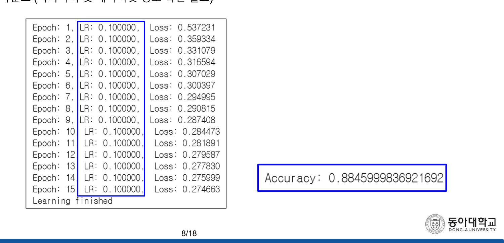
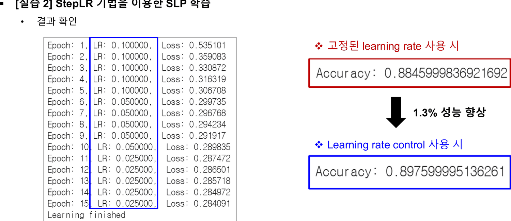
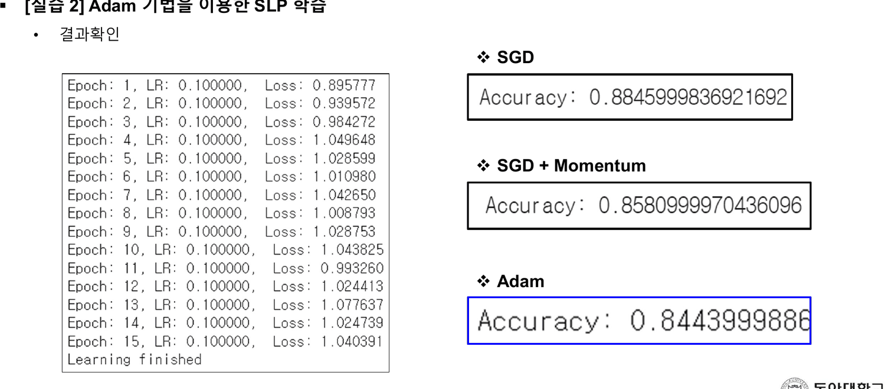
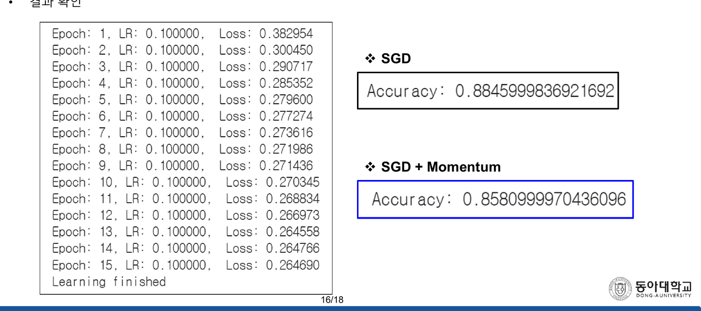
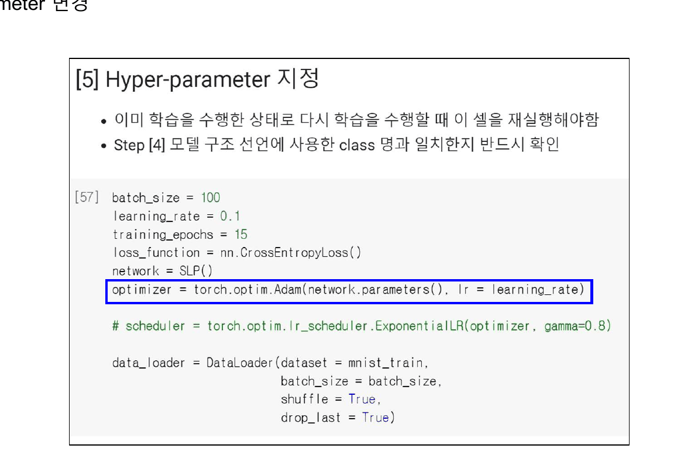
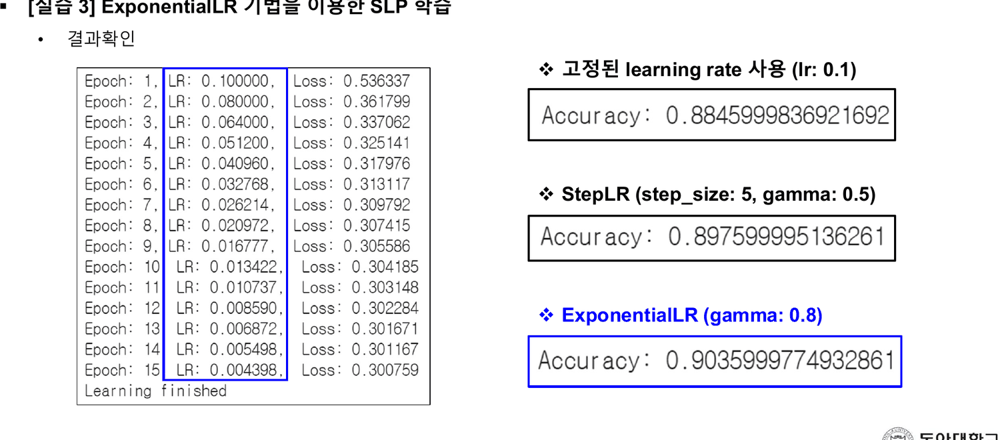

[[10. 한 줄에 붙은 마이너스가 여섯 장을 타고 내려온다]]가 읽은 `Optimization(이론)` 은 다섯 개의 갱신식을 주고 「어느 것을 언제 쓰는가」를 그림 두 장에 맡겼다. 이 덱이 그중 셋을 실제로 돌린다.

그리고 **결과가 전부 인쇄되어 있다.** 다섯 번의 실행, 다섯 개의 손실 로그, 다섯 개의 시험 정확도. 덱은 그중 하나에만 화살표를 붙이고 나머지에는 아무 말도 하지 않는다.

> [!note] 이 덱만 2023년이다
> 표지가 `2023년 1학기 인공지능` 이다. 이 과목의 다른 열여덟 덱은 전부 `2024년 1학기` 다. 4번이 「5주차 overfitting 실습 자료 중 일부」를, 7번이 「6주차 LMS에 업로드 된 기본 소스코드」를 언급하므로 이 덱은 6주차 자료다.

---

## 다섯 번의 실행

덱은 두 부분이다 — 2~12번 `Learning Rate Control`, 13~18번 `Optimizer`. 둘 다 같은 모델을 쓴다(6번: 단층 퍼셉트론 784 → 10), 같은 하이퍼파라미터를 쓴다(`batch_size = 100`, `learning_rate = 0.1`, `training_epochs = 15`, `CrossEntropyLoss`), 그리고 **바뀌는 것은 한 줄씩이다.**

| 실행 | 바뀌는 줄 | 첫 에폭 손실 | 마지막 에폭 손실 | 시험 정확도 (원문) |
| --- | --- | ---: | ---: | ---: |
| 기준선 — 고정 lr 0.1 | — | 0.537231 | **0.274663** | 0.8845999836921692 |
| StepLR (5, 0.5) | `lr_scheduler.StepLR` | 0.535101 | 0.284091 | 0.897599995136261 |
| ExponentialLR (0.8) | `lr_scheduler.ExponentialLR` | 0.536337 | 0.300759 | **0.9035999774932861** |
| SGD + Momentum 0.9 | `SGD(..., momentum=0.9)` | 0.382954 | **0.264690** | 0.8580999970436096 |
| Adam (lr 0.1) | `torch.optim.Adam(...)` | 0.895777 | **1.040391** | 0.8443999886 |



기준선 88.46%에서 출발해 학습률을 건드리면 **올라가고**, 옵티마이저를 건드리면 **내려간다.**

- StepLR → **+1.30 퍼센트 포인트**
- ExponentialLR → **+1.90 퍼센트 포인트**
- Momentum → **−2.65 퍼센트 포인트**
- Adam → **−4.02 퍼센트 포인트**

10번이 그중 하나에만 큰 검은 화살표와 붉은 글씨를 붙인다 — `1.3% 성능 향상`.



18번은 세 숫자를 상자 셋에 나란히 인쇄하고 해설을 붙이지 않는다.



---

## 훈련 손실 순위와 시험 정확도 순위가 역순이다

위 표의 두 열을 각각 정렬하면 이렇게 된다.

| 훈련 손실 (낮은 순) | 시험 정확도 (높은 순) |
| --- | --- |
| 1. SGD + Momentum — 0.2647 | 1. ExponentialLR — 90.36% |
| 2. 고정 lr — 0.2747 | 2. StepLR — 89.76% |
| 3. StepLR — 0.2841 | 3. 고정 lr — 88.46% |
| 4. ExponentialLR — 0.3008 | 4. SGD + Momentum — 85.81% |
| 5. Adam — 1.0404 | 5. Adam — 84.44% |

앞 넷의 순서가 **정확히 뒤집혀 있다.** 훈련 손실을 가장 낮게 내린 실행이 시험 정확도에서 네 번째이고, 훈련 손실이 가장 높은 실행(Adam을 빼면)이 시험 정확도 1위다.

```html preview
<div id="rk" style="font-family:system-ui,-apple-system,sans-serif;color:var(--foreground);background:var(--card);border:1px solid var(--border);border-radius:12px;padding:18px 16px;">
  <p style="margin:0 0 14px;font-size:13px;color:var(--muted-foreground);line-height:1.75;">
    다섯 실행의 <b>마지막 에폭 훈련 손실</b>(왼쪽)과 <b>시험 정확도</b>(오른쪽)를 잇는다.
    값은 8·10·12·16·18번에 인쇄된 원본 그대로다.</p>
  <svg id="rks" viewBox="0 0 640 300" style="width:100%;height:auto;display:block;"></svg>
  <div id="rko" style="margin-top:10px;font-size:13.5px;line-height:1.95;"></div>
</div>
<script>
(function(){
  const NS='http://www.w3.org/2000/svg', svg=document.getElementById('rks');
  const el=(t,a,x)=>{const e=document.createElementNS(NS,t);for(const k in a)e.setAttribute(k,a[k]);
    if(x!==undefined)e.textContent=x;return e;};
  const R=[{n:'SGD + Momentum',l:0.264690,a:0.8580999970436096,c:'var(--chart-2)'},
           {n:'고정 lr 0.1',    l:0.274663,a:0.8845999836921692,c:'var(--muted-foreground)'},
           {n:'StepLR',         l:0.284091,a:0.897599995136261, c:'var(--chart-1)'},
           {n:'ExponentialLR',  l:0.300759,a:0.9035999774932861,c:'var(--chart-1)'},
           {n:'Adam (lr 0.1)',  l:1.040391,a:0.8443999886,      c:'var(--chart-2)'}];
  const byL=[...R].sort((x,y)=>x.l-y.l), byA=[...R].sort((x,y)=>y.a-x.a);
  const LX=200, RX=430, T=44, GAP=48;
  svg.appendChild(el('text',{x:LX,y:24,'text-anchor':'end','font-size':12,
    fill:'var(--muted-foreground)','font-weight':700},'훈련 손실 (낮은 순)'));
  svg.appendChild(el('text',{x:RX,y:24,'font-size':12,
    fill:'var(--muted-foreground)','font-weight':700},'시험 정확도 (높은 순)'));
  byL.forEach((r,i)=>{
    const y=T+i*GAP;
    svg.appendChild(el('text',{x:LX-8,y:y+4,'text-anchor':'end','font-size':12.5,
      fill:r.c,'font-weight':700},(i+1)+'. '+r.n));
    svg.appendChild(el('text',{x:LX-8,y:y+18,'text-anchor':'end','font-size':11,
      fill:'var(--muted-foreground)'},r.l.toFixed(6)));
    const j=byA.indexOf(r), y2=T+j*GAP;
    svg.appendChild(el('path',{d:'M'+(LX+8)+' '+y+' C'+(LX+90)+' '+y+', '+(RX-90)+' '+y2+', '+(RX-8)+' '+y2,
      fill:'none',stroke:r.c,'stroke-width':2.2,opacity:0.85}));
    svg.appendChild(el('circle',{cx:LX+8,cy:y,r:4,fill:r.c}));
  });
  byA.forEach((r,i)=>{
    const y=T+i*GAP;
    svg.appendChild(el('circle',{cx:RX-8,cy:y,r:4,fill:r.c}));
    svg.appendChild(el('text',{x:RX+8,y:y+4,'font-size':12.5,fill:r.c,'font-weight':700},
      (i+1)+'. '+r.n));
    svg.appendChild(el('text',{x:RX+8,y:y+18,'font-size':11,fill:'var(--muted-foreground)'},
      (r.a*100).toFixed(2)+'%'));
  });
  document.getElementById('rko').innerHTML=
    '앞의 네 실행에서 선이 <b>완전히 교차</b>한다 — 훈련 손실 1·2·3·4위가 시험 정확도 4·3·2·1위다. '+
    'Adam만 양쪽에서 꼴찌다.<br>'+
    '<span style="color:var(--muted-foreground);font-size:12.5px;">'+
    '덱은 다섯 개의 손실 로그와 다섯 개의 정확도를 모두 인쇄하지만, 두 열을 나란히 놓는 장은 없다.</span>';
})();
</script>
```

Momentum이 그 현상의 가장 깨끗한 사례다. 16번의 로그를 보면 첫 에폭부터 손실이 **0.382954** 로 기준선(0.537231)보다 훨씬 낮게 시작하고, 마지막에 **0.264690** 으로 다섯 실행 중 가장 낮다. 그런데 시험 정확도는 85.81%로 기준선보다 2.65pp 낮다.



---

## 2~5번 — 덱이 준비해 둔 설명

이 덱은 결과를 해설하지 않지만, 해설에 필요한 재료는 앞 네 장에 이미 다 놓여 있다.

2번이 경사하강을 두 단계로 적는다.

> ① 현재 지점에서 미분을 이용해 gradient 계산 (`Gradient = 0.8`)
> ② Gradient에 learning rate를 곱하고 반대 방향으로 weight update (`Learning rate = 0.1`)
> $$W_{new} = W_{prev} - \lambda\frac{\partial L}{\partial W}$$
> $X\,(W, b)$: Trainable parameters · $Y$: Loss function

3번이 학습률이 너무 클 때와 너무 작을 때의 그림 둘을 나란히 놓고 「빠른 시간내에 정확도 높은 학습 파라미터를 구하기 위해 learning rate를 조절하는 방법」이라 적는다. 4번이 「이전 실습까지 **고정된** learning rate를 사용해 학습 수행 (LR: 0.1)」이라 밝히고, 5번이 PyTorch의 두 스케줄러를 소개한다.

**2번의 식이 Momentum과 Adam에 왜 적용되지 않는지가 문제의 전부다.** 2번의 $\lambda\frac{\partial L}{\partial W}$ 는 기울기에 비례하는 보폭이라 기울기가 작아지면 자동으로 줄어든다. Momentum은 거기에 관성을 얹고, Adam은 $\hat m/\sqrt{\hat v}$ 로 크기 자체를 정규화해 **보폭을 $\eta$ 에 고정한다.** 같은 $\eta = 0.1$ 이 세 경우에 전혀 다른 크기를 뜻하는데, 덱은 2번에서 한 번 정의한 뒤 그 값을 다섯 번 다 물려준다.

| 옵티마이저 | 한 걸음의 크기 | $\eta = 0.1$ 이 뜻하는 것 |
| --- | --- | --- |
| SGD | $\eta\,g$ | 기울기에 비례 — 수렴하며 저절로 줄어든다 |
| SGD + Momentum($\alpha$) | 정상 상태에서 $\dfrac{\eta\,g}{1-\alpha}$ | $\alpha=0.9$ 이면 **10배** |
| Adam | $\eta\,\dfrac{\hat m}{\sqrt{\hat v}} \approx \eta$ | 기울기 크기와 거의 무관하게 **0.1 고정** |

위 표의 둘째·셋째 줄은 원본에 없는 보충이다 — 덱에는 2번의 SGD 식만 있다.

---

## 17번 한 줄이 Adam을 설명한다

Adam만은 다르다. 훈련 손실조차 **올라간다.**

| 에폭 | 1 | 2 | 3 | 4 | … | 14 | 15 |
| --- | ---: | ---: | ---: | ---: | --- | ---: | ---: |
| Adam 손실 | 0.895777 | 0.939572 | 0.984272 | 1.049648 | … | 1.024739 | 1.040391 |

첫 에폭이 가장 낮고, 네 번째에 1.05까지 올라간 뒤 열다섯 번째까지 1.0 근처에 머문다. **학습이 진행될수록 나빠진다.**

17번이 그 코드를 보여 준다.



```python
batch_size      = 100
learning_rate   = 0.1                    # ← 앞의 모든 실습에서 물려받은 값
training_epochs = 15
loss_function   = nn.CrossEntropyLoss()
network         = SLP()
optimizer = torch.optim.Adam(network.parameters(), lr = learning_rate)
```

`learning_rate = 0.1` 이 SGD 실습에서 그대로 내려왔다. PyTorch의 `torch.optim.Adam` 기본 학습률은 **0.001** 이다 — 100배 차이다.

Adam의 갱신량은 $\eta\,\hat m/\sqrt{\hat v}$ 인데, $\hat m/\sqrt{\hat v}$ 는 기울기의 크기와 거의 무관하게 대략 1 언저리의 값이다(부호는 따르고 크기는 정규화된다). 그래서 **$\eta$ 가 그대로 한 걸음의 길이**가 된다. $\eta = 0.1$ 은 파라미터를 매 스텝 0.1씩 움직이라는 뜻이고, 이 규모에서 손실이 내려갈 리 없다. SGD에서 $\eta = 0.1$ 이 잘 작동했던 것은 갱신량이 $\eta g$ 로 기울기에 비례해 줄어들기 때문이다.

Momentum도 같은 종류다. 14번의 `momentum = 0.9` 는 관성이 쌓여 실효 보폭을 $\frac{1}{1-0.9} = 10$ 배로 키운다. $\eta = 0.1$ 로 학습률을 그대로 두고 모멘텀만 켜면 실효 학습률이 1.0 근처가 된다.

> [!important] 덱이 실제로 보여 준 것
> 세 번의 개입 중 **잘된 것 둘은 학습률을 줄인 것**(StepLR · ExponentialLR)이고 **못된 것 둘은 실효 학습률을 키운 것**(Momentum · Adam)이다. 다섯 실행 전부가 같은 이야기를 한다 — 이 문제에서 $\eta = 0.1$ 은 이미 상한에 가깝다. 그런데 덱은 그 말을 한 줄도 적지 않고, 17번은 `learning_rate` 를 바꾸지 않은 채 옵티마이저 줄에만 파란 상자를 친다.

### 학습률 스케줄을 검산한다

12번이 ExponentialLR의 15에폭 학습률을 전부 인쇄한다. 감쇠율 0.8이 맞는지 확인할 수 있다.

```html preview
<div id="lr" style="font-family:system-ui,-apple-system,sans-serif;color:var(--foreground);background:var(--card);border:1px solid var(--border);border-radius:12px;padding:18px 16px;">
  <p style="margin:0 0 14px;font-size:13px;color:var(--muted-foreground);line-height:1.75;">
    10·12번에 인쇄된 학습률 로그 30줄을 그대로 옮겨 재계산과 대조한다.
    초기값은 셋 다 <b>0.1</b>.</p>
  <svg id="lrs" viewBox="0 0 640 230" style="width:100%;height:auto;display:block;"></svg>
  <div id="lro" style="margin-top:8px;font-size:13px;line-height:1.95;font-variant-numeric:tabular-nums;"></div>
</div>
<script>
(function(){
  const NS='http://www.w3.org/2000/svg', svg=document.getElementById('lrs');
  const el=(t,a,x)=>{const e=document.createElementNS(NS,t);for(const k in a)e.setAttribute(k,a[k]);
    if(x!==undefined)e.textContent=x;return e;};
  const fixed=Array(15).fill(0.1);
  const step=[0.1,0.1,0.1,0.1,0.1,0.05,0.05,0.05,0.05,0.05,0.025,0.025,0.025,0.025,0.025];
  const expo=[0.1,0.08,0.064,0.0512,0.04096,0.032768,0.026214,0.020972,0.016777,
              0.013422,0.010737,0.008590,0.006872,0.005498,0.004398];
  const L=56,R=612,T=14,B=182;
  const sx=i=>L+i/14*(R-L), sy=v=>B-v/0.105*(B-T);
  for(const g of [0,0.025,0.05,0.075,0.1]){
    svg.appendChild(el('line',{x1:L,y1:sy(g),x2:R,y2:sy(g),stroke:'var(--border)',
      'stroke-dasharray':g?'3 5':'',opacity:g?0.5:1}));
    svg.appendChild(el('text',{x:L-7,y:sy(g)+4,'text-anchor':'end','font-size':10,
      fill:'var(--muted-foreground)'},g.toFixed(3)));
  }
  [[fixed,'var(--muted-foreground)','고정 (88.46%)'],
   [step,'var(--chart-2)','StepLR 5·0.5 (89.76%)'],
   [expo,'var(--chart-1)','ExponentialLR 0.8 (90.36%)']].forEach(([arr,col,nm],k)=>{
    let d='';
    arr.forEach((v,i)=>{d+=(i?'L':'M')+sx(i)+' '+sy(v);});
    svg.appendChild(el('path',{d:d,fill:'none',stroke:col,'stroke-width':2.4,
      'stroke-dasharray':k===0?'5 4':''}));
    arr.forEach((v,i)=>svg.appendChild(el('circle',{cx:sx(i),cy:sy(v),r:2.6,fill:col})));
    svg.appendChild(el('text',{x:R-4,y:T+16+k*17,'text-anchor':'end','font-size':11.5,
      fill:col,'font-weight':700},nm));
  });
  [0,4,9,14].forEach(i=>svg.appendChild(el('text',{x:sx(i),y:B+16,'text-anchor':'middle',
    'font-size':10.5,fill:'var(--muted-foreground)'},'ep '+(i+1))));
  let worst=0;
  expo.forEach((v,i)=>{worst=Math.max(worst,Math.abs(v-0.1*Math.pow(0.8,i)));});
  document.getElementById('lro').innerHTML=
    'ExponentialLR 열다섯 줄을 <b>0.1 × 0.8<sup>n</sup></b> 과 대조하면 최대 오차 '+
    '<b>'+worst.toExponential(1)+'</b> — 인쇄된 자리 수 안에서 완전히 일치한다.<br>'+
    'StepLR 은 5에폭마다 반으로 — 0.1 → 0.05 → 0.025 로 로그가 정확히 그렇게 찍혀 있다.<br>'+
    '<span style="color:var(--muted-foreground);font-size:12.5px;">'+
    '마지막 에폭의 학습률: 고정 0.1 · StepLR 0.025 · ExponentialLR 0.004398. '+
    '더 많이 줄인 쪽이 더 좋은 정확도를 냈다.</span>';
})();
</script>
```



5번의 설명 그림은 `StepLR (step_size: 10, gamma: 0.5)` · `ExponentialLR (step_size: 10, gamma: 0.5)` 로 되어 있는데, 실제 실습은 StepLR이 `step_size: 5, gamma: 0.5`, ExponentialLR이 `gamma: 0.8` 이다. 그리고 ExponentialLR은 매 에폭 감쇠하므로 `step_size` 인자를 받지 않는다 — 5번의 괄호는 두 기법에 같은 설명을 붙인 것이다.

---

## 발견한 원본 문제

> [!caution] 이 절이 가리키는 것
> 19쪽 전체를 읽고, 다섯 개의 손실 로그(75줄)와 다섯 개의 정확도를 파이썬으로 재계산·대조했다. 인쇄된 수 자체는 전부 정확하다. 문제는 **인쇄해 놓고 말하지 않은 것**이다.

`해설이 없는 결과`

- **18번이 세 정확도(88.46% · 85.81% · 84.44%)를 나란히 인쇄하고 한 줄도 달지 않는다** — 「Momentum」과 「Adam」을 배우는 장이 그 둘이 기준선보다 나쁘다는 결과로 끝난다. 10번은 훨씬 작은 개선(+1.3pp)에 큰 화살표와 붉은 글씨를 붙였다
- **Adam의 손실 로그가 상승한다** — 0.895777(1에폭) → 1.049648(4에폭) → 1.040391(15에폭). 「Learning finished」 외에 설명이 없다
- **17번이 `learning_rate = 0.1` 을 그대로 두고 옵티마이저 줄에만 파란 상자를 친다** — PyTorch `Adam` 의 기본 학습률은 0.001 이다. 100배 차이가 결과를 설명하는데 덱에 그 언급이 없다 *(기본값 0.001 은 PyTorch 문서의 값이고 이 덱에는 적혀 있지 않다 — 원본에 없는 보충이다)*
- **훈련 손실 순위와 시험 정확도 순위가 앞 네 실행에서 정확히 역순이다** — 덱은 두 값을 같은 장에 나란히 인쇄하면서 비교하지 않는다 *(순위 대조는 원본에 없는 보충이다)*

`표기`

- **10번의 `1.3% 성능 향상`** — $0.8976 - 0.8846 = 0.0130$ 이므로 **1.30 퍼센트 포인트**다. 백분율 개선으로 계산하면 $+1.47\%$ 다
- **5번의 설명 괄호** — `StepLR (step_size: 10, gamma: 0.5)` 과 `ExponentialLR (step_size: 10, gamma: 0.5)` 이 같은 값으로 되어 있는데, 실습은 각각 (5, 0.5)와 (gamma 0.8)이고 `ExponentialLR` 은 `step_size` 인자를 받지 않는다
- **2번의 `Gradient decent algorithm`** — `descent` 의 철자 오류이고, 같은 슬라이드에 두 번 나온다

`덱 구성`

- **이 덱만 `2023년 1학기` 다** — 나머지 열여덟 덱은 `2024년 1학기` 다
- **14번의 Momentum 식 표기가 `Optimization(이론)` 15번과 같다** — $v_t = \alpha v_{t-1} - \eta\frac{\partial L}{\partial W_t}$, $W_{t+1} = W_t + v_t$. 이론 덱과 실습 덱이 일치하는 유일한 식이고, 파란 상자로 `momentum 계수` 를 짚는 것도 이 장뿐이다. 반면 Adam의 식은 이 덱에 나오지 않는다

`검산해 얻은 것 (원본에 없는 보충)`

- **12번의 ExponentialLR 로그 열다섯 줄은 $0.1 \times 0.8^{n}$ 과 인쇄된 자리 수 안에서 완전히 일치한다** — 마지막 에폭 0.004398
- **10번의 StepLR 로그도 정확하다** — 0.1(1~5) → 0.05(6~10) → 0.025(11~15)
- **마지막 학습률과 시험 정확도가 단조 관계다** — 0.1 → 88.46%, 0.025 → 89.76%, 0.004398 → 90.36%. 세 점뿐이지만 방향이 일관된다
- **Momentum 0.9의 실효 보폭은 $1/(1-0.9) = 10$ 배**다. $\eta=0.1$ 과 곱하면 1.0 근처가 된다

---

## 다른 문서와의 연결

- [[10. 한 줄에 붙은 마이너스가 여섯 장을 타고 내려온다]] — 여기서 돌리는 세 기법의 식이 거기 있다. 그리고 Adam의 인쇄된 식은 그대로 돌아가지 않는다
- [[09. 예순 장을 손으로 미분하고, 실습은 한 줄로 끝낸다]] — 이 덱이 쓰는 SLP와 하이퍼파라미터가 거기서 왔다. 같은 설정의 단층 퍼셉트론이 2024년판에서는 **88.96%**, 2023년판인 이 덱에서는 **88.46%** 를 낸다(0.50pp 차이). 10번이 자랑하는 개선폭 1.30pp의 **3분의 1이 넘는 크기**가 해가 다른 두 실행 사이에서 그냥 생긴다
- [[12. 여섯 가지를 가르치고 셋을 해 본다]] — 4번이 참조하는 「5주차 overfitting 실습 자료」
- [[14. 다섯 층을 쌓으면 손실이 ln 10 에 붙는다]] — 같은 코드에 층을 더한 실습

---

## 근거 자료

`Optimizer.pdf` 19쪽.

| 슬라이드 | 무엇이 있는가 | 인용 |
| ---: | --- | --- |
| 1 | 표지 — `2023년 1학기 인공지능` | |
| 2~3 | GD 복습, learning rate decay 개념 | |
| 4~5 | 이전 실습의 고정 학습률, PyTorch 스케줄러 소개 | |
| 6 | 실습 모델 — SLP 784 → 10 | |
| 7~8 | [실습 1] 스케줄러 없음 — 손실 로그 15줄, 88.46% | ✔ (8) |
| 9~10 | [실습 2] StepLR — 89.76%, `1.3% 성능 향상` | ✔ (10) |
| 11~12 | [실습 3] ExponentialLR — 90.36%, 세 결과 비교 | ✔ (12) |
| 13 | 대표 optimizer 비교 그림 | |
| 14~16 | [실습 1] Momentum — `momentum = 0.9`, 85.81% | ✔ (16) |
| 17~18 | [실습 2] Adam — `lr = learning_rate`, 84.44% | ✔ (17·18) |
| 19 | Q&A | |

수치 검산: 다섯 실행의 손실 로그 75줄과 정확도 다섯 개를 옮겨 적어 순위를 대조했고, ExponentialLR 학습률 수열을 $0.1\times0.8^n$ 과, StepLR 수열을 5에폭 반감과 대조했다. 정확도 차이는 퍼센트 포인트와 상대 백분율 양쪽으로 계산했다.
