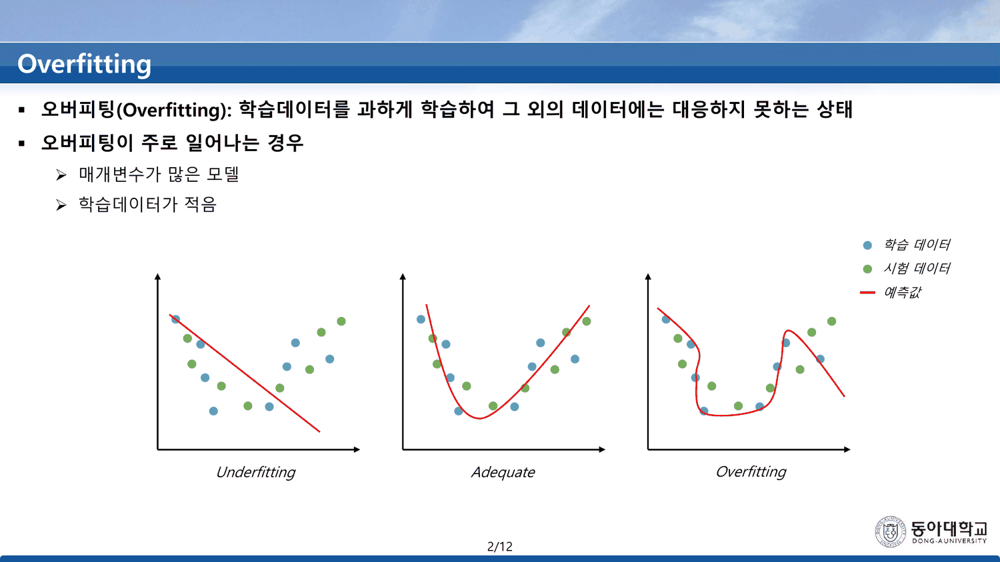
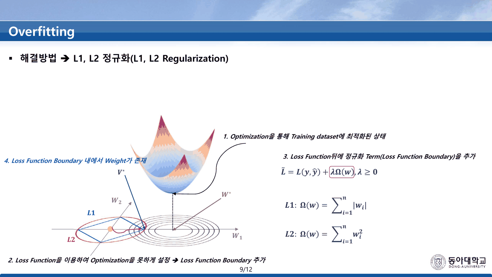
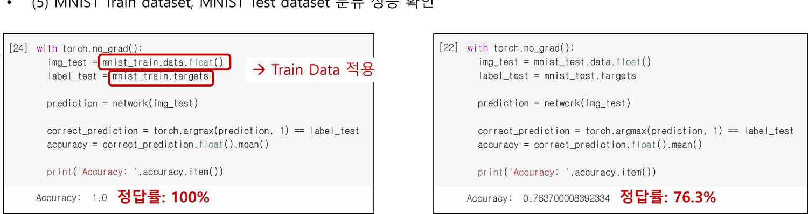
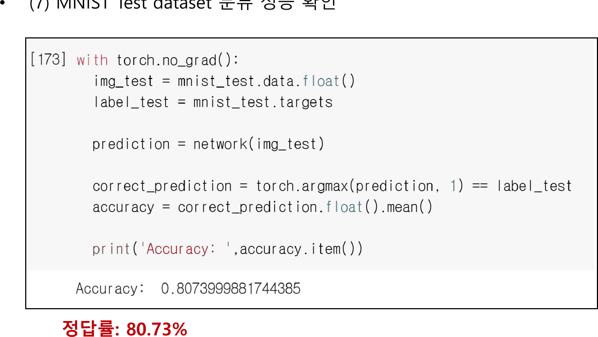
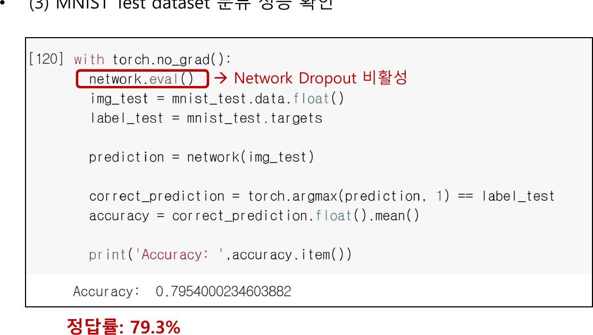

공책 8쪽의 빨간 상자가 네 줄로 이 과목을 요약할 때, 마지막 줄이 「**Overfitting을 유의하면서**」였다([[08. 덱이 약속만 하고 넘어간 절은 공책에 있다]]). 이 덱이 그 줄이다.

37쪽이 두 덩이로 나뉜다 — 1~12번 이론, 13~36번 실습. 이론이 해결 방법을 나열하고, 실습이 그중 셋을 돌린다. 어느 셋인지가 이 노트의 자리다.

---

## 번호는 여섯, 방법은 일곱

2번이 오버피팅을 정의하고 세 상태를 나란히 놓는다 — Underfitting · Adequate · Overfitting. 주로 일어나는 경우로 「매개변수가 많은 모델」과 「학습데이터가 적음」 둘을 든다. 이 두 조건이 실습에서 그대로 재현된다.



3번부터 12번까지가 해결 방법이다. 제목 줄을 그대로 옮기면 이렇다.

| 슬라이드 | 제목 줄 | 번호 |
| ---: | --- | :---: |
| 3 | 해결방법 **1** → 데이터 확보 | 1 |
| 4 | 해결방법 → 데이터 증식(Data Augmentation) | **없음** |
| 5 | 해결방법 **2** → 조기 종료(Early Stopping) | 2 |
| 6~9 | 해결방법 **3** → L1, L2 정규화 | 3 |
| 10 | 해결방법 **4** → 드롭아웃(Dropout) | 4 |
| 11 | 해결방법 **5** → 드롭 커넥트(Drop Connect) | 5 |
| 12 | 해결방법 **6** → 배치 정규화(Batch Normalization) | 6 |

4번만 번호가 없다. 앞뒤가 1과 2이므로 4번은 1번에 딸린 것처럼 읽히고(데이터 확보 → 데이터 증식), 실제로 그럴듯하다. 그런데 **실습에서는 독립된 처방으로 다뤄지고, 세 처방 중 가장 좋은 결과를 낸다.**

6~9번은 하나의 그림을 네 단계로 쌓는다.



> 1. Optimization을 통해 Training dataset에 최적화된 상태 ($W^*$)
> 2. Loss Function을 이용하여 Optimization을 못하게 설정 → Loss Function Boundary 추가
> 3. Loss Function 뒤에 정규화 Term을 추가 — $\tilde L = L(y,\hat y) + \lambda\Omega(w),\ \lambda \ge 0$
> 4. Loss Function Boundary 내에서 Weight가 존재 ($V^*$)

$$L1: \Omega(w) = \sum_{i=1}^{n}|w_i|,\qquad L2: \Omega(w) = \sum_{i=1}^{n}w_i^2$$

$\lambda$ 의 값은 나오지 않고, 두 경계가 왜 다른 모양인지(마름모 대 타원)도 설명되지 않는다. 그림에서 $V^*$ 는 마름모의 **변** 위에 찍혀 있다.

### 두 경계가 답을 어디로 미는가

```html preview
<div id="rg" style="font-family:system-ui,-apple-system,sans-serif;color:var(--foreground);background:var(--card);border:1px solid var(--border);border-radius:12px;padding:18px 16px;">
  <p style="margin:0 0 12px;font-size:13px;color:var(--muted-foreground);line-height:1.75;">
    8번에 인쇄된 두 정의 — L1: Σ|wᵢ| · L2: Σwᵢ² — 로 같은 크기의 경계를 그리고,
    자유 최적점 <b>W*</b> 를 끌면 각 경계 위에서 손실이 가장 작은 점이 어디로 가는지 본다.
    <b style="color:var(--chart-2)">원본에 없는 보충</b>이다 — 덱은 그림만 주고 λ도 값도 주지 않는다.</p>
  <div style="display:flex;flex-wrap:wrap;gap:18px;margin-bottom:12px;font-size:12.5px;">
    <label>W*₁ <input id="rgx" type="range" min="-30" max="30" step="1" value="22" style="width:130px;vertical-align:middle;"> <b id="rgxv" style="color:var(--chart-1);">2.2</b></label>
    <label>W*₂ <input id="rgy" type="range" min="-30" max="30" step="1" value="6" style="width:130px;vertical-align:middle;"> <b id="rgyv" style="color:var(--chart-1);">0.6</b></label>
    <label>경계 크기 <input id="rgr" type="range" min="4" max="20" step="1" value="10" style="width:110px;vertical-align:middle;"> <b id="rgrv" style="color:var(--chart-1);">1.0</b></label>
  </div>
  <svg id="rgs" viewBox="0 0 640 300" style="width:100%;height:auto;display:block;"></svg>
  <div id="rgo" style="margin-top:8px;font-size:13.5px;line-height:1.95;font-variant-numeric:tabular-nums;"></div>
</div>
<script>
(function(){
  const NS='http://www.w3.org/2000/svg', svg=document.getElementById('rgs');
  const el=(t,a,x)=>{const e=document.createElementNS(NS,t);for(const k in a)e.setAttribute(k,a[k]);
    if(x!==undefined)e.textContent=x;return e;};
  const X=document.getElementById('rgx'),Y=document.getElementById('rgy'),Rr=document.getElementById('rgr');
  const CX=320,CY=150,S=52;
  const px=v=>CX+v*S, py=v=>CY-v*S;
  function draw(){
    const wx=+X.value/10, wy=+Y.value/10, r=+Rr.value/10;
    document.getElementById('rgxv').textContent=wx.toFixed(1);
    document.getElementById('rgyv').textContent=wy.toFixed(1);
    document.getElementById('rgrv').textContent=r.toFixed(1);
    svg.textContent='';
    svg.appendChild(el('line',{x1:20,y1:CY,x2:620,y2:CY,stroke:'var(--border)'}));
    svg.appendChild(el('line',{x1:CX,y1:16,x2:CX,y2:286,stroke:'var(--border)'}));
    svg.appendChild(el('text',{x:612,y:CY-8,'text-anchor':'end','font-size':11,
      fill:'var(--muted-foreground)'},'W₁'));
    svg.appendChild(el('text',{x:CX+8,y:24,'font-size':11,fill:'var(--muted-foreground)'},'W₂'));
    // L2 circle (Σw² = r²)
    svg.appendChild(el('circle',{cx:CX,cy:CY,r:r*S,fill:'none',stroke:'var(--chart-2)','stroke-width':2}));
    // L1 diamond (Σ|w| = r)
    svg.appendChild(el('polygon',{points:[[r,0],[0,r],[-r,0],[0,-r]].map(p=>px(p[0])+','+py(p[1])).join(' '),
      fill:'none',stroke:'var(--chart-1)','stroke-width':2}));
    // loss contours around W*
    for(const k of [0.4,0.8,1.2,1.6])
      svg.appendChild(el('circle',{cx:px(wx),cy:py(wy),r:k*S,fill:'none',
        stroke:'var(--muted-foreground)','stroke-dasharray':'3 5',opacity:0.45}));
    // constrained minima (closest point on each boundary to W*)
    const n2=Math.hypot(wx,wy)||1e-9;
    const l2=[wx/n2*r, wy/n2*r];
    let best=null;
    for(let i=0;i<=2000;i++){
      const t=i/2000*4, seg=Math.floor(t), u=t-seg;
      const V=[[r,0],[0,r],[-r,0],[0,-r]];
      const a=V[seg%4], b=V[(seg+1)%4];
      const p=[a[0]+(b[0]-a[0])*u, a[1]+(b[1]-a[1])*u];
      const d=(p[0]-wx)**2+(p[1]-wy)**2;
      if(!best||d<best.d) best={p:p,d:d};
    }
    const l1=best.p;
    [[l2,'var(--chart-2)','L2'],[l1,'var(--chart-1)','L1']].forEach(([p,c,nm])=>{
      svg.appendChild(el('circle',{cx:px(p[0]),cy:py(p[1]),r:5.5,fill:c}));
      svg.appendChild(el('text',{x:px(p[0])+9,y:py(p[1])-7,'font-size':11.5,fill:c,'font-weight':700},nm));
    });
    svg.appendChild(el('circle',{cx:px(wx),cy:py(wy),r:5.5,fill:'var(--foreground)'}));
    svg.appendChild(el('text',{x:px(wx)+9,y:py(wy)-7,'font-size':11.5,
      fill:'var(--foreground)','font-weight':700},'W*'));
    const corner = Math.min(Math.abs(l1[0]),Math.abs(l1[1])) < 0.02*r;
    document.getElementById('rgo').innerHTML=
      'L2 해 = ( '+l2[0].toFixed(3)+' , '+l2[1].toFixed(3)+' ) — 두 성분 모두 0이 아니다<br>'+
      'L1 해 = ( '+l1[0].toFixed(3)+' , '+l1[1].toFixed(3)+' )'+
      (corner? ' — <b style="color:var(--chart-1)">꼭짓점에 닿았다. 한 성분이 정확히 0이다</b>' : '')+
      '<br><span style="color:var(--muted-foreground);font-size:12.5px;">'+
      'W* 를 축 쪽으로 기울이면 L1 해가 꼭짓점으로 붙는다 — 마름모에는 뾰족한 모서리가 있고 원에는 없기 때문이다. '+
      '덱 9번이 V* 를 어디에 찍었는지, 왜 두 모양이 다른지는 슬라이드에 적혀 있지 않다.</span>';
  }
  X.oninput=Y.oninput=Rr.oninput=draw; draw();
})();
</script>
```

10·11번이 드롭아웃과 드롭 커넥트를 나란히 놓는다 — 둘 다 「Backpropagation시 모든 Weight가 업데이트 되는 것을 방지」라는 같은 한 줄을 쓰고, 차이는 「일부 **Node**를 랜덤하게 제거」 대 「일부 **Weight**를 랜덤하게 제거」뿐이다. 12번이 배치 정규화를 소개하며 `Internal Covariate Shift` 를 정의한다.

---

## 실습 — 60,000장을 300장으로 줄인다

13번이 `실습` 간지다. 14번이 2번의 조건을 다시 적는다.

> Overfitting 이 주로 일어나는 경우: 매개변수가 많은 표현력이 높은 모델 · **훈련데이터가 적음**

그리고 15·16번이 두 번째 조건을 **인위적으로 만든다** — MNIST train dataset 개수를 60,000에서 **300**으로 줄인다. 모델은 `MLP(실습)` 의 2층 구조를 그대로 쓰고 에폭만 15에서 **100**으로 올린다(18번).

21번이 결과를 낸다.



| | 값 |
| --- | ---: |
| 학습 데이터 정답률 | `Accuracy: 1.0` → **100%** |
| 시험 데이터 정답률 | `Accuracy: 0.763700008392334` → **76.37%** |

300장을 100에폭 돌려 완전히 외운 상태다. 22번이 2번의 그림(Underfitting / Adequate / Overfitting)을 다시 꺼내 `Overfitting 문제 발생!` 을 붙인다.

---

## 세 처방과 네 숫자

23~36번이 세 가지를 차례로 시도한다.

| 처방 | 코드 | 시험 정확도 (원문) | 슬라이드 표기 | 기준선 대비 |
| --- | --- | ---: | ---: | ---: |
| 없음 (기준선) | — | 0.763700008392334 | 76.3% | — |
| (1) Batch Normalization | `nn.BatchNorm1d(100)` | 0.7935000061988831 | 79.3% | **+2.98pp** |
| (2) Dropout | `nn.Dropout(0.2)` | 0.7954000234603882 | **79.3%** | **+3.17pp** |
| (3) Data Augmentation | 회전 ±15°·±30° → 300장을 1,500장으로 | 0.8073999881744385 | 80.73% | **+4.37pp** |

**이론에서 번호를 받지 못한 방법이 실습에서 가장 멀리 간다.**



그리고 세 처방 중 **L1/L2 정규화 · 조기 종료 · 드롭 커넥트** 셋은 실습에 나오지 않는다. 이론에서 번호를 받은 여섯 개 중 절반이다.

```html preview
<div id="ov" style="font-family:system-ui,-apple-system,sans-serif;color:var(--foreground);background:var(--card);border:1px solid var(--border);border-radius:12px;padding:18px 16px;">
  <p style="margin:0 0 14px;font-size:13px;color:var(--muted-foreground);line-height:1.75;">
    21·25·28·36번의 원문 정확도 네 개다. 오른쪽 칸이 슬라이드가 인쇄한 표기와의 대조.</p>
  <svg id="ovs" viewBox="0 0 640 250" style="width:100%;height:auto;display:block;"></svg>
  <table style="width:100%;border-collapse:collapse;font-size:12.5px;margin-top:12px;font-variant-numeric:tabular-nums;">
    <thead><tr style="font-size:11.5px;color:var(--muted-foreground);text-align:left;">
      <th style="padding:4px 0;">처방</th><th>원문</th><th>×100</th><th>반올림</th><th>절사</th>
      <th>슬라이드</th><th>판정</th></tr></thead>
    <tbody id="ovb"></tbody>
  </table>
</div>
<script>
(function(){
  const NS='http://www.w3.org/2000/svg', svg=document.getElementById('ovs');
  const el=(t,a,x)=>{const e=document.createElementNS(NS,t);for(const k in a)e.setAttribute(k,a[k]);
    if(x!==undefined)e.textContent=x;return e;};
  const D=[{n:'기준선 (300장)',v:0.763700008392334,s:'76.3%',p:21},
           {n:'Batch Norm',    v:0.7935000061988831,s:'79.3%',p:25},
           {n:'Dropout 0.2',   v:0.7954000234603882,s:'79.3%',p:28},
           {n:'Augmentation',  v:0.8073999881744385,s:'80.73%',p:36}];
  const L=58,R=618,T=18,B=196;
  const sy=v=>B-(v-0.74)/0.09*(B-T);
  for(const g of [0.74,0.76,0.78,0.80,0.82]){
    svg.appendChild(el('line',{x1:L,y1:sy(g),x2:R,y2:sy(g),stroke:'var(--border)',
      'stroke-dasharray':'3 5',opacity:0.55}));
    svg.appendChild(el('text',{x:L-7,y:sy(g)+4,'text-anchor':'end','font-size':10,
      fill:'var(--muted-foreground)'},(g*100).toFixed(0)+'%'));
  }
  const bw=(R-L)/4;
  D.forEach((d,i)=>{
    const x=L+i*bw+bw*0.16, w=bw*0.68;
    svg.appendChild(el('rect',{x:x,y:sy(d.v),width:w,height:B-sy(d.v),
      fill:i===0?'var(--muted-foreground)':(i===3?'var(--chart-1)':'var(--chart-2)'),rx:3}));
    svg.appendChild(el('text',{x:x+w/2,y:sy(d.v)-8,'text-anchor':'middle','font-size':12.5,
      fill:'var(--foreground)','font-weight':700},(d.v*100).toFixed(2)+'%'));
    svg.appendChild(el('text',{x:x+w/2,y:B+17,'text-anchor':'middle','font-size':11,
      fill:'var(--muted-foreground)'},d.n));
    if(i) svg.appendChild(el('text',{x:x+w/2,y:B+33,'text-anchor':'middle','font-size':10.5,
      fill:'var(--chart-1)'},'+'+((d.v-D[0].v)*100).toFixed(2)+'pp'));
  });
  svg.appendChild(el('line',{x1:L,y1:sy(D[0].v),x2:R,y2:sy(D[0].v),
    stroke:'var(--muted-foreground)','stroke-dasharray':'6 4',opacity:0.8}));
  document.getElementById('ovb').innerHTML = D.map(d=>{
    const x=d.v*100, rd=(Math.round(x*10)/10).toFixed(1)+'%', tr=(Math.floor(x*10)/10).toFixed(1)+'%';
    const ok = d.s===rd || d.s===tr || d.s===(Math.floor(x*100)/100).toFixed(2)+'%'
               || d.s===(Math.round(x*100)/100).toFixed(2)+'%';
    return '<tr><td style="padding:5px 0;border-bottom:1px solid var(--border);">'+d.n+'</td>'+
      '<td style="border-bottom:1px solid var(--border);font-size:11px;">'+d.v.toFixed(6)+'</td>'+
      '<td style="border-bottom:1px solid var(--border);">'+x.toFixed(4)+'</td>'+
      '<td style="border-bottom:1px solid var(--border);">'+rd+'</td>'+
      '<td style="border-bottom:1px solid var(--border);">'+tr+'</td>'+
      '<td style="border-bottom:1px solid var(--border);font-weight:700;">'+d.s+'</td>'+
      '<td style="border-bottom:1px solid var(--border);font-weight:700;color:'+
        (ok?'var(--chart-1)':'var(--chart-2)')+';">'+(ok?'맞다':'어긋난다')+'</td></tr>';
  }).join('');
})();
</script>
```

---

## 28번의 79.3%

위 표에서 한 칸만 붉게 나온다.



드롭아웃의 원문 출력은 `Accuracy: 0.7954000234603882` 다. 이것은 **79.54%** 이고, 반올림하면 79.5%, 절사해도 79.5%다. 슬라이드는 붉은 글씨로 `정답률: 79.3%` 를 적는다.

79.3%는 **바로 앞 장(25번)의 배치 정규화 결과**다 — 그쪽 원문은 `0.7935000061988831` 이고 79.35%를 절사하면 정확히 79.3%가 된다. 25번의 붉은 글씨가 28번으로 복사되면서 숫자가 갱신되지 않았다.

이 덱의 다른 세 정확도는 모두 **절사** 관례를 따른다(76.3700 → 76.3, 79.3500 → 79.3, 80.7399 → 80.73). 28번만 그 관례로도 설명되지 않는다.

> [!warning] 결론이 뒤집히지는 않는다
> 79.5%로 고쳐도 순서는 그대로다 — 기준선 76.37 < 배치정규화 79.35 < 드롭아웃 79.54 < 증식 80.74. 다만 잘못 적힌 79.3% 때문에 **배치 정규화와 드롭아웃이 완전히 동점으로 보인다.** 실제로는 드롭아웃이 0.19pp 앞선다. 시험 집합이 10,000장이므로 정확도 표준오차는 약 0.4pp이고, 0.19pp 차이는 그 안에 들어간다 — 두 방법을 구분할 만한 차이는 아니라는 판단이 오히려 맞는다. 그러나 그것은 **숫자를 제대로 적고 나서 할 수 있는 판단**이다. *(표준오차 계산은 원본에 없는 보충이다.)*

---

## 30~33번 — 300을 1,500으로

29번이 회전 넷을 만든다 — 반시계 15°·30°, 시계 15°·30°. 31번이 「같은 Tensor 데이터 5배 증가」로 라벨을 맞추고, 32번이 결과를 표로 그린다.

**32번과 33번은 같은 슬라이드다.** 추출 텍스트가 177자로 동일하다.

그리고 그 표의 인덱스가 어긋난다.

| 슬라이드 | 인쇄된 인덱스 |
| ---: | --- |
| 15 (60,000장) | `img0 · img1 · img2 · … · 59999` — 정확하다 |
| 15 (300장) | `img0 · img1 · img2 · … · **300**` — 0부터 세면 **299**여야 한다 |
| 32·33 (1,500장) | `img0 · … · **300** · … · 600 · … · 900 · … · 1200 · … · **1499**` |

같은 표 안에서 마지막 칸만 0-기반(1499)이고 중간 경계들은 1-기반(300·600·900·1200)이다. 60,000장 표는 59999로 정확하므로, 축소판을 만들면서 끝 번호만 고친 것으로 보인다.

---

## 발견한 원본 문제

> [!caution] 이 절이 가리키는 것
> 37쪽 전체를 읽고, 네 개의 정확도를 원문 출력에서 옮겨 반올림·절사 양쪽으로 계산해 대조했다.

`숫자를 잘못 적은 것`

- **28번 `정답률: 79.3%`** — 같은 슬라이드의 출력은 `Accuracy: 0.7954000234603882`, 즉 **79.54%** 다. 반올림해도 절사해도 79.5%다. 79.3%는 25번(배치 정규화, 0.7935…)의 값이고, 붉은 글씨가 복사되며 갱신되지 않았다. 그 결과 **두 방법이 동점으로 인쇄된다**

`번호와 구성`

- **해결 방법에 1~6번을 붙이는데 실제 항목은 일곱이다** — 4번 데이터 증식만 번호를 받지 못한다. 그리고 실습에서 가장 좋은 결과(+4.37pp)를 내는 것이 그 방법이다
- **이론의 여섯 중 셋이 실습에 없다** — 조기 종료(2), L1/L2 정규화(3), 드롭 커넥트(5). 특히 L1/L2는 네 장(6~9번)을 들였는데 코드가 한 줄도 없다
- **32번과 33번이 같은 슬라이드다** — 추출 텍스트가 177자로 완전히 일치한다
- **쪽번호 분모가 12다** — 37쪽 덱인데 13번부터 `13/12`, 36번은 `36/12` 다. 그리고 마지막 37번만 **`37/17`** 이다. 이론 12장까지가 원래 덱이고 실습 24장이 나중에 붙은 것으로 읽힌다

`인덱스`

- **15번의 300장 표가 `… 300` 으로 끝난다** — 같은 슬라이드의 60,000장 표는 `… 59999` 로 정확하다. 0부터 세면 299여야 한다
- **32·33번의 1,500장 표** — 마지막은 `1499` 인데 중간 경계는 `300 · 600 · 900 · 1200` 이다. 한 표 안에서 0-기반과 1-기반이 섞인다

`검산해 얻은 것 (원본에 없는 보충)`

- **네 정확도의 실제 값** — 76.3700% · 79.3500% · 79.5400% · 80.7400%. 기준선 대비 +2.98pp · +3.17pp · +4.37pp
- **시험 집합 10,000장에서 정확도의 표준오차는 약 0.40pp** ($\sqrt{p(1-p)/n}$, $p\approx0.8$). 배치 정규화와 드롭아웃의 차이 0.19pp는 그 안이고, 증식과 배치 정규화의 차이 1.39pp는 그 밖이다
- **증식은 데이터를 늘렸을 뿐 정보를 늘리지 않았다** — 1,500장은 300장의 회전 사본이다. 그럼에도 가장 큰 개선을 냈다는 것이 이 실습의 결과이고, 덱은 그 점에 대해 말하지 않는다

---

## 다른 문서와의 연결

- [[08. 덱이 약속만 하고 넘어간 절은 공책에 있다]] — 공책 8쪽 빨간 상자의 마지막 줄
- [[09. 예순 장을 손으로 미분하고, 실습은 한 줄로 끝낸다]] — 이 실습의 모델과 코드가 거기서 왔다. 60,000장·15에폭이 300장·100에폭이 된다
- [[10. 한 줄에 붙은 마이너스가 여섯 장을 타고 내려온다]] — 그 덱의 3~7번 정규화(Min-Max·표준화)와 이 덱 12번의 배치 정규화는 같은 연산을 다른 자리에 놓은 것이다
- [[11. 여섯 장을 들여 더 좋은 옵티마이저를 소개하고, 실습 결과는 전부 더 나쁘다]] — 그 덱 4번이 참조하는 「5주차 overfitting 실습 자료」가 이 덱이다
- [[14. 다섯 층을 쌓으면 손실이 ln 10 에 붙는다]] — 그 덱의 32·33번이 **이 덱의 간지와 그림을 쪽번호까지 달고** 들어가 있다
- [[01. 빌려 온 그림이 양쪽을 다 찌른다]] — 2번 공통 지도의 `Drop-Out` · `Overfitting` 이 여기서 설명된다

---

## 근거 자료

`Overfitting.pdf` 37쪽.

| 슬라이드 | 무엇이 있는가 | 인용 |
| ---: | --- | --- |
| 2 | 오버피팅 정의와 Underfitting / Adequate / Overfitting 그림 | ✔ |
| 3~5 | 데이터 확보(1) · 데이터 증식(번호 없음) · 조기 종료(2) | |
| 6~9 | L1, L2 정규화(3) — 네 단계 그림과 $\tilde L = L + \lambda\Omega(w)$ | ✔ (9) |
| 10~12 | 드롭아웃(4) · 드롭 커넥트(5) · 배치 정규화(6) | |
| 13~14 | 실습 간지, 실습 조건 | |
| 15~20 | 60,000 → 300, MLP 정의, 에폭 100, 학습 반복문 | |
| 21~22 | 훈련 100% / 시험 76.3% — `Overfitting 문제 발생!` | ✔ (21) |
| 23~25 | 배치 정규화 — 79.3% | |
| 26~28 | 드롭아웃 0.2 — 원문 0.7954, 인쇄 79.3% | ✔ (28) |
| 29~33 | 회전 증식 300 → 1,500 (32·33번 중복) | |
| 34~36 | 재학습 — 80.73% | ✔ (36) |

수치 검산: 네 정확도의 원문 값을 ×100 하여 반올림·절사 양쪽으로 계산해 슬라이드 표기와 대조했고, 기준선 대비 차이와 이항 비율의 표준오차 $\sqrt{p(1-p)/10000}$ 를 파이썬으로 구했다.
