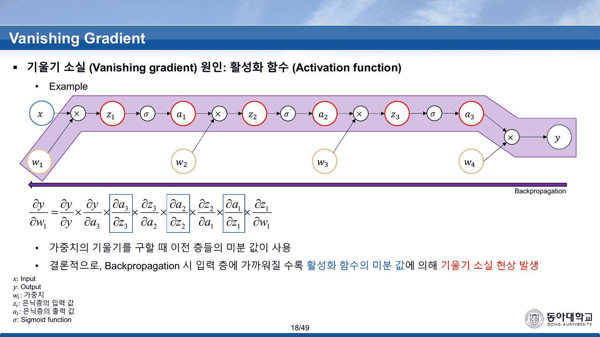
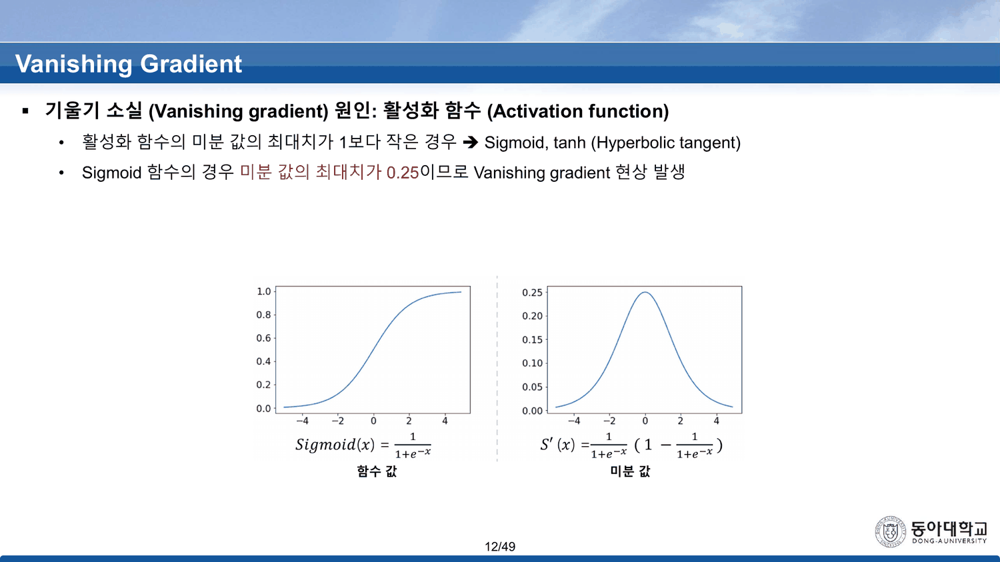
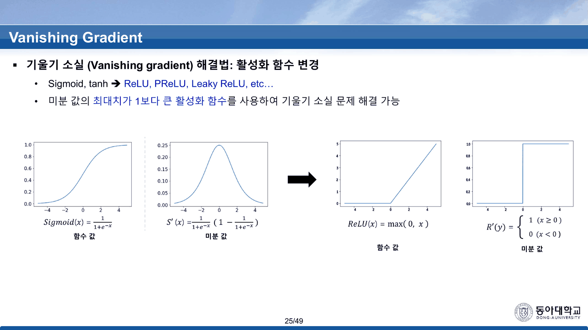
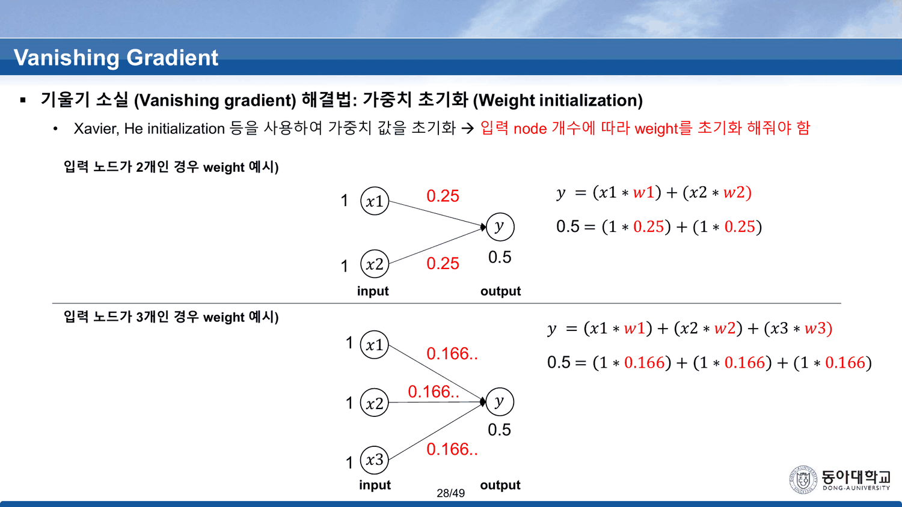

`Backpropagation (이론)` 18번이 「하강법은 초기 위치에 따라 도착지점이 변경 → Weight Initialization」 한 줄을 남기고 방법을 주지 않았다([[05. 방향은 열 장, 보폭은 이름이 없다]]). `MLP(이론)` 12번은 시그모이드의 기울기 문제를 언급만 하고 결과를 내지 않았다([[04. 목록은 길고 고르는 기준은 한 줄이다]]). 이 덱이 둘을 함께 갚는다.

49쪽 중 앞 31장이 이론이다. 구조는 단순하다 — **현상 → 원인 둘 → 해결 둘**. 그리고 원인과 해결이 같은 숫자 하나를 사이에 두고 마주 본다.

---

## 목차가 세 번 인쇄된다

2번 · 9번 · 23번이 모두 같은 `Contents` 다.

> 1. Vanishing Gradient 현상이란? 2. Vanishing Gradient 원인 3. Vanishing Gradient 해결법

세 장이 각 절의 머리에 놓여 「지금 여기」를 가리키는 간지다. 덱의 뼈대가 셋이라는 뜻이고, 실제로 3~8번이 현상, 10~22번이 원인, 24~31번이 해결이다.

---

## 현상 — 곱이 층마다 쌓인다

14번이 회로를 그린다. 네 개의 가중치와 **세 개의 시그모이드**가 번갈아 놓인 사슬이다.

$$x \xrightarrow{\times w} z_1 \xrightarrow{\sigma} a_1 \xrightarrow{\times w} z_2 \xrightarrow{\sigma} a_2 \xrightarrow{\times w} z_3 \xrightarrow{\sigma} a_3 \xrightarrow{\times w} y$$

15~18번이 체인룰을 한 칸씩 늘린다.

| 슬라이드 | 구하는 것 | 곱해지는 항의 수 | 그중 $\sigma'$ |
| ---: | --- | :---: | :---: |
| 15 | $\dfrac{\partial y}{\partial w_4}$ | 2 | 0 |
| 16 | $\dfrac{\partial y}{\partial w_3}$ | 4 | 1 |
| 17~18 | $\dfrac{\partial y}{\partial w_1}$ | **8** | **3** |



18번이 결론을 쓴다.

> 가중치의 기울기를 구할 때 이전 층들의 미분 값이 사용 · 결론적으로, Backpropagation 시 입력 층에 가까워질 수록 활성화 함수의 미분 값에 의해 기울기 소실 현상 발생

이것은 [[06. 곱셈 게이트의 국소 기울기는 상대방의 값이다]]가 읽은 규칙의 직접적인 귀결이다. 역전파는 **곱**이고, 곱해지는 것 중 일부가 1보다 작으면 층수만큼 거듭제곱된다.

---

## 12·13번 — 원인 (1) 활성화 함수

10번이 원인을 둘로 나눈다.

> (1) 활성화 함수의 미분 값의 최대치가 **1보다 작은** 경우 · (2) 가중치 초기화가 제대로 되지 않은 경우

12번이 시그모이드에 숫자를 준다.



> Sigmoid 함수의 경우 **미분 값의 최대치가 0.25**이므로 Vanishing gradient 현상 발생

$\sigma'(x) = \sigma(x)(1-\sigma(x))$ 는 $x=0$ 에서 $0.5\times0.5 = 0.25$ 로 최대다([[07. 54번이 답을 먼저 주고, 덱은 그 답을 쓰지 않고 열여섯 장을 간다]]의 54번이 유도한 그 식이다). 그림의 세로축 눈금도 0.25에서 끝난다. **이 장은 정확하다.**

13번이 tanh로 넘어가면서 두 가지가 어긋난다.

| 13번에 인쇄된 것 | 실제 |
| --- | --- |
| $Tanh(x) = \dfrac{e^{2x}+1}{e^{2x}-1}$ | 이것은 $\coth(x)$ 다. tanh는 분자와 분모가 **반대**다 |
| 「미분 값이 **여전히 1보다 작은 값**을 가지므로」 | $T'(x) = 1-\tanh^2(x)$ 의 최댓값은 $x=0$ 에서 **정확히 1** 이다 |
| 오른쪽 그래프 | 세로축이 **1.0** 까지 그려져 있고 꼭대기가 1.0 에 닿는다 |

같은 슬라이드 안에서 **본문은 「1보다 작다」, 그림은 1.0** 이다. 그리고 인쇄된 함수식은 그려진 곡선과 다른 함수다 — $\coth$ 는 $x=0$ 에서 극이 있고 치역이 $|{\cdot}|>1$ 이라, 그림의 S자 곡선(치역 $-1\sim1$)이 될 수 없다.

> [!caution] 이 과목은 tanh를 두 번 인쇄하고 두 번 다 틀린다
> `MLP(이론)` 12번은 $\frac{1-e^{-x}}{1+e^{-x}}$ 라 적었다 — 그것은 $\tanh(x/2)$ 이고 제목은 `Hypergolic tangent` 였다([[04. 목록은 길고 고르는 기준은 한 줄이다]]). 여기 13번은 $\frac{e^{2x}+1}{e^{2x}-1}$ 라 적는다 — 그것은 $\coth(x)$ 다. 둘 다 그림은 진짜 tanh를 그린다.

### 세 식을 같은 축에 겹친다

```html preview
<div id="th" style="font-family:system-ui,-apple-system,sans-serif;color:var(--foreground);background:var(--card);border:1px solid var(--border);border-radius:12px;padding:18px 16px;">
  <p style="margin:0 0 12px;font-size:13px;color:var(--muted-foreground);line-height:1.75;">
    이 과목이 tanh라고 인쇄한 두 식과 진짜 tanh를 함께 그린다. 단추로 켜고 끈다.</p>
  <div id="thb" style="display:flex;flex-wrap:wrap;gap:6px;margin-bottom:12px;"></div>
  <svg id="ths" viewBox="0 0 640 260" style="width:100%;height:auto;display:block;"></svg>
  <div id="tho" style="margin-top:8px;font-size:13px;line-height:1.95;font-variant-numeric:tabular-nums;"></div>
  <style>#th .tb{font:inherit;font-size:11.5px;padding:4px 9px;cursor:pointer;border-radius:6px;
    border:1px solid var(--border);background:transparent;color:var(--muted-foreground);}
    #th .tb.on{background:var(--chart-1);border-color:var(--chart-1);color:var(--card);font-weight:700;}
    #th .tb.bad.on{background:var(--chart-2);border-color:var(--chart-2);}</style>
</div>
<script>
(function(){
  const NS='http://www.w3.org/2000/svg', svg=document.getElementById('ths');
  const el=(t,a,x)=>{const e=document.createElementNS(NS,t);for(const k in a)e.setAttribute(k,a[k]);
    if(x!==undefined)e.textContent=x;return e;};
  const F=[
    {n:'진짜 tanh(x)', f:x=>Math.tanh(x), bad:false,
     d:'(e<sup>2x</sup>−1)/(e<sup>2x</sup>+1). 치역 −1~1, 원점 기울기 <b>1.0</b>.'},
    {n:'VG 13번의 식 — coth(x)', f:x=>(Math.exp(2*x)+1)/(Math.exp(2*x)-1), bad:true,
     d:'인쇄된 (e<sup>2x</sup>+1)/(e<sup>2x</sup>−1) 은 <b>coth(x)</b> 다. x=0 에 극이 있고 |값| &gt; 1 — 같은 슬라이드의 그래프와 전혀 다르다.'},
    {n:'MLP(이론) 12번의 식 — tanh(x/2)', f:x=>(1-Math.exp(-x))/(1+Math.exp(-x)), bad:true,
     d:'인쇄된 (1−e<sup>−x</sup>)/(1+e<sup>−x</sup>) 은 <b>tanh(x/2)</b> 다. 치역은 같지만 원점 기울기가 <b>0.5</b>.'},
    {n:"T′(x) = 1 − tanh²(x)", f:x=>1-Math.tanh(x)**2, bad:false,
     d:'13번 오른쪽 그래프의 식. 최댓값은 x=0 에서 <b style="color:var(--chart-2)">정확히 1</b> — 본문의 「1보다 작은 값」과 어긋난다.'}];
  const on=new Set([0,1,3]);
  const L=48,R=618,T=14,B=212;
  const sx=v=>L+(v+5)/10*(R-L), sy=v=>B-(v+3)/6*(B-T);
  function draw(){
    svg.textContent='';
    for(const g of [-3,-1,0,1,3]){
      svg.appendChild(el('line',{x1:L,y1:sy(g),x2:R,y2:sy(g),stroke:'var(--border)',
        'stroke-dasharray':g===0?'':'3 5',opacity:g===0?1:0.5}));
      svg.appendChild(el('text',{x:L-7,y:sy(g)+4,'text-anchor':'end','font-size':10,
        fill:'var(--muted-foreground)'},g));
    }
    svg.appendChild(el('line',{x1:sx(0),y1:T,x2:sx(0),y2:B,stroke:'var(--border)'}));
    for(const t of [-4,-2,0,2,4])
      svg.appendChild(el('text',{x:sx(t),y:B+16,'text-anchor':'middle','font-size':10,
        fill:'var(--muted-foreground)'},t));
    const pal=['var(--chart-1)','var(--chart-2)','var(--chart-3,var(--chart-2))','var(--chart-4,var(--chart-1))'];
    let info='';
    F.forEach((fn,i)=>{
      if(!on.has(i)) return;
      const col = fn.bad? 'var(--chart-2)' : pal[i%pal.length];
      let d='', prev=null;
      for(let k=0;k<=500;k++){
        const x=-5+k/50, y=fn.f(x);
        if(!isFinite(y)||Math.abs(y)>3.2){ prev=null; continue; }
        d+=(prev===null?'M':'L')+sx(x)+' '+sy(y); prev=y;
      }
      svg.appendChild(el('path',{d:d,fill:'none',stroke:col,'stroke-width':2.2,
        'stroke-dasharray': fn.bad?'6 4':''}));
      info += '<div><b style="color:'+col+'">'+fn.n+'</b> — '+fn.d+'</div>';
    });
    document.getElementById('tho').innerHTML=info;
  }
  const box=document.getElementById('thb');
  F.forEach((fn,i)=>{
    const b=document.createElement('button');
    b.className='tb'+(fn.bad?' bad':'')+(on.has(i)?' on':'');
    b.textContent=fn.n;
    b.onclick=()=>{ on.has(i)?on.delete(i):on.add(i); b.classList.toggle('on'); draw(); };
    box.appendChild(b);
  });
  draw();
})();
</script>
```

---

## 25번 — 해결책도 1을 비껴간다

24번이 해결을 둘로 나눈다(활성화 함수 변경 · 가중치 초기화 설정). 25번이 첫째를 쓴다.



> Sigmoid, tanh → ReLU, PReLU, Leaky ReLU, etc…
> 미분 값의 **최대치가 1보다 큰** 활성화 함수를 사용하여 기울기 소실 문제 해결 가능

같은 슬라이드 오른쪽에 인쇄된 도함수가

$$R'(y) = \begin{cases} 1 & (x \ge 0)\\ 0 & (x < 0)\end{cases}$$

**최댓값이 1이다.** 그래프의 세로축도 1.0에서 멈춘다. 제시된 세 함수 전부가 그렇다 — Leaky ReLU $\max(0.1x, x)$ 의 도함수는 $x>0$ 에서 1, PReLU $\max(\alpha x, x)$ 도 $\alpha<1$ 이면 $x>0$ 에서 1이다.

그래서 이 덱의 두 문장을 나란히 놓으면 이렇게 된다.

| 슬라이드 | 무엇에 대해 | 뭐라고 적었나 | 실제 최댓값 |
| ---: | --- | --- | ---: |
| 12 | Sigmoid | 「최대치가 0.25」 | **0.25** ✔ |
| 13 | tanh | 「여전히 1보다 작은 값」 | **1** ✘ |
| 25 | ReLU 계열 | 「최대치가 1보다 큰」 | **1** ✘ |

**덱은 1을 두 번 비껴간다** — 한 번은 아래로, 한 번은 위로. 그런데 이 절의 논리에서 1은 비껴갈 값이 아니라 **경계 그 자체**다. 역전파는 곱이므로 층당 계수가 $<1$ 이면 기하급수적으로 죽고, $=1$ 이면 그대로 지나가고, $>1$ 이면 **폭발한다.** 25번의 문장을 글자 그대로 따르면 해결책이 아니라 반대쪽 고장을 부른다.

### 한 칸의 차이가 층수만큼 거듭제곱된다

```html preview
<div id="dp" style="font-family:system-ui,-apple-system,sans-serif;color:var(--foreground);background:var(--card);border:1px solid var(--border);border-radius:12px;padding:18px 16px;">
  <p style="margin:0 0 14px;font-size:13px;color:var(--muted-foreground);line-height:1.75;">
    18번의 결론대로 층당 계수를 곱해 나간다. 세로축은 로그다.
    <b>0.25</b> 는 12번이 인쇄한 시그모이드의 최댓값, <b>1</b> 은 13·25번의 그래프가 보여 주는 값.</p>
  <label style="font-size:12.5px;display:block;margin-bottom:12px;">층당 계수
    <input id="dpc" type="range" min="10" max="130" step="1" value="25" style="width:200px;vertical-align:middle;">
    <b id="dpcv" style="color:var(--chart-1);font-variant-numeric:tabular-nums;">0.25</b>
    <span style="color:var(--muted-foreground);"> (÷100)</span></label>
  <svg id="dps" viewBox="0 0 640 240" style="width:100%;height:auto;display:block;"></svg>
  <div id="dpo" style="margin-top:10px;font-size:13.5px;line-height:1.95;font-variant-numeric:tabular-nums;"></div>
</div>
<script>
(function(){
  const NS='http://www.w3.org/2000/svg', svg=document.getElementById('dps');
  const el=(t,a,x)=>{const e=document.createElementNS(NS,t);for(const k in a)e.setAttribute(k,a[k]);
    if(x!==undefined)e.textContent=x;return e;};
  const C=document.getElementById('dpc');
  const L=64,R=616,T=16,B=188, NMAX=10;
  const sx=n=>L+n/NMAX*(R-L);
  const sy=lg=>B-(lg+8)/12*(B-T);   // log10 from -8 to 4
  function draw(){
    const c=+C.value/100;
    document.getElementById('dpcv').textContent=c.toFixed(2);
    svg.textContent='';
    for(let e=-8;e<=4;e+=2){
      svg.appendChild(el('line',{x1:L,y1:sy(e),x2:R,y2:sy(e),stroke:'var(--border)',
        'stroke-dasharray':e===0?'':'3 5',opacity:e===0?1:0.45}));
      svg.appendChild(el('text',{x:L-7,y:sy(e)+4,'text-anchor':'end','font-size':10,
        fill:'var(--muted-foreground)'},e===0?'1':'10'+(e<0?'⁻':'')+Math.abs(e)));
    }
    [[0.25,'var(--chart-2)','0.25 (시그모이드)'],[1,'var(--muted-foreground)','1 (ReLU)'],
     [c,'var(--chart-1)','선택: '+c.toFixed(2)]].forEach(([k,col,nm],i)=>{
      let d='';
      for(let n=0;n<=NMAX;n++){
        const lg=Math.max(-8,Math.min(4,n*Math.log10(k)));
        d+=(n?'L':'M')+sx(n)+' '+sy(lg);
      }
      svg.appendChild(el('path',{d:d,fill:'none',stroke:col,'stroke-width':i===2?2.8:2,
        'stroke-dasharray':i===2?'':'5 4',opacity:i===2?1:0.8}));
      svg.appendChild(el('text',{x:L+6,y:T+15+i*16,'font-size':11,fill:col,'font-weight':700},nm));
    });
    for(let n=0;n<=NMAX;n+=2)
      svg.appendChild(el('text',{x:sx(n),y:B+17,'text-anchor':'middle','font-size':10.5,
        fill:'var(--muted-foreground)'},n+'층'));
    const p3=Math.pow(0.25,3), p5=Math.pow(c,5);
    document.getElementById('dpo').innerHTML=
      '14번의 회로는 시그모이드가 <b>3개</b>다 — 0.25³ = <b style="color:var(--chart-2)">'+
      p3.toExponential(3)+'</b>. 실습(34번)의 5층 신경망은 시그모이드가 <b>4개</b>이므로 '+
      '0.25⁴ = <b style="color:var(--chart-2)">'+Math.pow(0.25,4).toExponential(3)+'</b> 이 상한이다.<br>'+
      '선택한 계수 '+c.toFixed(2)+' 로 5층을 통과하면 <b style="color:var(--chart-1)">'+
      p5.toExponential(3)+'</b> 배.<br>'+
      '<span style="color:var(--muted-foreground);font-size:12.5px;">'+
      (c<1 ? '1보다 작으면 층수에 지수적으로 죽는다 — 기울기 소실.'
           : (c>1 ? '<b style="color:var(--chart-2)">1보다 크면 층수에 지수적으로 커진다 — 25번의 문장을 글자 그대로 따르면 이쪽이다.</b>'
                  : '정확히 1이면 크기가 유지된다 — ReLU가 실제로 하는 일이다.'))+
      '</span>';
  }
  C.oninput=draw; draw();
})();
</script>
```

---

## 19~22번 — 원인 (2) 가중치 초기화

세 장이 세 경우를 차례로 얹는다.

| 슬라이드 | 초기화 | 덱의 판정 |
| ---: | --- | --- |
| 20 | 전부 0 | 「Backpropagation시 곱셈 과정에서 문제 → 신경망 학습 안됨」 |
| 21 | $\mathcal N(0, 1)$ | 「출력 값들이 −1과 1로 치우침 → Vanishing gradient 문제 발생」 |
| 22 | $\mathcal N(0, 0.01^2)$ | 「Vanishing gradient는 해결되지만 출력 값이 0으로 치우치는 현상 발생 → 신경망 학습 안됨」 |

21·22번은 `Activation Function: tanh`, $y = \tanh(W\times x + b)$ 로 각 층의 활성화 분포를 히스토그램으로 보여 준다. 가운데 낀 22번의 서술이 흥미롭다 — 「Vanishing gradient는 **해결되지만**」. 표준편차 0.01이면 활성화가 0 근처에 몰리고 tanh의 도함수는 거기서 최대(=1)이므로, 기울기 자체는 죽지 않는다. 대신 **모든 뉴런이 같은 값을 내서** 표현력이 사라진다. 덱은 「출력 값이 0으로 치우치는 현상」이라고만 적는다.

---

## 26~31번 — Xavier와 He

26~28번이 아주 작은 장난감으로 동기를 만든다.



| 입력 노드 수 | 슬라이드가 주는 가중치 | 출력 |
| ---: | --- | --- |
| 2 | 0.25 씩 | $1\times0.25 + 1\times0.25 = 0.5$ |
| 3 | 0.166… 씩 | $1\times0.166 + 1\times0.166 + 1\times0.166 = 0.5$ |

같은 출력 0.5를 유지하려면 가중치가 $\frac{1}{2n}$ 이어야 한다는 예시다. 27번의 문구가 「입력 Node 개수가 **wight**를 초기화 하는데 영향을 줌」 — `weight` 의 오타이고, 28번에서 「입력 node 개수에 따라 weight를 초기화 해줘야 함」으로 고쳐진다.

29~31번이 진짜 규칙을 준다.

$$\text{Xavier}:\ W \sim \mathcal N\!\left(0,\ \frac{2}{n_{in}+n_{out}}\right),\qquad \text{He}:\ W \sim \mathcal N\!\left(0,\ \frac{2}{n_{in}}\right)$$

30번이 Xavier에 「**ReLU 활성화 함수를 사용 시 문제 발생**」을 붙이고 31번이 He를 「이전 층의 노드 수만 반영 → ReLU함수에 적합한 초기화 방법」으로 내놓는다. 29번은 `Activation Function: tanh`, 30번은 `Activation Function: ReLU` 로 같은 히스토그램을 다르게 그린다.

> [!note] 장난감과 규칙이 다른 종류다
> 26~28번의 $\frac{1}{2n}$ 은 **결정적인 값**을 주는 예시이고, 29~31번의 Xavier·He는 **분산**을 주는 확률적 규칙이다. 두 가지를 잇는 문장 — 출력의 분산을 층을 지나며 일정하게 유지하려면 $\mathrm{Var}(W) \propto 1/n_{in}$ 이어야 한다는 — 이 덱에 없다. 28번의 예시는 「합이 0.5로 유지된다」를 보이는데, 실제 규칙이 지키려는 것은 합이 아니라 분산이다. *(이 구분은 원본에 없는 보충이다.)*

---

## 발견한 원본 문제

> [!caution] 이 절이 가리키는 것
> 1~31번 범위. 인쇄된 모든 식을 파이썬으로 그려 보고 최댓값을 구해 대조했다.

`식이 다른 함수인 것`

- **13번의 `Tanh(x) = (e^{2x}+1)/(e^{2x}−1)`** — 분자와 분모가 뒤바뀌어 있다. 이 식은 $\coth(x)$ 이고, $x=0$ 에 극이 있으며 치역이 $|{\cdot}|>1$ 이다. **같은 슬라이드의 그래프는 치역 $-1\sim1$ 의 진짜 tanh** 를 그린다. 오른쪽의 도함수 식 $T'(x)=1-\tanh^2(x)$ 도 진짜 tanh의 것이다. 한 장 안에서 식 하나만 다른 함수다
- 이 과목이 tanh를 인쇄한 것은 두 번이고 **두 번 다 다른 함수**다 — `MLP(이론)` 12번은 $\tanh(x/2)$, 여기 13번은 $\coth(x)$

`1을 잘못 놓은 것`

- **13번 「Tanh 함수의 경우 미분 값이 여전히 1보다 작은 값을 가지므로」** — $1-\tanh^2(x)$ 의 최댓값은 $x=0$ 에서 **정확히 1**이다. 같은 슬라이드 그래프의 세로축이 1.0까지 그려져 있고 꼭대기가 거기 닿는다
- **25번 「미분 값의 최대치가 1보다 큰 활성화 함수를 사용하여 기울기 소실 문제 해결 가능」** — 같은 슬라이드에 인쇄된 $R'(y) = 1\ (x\ge0),\ 0\ (x<0)$ 의 최댓값은 **정확히 1**이다. 함께 제시된 Leaky ReLU와 PReLU도 $x>0$ 에서 도함수가 1이다. 그리고 계수가 1보다 크면 층수에 지수적으로 **커지므로**(기울기 폭발) 이 문장은 해결책이 아니라 반대쪽 고장을 기술한다
- 10번의 원인 규정(「1보다 작은 경우」)까지 합치면, 덱은 **1을 양쪽에서 배제한다.** 12번만이 정확하다

`오탈자`

- **27번 `입력 Node 개수가 wight를 초기화 하는데 영향을 줌`** — `weight` 다. 28번에서 같은 자리가 `weight` 로 고쳐져 있다
- **28번 `0.5 = 1 * 0.166 + 1 * 0.166 + (1 * 0.166)`** — 인쇄된 값으로 더하면 0.498이다. 정확히 0.5가 되려면 $1/6 = 0.1\overline{6}$ 이어야 하고, 슬라이드의 `0.166..` 표기는 그것을 뜻하는 것으로 보인다

`구조`

- **`Contents` 가 세 번 인쇄된다** (2 · 9 · 23번) — 절의 간지로 쓰인 것이라 중복이라기보다 구성이다
- **26~28번의 결정적 예시($1/2n$)와 29~31번의 분산 규칙을 잇는 문장이 없다** — 전자는 출력의 합을, 후자는 출력의 분산을 보존한다

---

## 다른 문서와의 연결

- [[14. 다섯 층을 쌓으면 손실이 ln 10 에 붙는다]] — 32~49번. 이 이론이 실제로 어떤 숫자를 내는지
- [[07. 54번이 답을 먼저 주고, 덱은 그 답을 쓰지 않고 열여섯 장을 간다]] — 54번이 유도한 $\sigma(1-\sigma)$ 가 12번의 0.25다
- [[06. 곱셈 게이트의 국소 기울기는 상대방의 값이다]] — 15~18번의 사슬이 그 규칙의 반복 적용이다
- [[05. 방향은 열 장, 보폭은 이름이 없다]] — 18번이 남긴 `Weight Initialization` 을 19~31번이 갚는다
- [[04. 목록은 길고 고르는 기준은 한 줄이다]] — 활성화 함수 여덟 개 중 다섯에 용도가 없던 자리. 25번이 ReLU 계열의 용도를 준다. 그리고 그 덱의 tanh 식도 틀렸다
- [[09. 예순 장을 손으로 미분하고, 실습은 한 줄로 끝낸다]] — 2층 시그모이드 MLP는 잘 학습된다. 경계는 2층과 5층 사이 어딘가다

---

## 근거 자료

`Vanishing Gradient Effect.pdf` 1~31번.

| 슬라이드 | 무엇이 있는가 | 인용 |
| ---: | --- | --- |
| 2 · 9 · 23 | `Contents` 세 번 | |
| 3~8 | 현상 — 깊을수록 좋다는 기대와 그 반대 | |
| 10 | 원인 둘 | |
| 11~13 | 활성화 함수 — 시그모이드 0.25, tanh | ✔ (12) |
| 14~18 | 세 개의 시그모이드가 든 사슬, 여덟 항의 곱 | ✔ (18) |
| 19~22 | 초기화 세 경우 (0 · $\sigma{=}1$ · $\sigma{=}0.01$) | |
| 24~25 | 해결 (1) 활성화 함수 변경 | ✔ (25) |
| 26~28 | 입력 노드 수와 가중치 — $1/2n$ 장난감 | ✔ (28) |
| 29~31 | Xavier · He 초기화 | |

수치 검산: $\sigma'(x)=\sigma(1-\sigma)$ 의 최댓값 0.25, $1-\tanh^2(x)$ 의 최댓값 1, $(e^{2x}+1)/(e^{2x}-1) = \coth(x)$ 와 $(1-e^{-x})/(1+e^{-x}) = \tanh(x/2)$ 의 동일성, 층당 계수의 거듭제곱($0.25^3 = 1.5625\times10^{-2}$, $0.25^4 = 3.906\times10^{-3}$), 28번의 $3\times0.166 = 0.498$ 대 $3\times\frac16 = 0.5$ 를 파이썬으로 확인했다.
