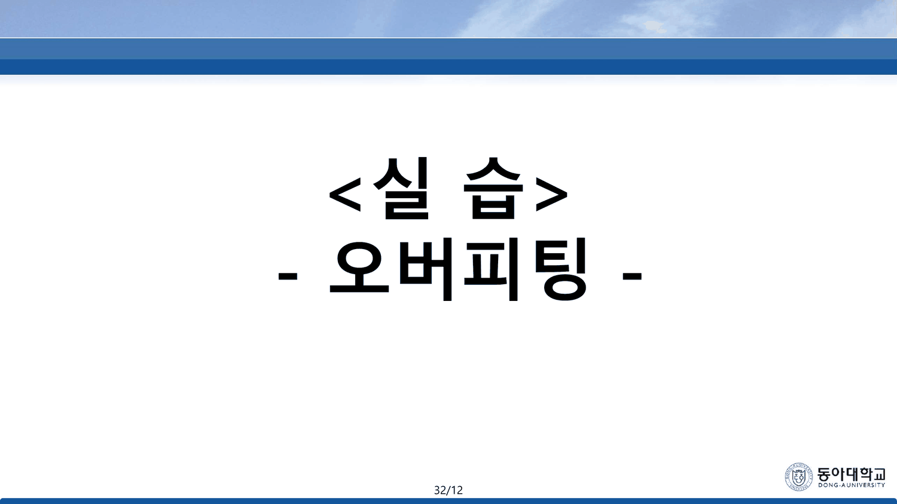
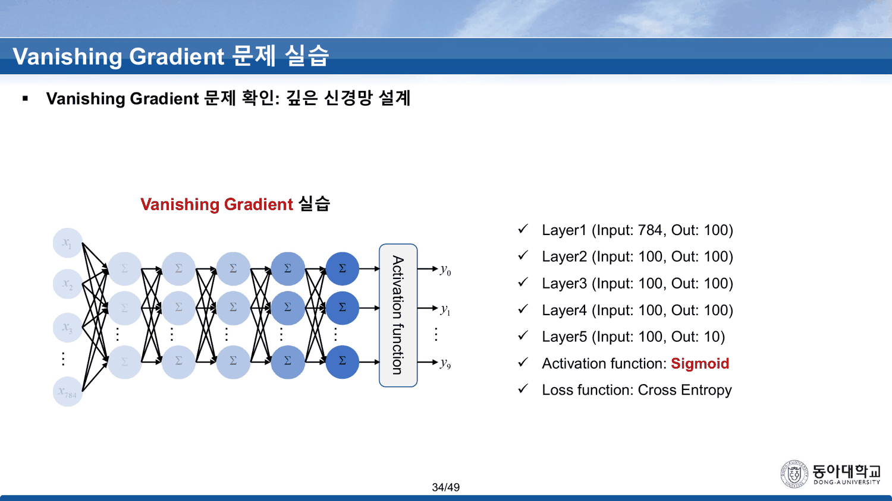
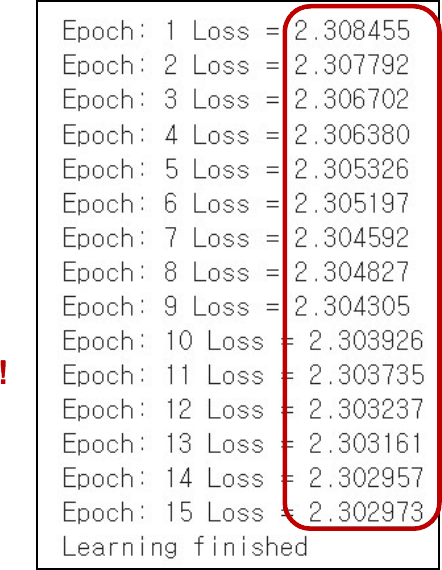
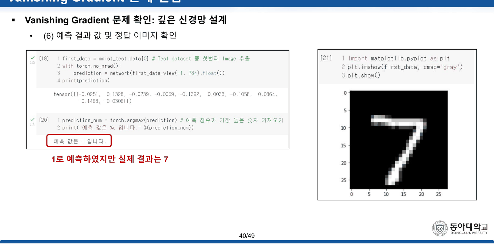
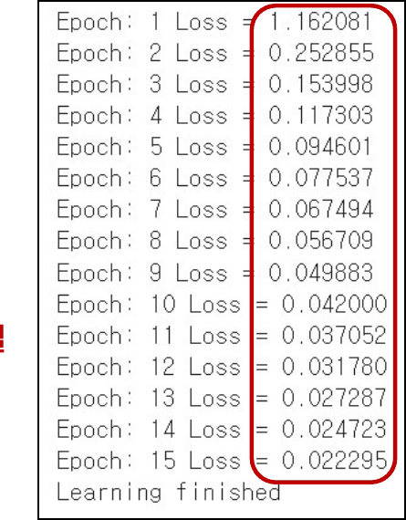
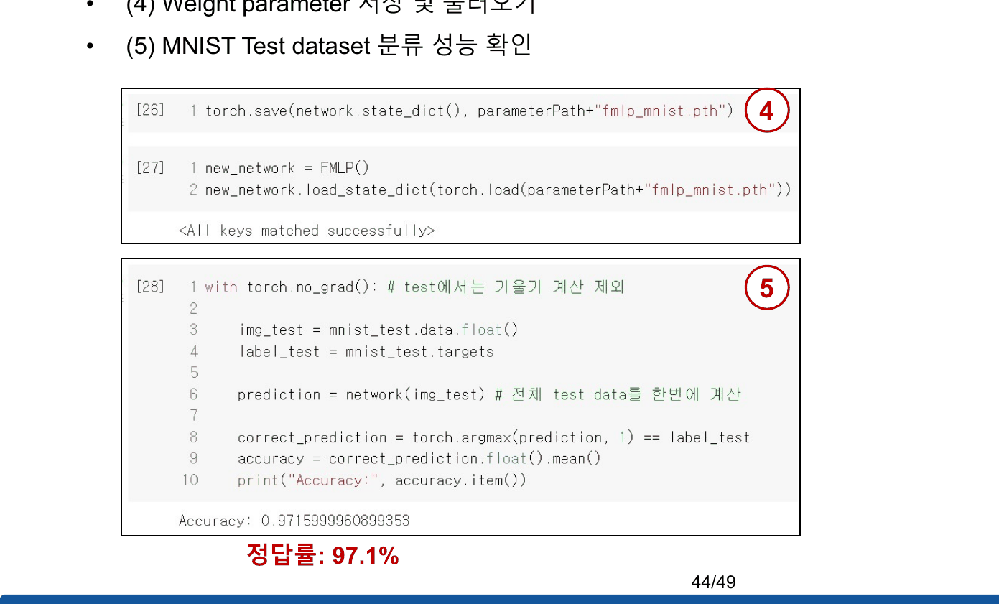
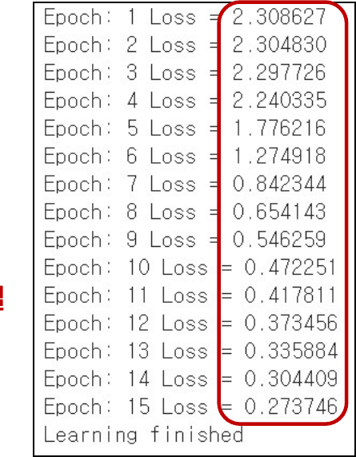
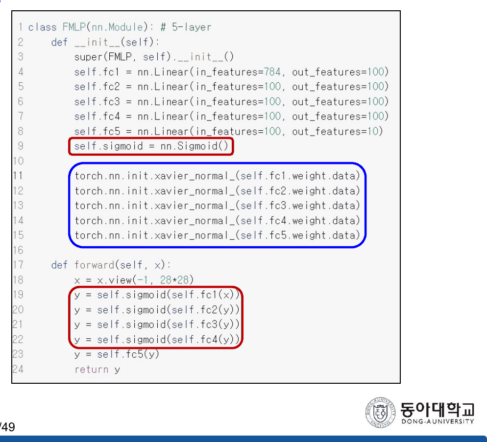

[[13. 덱은 1을 양쪽에서 배제한다]]가 읽은 앞 31장은 곱이 층수만큼 거듭제곱된다는 이야기를 그림으로 했다. 32번부터 18장이 그것을 숫자로 만든다.

그리고 그 숫자들이 **딱 떨어진다.**

---

## 32·33번 — 다른 덱에서 온 두 장

32번은 간지다. `<실 습>` 아래 `- 오버피팅 -` 이 적혀 있다.



꼬리표가 **`32/12`** 다. 이 덱의 다른 모든 장은 `n/49` 인데 이 한 장만 분모가 12다. 12는 `Overfitting` 덱의 분모이고, 그 덱의 13번이 같은 `실습` 간지에 `13/12` 를 달고 있다([[12. 여섯 가지를 가르치고 셋을 해 본다]]). **간지가 원래 덱의 쪽번호를 달고 통째로 옮겨 왔다.**

33번도 그렇다. 제목이 `Overfitting 문제 실습`, 본문이 「Overfitting 이 주로 일어나는 경우 — 매개변수가 많은 표현력이 높은 모델 · 훈련데이터가 적음」이고, 그림은 2층 MLP다. 다만 꼬리표는 `33/49` 로 고쳐져 있다.

34번이 이 덱의 진짜 시작이다. 제목이 `Vanishing Gradient 문제 실습` 으로 바뀌고 설계가 나온다.



| | |
| --- | --- |
| Layer1 | Input 784 → Out 100 |
| Layer2 · 3 · 4 | Input 100 → Out 100 |
| Layer5 | Input 100 → Out 10 |
| Activation function | **Sigmoid** |
| Loss function | Cross Entropy |

36번이 하이퍼파라미터를 「2-layer 환경이랑 동일」로 못 박는다 — `batch_size = 100`, `learning_rate = 0.1`, `training_epochs = 15`, `SGD`, MNIST 전체 60,000장. **바뀐 것은 층의 개수뿐이다.**

파라미터는 $78{,}500 + 3\times10{,}100 + 1{,}010 = 109{,}810$ 개. 2층판(79,510)의 1.38배다. 그리고 시그모이드가 **네 개** 직렬로 놓인다.

---

## 38번 — 손실이 움직이지 않는다



| 에폭 | 1 | 2 | 3 | … | 13 | 14 | 15 |
| ---: | ---: | ---: | ---: | --- | ---: | ---: | ---: |
| 손실 | 2.308455 | 2.307792 | 2.306702 | … | 2.303161 | **2.302957** | 2.302973 |

열다섯 에폭 동안 손실이 움직인 총량은 $2.308455 - 2.302973 = \mathbf{0.005482}$ 다. 그리고 가장 낮았던 14에폭의 값이 $2.302957$.

$$\ln 10 = 2.302585\ldots$$

차이가 **0.000372** 다.

$\ln 10$ 은 우연한 수가 아니다. 열 개 클래스에 확률을 $\frac{1}{10}$ 씩 균등하게 배정했을 때의 교차 엔트로피가 정확히 $-\ln\frac{1}{10} = \ln 10$ 이다. **손실이 거기 붙어 있다는 것은 네트워크가 아무것도 배우지 않고 열 개를 똑같이 찍고 있다는 뜻이다.**

39번의 정확도가 그 해석을 확인한다 — `Accuracy: 0.11349999904632568`, 즉 **11.35%**. 열 클래스 무작위의 기대값 10%다.

40번이 그림으로 한 번 더 보여 준다 — 「**1로 예측하였지만 실제 결과는 7**」.



> [!important] 2층과 5층 사이에서 무슨 일이 일어났는가
> 같은 코드, 같은 데이터, 같은 학습률로 **2층 시그모이드 MLP는 첫 에폭에 손실 1.153683 을 찍고 마지막에 0.196959 까지 내려간다**([[09. 예순 장을 손으로 미분하고, 실습은 한 줄로 끝낸다]]). 5층은 **첫 에폭부터 2.308455**, 즉 이미 균등 예측 수준이다. 학습이 느려진 것이 아니라 **시작하지 못했다.**
>
> [[13. 덱은 1을 양쪽에서 배제한다]]의 셈으로 보면 이유가 보인다. 시그모이드 도함수의 최댓값이 0.25이고 5층에는 그것이 네 개 직렬이므로, 첫 층 가중치에 도달하는 기울기의 상한 계수는 $0.25^4 = 3.906\times10^{-3}$ 이다. 2층에는 하나뿐이라 0.25다. **64배**. *(이 셈은 원본에 없는 보충이다 — 덱은 18번에서 「곱해진다」까지만 말한다.)*

---

## 43·47번 — 두 가지 처방, 두 가지 곡선

41~44번이 시그모이드를 ReLU로 바꾸고, 45~48번이 시그모이드를 그대로 두고 Xavier 초기화를 쓴다. [[13. 덱은 1을 양쪽에서 배제한다]]가 읽은 24번의 두 해결책이 각각 한 번씩이다.

```html preview
<div id="vg" style="font-family:system-ui,-apple-system,sans-serif;color:var(--foreground);background:var(--card);border:1px solid var(--border);border-radius:12px;padding:18px 16px;">
  <p style="margin:0 0 14px;font-size:13px;color:var(--muted-foreground);line-height:1.75;">
    38·43·47번의 손실 로그 45줄을 그대로 겹친다. 비교를 위해
    <b>MLP(실습) 32번의 2층 곡선</b>도 함께 그렸다. 점선이 <b>ln 10 = 2.302585</b>.</p>
  <div id="vgb" style="display:flex;flex-wrap:wrap;gap:6px;margin-bottom:12px;"></div>
  <svg id="vgs" viewBox="0 0 640 260" style="width:100%;height:auto;display:block;"></svg>
  <div id="vgo" style="margin-top:10px;font-size:13.5px;line-height:1.95;font-variant-numeric:tabular-nums;"></div>
  <style>#vg .vb{font:inherit;font-size:11.5px;padding:4px 9px;cursor:pointer;border-radius:6px;
    border:1px solid var(--border);background:transparent;color:var(--muted-foreground);}
    #vg .vb.on{color:var(--card);font-weight:700;}</style>
</div>
<script>
(function(){
  const NS='http://www.w3.org/2000/svg', svg=document.getElementById('vgs');
  const el=(t,a,x)=>{const e=document.createElementNS(NS,t);for(const k in a)e.setAttribute(k,a[k]);
    if(x!==undefined)e.textContent=x;return e;};
  const LN10=Math.log(10);
  const R=[
   {n:'5층 sigmoid (38번)', c:'var(--chart-2)', acc:0.11349999904632568,
    v:[2.308455,2.307792,2.306702,2.306380,2.305326,2.305197,2.304592,2.304827,
       2.304305,2.303926,2.303735,2.303237,2.303161,2.302957,2.302973]},
   {n:'5층 + ReLU (43번)', c:'var(--chart-1)', acc:0.9715999960899353,
    v:[1.162081,0.252855,0.153998,0.117303,0.094601,0.077537,0.067494,0.056709,
       0.049883,0.042000,0.037052,0.031780,0.027287,0.024723,0.022295]},
   {n:'5층 + Xavier (47번)', c:'var(--chart-3,var(--chart-1))', acc:0.8885999917984009,
    v:[2.308627,2.304830,2.297726,2.240335,1.776216,1.274918,0.842344,0.654143,
       0.546259,0.472251,0.417811,0.373456,0.335884,0.304409,0.273746]},
   {n:'2층 sigmoid (MLP실습 32번)', c:'var(--muted-foreground)', acc:0.9448000192642212,
    v:[1.153683,0.451747,0.361733,0.324818,0.302182,0.285703,0.272042,0.259743,
       0.248782,0.238609,0.229102,0.220335,0.212063,0.204168,0.196959]}];
  const on=new Set([0,1,2,3]);
  const L=52,Rx=620,T=14,B=212;
  const sx=i=>L+i/14*(Rx-L), sy=v=>B-v/2.45*(B-T);
  function draw(){
    svg.textContent='';
    for(const g of [0,0.5,1.0,1.5,2.0]){
      svg.appendChild(el('line',{x1:L,y1:sy(g),x2:Rx,y2:sy(g),stroke:'var(--border)',
        'stroke-dasharray':g?'3 5':'',opacity:g?0.45:1}));
      svg.appendChild(el('text',{x:L-7,y:sy(g)+4,'text-anchor':'end','font-size':10,
        fill:'var(--muted-foreground)'},g.toFixed(1)));
    }
    svg.appendChild(el('line',{x1:L,y1:sy(LN10),x2:Rx,y2:sy(LN10),
      stroke:'var(--chart-2)','stroke-dasharray':'7 4','stroke-width':1.6,opacity:0.9}));
    svg.appendChild(el('text',{x:Rx-4,y:sy(LN10)-6,'text-anchor':'end','font-size':11,
      fill:'var(--chart-2)','font-weight':700},'ln 10 = 2.302585'));
    R.forEach((r,k)=>{
      if(!on.has(k)) return;
      let d='';
      r.v.forEach((v,i)=>{d+=(i?'L':'M')+sx(i)+' '+sy(v);});
      svg.appendChild(el('path',{d:d,fill:'none',stroke:r.c,'stroke-width':2.4,
        'stroke-dasharray':k===3?'5 4':''}));
      r.v.forEach((v,i)=>svg.appendChild(el('circle',{cx:sx(i),cy:sy(v),r:2.6,fill:r.c})));
    });
    [0,4,9,14].forEach(i=>svg.appendChild(el('text',{x:sx(i),y:B+17,'text-anchor':'middle',
      'font-size':10.5,fill:'var(--muted-foreground)'},'ep '+(i+1))));
    let rows='';
    R.forEach((r,k)=>{ if(!on.has(k)) return;
      rows += '<div><b style="color:'+r.c+'">'+r.n+'</b> — 첫 '+r.v[0].toFixed(6)+
        ' → 끝 '+r.v[14].toFixed(6)+' · 시험 정확도 <b>'+(r.acc*100).toFixed(2)+'%</b>'+
        (k===0? ' · ln 10 과의 거리 <b style="color:var(--chart-2)">'+
          (Math.min(...r.v)-LN10).toFixed(6)+'</b>' : '')+'</div>';
    });
    document.getElementById('vgo').innerHTML=rows;
  }
  const box=document.getElementById('vgb');
  R.forEach((r,k)=>{
    const b=document.createElement('button');
    b.className='vb on'; b.textContent=r.n;
    b.style.background=r.c; b.style.borderColor=r.c;
    b.onclick=()=>{ if(on.has(k)){on.delete(k);b.classList.remove('on');b.style.background='transparent';b.style.color='var(--muted-foreground)';}
      else{on.add(k);b.classList.add('on');b.style.background=r.c;b.style.color='var(--card)';} draw(); };
    box.appendChild(b);
  });
  draw();
})();
</script>
```





곡선 셋이 서로 다른 이야기를 한다.

- **ReLU** — 첫 에폭에 이미 1.162081 로 내려와 있고, 둘째 에폭에 0.252855 다. 열다섯 에폭 뒤 0.022295. 시험 정확도 **97.16%**
- **Xavier + 시그모이드** — 첫 세 에폭은 2.308627 · 2.304830 · 2.297726 으로 **여전히 $\ln 10$ 근처**다. 4에폭에서 2.240335 로 떨어지기 시작하고 5에폭에 1.776216 으로 탈출한다. 열다섯 에폭 뒤 0.273746. 시험 정확도 **88.86%**
- **아무것도 안 함** — 열다섯 에폭 내내 $\ln 10$ 에 붙어 있다

> [!note] Xavier는 평지를 없애지 않고 짧게 만든다
> 47번의 로그가 이 덱에서 가장 많은 것을 말하는 열다섯 줄이다. 초기화만 바꾼 시그모이드 5층은 **세 에폭을 같은 평지에서 보내고 네 번째에 빠져나온다.** ReLU는 처음부터 평지가 없다. 덱은 두 로그에 똑같이 `Vanishing Gradient 문제 해결` 이라는 붉은 글씨를 붙이고 차이를 말하지 않는다. *(세 에폭이라는 셈은 원본에 없는 보충이다 — 로그 값은 47번에 그대로 인쇄되어 있다.)*



---

## 세 실행 사이에서 바뀌는 줄

35·41·45번이 세 모델 정의를 보여 준다. 세 코드의 차이가 이 덱이 실제로 통제한 변수다.



```python
class FMLP(nn.Module):                       # 5-layer
    def __init__(self):
        super(FMLP, self).__init__()
        self.fc1 = nn.Linear(784, 100)
        self.fc2 = nn.Linear(100, 100)
        self.fc3 = nn.Linear(100, 100)
        self.fc4 = nn.Linear(100, 100)
        self.fc5 = nn.Linear(100, 10)
        self.sigmoid = nn.Sigmoid()          # ← 41번은 이 줄이 nn.ReLU()
        torch.nn.init.xavier_normal_(self.fc1.weight.data)   # ← 45번에만 있는 다섯 줄
        torch.nn.init.xavier_normal_(self.fc2.weight.data)
        torch.nn.init.xavier_normal_(self.fc3.weight.data)
        torch.nn.init.xavier_normal_(self.fc4.weight.data)
        torch.nn.init.xavier_normal_(self.fc5.weight.data)
    def forward(self, x):
        x = x.view(-1, 28*28)
        y = self.sigmoid(self.fc1(x))
        y = self.sigmoid(self.fc2(y))
        y = self.sigmoid(self.fc3(y))
        y = self.sigmoid(self.fc4(y))
        y = self.fc5(y)                      # 마지막 층에는 활성화가 없다
        return y
```

| 실행 | 바뀌는 것 |
| --- | --- |
| 기준선 (35번) | — |
| ReLU (41번) | `nn.Sigmoid()` → `nn.ReLU()` **한 줄** |
| Xavier (45번) | 시그모이드를 그대로 두고 `xavier_normal_` **다섯 줄 추가** |

두 가지를 짚어 둘 만하다.

- **시그모이드는 네 개다.** `fc5` 뒤에는 활성화가 없고 로짓이 그대로 `CrossEntropyLoss` 로 간다([[09. 예순 장을 손으로 미분하고, 실습은 한 줄로 끝낸다]]의 21번이 말한 구조 그대로다). 그래서 기울기가 첫 층까지 가는 동안 지나는 $\sigma'$ 는 **넷**이고, $0.25^4$ 가 그 상한이다
- **Xavier는 `weight.data` 에만 적용된다.** 편향 다섯 개는 PyTorch 기본 초기화를 그대로 쓴다. 30번이 「Xavier initialization: 이전 층과 다음 층의 노드의 수를 반영」이라 적은 규칙이 가중치에만 걸린다는 사실은 코드에만 있고 슬라이드 본문에는 없다

---

## 48번이 0.8886 을 88.5% 라 적는다

정확도 세 개를 원문 출력에서 그대로 옮겨 표기와 대조하면 하나가 어긋난다.

| 슬라이드 | 처방 | 원문 출력 | ×100 | 슬라이드 표기 | 판정 |
| ---: | --- | ---: | ---: | ---: | --- |
| 39 | 없음 | 0.11349999904632568 | 11.3500 | 11.3% | 절사와 일치 |
| 44 | ReLU | 0.9715999960899353 | 97.1600 | 97.1% | 절사와 일치 |
| **48** | **Xavier** | **0.8885999917984009** | **88.8600** | **88.5%** | **어긋난다** |


절사하면 88.8%, 반올림하면 88.9%다. **88.5%는 어느 쪽으로도 나오지 않는다.** 이 덱의 다른 두 표기는 모두 절사 관례를 지킨다.

같은 종류의 어긋남이 `Overfitting` 28번에도 있다 — 0.7954 를 79.3% 라 적었다([[12. 여섯 가지를 가르치고 셋을 해 본다]]). 두 실습 덱에서 각각 한 건씩, 둘 다 세 번째 결과 슬라이드다.

```html preview
<div id="ac" style="font-family:system-ui,-apple-system,sans-serif;color:var(--foreground);background:var(--card);border:1px solid var(--border);border-radius:12px;padding:18px 16px;">
  <p style="margin:0 0 14px;font-size:13px;color:var(--muted-foreground);line-height:1.75;">
    이 과목의 실습 덱 세 편에 인쇄된 정확도 <b>아홉 개</b>를 원문 출력에서 옮겨,
    반올림·절사 양쪽으로 계산해 슬라이드 표기와 맞춰 본다.</p>
  <table style="width:100%;border-collapse:collapse;font-size:12.5px;font-variant-numeric:tabular-nums;">
    <thead><tr style="font-size:11.5px;color:var(--muted-foreground);text-align:left;">
      <th style="padding:4px 0;">덱 · 슬라이드</th><th>처방</th><th>원문</th><th>반올림</th><th>절사</th>
      <th>슬라이드</th><th></th></tr></thead>
    <tbody id="acb"></tbody>
  </table>
  <div id="aco" style="margin-top:12px;font-size:13.5px;line-height:1.95;"></div>
</div>
<script>
(function(){
  const D=[
   ['MLP(실습) 26','SLP',0.8895999789237976,'88.9%'],
   ['MLP(실습) 34','2층 MLP',0.9448000192642212,'94.4%'],
   ['Overfitting 21','300장 기준선',0.763700008392334,'76.3%'],
   ['Overfitting 25','Batch Norm',0.7935000061988831,'79.3%'],
   ['Overfitting 28','Dropout',0.7954000234603882,'79.3%'],
   ['Overfitting 36','Augmentation',0.8073999881744385,'80.73%'],
   ['Vanishing 39','5층 sigmoid',0.11349999904632568,'11.3%'],
   ['Vanishing 44','ReLU',0.9715999960899353,'97.1%'],
   ['Vanishing 48','Xavier',0.8885999917984009,'88.5%']];
  let bad=0;
  document.getElementById('acb').innerHTML = D.map(([s,p,v,lab])=>{
    const x=v*100;
    const cands=[(Math.round(x*10)/10).toFixed(1)+'%',(Math.floor(x*10)/10).toFixed(1)+'%',
                 (Math.round(x*100)/100).toFixed(2)+'%',(Math.floor(x*100)/100).toFixed(2)+'%'];
    const ok=cands.includes(lab); if(!ok) bad++;
    return '<tr><td style="padding:5px 0;border-bottom:1px solid var(--border);">'+s+'</td>'+
      '<td style="border-bottom:1px solid var(--border);">'+p+'</td>'+
      '<td style="border-bottom:1px solid var(--border);font-size:11px;">'+x.toFixed(4)+'</td>'+
      '<td style="border-bottom:1px solid var(--border);">'+cands[0]+'</td>'+
      '<td style="border-bottom:1px solid var(--border);">'+cands[1]+'</td>'+
      '<td style="border-bottom:1px solid var(--border);font-weight:700;">'+lab+'</td>'+
      '<td style="border-bottom:1px solid var(--border);font-weight:700;color:'+
        (ok?'var(--chart-1)':'var(--chart-2)')+';">'+(ok?'✓':'✗')+'</td></tr>';
  }).join('');
  document.getElementById('aco').innerHTML =
    '아홉 개 중 <b style="color:var(--chart-2)">'+bad+'개</b>가 반올림으로도 절사로도 설명되지 않는다 — '+
    'Overfitting 28번(79.3%, 실제 79.54%)과 Vanishing 48번(88.5%, 실제 88.86%).<br>'+
    '<span style="color:var(--muted-foreground);font-size:12.5px;">'+
    '나머지 일곱은 모두 <b>절사</b> 관례를 따른다. 80.73% 한 건만 소수 둘째 자리까지 적는다.</span>';
})();
</script>
```

---

## 발견한 원본 문제

> [!caution] 이 절이 가리키는 것
> 32~49번 범위. 세 개의 손실 로그(45줄)와 세 개의 정확도를 원문 출력에서 옮겨 파이썬으로 계산해 대조했다.

`숫자를 잘못 적은 것`

- **48번 `정답률: 88.5%`** — 같은 슬라이드의 출력은 `Accuracy: 0.8885999917984009`, 즉 **88.86%** 다. 반올림하면 88.9%, 절사하면 88.8%. 88.5%는 어느 쪽도 아니다. 같은 덱의 39·44번은 절사 관례를 정확히 지킨다

`다른 덱에서 온 장`

- **32번의 꼬리표가 `32/12` 다** — 이 덱의 다른 모든 장은 `n/49` 다. 12는 `Overfitting` 덱의 분모이고, 그 덱 13번이 같은 `실습` 간지에 `13/12` 를 달고 있다. **간지가 원본 쪽번호째로 옮겨 왔다**
- **33번의 제목과 본문이 `Overfitting 문제 실습` 이다** — 「매개변수가 많은 표현력이 높은 모델 · 훈련데이터가 적음」이라는 오버피팅의 조건이 적혀 있고 그림은 2층 MLP다. 이 실습은 데이터를 줄이지 않고 60,000장을 그대로 쓰므로 그 조건과 무관하다. 꼬리표는 `33/49` 로 고쳐져 있다

`해설이 없는 결과`

- **43번과 47번에 똑같이 `Vanishing Gradient 문제 해결` 이 붙는다** — 두 로그는 전혀 다르다. ReLU는 첫 에폭에 이미 1.162081 이고, Xavier는 **세 에폭을 $\ln 10$ 근처에 머문 뒤** 네 번째에 떨어진다. 최종 정확도도 97.16% 대 88.86%로 8.3pp 차이다
- **38번의 손실이 $\ln 10$ 에 붙어 있다는 사실이 언급되지 않는다** — 붉은 글씨는 `Vanishing Gradient 문제 발생!` 뿐이다. 39번의 11.35% 가 균등 예측의 기대값 10%라는 것도 적혀 있지 않다

`검산해 얻은 것 (원본에 없는 보충)`

- **38번의 열다섯 값은 전부 $\ln 10 = 2.302585$ 위에 있고 최솟값(14에폭)과의 거리가 0.000372 다.** 열다섯 에폭 동안의 총 변화량은 0.005482
- **38번의 손실은 단조 감소가 아니다** — 8에폭(2.304827 > 2.304592)과 15에폭(2.302973 > 2.302957)에서 올라간다. 평지 위의 잡음이다
- **5층의 시그모이드는 넷이므로 기울기 감쇠 상한은 $0.25^4 = 3.906\times10^{-3}$** 이고 2층은 하나라 0.25다 — **64배** 차이
- **파라미터는 109,810개**로 2층판(79,510)의 1.38배다. 층을 늘려 파라미터를 38% 늘렸더니 정확도가 94.48%에서 11.35%로 떨어졌다
- **이 과목 실습 덱 세 편의 정확도 아홉 개 중 일곱이 절사 관례를 따른다.** 벗어나는 둘이 `Overfitting` 28번과 이 덱 48번이고, 둘 다 각 덱의 **세 번째 결과 슬라이드**다

---

## 다른 문서와의 연결

- [[13. 덱은 1을 양쪽에서 배제한다]] — 1~31번. $0.25^4$ 이 여기서 숫자가 된다
- [[09. 예순 장을 손으로 미분하고, 실습은 한 줄로 끝낸다]] — 2층판. 같은 코드에서 층만 셋 늘렸다
- [[12. 여섯 가지를 가르치고 셋을 해 본다]] — 32·33번이 온 곳. 그리고 같은 종류의 표기 오류가 28번에 있다
- [[11. 여섯 장을 들여 더 좋은 옵티마이저를 소개하고, 실습 결과는 전부 더 나쁘다]] — 같은 SLP/MLP 코드를 옵티마이저 쪽에서 건드린다
- [[07. 54번이 답을 먼저 주고, 덱은 그 답을 쓰지 않고 열여섯 장을 간다]] — 54번의 $\sigma(1-\sigma)$ 가 네 번 곱해지면 여기가 된다
- [[08. 덱이 약속만 하고 넘어간 절은 공책에 있다]] — 공책 10쪽의 `CEE (엔트로피)` 가 $\ln 10$ 이 무엇인지 설명하는 자리다

---

## 근거 자료

`Vanishing Gradient Effect.pdf` 32~49번.

| 슬라이드 | 무엇이 있는가 | 인용 |
| ---: | --- | --- |
| 32 | `<실 습> - 오버피팅 -` 간지, 꼬리표 `32/12` | ✔ |
| 33 | `Overfitting 문제 실습` — 2층 그림 | |
| 34 | 5층 설계 (784-100-100-100-100-10, Sigmoid, CE) | ✔ |
| 35~37 | 모델 정의 · 하이퍼파라미터(2-layer와 동일) · 학습 반복문 | |
| 38 | 손실 로그 15줄 — 2.308455 → 2.302973 | ✔ |
| 39 | 시험 정확도 11.3% | |
| 40 | 예측 1, 정답 7 | ✔ |
| 41~43 | ReLU로 변경 — 손실 1.162081 → 0.022295 | |
| 44 | 시험 정확도 97.1% | ✔ |
| 45~47 | Xavier 초기화 (시그모이드 유지) — 모델 정의와 손실 2.308627 → 0.273746 | ✔ (45·47) |
| 48 | 시험 정확도 — 원문 0.8886, 인쇄 88.5% | ✔ |
| 49 | Q&A | |

수치 검산: 세 손실 로그 45줄과 $\ln 10$ 의 거리, 단조성, 정확도 세 개의 반올림·절사, 파라미터 수 109,810, 감쇠 상한 $0.25^4$ 를 파이썬으로 계산했다. 표기 대조에는 `MLP(실습)`·`Overfitting` 의 정확도 여섯 개를 함께 넣었다.
