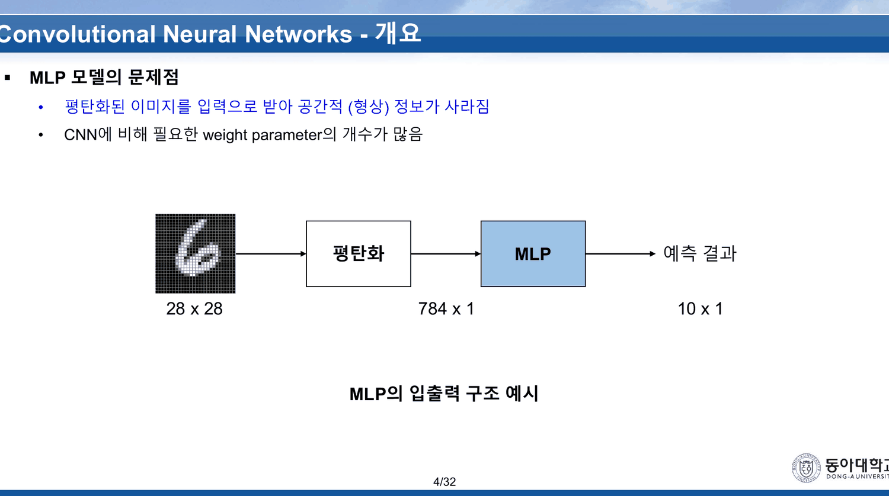
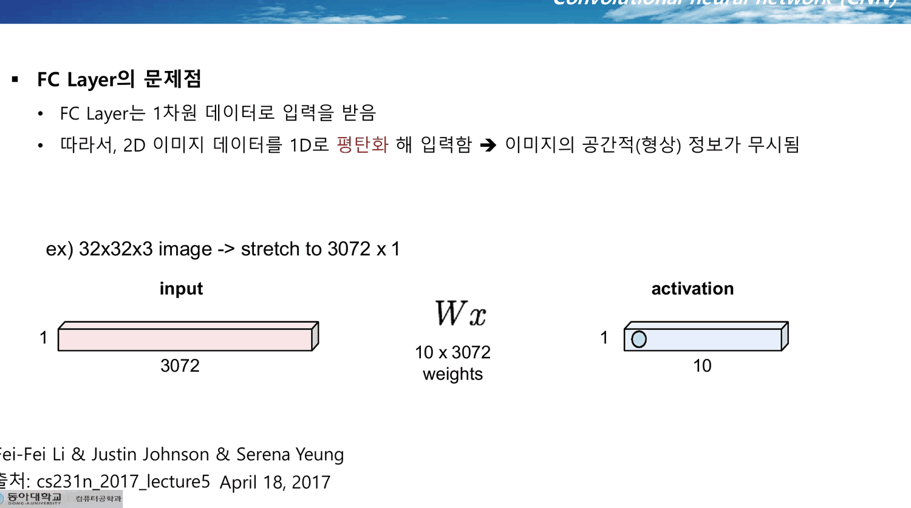
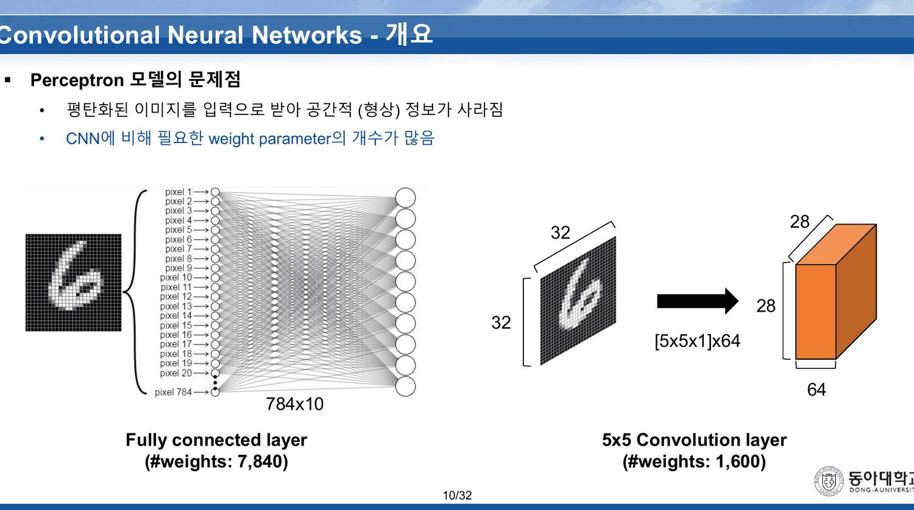
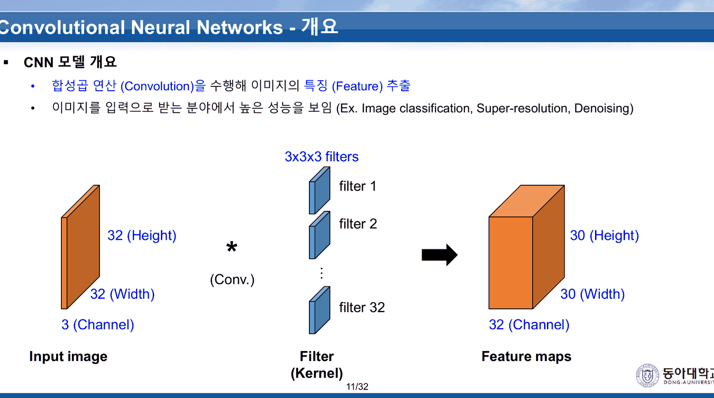
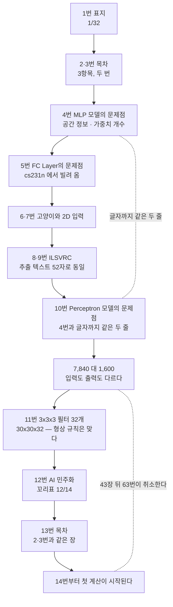

이 덱은 74장이고, 꼬리표의 분모는 **32**다.

33번부터 마지막 74번까지 마흔두 장이 `33/32`, `34/32`, … `74/32` 를 달고 간다. 분자가 분모를 두 배 넘게 앞지르는 덱이다. 이 과목에서 쪽번호 분모는 덱이 어디서 증축되었는지를 알려 주는 가장 싼 단서였고([10. 한 줄에 붙은 마이너스가 여섯 장을 타고 내려온다](<./10. 한 줄에 붙은 마이너스가 여섯 장을 타고 내려온다.md>)·[13. 덱은 1을 양쪽에서 배제한다](<./13. 덱은 1을 양쪽에서 배제한다.md>)), 여기서는 그 단서가 **덱의 절반 이상이 나중에 붙었다**고 말한다.

앞 스무 장을 읽는다. 합성곱은 아직 한 번도 계산되지 않는다.

---

## 세 번 하는 하나의 불평

4번이 첫 번째다.



> **MLP 모델의 문제점**
> · 평탄화된 이미지를 입력으로 받아 공간적 (형상) 정보가 사라짐
> · CNN에 비해 필요한 weight parameter의 개수가 많음

5번이 두 번째다. 제목이 `Fully Connected (FC) Layer`, 소제목이 **「FC Layer의 문제점」**이다. 출처가 박혀 있다 — `Fei-Fei Li & Justin Johnson & Serena Yeung, cs231n_2017_lecture5`.



> · FC Layer는 1차원 데이터로 입력을 받음
> · 따라서, 2D 이미지 데이터를 1D로 평탄화 해 입력함 → 이미지의 공간적(형상) 정보가 무시됨

그리고 10번이 세 번째다.



> **Perceptron 모델의 문제점**
> · 평탄화된 이미지를 입력으로 받아 공간적 (형상) 정보가 사라짐
> · CNN에 비해 필요한 weight parameter의 개수가 많음

**4번과 10번의 두 줄은 글자까지 같다.** 바뀐 것은 제목의 이름뿐이다 — `MLP` 가 `Perceptron` 이 되었다. 5번은 같은 불평을 cs231n 의 용어(`FC Layer`)로 한다.

세 이름은 이 과목에서 서로 다른 것이었다. 퍼셉트론은 [01. 빌려 온 그림이 양쪽을 다 찌른다](<./01. 빌려 온 그림이 양쪽을 다 찌른다.md>)의 단층 판별기였고, MLP 는 [04. 목록은 길고 고르는 기준은 한 줄이다](<./04. 목록은 길고 고르는 기준은 한 줄이다.md>)의 층 쌓기였으며, FC Layer 는 [09. 예순 장을 손으로 미분하고, 실습은 한 줄로 끝낸다](<./09. 예순 장을 손으로 미분하고, 실습은 한 줄로 끝낸다.md>)의 `nn.Linear` 였다. 여기서 셋은 **같은 피고**가 된다. 합성곱을 소개하려면 피고가 하나여야 하기 때문이다.

> [!note] 이 세 장은 서로 여섯 장 떨어져 있다
> 4번과 10번 사이에 5~9번 다섯 장이 있는데, 그중 셋(6·7번, 8·9번)이 그림만 있는 장이다. 같은 불평을 반복하는 두 장이 여섯 장 간격으로 놓인 셈이고, 덱을 쭉 넘기는 사람은 되풀이라는 것을 알아채기 어렵다.

---

## 7,840 대 1,600 — 무엇을 세었나

두 번째 줄(「weight parameter의 개수가 많음」)을 뒷받침하는 숫자는 덱 전체에서 10번 한 장에만 있다. 슬라이드는 두 상자를 나란히 놓는다.

| | 왼쪽 | 오른쪽 |
| --- | --- | --- |
| 이름 | Fully connected layer | 5x5 Convolution layer |
| 그림의 입력 | MNIST 숫자 이미지, `784x10` 이라 적힌 연결선 | `32` × `32` 라 적힌 숫자 이미지 |
| 층 | `784x10` | `[5x5x1]x64` |
| 출력 | 노드 10개 | `28` × `28` × `64` 큐브 |
| 인쇄된 값 | **#weights: 7,840** | **#weights: 1,600** |

두 값 자체는 정확하다. $784\times10 = 7{,}840$ 이고 $5\times5\times1\times64 = 1{,}600$ 이다. 문제는 그 둘이 **같은 것을 세지 않았다**는 데 있다.

```html preview
<div id="cmp" style="font-family:system-ui,-apple-system,sans-serif;color:var(--foreground);background:var(--card);border:1px solid var(--border);border-radius:12px;padding:18px 16px;">
  <p style="margin:0 0 6px;font-size:13px;color:var(--muted-foreground);line-height:1.75;">
    10번 슬라이드가 나란히 놓은 두 층을, 슬라이드에 인쇄된 값 그대로 펼친다.
    막대는 <b>가중치 개수</b>(로그 눈금), 오른쪽 숫자는 <b>그 층이 내놓는 값의 개수</b>다.</p>
  <div style="margin:10px 0 14px;">
    <label style="font-size:12.5px;color:var(--muted-foreground);">비교 기준 &nbsp;</label>
    <select id="mode" style="font-size:13px;padding:3px 6px;border:1px solid var(--border);border-radius:6px;background:var(--card);color:var(--foreground);">
      <option value="w">가중치 개수 (슬라이드가 센 것)</option>
      <option value="o">출력 값의 개수 (슬라이드가 세지 않은 것)</option>
    </select>
  </div>
  <svg id="cs" viewBox="0 0 640 200" style="width:100%;height:auto;display:block;"></svg>
  <div id="co" style="margin-top:10px;font-size:13.5px;line-height:1.95;"></div>
</div>
<script>
(function(){
  const NS='http://www.w3.org/2000/svg', svg=document.getElementById('cs');
  const el=(t,a,x)=>{const e=document.createElementNS(NS,t);for(const k in a)e.setAttribute(k,a[k]);
    if(x!==undefined)e.textContent=x;return e;};
  // 전부 10번 슬라이드에 인쇄된 값에서 나온다
  const FC_W=7840, CONV_W=1600, FC_O=10, CONV_O=28*28*64;
  const ROWS=[{n:'Fully connected layer (784x10)',w:FC_W,o:FC_O,c:'var(--chart-2)'},
              {n:'5x5 Convolution layer ([5x5x1]x64)',w:CONV_W,o:CONV_O,c:'var(--chart-1)'}];
  const L=30,R=470,T=48,H=44;
  function draw(mode){
    while(svg.firstChild) svg.removeChild(svg.firstChild);
    const vals=ROWS.map(r=>mode==='w'?r.w:r.o);
    const max=Math.max(...vals), lg=v=>Math.log10(Math.max(v,1))/Math.log10(max);
    svg.appendChild(el('text',{x:L,y:22,'font-size':12,fill:'var(--muted-foreground)','font-weight':700},
      mode==='w'?'가중치 개수 — 슬라이드가 인쇄한 값':'출력 값의 개수 — 슬라이드가 인쇄하지 않은 값'));
    ROWS.forEach((r,i)=>{
      const v=mode==='w'?r.w:r.o, y=T+i*H;
      svg.appendChild(el('text',{x:L,y:y-6,'font-size':12,fill:r.c,'font-weight':700},r.n));
      svg.appendChild(el('rect',{x:L,y:y,width:Math.max(3,(R-L)*lg(v)),height:18,rx:4,fill:r.c,opacity:0.85}));
      svg.appendChild(el('text',{x:R+12,y:y+14,'font-size':13.5,fill:'var(--foreground)',
        'font-weight':700},v.toLocaleString()+' 개'));
    });
    const ratio=(vals[0]>=vals[1]?vals[0]/vals[1]:vals[1]/vals[0]);
    svg.appendChild(el('text',{x:L,y:T+2*H+26,'font-size':12.5,fill:'var(--muted-foreground)'},
      '비 ' + ratio.toFixed(2) + ' 배 — ' + (mode==='w'?'합성곱 쪽이 작다':'합성곱 쪽이 크다')));
    document.getElementById('co').innerHTML = mode==='w'
      ? '슬라이드가 고른 기준이다. 7,840 : 1,600 = <b>4.90 : 1</b>.<br><span style="color:var(--muted-foreground);font-size:12.5px;">다만 왼쪽은 28×28=784 짜리 입력을 쓰고, 오른쪽 그림에는 <b>32</b>가 두 번 적혀 있다. 같은 이미지가 아니다.</span>'
      : '기준을 출력 쪽으로 바꾸면 방향이 뒤집힌다. 10 : 50,176 = <b>1 : 5,017.6</b>.<br><span style="color:var(--muted-foreground);font-size:12.5px;">왼쪽은 열 개의 예측 확률을 내고 끝나지만, 오른쪽은 28×28×64 큐브를 내놓고 <b>아직 아무것도 분류하지 않았다</b>. 그 큐브를 분류로 바꾸는 값은 이 슬라이드에 없다.</span>';
  }
  document.getElementById('mode').addEventListener('change',e=>draw(e.target.value));
  draw('w');
})();
</script>
```

두 가지가 어긋난다.

**입력이 다르다.** 왼쪽은 `784` — 28×28 이다. 오른쪽 그림에는 `32` 가 세로와 가로에 하나씩 적혀 있고, 출력이 `28` × `28` 인 것이 그 증거다. 5×5 필터를 패딩 없이 32에 대면 $32-5+1=28$ 이다. 같은 이미지를 두고 두 방식을 비교한 것이 아니라, **28×28 이미지에 대한 FC 와 32×32 이미지에 대한 합성곱**을 비교했다.

**끝나는 곳이 다르다.** 왼쪽 `784x10` 은 열 개의 값을 내고 그것이 예측이다. 오른쪽 `[5x5x1]x64` 는 28×28×64 = **50,176** 개의 값을 내고, 그 다음에 무엇을 해야 하는지는 이 장에 없다. 덱도 그것을 알고 있다 — 마흔세 장 뒤 63번이 **「출력의 형태가 cube 이므로 예측 확률을 확인 할 수 없음」**이라고 적는다([17. 슬라이드 10이 약속한 절약을 슬라이드 63이 취소한다](<./17. 슬라이드 10이 약속한 절약을 슬라이드 63이 취소한다.md>)).

> [!warning] 10번의 비교는 세 가지가 동시에 다르다
> 입력 크기(28×28 대 32×32), 출력 개수(10 대 50,176), 그리고 역할(분류기 대 특징 추출기). 셋 중 하나만 맞춰도 4.90:1 은 유지되지 않는다. 덱이 이 비교를 다시 꺼내는 곳은 없고, **숫자를 고쳐 주는 장도 없다.**

11번이 그 숫자를 한 번 더, 이번에는 컬러 이미지로 되풀이한다.



| | 값 |
| --- | --- |
| Input image | 32 (Height) × 32 (Width) × 3 (Channel) |
| Filter (Kernel) | 3x3x3, filter 1 … filter 32 |
| Feature maps | 30 (Height) × 30 (Width) × 32 (Channel) |

$32-3+1 = 30$ 이고 필터 32개가 채널 32개가 된다 — **둘 다 맞다.** 이 장은 이 덱에서 출력 형상 규칙을 처음으로 정확히 그린 장이고, 37~45번의 3D 합성곱 절이 하는 말을 서른네 장 앞에서 미리 다 한다. 그런데 계산은 여기서도 하지 않는다. `*` 밑에 `(Conv.)` 라고만 적혀 있다.

---

## 12번 — 다른 덱에서 온 장

11번과 13번 사이에 이 한 장이 있다.


> **Democratization of AI**
> [AI 민주화] 누구나 AI로부터 차별 받지 않고 AI 기술에 쉽게 접근하고 개발할 수 있도록 하는 것!

꼬리표가 **`12/14`** 다. 이 덱의 다른 모든 장은 분모가 32인데 이 한 장만 14다. 앞뒤 어느 장도 AI 민주화를 언급하지 않고, 13번은 2·3번과 똑같은 목차로 되돌아간다.

이 과목에서 같은 일이 세 번째다.

| 덱 | 끼어든 장 | 그 장이 달고 온 분모 | 정리문서 |
| --- | --- | --- | --- |
| `Optimization(이론)` | 2번 공통 지도 | `2/39` | [10. 한 줄에 붙은 마이너스가 여섯 장을 타고 내려온다](<./10. 한 줄에 붙은 마이너스가 여섯 장을 타고 내려온다.md>) |
| `Vanishing Gradient Effect` | 32번 실습 간지 | `32/12` | [14. 다섯 층을 쌓으면 손실이 ln 10 에 붙는다](<./14. 다섯 층을 쌓으면 손실이 ln 10 에 붙는다.md>) |
| `CNN (이론)` | 12번 AI 민주화 | `12/14` | 이 문서 |

셋 다 **분자는 새 덱의 순번으로 고쳐졌고 분모만 남았다.** 슬라이드를 복사할 때 쪽번호 필드가 자동 갱신되지 않는 자리가 한 군데 있다는 뜻이고, 그 자리가 어디인지를 세 덱이 일관되게 증언한다.

---

## 2·3·13번 — 세 줄짜리 목차가 세 번 인쇄된다

2번과 3번은 같은 장이다. 추출 텍스트가 55자로 동일하고, 다른 것은 꼬리표(`2/32` · `3/32`)뿐이다. 13번이 같은 목차를 한 번 더 인쇄한다(`13/32`).

> 1. CNN 개요
> 2. Convolution 연산
> 3. 3D 데이터의 Convolution 연산

세 항목이다. 그리고 36번이 네 번째로 같은 목차를 인쇄한다. 네 번 인쇄되는 동안 항목은 한 번도 바뀌지 않는다.

문제는 이 세 항목이 덱을 다 덮지 못한다는 데 있다. 목차의 마지막 항목(`3D 데이터의 Convolution 연산`)에 대응하는 절은 37~45번에서 끝나고, **46번부터 74번까지 스물아홉 장은 목차에 없다.**

```html preview
<div id="toc" style="font-family:system-ui,-apple-system,sans-serif;color:var(--foreground);background:var(--card);border:1px solid var(--border);border-radius:12px;padding:18px 16px;">
  <p style="margin:0 0 14px;font-size:13px;color:var(--muted-foreground);line-height:1.75;">
    덱 74장을 쪽번호 순으로 늘어놓고, <b>2·3·13·36번 목차가 약속한 세 항목</b>이 어디까지 덮는지 칠한다.
    막대를 누르면 그 구간의 내용이 아래에 나온다.</p>
  <svg id="ts" viewBox="0 0 640 132" style="width:100%;height:auto;display:block;cursor:pointer;"></svg>
  <div id="to" style="margin-top:10px;font-size:13.5px;line-height:1.95;min-height:3.6em;"></div>
</div>
<script>
(function(){
  const NS='http://www.w3.org/2000/svg', svg=document.getElementById('ts'), out=document.getElementById('to');
  const el=(t,a,x)=>{const e=document.createElementNS(NS,t);for(const k in a)e.setAttribute(k,a[k]);
    if(x!==undefined)e.textContent=x;return e;};
  const SEG=[
    {a:1,b:13, n:'1. CNN 개요', inToc:true,  c:'var(--chart-1)',
     d:'표지 · 목차 두 장 · 세 번 하는 불평(4·5·10번) · 11번 형상 규칙 · 12번 AI 민주화(12/14) · 13번 목차. <b>합성곱 계산은 한 번도 없다.</b>'},
    {a:14,b:35, n:'2. Convolution 연산', inToc:true, c:'var(--chart-1)',
     d:'4x4 예제 · 스트라이드 · 패딩 · 출력 크기 공식 · 풀링. 이 덱에서 <b>손으로 검산할 수 있는 유일한 구간</b>이다.'},
    {a:36,b:45, n:'3. 3D 데이터의 Convolution 연산', inToc:true, c:'var(--chart-1)',
     d:'4x4x3 입력에 3x3x3 필터. 63·55·18·51 이 인쇄되지만 <b>세 채널 중 하나만 보인다.</b>'},
    {a:46,b:58, n:'(목차에 없음) cs231n Convolution Layer', inToc:false, c:'var(--chart-2)',
     d:'32x32x3 에 5x5x3 필터를 대는 cs231n 슬라이드 열세 장. 46~58번이 전부 <code>Fei-Fei Li &amp; Justin Johnson &amp; Serena Yeung</code> 출처를 달고 있다.'},
    {a:59,b:74, n:'(목차에 없음) LeNet-5 · 응용 · 결론', inToc:false, c:'var(--chart-2)',
     d:'62~64번이 10번의 약속을 뒤집는 자리다. 65번 LeNet-5, 66~70번 응용, 71~72번 결론, 73번 학회 다섯 곳, 74번 Q&amp;A.'}];
  const L=18,R=622,Y=44,H=26, N=74;
  const x=p=>L+(p-1)/N*(R-L);
  svg.appendChild(el('text',{x:L,y:20,'font-size':12,fill:'var(--muted-foreground)','font-weight':700},
    '목차가 덮는 구간 (진한 색) — 1~45번 · 45장'));
  svg.appendChild(el('text',{x:R,y:20,'text-anchor':'end','font-size':12,fill:'var(--chart-2)','font-weight':700},
    '목차 밖 — 46~74번 · 29장'));
  SEG.forEach(s=>{
    const g=el('g',{});
    g.appendChild(el('rect',{x:x(s.a),y:Y,width:x(s.b+1)-x(s.a)-2,height:H,rx:4,
      fill:s.c,opacity:s.inToc?0.85:0.42,stroke:s.c,'stroke-width':1.2}));
    g.appendChild(el('text',{x:(x(s.a)+x(s.b+1))/2,y:Y+H+16,'text-anchor':'middle','font-size':10.5,
      fill:'var(--muted-foreground)'},s.a+'–'+s.b}));
    g.addEventListener('click',()=>{out.innerHTML='<b style="color:'+s.c+'">'+s.n+'</b> ('+s.a+'~'+s.b+'번, '+(s.b-s.a+1)+'장)<br>'+s.d;});
    svg.appendChild(g);
  });
  [1,14,36,46,59,74].forEach(p=>svg.appendChild(el('text',{x:x(p),y:Y-6,'font-size':10,
    fill:'var(--muted-foreground)'},String(p))));
  svg.appendChild(el('text',{x:L,y:Y+H+42,'font-size':12.5,fill:'var(--muted-foreground)'},
    '목차가 네 번 인쇄되는 동안 항목은 한 번도 늘지 않는다 — 2 · 3 · 13 · 36번'));
  out.innerHTML='<span style="color:var(--muted-foreground);">막대를 눌러 구간을 고른다. 목차 세 항목이 덮는 것은 <b>74장 중 45장</b>이고, 나머지 29장에는 이름표가 없다.</span>';
})();
</script>
```

목차 밖 스물아홉 장 가운데 46~58번 열세 장은 **전부 cs231n 슬라이드**다(출처 표기가 장마다 붙어 있다). 그리고 62~64번이 10번의 약속을 취소하는 자리다. 즉 이 덱에서 가장 중요한 뒤집기가 **목차가 존재를 인정하지 않는 구간**에서 일어난다.

---

## 6~9번 — 빌려 온 네 장

이 네 장에는 본문이 거의 없다. 그림이 곧 내용이다.

| 장 | 본문 | 그림 |
| --- | --- | --- |
| 6번 | 「이미지의 특성에 따라 뉴런이 다르게 활성화 됨」 | 고양이 시각 피질 그림 (`Cat image by CNX OpenStax … CC BY 4.0`) |
| 7번 | 「2D이미지를 Input으로 사용」 | 격자 위의 필터 |
| 8번 | `ImageNet Large Scale Visual Recognition Challenge (ILSVRC)` | — |
| 9번 | `ImageNet Large Scale Visual Recognition Challenge (ILSVRC)` | — |

8번과 9번은 추출 텍스트가 **52자로 완전히 같다.** 제목 한 줄이 전부이고 나머지는 이미지다. 같은 일이 이 과목에서 여러 번 있었다 — `Backpropagation` 21·22·23번이 글자까지 같았고([05. 방향은 열 장, 보폭은 이름이 없다](<./05. 방향은 열 장, 보폭은 이름이 없다.md>)), `Overfitting` 32·33번도 그랬다([12. 여섯 가지를 가르치고 셋을 해 본다](<./12. 여섯 가지를 가르치고 셋을 해 본다.md>)). 애니메이션을 한 장씩 저장한 흔적이다.

6번의 고양이 그림은 이 과목이 [01. 빌려 온 그림이 양쪽을 다 찌른다](<./01. 빌려 온 그림이 양쪽을 다 찌른다.md>)에서 시작한 자리로 돌아온다. 01번 노트가 읽은 `Perceptron (이론)` 10번은 cs231n 에서 시점·조명·변형·가림 네 난제를 빌려 왔고, **그 그림은 퍼셉트론도 함께 찔렀다.** 여기 6번은 그중 어느 것도 다시 꺼내지 않는다. 합성곱이 그 넷 중 무엇을 푸는지 — 평행이동에 대한 등변성은 푸는 쪽이고 시점·가림은 풀지 않는 쪽인데 — 이 덱 어디에도 적혀 있지 않다.

---

## 앞 스무 장의 지도



세 개의 목차(2·3·13번)와 두 번 하는 불평(4·10번)과 한 장의 외래 슬라이드(12번)를 걷어내면, 앞 스무 장에서 새 정보를 주는 장은 **5·10·11번 세 장**이다. 그중 10번은 비교가 성립하지 않고, 11번은 규칙만 그리고 계산은 미룬다. 실제로 숫자가 나오는 것은 [16. 검산되는 예제와 검산할 수 없는 예제](<./16. 검산되는 예제와 검산할 수 없는 예제.md>)가 읽는 14번부터다.

---

## 이 덱이 아직 갚지 않은 빚

앞선 열네 노트가 이 덱에 넘긴 빚이 셋 있었다. 그중 하나는 여기서 갚힌다.

| 넘긴 곳 | 내용 | 여기서 |
| --- | --- | --- |
| [09. 예순 장을 손으로 미분하고, 실습은 한 줄로 끝낸다](<./09. 예순 장을 손으로 미분하고, 실습은 한 줄로 끝낸다.md>) | 13~16번이 28×28 을 784×1 로 펴며 버린 2차원 구조 | **4·5·10번이 그것을 문제로 지목한다.** 4번의 그림이 `28 x 28 → 평탄화 → 784 x 1 → MLP → 10 x 1` 로, 09번 노트가 읽은 그 코드의 형상을 그대로 그린다 |
| [01. 빌려 온 그림이 양쪽을 다 찌른다](<./01. 빌려 온 그림이 양쪽을 다 찌른다.md>) | 2번 공통 지도의 `PSNR` · `SSIM` · `Total Memory` | 아직. 이 덱 66~70번의 응용 절에 초해상도가 나오지만 지표 이름은 여전히 없다([17. 슬라이드 10이 약속한 절약을 슬라이드 63이 취소한다](<./17. 슬라이드 10이 약속한 절약을 슬라이드 63이 취소한다.md>)) |
| [01. 빌려 온 그림이 양쪽을 다 찌른다](<./01. 빌려 온 그림이 양쪽을 다 찌른다.md>) | cs231n 의 네 난제를 합성곱이 무엇을 푸는가 | 아직. 6번이 고양이를 다시 꺼내지만 넷 중 어느 것도 잇지 않는다 |

---

## 근거 자료

`CNN (이론).pdf` 74쪽 중 **1~20번**.

- 4·5·10번 — 세 이름으로 반복되는 한 불평. 5번은 `cs231n_2017_lecture5`, 10번은 출처 표기 없음
- 10번 — `#weights: 7,840` / `#weights: 1,600`, 그림의 `32`·`28`·`64`
- 11번 — `32×32×3` 입력, `3x3x3` 필터 32개, `30×30×32` 출력
- 12번 — `Democratization of AI`, 꼬리표 `12/14`
- 6~9번 — 고양이 시각 피질(CC BY 4.0), ILSVRC 두 장(추출 텍스트 52자 동일)
- 2·3·13번 — 같은 3항목 목차 세 번

인터랙티브의 값은 전부 10번 슬라이드에 인쇄된 것(`784x10`·`7,840`·`[5x5x1]x64`·`1,600`·`28`·`64`)에서 나왔고, 50,176 은 그 중 `28 × 28 × 64` 를 곱한 값이다. 파이썬으로 재계산해 슬라이드의 두 값과 대조했다.

---

## 이어지는 문서

- [16. 검산되는 예제와 검산할 수 없는 예제](<./16. 검산되는 예제와 검산할 수 없는 예제.md>) — 같은 덱 21~45번. 14번부터 시작하는 첫 계산이 어디까지 맞는지
- [17. 슬라이드 10이 약속한 절약을 슬라이드 63이 취소한다](<./17. 슬라이드 10이 약속한 절약을 슬라이드 63이 취소한다.md>) — 같은 덱 46~74번. 10번의 7,840 대 1,600 이 63번에서 뒤집힌다
- [09. 예순 장을 손으로 미분하고, 실습은 한 줄로 끝낸다](<./09. 예순 장을 손으로 미분하고, 실습은 한 줄로 끝낸다.md>) — `MLP(실습)` 덱. 4번이 문제 삼는 `28x28 → 784x1` 평탄화가 실제로 일어나는 자리
- [01. 빌려 온 그림이 양쪽을 다 찌른다](<./01. 빌려 온 그림이 양쪽을 다 찌른다.md>) — `Perceptron (이론)` 1~17번. 6번의 고양이와 cs231n 의 네 난제가 시작된 곳
- [23. LeNet-5의 가중치 95퍼센트는 합성곱 바깥에 있다](<./23. LeNet-5의 가중치 95퍼센트는 합성곱 바깥에 있다.md>) — 11주차 실습. 10번의 주장을 LeNet-5 의 실제 개수로 다시 센다
