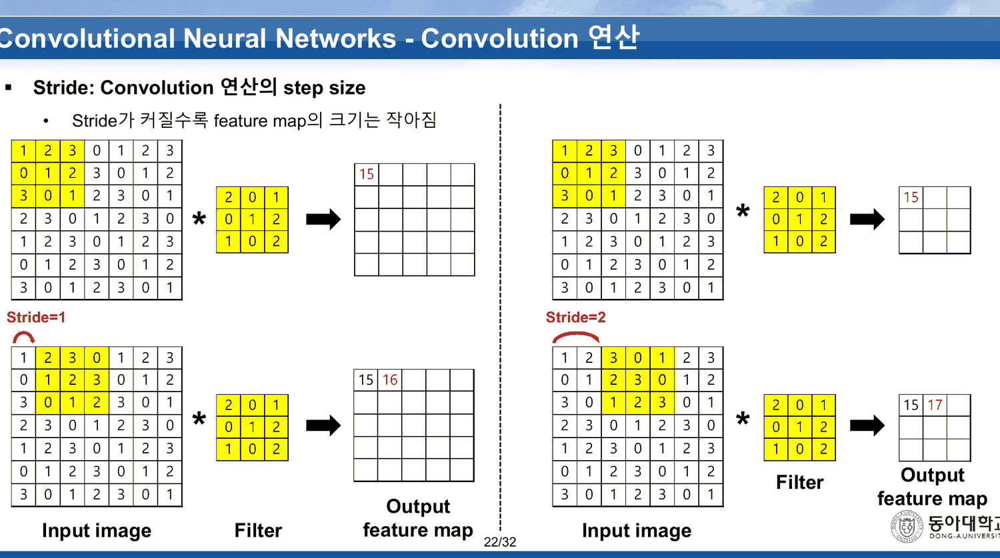
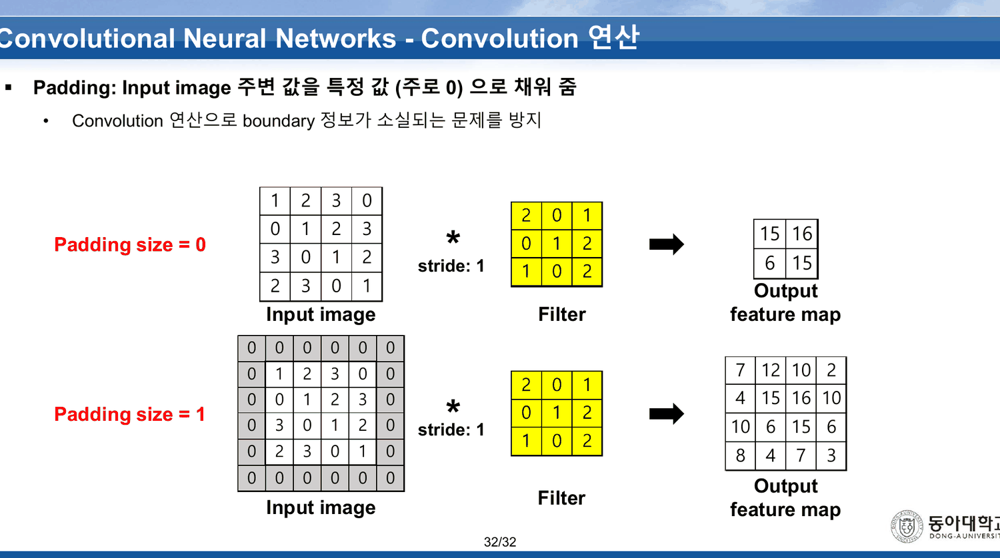
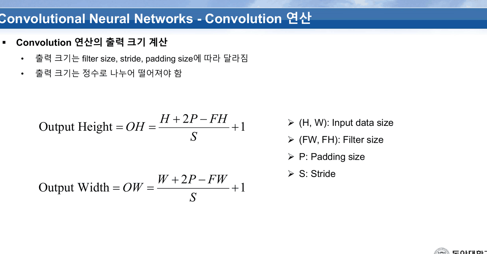
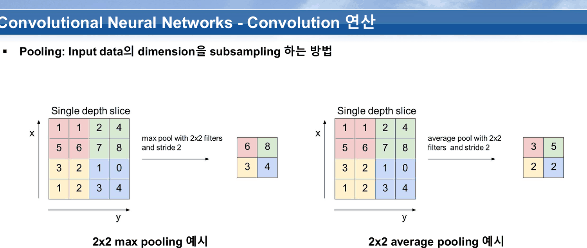
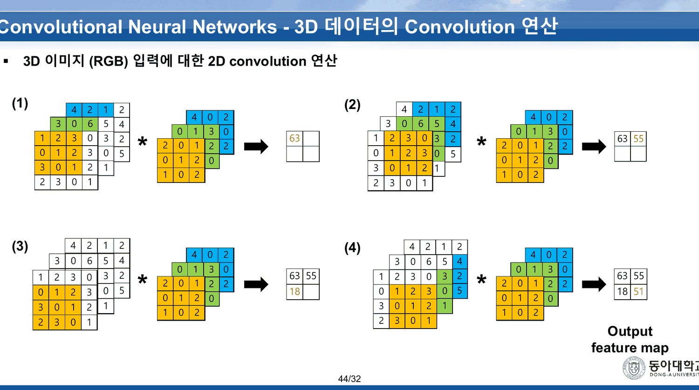
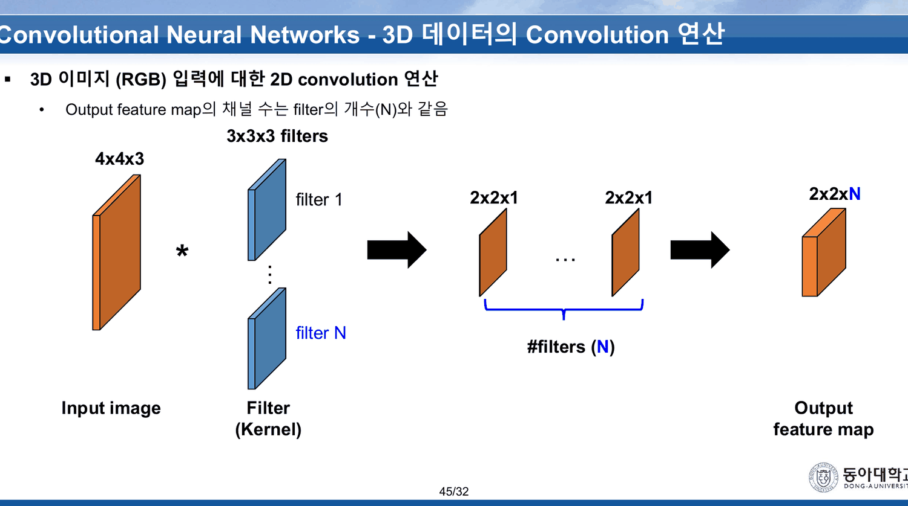
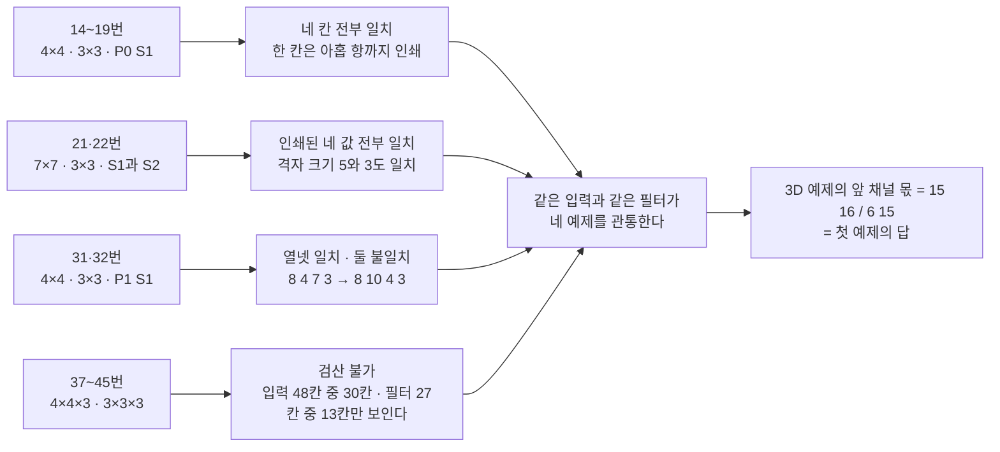

[15. 같은 불평이 세 이름으로 세 번 나온다](<./15. 같은 불평이 세 이름으로 세 번 나온다.md>)가 읽은 앞 스무 장에는 곱셈이 하나도 없다. 14번부터 스물다섯 장이 그것을 갚는다.

이 구간은 이 과목에서 드문 종류의 구간이다 — **덱이 숫자를 끝까지 적고, 독자가 그것을 종이 위에서 확인할 수 있다.** 그래서 확인해 보았다. 네 개의 수치 예제 가운데 둘은 전부 맞고, 하나는 두 칸이 틀리며, 하나는 확인이 **원리적으로 불가능**하게 그려져 있다.

---

## 14~19번 — 열두 칸이 전부 맞는 첫 예제

같은 입력과 같은 필터가 이 절 전체를 관통한다.

| 입력 (4×4×1) | 필터 (3×3×1) |
| --- | --- |
| `1 2 3 0` / `0 1 2 3` / `3 0 1 2` / `2 3 0 1` | `2 0 1` / `0 1 2` / `1 0 2` |

15번이 규칙 한 줄을 붙인다 — **「입력 이미지와 필터의 채널은 같아야 함」.** 16번이 첫 칸을 아홉 항으로 풀어 쓴다.

> Output = 1×2 + 2×0 + 3×1 + 0×0 + 1×1 + 2×2 + 3×1 + 0×0 + 1×2 = **15**

17·18번이 창을 네 자리로 옮기며 `15` → `15 16` → `15 16 / 6` → `15 16 / 6 15` 를 채우고, 19번이 완성된 2×2 를 보여 준다. 네 칸 모두 재계산과 일치한다.

여기서 우연 하나가 눈에 띈다. **좌상단과 우하단이 둘 다 15다.** 입력의 대각선이 `1 1 1 1` 로 같은 값의 되풀이이고 창이 대각선으로 두 칸 움직였을 때 같은 3×3 부분행렬이 걸리기 때문인데, 덱은 이 되풀이를 지적하지 않는다. 21~22번의 7×7 예제에서 이 성질이 훨씬 크게 드러난다.

20번은 본문 97자에 그림뿐인 장이다. `Output feature map` 과 `Input image` 라는 두 이름표만 적혀 있고 애니메이션 프레임이 들어 있다.

---

## 21~30번 — 스트라이드, 그리고 같은 이야기를 두 번 하는 열 장

21·22번은 앞의 4×4 를 **7×7 로 늘려 같은 필터를 댄다.**



7×7 입력은 `1 2 3 0 1 2 3` 로 시작하는 주기 4 의 패턴이다. 그래서 출력도 주기적이 된다.

| | 슬라이드에 인쇄된 값 | 재계산 |
| --- | --- | --- |
| Stride 1 | 첫 줄 `15` · `15 16` (5×5 격자에 두 칸만 채워짐) | `15 16 17 6 15` / `6 15 16 17 6` / `17 6 15 16 17` / `16 17 6 15 16` / `15 16 17 6 15` |
| Stride 2 | 첫 줄 `15` · `15 17` (3×3 격자) | `15 17 15` / `17 15 17` / `15 17 15` |

**인쇄된 네 값 모두 정확하다.** 그리고 격자 크기도 맞다 — $(7-3)/1+1 = 5$, $(7-3)/2+1 = 3$.

재계산이 드러내는 것은 덱이 적지 않은 사실이다. **스트라이드 1 의 5×5 출력에는 값이 네 종류(15·16·17·6)뿐이고, 스트라이드 2 는 그중 두 종류(15·17)만 뽑아 간다.** 스트라이드 2 가 버리는 것은 6 — 유일하게 작은 값이다. 「Stride가 커질수록 feature map의 크기는 작아짐」이라는 21번의 한 줄은 크기만 말하고, **무엇이 버려지는지는 말하지 않는다.**

23~30번 여덟 장이 같은 이야기를 cs231n 슬라이드로 한 번 더 한다.

| 장 | 인쇄된 것 |
| --- | --- |
| 23~26번 | `7x7 input (spatially)` / `assume 3x3 filter` — 네 장의 추출 텍스트가 197자로 **완전히 동일**하다 |
| 27번 | `=> 5x5 output` 이 더해진다 |
| 28·29번 | `assume 3x3 filter applied with stride 2` — 두 장이 215자로 동일 |
| 30번 | `=> 3x3 output!` |

여덟 장 가운데 새 글자가 들어오는 장은 **27번과 30번 둘뿐**이다. 나머지 여섯 장은 애니메이션 프레임이고, 그 애니메이션은 21·22번이 이미 정적으로 보여 준 것이다. 같은 일이 이 과목의 `Backpropagation` 25~32번에서도 있었다([06. 곱셈 게이트의 국소 기울기는 상대방의 값이다](<./06. 곱셈 게이트의 국소 기울기는 상대방의 값이다.md>)) — 여덟 장이 48자로 고정되어 있었다.

---

## 31·32번 — 마지막 줄의 두 칸

패딩 절은 두 장이다. 31번이 패딩 0 의 결과(`15 16 / 6 15`)를 다시 보여 주고, 32번이 그 아래에 패딩 1 의 결과를 붙인다.



슬라이드가 인쇄한 4×4 출력은 이렇다.

| | | | |
| ---: | ---: | ---: | ---: |
| 7 | 12 | 10 | 2 |
| 4 | 15 | 16 | 10 |
| 10 | 6 | 15 | 6 |
| **8** | **4** | **7** | **3** |

앞의 세 줄 열두 칸은 전부 맞는다. 마지막 줄이 틀린다.

```html preview
<div id="pad" style="font-family:system-ui,-apple-system,sans-serif;color:var(--foreground);background:var(--card);border:1px solid var(--border);border-radius:12px;padding:18px 16px;">
  <p style="margin:0 0 14px;font-size:13px;color:var(--muted-foreground);line-height:1.75;">
    32번 슬라이드의 <b>입력 4×4</b>와 <b>필터 3×3</b>을 그대로 넣고 패딩 1 · 스트라이드 1 로 다시 계산한다.
    칸을 누르면 그 칸의 아홉 항이 펼쳐진다.</p>
  <div style="display:flex;gap:26px;flex-wrap:wrap;align-items:flex-start;">
    <div>
      <div style="font-size:11.5px;color:var(--muted-foreground);margin-bottom:5px;">슬라이드가 인쇄한 출력</div>
      <svg id="pg" viewBox="0 0 200 200" style="width:200px;height:200px;display:block;cursor:pointer;"></svg>
      <div style="margin-top:8px;font-size:11.5px;line-height:1.7;">
        <span style="display:inline-block;width:10px;height:10px;background:var(--chart-1);opacity:.35;border-radius:2px;"></span> 재계산과 일치 &nbsp;
        <span style="display:inline-block;width:10px;height:10px;background:var(--chart-2);opacity:.7;border-radius:2px;"></span> 불일치
      </div>
    </div>
    <div style="flex:1;min-width:250px;">
      <div id="pd" style="font-size:13px;line-height:1.95;font-variant-numeric:tabular-nums;"></div>
    </div>
  </div>
  <div id="ps" style="margin-top:14px;font-size:13.5px;line-height:1.95;"></div>
</div>
<script>
(function(){
  const NS='http://www.w3.org/2000/svg', svg=document.getElementById('pg');
  const el=(t,a,x)=>{const e=document.createElementNS(NS,t);for(const k in a)e.setAttribute(k,a[k]);
    if(x!==undefined)e.textContent=x;return e;};
  const X=[[1,2,3,0],[0,1,2,3],[3,0,1,2],[2,3,0,1]];          // 31·32번 입력
  const F=[[2,0,1],[0,1,2],[1,0,2]];                           // 31·32번 필터
  const SLIDE=[[7,12,10,2],[4,15,16,10],[10,6,15,6],[8,4,7,3]];// 32번이 인쇄한 출력
  const P=[]; for(let i=0;i<6;i++){P.push([]);for(let j=0;j<6;j++)
    P[i].push((i>=1&&i<=4&&j>=1&&j<=4)?X[i-1][j-1]:0);}
  const terms=(r,c)=>{const t=[];for(let a=0;a<3;a++)for(let b=0;b<3;b++)
    t.push({v:P[r+a][c+b],w:F[a][b]});return t;};
  const calc=(r,c)=>terms(r,c).reduce((s,t)=>s+t.v*t.w,0);
  const CELL=48, O=4;
  let bad=0;
  for(let r=0;r<4;r++)for(let c=0;c<4;c++){
    const v=calc(r,c), ok=v===SLIDE[r][c]; if(!ok)bad++;
    const g=el('g',{});
    g.appendChild(el('rect',{x:O+c*CELL,y:O+r*CELL,width:CELL-2,height:CELL-2,rx:4,
      fill:ok?'var(--chart-1)':'var(--chart-2)',opacity:ok?0.35:0.7,
      stroke:'var(--border)','stroke-width':1}));
    g.appendChild(el('text',{x:O+c*CELL+(CELL-2)/2,y:O+r*CELL+(CELL-2)/2+6,'text-anchor':'middle',
      'font-size':17,'font-weight':700,fill:'var(--foreground)'},String(SLIDE[r][c])));
    g.addEventListener('click',()=>show(r,c));
    svg.appendChild(g);
  }
  function show(r,c){
    const t=terms(r,c), v=calc(r,c), s=SLIDE[r][c];
    document.getElementById('pd').innerHTML =
      '<b>'+(r+1)+'행 '+(c+1)+'열</b><br>'+
      t.map(x=>x.v+'×'+x.w).join(' + ')+'<br>= <b style="font-size:15px;">'+v+'</b>'+
      (v===s?' &nbsp;— 슬라이드와 같다 ('+s+')'
            :' &nbsp;— 슬라이드는 <b style="color:var(--chart-2);">'+s+'</b> 이라 인쇄했다');
  }
  show(3,1);
  document.getElementById('ps').innerHTML =
    '열여섯 칸 중 <b>'+(16-bad)+'칸이 일치</b>하고 <b style="color:var(--chart-2);">'+bad+'칸이 어긋난다.</b> '+
    '어긋난 칸은 둘 다 <b>마지막 줄</b>에 있다.<br>'+
    '<span style="color:var(--muted-foreground);font-size:12.5px;">'+
    '재계산한 마지막 줄은 <b>8 10 4 3</b> 이고 슬라이드는 <b>8 4 7 3</b> 이다. '+
    '슬라이드의 둘째 칸 4 는 재계산의 <b>셋째</b> 칸 값이고, 셋째 칸 7 은 이 출력의 <b>첫 칸</b>(1행 1열) 값이다.</span>';
})();
</script>
```

마지막 줄만 따로 손으로 적으면 이렇다. 패딩된 6×6 의 아래 세 줄은 `0 3 0 1 2 0` / `0 2 3 0 1 0` / `0 0 0 0 0 0` 이다.

| 칸 | 창 | 계산 | 재계산 | 슬라이드 |
| --- | --- | --- | ---: | ---: |
| 4행 1열 | `0 3 0` / `0 2 3` / `0 0 0` | $3{\cdot}0+2{\cdot}1+3{\cdot}2$ | **8** | 8 ✓ |
| 4행 2열 | `3 0 1` / `2 3 0` / `0 0 0` | $3{\cdot}2+1{\cdot}1+3{\cdot}1$ | **10** | 4 ✗ |
| 4행 3열 | `0 1 2` / `3 0 1` / `0 0 0` | $2{\cdot}1+1{\cdot}2$ | **4** | 7 ✗ |
| 4행 4열 | `1 2 0` / `0 1 0` / `0 0 0` | $1{\cdot}2+1{\cdot}1$ | **3** | 3 ✓ |

> [!warning] 원본 오류 — 32번 패딩 출력의 마지막 줄
> 인쇄된 `8 4 7 3` 의 정답은 `8 10 4 3` 이다. 네 칸 중 양 끝은 맞고 가운데 둘이 틀렸다. 흥미로운 것은 **슬라이드의 `4` 가 정답의 셋째 칸 값**이라는 점이다 — 한 칸 당겨 쓴 흔적처럼 보이지만, 그렇다면 넷째 칸이 3 이 아니라 다른 값이어야 하므로 단순한 밀림은 아니다. 남은 `7` 은 이 출력의 1행 1열 값과 같다.
>
> 이 한 줄은 이 덱에서 끝나지 않는다. 같은 슬라이드가 `CNN (실습).pdf` 10번에 **오류째 복사되어** 다시 인쇄된다([23. LeNet-5의 가중치 95퍼센트는 합성곱 바깥에 있다](<./23. LeNet-5의 가중치 95퍼센트는 합성곱 바깥에 있다.md>)).

31번과 32번은 둘 다 왼쪽에 **`Padding size = 0`** 이라 적는다. 32번의 아래쪽 블록만 `Padding size = 1` 이므로, 슬라이드 한 장 안에 0 과 1 이 동시에 있는 것이 정상이다. 다만 **31번에는 패딩 1 블록이 없는데도 「Padding: Input image 주변 값을 특정 값으로 채워 줌」이라는 제목이 붙어 있어**, 31번만 보면 패딩을 설명하면서 패딩하지 않은 결과를 보여 주는 장이 된다.

---

## 33·34·35번 — 꼬리표가 넘어가고, 공식이 나오고, 평균이 잘린다

33번부터 꼬리표가 **`33/32`** 가 된다. 분자가 분모를 넘어서는 첫 장이고, 여기서부터 마지막 74번까지 마흔두 장이 같은 상태로 간다.

34번이 이 덱에서 유일한 공식을 준다.



$$OH = \frac{H + 2P - FH}{S} + 1, \qquad OW = \frac{W + 2P - FW}{S} + 1$$

공식은 정확하고, 이 덱의 모든 예제가 이것을 만족한다 — 4×4·3×3·P0·S1 → 2, 7×7·3×3·S1 → 5, 7×7·3×3·S2 → 3, 4×4·3×3·P1·S1 → 4. 둘째 줄 「출력 크기는 정수로 나누어 떨어져야 함」도 맞는 경고다.

한 가지 작은 어긋남이 있다. 범례가 `(H, W): Input data size` 로 **높이를 먼저** 쓰고, 바로 아래 `(FW, FH): Filter size` 로 **너비를 먼저** 쓴다. 한 장 안에서 순서 관례가 뒤집힌다. 수식 자체는 $OH$ 에 $FH$, $OW$ 에 $FW$ 를 정확히 짝지으므로 계산에는 영향이 없다.

35번이 풀링을 넣는다. 제목은 한 줄 — 「Pooling: Input data의 dimension을 subsampling 하는 방법」.



왼쪽 맥스 풀링은 cs231n 의 그림 그대로이고 `6 8 / 3 4` 가 정확하다. 오른쪽 평균 풀링은 같은 그림을 고쳐 만든 것인데, 네 칸 중 둘이 정수가 아니다.

| 2×2 블록 | 값 | 참 평균 | 인쇄 |
| --- | --- | ---: | ---: |
| 좌상 | 1 1 5 6 | **3.25** | 3 |
| 우상 | 2 4 7 8 | **5.25** | 5 |
| 좌하 | 3 2 1 2 | 2 | 2 |
| 우하 | 1 0 3 4 | 2 | 2 |

반올림으로도 3 과 5 이므로 **틀린 값은 아니다.** 다만 소수점이 사라졌다는 표시가 없어서, 손으로 따라 계산한 학생은 자기가 얻은 3.25 와 슬라이드의 3 을 맞춰 볼 근거를 찾지 못한다. 이 덱에서 평균 풀링이 등장하는 것은 이 한 장뿐이고, 12주차 실습이 실제로 쓰는 풀링이 바로 이 평균 풀링이다([21. 여섯 층은 세 에폭을 ln 10 에 앉아 있다가 빠져나온다](<./21. 여섯 층은 세 에폭을 ln 10 에 앉아 있다가 빠져나온다.md>)).

풀링에 대해 이 덱이 하는 말은 여기까지다. **창 크기·스트라이드·출력 크기 공식과의 관계·역전파 — 넷 다 없다.** 역전파는 14주차 판서에서 「참고」라는 제목을 달고 나타난다([20. 열여섯 장과 열일곱 장 사이에서 덱의 주인이 바뀐다](<./20. 열여섯 장과 열일곱 장 사이에서 덱의 주인이 바뀐다.md>)).

---

## 37~45번 — 63을 셀 수 없다

36번이 목차를 네 번째로 인쇄하고, 37번이 3D 절을 연다. 37번에 15번과 같은 규칙이 다시 붙는다 — 「입력 이미지와 필터의 채널은 같아야 함」.

42~44번이 4×4×3 입력에 3×3×3 필터를 대고 `63` · `55` · `18` · `51` 을 차례로 채운다.



세 채널이 비스듬히 겹쳐 그려져 있다. 앞 채널이 뒤 채널을 가린다. 가려진 칸의 값은 어디에도 인쇄되지 않는다.

```html preview
<div id="d3" style="font-family:system-ui,-apple-system,sans-serif;color:var(--foreground);background:var(--card);border:1px solid var(--border);border-radius:12px;padding:18px 16px;">
  <p style="margin:0 0 14px;font-size:13px;color:var(--muted-foreground);line-height:1.75;">
    42~44번 그림에서 <b>실제로 읽을 수 있는 칸</b>만 칠한다. 회색은 앞 채널에 가려 값이 인쇄되지 않은 칸이다.</p>
  <svg id="ds" viewBox="0 0 640 250" style="width:100%;height:auto;display:block;"></svg>
  <div id="do" style="margin-top:10px;font-size:13.5px;line-height:1.95;"></div>
</div>
<script>
(function(){
  const NS='http://www.w3.org/2000/svg', svg=document.getElementById('ds');
  const el=(t,a,x)=>{const e=document.createElementNS(NS,t);for(const k in a)e.setAttribute(k,a[k]);
    if(x!==undefined)e.textContent=x;return e;};
  // 44번 그림에서 눈으로 읽히는 값만. null = 가려진 칸
  const CH=[
    {n:'앞 채널 (전부 보인다)',c:'var(--chart-1)',
     m:[[1,2,3,0],[0,1,2,3],[3,0,1,2],[2,3,0,1]],
     f:[[2,0,1],[0,1,2],[1,0,2]]},
    {n:'가운데 채널',c:'var(--chart-2)',
     m:[[3,0,6,5],[null,null,null,3],[null,null,null,0],[null,null,null,1]],
     f:[[0,1,3],[null,null,2],[null,null,0]]},
    {n:'뒤 채널',c:'var(--muted-foreground)',
     m:[[4,2,1,2],[null,null,null,4],[null,null,null,2],[null,null,null,5]],
     f:[[4,0,2],[null,null,0],[null,null,2]]}];
  const C=26, X0=24, Y0=46, GAPX=206;
  let visM=0, visF=0;
  CH.forEach((ch,k)=>{
    const bx=X0+k*GAPX;
    svg.appendChild(el('text',{x:bx,y:26,'font-size':12,fill:ch.c,'font-weight':700},ch.n));
    svg.appendChild(el('text',{x:bx,y:Y0-8,'font-size':10.5,fill:'var(--muted-foreground)'},'입력 4×4'));
    for(let i=0;i<4;i++)for(let j=0;j<4;j++){
      const v=ch.m[i][j], seen=v!==null; if(seen)visM++;
      svg.appendChild(el('rect',{x:bx+j*C,y:Y0+i*C,width:C-2,height:C-2,rx:3,
        fill:seen?ch.c:'var(--border)',opacity:seen?0.4:0.5,stroke:'var(--border)'}));
      if(seen)svg.appendChild(el('text',{x:bx+j*C+(C-2)/2,y:Y0+i*C+(C-2)/2+5,'text-anchor':'middle',
        'font-size':12.5,fill:'var(--foreground)','font-weight':600},String(v)));
    }
    const fy=Y0+4*C+26;
    svg.appendChild(el('text',{x:bx,y:fy-8,'font-size':10.5,fill:'var(--muted-foreground)'},'필터 3×3'));
    for(let i=0;i<3;i++)for(let j=0;j<3;j++){
      const v=ch.f[i][j], seen=v!==null; if(seen)visF++;
      svg.appendChild(el('rect',{x:bx+j*C,y:fy+i*C,width:C-2,height:C-2,rx:3,
        fill:seen?ch.c:'var(--border)',opacity:seen?0.4:0.5,stroke:'var(--border)'}));
      if(seen)svg.appendChild(el('text',{x:bx+j*C+(C-2)/2,y:fy+i*C+(C-2)/2+5,'text-anchor':'middle',
        'font-size':12.5,fill:'var(--foreground)','font-weight':600},String(v)));
    }
  });
  // 앞 채널의 몫 = 14~19번 예제 그 자체
  const X=CH[0].m, F=CH[0].f;
  const front=[0,1].map(r=>[0,1].map(c=>{let s=0;
    for(let a=0;a<3;a++)for(let b=0;b<3;b++)s+=X[r+a][c+b]*F[a][b];return s;}));
  const OUT=[[63,55],[18,51]];
  document.getElementById('do').innerHTML =
    '입력 48칸 중 값이 읽히는 것은 <b>'+visM+'칸</b>, 필터 27칸 중 <b>'+visF+'칸</b>이다. '+
    '나머지 <b>'+(48-visM+27-visF)+'칸</b>은 그림 어디에도 없다.<br>'+
    '앞 채널만으로 계산하면 <b>'+front[0].join(' · ')+' / '+front[1].join(' · ')+'</b> — '+
    '14~19번 예제의 답 그대로다.<br>'+
    '<span style="color:var(--muted-foreground);font-size:12.5px;">'+
    '인쇄된 출력 '+OUT[0].join(' · ')+' / '+OUT[1].join(' · ')+' 에서 앞 채널의 몫을 빼면 '+
    '<b>'+(OUT[0][0]-front[0][0])+' · '+(OUT[0][1]-front[0][1])+' · '+
    (OUT[1][0]-front[1][0])+' · '+(OUT[1][1]-front[1][1])+
    '</b> 가 남는다. 이 넷은 보이지 않는 두 채널이 낸 값이고, 미지수가 '+(48-visM+27-visF)+'개라 되찾을 수 없다.</span>';
})();
</script>
```

앞 채널의 4×4 는 14~19번의 입력과 **글자 하나까지 같고**, 앞 채널의 필터도 `2 0 1 / 0 1 2 / 1 0 2` 로 같다. 그러니 앞 채널의 몫은 앞 절의 답 `15 16 / 6 15` 다. 인쇄된 `63 55 / 18 51` 에서 그것을 빼면 `48 39 / 12 36` 이 남고, 그 넷은 서른네 개의 보이지 않는 값이 만든 것이다.

> [!note] 이것은 오류가 아니다 — 그러나 검산을 막는다
> 세 채널을 비스듬히 겹쳐 그리는 것은 표준적인 3D 표현이고, 덱이 잘못 계산했다는 증거는 없다. 다만 **수치 예제의 목적이 독자가 따라 계산하는 것**이라면, 값의 4분의 1 도 보이지 않는 예제는 그 목적을 달성하지 못한다. 앞 절이 열두 칸을 한 항씩 적어 준 뒤에 나오는 장이라 대비가 더 크다.
>
> 확인할 수 있는 것은 하나 있다. **앞 채널의 몫이 앞 예제의 답과 정확히 같다**는 것 — 덱이 예제를 새로 만들지 않고 2D 예제를 첫 채널로 재사용했다는 뜻이다.

45번이 이 절을 닫으며 형상 규칙을 한 줄로 못 박는다 — 「Output feature map의 채널 수는 filter의 개수(N)와 같음」. 11번이 서른네 장 앞에서 `filter 1 … filter 32` 로 이미 그린 그림이고, 여기서는 `filter 1 … filter N` 으로 일반화된다.



---

## 네 예제의 검산 가능성



---

## 근거 자료

`CNN (이론).pdf` 74쪽 중 **21~45번**(14~20번은 같은 예제의 앞부분이라 함께 읽었다).

- 14~19번 — 입력 `1 2 3 0 / 0 1 2 3 / 3 0 1 2 / 2 3 0 1`, 필터 `2 0 1 / 0 1 2 / 1 0 2`, 출력 `15 16 / 6 15`, 16번의 아홉 항 전개
- 21·22번 — 7×7 입력, 스트라이드 1 의 `15` · `16`, 스트라이드 2 의 `15` · `17`
- 23~30번 — cs231n `7x7 input` / `=> 5x5 output` / `=> 3x3 output!`. 23~26번 추출 텍스트 197자 동일, 28·29번 215자 동일
- 31·32번 — 패딩 1 출력 `7 12 10 2 / 4 15 16 10 / 10 6 15 6 / 8 4 7 3`
- 33번 — 꼬리표가 `33/32` 로 넘어간다
- 34번 — 출력 크기 공식과 네 줄 범례
- 35번 — 2×2 맥스 풀링 `6 8 / 3 4`, 2×2 평균 풀링 `3 5 / 2 2`, 원본 슬라이스 `1 1 2 4 / 5 6 7 8 / 3 2 1 0 / 1 2 3 4`
- 37~45번 — 4×4×3 · 3×3×3 · 출력 `63 55 / 18 51`, 45번의 형상 규칙

모든 합성곱 값은 파이썬(정수 연산)으로 재계산해 인쇄된 값과 한 칸씩 대조했다. 인터랙티브 두 개는 슬라이드에 인쇄된 입력·필터·출력 행렬만 데이터로 갖고, 나머지는 그 자리에서 계산한다.

---

## 이어지는 문서

- [15. 같은 불평이 세 이름으로 세 번 나온다](<./15. 같은 불평이 세 이름으로 세 번 나온다.md>) — 같은 덱 1~20번. 이 계산들이 시작되기 전 스무 장
- [17. 슬라이드 10이 약속한 절약을 슬라이드 63이 취소한다](<./17. 슬라이드 10이 약속한 절약을 슬라이드 63이 취소한다.md>) — 같은 덱 46~74번. 35번의 풀링이 왜 필요했는지가 거기서 드러난다
- [23. LeNet-5의 가중치 95퍼센트는 합성곱 바깥에 있다](<./23. LeNet-5의 가중치 95퍼센트는 합성곱 바깥에 있다.md>) — 11주차 실습 10번이 32번의 패딩 오류를 그대로 복사한다
- [21. 여섯 층은 세 에폭을 ln 10 에 앉아 있다가 빠져나온다](<./21. 여섯 층은 세 에폭을 ln 10 에 앉아 있다가 빠져나온다.md>) — 12주차 실습이 35번의 평균 풀링을 실제로 쓴다
- [20. 열여섯 장과 열일곱 장 사이에서 덱의 주인이 바뀐다](<./20. 열여섯 장과 열일곱 장 사이에서 덱의 주인이 바뀐다.md>) — 14주차 판서. 35번이 넘긴 풀링 역전파가 「참고」라는 제목으로 나타난다
