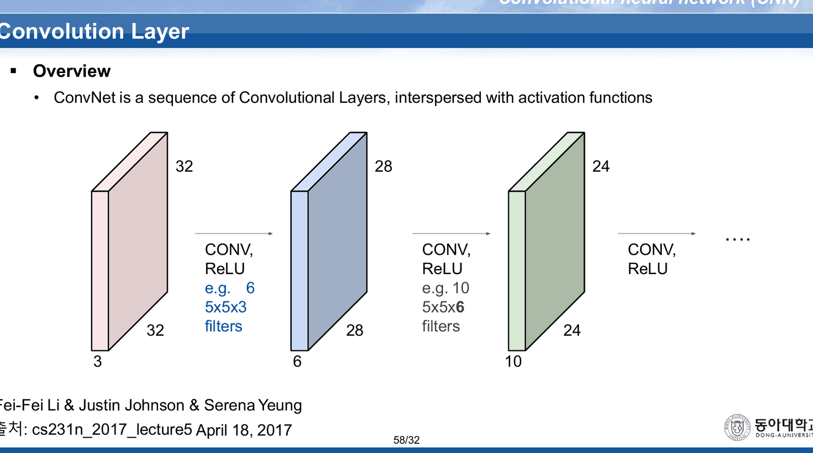
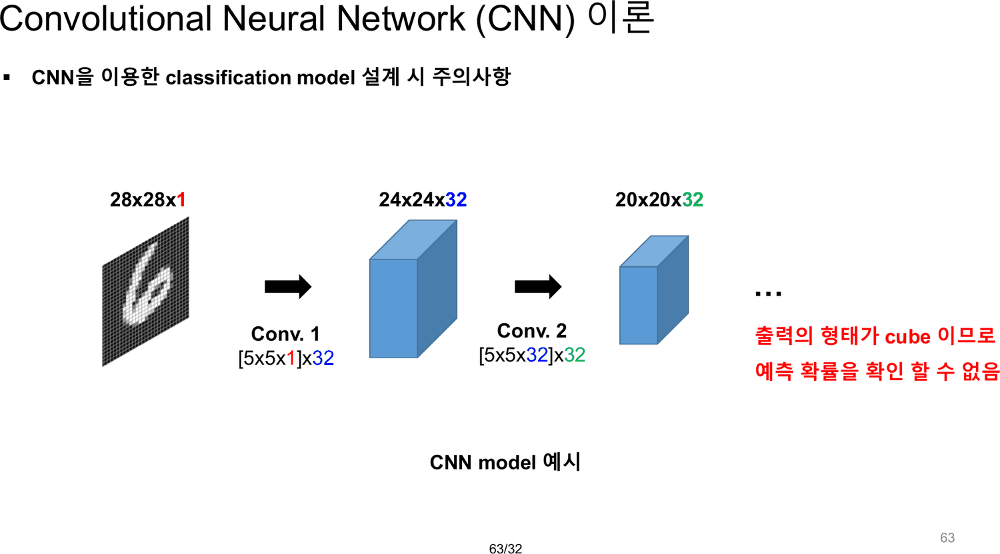
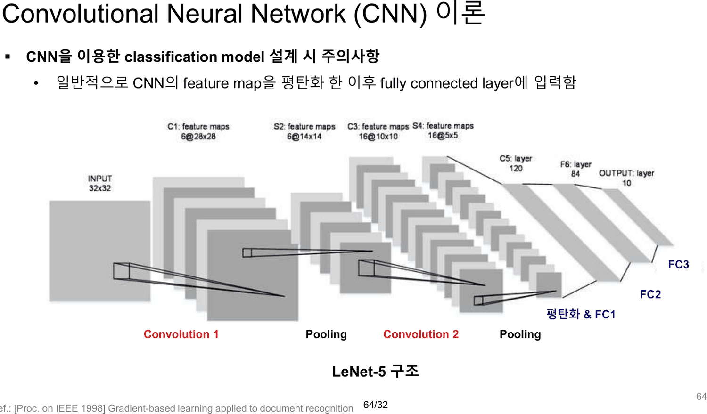
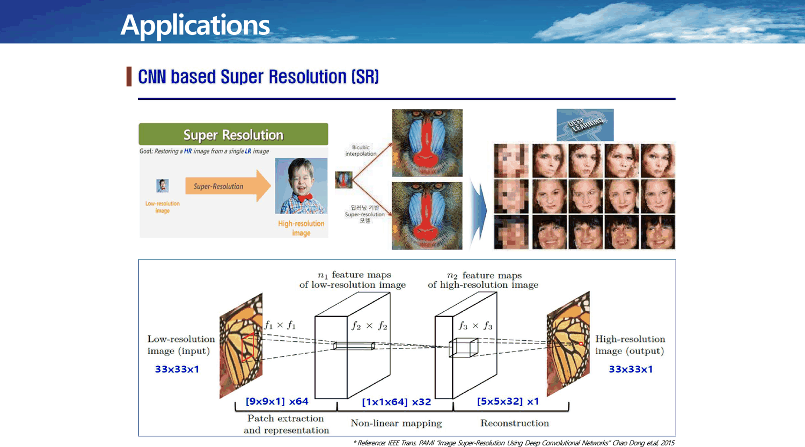
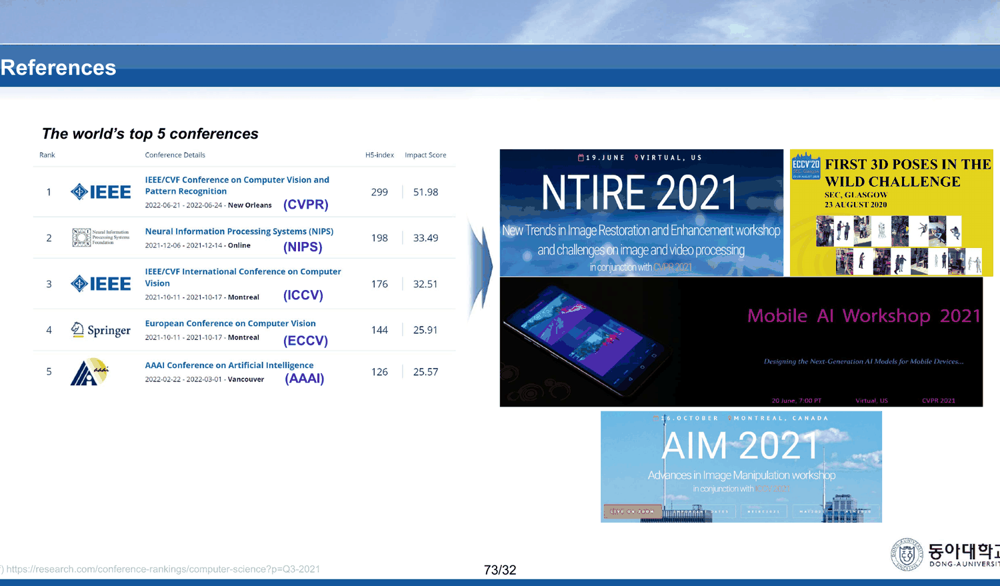
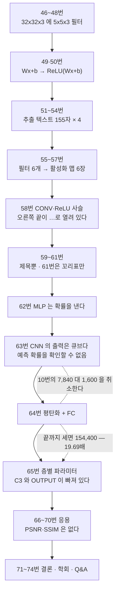

이 덱의 목차는 세 항목이고 45번에서 끝난다. 46번부터 스물아홉 장은 이름표가 없다([15. 같은 불평이 세 이름으로 세 번 나온다](<./15. 같은 불평이 세 이름으로 세 번 나온다.md>)).

그런데 이 덱에서 가장 중요한 문장은 그 이름 없는 구간에 있다.

> **출력의 형태가 cube 이므로 예측 확률을 확인 할 수 없음** — 63번

10번이 한 약속을 취소하는 문장이다.

---

## 46~58번 — 「One number」를 여섯 번 말한다

열세 장이 전부 cs231n 슬라이드다. 장마다 `Fei-Fei Li & Justin Johnson & Serena Yeung` / `cs231n_2017_lecture5 April 18, 2017` 이 박혀 있다.

| 장 | 더해지는 것 | 추출 텍스트 |
| --- | --- | --- |
| 46 | `32x32x3 image -> preserve spatial structure` | 188자 |
| 47 | `5x5x3 filter` 가 나타난다 | 199자 |
| 48 | `Filters always extend the full depth of the input volume` | 221자 |
| 49 | `Wx+b` | 162자 |
| 50 | `Wx+b → ReLU(Wx+b)` · `One number!` | 184자 |
| 51·52·53·54 | `One number = ReLU(Wx+b)` — 네 장의 추출 텍스트가 **155자로 완전히 같다** | 155자 ×4 |
| 55 | `convolve (slide) over all spatial locations` · `activation map 28×28×1` | 191자 |
| 56 | `Consider a second, green filter` | 242자 |
| 57 | `if we had 6 5x5x3 filters, we'll get 6 separate activation maps` | 233자 |
| 58 | `ConvNet is a sequence of Convolutional Layers, interspersed with activation functions` | 285자 |

51~54번 네 장은 필터가 이미지 위를 움직이는 애니메이션이다. 정지 화면으로는 **같은 글자 155자가 네 번** 인쇄된다.

48번의 한 줄은 이 덱에서 채널 규칙을 가장 정확하게 말한 문장이다 — 필터는 언제나 입력의 깊이 전체를 덮는다. 15·37번의 「입력 이미지와 필터의 채널은 같아야 함」과 같은 말인데, 이쪽이 왜 그런지를 담고 있다.

그리고 50번이 이 덱에서 **활성화 함수가 등장하는 유일한 자리**다.

> `Wx+b` → `ReLU(Wx+b)`

`ReLU` 라는 글자는 50~58번에만 나오고, 앞 45장과 59~74번에는 한 번도 없다. 합성곱 뒤에 비선형이 붙어야 한다는 사실을 이 덱은 **빌려 온 슬라이드로만** 말한다.

58번이 사슬을 그린다.



| 단계 | 형상 | 필터 | 가중치 (재계산) |
| --- | --- | --- | ---: |
| 입력 | 32×32×3 | | |
| CONV, ReLU | 28×28×6 | `e.g. 6` `5x5x3` | 450 |
| CONV, ReLU | 24×24×10 | `e.g. 10` `5x5x6` | 1,500 |
| … | | | |

형상은 정확하다($32-5+1=28$, $28-5+1=24$). 그리고 이 사슬은 **끝나지 않는다** — 오른쪽 끝이 `….` 로 열려 있다. 분류로 가는 길은 그려지지 않는다.

---

## 59~61번 — 제목만 있는 세 장

| 장 | 추출 텍스트 전부 |
| --- | --- |
| 59 | `Convolution` (17자) |
| 60 | `Example of graphical CNN representation` · `CNN trains the multiple filters (Kernel).` (78자) |
| 61 | `61/32` (5자) |

61번에는 **꼬리표 말고는 글자가 하나도 없다.** 60번의 한 줄 — 「CNN trains the multiple filters (Kernel).」 — 은 이 덱이 학습에 대해 하는 유일한 말이다. 필터가 학습된다는 사실이 74장 가운데 **이 한 문장**에 있고, 어떻게 학습되는지는 14주차 판서까지 미뤄진다([20. 열여섯 장과 열일곱 장 사이에서 덱의 주인이 바뀐다](<./20. 열여섯 장과 열일곱 장 사이에서 덱의 주인이 바뀐다.md>)).

---

## 62~64번 — 취소

62번이 MLP 를 다시 꺼낸다. `784x1` → `10x1`, 그리고 「Output node의 값이 숫자 예측 확률을 나타냄」.

63번이 CNN 을 옆에 놓는다.



| | |
| --- | --- |
| 입력 | 28×28×1 |
| Conv. 1 | `[5x5x1]x32` → 24×24×32 |
| Conv. 2 | `[5x5x32]x32` → 20×20×32 |
| 붙은 문장 | **출력의 형태가 cube 이므로 예측 확률을 확인 할 수 없음** |

64번이 답을 준다 — 「일반적으로 CNN의 feature map을 평탄화 한 이후 fully connected layer에 입력함」. 그리고 LeNet-5 구조를 그린다.



여기서 10번으로 돌아가야 한다. 10번의 왼쪽은 **28×28 MNIST 에 대한 `784x10` FC 층**이었고 `#weights: 7,840` 이었다. 63번의 CNN 도 **28×28×1 입력**이다. 같은 데이터에 대한 두 설계를 처음으로 끝까지 비교할 수 있다.

```html preview
<div id="rev" style="font-family:system-ui,-apple-system,sans-serif;color:var(--foreground);background:var(--card);border:1px solid var(--border);border-radius:12px;padding:18px 16px;">
  <p style="margin:0 0 12px;font-size:13px;color:var(--muted-foreground);line-height:1.75;">
    10번의 <code>784x10</code> 과 63번의 두 합성곱 층을, 둘 다 <b>28×28×1 입력에서 10개의 예측</b>까지 끌고 간다.
    64번이 요구한 평탄화와 FC를 붙이는 순간 어느 쪽이 큰지가 뒤집힌다.</p>
  <div style="margin:10px 0 14px;">
    <label style="font-size:12.5px;color:var(--muted-foreground);">어디까지 세는가 &nbsp;</label>
    <select id="st" style="font-size:13px;padding:3px 6px;border:1px solid var(--border);border-radius:6px;background:var(--card);color:var(--foreground);">
      <option value="0">10번이 센 곳까지 — 합성곱 층 하나</option>
      <option value="1">63번이 그린 곳까지 — 합성곱 두 층</option>
      <option value="2">64번이 요구한 곳까지 — 평탄화 + FC</option>
    </select>
  </div>
  <svg id="rs" viewBox="0 0 640 176" style="width:100%;height:auto;display:block;"></svg>
  <div id="ro" style="margin-top:10px;font-size:13.5px;line-height:1.95;"></div>
</div>
<script>
(function(){
  const NS='http://www.w3.org/2000/svg', svg=document.getElementById('rs');
  const el=(t,a,x)=>{const e=document.createElementNS(NS,t);for(const k in a)e.setAttribute(k,a[k]);
    if(x!==undefined)e.textContent=x;return e;};
  const FC=784*10;                       // 10번 슬라이드: #weights 7,840
  const C1=5*5*1*32, C2=5*5*32*32;       // 63번 슬라이드: [5x5x1]x32, [5x5x32]x32
  const FLAT=20*20*32, HEAD=FLAT*10;     // 63번의 20x20x32 를 64번이 요구한 대로 평탄화
  const STAGE=[
    {cnn:[{n:'Conv 1 [5x5x1]x32',v:C1,c:'var(--chart-1)'}],
     note:'10번이 <code>[5x5x1]x64</code> 로 센 것과 같은 방식이다. 합성곱 한 층의 커널만 센다.'},
    {cnn:[{n:'Conv 1 [5x5x1]x32',v:C1,c:'var(--chart-1)'},
          {n:'Conv 2 [5x5x32]x32',v:C2,c:'var(--chart-1)'}],
     note:'63번이 실제로 그린 두 층이다. 아직 예측이 없다 — 출력은 20×20×32 = '+(20*20*32).toLocaleString()+' 개의 값이다.'},
    {cnn:[{n:'Conv 1 [5x5x1]x32',v:C1,c:'var(--chart-1)'},
          {n:'Conv 2 [5x5x32]x32',v:C2,c:'var(--chart-1)'},
          {n:'평탄화 12,800 → FC 10',v:HEAD,c:'var(--chart-2)'}],
     note:'64번의 「평탄화 한 이후 fully connected layer에 입력함」을 그대로 따른 결과다.'}];
  const L=210,R=520,T=44,H=30;
  function draw(k){
    while(svg.firstChild) svg.removeChild(svg.firstChild);
    const rows=[{n:'10번 FC layer 784x10',v:FC,c:'var(--muted-foreground)'}].concat(STAGE[k].cnn);
    const cnnTot=STAGE[k].cnn.reduce((s,r)=>s+r.v,0);
    const max=Math.max(FC,cnnTot);
    rows.forEach((r,i)=>{
      const y=T+i*H;
      svg.appendChild(el('text',{x:L-10,y:y+13,'text-anchor':'end','font-size':11.5,
        fill:r.c,'font-weight':700},r.n));
      svg.appendChild(el('rect',{x:L,y:y,width:Math.max(2,(R-L)*r.v/max),height:18,rx:3,
        fill:r.c,opacity:0.85}));
      svg.appendChild(el('text',{x:R+12,y:y+14,'font-size':12.5,fill:'var(--foreground)',
        'font-variant-numeric':'tabular-nums'},r.v.toLocaleString()));
    });
    svg.appendChild(el('text',{x:L-10,y:20,'text-anchor':'end','font-size':11.5,
      fill:'var(--muted-foreground)','font-weight':700},'가중치 개수'));
    const ratio=cnnTot/FC;
    svg.appendChild(el('text',{x:L,y:T+rows.length*H+22,'font-size':13,
      fill:ratio>1?'var(--chart-2)':'var(--chart-1)','font-weight':700},
      'CNN 합계 '+cnnTot.toLocaleString()+' — FC 7,840 의 '+ratio.toFixed(2)+'배'));
    document.getElementById('ro').innerHTML = STAGE[k].note +
      '<br><span style="color:var(--muted-foreground);font-size:12.5px;">'+
      (ratio<1 ? '이 단계에서는 10번의 주장이 성립한다.'
               : '이 단계에서는 10번의 주장이 <b>뒤집힌다</b>. 그리고 이것이 63·64번이 요구한 단계다.')+
      '</span>';
  }
  document.getElementById('st').addEventListener('change',e=>draw(+e.target.value));
  draw(0);
})();
</script>
```

끝까지 세면 이렇다.

| 층 | 가중치 |
| --- | ---: |
| Conv 1 `[5x5x1]x32` | 800 |
| Conv 2 `[5x5x32]x32` | 25,600 |
| 평탄화 20×20×32 = 12,800 → 출력 10 | **128,000** |
| **합계** | **154,400** |

$154{,}400 / 7{,}840 = 19.69$.

> [!warning] 10번의 주장이 이 덱 안에서 뒤집힌다
> 10번은 「CNN에 비해 필요한 weight parameter의 개수가 많음」이라며 FC 를 비난하고 7,840 을 적었다. 63·64번이 요구한 대로 CNN 을 완성하면 **154,400** 이 된다 — 비난받은 쪽의 **19.69배**다.
>
> 원인은 분명하다. 합성곱은 가중치를 아끼지만 **공간을 줄이지 않으면 뒤따르는 FC 가 그 절약을 다 먹는다.** 63번의 두 층은 28×28 을 20×20 으로만 줄이고 채널을 32배로 늘려, 평탄화 지점의 값이 784 에서 12,800 으로 **16.3배** 늘어난다.
>
> 이것을 막는 장치가 바로 풀링이고, 덱은 35번에서 풀링을 한 장 보여 준 뒤 63번 예시에는 **넣지 않았다.** 64번이 그리는 LeNet-5 에는 Pooling 이 두 번 들어 있다.

---

## 65번 — 처음으로 제대로 세는 장, 그리고 빠진 줄

65번이 LeNet-5 의 층별 파라미터를 식과 함께 적는다. 이 덱에서 파라미터를 바이어스까지 포함해 세는 유일한 장이다.

| 줄 | 인쇄된 식 | 값 | 재계산 |
| --- | --- | ---: | --- |
| **C1** | (5\*5\*1 + 1)\*6 | 156 | ✓ |
| **S2** | (1 + 1)\*6 | 12 | ✓ |
| **S4** | (1 + 1)\*16 | 32 | ✓ |
| **C5** | (5\*5\*16 + 1)\*120 | 48,120 | ✓ |
| **F6** | (120 + 1)\*84 | 10,164 | ✓ |

다섯 값 모두 정확하다. 합이 58,484 다.

그런데 **S2 와 S4 사이에 C3 가 없다.** LeNet-5 의 층 이름은 C1 · S2 · C3 · S4 · C5 · F6 · OUTPUT 인데, 이 슬라이드는 C3 와 OUTPUT 두 줄을 건너뛴다. 이름이 `S2 → S4` 로 건너뛰는 것이 그 자체로 증거다 — 빠진 것이 없었다면 번호가 3 에서 4 로 이어졌을 것이다.

```html preview
<div id="ln" style="font-family:system-ui,-apple-system,sans-serif;color:var(--foreground);background:var(--card);border:1px solid var(--border);border-radius:12px;padding:18px 16px;">
  <p style="margin:0 0 14px;font-size:13px;color:var(--muted-foreground);line-height:1.75;">
    65번 슬라이드가 인쇄한 다섯 줄을 층 이름 순서대로 늘어놓는다. 빈 칸은 슬라이드에 <b>없는</b> 줄이다.</p>
  <svg id="ls" viewBox="0 0 640 250" style="width:100%;height:auto;display:block;"></svg>
  <div id="lo" style="margin-top:10px;font-size:13.5px;line-height:1.95;"></div>
</div>
<script>
(function(){
  const NS='http://www.w3.org/2000/svg', svg=document.getElementById('ls');
  const el=(t,a,x)=>{const e=document.createElementNS(NS,t);for(const k in a)e.setAttribute(k,a[k]);
    if(x!==undefined)e.textContent=x;return e;};
  const ROWS=[
    {n:'C1', f:'(5*5*1 + 1)*6',      v:156,   on:true},
    {n:'S2', f:'(1 + 1)*6',          v:12,    on:true},
    {n:'C3', f:'',                    v:null,  on:false},
    {n:'S4', f:'(1 + 1)*16',         v:32,    on:true},
    {n:'C5', f:'(5*5*16 + 1)*120',   v:48120, on:true},
    {n:'F6', f:'(120 + 1)*84',       v:10164, on:true},
    {n:'OUTPUT', f:'',                v:null,  on:false}];
  const L=24,BAR=250,T=30,H=31;
  const shown=ROWS.filter(r=>r.on), tot=shown.reduce((s,r)=>s+r.v,0);
  const max=Math.max(...shown.map(r=>r.v));
  ROWS.forEach((r,i)=>{
    const y=T+i*H;
    svg.appendChild(el('text',{x:L,y:y+14,'font-size':13,'font-weight':700,
      fill:r.on?'var(--chart-1)':'var(--chart-2)'},r.n));
    if(r.on){
      svg.appendChild(el('text',{x:L+62,y:y+14,'font-size':11.5,
        fill:'var(--muted-foreground)','font-family':'ui-monospace,monospace'},r.f));
      const w=Math.max(2,BAR*Math.log10(r.v+1)/Math.log10(max+1));
      svg.appendChild(el('rect',{x:L+250,y:y+2,width:w,height:16,rx:3,fill:'var(--chart-1)',opacity:0.8}));
      svg.appendChild(el('text',{x:L+250+w+8,y:y+14,'font-size':12.5,fill:'var(--foreground)',
        'font-variant-numeric':'tabular-nums','font-weight':600},r.v.toLocaleString()));
    } else {
      svg.appendChild(el('rect',{x:L+62,y:y+1,width:BAR+120,height:18,rx:4,fill:'none',
        stroke:'var(--chart-2)','stroke-width':1.3,'stroke-dasharray':'5 4'}));
      svg.appendChild(el('text',{x:L+72,y:y+14,'font-size':11.5,fill:'var(--chart-2)'},
        '슬라이드에 이 줄이 없다'));
    }
  });
  svg.appendChild(el('line',{x1:L,y1:T+7*H-4,x2:620,y2:T+7*H-4,stroke:'var(--border)'}));
  svg.appendChild(el('text',{x:L,y:T+7*H+16,'font-size':12.5,fill:'var(--muted-foreground)'},
    '인쇄된 다섯 줄의 합 ' + tot.toLocaleString() + ' — 막대는 로그 눈금'));
  document.getElementById('lo').innerHTML =
    '인쇄된 다섯 줄은 전부 재계산과 일치한다. 빠진 것은 <b>C3</b> 와 <b>OUTPUT</b> 두 줄이다.<br>'+
    '<span style="color:var(--muted-foreground);font-size:12.5px;">'+
    '이름이 <b>S2 에서 S4 로 건너뛴다</b>는 것이 누락의 증거다. 그리고 C5 한 줄이 인쇄된 합의 '+
    (48120/tot*100).toFixed(1)+'% 를 차지한다 — 이 장은 합성곱망의 무게가 어디에 쏠리는지를 '+
    '이 덱에서 유일하게 숫자로 보여 준다.</span>';
})();
</script>
```

빠진 C3 는 다음 주 덱에서 **한 장을 통째로 차지한다.** `CNN 주요설계모듈(이론).pdf` 10번의 제목이 `LeNet-5 C3` 이고, 꼬리표가 `10/21` 로 이 덱과도 그 덱과도 맞지 않는다([18. 열 장 중 여덟 장이 지난주 덱 그대로다](<./18. 열 장 중 여덟 장이 지난주 덱 그대로다.md>)). 이 과목에서 슬라이드가 덱 사이를 옮겨 다닐 때 남는 흔적을 또 하나 본다.

65번의 인쇄된 합 58,484 가운데 **C5 한 줄이 48,120** — 82.3% 다. C5 는 5×5×16 을 120 개로 받는 층, 즉 **평탄화 직전의 완전 연결에 가까운 층**이다. 63번이 못 한 말을 65번이 숫자로 한다.

---

## 66~74번 — 응용, 그리고 갚히지 않은 지표

66~70번이 응용 다섯 장이다. 67번에 출처가 붙어 있다.



> `IEEE Trans. PAMI "Image Super-Resolution Using Deep Convolutional Networks" Chao Dong et.al, 2015`

68·69·70번은 추출 텍스트가 `Applications` 한 단어(14자)뿐이다. 세 장의 이미지가 무엇을 보여 주는지 설명하는 글자가 없다.

[01. 빌려 온 그림이 양쪽을 다 찌른다](<./01. 빌려 온 그림이 양쪽을 다 찌른다.md>)가 넘긴 빚이 여기서 갚힐 자리였다. 그 노트가 읽은 이 과목 모든 덱의 2번 공통 지도에는 `PSNR` · `SSIM` · `Total Memory` 세 지표가 적혀 있고, 초해상도는 그 지표들이 쓰이는 대표적인 분야다. **그런데 66~70번 다섯 장에 그 세 글자는 한 번도 나오지 않는다.** 11번이 초해상도를 「이미지를 입력으로 받는 분야」의 예로 들고, 67번이 논문을 인용하고, 지표는 끝내 없다.

71·72번이 결론이다. 72번의 본문은 두 줄이다.

> `Artificial Neural Network (ANN) → Deep Neural Network (DNN)`
> `Convolution Neural Network (CNN)`

73번이 학회 다섯 곳을 적는다.



> The world's top 5 conferences — (CVPR) · (NIPS) · (ICCV) · (ECCV) · (AAAI)
> `Ref) https://research.com/conference-rankings/computer-science?p=Q3-2021`

다음 주 덱이 인용하는 논문들의 출처가 여기 예고된다 — ResNet과 DenseNet과 SENet이 전부 CVPR 이다([19. 파란 상자는 다섯이라 쓰고 표에는 넷이 있다](<./19. 파란 상자는 다섯이라 쓰고 표에는 넷이 있다.md>)). 74번은 Q&A 다.

---

## 이 구간의 지도



---

## 근거 자료

`CNN (이론).pdf` 74쪽 중 **46~74번**.

- 46~58번 — cs231n 열세 장. 51~54번 추출 텍스트 155자 동일. 50번 `ReLU(Wx+b)`, 48번 `Filters always extend the full depth of the input volume`
- 58번 — `32 → 28 → 24`, `e.g. 6 5x5x3 filters` · `e.g. 10 5x5x6 filters`
- 59~61번 — `Convolution` (17자) · `CNN trains the multiple filters (Kernel).` (78자) · `61/32` (5자)
- 62번 — `784x1` · `10x1` · 「Output node의 값이 숫자 예측 확률을 나타냄」
- 63번 — `28x28x1` · `[5x5x1]x32` · `24x24x32` · `[5x5x32]x32` · `20x20x32` · 「출력의 형태가 cube 이므로 예측 확률을 확인 할 수 없음」
- 64번 — 「평탄화 한 이후 fully connected layer에 입력함」, LeNet-5 그림(Convolution 1 · Pooling · Convolution 2 · Pooling · 평탄화&FC1 · FC2 · FC3)
- 65번 — C1 156 · S2 12 · S4 32 · C5 48,120 · F6 10,164
- 67번 — `IEEE Trans. PAMI, Chao Dong et.al, 2015`
- 68~70번 — `Applications` 14자
- 72번 — ANN → DNN → CNN
- 73번 — CVPR · NIPS · ICCV · ECCV · AAAI

파라미터 수는 전부 파이썬 정수 연산으로 재계산했다. 65번의 다섯 값은 슬라이드의 식과 값이 모두 일치했고, 63·64번에서 끌어낸 154,400 은 63번이 인쇄한 형상(`20x20x32`)과 64번이 요구한 절차(평탄화 → FC)만으로 유도한 것이다. 10번의 7,840 은 그 슬라이드에 인쇄된 값 그대로다.

---

## 이어지는 문서

- [16. 검산되는 예제와 검산할 수 없는 예제](<./16. 검산되는 예제와 검산할 수 없는 예제.md>) — 같은 덱 21~45번. 63번이 쓰지 않은 풀링이 35번에 있다
- [18. 열 장 중 여덟 장이 지난주 덱 그대로다](<./18. 열 장 중 여덟 장이 지난주 덱 그대로다.md>) — 12주차 이론. 이 구간의 여덟 장이 일주일 만에 되돌아오고, 65번이 건너뛴 C3 가 한 장을 얻는다
- [21. 여섯 층은 세 에폭을 ln 10 에 앉아 있다가 빠져나온다](<./21. 여섯 층은 세 에폭을 ln 10 에 앉아 있다가 빠져나온다.md>) — 12주차 실습. 풀링 셋이 평탄화 지점을 4×4 로 묶어 이 폭발을 막는다
- [23. LeNet-5의 가중치 95퍼센트는 합성곱 바깥에 있다](<./23. LeNet-5의 가중치 95퍼센트는 합성곱 바깥에 있다.md>) — 65번의 C5 가 82.3% 를 차지하는 이유가 실습에서 반복된다
- [24. 시험은 합성곱을 묻지 않는다](<./24. 시험은 합성곱을 묻지 않는다.md>) — 10번의 주장이 중간고사와 12주차 실습 사이에서 처음으로 검증된다
