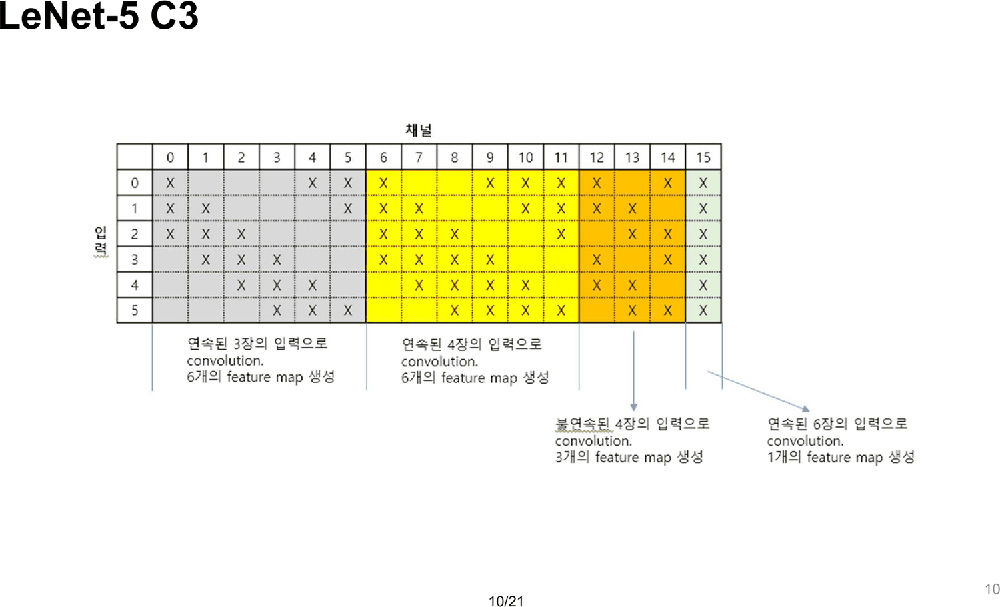
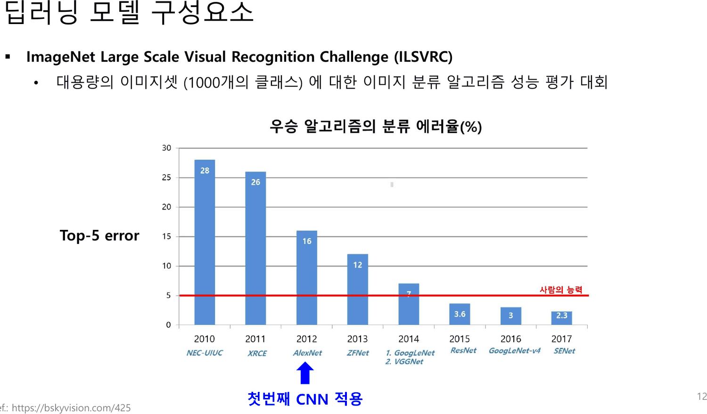
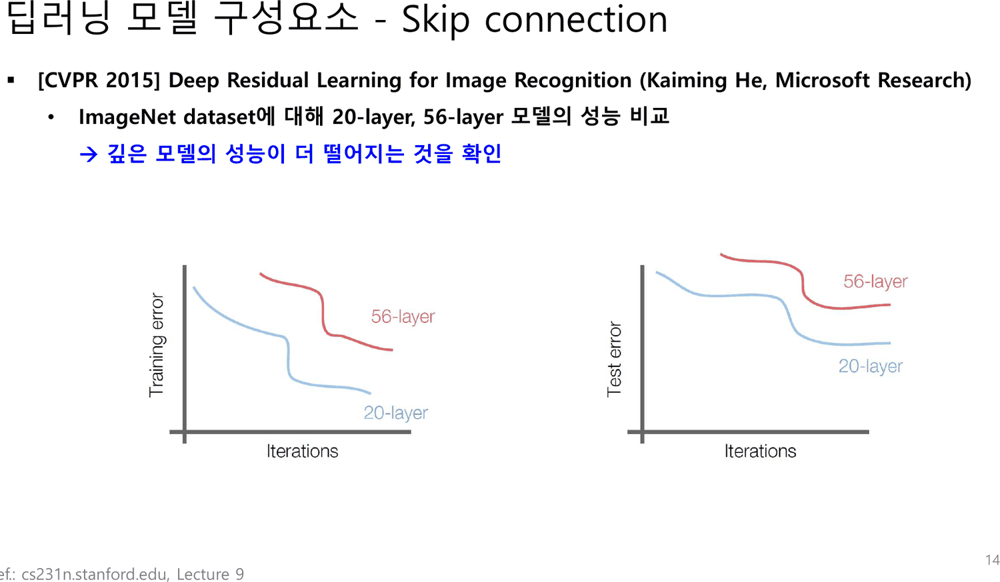
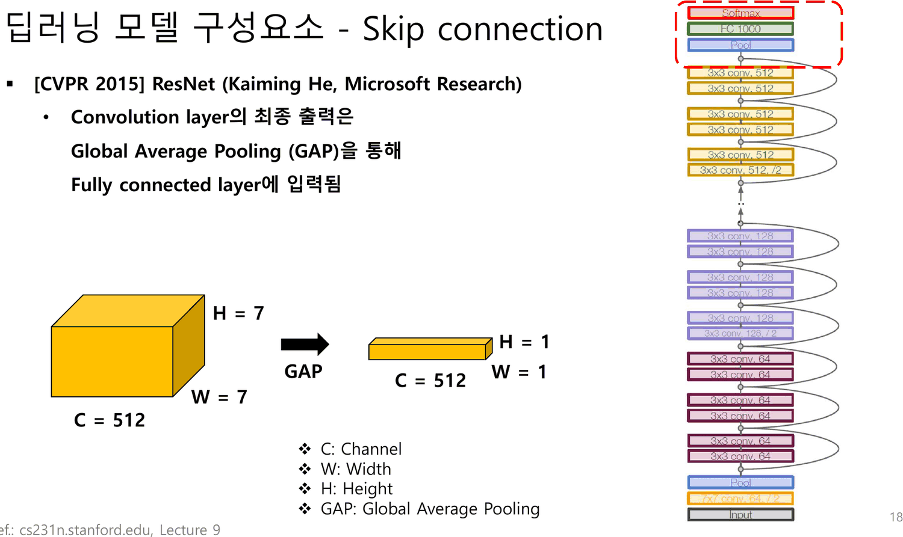
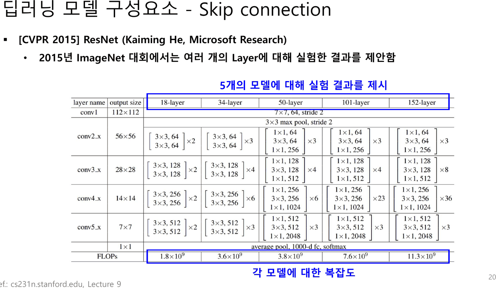
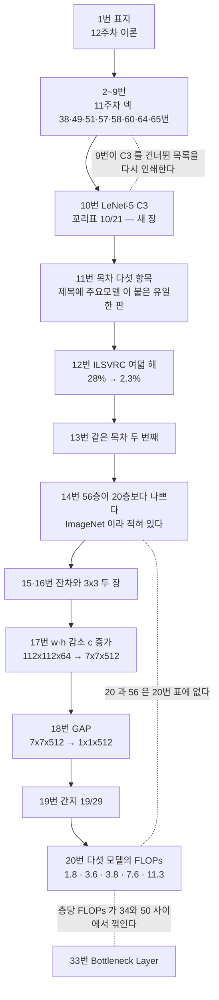

12주차 덱의 표지에는 `12주차 이론 (CNN 주요설계모듈)` 이라고만 적혀 있다. 이 과목의 다른 모든 덱이 쓰는 `Dong-A Univ. (ISPL)` 표지가 아니다.

그 다음 장부터 여덟 장이 **11주차 덱에서 그대로 온 것**이다.

---

## 2~9번 — 옮겨 온 여덟 장

추출 텍스트를 글자 단위로 대조하면 이렇게 맞는다.

| 12주차 | 11주차 `CNN (이론).pdf` | 내용 |
| ---: | ---: | --- |
| 2번 | **38번** | 4x4x3 · 3x3x3 · 2x2x1 |
| 3번 | **49번** | `32x32x3 image` · `5x5x3 filter` · `Wx+b` |
| 4번 | **51번**(52번과도 동일) | `One number = ReLU(Wx+b)` |
| 5번 | **57번** | `if we had 6 5x5x3 filters, we'll get 6 separate activation maps` |
| 6번 | **58번** | CONV·ReLU 사슬 `32 → 28 → 24` |
| 7번 | **60번** | `CNN trains the multiple filters (Kernel).` |
| 8번 | **64번** | 「평탄화 한 이후 fully connected layer에 입력함」 · LeNet-5 그림 |
| 9번 | **65번** | C1 156 · S2 12 · S4 32 · C5 48,120 · F6 10,164 |

여덟 장 모두 꼬리표만 새로 매겨졌고 본문은 한 글자도 바뀌지 않았다. [17. 슬라이드 10이 약속한 절약을 슬라이드 63이 취소한다](<./17. 슬라이드 10이 약속한 절약을 슬라이드 63이 취소한다.md>)가 읽은 46~65번 스무 장 가운데 여덟 장이 일주일 만에 되돌아온 셈이다.

되돌아온 여덟 장의 성격이 하나로 모인다. **전부 「합성곱이 무엇인가」에 속하고, 「합성곱을 어떻게 설계하는가」에는 하나도 속하지 않는다.** 12주차의 주제인 스킵 연결·덴스 연결·채널 어텐션·병목은 11번부터 시작한다. 앞 아홉 장은 복습이고, 복습이라는 표시는 어디에도 없다 — `Review` 라는 글자가 이 덱에 없다. (두 주 뒤 14주차 덱은 그 글자를 두 장에 걸쳐 크게 적는다. [20. 열여섯 장과 열일곱 장 사이에서 덱의 주인이 바뀐다](<./20. 열여섯 장과 열일곱 장 사이에서 덱의 주인이 바뀐다.md>))

---

## 10번 — 지난주가 건너뛴 줄

앞 열 장에서 새 장은 **10번 하나**다.



제목이 `LeNet-5 C3` 이고 꼬리표가 **`10/21`** 이다. 이 덱은 36장이고 다른 장의 분모는 없거나 29인데, 이 한 장만 21이다.

그리고 이 장이 채우는 것이 정확히 **지난주 65번의 빈 줄**이다. 65번은 C1 · S2 · **S4** · C5 · F6 다섯 줄을 적었고 C3 를 건너뛰었다([17. 슬라이드 10이 약속한 절약을 슬라이드 63이 취소한다](<./17. 슬라이드 10이 약속한 절약을 슬라이드 63이 취소한다.md>)). 그 바로 앞 장인 9번이 65번을 그대로 다시 인쇄하고, 그 다음 장이 빠진 줄 하나를 위해 통째로 쓰인다.

세 가지가 동시에 맞아떨어진다.

- 9번 = 지난주 65번 = **C3 가 빠진 목록**
- 10번 = 새 장 = **C3 하나만 다루는 장**
- 10번의 꼬리표 `10/21` = **두 덱 어느 쪽 분모도 아니다**

세 번째가 이 장의 출처를 말한다. 분모 21 을 달고 다니는 덱이 이 과목에 하나 있다 — **`CNN (실습).pdf`** 다. 27장인데 모든 꼬리표가 `n/21` 이고, 그 덱의 **5번**이 여기 10번과 같은 `LeNet-5 C3` 장이다([23. LeNet-5의 가중치 95퍼센트는 합성곱 바깥에 있다](<./23. LeNet-5의 가중치 95퍼센트는 합성곱 바깥에 있다.md>)). 옮겨 오면서 분자만 10 으로 고쳐졌다.

이 과목에서 같은 흔적을 남긴 장이 이미 셋 있었다 — `2/39` · `32/12` · `12/14`([15. 같은 불평이 세 이름으로 세 번 나온다](<./15. 같은 불평이 세 이름으로 세 번 나온다.md>)). 이것이 넷째이고, **출처 덱을 특정할 수 있는 첫 사례**다.

> [!note] 왜 C3 만 따로 설명해야 하는가
> LeNet-5 에서 C3 는 S2 의 여섯 장 특성맵을 **전부** 받지 않는다. 열여섯 장의 출력 각각이 여섯 장 가운데 일부만 골라 받는 부분 연결 층이다. 그래서 65번의 식 「(가중치\*입력맵개수 + 바이어스)\*특성맵개수」가 C3 에는 그대로 적용되지 않는다 — 입력맵 개수가 출력마다 다르기 때문이다.
>
> 65번이 C3 를 건너뛴 이유가 그것이라면 합리적인 생략이다. 다만 **덱은 그 이유를 적지 않았고**, 다음 주 10번도 왜 이 층만 따로 그리는지 한 줄도 쓰지 않는다. 남는 것은 제목 `LeNet-5 C3` 와 그림뿐이다. (이 문단의 설명은 원본에 없는 보충이다.)

---

## 11·13번 — 다섯 항목짜리 목차가 여섯 번

11번이 이 덱의 진짜 시작이다.

> **딥러닝 주요모델 구성요소**
> · Skip connection (ResNet, 2015)
> · Dense connection (DenseNet, 2017)
> · Channel attention (SENet, 2018)
> · Bottleneck Layer
> · 구성요소 적용 예시

같은 다섯 줄이 13 · 21 · 27 · 32 · 34번에 다시 인쇄된다. **여섯 번**이다. 그리고 제목이 11번에서만 `딥러닝 **주요모델** 구성요소` 이고 나머지 다섯 번은 `딥러닝 모델 구성요소` 다 — 첫 인쇄 뒤 한 글자가 빠진 채로 굳었다.

목차의 다섯 항목 가운데 넷은 괄호 안에 연도가 있고 하나(`Bottleneck Layer`)는 없다. 연도가 없는 그 항목이, 나중에 보면, **이 덱에서 숫자가 가장 많고 전부 검산되는 절**이다([19. 파란 상자는 다섯이라 쓰고 표에는 넷이 있다](<./19. 파란 상자는 다섯이라 쓰고 표에는 넷이 있다.md>)).

---

## 12번 — 여덟 해의 막대



```html preview
<div id="il" style="font-family:system-ui,-apple-system,sans-serif;color:var(--foreground);background:var(--card);border:1px solid var(--border);border-radius:12px;padding:18px 16px;">
  <p style="margin:0 0 14px;font-size:13px;color:var(--muted-foreground);line-height:1.75;">
    12번 막대그래프에 인쇄된 여덟 해의 Top-5 에러율을 그대로 옮긴다. 붉은 선은 슬라이드의 <b>「사람의 능력」 5%</b> 선이다.
    막대를 누르면 전년 대비 변화가 나온다.</p>
  <svg id="is" viewBox="0 0 640 250" style="width:100%;height:auto;display:block;cursor:pointer;"></svg>
  <div id="io" style="margin-top:10px;font-size:13.5px;line-height:1.95;min-height:3.2em;"></div>
</div>
<script>
(function(){
  const NS='http://www.w3.org/2000/svg', svg=document.getElementById('is'), out=document.getElementById('io');
  const el=(t,a,x)=>{const e=document.createElementNS(NS,t);for(const k in a)e.setAttribute(k,a[k]);
    if(x!==undefined)e.textContent=x;return e;};
  // 12번 슬라이드에 인쇄된 값 그대로
  const D=[{y:2010,v:28, n:'NEC-UIUC'},{y:2011,v:26,n:'XRCE'},{y:2012,v:16,n:'AlexNet'},
           {y:2013,v:12, n:'ZFNet'},   {y:2014,v:7, n:'GoogLeNet / VGGNet'},
           {y:2015,v:3.6,n:'ResNet'},  {y:2016,v:3, n:'GoogLeNet-v4'},{y:2017,v:2.3,n:'SENet'}];
  const HUMAN=5;
  const L=44,R=616,T=18,B=192, BW=(R-L)/D.length;
  const sy=v=>B-v/30*(B-T);
  [0,5,10,15,20,25,30].forEach(g=>{
    svg.appendChild(el('line',{x1:L,y1:sy(g),x2:R,y2:sy(g),stroke:'var(--border)',opacity:0.6}));
    svg.appendChild(el('text',{x:L-8,y:sy(g)+4,'text-anchor':'end','font-size':10,
      fill:'var(--muted-foreground)'},String(g)));
  });
  D.forEach((d,i)=>{
    const x=L+i*BW+BW*0.18, w=BW*0.64;
    const g=el('g',{});
    g.appendChild(el('rect',{x:x,y:sy(d.v),width:w,height:B-sy(d.v),rx:3,
      fill:d.v<HUMAN?'var(--chart-1)':'var(--chart-2)',opacity:0.8}));
    g.appendChild(el('text',{x:x+w/2,y:sy(d.v)-5,'text-anchor':'middle','font-size':11,
      fill:'var(--foreground)','font-weight':700},String(d.v)));
    g.appendChild(el('text',{x:x+w/2,y:B+15,'text-anchor':'middle','font-size':10,
      fill:'var(--muted-foreground)'},String(d.y)));
    g.addEventListener('click',()=>{
      const p=i?D[i-1]:null;
      out.innerHTML='<b>'+d.y+' · '+d.n+'</b> — Top-5 에러율 <b>'+d.v+'%</b>'+
        (p?'<br>전년('+p.v+'%) 대비 <b>'+(d.v-p.v).toFixed(1)+'pp</b>, 비로는 '+(d.v/p.v).toFixed(3)+'배'
           :'<br>이 그래프의 첫 해다.')+
        (d.v<HUMAN?'<br><span style="color:var(--chart-1);">슬라이드가 그린 사람 기준선 5% 아래다.</span>':'');
    });
    svg.appendChild(g);
  });
  svg.appendChild(el('line',{x1:L,y1:sy(HUMAN),x2:R,y2:sy(HUMAN),stroke:'var(--chart-2)','stroke-width':2}));
  svg.appendChild(el('text',{x:R,y:sy(HUMAN)-6,'text-anchor':'end','font-size':11,
    fill:'var(--chart-2)','font-weight':700},'사람의 능력 5%'));
  svg.appendChild(el('text',{x:L,y:B+38,'font-size':12,fill:'var(--muted-foreground)'},
    '2012년 AlexNet — 슬라이드의 화살표: 첫번째 CNN 적용'));
  svg.appendChild(el('text',{x:L,y:B+56,'font-size':12,fill:'var(--muted-foreground)'},
    '2012년 이후 여섯 해 동안 28% → 2.3% — 12.17배'));
  out.innerHTML='<span style="color:var(--muted-foreground);">막대를 눌러 해를 고른다. '+
    '2011→2012 한 해가 10pp 를 떨어뜨렸고, 그 뒤 다섯 해가 합쳐서 13.7pp 를 떨어뜨렸다.</span>';
})();
</script>
```

슬라이드는 2012년 AlexNet 에 화살표와 「첫번째 CNN 적용」을 붙인다. 그 뒤로 이 덱이 다룰 세 기법이 연표 위에 정확히 놓인다 — **2015년 ResNet**(14~20번), **2017년 DenseNet**(22~26번, 표에는 없다), **2017년 SENet**(28~31번, 표에는 2017년 우승자로 있다).

하나가 어긋난다. 목차와 28번은 SENet 을 **`[CVPR 2018]`** 로 적는데, 이 막대그래프는 SENet 을 **2017년 우승자**로 놓는다. 둘 다 맞다 — 대회는 2017년이고 논문 게재는 2018년이다. 덱은 그 구분을 하지 않고, 같은 규칙을 ResNet 에는 적용하지 않는다(아래).

---

## 14~18번 — 스킵 연결

14번이 문제를 제시한다.



> **[CVPR 2015] Deep Residual Learning for Image Recognition (Kaiming He, Microsoft Research)**
> · ImageNet dataset에 대해 20-layer, 56-layer 모델의 성능 비교
> → 깊은 모델의 성능이 더 떨어지는 것을 확인

두 그래프의 축은 `Training error` · `Test error` 대 `Iterations` 이고, **데이터셋 이름은 그림 안에 없다.** 본문이 `ImageNet` 이라 적는다.

그런데 여섯 장 뒤 20번이 이 논문의 ImageNet 모델 목록을 인쇄하는데, 거기에는 **20층도 56층도 없다.** 다섯 모델이 18 · 34 · 50 · 101 · 152 층이다.

> [!warning] 덱 안에서 어긋나는 두 장
> 14번은 「ImageNet dataset에 대해 20-layer, 56-layer」라고 적고, 20번은 같은 논문의 ImageNet 모델을 18 · 34 · 50 · 101 · 152 로 인쇄한다. 20 과 56 은 그 목록에 없다.
>
> (보충 — 원본 밖의 사실) 논문에서 20층과 56층은 **CIFAR-10** 실험의 깊이다. ImageNet 실험의 깊이가 18·34·50·101·152 다. 14번의 `ImageNet dataset에 대해` 는 데이터셋을 잘못 적은 것이다.

같은 줄의 `[CVPR 2015]` 도 이 덱의 다른 표기와 어긋난다. 22번은 DenseNet 을 `[CVPR 2017]`, 28번은 SENet 을 `[CVPR 2018]` 로 적는다 — 둘 다 **게재 학회의 해**다. ResNet 은 같은 규칙이면 CVPR 2016 이 된다. 목차가 `Skip connection (ResNet, 2015)` 라 적은 arXiv 공개 연도가 학회 이름 뒤에 그대로 붙은 것으로 보인다. (게재 연도는 원본 밖의 보충이다.)

15~18번이 해법을 쌓는다.

| 장 | 인쇄된 것 |
| --- | --- |
| 15 | 「잔차 신호 (Residual)을 학습 하게 설계」 · 그림에 `잔차 신호 (Residual)` · `Skip connection` |
| 16 | 「3x3 convolution 2개, skip connection으로 구성된 Residual block 제안」 · `Inference 진행 순서` |
| 17 | 「Inference가 진행됨에 따라 feature map의 width, height은 감소 / channel은 증가」 · `7x7x512` · `112x112x64` |
| 18 | 「Convolution layer의 최종 출력은 Global Average Pooling (GAP)을 통해 Fully connected layer에 입력됨」 |

18번이 [17. 슬라이드 10이 약속한 절약을 슬라이드 63이 취소한다](<./17. 슬라이드 10이 약속한 절약을 슬라이드 63이 취소한다.md>)가 남긴 문제에 답한다.



지난주 63·64번은 20×20×32 = 12,800 을 평탄화해 FC 로 보냈고, 그 FC 하나가 128,000 개의 가중치를 먹었다. GAP 는 같은 자리에서 **공간을 통째로 평균 내 버린다** — 7×7×512 가 1×1×512 가 된다. 슬라이드의 값으로 계산하면 평탄화는 $7\times7\times512 = 25{,}088$ 개를 남기고 GAP 는 512 개를 남긴다. **49배** 차이다.

17번과 18번의 숫자도 서로 맞는다. 17번이 「width, height은 감소, channel은 증가」라며 112×112×64 → 7×7×512 를 그리는데, $112/7 = 16$ 이고 $512/64 = 8$ 이다. 값의 총 개수는 $112^2{\cdot}64 = 802{,}816$ 에서 $7^2{\cdot}512 = 25{,}088$ 로 **32분의 1** 이 된다. 공간이 256분의 1 로 줄고 채널이 8배 느는 사이에 총량이 줄어든다는 것 — 이 셈은 덱에 없다.

---

## 19·20번 — 표 하나가 답을 품고 있다

19번은 간지다. 본문이 `Skip Connection (ResNet)` 한 줄이고 꼬리표가 **`19/29`** 다. 25번(`Dense Connection`)이 `25/29`, 33번이 `33/29` 로 같은 분모를 쓴다. 이 세 장이 29장짜리 덱에서 왔다는 뜻이고, 10번의 `10/21` 과는 또 다른 출처다.

20번이 이 덱에서 가장 많은 숫자를 담은 장이다.



슬라이드는 파란 상자 둘을 그리고 그 아래 「5개의 모델에 대해 실험 결과를 제시」와 「각 모델에 대한 복잡도」를 적는다. 그리고 그 뒤에 아무 말도 하지 않는다.

```html preview
<div id="rn" style="font-family:system-ui,-apple-system,sans-serif;color:var(--foreground);background:var(--card);border:1px solid var(--border);border-radius:12px;padding:18px 16px;">
  <p style="margin:0 0 14px;font-size:13px;color:var(--muted-foreground);line-height:1.75;">
    20번 표의 <b>FLOPs 행</b>과 각 모델의 층수를 그대로 옮기고, 덱이 하지 않은 나눗셈 하나를 한다 — <b>층 하나당 FLOPs</b>.</p>
  <svg id="rs2" viewBox="0 0 640 268" style="width:100%;height:auto;display:block;"></svg>
  <div id="ro2" style="margin-top:10px;font-size:13.5px;line-height:1.95;"></div>
</div>
<script>
(function(){
  const NS='http://www.w3.org/2000/svg', svg=document.getElementById('rs2');
  const el=(t,a,x)=>{const e=document.createElementNS(NS,t);for(const k in a)e.setAttribute(k,a[k]);
    if(x!==undefined)e.textContent=x;return e;};
  // 20번 표에 인쇄된 값. block 은 표의 블록 반복 횟수(×2 · ×3 …)
  const M=[{L:18, f:1.8, b:'기본 블록 2·2·2·2'},
           {L:34, f:3.6, b:'기본 블록 3·4·6·3'},
           {L:50, f:3.8, b:'병목 블록 3·4·6·3'},
           {L:101,f:7.6, b:'병목 블록 3·4·23·3'},
           {L:152,f:11.3,b:'병목 블록 3·8·36·3'}];
  const X0=54,X1=330,T=40,H=36;
  const maxF=Math.max(...M.map(m=>m.f)), maxP=Math.max(...M.map(m=>m.f/m.L*1000));
  svg.appendChild(el('text',{x:X0,y:22,'font-size':11.5,fill:'var(--muted-foreground)','font-weight':700},'FLOPs (×10⁹) — 표에 인쇄된 값'));
  svg.appendChild(el('text',{x:X1+108,y:22,'font-size':11.5,fill:'var(--chart-2)','font-weight':700},'층 하나당 MFLOPs — 계산'));
  M.forEach((m,i)=>{
    const y=T+i*H;
    svg.appendChild(el('text',{x:X0-10,y:y+14,'text-anchor':'end','font-size':12,
      fill:'var(--foreground)','font-weight':700},m.L+'층'));
    const w=(X1-X0-70)*m.f/maxF;
    svg.appendChild(el('rect',{x:X0,y:y+1,width:w,height:17,rx:3,fill:'var(--chart-1)',opacity:0.8}));
    svg.appendChild(el('text',{x:X0+w+7,y:y+14,'font-size':11.5,fill:'var(--foreground)',
      'font-variant-numeric':'tabular-nums'},m.f.toFixed(1)));
    const p=m.f/m.L*1000, w2=(620-X1-115)*p/maxP;
    svg.appendChild(el('rect',{x:X1+108,y:y+1,width:w2,height:17,rx:3,fill:'var(--chart-2)',opacity:0.75}));
    svg.appendChild(el('text',{x:X1+108+w2+7,y:y+14,'font-size':11.5,fill:'var(--foreground)',
      'font-variant-numeric':'tabular-nums'},p.toFixed(1)));
    svg.appendChild(el('text',{x:X1-58,y:y+14,'text-anchor':'end','font-size':10.5,
      fill:'var(--muted-foreground)'},m.b));
  });
  const d=(M[2].f-M[1].f);
  svg.appendChild(el('text',{x:X0-10,y:T+5*H+22,'font-size':12.5,fill:'var(--muted-foreground)'},
    '34층 → 50층: 층 +16, FLOPs +'+d.toFixed(1)+'G ('+((d/M[1].f)*100).toFixed(1)+'%)'));
  document.getElementById('ro2').innerHTML =
    '기본 블록을 쓰는 두 모델은 층당 <b>100.0 · 105.9 MFLOPs</b>, 병목 블록을 쓰는 세 모델은 '+
    '<b>76.0 · 75.2 · 74.3 MFLOPs</b> — 경계가 34층과 50층 사이에 정확히 떨어진다.<br>'+
    '<span style="color:var(--muted-foreground);font-size:12.5px;">'+
    '그래서 34층에서 50층으로 가며 층이 열여섯 늘어도 FLOPs 는 3.6G 에서 3.8G 로 0.2G 만 는다. '+
    '이 표를 이렇게 읽는 법은 <b>열세 장 뒤 33번</b>에 있고, 덱은 두 장을 잇지 않는다.</span>';
})();
</script>
```

표의 블록 구성으로 층수를 직접 세어 보면 인쇄된 이름과 정확히 맞는다.

| 모델 | 블록 반복 | 층수 계산 | 표의 이름 |
| --- | --- | --- | --- |
| 18-layer | 2·2·2·2, 블록당 2층 | $1 + 16 + 1 = 18$ | ✓ |
| 34-layer | 3·4·6·3, 블록당 2층 | $1 + 32 + 1 = 34$ | ✓ |
| 50-layer | 3·4·6·3, 블록당 3층 | $1 + 48 + 1 = 50$ | ✓ |
| 101-layer | 3·4·23·3, 블록당 3층 | $1 + 99 + 1 = 101$ | ✓ |
| 152-layer | 3·8·36·3, 블록당 3층 | $1 + 150 + 1 = 152$ | ✓ |

(conv1 한 층 + 블록들 + 마지막 1000-d fc 한 층.) 다섯 이름 모두 자기 열의 내용과 맞는다.

그리고 그 열들이 **34층과 50층 사이에서 성격이 바뀐다.** 18·34층은 `3x3` 두 줄짜리 기본 블록이고, 50층부터는 `1x1 → 3x3 → 1x1` 세 줄짜리다. 1×1 이 채널을 줄였다 늘리는 것 — 그것이 33번의 제목인 **Bottleneck Layer** 다. 표는 그 효과를 FLOPs 행에 이미 인쇄해 놓았고(층당 105.9 → 76.0 MFLOPs), 설명은 열세 장 뒤에 있으며, 두 장을 잇는 문장은 덱에 없다.

---

## 앞 스무 장의 지도



---

## 근거 자료

`CNN 주요설계모듈(이론).pdf` 36쪽 중 **1~20번**.

- 2~9번 — 11주차 `CNN (이론).pdf` 38 · 49 · 51 · 57 · 58 · 60 · 64 · 65번과 추출 텍스트 일치(꼬리표 제외)
- 10번 — `LeNet-5 C3`, 꼬리표 `10/21`
- 11 · 13번 — 다섯 항목 목차. 11번만 제목이 `딥러닝 주요모델 구성요소`
- 12번 — 2010~2017 Top-5 에러율 `28 · 26 · 16 · 12 · 7 · 3.6 · 3 · 2.3`, 우승 알고리즘 이름, 「사람의 능력」 5% 선, `Ref.: https://bskyvision.com/425`
- 14번 — `[CVPR 2015] Deep Residual Learning for Image Recognition (Kaiming He, Microsoft Research)`, 「ImageNet dataset에 대해 20-layer, 56-layer」, `Ref.: cs231n.stanford.edu, Lecture 9`
- 15~18번 — 잔차 신호 · Residual block · `7x7x512` · `112x112x64` · GAP
- 19번 — `Skip Connection (ResNet)`, 꼬리표 `19/29`
- 20번 — layer name · output size · 다섯 모델의 블록 구성 · FLOPs `1.8 · 3.6 · 3.8 · 7.6 · 11.3 ×10⁹`

층수와 층당 FLOPs 는 표에 인쇄된 블록 구성과 FLOPs 만으로 파이썬에서 재계산했다. GAP 의 49배와 17번의 32분의 1 은 슬라이드에 적힌 형상(`7x7x512` · `112x112x64` · `1x1x512`)만으로 유도했다. ResNet 논문의 게재 학회와 CIFAR-10 실험 깊이는 원본 밖의 보충이며, 본문에 그렇게 표시했다.

---

## 이어지는 문서

- [19. 파란 상자는 다섯이라 쓰고 표에는 넷이 있다](<./19. 파란 상자는 다섯이라 쓰고 표에는 넷이 있다.md>) — 같은 덱 21~36번. 20번 표의 FLOPs 행이 33번에서 설명된다
- [17. 슬라이드 10이 약속한 절약을 슬라이드 63이 취소한다](<./17. 슬라이드 10이 약속한 절약을 슬라이드 63이 취소한다.md>) — 11주차 이론 46~74번. 2~9번이 그대로 가져온 여덟 장의 출처
- [23. LeNet-5의 가중치 95퍼센트는 합성곱 바깥에 있다](<./23. LeNet-5의 가중치 95퍼센트는 합성곱 바깥에 있다.md>) — 10번의 `10/21` 이 온 덱
- [21. 여섯 층은 세 에폭을 ln 10 에 앉아 있다가 빠져나온다](<./21. 여섯 층은 세 에폭을 ln 10 에 앉아 있다가 빠져나온다.md>) — 같은 주 실습. 14번이 제시한 문제의 해법이 20에폭짜리 실험에서 어떻게 보이는지
- [13. 덱은 1을 양쪽에서 배제한다](<./13. 덱은 1을 양쪽에서 배제한다.md>) — 6주차. 깊이가 문제를 만든다는 이야기가 이 과목에서 처음 나온 곳
