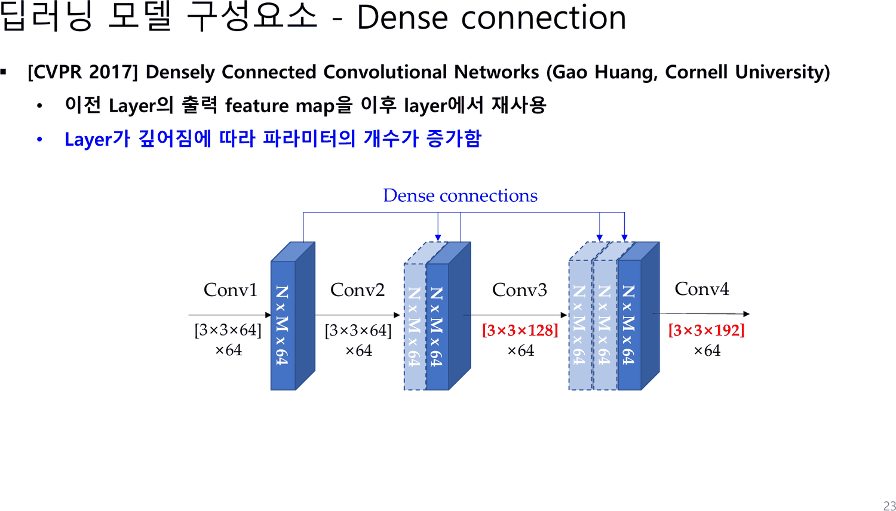
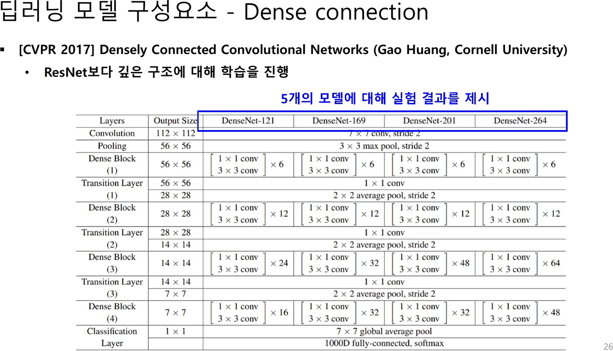
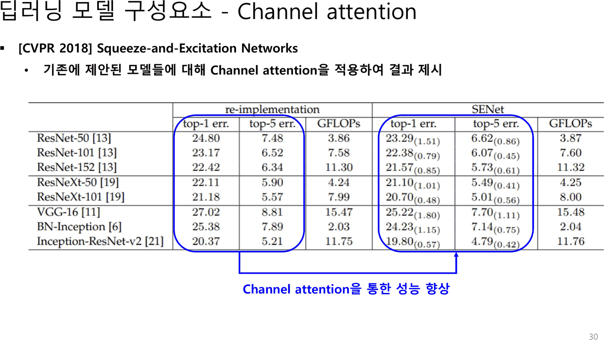
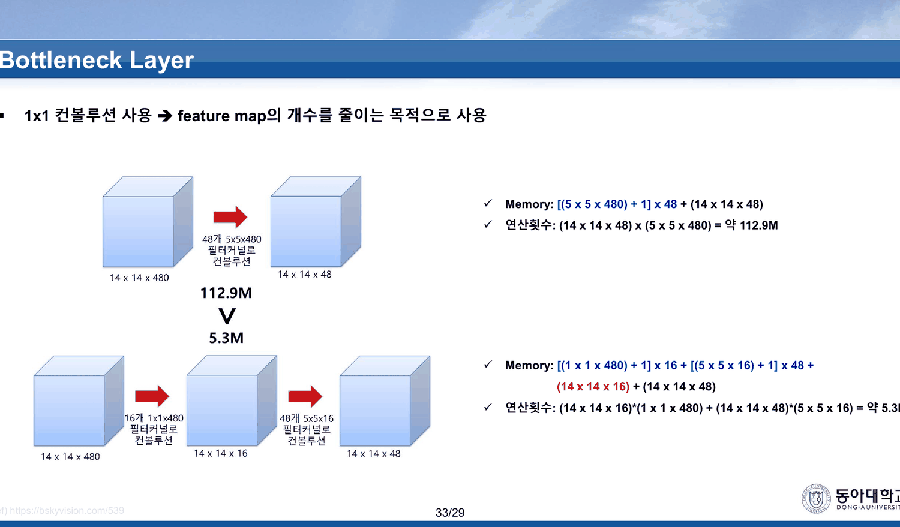
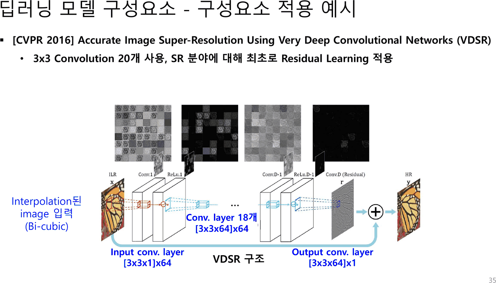
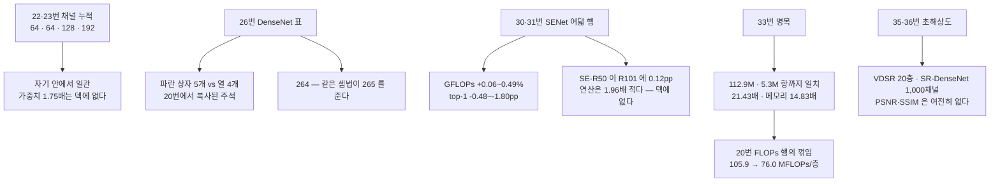

[18. 열 장 중 여덟 장이 지난주 덱 그대로다](<./18. 열 장 중 여덟 장이 지난주 덱 그대로다.md>)가 읽은 20번 표는 답을 이미 품고 있었다 — 34층에서 50층으로 가며 층이 열여섯 늘어도 FLOPs 는 0.2G 만 는다.

그 답이 33번에 있다. 여기까지 오는 데 열세 장이 걸리고, 그 사이에 표 하나가 자기 위에 붙은 설명과 어긋난다.

---

## 22~24번 — 채널이 쌓인다

22·23번은 같은 그림에 줄 하나가 더해지는 관계다.



| 장 | 본문 |
| --- | --- |
| 22 | 「이전 Layer의 출력 feature map을 이후 layer에서 재사용」 |
| 23 | 위 한 줄 + 「**Layer가 깊어짐에 따라 파라미터의 개수가 증가함**」 |

그림의 필터 표기가 채널 누적을 그대로 보여 준다.

| 층 | 필터 | 입력 채널 | 출력 |
| --- | --- | ---: | --- |
| Conv1 | `[3×3×64]×64` | 64 | N×M×64 |
| Conv2 | `[3×3×64]×64` | 64 | N×M×64 |
| Conv3 | `[3×3×128]×64` | **128** = 64+64 | N×M×64 |
| Conv4 | `[3×3×192]×64` | **192** = 64+64+64 | N×M×64 |

입력 채널이 64 → 64 → 128 → 192 로 **한 층 건너 64씩** 는다. 첫 두 층이 같은 것은 Conv2 가 Conv1 의 출력만 받기 때문이고, Conv3 부터 Conv1·Conv2 의 출력이 함께 들어온다. 그림의 `N x M x 64` 반복 개수(Conv3 앞 둘, Conv4 앞 셋)가 그 셈과 일치한다.

23번이 더한 한 줄을 숫자로 만들면 이렇다.

| 층 | 가중치 (재계산) | 덴스 없을 때 |
| --- | ---: | ---: |
| Conv1 | 36,864 | 36,864 |
| Conv2 | 36,864 | 36,864 |
| Conv3 | **73,728** | 36,864 |
| Conv4 | **110,592** | 36,864 |
| 합 | **258,048** | 147,456 |

네 층짜리 블록에서 덴스 연결은 가중치를 **1.75배**로 만든다. 슬라이드는 「증가함」이라고만 쓰고 배수를 적지 않는다. 그리고 이 증가가 24번의 답으로 이어진다 — **Dense Block** 을 짧게 끊고 그 사이에 Transition Layer 를 두는 구조다.

> [!note] 22·23번의 그림은 DenseNet 논문의 그림이 아니다
> 논문의 Dense Block 은 성장률 $k$ 로 채널이 $k_0 + k(l-1)$ 씩 느는 구조인데, 이 그림은 모든 층의 출력을 64 로 고정한다. 즉 $k = 64$ 인 특수한 경우를 그린 것이고, 그래서 입력 채널이 64 · 64 · 128 · 192 라는 깔끔한 수열이 된다. 강의용으로 단순화된 그림이며 셈 자체는 자기 안에서 일관된다.

---

## 25·26번 — 표 위에 붙은 말이 표와 맞지 않는다

25번은 간지다. 본문이 `Dense Connection` 한 줄, 꼬리표가 **`25/29`** — 19번(`19/29`)·33번(`33/29`)과 같은 출처다.

26번이 DenseNet 의 구조 표를 인쇄한다.



표 위 파란 상자에 이렇게 적혀 있다.

> **5개의 모델에 대해 실험 결과를 제시**

그리고 상자가 덮고 있는 열은 **DenseNet-121 · DenseNet-169 · DenseNet-201 · DenseNet-264 — 넷**이다.

> [!warning] 원본 오류 — 26번의 「5개의 모델」
> 이 문장은 여섯 장 앞 20번(ResNet)에서 왔다. 거기서는 18 · 34 · 50 · 101 · 152 로 **정말 다섯**이었고, 파란 상자도 다섯 열을 덮었다. 26번은 같은 주석을 복사하면서 개수를 고치지 않았다. 파란 상자의 폭은 네 열에 맞게 다시 그려져 있어서, **상자는 넷을 덮고 글자는 다섯이라고 말한다.**

그리고 표 자체에 숫자 하나가 어긋난다. 각 모델의 Dense Block 반복 횟수를 표에서 읽어 이름과 맞춰 보면 이렇다.

| 모델 | 블록 반복 | 층수 계산 (반복합×2 + conv1 + transition 3 + fc) | 표의 이름 |
| --- | --- | ---: | --- |
| DenseNet-121 | 6 · 12 · 24 · 16 | $2{\times}58 + 5 = 121$ | ✓ |
| DenseNet-169 | 6 · 12 · 32 · 32 | $2{\times}82 + 5 = 169$ | ✓ |
| DenseNet-201 | 6 · 12 · 48 · 32 | $2{\times}98 + 5 = 201$ | ✓ |
| DenseNet-264 | 6 · 12 · 64 · 48 | $2{\times}130 + 5 = \mathbf{265}$ | **264** ✗ |

앞 셋을 맞히는 셈법이 넷째에서 **265** 를 준다. 각 Dense Block 항목이 `1x1 conv` + `3x3 conv` 두 층이므로 반복 횟수의 합에 2 를 곱하고, 맨 앞 `7x7 conv` 한 층과 Transition Layer 세 개의 `1x1 conv` 와 마지막 `1000D fully-connected` 를 더한 값이다.

26번의 본문은 「ResNet보다 깊은 구조에 대해 학습을 진행」이다. 그 말은 맞는다 — 264(또는 265)는 20번 표의 최대 152보다 깊다.

---

## 28~31번 — 거의 공짜인 1.51pp

28번이 채널 어텐션을 한 줄로 정의한다 — 「Feature map의 각 채널에 대해 중요도를 부여」. 29번이 구현을 한 줄로 준다 — 「일반적으로 GAP를 통해 작아진 feature map에 대해 Fully connected layer 또는 1x1 convolution이 사용됨」. 18번의 GAP 가 여기서 다시 쓰인다.

30번이 결과 표를, 31번이 같은 표에 「복잡도는 거의 증가되지 않음」을 붙인다.



```html preview
<div id="se" style="font-family:system-ui,-apple-system,sans-serif;color:var(--foreground);background:var(--card);border:1px solid var(--border);border-radius:12px;padding:18px 16px;">
  <p style="margin:0 0 12px;font-size:13px;color:var(--muted-foreground);line-height:1.75;">
    30번 표의 여덟 행을 그대로 옮긴다. 가로축은 <b>GFLOPs</b>, 세로축은 <b>top-1 오류율</b>.
    화살표는 같은 모델의 <span style="color:var(--muted-foreground);">원본</span> → <span style="color:var(--chart-1);">SENet</span> 이동이다.</p>
  <svg id="ss" viewBox="0 0 640 310" style="width:100%;height:auto;display:block;cursor:pointer;"></svg>
  <div id="so" style="margin-top:10px;font-size:13.5px;line-height:1.95;min-height:3.4em;"></div>
</div>
<script>
(function(){
  const NS='http://www.w3.org/2000/svg', svg=document.getElementById('ss'), out=document.getElementById('so');
  const el=(t,a,x)=>{const e=document.createElementNS(NS,t);for(const k in a)e.setAttribute(k,a[k]);
    if(x!==undefined)e.textContent=x;return e;};
  // 30번 표 그대로: [이름, top1, top5, GFLOPs, SE top1, SE top5, SE GFLOPs]
  const R=[['ResNet-50',24.80,7.48,3.86,23.29,6.62,3.87],
           ['ResNet-101',23.17,6.52,7.58,22.38,6.07,7.60],
           ['ResNet-152',22.42,6.34,11.30,21.57,5.73,11.32],
           ['ResNeXt-50',22.11,5.90,4.24,21.10,5.49,4.25],
           ['ResNeXt-101',21.18,5.57,7.99,20.70,5.01,8.00],
           ['VGG-16',27.02,8.81,15.47,25.22,7.70,15.48],
           ['BN-Inception',25.38,7.89,2.03,24.23,7.14,2.04],
           ['Inception-ResNet-v2',20.37,5.21,11.75,19.80,4.79,11.76]];
  const L=52,Rr=596,T=18,B=246;
  const sx=v=>L+(v-1.2)/(16.2-1.2)*(Rr-L), sy=v=>T+(28-v)/(28-19.5)*(B-T);
  for(let g=20;g<=28;g+=2){
    svg.appendChild(el('line',{x1:L,y1:sy(g),x2:Rr,y2:sy(g),stroke:'var(--border)',opacity:0.55}));
    svg.appendChild(el('text',{x:L-8,y:sy(g)+4,'text-anchor':'end','font-size':10,
      fill:'var(--muted-foreground)'},g+'%'));
  }
  [2,4,6,8,10,12,14,16].forEach(g=>{
    svg.appendChild(el('text',{x:sx(g),y:B+16,'text-anchor':'middle','font-size':10,
      fill:'var(--muted-foreground)'},String(g)));
  });
  svg.appendChild(el('text',{x:(L+Rr)/2,y:B+34,'text-anchor':'middle','font-size':11,
    fill:'var(--muted-foreground)'},'GFLOPs'));
  svg.appendChild(el('text',{x:L-8,y:T-4,'text-anchor':'end','font-size':11,
    fill:'var(--muted-foreground)'},'top-1 err'));
  R.forEach(r=>{
    const g=el('g',{});
    g.appendChild(el('line',{x1:sx(r[3]),y1:sy(r[1]),x2:sx(r[6]),y2:sy(r[4]),
      stroke:'var(--chart-1)','stroke-width':1.6,opacity:0.8}));
    g.appendChild(el('circle',{cx:sx(r[3]),cy:sy(r[1]),r:4,fill:'var(--muted-foreground)',opacity:0.85}));
    g.appendChild(el('circle',{cx:sx(r[6]),cy:sy(r[4]),r:4.5,fill:'var(--chart-1)'}));
    g.appendChild(el('text',{x:sx(r[6])+8,y:sy(r[4])+4,'font-size':10,
      fill:'var(--muted-foreground)'},r[0]));
    g.addEventListener('click',()=>{
      const dt=(r[1]-r[4]), dg=(r[6]-r[3]);
      out.innerHTML='<b>'+r[0]+'</b> — top-1 '+r[1].toFixed(2)+'% → <b style="color:var(--chart-1)">'+
        r[4].toFixed(2)+'%</b> ('+(-dt).toFixed(2)+'pp) · top-5 '+r[2].toFixed(2)+'% → '+r[5].toFixed(2)+'%<br>'+
        'GFLOPs '+r[3].toFixed(2)+' → '+r[6].toFixed(2)+' — <b>+'+dg.toFixed(2)+'G, 비율 +'+
        (dg/r[3]*100).toFixed(2)+'%</b><br>'+
        '<span style="color:var(--muted-foreground);font-size:12.5px;">연산을 '+(dg/r[3]*100).toFixed(2)+
        '% 더 쓰고 오류를 '+(dt/r[1]*100).toFixed(1)+'% 줄였다.</span>';
    });
    svg.appendChild(g);
  });
  // ResNet-50+SE 와 ResNet-101 을 잇는 보조선
  svg.appendChild(el('line',{x1:sx(3.87),y1:sy(23.29),x2:sx(7.58),y2:sy(23.17),
    stroke:'var(--chart-2)','stroke-width':1.6,'stroke-dasharray':'5 4'}));
  svg.appendChild(el('text',{x:sx(5.2),y:sy(23.9),'font-size':10.5,fill:'var(--chart-2)','font-weight':700},
    'SE-ResNet-50 과 ResNet-101 의 차이 0.12pp'));
  out.innerHTML='<span style="color:var(--muted-foreground);">점을 눌러 모델을 고른다. '+
    '여덟 행 전부에서 GFLOPs 증가가 <b>+0.01 ~ +0.02G</b>(0.06%~0.49%)이고 top-1 이 <b>0.48 ~ 1.80pp</b> 내려간다.</span>';
})();
</script>
```

31번의 「복잡도는 거의 증가되지 않음」은 표가 뒷받침한다 — 여덟 행 모두 GFLOPs 증가가 0.01 또는 0.02 이고, 비율로는 **0.06%에서 0.49%** 사이다.

덱이 하지 않는 비교가 하나 더 있다. 표 안에 ResNet-50 과 ResNet-101 이 함께 있으므로 이렇게 읽을 수 있다.

| | top-1 | GFLOPs |
| --- | ---: | ---: |
| ResNet-50 | 24.80% | 3.86 |
| **SE-ResNet-50** | **23.29%** | **3.87** |
| ResNet-101 | 23.17% | 7.58 |

**SE 를 붙인 50층이 101층에 0.12pp 까지 다가가는데, 연산은 절반보다 적다**(3.87 대 7.58, 1.96배). 층을 두 배로 늘려 얻는 1.63pp 가운데 1.51pp 를 어텐션이 0.26% 의 연산으로 가져간 셈이다. 30·31번은 이 비교를 하지 않는다.

한 가지 더 — 이 표의 GFLOPs 열이 **20번 표와 맞는다.** ResNet-50 3.86 대 3.8, ResNet-101 7.58 대 7.6, ResNet-152 11.30 대 11.3. 여섯 장 사이를 두고 인쇄된 두 표가 같은 출처에서 왔음을 보여 주는 대목이고, 덱은 둘을 잇지 않는다.

---

## 33번 — 이 덱에서 전부 검산되는 유일한 장

32번이 목차를 다섯 번째로 인쇄하고, 33번이 병목을 한 줄과 네 개의 식으로 설명한다.



> **1x1 컨볼루션 사용 → feature map의 개수를 줄이는 목적으로 사용**

```html preview
<div id="bn" style="font-family:system-ui,-apple-system,sans-serif;color:var(--foreground);background:var(--card);border:1px solid var(--border);border-radius:12px;padding:18px 16px;">
  <p style="margin:0 0 14px;font-size:13px;color:var(--muted-foreground);line-height:1.75;">
    33번에 인쇄된 네 식을 항 그대로 넣고 계산한다. 슬라이드가 적은 값은 <b>약 112.9M</b> 과 <b>약 5.3M</b> 뿐이다.</p>
  <div id="bt" style="font-size:12.5px;line-height:2.05;font-variant-numeric:tabular-nums;"></div>
  <svg id="bs" viewBox="0 0 640 116" style="width:100%;height:auto;display:block;margin-top:10px;"></svg>
  <div id="bo" style="margin-top:8px;font-size:13.5px;line-height:1.95;"></div>
</div>
<script>
(function(){
  const NS='http://www.w3.org/2000/svg', svg=document.getElementById('bs');
  const el=(t,a,x)=>{const e=document.createElementNS(NS,t);for(const k in a)e.setAttribute(k,a[k]);
    if(x!==undefined)e.textContent=x;return e;};
  // 33번의 식을 항 그대로
  const memA = (5*5*480 + 1)*48 + (14*14*48);
  const opsA = (14*14*48)*(5*5*480);
  const memB = (1*1*480 + 1)*16 + (5*5*16 + 1)*48 + (14*14*16) + (14*14*48);
  const opsB = (14*14*16)*(1*1*480) + (14*14*48)*(5*5*16);
  document.getElementById('bt').innerHTML =
    '<b>병목 없이</b> — 5×5×480 필터 48개<br>'+
    '&nbsp;&nbsp;Memory: [(5×5×480) + 1] × 48 + (14×14×48) = <b>'+memA.toLocaleString()+'</b><br>'+
    '&nbsp;&nbsp;연산횟수: (14×14×48) × (5×5×480) = <b>'+opsA.toLocaleString()+'</b> = '+(opsA/1e6).toFixed(1)+'M'+
    ' &nbsp;<span style="color:var(--chart-1)">← 슬라이드 「약 112.9M」</span><br><br>'+
    '<b>병목 사용</b> — 1×1×480 필터 16개 뒤 5×5×16 필터 48개<br>'+
    '&nbsp;&nbsp;Memory: [(1×1×480) + 1] × 16 + [(5×5×16) + 1] × 48 + (14×14×16) + (14×14×48) = <b>'+memB.toLocaleString()+'</b><br>'+
    '&nbsp;&nbsp;연산횟수: (14×14×16)×(1×1×480) + (14×14×48)×(5×5×16) = <b>'+opsB.toLocaleString()+'</b> = '+(opsB/1e6).toFixed(1)+'M'+
    ' &nbsp;<span style="color:var(--chart-1)">← 슬라이드 「약 5.3M」</span>';
  const ROWS=[{n:'연산횟수',a:opsA,b:opsB},{n:'Memory',a:memA,b:memB}];
  const L=76,R=520,T=16,H=44;
  ROWS.forEach((r,i)=>{
    const y=T+i*H, max=r.a;
    svg.appendChild(el('text',{x:L-10,y:y+13,'text-anchor':'end','font-size':11.5,
      fill:'var(--muted-foreground)','font-weight':700},r.n));
    svg.appendChild(el('rect',{x:L,y:y,width:(R-L),height:15,rx:3,fill:'var(--chart-2)',opacity:0.75}));
    svg.appendChild(el('rect',{x:L,y:y+18,width:Math.max(2,(R-L)*r.b/max),height:15,rx:3,
      fill:'var(--chart-1)',opacity:0.85}));
    svg.appendChild(el('text',{x:R+10,y:y+13,'font-size':11,fill:'var(--muted-foreground)'},'병목 없이'));
    svg.appendChild(el('text',{x:R+10,y:y+31,'font-size':11,fill:'var(--chart-1)','font-weight':700},
      (r.a/r.b).toFixed(2)+'배 줄어든다'));
  });
  document.getElementById('bo').innerHTML =
    '슬라이드의 두 값이 <b>항까지 정확히 일치</b>한다. 연산은 <b>'+(opsA/opsB).toFixed(2)+'배</b>, '+
    '메모리는 <b>'+(memA/memB).toFixed(2)+'배</b> 줄어든다.<br>'+
    '<span style="color:var(--muted-foreground);font-size:12.5px;">'+
    '두 배수가 다른 것은 Memory 식이 가중치와 특성맵을 함께 세기 때문이다 — '+
    '병목 없이는 가중치가 '+((5*5*480+1)*48).toLocaleString()+'개로 압도적이고, '+
    '병목을 쓰면 특성맵 '+(14*14*16+14*14*48).toLocaleString()+'개가 무시할 수 없어진다.</span>';
})();
</script>
```

슬라이드가 적은 값은 **정확하다.** 식의 항을 하나도 바꾸지 않고 계산하면 112,896,000(≈112.9M)과 5,268,480(≈5.3M)이 나온다. 이 과목에서 인쇄된 값이 재계산과 끝까지 맞은 경우는 드물다([11. 여섯 장을 들여 더 좋은 옵티마이저를 소개하고, 실습 결과는 전부 더 나쁘다](<./11. 여섯 장을 들여 더 좋은 옵티마이저를 소개하고, 실습 결과는 전부 더 나쁘다.md>)의 학습률 로그 이후 처음이다).

그리고 이 21.43배가 **열세 장 앞 20번 표의 FLOPs 행을 설명한다.**

| | 층당 MFLOPs |
| --- | ---: |
| ResNet-18 · 34 (기본 블록) | 100.0 · 105.9 |
| ResNet-50 · 101 · 152 (병목 블록) | 76.0 · 75.2 · 74.3 |

20번은 표를 보여 주고 「각 모델에 대한 복잡도」라고만 적었다. 33번은 왜 그런지를 설명하고 ResNet 을 한 번도 언급하지 않는다. **두 장을 잇는 문장이 덱에 없다.**

> [!note] 33번의 꼬리표
> `33/29` 다. 19번(`19/29`)·25번(`25/29`)과 같다. 이 덱에서 분모 29 를 달고 있는 세 장은 간지 둘과 이 병목 슬라이드이고, 셋 다 **다른 덱에서 함께 옮겨 온 묶음**으로 보인다. 그중 하나가 이 덱에서 숫자가 가장 정확한 장이라는 것이 얄궂다.
>
> 출처도 다르다. 33번만 `Ref) https://bskyvision.com/539` 를 달고, 14~20번은 `Ref.: cs231n.stanford.edu, Lecture 9` 를 단다.

---

## 35·36번 — 배운 것을 한 분야에 붙인다

34번이 목차를 여섯 번째로 인쇄하고, 마지막 두 장이 초해상도로 간다.



| 장 | 논문 | 인쇄된 것 |
| --- | --- | --- |
| 35 | `[CVPR 2016] Accurate Image Super-Resolution Using Very Deep Convolutional Networks (VDSR)` | 「3x3 Convolution 20개 사용, SR 분야에 대해 **최초로 Residual Learning 적용**」 · `Input conv. layer [3x3x1]x64` · `Conv. layer 18개 [3x3x64]x64` · `Output conv. layer [3x3x64]x1` · 입력은 `Interpolation된 image (Bi-cubic)` |
| 36 | `[CVPR 2017] Image Super-Resolution Using Dense Skip Connections (SR-DenseNet)` | 「Dense connection을 이용해 Dense block 8의 출력 단은 **1,000개 이상의 feature map**을 사용」 |

35번의 층 수가 자기 안에서 맞는다 — 입력 1개 + 중간 18개 + 출력 1개 = **20개**. 가중치를 세면 $576 + 18{\times}36{,}864 + 576 = 664{,}704$ 이고, 그중 중간 열여덟 층이 **99.8%** 다.

36번의 「1,000개 이상」도 22~23번의 누적 규칙으로 확인된다. Dense block 을 여덟 개 쌓으면서 각 블록의 출력이 뒤 블록 전부의 입력에 더해지면 채널이 선형으로 누적되고, 여덟 번째 블록 입구에서 네 자리가 된다. 22번이 네 층에서 64 → 192 를 보여 준 그 수열의 연장이다.

이 두 장이 11주차 덱 11번과 66~70번을 이어받는다. 11번이 「Ex. Image classification, Super-resolution, Denoising」이라 적었고, 67번이 초해상도 논문 하나를 그림으로 걸었으며, 여기서 두 논문이 구조까지 나온다. 다만 [01. 빌려 온 그림이 양쪽을 다 찌른다](<./01. 빌려 온 그림이 양쪽을 다 찌른다.md>)가 남긴 빚 — **모든 덱 2번 공통 지도의 `PSNR` · `SSIM` · `Total Memory`** — 은 여기서도 갚히지 않는다. 초해상도 두 장에 지표 이름이 없다.

---

## 이 절의 검산 결과



---

## 근거 자료

`CNN 주요설계모듈(이론).pdf` 36쪽 중 **21~36번**.

- 22·23번 — `[3×3×64]×64` · `[3×3×64]×64` · `[3×3×128]×64` · `[3×3×192]×64`, `N x M x 64` 반복, 23번의 「Layer가 깊어짐에 따라 파라미터의 개수가 증가함」
- 24번 — Dense Block 과 DenseNet 네트워크 구조 예시
- 25번 — `Dense Connection` 간지, 꼬리표 `25/29`
- 26번 — DenseNet-121 · 169 · 201 · 264, 블록 반복 `6·12·24·16` / `6·12·32·32` / `6·12·48·32` / `6·12·64·48`, Transition Layer 세 개, `7x7 global average pool`, `1000D fully-connected, softmax`, 파란 상자 「5개의 모델에 대해 실험 결과를 제시」
- 28~31번 — 여덟 행 표(top-1 · top-5 · GFLOPs, 원본과 SENet), 31번의 「복잡도는 거의 증가되지 않음」
- 33번 — 네 개의 Memory·연산횟수 식과 「약 112.9M」 · 「약 5.3M」, 꼬리표 `33/29`, `Ref) https://bskyvision.com/539`
- 35번 — VDSR `[CVPR 2016]`, `[3x3x1]x64` · 18개 `[3x3x64]x64` · `[3x3x64]x1`
- 36번 — SR-DenseNet `[CVPR 2017]`, 「Dense block 8의 출력 단은 1,000개 이상의 feature map」

DenseNet 층수, Dense Block 가중치, VDSR 가중치, SENet 표의 차분과 비율, 병목 식 네 개는 모두 파이썬 정수 연산으로 재계산했다. 33번의 두 값은 인쇄된 식의 항을 그대로 넣어 112,896,000 과 5,268,480 을 얻었고 슬라이드의 반올림(112.9M · 5.3M)과 일치한다.

---

## 이어지는 문서

- [18. 열 장 중 여덟 장이 지난주 덱 그대로다](<./18. 열 장 중 여덟 장이 지난주 덱 그대로다.md>) — 같은 덱 1~20번. 33번이 설명하는 그 표가 거기 있다
- [22. 훈련 손실 1등과 시험 정확도 1등이 다르다](<./22. 훈련 손실 1등과 시험 정확도 1등이 다르다.md>) — 같은 주 실습이 덴스 연결과 채널 어텐션을 실제로 돌린 결과
- [21. 여섯 층은 세 에폭을 ln 10 에 앉아 있다가 빠져나온다](<./21. 여섯 층은 세 에폭을 ln 10 에 앉아 있다가 빠져나온다.md>) — 33번의 1×1 이야기가 실습의 지름길 선택과 어긋나는 자리
- [17. 슬라이드 10이 약속한 절약을 슬라이드 63이 취소한다](<./17. 슬라이드 10이 약속한 절약을 슬라이드 63이 취소한다.md>) — 18번의 GAP 가 63·64번이 만든 문제에 답한다
- [11. 여섯 장을 들여 더 좋은 옵티마이저를 소개하고, 실습 결과는 전부 더 나쁘다](<./11. 여섯 장을 들여 더 좋은 옵티마이저를 소개하고, 실습 결과는 전부 더 나쁘다.md>) — 인쇄된 숫자가 재계산과 끝까지 맞았던 직전 사례
