이 덱은 34쪽이고, 페이지당 평균 글자 수가 **87자**다. 이 과목에서 가장 낮다.

이유는 16번과 17번 사이에 있다. 그 앞은 인터넷 그림을 붙인 슬라이드이고, 그 뒤 열여덟 장은 **손으로 그린 것**이다. 추출 텍스트가 0자인 쪽이 일곱이고, 40자 미만이 셋이다.

[08. 덱이 약속만 하고 넘어간 절은 공책에 있다](<./08. 덱이 약속만 하고 넘어간 절은 공책에 있다.md>)가 읽은 `필기 과제` 는 4주차까지였고, 그 노트는 「5주차 이후(합성곱)의 판서는 `sources/` 에 없다」고 적었다. **있었다.** 이 덱의 뒷부분이 그것이다.

---

## 1~14번 — 빌려 온 세 구조

2 · 9 · 11번은 같은 간지다. 추출 텍스트가 99자로 완전히 같고, `ImageNet Large Scale Visual Recognition Challenge (ILSVRC)` 아래 「대용량의 이미지셋 (1000개의 클래스) 에 대한 이미지 분류 알고리즘 성능 평가 대회」가 붙는다. 세 구조를 하나씩 소개할 때마다 같은 장을 다시 넣는다.

출처는 전부 같은 블로그다 — `bskyvision.com/425`(AlexNet), `/539`(GoogLeNet), `/504`(VGGNet). 앞 주 덱의 12번 ILSVRC 그래프도 `/425` 였고, 33번 병목도 `/539` 였다([18. 열 장 중 여덟 장이 지난주 덱 그대로다](<./18. 열 장 중 여덟 장이 지난주 덱 그대로다.md>) · [19. 파란 상자는 다섯이라 쓰고 표에는 넷이 있다](<./19. 파란 상자는 다섯이라 쓰고 표에는 넷이 있다.md>)).

### AlexNet — 형상이 전부 맞는다

6번이 구조를 형상까지 적는다.

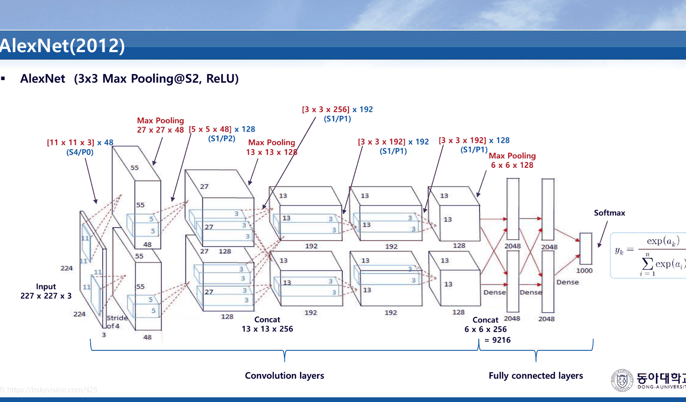

인쇄된 형상을 출력 크기 공식($OH = (H+2P-FH)/S + 1$, [16. 검산되는 예제와 검산할 수 없는 예제](<./16. 검산되는 예제와 검산할 수 없는 예제.md>))으로 따라가면 전부 맞는다.

| 단계 | 인쇄된 표기 | 계산 | 인쇄된 출력 |
| --- | --- | --- | --- |
| Conv1 | `[11 x 11 x 3] x 48 (S4/P0)` | $(227-11)/4+1 = 55$ | |
| MaxPool 3×3 S2 | | $(55-3)/2+1 = 27$ | `27 x 27 x 48` ✓ |
| Conv2 | `[5 x 5 x 48] x 128 (S1/P2)` | $(27+4-5)/1+1 = 27$ | |
| MaxPool 3×3 S2 | | $(27-3)/2+1 = 13$ | `13 x 13 x 128` ✓ |
| Conv3 | `[3 x 3 x 256] x 192 (S1/P1)` | 13 유지 | `Concat 13 x 13 x 256` ✓ |
| Conv4·5 | `[3 x 3 x 192] x 192` · `[3 x 3 x 192] x 128` | 13 유지 | |
| MaxPool 3×3 S2 | | $(13-3)/2+1 = 6$ | `6 x 6 x 128` ✓ |
| Concat | | $6\times6\times256$ | `6 x 6 x 256 = 9216` ✓ |

두 갈래(각 48·128·192·192·128 채널)를 합쳐 256 이 되는 것도, 마지막 9216 도 정확하다. 3번의 「총 8개의 layer로 구성(5개의 컨볼루션 레이어, 3개의 Fully connected layer)」과도 맞는다.

4·5번이 설계 결정 넷을 한 줄씩 적는다.

| 장 | 줄 |
| --- | --- |
| 4 | 「Activation function으로 ReLU함수를 사용(TanH함수를 **사용할 때마다** 6배 빠름)」 |
| 4 | 「Over-fitting을 막기위해 Dropout을 사용」 |
| 5 | 「3x3 Overlapping pooling 사용 (Stride = 2)」 |
| 5 | 「Data augmentation으로 데이터 양을 증가 → overfitting 문제 줄임」 |

> [!warning] 오탈자 — 4번의 「사용할 때마다」
> 「TanH함수를 사용할 때**마다** 6배 빠름」은 뜻이 서지 않는다. 비교 대상이 필요한 문장이므로 「사용할 때**보다**」가 맞는다. 한 글자가 바뀌면서 비교가 사라졌다.

5번의 「Data augmentation」은 [12. 여섯 가지를 가르치고 셋을 해 본다](<./12. 여섯 가지를 가르치고 셋을 해 본다.md>)로 되돌아가는 줄이다. 그 노트가 읽은 `Overfitting` 덱은 해결 방법 일곱에 1~6번을 붙이면서 **데이터 증식에만 번호를 주지 않았고**, 실습에서는 그것이 가장 크게 효과를 냈다. AlexNet 은 그것을 과적합 대책으로 명시한다.

7·8번은 추출 텍스트가 0자다. 8번은 AlexNet 논문의 유명한 예측 그림이다 — 여덟 장의 사진과 각각의 상위 다섯 후보.

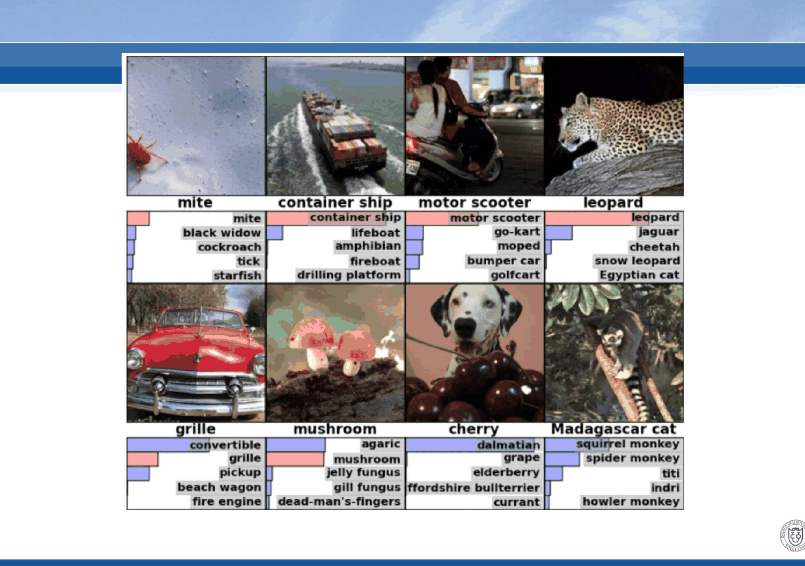

**제목도, 캡션도, 출처도 없다.** 그림 안에서 읽을 수 있는 것은 `grille` 과 `mushroom` 의 1순위가 정답이 아니고 정답이 2순위에 있다는 것, `cherry` 의 1순위가 `dalmatian` 이라는 것 정도다. 덱은 그것을 지적하지 않는다.

### GoogLeNet 과 VGGNet

10번 한 장이 GoogLeNet 전부다 — 「VGGNet을 이기고 우승을 차지한 알고리즘 (Inception)」 · 「총 22개 layer로 구성」. 제목이 **`GooGleNet(2014)`** 로 인쇄되어 있다(`GoogLeNet` 의 대문자 위치가 틀렸다).

12~14번이 VGGNet 이다. 13번에 이 덱에서 가장 짧고 정확한 계산이 있다.

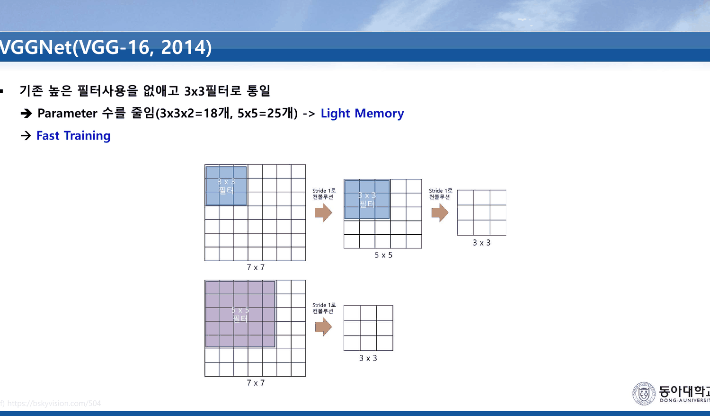

> 「기존 높은 필터사용을 없애고 3x3필터로 통일」
> · Parameter 수를 줄임(**3x3x2=18개, 5x5=25개**) -> Light Memory
> · Fast Training

$3\times3\times2 = 18$, $5\times5 = 25$ — 맞다. 그리고 3×3 두 장의 수용 영역이 5×5 한 장과 같다는 것이 이 비교가 성립하는 근거인데, 그 문장은 슬라이드에 없다. (보충: $3+3-1=5$.)

14번이 VGG-16 의 앞부분을 형상과 함께 그린다 — `3 x 3 x 3 x 64 (S1/P1)` → `3 x 3 x 64 x 64` → `2x2 Max Pooling (S2)` → `112 x 112 x 64`. 224 에서 시작해 패딩 1 로 크기를 지키다가 풀링에서 절반이 된다. 맞다.

---

## 15·16번 — 두 장의 목록

이 덱의 중간에 복습 목록 두 장이 있다. 이 과목에서 지난 내용을 한자리에 모으는 장은 이 둘뿐이다.

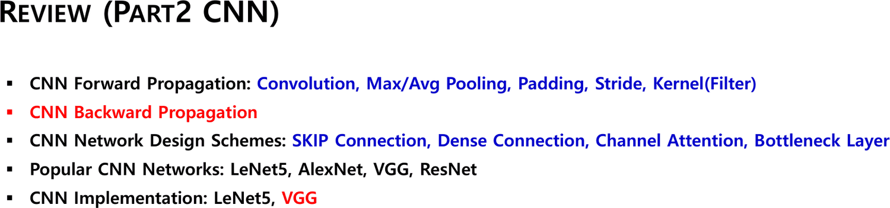

> **REVIEW (PART1 MLP)**
>
> · MLP(FC Layer) Forward Propagation: Perceptron, Activation Functions, L1/L2 Loss Functions
> · MLP(FC Layer) Backward Propagation: Gradient Descent(GD) Method
> · Various Techniques & Implementations — Overfitting Problem · Vanishing Gradient · **Data Argumentation** · Optimization · Drop-out · **Hyper-parament Control** (Ex., Adaptive Learning Rate, mini-batch, epoch, etc…) · Ablation Works

그리고 같은 형식으로 앞으로 할 것이 붙는다.

> **REVIEW (PART2 CNN)**
>
> · CNN Forward Propagation: Convolution, Max/Avg Pooling, Padding, Stride, Kernel(Filter)
> · **CNN Backward Propagation**
> · CNN Network Design Schemes: SKIP Connection, Dense Connection, Channel Attention, Bottleneck Layer
> · Popular CNN Networks: LeNet5, AlexNet, VGG, ResNet
> · CNN Implementation: LeNet5, VGG

PART1 의 목록은 01~14번 노트가 읽은 덱들과 하나씩 맞는다. 그런데 **PART1 에 없는 항목이 하나 있다** — `Ablation Works`. 이 과목의 어떤 덱도 소거 실험을 다룬 적이 없다. 가장 가까운 것이 `Overfitting` 실습의 세 처방 비교와 `Optimizer` 의 다섯 실행 비교인데, 둘 다 그 이름으로 불린 적은 없다.

PART2 의 다섯 줄은 예고다. 첫째·셋째·넷째·다섯째는 11·12·14주차 덱들이 이미 다뤘거나 다룰 것이고, **둘째 줄 `CNN Backward Propagation` 만 아직 아무 데도 없다.** 17번부터가 그 줄이다.

> [!warning] 오탈자 두 개
> `Data Argumentation` → Augmentation(증식). Argumentation 은 논증이다. 그리고 `Hyper-parament Control` → Hyper-parameter. 둘 다 PART1 셋째 줄 안에 있다.

---

## 17~28번 — 다섯 칸과 세 칸

17번부터 손글씨다. 18번이 2D 합성곱을, 19번이 그것을 1차원으로 줄인 그림을 그린다. **이 덱이 역전파를 1차원에서 하는 이유가 여기 있다** — 인덱스가 하나면 모든 연결을 한 장에 그릴 수 있다.

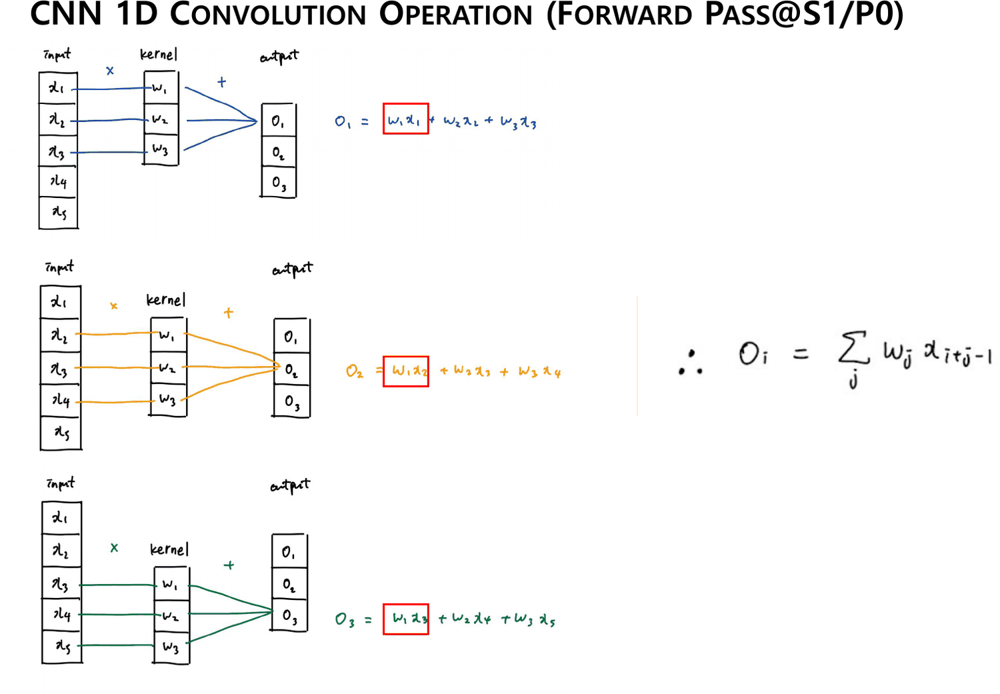

| 출력 | 식 |
| --- | --- |
| $O_1$ | $w_1x_1 + w_2x_2 + w_3x_3$ |
| $O_2$ | $w_1x_2 + w_2x_3 + w_3x_4$ |
| $O_3$ | $w_1x_3 + w_2x_4 + w_3x_5$ |

그리고 오른쪽에 일반식이 적힌다.

$$O_i = \sum_j w_j\, x_{i+j-1}$$

25번이 같은 식에 범위를 더한다 — $\sum_{j=1}^{3}$, $(i = 1, 2, 3)$.

20번이 첫 역전파를 한다. $w_1$ 이 세 출력 전부에 들어가 있으므로 기울기를 셋에서 모은다.

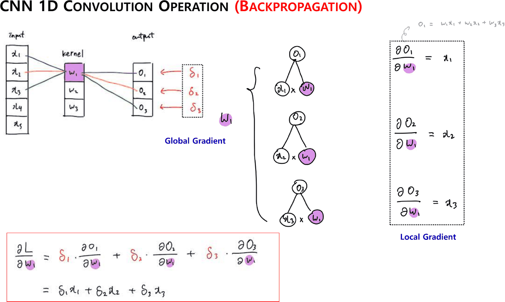

$$\frac{\partial L}{\partial w_1} = \delta_1\frac{\partial O_1}{\partial w_1} + \delta_2\frac{\partial O_2}{\partial w_1} + \delta_3\frac{\partial O_3}{\partial w_1} = \delta_1 x_1 + \delta_2 x_2 + \delta_3 x_3$$

오른쪽 점선 상자가 `Local Gradient` 세 줄($\partial O_1/\partial w_1 = x_1$ 등)이고, 왼쪽 빨간 상자가 결과다. 25번이 같은 것을 $w_3$ 에 대해 한다 — $\partial L/\partial w_3 = \delta_1x_3 + \delta_2x_4 + \delta_3x_5$.

[06. 곱셈 게이트의 국소 기울기는 상대방의 값이다](<./06. 곱셈 게이트의 국소 기울기는 상대방의 값이다.md>)가 읽은 규칙이 그대로 쓰인다 — 곱셈 게이트에서 $w$ 쪽 국소 기울기는 $x$ 다. 달라진 것은 **하나의 $w$ 가 여러 게이트에 동시에 들어간다**는 것이고, 그래서 더하기가 생긴다.

```html preview
<div id="cv" style="font-family:system-ui,-apple-system,sans-serif;color:var(--foreground);background:var(--card);border:1px solid var(--border);border-radius:12px;padding:18px 16px;">
  <p style="margin:0 0 12px;font-size:13px;color:var(--muted-foreground);line-height:1.75;">
    19·20·25·27번의 1차원 회로다. 왼쪽 칸을 누르면 그것이 닿는 연결과 기울기 식이 나온다.</p>
  <svg id="cs2" viewBox="0 0 640 230" style="width:100%;height:auto;display:block;cursor:pointer;"></svg>
  <div id="co2" style="margin-top:10px;font-size:14px;line-height:2;min-height:3.4em;"></div>
</div>
<script>
(function(){
  const NS='http://www.w3.org/2000/svg', svg=document.getElementById('cs2'), out=document.getElementById('co2');
  const el=(t,a,x)=>{const e=document.createElementNS(NS,t);for(const k in a)e.setAttribute(k,a[k]);
    if(x!==undefined)e.textContent=x;return e;};
  const NX=5,NW=3,NO=3;                     // 19번: 입력 5 · 커널 3 · 출력 3
  const XX=90, WX=300, OX=510, TOP=28, GY=34;
  const sub=n=>String(n).replace(/\d/g,d=>'₀₁₂₃₄₅₆₇₈₉'[d]);
  const links=[];                            // O_i 는 x_{i+j-1} 와 w_j 를 곱해 더한다
  for(let i=1;i<=NO;i++)for(let j=1;j<=NW;j++)links.push({i:i,j:j,x:i+j-1});
  const node=(x,y,lab,c)=>{const g=el('g',{});
    g.appendChild(el('rect',{x:x-24,y:y-13,width:48,height:26,rx:5,fill:'var(--card)',
      stroke:c,'stroke-width':1.5}));
    g.appendChild(el('text',{x:x,y:y+5,'text-anchor':'middle','font-size':13,
      fill:c,'font-weight':700},lab)); return g;};
  const yx=k=>TOP+(k-1)*GY, yw=k=>TOP+26+(k-1)*GY, yo=k=>TOP+26+(k-1)*GY;
  let lineLayer=el('g',{}); svg.appendChild(lineLayer);
  function redraw(sel){
    while(lineLayer.firstChild) lineLayer.removeChild(lineLayer.firstChild);
    links.forEach(l=>{
      const on = !sel ? false :
        (sel.t==='w' ? l.j===sel.k : sel.t==='x' ? l.x===sel.k : l.i===sel.k);
      lineLayer.appendChild(el('path',{d:'M'+(XX+24)+' '+yx(l.x)+' L'+(WX-24)+' '+yw(l.j),
        stroke: on?'var(--chart-1)':'var(--border)','stroke-width':on?2.2:1,fill:'none',
        opacity:on?0.95:0.45}));
      lineLayer.appendChild(el('path',{d:'M'+(WX+24)+' '+yw(l.j)+' L'+(OX-24)+' '+yo(l.i),
        stroke: on?'var(--chart-1)':'var(--border)','stroke-width':on?2.2:1,fill:'none',
        opacity:on?0.95:0.45}));
    });
  }
  for(let k=1;k<=NX;k++){const g=node(XX,yx(k),'x'+sub(k),'var(--chart-2)');
    g.addEventListener('click',()=>pick({t:'x',k:k})); svg.appendChild(g);}
  for(let k=1;k<=NW;k++){const g=node(WX,yw(k),'w'+sub(k),'var(--chart-1)');
    g.addEventListener('click',()=>pick({t:'w',k:k})); svg.appendChild(g);}
  for(let k=1;k<=NO;k++){const g=node(OX,yo(k),'O'+sub(k),'var(--foreground)');
    g.addEventListener('click',()=>pick({t:'o',k:k})); svg.appendChild(g);}
  svg.appendChild(el('text',{x:XX,y:14,'text-anchor':'middle','font-size':11,fill:'var(--muted-foreground)'},'input'));
  svg.appendChild(el('text',{x:WX,y:14,'text-anchor':'middle','font-size':11,fill:'var(--muted-foreground)'},'kernel'));
  svg.appendChild(el('text',{x:OX,y:14,'text-anchor':'middle','font-size':11,fill:'var(--muted-foreground)'},'output'));
  function pick(sel){
    redraw(sel);
    if(sel.t==='w'){
      const ts=links.filter(l=>l.j===sel.k);
      out.innerHTML='<b>w'+sub(sel.k)+'</b> 는 출력 <b>'+ts.length+'개 전부</b>에 들어간다 — 20·25번의 상황이다.<br>'+
        '∂L/∂w'+sub(sel.k)+' = '+ts.map(l=>'δ'+sub(l.i)+'·x'+sub(l.x)).join(' + ');
    } else if(sel.t==='x'){
      const ts=links.filter(l=>l.x===sel.k);
      out.innerHTML='<b>x'+sub(sel.k)+'</b> 는 출력 <b>'+ts.length+'개</b>에 들어간다 — 27번의 상황이다.<br>'+
        '∂L/∂x'+sub(sel.k)+' = '+ts.map(l=>'δ'+sub(l.i)+'·w'+sub(l.j)).join(' + ')+
        '<br><span style="color:var(--muted-foreground);font-size:12.5px;">δ 의 번호가 커질수록 w 의 번호가 작아진다 — 커널이 뒤집혀 곱해진다.</span>';
    } else {
      const ts=links.filter(l=>l.i===sel.k);
      out.innerHTML='<b>O'+sub(sel.k)+'</b> = '+ts.map(l=>'w'+sub(l.j)+'x'+sub(l.x)).join(' + ')+
        '<br><span style="color:var(--muted-foreground);font-size:12.5px;">19번의 일반식 O<sub>i</sub> = Σ<sub>j</sub> w<sub>j</sub>x<sub>i+j−1</sub> 그대로다.</span>';
    }
  }
  redraw(null);
  out.innerHTML='<span style="color:var(--muted-foreground);">칸을 눌러 고른다. 가중치 셋과 입력 다섯이 아홉 개의 연결을 만든다 — '+
    '<b>연결은 아홉인데 가중치는 셋</b>이고, 그것이 이 덱 뒷부분 전체의 주제다.</span>';
})();
</script>
```

27·28번이 입력 쪽 기울기를 다섯 줄로 적는다.

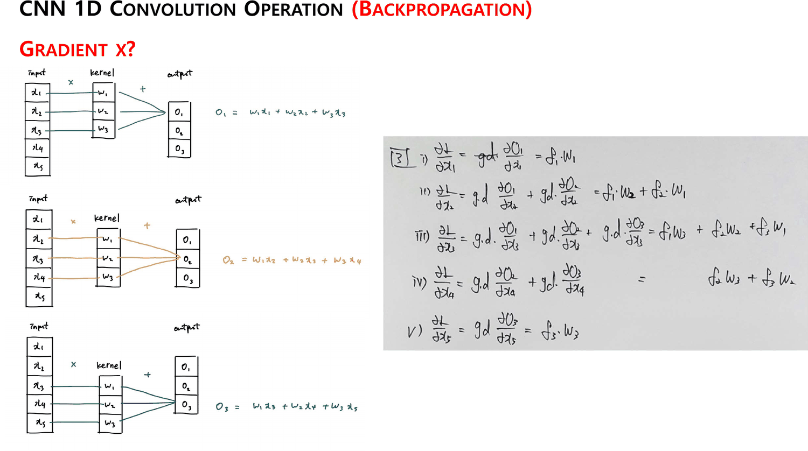

| | |
| --- | --- |
| i) | $\partial L/\partial x_1 = \delta_1 w_1$ |
| ii) | $\partial L/\partial x_2 = \delta_1 w_2 + \delta_2 w_1$ |
| iii) | $\partial L/\partial x_3 = \delta_1 w_3 + \delta_2 w_2 + \delta_3 w_1$ |
| iv) | $\partial L/\partial x_4 = \delta_2 w_3 + \delta_3 w_2$ |
| v) | $\partial L/\partial x_5 = \delta_3 w_3$ |

다섯 줄을 나란히 놓으면 **$\delta$ 의 번호가 오르는 동안 $w$ 의 번호가 내린다.** 가운데 줄에서 셋이 다 모이고 양 끝으로 갈수록 항이 줄어든다. 이것이 뒤집힌 커널과의 합성곱이라는 사실 — 판서는 그 이름을 쓰지 않지만 다섯 줄이 그 모양 그대로다.

---

## 21번 — 왜 합성곱인가를 종이가 말한다

20번과 22번 사이에 낱장 사진 한 장이 끼어 있다. 텍스트가 0자다.

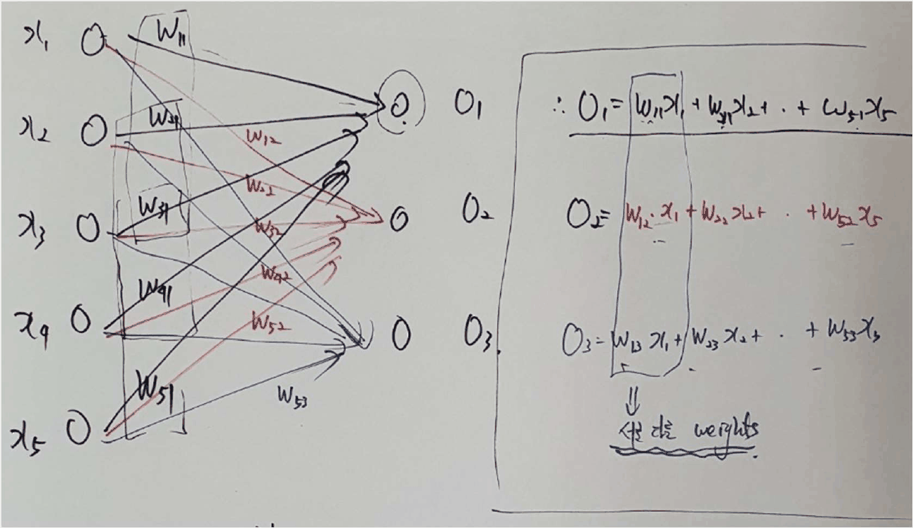

다섯 입력과 세 출력이 **전부 연결**되어 있고 가중치에 $W_{11}$ 부터 $W_{53}$ 까지 두 자리 첨자가 붙는다. 오른쪽에 세 줄이 적혀 있다.

$$O_1 = W_{11}x_1 + W_{21}x_2 + \cdots + W_{51}x_5$$
$$O_2 = W_{12}x_1 + W_{22}x_2 + \cdots + W_{52}x_5$$
$$O_3 = W_{13}x_1 + W_{23}x_2 + \cdots + W_{53}x_5$$

그리고 파란 밑줄로 **「서로 다른 weights」**.

```html preview
<div id="sh" style="font-family:system-ui,-apple-system,sans-serif;color:var(--foreground);background:var(--card);border:1px solid var(--border);border-radius:12px;padding:18px 16px;">
  <p style="margin:0 0 14px;font-size:13px;color:var(--muted-foreground);line-height:1.75;">
    21번(완전연결)과 19번(합성곱)이 <b>같은 5 → 3</b> 을 잇는다. 연결선 수는 같고 <b>서로 다른 가중치의 개수</b>가 다르다.</p>
  <svg id="shs" viewBox="0 0 640 210" style="width:100%;height:auto;display:block;"></svg>
  <div id="sho" style="margin-top:10px;font-size:13.5px;line-height:1.95;"></div>
</div>
<script>
(function(){
  const NS='http://www.w3.org/2000/svg', svg=document.getElementById('shs');
  const el=(t,a,x)=>{const e=document.createElementNS(NS,t);for(const k in a)e.setAttribute(k,a[k]);
    if(x!==undefined)e.textContent=x;return e;};
  const NX=5,NO=3,K=3;
  const COL=['var(--chart-1)','var(--chart-2)','var(--muted-foreground)'];
  function panel(ox,title,fc){
    const XA=ox+30, XB=ox+216, T=52, G=26;
    svg.appendChild(el('text',{x:ox+120,y:26,'text-anchor':'middle','font-size':12.5,
      fill:'var(--foreground)','font-weight':700},title));
    let n=0, uniq=new Set();
    for(let i=1;i<=NO;i++)for(let j=1;j<=K;j++){
      const x=i+j-1; n++;
      const key = fc ? (x+'-'+i) : ('w'+j);
      uniq.add(key);
      const col = fc ? 'var(--border)' : COL[j-1];
      svg.appendChild(el('path',{d:'M'+XA+' '+(T+(x-1)*G)+' L'+XB+' '+(T+34+(i-1)*G),
        stroke:col,'stroke-width':fc?1.2:2,fill:'none',opacity:fc?0.7:0.85}));
    }
    for(let k=1;k<=NX;k++){
      svg.appendChild(el('circle',{cx:XA,cy:T+(k-1)*G,r:7,fill:'var(--card)',
        stroke:'var(--foreground)','stroke-width':1.2}));}
    for(let k=1;k<=NO;k++){
      svg.appendChild(el('circle',{cx:XB,cy:T+34+(k-1)*G,r:7,fill:'var(--card)',
        stroke:'var(--foreground)','stroke-width':1.2}));}
    svg.appendChild(el('text',{x:ox+120,y:196,'text-anchor':'middle','font-size':12.5,
      fill:fc?'var(--chart-2)':'var(--chart-1)','font-weight':700},
      '연결 '+n+'개 · 서로 다른 가중치 '+uniq.size+'개'));
    return uniq.size;
  }
  const a=panel(10,'21번 — 완전연결 (W₁₁ … W₅₃)',true);
  const b=panel(330,'19번 — 합성곱 (w₁ w₂ w₃)',false);
  svg.appendChild(el('line',{x1:320,y1:34,x2:320,y2:186,stroke:'var(--border)','stroke-dasharray':'4 4'}));
  document.getElementById('sho').innerHTML =
    '완전연결의 연결선은 5×3 = <b>15</b>개이고 가중치도 15개다. 합성곱은 연결선 <b>9</b>개를 '+
    '<b>'+b+'개</b>의 가중치로 만든다.<br>'+
    '<span style="color:var(--muted-foreground);font-size:12.5px;">'+
    '같은 색 선은 같은 가중치다. 그래서 20번의 ∂L/∂w₁ 에 항이 세 개 생긴다 — '+
    '한 가중치가 세 자리에서 쓰였으니 세 자리에서 기울기를 받는다. '+
    '21번의 W₁₁ 은 한 자리에서만 쓰이므로 항이 하나뿐이다.</span>';
})();
</script>
```

이 한 장이 덱 앞부분 전체가 하지 못한 일을 한다. 11주차 덱 10번은 「CNN에 비해 필요한 weight parameter의 개수가 많음」이라고 **주장**했고 비교는 성립하지 않았다([15. 같은 불평이 세 이름으로 세 번 나온다](<./15. 같은 불평이 세 이름으로 세 번 나온다.md>)). 여기 21번은 **같은 입력, 같은 출력, 같은 연결 구조**에서 15 대 3 을 보여 준다. 슬라이드가 아니라 종이가 그것을 한다.

그리고 그 공유가 역전파에 남기는 자국이 20번의 더하기 세 항이다. **가중치를 아끼는 대가가 기울기의 합**이라는 것 — 두 장이 붙어 있어서 그 대응이 읽힌다.

---

## 29~34번 — 2차원으로, 그리고 이름이 어긋난다

29번부터 2차원이다. 3×3 입력, 2×2 커널(색 네 개), 2×2 출력, 그 뒤 풀링.

30번은 텍스트가 0자인 그림 두 개짜리 장이고, 왼쪽 위 귀퉁이에 **`HONEYCAM`** 워터마크가 찍혀 있다. 애니메이션 GIF 캡처 도구의 흔적이다 — 움직이는 그림을 한 프레임씩 세워 둔 것이다.

31번이 풀링의 역전파를 준다. 제목이 **「참고」** 한 단어다.

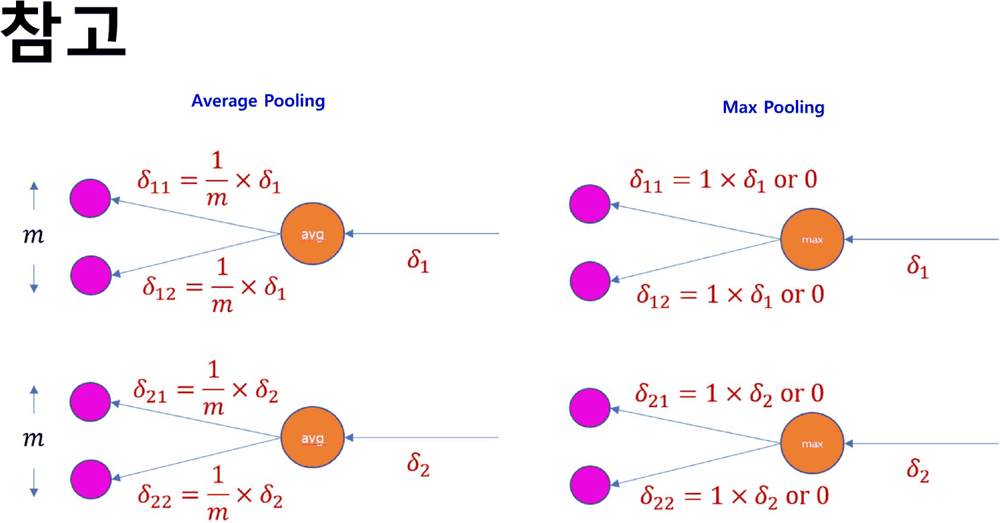

| | 인쇄된 식 |
| --- | --- |
| Average Pooling | $\delta_{11} = \frac{1}{m}\times\delta_1$, $\delta_{12} = \frac{1}{m}\times\delta_1$ |
| Max Pooling | $\delta_{11} = 1\times\delta_1$ **or** $0$, $\delta_{12} = 1\times\delta_1$ **or** $0$ |

둘 다 맞다. 평균 풀링은 들어온 기울기를 $m$ 으로 나눠 고르게 뿌리고, 맥스 풀링은 최댓값이었던 칸 하나에 전부 보낸다.

다만 맥스 쪽 표기가 조건을 숨긴다. $\delta_{11}$ 과 $\delta_{12}$ 가 각각 「$\delta_1$ 또는 0」이라고 따로 적혀 있어서, **둘 다 $\delta_1$ 을 받는 경우가 없다는 제약**이 식에 드러나지 않는다. $m$ 개 중 정확히 하나만 받는다는 것이 맥스 풀링 역전파의 핵심인데, 「or 0」 두 줄로는 그것이 보이지 않는다.

그리고 이 절 전체가 「참고」라는 제목 아래 있다. 11주차 덱은 풀링을 35번 한 장으로 끝냈고([16. 검산되는 예제와 검산할 수 없는 예제](<./16. 검산되는 예제와 검산할 수 없는 예제.md>)), 12주차 실습은 평균 풀링을 실제로 쓴다([21. 여섯 층은 세 에폭을 ln 10 에 앉아 있다가 빠져나온다](<./21. 여섯 층은 세 에폭을 ln 10 에 앉아 있다가 빠져나온다.md>)). 세 덱을 합쳐 풀링에 배정된 분량이 두 장이고, 그중 하나가 참고다.

32·33번이 곱셈 게이트를 2차원에서 다시 그린다. 33번이 가운데 입력 $x_{22}$ 를 고른다.

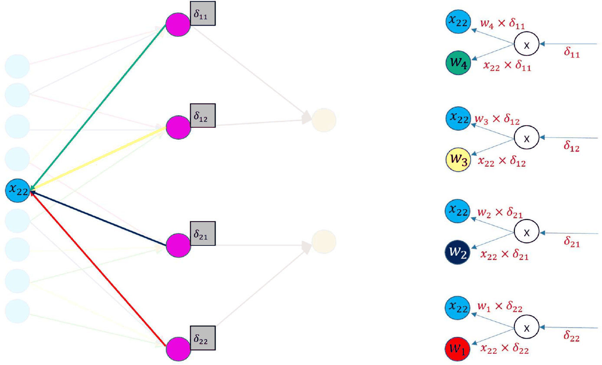

$$\frac{\partial L}{\partial x_{22}} = w_4\delta_{11} + w_3\delta_{12} + w_2\delta_{21} + w_1\delta_{22}$$

$\delta$ 의 첨자가 $11 \to 22$ 로 오르는 동안 $w$ 의 번호가 $4 \to 1$ 로 내린다. 27번의 다섯 줄에서 본 뒤집힘이 2차원에서 명시적으로 나타난다. 3×3 입력의 한가운데 칸은 2×2 커널이 지나가는 네 자리 전부에 들어가므로 항이 넷이다.

34번이 아홉 칸 전부를 한 장에 그린다.

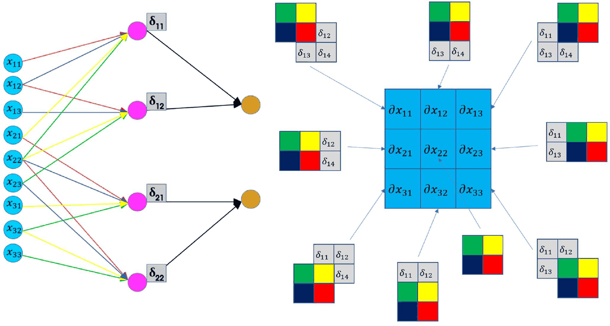

왼쪽 그래프의 출력 네 개에는 $\delta_{11}$ · $\delta_{12}$ · $\delta_{21}$ · $\delta_{22}$ 라고 적혀 있다. 오른쪽에서 각 $\partial x_{ij}$ 로 들어가는 타일 아홉 개에는 $\delta_{11}$ · $\delta_{12}$ · **$\delta_{13}$** · **$\delta_{14}$** 가 적혀 있다.

> [!warning] 원본 오류 — 34번이 같은 네 값을 두 이름으로 부른다
> 한 장 안에서, 같은 네 개의 출력 기울기가 왼쪽에서는 **2차원 첨자**($\delta_{11}\,\delta_{12}\,\delta_{21}\,\delta_{22}$), 오른쪽에서는 **1차원 나열**($\delta_{11}\,\delta_{12}\,\delta_{13}\,\delta_{14}$)로 표기된다. 바로 앞 33번은 2차원 첨자로 일관하므로, 어긋나는 것은 34번 오른쪽뿐이다.
>
> 이 과목에서 같은 값이 두 이름을 갖는 것은 네 번째다 — `Perceptron (이론)` 55~60번의 $w$ 번호([03. 다섯 장에 걸쳐 XOR을 쌓는 동안 이름이 두 번 바뀌고 부호가 한 번 틀린다](<./03. 다섯 장에 걸쳐 XOR을 쌓는 동안 이름이 두 번 바뀌고 부호가 한 번 틀린다.md>)), `Backpropagation` 55~70번과 71번의 회로 이름표([07. 54번이 답을 먼저 주고, 덱은 그 답을 쓰지 않고 열여섯 장을 간다](<./07. 54번이 답을 먼저 주고, 덱은 그 답을 쓰지 않고 열여섯 장을 간다.md>)), `Perceptron (이론)` 29·30번의 데이터셋([02. 예측을 먼저 보여 주고, 그 예측이 나오지 않는 모델을 보여 준다](<./02. 예측을 먼저 보여 주고, 그 예측이 나오지 않는 모델을 보여 준다.md>)), 그리고 이것이다.

오른쪽 아홉 타일은 그 자체로 정확하다. 각 $\partial x_{ij}$ 마다 $\delta$ 맵과 커널이 겹치는 부분만 남고, 모서리 칸은 한 항, 가운데 칸은 네 항이 된다 — 27번 다섯 줄의 2차원판이다.

---

## 덱의 두 부분

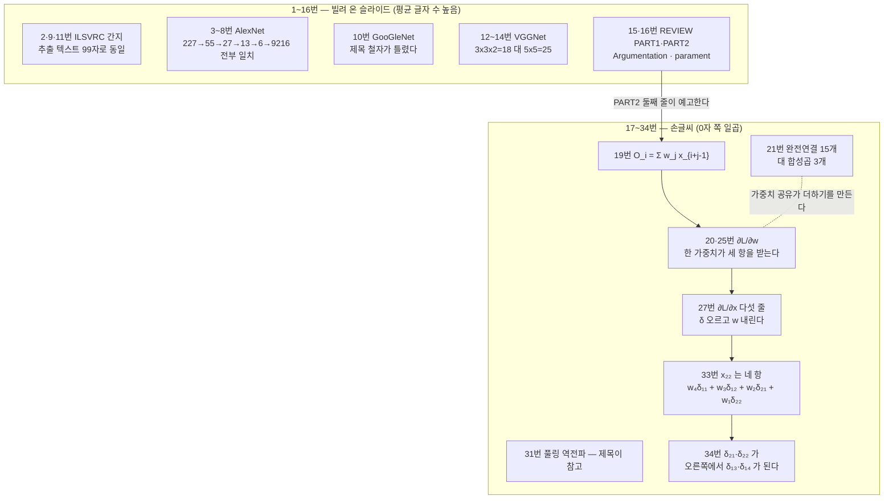

---

## 근거 자료

`CNN Backpropagation(이론).pdf` 34쪽 **전체**. 텍스트가 0자인 7 · 8 · 21 · 30 · 32 · 33 · 34번과 40자 미만인 17 · 29 · 31번은 130 dpi 렌더 이미지를 직접 읽었다.

- 2 · 9 · 11번 — ILSVRC 간지, 추출 텍스트 99자 동일
- 3~6번 — AlexNet 8층, `[11 x 11 x 3] x 48 (S4/P0)` 부터 `6 x 6 x 256 = 9216` 까지, `Ref) https://bskyvision.com/425`
- 4번 — 「TanH함수를 사용할 때마다 6배 빠름」 · Dropout
- 5번 — 「3x3 Overlapping pooling (Stride = 2)」 · Data augmentation
- 8번 — AlexNet 예측 그림, 제목·캡션·출처 없음
- 10번 — `GooGleNet(2014)`, 「총 22개 layer」, `Ref) https://bskyvision.com/539`
- 12~14번 — VGG-16, 「3x3x2=18개, 5x5=25개」, `3 x 3 x 3 x 64 (S1/P1)` · `112 x 112 x 64`, `Ref) https://bskyvision.com/504`
- 15·16번 — REVIEW PART1(7항목) · PART2(5항목), `Data Argumentation` · `Hyper-parament Control` · `Ablation Works`
- 19번 — $O_i = \sum_j w_j x_{i+j-1}$, 25번에 $\sum_{j=1}^{3}$ 와 $(i=1,2,3)$
- 20 · 25번 — $\partial L/\partial w_1$ · $\partial L/\partial w_3$
- 21번 — $W_{11}$~$W_{53}$ 완전연결과 「서로 다른 weights」
- 27 · 28번 — $\partial L/\partial x_1$ ~ $\partial L/\partial x_5$ 다섯 줄
- 30번 — `HONEYCAM` 워터마크
- 31번 — 평균·맥스 풀링 역전파, 제목 「참고」
- 32 · 33번 — 곱셈 게이트, $\partial L/\partial x_{22}$ 네 항
- 34번 — 아홉 개의 $\partial x_{ij}$ 타일, 왼쪽 $\delta_{21}\,\delta_{22}$ 대 오른쪽 $\delta_{13}\,\delta_{14}$

AlexNet 과 VGG 의 형상은 출력 크기 공식으로 파이썬에서 재계산해 인쇄된 값과 대조했다. 인터랙티브 두 개는 19번의 연결 규칙($O_i$ 가 $x_{i+j-1}$ 와 $w_j$ 를 짝짓는다)만으로 연결과 기울기 식을 그 자리에서 만든다.

---

## 이어지는 문서

- [08. 덱이 약속만 하고 넘어간 절은 공책에 있다](<./08. 덱이 약속만 하고 넘어간 절은 공책에 있다.md>) — 4주차까지의 판서. 「5주차 이후의 판서는 없다」던 그 노트가 틀렸음이 여기서 드러난다
- [06. 곱셈 게이트의 국소 기울기는 상대방의 값이다](<./06. 곱셈 게이트의 국소 기울기는 상대방의 값이다.md>) — 20·32·33번이 쓰는 규칙이 처음 나온 곳
- [15. 같은 불평이 세 이름으로 세 번 나온다](<./15. 같은 불평이 세 이름으로 세 번 나온다.md>) — 21번 종이가 15 대 3 으로 답하는 그 주장이 제기된 곳
- [16. 검산되는 예제와 검산할 수 없는 예제](<./16. 검산되는 예제와 검산할 수 없는 예제.md>) — 31번의 풀링 역전파가 갚는 빚이 거기 있다
- [19. 파란 상자는 다섯이라 쓰고 표에는 넷이 있다](<./19. 파란 상자는 다섯이라 쓰고 표에는 넷이 있다.md>) — 같은 블로그(bskyvision)에서 온 병목 슬라이드
