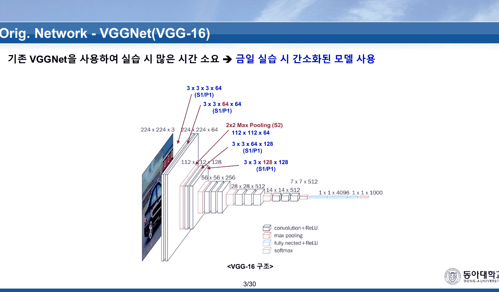
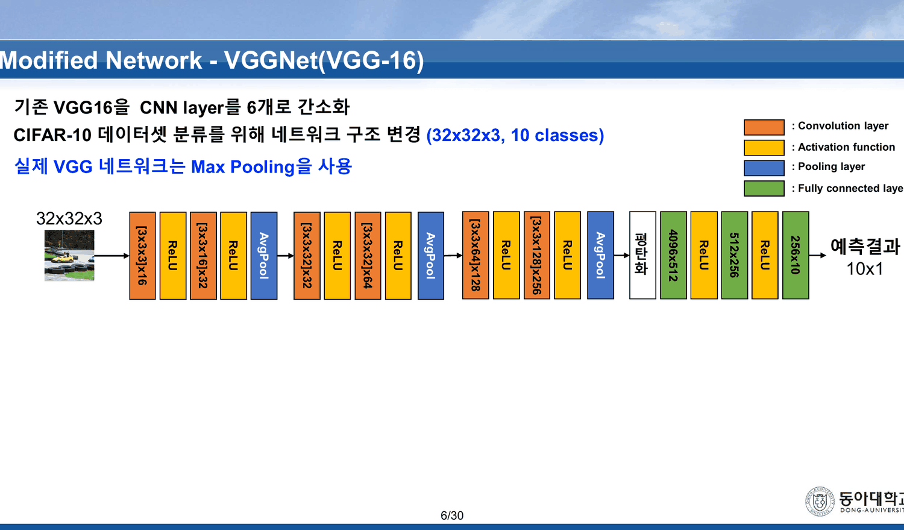
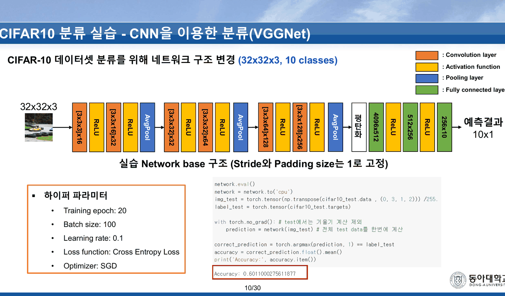
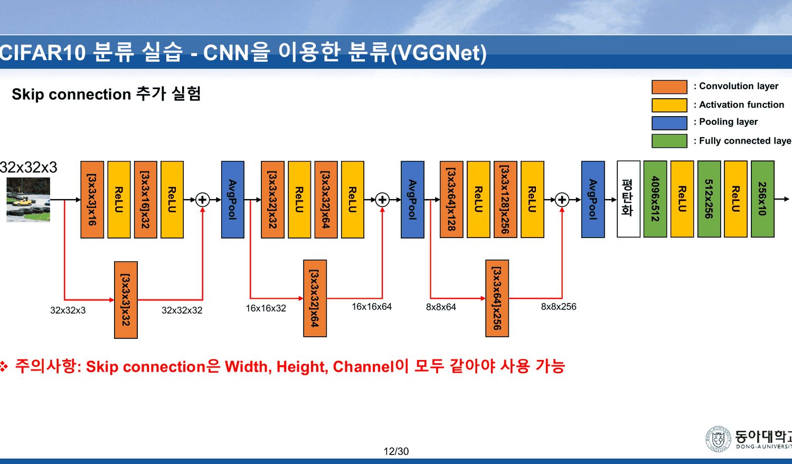
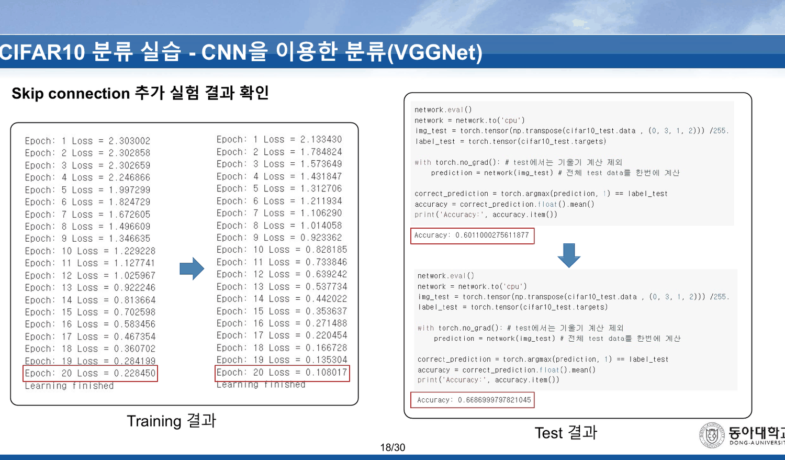
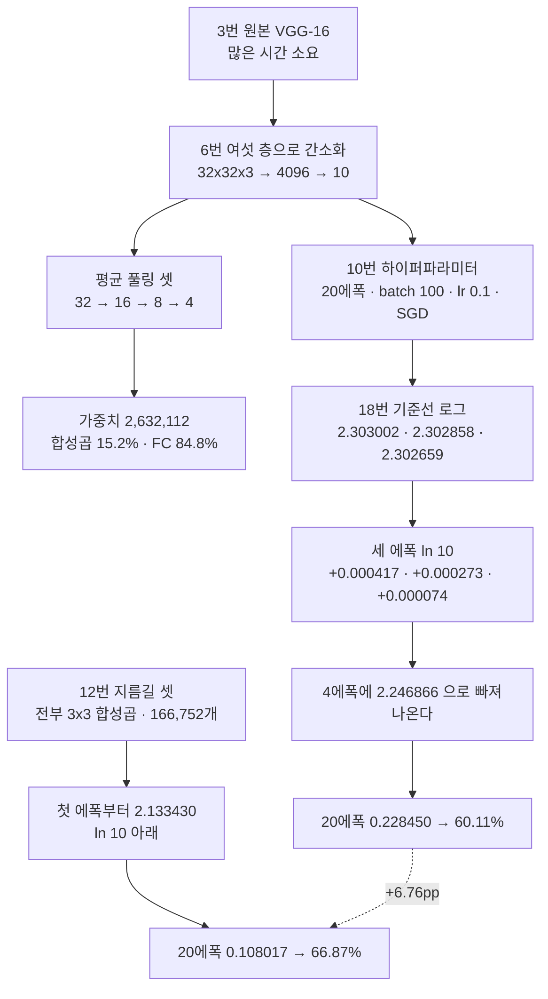

[14. 다섯 층을 쌓으면 손실이 ln 10 에 붙는다](<./14. 다섯 층을 쌓으면 손실이 ln 10 에 붙는다.md>)는 시그모이드 다섯 층이 열다섯 에폭 내내 $\ln 10 = 2.302585$ 위 0.000372 에 멈춰 있는 것을 보고 끝났다. 그 노트가 남긴 질문은 이것이었다 — **ReLU 로 다섯 층까지는 갔다. 그보다 깊어지면?**

12주차 실습이 답한다. 여섯 층이고, 전부 ReLU 이고, 손실 로그의 첫 세 줄이 이렇다.

> Epoch: 1 Loss = **2.303002**
> Epoch: 2 Loss = **2.302858**
> Epoch: 3 Loss = **2.302659**

같은 자리다. 다른 것은 **네 번째 에폭에 빠져나온다**는 것이다.

---

## 3~5번 — 원본은 너무 오래 걸린다

3번이 VGG-16 의 앞부분을 그리고 한 줄을 붙인다.



> 「기존 VGGNet을 사용하여 실습 시 많은 시간 소요 → 금일 실습 시 간소화된 모델 사용」

4·5번은 `torch.nn.Conv2d` 의 다섯 인자를 설명하는 장이고, 11주차 실습 덱 12·13번과 같은 장이다([23. LeNet-5의 가중치 95퍼센트는 합성곱 바깥에 있다](<./23. LeNet-5의 가중치 95퍼센트는 합성곱 바깥에 있다.md>)). 예제도 같다 — `nn.Conv2d(in_channels=6, out_channels=16, kernel_size=5, stride=1, padding=0)`, 즉 LeNet-5 의 C5 직전 층이다. 이번 주에 쓸 모델은 3×3 만 쓰는데 예제는 5×5 인 채로 남아 있다.

---

## 6번 — 여섯 층으로 줄인 VGG



> · 기존 VGG16을 CNN layer를 6개로 간소화
> · CIFAR-10 데이터셋 분류를 위해 네트워크 구조 변경 (32x32x3, 10 classes)
> · **실제 VGG 네트워크는 Max Pooling을 사용**

세 번째 줄이 중요하다. 이 모델은 **평균 풀링**을 쓰고, 슬라이드가 그것을 스스로 밝힌다. 11주차 덱이 평균 풀링을 보여 준 것은 35번 한 장뿐이었고 그 장에서 네 칸 중 둘이 소수를 잃었다([16. 검산되는 예제와 검산할 수 없는 예제](<./16. 검산되는 예제와 검산할 수 없는 예제.md>)).

형상을 따라가면 이렇다. 스트라이드와 패딩은 8번이 「1로 고정」이라 못 박으므로 합성곱은 크기를 바꾸지 않고, 평균 풀링 셋이 절반씩 줄인다.

| 단계 | 필터 | 출력 |
| --- | --- | --- |
| 입력 | | 32×32×3 |
| Conv → ReLU | `[3x3x3]x16` | 32×32×16 |
| Conv → ReLU | `[3x3x16]x32` | 32×32×32 |
| AvgPool | | 16×16×32 |
| Conv → ReLU | `[3x3x32]x32` | 16×16×32 |
| Conv → ReLU | `[3x3x32]x64` | 16×16×64 |
| AvgPool | | 8×8×64 |
| Conv → ReLU | `[3x3x64]x128` | 8×8×128 |
| Conv → ReLU | `[3x3x128]x256` | 8×8×256 |
| AvgPool | | 4×4×256 |
| 평탄화 | | **4096** |
| FC → ReLU | `4096x512` | 512 |
| FC → ReLU | `512x256` | 256 |
| FC | `256x10` | 10×1 |

$4 \times 4 \times 256 = 4096$ — 슬라이드의 `4096x512` 와 맞는다. 세 번의 절반 줄이기가 32 를 4 로 만들고, 채널이 3 에서 256 으로 늘어난다.

그리고 여기서 [17. 슬라이드 10이 약속한 절약을 슬라이드 63이 취소한다](<./17. 슬라이드 10이 약속한 절약을 슬라이드 63이 취소한다.md>)의 문제를 다시 볼 수 있다.

```html preview
<div id="pw" style="font-family:system-ui,-apple-system,sans-serif;color:var(--foreground);background:var(--card);border:1px solid var(--border);border-radius:12px;padding:18px 16px;">
  <p style="margin:0 0 14px;font-size:13px;color:var(--muted-foreground);line-height:1.75;">
    6번 그림에 적힌 아홉 층의 가중치를 센다. 막대 길이는 개수에 비례한다(바이어스 제외).</p>
  <svg id="ps2" viewBox="0 0 640 316" style="width:100%;height:auto;display:block;"></svg>
  <div id="po2" style="margin-top:10px;font-size:13.5px;line-height:1.95;"></div>
</div>
<script>
(function(){
  const NS='http://www.w3.org/2000/svg', svg=document.getElementById('ps2');
  const el=(t,a,x)=>{const e=document.createElementNS(NS,t);for(const k in a)e.setAttribute(k,a[k]);
    if(x!==undefined)e.textContent=x;return e;};
  // 6번 슬라이드에 인쇄된 표기 그대로
  const L=[{n:'[3x3x3]x16',    v:3*3*3*16,   k:'conv'},
           {n:'[3x3x16]x32',   v:3*3*16*32,  k:'conv'},
           {n:'[3x3x32]x32',   v:3*3*32*32,  k:'conv'},
           {n:'[3x3x32]x64',   v:3*3*32*64,  k:'conv'},
           {n:'[3x3x64]x128',  v:3*3*64*128, k:'conv'},
           {n:'[3x3x128]x256', v:3*3*128*256,k:'conv'},
           {n:'4096x512',      v:4096*512,   k:'fc'},
           {n:'512x256',       v:512*256,    k:'fc'},
           {n:'256x10',        v:256*10,     k:'fc'}];
  const tot=L.reduce((s,r)=>s+r.v,0);
  const conv=L.filter(r=>r.k==='conv').reduce((s,r)=>s+r.v,0);
  const fc=tot-conv, max=Math.max(...L.map(r=>r.v));
  const X=150,W=380,T=34,H=26;
  svg.appendChild(el('text',{x:X-10,y:20,'text-anchor':'end','font-size':11.5,
    fill:'var(--muted-foreground)','font-weight':700},'층'));
  svg.appendChild(el('text',{x:X,y:20,'font-size':11.5,fill:'var(--muted-foreground)','font-weight':700},
    '가중치 개수 (선형 눈금)'));
  L.forEach((r,i)=>{
    const y=T+i*H, c=r.k==='conv'?'var(--chart-1)':'var(--chart-2)';
    svg.appendChild(el('text',{x:X-10,y:y+13,'text-anchor':'end','font-size':11.5,
      fill:c,'font-family':'ui-monospace,monospace'},r.n));
    svg.appendChild(el('rect',{x:X,y:y+1,width:Math.max(1.5,W*r.v/max),height:16,rx:3,
      fill:c,opacity:0.85}));
    svg.appendChild(el('text',{x:X+Math.max(1.5,W*r.v/max)+8,y:y+13,'font-size':11.5,
      fill:'var(--foreground)','font-variant-numeric':'tabular-nums'},
      r.v.toLocaleString()+'  ('+(r.v/tot*100).toFixed(1)+'%)'));
  });
  const BY=T+9*H+22;
  svg.appendChild(el('text',{x:X-10,y:BY+14,'text-anchor':'end','font-size':11.5,
    fill:'var(--muted-foreground)','font-weight':700},'합계'));
  svg.appendChild(el('rect',{x:X,y:BY+2,width:W*conv/tot,height:16,rx:0,fill:'var(--chart-1)',opacity:0.85}));
  svg.appendChild(el('rect',{x:X+W*conv/tot,y:BY+2,width:W*fc/tot,height:16,rx:0,fill:'var(--chart-2)',opacity:0.85}));
  svg.appendChild(el('text',{x:X+W+10,y:BY+14,'font-size':12,fill:'var(--foreground)',
    'font-variant-numeric':'tabular-nums','font-weight':700},tot.toLocaleString()));
  svg.appendChild(el('text',{x:X+4,y:BY+30,'font-size':11,fill:'var(--chart-1)','font-weight':700},
    '합성곱 여섯 층 '+conv.toLocaleString()+' — '+(conv/tot*100).toFixed(1)+'%'));
  svg.appendChild(el('text',{x:X+W,y:BY+30,'text-anchor':'end','font-size':11,
    fill:'var(--chart-2)','font-weight':700},'FC 세 층 '+fc.toLocaleString()+' — '+(fc/tot*100).toFixed(1)+'%'));
  document.getElementById('po2').innerHTML =
    '여섯 층의 합성곱이 <b>'+(conv/tot*100).toFixed(1)+'%</b>, 세 층의 FC 가 <b>'+(fc/tot*100).toFixed(1)+'%</b> 다. '+
    '<code>4096x512</code> 한 층만으로 전체의 '+(4096*512/tot*100).toFixed(1)+'% 다.<br>'+
    '<span style="color:var(--muted-foreground);font-size:12.5px;">'+
    '11주차 10번이 「CNN에 비해 필요한 weight parameter의 개수가 많음」이라며 FC 를 비난했다. '+
    '12주차가 실제로 돌리는 CNN 에서도 무게의 대부분은 여전히 FC 에 있다 — '+
    '다만 평균 풀링 셋이 평탄화 지점을 4×4 로 줄여 놓아서, 그 FC 가 '+(4096*512).toLocaleString()+
    ' 에서 멈춘다. 풀링이 없었다면 32×32×256 = '+(32*32*256).toLocaleString()+' 개가 평탄화되어 '+
    '첫 FC 하나가 '+(32*32*256*512).toLocaleString()+' 개가 된다.</span>';
})();
</script>
```

여섯 층의 합성곱이 401,328 개, 세 층의 FC 가 2,230,784 개다. **84.8% 가 여전히 FC 에 있다.** 다만 평균 풀링 셋이 평탄화 지점을 4×4 로 줄여 놓았기 때문에 그 FC 가 200만 개에서 멈춘다 — 풀링이 없었다면 첫 FC 하나가 1억 3천만 개가 된다. 11주차 63번이 풀링 없이 그린 예시가 폭발한 이유가 이것이다.

---

## 10번 — 하이퍼파라미터 여섯 줄



| | |
| --- | --- |
| Training epoch | 20 |
| Batch size | 100 |
| Learning rate | **0.1** |
| Loss function | Cross Entropy Loss |
| Optimizer | SGD |

`lr = 0.1` 이 또 나온다. 이 값은 이 과목에서 5주차부터 굳어져 있다 — `MLP(실습)` · `Vanishing Gradient` · `Overfitting` · `Optimizer` · 그리고 중간고사까지 전부 0.1 이다. [11. 여섯 장을 들여 더 좋은 옵티마이저를 소개하고, 실습 결과는 전부 더 나쁘다](<./11. 여섯 장을 들여 더 좋은 옵티마이저를 소개하고, 실습 결과는 전부 더 나쁘다.md>)가 지적했듯 Adam 에 0.1 을 준 자리에서는 그것이 사고였지만, SGD 에서는 정상 범위다.

그리고 「Learning rate decay」가 **없다.** 7주차 `CIFAR10 (실습)` 과 중간고사는 10에폭마다 ×0.1 을 걸었고([24. 시험은 합성곱을 묻지 않는다](<./24. 시험은 합성곱을 묻지 않는다.md>)), 12주차는 20에폭 내내 0.1 을 고정한다.

---

## 12~17번 — 지름길 셋



슬라이드 아래에 주의 한 줄이 붙는다.

> **주의사항: Skip connection은 Width, Height, Channel이 모두 같아야 사용 가능**

그래서 이 실습의 지름길은 **항등 사상이 아니다.** 세 지름길이 전부 합성곱이다.

| 지름길 | 입력 → 출력 | 필터 | 가중치 |
| --- | --- | --- | ---: |
| 1 | 32×32×3 → 32×32×32 | `[3x3x3]x32` | 864 |
| 2 | 16×16×32 → 16×16×64 | `[3x3x32]x64` | 18,432 |
| 3 | 8×8×64 → 8×8×256 | `[3x3x64]x256` | 147,456 |
| | | **합** | **166,752** |

166,752 개는 본선 합성곱 여섯 층(401,328)의 **41.6%** 다. 지름길 하나가 본선 앞 네 층을 합친 것(32,688)보다 네 배 이상 크다.

> [!note] 3×3 대신 1×1 이면
> 차원을 맞추는 것만이 목적이라면 1×1 합성곱으로 충분하다. 같은 세 지름길을 1×1 로 하면 96 + 2,048 + 16,384 = **18,528** 개 — 지금의 **9분의 1** 이다.
>
> 12주차 이론 덱 33번이 바로 그 이야기를 했다. 「1x1 컨볼루션 사용 → feature map의 개수를 줄이는 목적으로 사용」([19. 파란 상자는 다섯이라 쓰고 표에는 넷이 있다](<./19. 파란 상자는 다섯이라 쓰고 표에는 넷이 있다.md>)). 같은 주의 실습이 차원을 맞추는 자리에서 3×3 을 쓴다. 이론이 든 예(5×5 앞의 1×1)와 여기(차원 맞추기)는 다른 용도이지만, 슬라이드는 두 장을 잇지 않는다. (이 비교는 원본 밖의 보충이다.)

13~17번이 코드를 다섯 장에 걸쳐 보여 준다 — 지름길 합성곱 선언(13·16번), 입력 저장(15번), 적용(14·17번). 15번의 주석이 「Skip connection적용을 위해 Conv. 입력 저장」, 16번이 「Width, Height, Channel을 맞춰 주기 위한 Conv. 적용」이다.

---

## 18번 — 세 에폭



```html preview
<div id="ln10" style="font-family:system-ui,-apple-system,sans-serif;color:var(--foreground);background:var(--card);border:1px solid var(--border);border-radius:12px;padding:18px 16px;">
  <p style="margin:0 0 12px;font-size:13px;color:var(--muted-foreground);line-height:1.75;">
    18번에 인쇄된 마흔 줄을 그대로 옮긴다. 점선은 <b>ln 10 = 2.302585</b> — 열 클래스를 균등하게 찍었을 때의 교차 엔트로피다.</p>
  <div style="margin:8px 0 12px;">
    <label style="font-size:12.5px;color:var(--muted-foreground);">세로 눈금 &nbsp;</label>
    <select id="zm" style="font-size:13px;padding:3px 6px;border:1px solid var(--border);border-radius:6px;background:var(--card);color:var(--foreground);">
      <option value="0">전체 (0 ~ 2.4)</option>
      <option value="1">ln 10 부근 확대 (2.3025 ~ 2.3031)</option>
    </select>
  </div>
  <svg id="ls3" viewBox="0 0 640 250" style="width:100%;height:auto;display:block;"></svg>
  <div id="lo3" style="margin-top:10px;font-size:13.5px;line-height:1.95;"></div>
</div>
<script>
(function(){
  const NS='http://www.w3.org/2000/svg', svg=document.getElementById('ls3');
  const el=(t,a,x)=>{const e=document.createElementNS(NS,t);for(const k in a)e.setAttribute(k,a[k]);
    if(x!==undefined)e.textContent=x;return e;};
  const BASE=[2.303002,2.302858,2.302659,2.246866,1.997299,1.824729,1.672605,1.496609,1.346635,
              1.229228,1.127741,1.025967,0.922246,0.813664,0.702598,0.583456,0.467354,0.360702,
              0.284199,0.228450];
  const SKIP=[2.133430,1.784824,1.573649,1.431847,1.312706,1.211934,1.106290,1.014058,0.923362,
              0.828185,0.733846,0.639242,0.537734,0.442022,0.353637,0.271488,0.220454,0.166728,
              0.135304,0.108017];
  const LN10=Math.log(10);
  const L=72,R=608,T=16,B=196;
  function draw(zoom){
    while(svg.firstChild) svg.removeChild(svg.firstChild);
    const lo = zoom? 2.30250 : 0, hi = zoom? 2.30310 : 2.40;
    const sx=i=>L+i/19*(R-L), sy=v=>B-(v-lo)/(hi-lo)*(B-T);
    const ticks = zoom? [2.3025,2.30265,2.3028,2.30295,2.3031] : [0,0.5,1.0,1.5,2.0];
    ticks.forEach(g=>{
      svg.appendChild(el('line',{x1:L,y1:sy(g),x2:R,y2:sy(g),stroke:'var(--border)',opacity:0.55}));
      svg.appendChild(el('text',{x:L-8,y:sy(g)+4,'text-anchor':'end','font-size':9.5,
        fill:'var(--muted-foreground)'},zoom?g.toFixed(5):g.toFixed(1)));
    });
    svg.appendChild(el('line',{x1:L,y1:sy(LN10),x2:R,y2:sy(LN10),stroke:'var(--chart-2)',
      'stroke-width':1.6,'stroke-dasharray':'6 4'}));
    svg.appendChild(el('text',{x:R,y:sy(LN10)-6,'text-anchor':'end','font-size':11,
      fill:'var(--chart-2)','font-weight':700},'ln 10 = 2.302585'));
    [[BASE,'var(--muted-foreground)','기준선 — 20에폭 0.228450 · 60.11%'],
     [SKIP,'var(--chart-1)','Skip connection — 0.108017 · 66.87%']].forEach(([arr,col,nm],k)=>{
      let d='', drawn=0;
      arr.forEach((v,i)=>{ if(v>=lo&&v<=hi){ d+=(drawn?'L':'M')+sx(i)+' '+sy(v); drawn++; } else { d+=''; }});
      if(drawn) svg.appendChild(el('path',{d:d,fill:'none',stroke:col,'stroke-width':2.2}));
      arr.forEach((v,i)=>{ if(v>=lo&&v<=hi)
        svg.appendChild(el('circle',{cx:sx(i),cy:sy(v),r:3,fill:col})); });
      svg.appendChild(el('text',{x:L+6,y:T+14+k*16,'font-size':11.5,fill:col,'font-weight':700},nm));
    });
    [0,4,9,14,19].forEach(i=>svg.appendChild(el('text',{x:sx(i),y:B+16,'text-anchor':'middle',
      'font-size':10,fill:'var(--muted-foreground)'},'ep '+(i+1))));
    const d1=BASE.slice(0,3).map(v=>(v-LN10));
    document.getElementById('lo3').innerHTML = zoom
      ? '확대하면 기준선의 앞 세 점만 화면에 남는다 — ln 10 위 <b>'+d1.map(v=>v.toFixed(6)).join(' · ')+
        '</b> 이고 세 에폭 동안 <b>'+(d1[0]-d1[2]).toFixed(6)+'</b> 만 내려간다.<br>'+
        '<span style="color:var(--muted-foreground);font-size:12.5px;">'+
        '스킵 연결의 첫 점 2.133430 은 이미 ln 10 <b>아래</b>라 이 눈금에 들어오지 않는다.</span>'
      : '기준선은 네 번째 에폭(2.246866)에서 처음 ln 10 아래로 내려온다. 그 뒤 열일곱 에폭은 단조 감소다.<br>'+
        '<span style="color:var(--muted-foreground);font-size:12.5px;">'+
        '스킵 연결은 첫 에폭부터 2.133430 — <b>한 번도 ln 10 에 앉지 않는다.</b> '+
        '두 로그 모두 스무 줄 전부 단조 감소이고, 마지막 값의 비는 '+(BASE[19]/SKIP[19]).toFixed(2)+'배다.</span>';
  }
  document.getElementById('zm').addEventListener('change',e=>draw(+e.target.value));
  draw(0);
})();
</script>
```

기준선의 첫 세 줄을 $\ln 10$ 과 빼면 이렇다.

| 에폭 | 손실 | $-\ln 10$ |
| ---: | ---: | ---: |
| 1 | 2.303002 | +0.000417 |
| 2 | 2.302858 | +0.000273 |
| 3 | 2.302659 | **+0.000074** |
| 4 | 2.246866 | −0.055719 |

세 번째 에폭이 $\ln 10$ 위 **0.000074** — 이 과목에서 인쇄된 손실 가운데 $\ln 10$ 에 두 번째로 가까운 값이다(가장 가까운 것은 채널 어텐션 실행의 네 번째 에폭이고, [22. 훈련 손실 1등과 시험 정확도 1등이 다르다](<./22. 훈련 손실 1등과 시험 정확도 1등이 다르다.md>)에 있다).

> [!important] 13·14번 노트의 질문에 대한 답
> [13. 덱은 1을 양쪽에서 배제한다](<./13. 덱은 1을 양쪽에서 배제한다.md>)와 [14. 다섯 층을 쌓으면 손실이 ln 10 에 붙는다](<./14. 다섯 층을 쌓으면 손실이 ln 10 에 붙는다.md>)가 본 것은 **시그모이드** 다섯 층이었다. 열다섯 에폭 내내 $\ln 10$ 위 0.000372 에 머물렀고 정확도는 11.35%(= 1/10)였다. 빠져나오지 못했다.
>
> 여기는 **ReLU** 여섯 층이다. 같은 자리에 **세 에폭만** 앉아 있다가 네 번째에 빠져나온다. 같은 증상이 나타나되 지속되지 않는다는 것 — 13번 슬라이드가 「ReLU 계열을 쓰면 해결된다」고 한 말이 여기서 부분적으로 확인된다. 완전히 사라지지는 않았다.
>
> 그리고 **스킵 연결은 그 세 에폭을 통째로 없앤다.** 첫 에폭이 2.133430 으로 이미 $\ln 10$ 아래다. 12주차 이론 14번이 「깊은 모델의 성능이 더 떨어지는 것을 확인」이라며 제시한 문제의 해법이, 20에폭짜리 CIFAR-10 실습에서 **첫 세 에폭을 벌어 주는 것**으로 나타난다.

시험 정확도는 이렇다.

| | 20에폭 훈련 손실 | 시험 정확도 |
| --- | ---: | ---: |
| 기준선 | 0.228450 | `0.6011000275611877` → **60.11%** |
| Skip connection | 0.108017 | `0.6686999797821045` → **66.87%** |

**+6.76pp** 다. 훈련 손실도 절반 아래(0.228450 → 0.108017)로 내려간다. 이번에는 훈련과 시험이 같은 방향을 가리킨다 — [11. 여섯 장을 들여 더 좋은 옵티마이저를 소개하고, 실습 결과는 전부 더 나쁘다](<./11. 여섯 장을 들여 더 좋은 옵티마이저를 소개하고, 실습 결과는 전부 더 나쁘다.md>)의 다섯 실행에서는 두 순위가 정확히 역순이었다. 같은 덱의 다음 두 실험에서 다시 어긋난다([22. 훈련 손실 1등과 시험 정확도 1등이 다르다](<./22. 훈련 손실 1등과 시험 정확도 1등이 다르다.md>)).

슬라이드에는 이 숫자들에 대한 해설이 **한 줄도 없다.** 제목이 「Skip connection 추가 실험 결과 확인」이고, 로그 두 뭉치와 화살표 하나와 `Accuracy:` 두 줄이 전부다. 60.11 과 66.87 을 나란히 적은 문장도, ln 10 에 대한 언급도 없다.

---

## 여기까지의 지도



---

## 근거 자료

`VGGNet (실습).pdf` 34쪽 중 **1~18번**.

- 3번 — VGG-16 구조와 「기존 VGGNet을 사용하여 실습 시 많은 시간 소요」
- 4·5번 — `nn.Conv2d` 다섯 인자, `in_channels=6, out_channels=16, kernel_size=5, stride=1, padding=0`
- 6번 — 아홉 층 표기 `[3x3x3]x16` ~ `256x10`, AvgPool 세 개, 「실제 VGG 네트워크는 Max Pooling을 사용」
- 8번 — 「Stride와 Padding size는 1로 고정」 (8번과 9번은 같은 장이다)
- 10번 — Training epoch 20 · Batch size 100 · Learning rate 0.1 · Cross Entropy Loss · SGD
- 12번 — 지름길 `[3x3x3]x32` · `[3x3x32]x64` · `[3x3x64]x256`, 경유 형상 `32x32x32` · `16x16x32` · `16x16x64` · `8x8x64` · `8x8x256`, 주의사항 한 줄
- 13~17번 — 지름길 코드 다섯 장
- 18번 — 두 손실 로그 각 20줄, `Accuracy: 0.6011000275611877` · `Accuracy: 0.6686999797821045`

가중치 개수와 형상은 6번·12번에 인쇄된 필터 표기만으로 파이썬에서 재계산했다. 손실 로그 마흔 줄은 슬라이드 이미지를 170 dpi 로 따로 렌더해 한 줄씩 옮겨 적었고, $\ln 10$ 과의 차는 배정밀도로 계산했다. 1×1 지름길의 18,528 은 원본에 없는 보충 계산이며 본문에 그렇게 표시했다.

---

## 이어지는 문서

- [14. 다섯 층을 쌓으면 손실이 ln 10 에 붙는다](<./14. 다섯 층을 쌓으면 손실이 ln 10 에 붙는다.md>) — 이 실험이 답하는 질문이 거기서 나왔다
- [22. 훈련 손실 1등과 시험 정확도 1등이 다르다](<./22. 훈련 손실 1등과 시험 정확도 1등이 다르다.md>) — 같은 덱 19~34번. 남은 두 실험과 조합 실험
- [18. 열 장 중 여덟 장이 지난주 덱 그대로다](<./18. 열 장 중 여덟 장이 지난주 덱 그대로다.md>) — 같은 주 이론. 14~20번의 스킵 연결이 여기서 코드가 된다
- [17. 슬라이드 10이 약속한 절약을 슬라이드 63이 취소한다](<./17. 슬라이드 10이 약속한 절약을 슬라이드 63이 취소한다.md>) — 평탄화 지점이 왜 중요한지
- [24. 시험은 합성곱을 묻지 않는다](<./24. 시험은 합성곱을 묻지 않는다.md>) — 60.11% 가 중간고사의 56% 와 나란히 놓이는 자리
