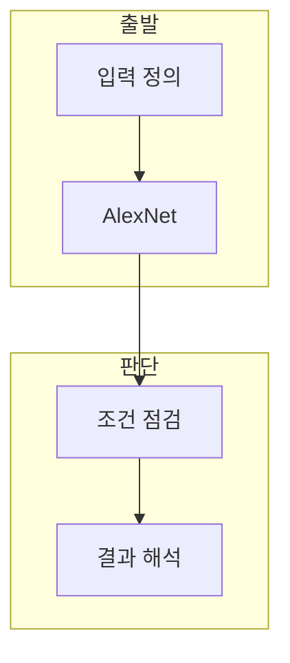

> [!abstract] 한 줄 요약
> CNN Backpropagation - AlexNet 구조은 CNN 구조와 역전파 연결를 학습 과정의 입력, 계산, 검증 관점으로 구분해 이해하는 노트다.

## 이 노트의 지도



## 1. CNN 구조와 역전파 연결의 역할

강의 주제는 모델이 처리할 입력과 중간 표현을 연결해 CNN 구조와 역전파 연결의 역할을 설명한다. ==AlexNet== 는 합성곱 기반 분류 네트워크 구조.

> [!important] 판단의 출발점
> 목적·입력·정답 또는 평가 기준을 함께 적어야 같은 용어를 다른 문제에 잘못 적용하지 않는다.

## 2. 학습과 검증의 연결

계산 단계의 값은 단독 결론이 아니라 모델 설정과 평가 절차 안에서 해석한다.

<Tabs>
  <Tab label="구성">AlexNet이 모델 내부에서 맡는 역할을 먼저 확인한다.</Tab>
  <Tab label="검증">결과를 정답·손실·평가 기준과 함께 점검한다.</Tab>
</Tabs>

<details>
<summary>확인 순서</summary>

입력 형상 또는 조건을 확인하고, 계산 결과를 기록한 뒤 정답·손실·평가 기준 중 해당하는 기준으로 해석한다.

</details>

<details>
<summary>선택과 비교</summary>

두 방식의 차이는 입력, 갱신 규칙, 평가 기준을 같은 조건에서 비교해 판단한다.

</details>

## 데이터로 보기

```html preview
<div style="font-family:system-ui,sans-serif;padding:20px">
  <div id="cards" style="display:flex;gap:14px;flex-wrap:wrap"></div>
  <script>
    var stats = [
      ['입력', '입력', '조건 정의', 'var(--chart-1)'],
      ['표현', '계산', '모델 처리', 'var(--chart-2)'],
      ['평가', '검증', '결과 점검', 'var(--chart-3)']
    ];
    document.getElementById('cards').innerHTML = stats.map(function (s) {
      return '<div style="flex:1;min-width:150px;padding:16px;background:var(--card);' +
        'color:var(--card-foreground);border:1px solid var(--border);' +
        'border-radius:var(--radius)">' +
        '<div style="font-size:13px;color:var(--muted-foreground)">' + s[0] + '</div>' +
        '<div style="font-size:26px;font-weight:700;margin-top:4px">' + s[1] + '</div>' +
        '<div style="font-size:12px;font-weight:600;margin-top:4px;color:' + s[3] + '">' + s[2] + '</div>' +
        '</div>';
    }).join('');
  </script>
</div>
```

> [!warning] 과해석의 한계
> 단일 예시나 설정 하나만으로 모델의 일반 성능을 단정하지 않는다.

## 핵심 정리

| 개념 | 정의 | 학습 판단 |
| :-- | :-- | :-- |
| AlexNet | 합성곱 기반 분류 네트워크 구조 | 핵심 역할을 구분한다 |
| AlexNet | 학습 과정의 계산 단계 | 설정과 갱신을 확인한다 |
| 결과 해석 | 결과를 확인하는 단계 | 조건부로 해석한다 |

## 관련 개념

- 모델의 손실과 최적화는 학습 갱신과 연결된다.
- 일반화 평가는 학습 결과와 별도로 확인한다.

## 원본 강의 흐름 인터랙티브

```html preview
<div style="font-family:system-ui,sans-serif;padding:20px;color:var(--foreground)">
  <label for="aiFlow22" style="font-size:14px;font-weight:600">CNN Backpropagation - AlexNet 구조 단계</label>
  <div id="aiFlow22-out" style="font-size:26px;font-weight:700;color:var(--chart-1);margin:6px 0">AlexNet 블록</div>
  <input id="aiFlow22" type="range" min="1" max="3" step="1" value="1" style="width:100%;accent-color:var(--primary)" />
  <p style="font-size:13px;color:var(--muted-foreground)">슬라이더를 움직이면 원본 PDF의 순서대로 핵심 단계를 확인합니다.</p>
  <script>
    var aiFlow22 = document.getElementById('aiFlow22');
    var aiFlow22Out = document.getElementById('aiFlow22-out');
    var aiFlow22Steps = ["AlexNet 블록","순전파","역전파"];
    aiFlow22.addEventListener('input', function () {
      aiFlow22Out.textContent = aiFlow22Steps[Number(aiFlow22.value) - 1];
    });
  </script>
</div>
```

> [!question]- 스스로 점검
> **Q.** AlexNet을 결과 수치만으로 판단하면 안 되는 이유는 무엇인가?
>
> **A.** 입력, 모델 설정, 손실 또는 평가 기준이 함께 결과를 결정하기 때문이다.
