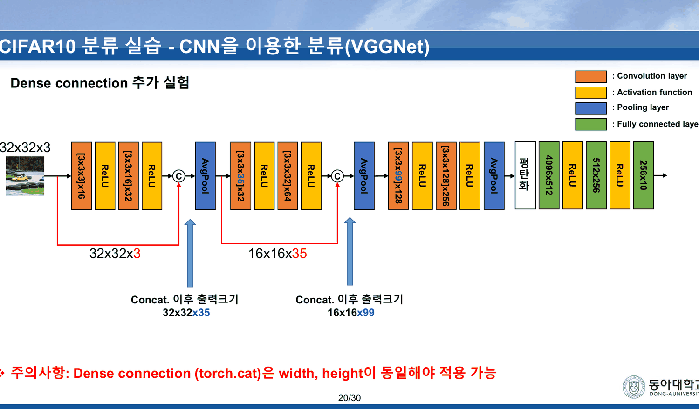
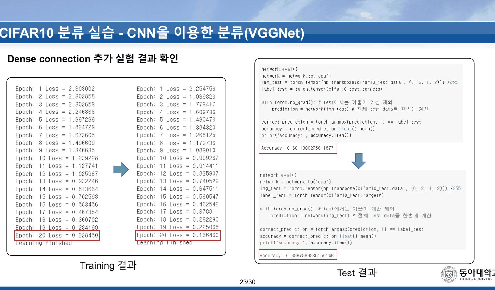
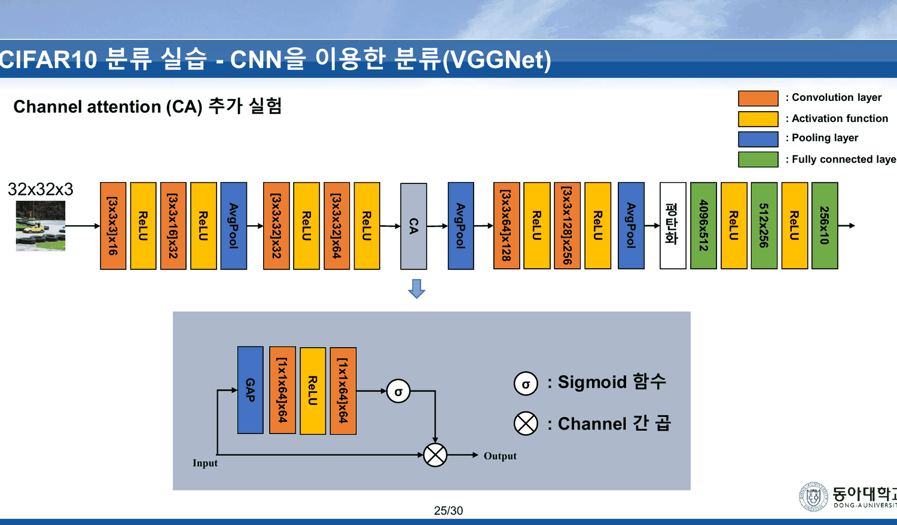
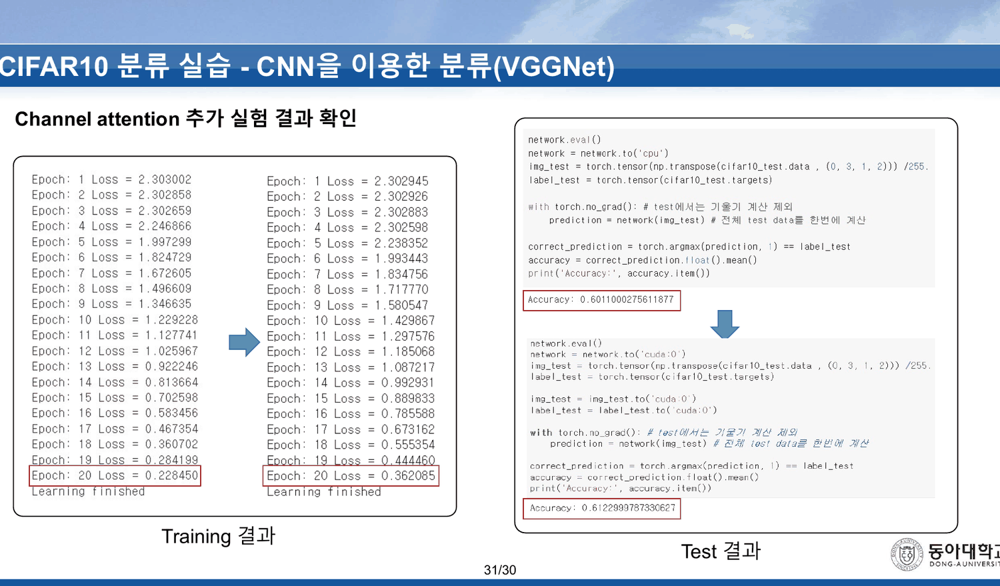
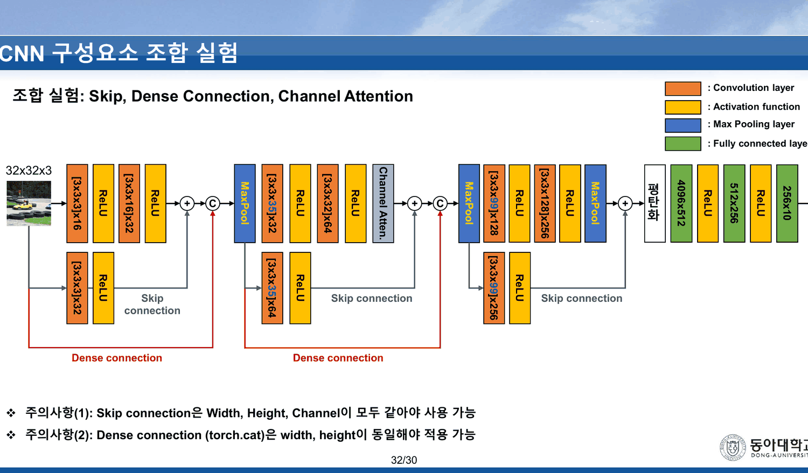
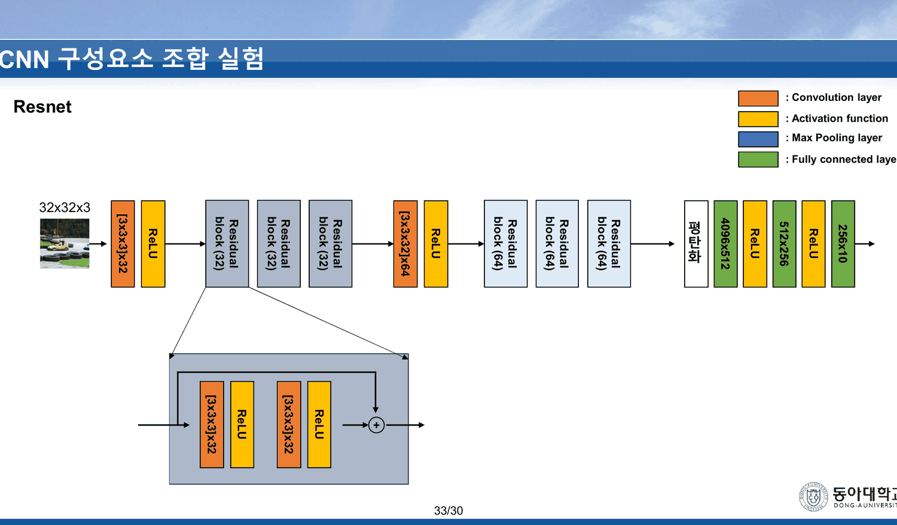
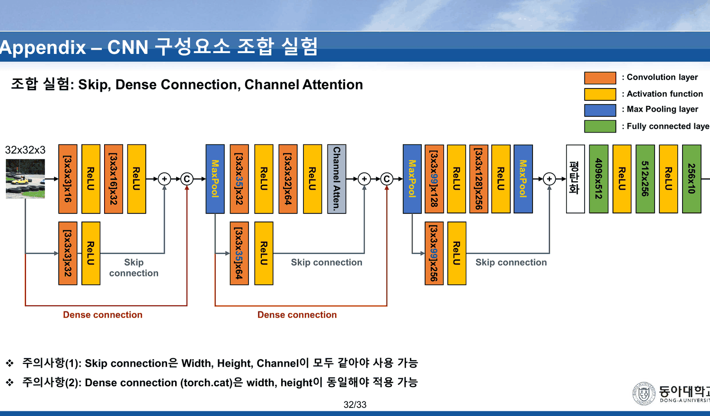
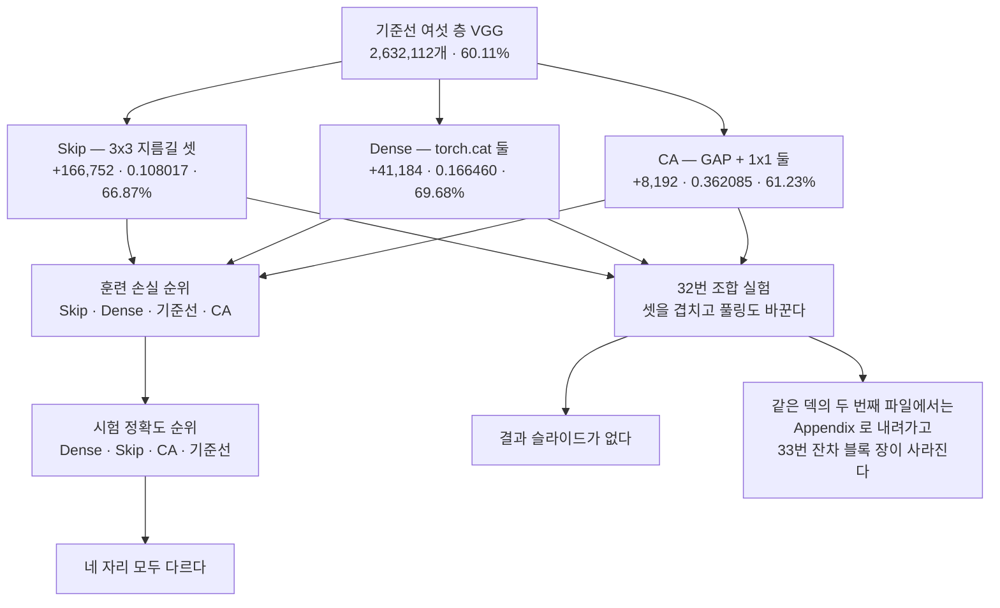

[21. 여섯 층은 세 에폭을 ln 10 에 앉아 있다가 빠져나온다](<./21. 여섯 층은 세 에폭을 ln 10 에 앉아 있다가 빠져나온다.md>)가 읽은 두 실행에서는 훈련 손실과 시험 정확도가 같은 방향을 가리켰다. 남은 두 실행이 그것을 깬다.

그리고 이 덱은 **같은 파일이 두 개** 있다.

---

## 20~23번 — 채널을 이어 붙인다



> **주의사항: Dense connection (torch.cat)은 width, height이 동일해야 적용 가능**

스킵 연결의 주의사항(세 축이 **모두** 같아야 한다)과 다르다. 이어 붙이기는 채널이 달라도 되므로 지름길에 합성곱이 필요 없다. 대신 **뒤 층의 입력 채널이 늘어난다.**

| 자리 | 이어 붙이는 것 | 결과 | 다음 층의 필터 |
| --- | --- | ---: | --- |
| 첫 번째 | 입력 32×32×**3** + conv2 출력 32×32×**32** | 32×32×**35** | `[3x3x35]x32` (기준선은 `[3x3x32]x32`) |
| 두 번째 | 풀링된 16×16×**35** + conv4 출력 16×16×**64** | 16×16×**99** | `[3x3x99]x128` (기준선은 `[3x3x64]x128`) |

$3+32 = 35$, $35+64 = 99$ — 슬라이드가 적은 「Concat. 이후 출력크기 32x32x35」와 「16x16x99」가 맞는다. 22번이 코드 한 줄을 준다.

```text
out1 = torch.cat([x, out1], dim=1)
```

그리고 그 아래 형상 설명이 붙는다 — `(Batch_size, Channel, Width, Height)` 가 `dim: 0 1 2 3` 이라는 것. 채널이 1번 축이므로 `dim=1` 이다.

> [!note] 형상 표기가 PyTorch 관례와 다르다
> PyTorch 의 4차원 텐서 관례는 `(N, C, H, W)` — 높이가 먼저다. 슬라이드는 `Width, Height` 순으로 적었다. `dim=1` 이 채널이라는 결론은 그대로 맞으므로 코드에는 영향이 없고, 2·3번 축의 이름만 뒤바뀐 셈이다. 11주차 34번의 범례도 `(H, W)` 와 `(FW, FH)` 로 순서가 엇갈렸다([16. 검산되는 예제와 검산할 수 없는 예제](<./16. 검산되는 예제와 검산할 수 없는 예제.md>)).

두 층의 입력 채널이 늘면서 가중치가 얼마나 느는지 슬라이드는 적지 않는다. 재계산하면 이렇다.

| 층 | 기준선 | 덴스 | 차이 |
| --- | ---: | ---: | ---: |
| Conv3 | 9,216 | 10,080 | +864 |
| Conv5 | 73,728 | 114,048 | +40,320 |
| | | **합계** | **+41,184** |

스킵 연결이 지름길 합성곱으로 166,752 개를 더한 것과 비교하면 **4분의 1** 이다. 이어 붙이기가 더 싸다.



| | 첫 에폭 | 20에폭 | 시험 정확도 |
| --- | ---: | ---: | ---: |
| 기준선 | 2.303002 | 0.228450 | 60.11% |
| Dense | **2.254756** | 0.166460 | `0.6967999935150146` → **69.68%** |

덴스의 첫 에폭 2.254756 도 $\ln 10$ **아래**다. 스킵과 마찬가지로 세 에폭의 정체가 없다.

---

## 25~31번 — 축소가 없는 어텐션



블록이 그림에 이렇게 적혀 있다.

> Input → **GAP** → `[1x1x64]x64` → **ReLU** → `[1x1x64]x64` → **σ** → (채널 간 곱) → Output

그리고 범례 두 줄 — 「σ : Sigmoid 함수」 · 「(원 안의 곱) : Channel 간 곱」. 블록은 conv4 뒤(64채널 자리) 한 곳에만 들어간다.

두 개의 1×1 합성곱이 **둘 다 64 → 64** 다. 즉 중간에서 채널을 줄이지 않는다. 가중치는 $64\times64\times2 = 8{,}192$ 개 — 이 실습에서 가장 싼 추가다(덴스의 5분의 1, 스킵의 20분의 1).

> [!note] 이론 덱은 축소를 말하지 않았다
> 12주차 이론 29번은 「일반적으로 GAP를 통해 작아진 feature map에 대해 Fully connected layer 또는 1x1 convolution이 사용됨」이라고만 적었다([19. 파란 상자는 다섯이라 쓰고 표에는 넷이 있다](<./19. 파란 상자는 다섯이라 쓰고 표에는 넷이 있다.md>)). 중간 채널을 얼마로 할지에 대한 말이 없으므로, 실습이 64 를 그대로 쓴 것은 이론 슬라이드와 어긋나지 않는다.
>
> (보충 — 원본 밖) SENet 의 원 설계는 중간 채널을 $C/r$ 로 줄이는 것이고 그 축소가 파라미터를 아끼는 동시에 병목 역할을 한다. 이 실습은 $r = 1$ 인 셈이다.

26~30번이 코드를 다섯 장에 나눠 보여 주고, 각 장에 `4x4x4` 짜리 장난감 예제가 붙는다 — GAP 로 `4x4x4 → 1x1x4`, 가중치를 곱해 `1x1x4`, 그것을 다시 펴서 `1x1x4 → 4x4x4`, 마지막으로 입력과 곱해 출력. 다섯 장이 연산 하나를 단계별로 보여 주는 구성이다.



| 에폭 | 손실 | $-\ln 10$ |
| ---: | ---: | ---: |
| 1 | 2.302945 | +0.000360 |
| 2 | 2.302926 | +0.000341 |
| 3 | 2.302883 | +0.000298 |
| 4 | **2.302598** | **+0.000013** |
| 5 | 2.238352 | −0.064233 |

> [!important] 이 과목에서 ln 10 에 가장 가까운 값
> 네 번째 에폭의 **2.302598** 은 $\ln 10 = 2.302585$ 위 **0.000013** 이다. 앞선 기록은 이랬다 — 시그모이드 5층의 열다섯 에폭이 0.000372 이상([14. 다섯 층을 쌓으면 손실이 ln 10 에 붙는다](<./14. 다섯 층을 쌓으면 손실이 ln 10 에 붙는다.md>)), 이 덱 기준선의 3에폭이 0.000074([21. 여섯 층은 세 에폭을 ln 10 에 앉아 있다가 빠져나온다](<./21. 여섯 층은 세 에폭을 ln 10 에 앉아 있다가 빠져나온다.md>)). 0.000013 은 인쇄된 여섯 자리로는 $\ln 10$ 과 거의 구분되지 않는다.
>
> 그리고 이 실행은 **기준선보다 한 에폭 더** 그 자리에 앉아 있는다. 8,192 개의 가중치가 더해졌을 뿐인데 출발이 한 에폭 늦어졌다.

시험 정확도는 `0.6122999787330627` → **61.23%** 다. 기준선 대비 **+1.12pp**.

한 가지 더. 31번 오른쪽 `Test 결과` 스크린샷의 아래쪽 셀은 `network.to('cuda:0')` 로 시작하고 `img_test` 와 `label_test` 도 `to('cuda:0')` 를 거친다. 18·23번의 같은 자리 셀은 전부 `network.to('cpu')` 다. **네 실행 가운데 이 한 번만 평가가 GPU 에서 돌았다.** 결과값에 영향을 줄 이유는 없지만, 네 스크린샷이 같은 코드가 아니라는 것은 분명하다.

---

## 네 실행을 한자리에

```html preview
<div id="rk4" style="font-family:system-ui,-apple-system,sans-serif;color:var(--foreground);background:var(--card);border:1px solid var(--border);border-radius:12px;padding:18px 16px;">
  <p style="margin:0 0 14px;font-size:13px;color:var(--muted-foreground);line-height:1.75;">
    18 · 23 · 31번에 인쇄된 네 실행의 <b>20에폭 훈련 손실</b>(왼쪽)과 <b>시험 정확도</b>(오른쪽)를 잇는다.</p>
  <svg id="rs4" viewBox="0 0 640 250" style="width:100%;height:auto;display:block;"></svg>
  <div id="ro4" style="margin-top:10px;font-size:13.5px;line-height:1.95;"></div>
</div>
<script>
(function(){
  const NS='http://www.w3.org/2000/svg', svg=document.getElementById('rs4');
  const el=(t,a,x)=>{const e=document.createElementNS(NS,t);for(const k in a)e.setAttribute(k,a[k]);
    if(x!==undefined)e.textContent=x;return e;};
  const R=[{n:'기준선',            l:0.228450,a:0.6011000275611877,c:'var(--muted-foreground)',p:0},
           {n:'Skip connection',  l:0.108017,a:0.6686999797821045,c:'var(--chart-1)',p:166752},
           {n:'Dense connection', l:0.166460,a:0.6967999935150146,c:'var(--chart-1)',p:41184},
           {n:'Channel attention',l:0.362085,a:0.6122999787330627,c:'var(--chart-2)',p:8192}];
  const byL=[...R].sort((x,y)=>x.l-y.l), byA=[...R].sort((x,y)=>y.a-x.a);
  const LX=215, RX=425, T=40, GAP=48;
  svg.appendChild(el('text',{x:LX,y:20,'text-anchor':'end','font-size':11.5,
    fill:'var(--muted-foreground)','font-weight':700},'훈련 손실 (낮은 순)'));
  svg.appendChild(el('text',{x:RX,y:20,'font-size':11.5,
    fill:'var(--muted-foreground)','font-weight':700},'시험 정확도 (높은 순)'));
  byL.forEach((r,i)=>{
    const y=T+i*GAP, j=byA.indexOf(r), y2=T+j*GAP;
    svg.appendChild(el('text',{x:LX-10,y:y+4,'text-anchor':'end','font-size':12.5,
      fill:r.c,'font-weight':700},(i+1)+'. '+r.n));
    svg.appendChild(el('text',{x:LX-10,y:y+19,'text-anchor':'end','font-size':11,
      fill:'var(--muted-foreground)'},r.l.toFixed(6)));
    svg.appendChild(el('path',{d:'M'+(LX+8)+' '+y+' C'+(LX+80)+' '+y+', '+(RX-80)+' '+y2+', '+(RX-8)+' '+y2,
      fill:'none',stroke:r.c,'stroke-width':2.2,opacity:0.85}));
    svg.appendChild(el('circle',{cx:LX+8,cy:y,r:4,fill:r.c}));
  });
  byA.forEach((r,i)=>{
    const y=T+i*GAP;
    svg.appendChild(el('circle',{cx:RX-8,cy:y,r:4,fill:r.c}));
    svg.appendChild(el('text',{x:RX+10,y:y+4,'font-size':12.5,fill:r.c,'font-weight':700},
      (i+1)+'. '+r.n));
    svg.appendChild(el('text',{x:RX+10,y:y+19,'font-size':11,fill:'var(--muted-foreground)'},
      (r.a*100).toFixed(2)+'% · 추가 가중치 '+(r.p?r.p.toLocaleString():'0')+'개'));
  });
  document.getElementById('ro4').innerHTML =
    '<b>앞 두 자리가 바뀐다.</b> 훈련 손실 1등 Skip 이 시험 2등이고, 훈련 2등 Dense 가 시험 1등이다. '+
    '뒤 두 자리도 바뀐다 — 훈련 꼴찌 어텐션이 시험 3등, 훈련 3등 기준선이 시험 꼴찌다.<br>'+
    '<span style="color:var(--muted-foreground);font-size:12.5px;">'+
    '네 자리 모두 순위가 다르다. 그리고 가장 큰 개선(+9.57pp)을 낸 덴스가 추가 가중치는 '+
    '스킵의 4분의 1 이다.</span>';
})();
</script>
```

| | 20에폭 훈련 손실 | 시험 정확도 | 기준선 대비 | 추가 가중치 |
| --- | ---: | ---: | ---: | ---: |
| 기준선 | 0.228450 | 60.11% | — | 0 |
| Skip connection | **0.108017** | 66.87% | +6.76pp | 166,752 |
| Dense connection | 0.166460 | **69.68%** | **+9.57pp** | 41,184 |
| Channel attention | 0.362085 | 61.23% | +1.12pp | 8,192 |

**네 자리의 순위가 전부 다르다.** 훈련에서 가장 잘 맞춘 스킵이 시험에서는 둘째이고, 훈련 꼴찌인 어텐션이 시험에서는 기준선을 이긴다.

이 과목에서 두 순위가 어긋나는 것은 두 번째다. [11. 여섯 장을 들여 더 좋은 옵티마이저를 소개하고, 실습 결과는 전부 더 나쁘다](<./11. 여섯 장을 들여 더 좋은 옵티마이저를 소개하고, 실습 결과는 전부 더 나쁘다.md>)의 다섯 실행은 앞 네 자리가 **완전한 역순**이었다. 여기는 완전한 역순은 아니지만 어느 자리도 맞지 않는다.

> [!note] 시험 집합 10,000장에서 얼마가 유의한가
> CIFAR-10 시험 집합은 10,000장이므로, 정확도 60% 부근에서 표준오차는 $\sqrt{0.6 \times 0.4 / 10000} \approx 0.49$pp 다. 기준선과 어텐션의 차이 1.12pp 는 그 두 배가 조금 넘고, 덴스와 스킵의 차이 2.81pp 는 훨씬 크다. 한 번씩만 돌린 결과이므로 seed 차이는 여기 들어 있지 않다. (이 문단은 원본 밖의 보충이다. [12. 여섯 가지를 가르치고 셋을 해 본다](<./12. 여섯 가지를 가르치고 셋을 해 본다.md>)에서 같은 셈을 했다.)

---

## 32번 — 한 장에서 네 가지가 동시에 바뀐다



> 조합 실험: Skip, Dense Connection, Channel Attention

세 기법을 한 모델에 다 넣는 장이다. 그런데 범례를 보면 네 번째가 바뀌어 있다.

| | 6 · 8 · 12 · 20 · 25번 | **32번** |
| --- | --- | --- |
| 범례 셋째 줄 | `: Pooling layer` | **`: Max Pooling layer`** |
| 그림의 상자 | `AvgPool` ×3 | **`MaxPool` ×3** |

앞 다섯 장의 모든 구조도가 평균 풀링을 쓰고, 6번이 그것을 「실제 VGG 네트워크는 Max Pooling을 사용」이라는 주석으로 명시했다. 조합 실험 한 장에서만 맥스 풀링으로 바뀐다.

> [!warning] 조합 실험의 결과는 무엇 때문인지 알 수 없다
> 32번의 모델은 기준선과 **네 가지**가 다르다 — 스킵 연결, 덴스 연결, 채널 어텐션, 그리고 **풀링 방식**. 앞 세 실험은 한 번에 하나씩만 바꿔서 60.11% 로부터의 차이를 그 하나에 돌릴 수 있었다. 이 장은 그렇게 읽을 수 없다.
>
> 그리고 이 덱에는 **조합 실험의 결과 슬라이드가 없다.** 18·23·31번처럼 로그와 정확도를 보여 주는 장이 32번 뒤에 오지 않는다. 학생이 직접 돌려 보라는 과제로 남은 것으로 보이고, 그렇다면 네 번째 변경은 더 문제가 된다 — 무엇을 비교하는 실험인지 학생이 알 수 없다.

32번의 지름길 표기도 바뀐다. 12번은 `[3x3x64]x256` 이었는데 32번은 `[3x3x99]x256` 이다. 덴스 연결이 먼저 적용되어 그 자리의 채널이 64 에서 99 가 되었으므로 **맞는 수정**이다. 같은 이유로 둘째 지름길이 `[3x3x35]x64` 가 된다. 네 가지를 겹칠 때 채널이 어떻게 전파되는지는 정확히 따라갔다.

---

## 33번 — 한 파일에만 있는 장

33번은 범례 네 줄과 `Residual block (64)` 세 개, `[3x3x32]x64`, 그리고 `평탄화 · 4096x512 · 512x256 · 256x10` 이 세로로 쌓인 장이다. 제목이 없다.



같은 크기의 잔차 블록을 **세 번 반복**하는 구조 — 12주차 이론 16번이 「여러 개의 Residual block을 이용해 ResNet을 구현」이라 한 그것이다([18. 열 장 중 여덟 장이 지난주 덱 그대로다](<./18. 열 장 중 여덟 장이 지난주 덱 그대로다.md>)). 이 덱에서 실제 ResNet 의 반복 구조가 그려지는 유일한 장인데, 설명이 한 줄도 없고 결과도 없다.

그리고 이 장은 **두 파일 중 한쪽에만 있다.**

---

## 같은 덱이 두 파일이다

`sources/` 에는 이 실습 덱이 두 이름으로 들어 있다.

| | `VGGNet (실습).pdf` | `CNN 주요설계모듈(실습).pdf` |
| --- | ---: | ---: |
| 쪽수 | 34 | 33 |
| 꼬리표 분모 | **30** | **33** |
| 32번 제목 | `CNN 구성요소 조합 실험` | **`Appendix – CNN 구성요소 조합 실험`** |
| 33번(잔차 블록 세 개) | 있음 | **없음** |
| 마지막 장 | 34번 Q&A | 33번 Q&A |

33장을 한 장씩 대조하면 **본문이 전부 일치한다**(꼬리표 제외). 두 파일의 차이는 위의 세 가지뿐이다.



어느 쪽이 나중인지는 꼬리표가 말한다. `VGGNet (실습).pdf` 는 34장인데 분모가 30 이고, `CNN 주요설계모듈(실습).pdf` 는 33장에 분모가 33 이다 — **후자만 쪽번호가 맞는다.** 그러니 순서는 이렇게 읽힌다.

1. 34장짜리 판이 먼저 있었다. 분모 30 은 더 앞선 판의 흔적이다
2. 잔차 블록 장(33번)을 **빼고**, 조합 실험에 `Appendix –` 를 붙이고, 꼬리표를 33으로 고쳤다
3. 파일 이름도 `VGGNet (실습)` 에서 `CNN 주요설계모듈(실습)` 로 바꿨다 — 12주차 이론 덱의 이름과 짝을 맞춘 것이다

편집의 방향이 일관된다. 결과가 없는 두 장(조합 실험·잔차 블록) 가운데 하나는 부록으로 내려가고 하나는 삭제되었다. **이 과목에서 개정의 전후를 이렇게 정확히 읽을 수 있는 자리는 여기뿐이다** — 다른 중복 열 편은 바이트 크기까지 같은 단순 복사본이었다.

---

## 네 실험의 지도



---

## 근거 자료

`VGGNet (실습).pdf` 34쪽 중 **19~34번**, 그리고 같은 덱의 두 번째 파일 `CNN 주요설계모듈(실습).pdf` 33쪽 전체.

- 20번 — `[3x3x35]x32` · `[3x3x99]x128`, 「Concat. 이후 출력크기 32x32x35 / 16x16x99」, 주의사항 한 줄
- 22번 — `out1 = torch.cat([x, out1], dim=1)`, `(Batch_size, Channel, Width, Height)` = `dim: 0 1 2 3`
- 23번 — 덴스 손실 로그 20줄(첫 2.254756, 마지막 0.166460), `Accuracy: 0.6967999935150146`
- 25번 — CA 블록 `GAP → [1x1x64]x64 → ReLU → [1x1x64]x64 → σ → 채널 간 곱`
- 26~30번 — CA 코드 다섯 장, `4x4x4 → 1x1x4 → 1x1x4 → 4x4x4` 예제
- 31번 — CA 손실 로그 20줄(2.302945 · 2.302926 · 2.302883 · 2.302598 · 2.238352 …, 마지막 0.362085), `Accuracy: 0.6122999787330627`, 평가 셀의 `network.to('cuda:0')`
- 32번 — 범례 `: Max Pooling layer`, `MaxPool` ×3, 지름길 `[3x3x35]x64` · `[3x3x99]x256`, 주의사항 두 줄
- 33번 — `Residual block (64)` ×3 (두 번째 파일에는 없다)
- 두 파일 대조 — 33장의 본문 일치, 꼬리표 분모 30 대 33, 32번 제목의 `Appendix –` 유무

가중치 증분(41,184 · 8,192 · 166,752)은 슬라이드에 인쇄된 필터 표기만으로 파이썬에서 재계산했다. 손실 로그 여든 줄은 슬라이드 이미지를 170 dpi 로 렌더해 한 줄씩 옮겨 적었고, $\ln 10$ 과의 차는 배정밀도로 계산했다. 두 PDF 의 대조는 `pdftotext -layout` 결과를 쪽 단위로 정규화해 비교했다. 표준오차 0.49pp 와 SENet 의 축소비 $r$ 은 원본 밖의 보충이며 본문에 그렇게 표시했다.

---

## 이어지는 문서

- [21. 여섯 층은 세 에폭을 ln 10 에 앉아 있다가 빠져나온다](<./21. 여섯 층은 세 에폭을 ln 10 에 앉아 있다가 빠져나온다.md>) — 같은 덱 1~18번. 기준선과 스킵 연결
- [19. 파란 상자는 다섯이라 쓰고 표에는 넷이 있다](<./19. 파란 상자는 다섯이라 쓰고 표에는 넷이 있다.md>) — 같은 주 이론. 덴스 연결과 채널 어텐션의 원본 표
- [11. 여섯 장을 들여 더 좋은 옵티마이저를 소개하고, 실습 결과는 전부 더 나쁘다](<./11. 여섯 장을 들여 더 좋은 옵티마이저를 소개하고, 실습 결과는 전부 더 나쁘다.md>) — 두 순위가 어긋난 첫 사례
- [12. 여섯 가지를 가르치고 셋을 해 본다](<./12. 여섯 가지를 가르치고 셋을 해 본다.md>) — 10,000장 시험 집합의 표준오차를 같은 방식으로 계산한 곳
- [24. 시험은 합성곱을 묻지 않는다](<./24. 시험은 합성곱을 묻지 않는다.md>) — 69.68% 가 이 과목이 CIFAR-10 에서 인쇄한 최고값이 되는 자리
