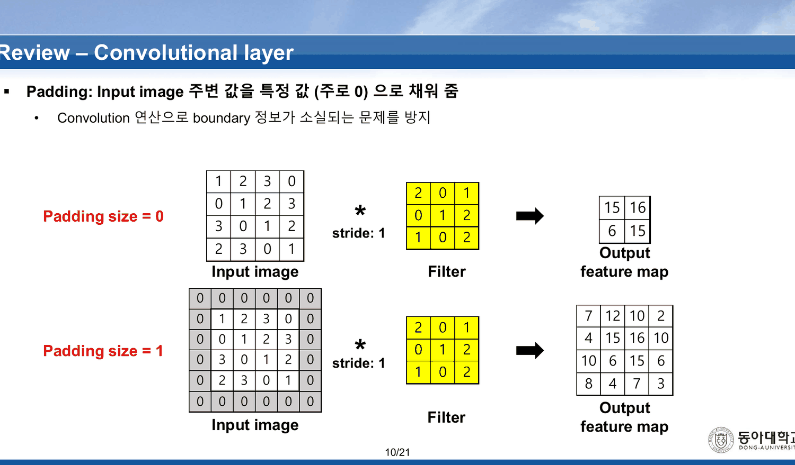
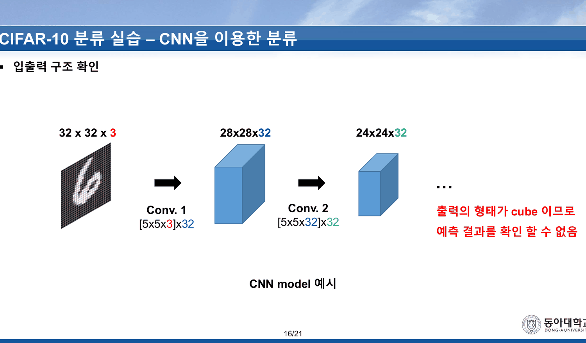
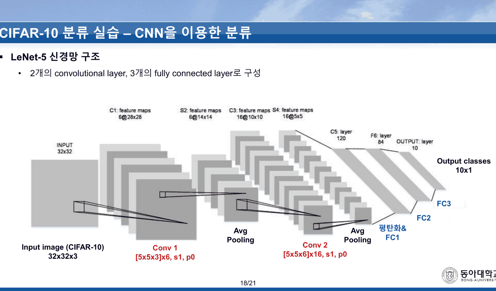
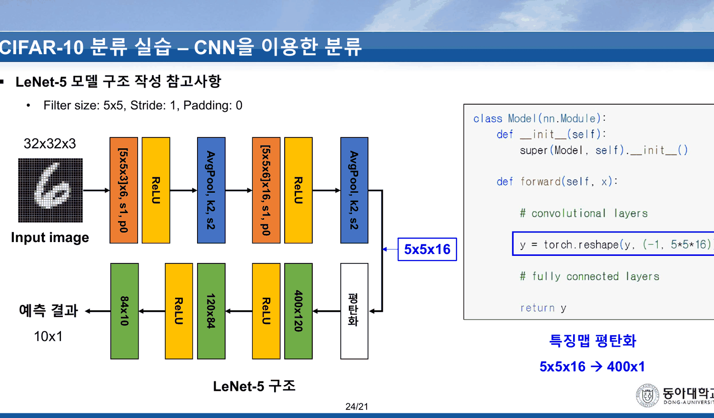
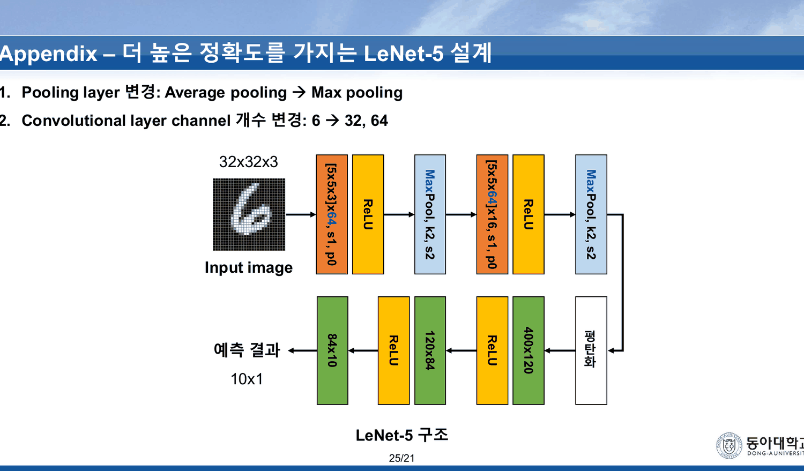
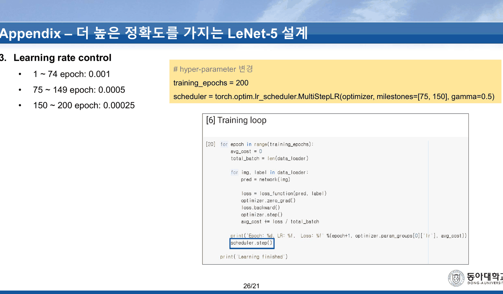
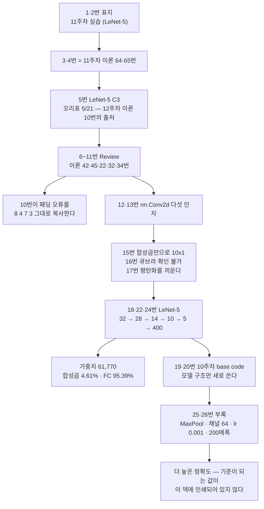

이 덱은 27장이고 모든 꼬리표의 분모가 **21**이다. 마지막 장이 `27/21` 이다.

그리고 27장 안에서 `Accuracy` 라는 글자도, 퍼센트 값도 한 번도 나오지 않는다. 「정확도」가 등장하는 것은 부록 두 장의 제목 —「더 높은 **정확도**를 가지는 LeNet-5 설계」— 뿐이다. **비교 대상이 되는 낮은 정확도가 이 덱 어디에도 없다.**

---

## 1~5번 — 지난 장을 다시, 그리고 C3

3·4번은 11주차 이론 덱 64·65번이다. 5번은 새 장이고, 제목이 `LeNet-5 C3` 한 줄이다(추출 텍스트 13자).

이 다섯 번째 장이 세 덱을 잇는다.

| 덱 | 위치 | 꼬리표 | 내용 |
| --- | --- | --- | --- |
| `CNN (이론).pdf` | 65번 | `65/32` | C1 · S2 · **S4** · C5 · F6 — C3 가 빠진 목록 |
| `CNN (실습).pdf` | **5번** | **`5/21`** | `LeNet-5 C3` |
| `CNN 주요설계모듈(이론).pdf` | 10번 | **`10/21`** | `LeNet-5 C3` — 같은 장 |

[18. 열 장 중 여덟 장이 지난주 덱 그대로다](<./18. 열 장 중 여덟 장이 지난주 덱 그대로다.md>)는 12주차 이론 10번의 `10/21` 을 보고 「21장짜리 어떤 덱에서 왔다」고만 적었다. **그 덱이 이 덱이다.** 이 실습 덱 전체가 분모 21 을 달고 있고, 같은 `LeNet-5 C3` 장을 5번 자리에 갖고 있다. 12주차 이론이 그것을 가져가면서 분자만 10 으로 고쳤다.

이 과목에서 외래 슬라이드의 **출처 덱을 특정할 수 있는 첫 사례**다. `2/39`·`32/12`·`12/14` 는 분모만 남고 출처를 찾지 못했다.

---

## 6~11번 — 이론 덱의 복습, 오류까지 함께

여섯 장이 11주차 이론 덱에서 왔다. 제목만 `Review – Convolutional layer` 로 바뀌었다.

| 실습 | 이론 | 내용 |
| ---: | ---: | --- |
| 6·7번 | 42~44번 | 4×4×3 · 3×3×3 · `63 55 / 18 51` |
| 8번 | 45번 | 필터 N개 → 채널 N개 |
| 9번 | 22번 | 7×7 스트라이드 1 과 2 |
| **10번** | **32번** | 패딩 0 과 패딩 1 |
| 11번 | 34번 | 출력 크기 공식 |

10번을 확대해 보면 마지막 줄이 이렇다.



> 7 12 10 2 / 4 15 16 10 / 10 6 15 6 / **8 4 7 3**

[16. 검산되는 예제와 검산할 수 없는 예제](<./16. 검산되는 예제와 검산할 수 없는 예제.md>)가 재계산한 정답은 `8 10 4 3` 이었다. **같은 두 칸이 같은 값으로 틀린 채 복사되었다.**

> [!warning] 원본 오류가 두 덱에 걸쳐 있다
> 11주차 이론 32번과 11주차 실습 10번은 같은 슬라이드이고, 둘 다 패딩 1 출력의 마지막 줄을 `8 4 7 3` 으로 인쇄한다. 정답은 `8 10 4 3` 이다.
>
> 두 번 인쇄되었다는 것은 이 오류가 **검토를 두 번 통과했다**는 뜻이다. 그리고 실습 덱에서는 위치가 더 나쁘다 — 학생이 코드를 쓰기 직전에 보는 복습 장이다.

6번은 이론 42번과 같은 3D 예제를 다시 싣는데, 이론 덱에는 없던 이름표가 붙었다 — 그림 아래에 `Input image 4x4x3` · `Conv. filter 3x3x3` 이 적힌다. 7번에는 `Output feature map 2x2x1` 도 붙는다. 형상은 명확해졌지만, 세 채널 중 하나만 보이는 문제는 그대로다.

12·13번이 `torch.nn.Conv2d` 의 다섯 인자를 설명한다. 12주차 실습 4·5번과 같은 장이다([21. 여섯 층은 세 에폭을 ln 10 에 앉아 있다가 빠져나온다](<./21. 여섯 층은 세 에폭을 ln 10 에 앉아 있다가 빠져나온다.md>)).

---

## 14~18번 — 평탄화는 어디서 하는가

14번이 데이터를 준다 — 「32x32x3 (RGB) 이미지, 10개의 클래스 / Train: 50,000개, Test: 10,000개」.

15~17번이 세 장에 걸쳐 같은 질문을 두 방향에서 그린다.

| 장 | 위 그림 | 아래 그림 |
| --- | --- | --- |
| 15 | `32x32x3` → 평탄화 → `3072x1` → FC layers → `10x1` | `32x32x3` → Conv. layers → `10x1` |
| 16 | `32x32x3` → `[5x5x3]x32` → `28x28x32` → `[5x5x32]x32` → `24x24x32` → **「출력의 형태가 cube 이므로 예측 결과를 확인 할 수 없음」** | |
| 17 | 위와 같음 | `32x32x3` → Conv. layers → **평탄화** → FC layers → `10x1` |



15번 아래쪽 그림이 **거짓말을 한다.** 합성곱 층만 거쳐 `10x1` 이 나오는 것처럼 그려 놓고, 한 장 뒤 16번이 그럴 수 없다고 적는다. 17번이 평탄화를 끼워 넣어 고친다. 세 장이 틀린 그림 → 반박 → 수정의 순서로 놓여 있고, 그것이 의도된 교수법으로 보인다.

11주차 이론 62~64번이 같은 순서를 밟았다([17. 슬라이드 10이 약속한 절약을 슬라이드 63이 취소한다](<./17. 슬라이드 10이 약속한 절약을 슬라이드 63이 취소한다.md>)). 다른 점은 입력이다 — 이론은 `28x28x1` (MNIST), 실습은 `32x32x3` (CIFAR-10). 그래서 평탄화되는 값이 12,800 이 아니라 $24\times24\times32 = 18{,}432$ 가 된다.

18번이 실제로 쓸 구조를 준다.



> 2개의 convolutional layer, 3개의 fully connected layer로 구성
> `Input image (CIFAR-10) 32x32x3` → `Conv 1 [5x5x3]x6, s1, p0` → `Avg Pooling` → `Conv 2 [5x5x6]x16, s1, p0` → `Avg Pooling` → `평탄화 & FC1` → `FC2` → `FC3` → `Output classes 10x1`

---

## 22·24번 — 95.39%

22·24번이 같은 구조를 형상까지 적는다. 24번에 평탄화 지점이 명시된다 — 「특징맵 평탄화 `5x5x16 → 400x1`」.



형상을 따라가면 이렇다.

| 단계 | 인쇄된 표기 | 계산 | 출력 |
| --- | --- | --- | --- |
| 입력 | `32x32x3` | | 32×32×3 |
| Conv 1 | `[5x5x3]x6, s1, p0` | $32-5+1 = 28$ | 28×28×6 |
| AvgPool | `k2, s2` | $28/2 = 14$ | 14×14×6 |
| Conv 2 | `[5x5x6]x16, s1, p0` | $14-5+1 = 10$ | 10×10×16 |
| AvgPool | `k2, s2` | $10/2 = 5$ | **5×5×16** |
| 평탄화 | | $5\times5\times16$ | **400** |
| FC1 | `400x120` | | 120 |
| FC2 | `120x84` | | 84 |
| FC3 | `84x10` | | 10 |

24번이 적은 `5x5x16 → 400x1` 과 `400x120` 이 **정확히 맞는다.** 이 덱의 형상은 끝까지 일관된다.

```html preview
<div id="lw" style="font-family:system-ui,-apple-system,sans-serif;color:var(--foreground);background:var(--card);border:1px solid var(--border);border-radius:12px;padding:18px 16px;">
  <p style="margin:0 0 12px;font-size:13px;color:var(--muted-foreground);line-height:1.75;">
    18·22·24번에 인쇄된 다섯 층의 표기로 가중치를 센다. 위 막대는 <b>가중치 개수</b>, 아래 막대는 그 층이 내놓는 <b>값의 개수</b>다.</p>
  <svg id="lws" viewBox="0 0 640 262" style="width:100%;height:auto;display:block;"></svg>
  <div id="lwo" style="margin-top:10px;font-size:13.5px;line-height:1.95;"></div>
</div>
<script>
(function(){
  const NS='http://www.w3.org/2000/svg', svg=document.getElementById('lws');
  const el=(t,a,x)=>{const e=document.createElementNS(NS,t);for(const k in a)e.setAttribute(k,a[k]);
    if(x!==undefined)e.textContent=x;return e;};
  const L=[{n:'Conv1 [5x5x3]x6', w:5*5*3*6,   o:28*28*6, k:'conv'},
           {n:'Conv2 [5x5x6]x16',w:5*5*6*16,  o:10*10*16,k:'conv'},
           {n:'FC1 400x120',     w:400*120,   o:120,     k:'fc'},
           {n:'FC2 120x84',      w:120*84,    o:84,      k:'fc'},
           {n:'FC3 84x10',       w:84*10,     o:10,      k:'fc'}];
  const tw=L.reduce((s,r)=>s+r.w,0);
  const cw=L.filter(r=>r.k==='conv').reduce((s,r)=>s+r.w,0);
  const maxW=Math.max(...L.map(r=>r.w)), maxO=Math.max(...L.map(r=>r.o));
  const X=152,W=330,T=38,H=40;
  svg.appendChild(el('text',{x:X,y:20,'font-size':11.5,fill:'var(--muted-foreground)','font-weight':700},
    '위 = 가중치 개수 · 아래 = 출력 값의 개수 (각각 자기 최댓값 기준)'));
  L.forEach((r,i)=>{
    const y=T+i*H, c=r.k==='conv'?'var(--chart-1)':'var(--chart-2)';
    svg.appendChild(el('text',{x:X-10,y:y+16,'text-anchor':'end','font-size':11.5,fill:c,
      'font-family':'ui-monospace,monospace'},r.n));
    svg.appendChild(el('rect',{x:X,y:y,width:Math.max(1.5,W*r.w/maxW),height:13,rx:3,fill:c,opacity:0.9}));
    svg.appendChild(el('text',{x:X+Math.max(1.5,W*r.w/maxW)+7,y:y+11,'font-size':11,
      fill:'var(--foreground)','font-variant-numeric':'tabular-nums'},
      r.w.toLocaleString()+' ('+(r.w/tw*100).toFixed(2)+'%)'));
    svg.appendChild(el('rect',{x:X,y:y+16,width:Math.max(1.5,W*r.o/maxO),height:9,rx:2,
      fill:'var(--foreground)',opacity:0.28}));
    svg.appendChild(el('text',{x:X+Math.max(1.5,W*r.o/maxO)+7,y:y+25,'font-size':10,
      fill:'var(--muted-foreground)','font-variant-numeric':'tabular-nums'},r.o.toLocaleString()+' 값'));
  });
  const BY=T+5*H+8;
  svg.appendChild(el('rect',{x:X,y:BY,width:W*cw/tw,height:16,fill:'var(--chart-1)',opacity:0.9}));
  svg.appendChild(el('rect',{x:X+W*cw/tw,y:BY,width:W*(tw-cw)/tw,height:16,fill:'var(--chart-2)',opacity:0.9}));
  svg.appendChild(el('text',{x:X-10,y:BY+13,'text-anchor':'end','font-size':11.5,
    fill:'var(--muted-foreground)','font-weight':700},'합계 '+tw.toLocaleString()));
  svg.appendChild(el('text',{x:X+3,y:BY+31,'font-size':11.5,fill:'var(--chart-1)','font-weight':700},
    '합성곱 '+cw.toLocaleString()+' — '+(cw/tw*100).toFixed(2)+'%'));
  svg.appendChild(el('text',{x:X+W,y:BY+31,'text-anchor':'end','font-size':11.5,
    fill:'var(--chart-2)','font-weight':700},'FC '+(tw-cw).toLocaleString()+' — '+((tw-cw)/tw*100).toFixed(2)+'%'));
  document.getElementById('lwo').innerHTML =
    '두 합성곱 층이 <b>'+(cw/tw*100).toFixed(2)+'%</b>, 세 FC 층이 <b>'+((tw-cw)/tw*100).toFixed(2)+'%</b> 다. '+
    '<code>400x120</code> 한 층이 <b>'+(400*120/tw*100).toFixed(1)+'%</b> 다.<br>'+
    '<span style="color:var(--muted-foreground);font-size:12.5px;">'+
    '두 줄의 길이가 반대다 — 합성곱은 가중치가 적고 내놓는 값이 많으며, FC 는 그 반대다. '+
    'Conv1 은 가중치 '+L[0].w+'개로 값 '+L[0].o.toLocaleString()+'개를 만들고, '+
    'FC1 은 가중치 '+L[2].w.toLocaleString()+'개로 값 120개를 만든다 — '+
    '값 하나당 가중치가 '+(L[0].w/L[0].o).toFixed(3)+'개 대 '+(L[2].w/L[2].o)+'개다.</span>';
})();
</script>
```

| 층 | 가중치 |
| --- | ---: |
| Conv1 `[5x5x3]x6` | 450 |
| Conv2 `[5x5x6]x16` | 2,400 |
| FC1 `400x120` | **48,000** |
| FC2 `120x84` | 10,080 |
| FC3 `84x10` | 840 |
| **합계** | **61,770** |

합성곱 두 층 2,850 개(**4.61%**), 완전연결 세 층 58,920 개(**95.39%**). 11주차 이론 10번의 「CNN에 비해 필요한 weight parameter의 개수가 많음」이라는 비난 대상이, 그 이론이 소개한 모델 안에서 **가중치의 95%를 차지한다.**

12주차 실습의 여섯 층 VGG 에서는 그 비율이 84.8% 였다([21. 여섯 층은 세 에폭을 ln 10 에 앉아 있다가 빠져나온다](<./21. 여섯 층은 세 에폭을 ln 10 에 앉아 있다가 빠져나온다.md>)). 합성곱을 늘리면 비율이 내려간다 — 그러나 여섯 층으로도 FC 가 여전히 다수다.

그리고 아래 막대가 그 이유를 보여 준다. Conv1 은 가중치 450 개로 값 **4,704** 개를 만들고, FC1 은 가중치 48,000 개로 값 **120** 개를 만든다. 값 하나당 가중치가 0.096 개 대 400 개다. **가중치 공유가 하는 일이 그것**이고, [20. 열여섯 장과 열일곱 장 사이에서 덱의 주인이 바뀐다](<./20. 열여섯 장과 열일곱 장 사이에서 덱의 주인이 바뀐다.md>)의 21번 종이가 5 대 3 으로 보여 준 것의 실물 크기 판이다.

---

## 19·20번 — 코드는 10주차 것을 쓴다

19번이 「10주차 LMS 강의 콘텐츠에 업로드 되어있는 base code 다운로드」라 적고, 20번이 「**LeNet5 모델 구조에 맞추어 코드 작성**」이라 적는다.

즉 이번 주에 학생이 쓰는 것은 **모델 클래스 하나**다. 데이터 로딩·학습 루프·평가는 지난주 것을 그대로 쓴다. 12주차 실습도 같은 방식이었다 — 「실습 시 [3] Model 구조 선언 부분만 수정」(7번).

이 구조 때문에 실습이 바뀌는 것은 모델뿐이고, 하이퍼파라미터는 10주차의 것을 물려받는다. 그 10주차 코드가 무엇이었는지는 `CIFAR10 (실습).pdf` 가 말한다([24. 시험은 합성곱을 묻지 않는다](<./24. 시험은 합성곱을 묻지 않는다.md>)) — **MLP 용 코드**다.

---

## 21·23번과 22·24번 — 같은 장이 두 번씩

19·20번의 코드 지시 뒤로 네 장이 이어지는데, 그중 둘은 앞에서 이미 나온 장이다.

| 장 | 제목 | 같은 장 |
| ---: | --- | --- |
| 21 | LeNet-5 모델 구조 작성 참고사항 (범례 넷) | — |
| 22 | LeNet-5 모델 구조 작성 참고사항 (구조도) | — |
| **23** | Convolution 연산의 출력 크기 계산 | **11번**과 같다 |
| **24** | LeNet-5 모델 구조 작성 참고사항 (구조도 + 평탄화 설명) | **22번**에 두 줄이 더해진 판 |

23번은 11번의 재인쇄다 — 같은 공식, 같은 네 줄 범례. 11번은 복습 구간(6~11번)의 마지막 장이었고 23번은 코드를 쓰는 구간에 있다. **열두 장을 사이에 두고 같은 공식이 두 번** 나오는데, 두 번째에는 「왜 지금 이것이 필요한가」에 해당하는 줄이 없다. 학생이 `nn.Conv2d` 의 출력 크기를 손으로 확인해야 하는 자리라는 것이 맥락에서만 읽힌다.

22번과 24번의 차이는 오른쪽 아래 두 줄이다 — 24번에만 「특징맵 평탄화 `5x5x16 → 400x1`」과 `[KW x KH x C] x N` 표기 설명이 있다. 구조도 자체는 같다.

이 과목의 다른 덱에서도 같은 일이 여러 번 있었다 — `Backpropagation` 21·22·23번이 글자까지 같았고([05. 방향은 열 장, 보폭은 이름이 없다](<./05. 방향은 열 장, 보폭은 이름이 없다.md>)), `Overfitting` 32·33번이 그랬으며([12. 여섯 가지를 가르치고 셋을 해 본다](<./12. 여섯 가지를 가르치고 셋을 해 본다.md>)), 이 덱의 이론판 51~54번은 155자가 네 번 반복됐다([17. 슬라이드 10이 약속한 절약을 슬라이드 63이 취소한다](<./17. 슬라이드 10이 약속한 절약을 슬라이드 63이 취소한다.md>)). 다만 그쪽은 애니메이션 프레임이었고, 여기 23번은 **완결된 장이 통째로 다시 놓인 경우**다.

---

## 25·26번 — 부록, 그리고 비교 대상이 없는 「더 높은」



> **Appendix – 더 높은 정확도를 가지는 LeNet-5 설계**
>
> 1. Pooling layer 변경: Average pooling → Max pooling
> 2. Convolutional layer channel 개수 변경: **6 → 32, 64**

두 번째 줄과 그림이 어긋난다. 본문은 채널을 「32, 64」 둘로 바꾼다고 적는데, 그림은 `[5x5x3]x64` 와 `[5x5x64]x16` 이다 — **Conv1 만 64 로 올라가고 Conv2 의 출력은 16 그대로**다. 32 는 그림 어디에도 없다.

> [!warning] 25번 본문과 그림의 불일치
> 「6 → 32, 64」라는 표기는 두 층을 각각 32 와 64 로 바꾼다고 읽히는데, 그림은 Conv1 만 6 → 64 로 바꾸고 Conv2 의 출력 채널 16 은 그대로 둔다. 그림대로면 평탄화 지점이 여전히 `5x5x16 = 400` 이라 `400x120` 이 유지되고, 그래서 FC 쪽 표기가 한 글자도 바뀌지 않은 것이 설명된다.
>
> 그림대로 세면 Conv1 이 4,800, Conv2 가 25,600 이 되어 합성곱이 30,400 개가 된다 — 전체 89,320 개 중 **34.0%** 다. 4.61% 에서 일곱 배 넘게 오른다. 이 셈은 덱에 없다.

26번이 학습률 계획을 준다.



```text
training_epochs = 200
scheduler = torch.optim.lr_scheduler.MultiStepLR(optimizer, milestones=[75, 150], gamma=0.5)
```

> · 1 ~ 74 epoch: 0.001
> · 75 ~ 149 epoch: 0.0005
> · 150 ~ 200 epoch: 0.00025

$\gamma = 0.5$ 이므로 0.001 → 0.0005 → 0.00025 가 맞고, 구간의 경계도 `milestones=[75, 150]` 과 맞는다. 다만 **기본 학습률 0.001 은 코드 조각 안에 없다** — 세 구간의 값에서 역산해야 알 수 있다. 그리고 이 값은 이 과목이 줄곧 쓴 `lr = 0.1` 의 **100분의 1** 이다. 에폭도 20 에서 200 으로 열 배다. 부록이 「더 높은 정확도」를 약속하면서 바꾸는 것은 구조 둘과 학습 설정 둘, 모두 넷이다.

그리고 **비교할 숫자가 없다.** 기본 LeNet-5 가 몇 퍼센트인지 이 덱은 인쇄하지 않았다. 「더 높은」이 무엇보다 높은지 학생은 직접 돌려서 알아내야 한다.

27번은 Q&A 다.

---

## 이 덱의 지도



---

## 근거 자료

`CNN (실습).pdf` 27쪽 **전체**. 모든 꼬리표의 분모가 21이다.

- 3·4번 — 11주차 `CNN (이론).pdf` 64·65번과 일치
- 5번 — `LeNet-5 C3`, 꼬리표 `5/21`
- 6~11번 — 이론 42~45 · 22 · 32 · 34번의 복습판. 10번의 패딩 출력 `7 12 10 2 / 4 15 16 10 / 10 6 15 6 / 8 4 7 3`
- 12·13번 — `nn.Conv2d(in_channels=6, out_channels=16, kernel_size=5, stride=1, padding=0)`
- 14번 — 「32x32x3 (RGB) 이미지, 10개의 클래스 / Train: 50,000개, Test: 10,000개」
- 15~17번 — `3072x1` 평탄화 대 합성곱, 16번의 「출력의 형태가 cube 이므로 예측 결과를 확인 할 수 없음」, `28x28x32` · `24x24x32`
- 18·22·24번 — `[5x5x3]x6, s1, p0` · `AvgPool, k2, s2` · `[5x5x6]x16, s1, p0` · `AvgPool, k2, s2` · `400x120` · `120x84` · `84x10`, 24번의 「특징맵 평탄화 5x5x16 → 400x1」
- 19·20번 — 「10주차 LMS 강의 콘텐츠에 업로드 되어있는 base code 다운로드」 · 「LeNet5 모델 구조에 맞추어 코드 작성」
- 25번 — 「Average pooling → Max pooling」 · 「Convolutional layer channel 개수 변경: 6 → 32, 64」 · 그림의 `[5x5x3]x64` · `[5x5x64]x16`
- 26번 — `training_epochs = 200`, `MultiStepLR(optimizer, milestones=[75, 150], gamma=0.5)`, 세 구간의 0.001 · 0.0005 · 0.00025
- 27장 전체에서 `Accuracy` 와 퍼센트 값은 0건

형상과 가중치는 슬라이드에 인쇄된 필터 표기와 출력 크기 공식만으로 파이썬에서 재계산했다. 패딩 예제의 재계산 결과는 [16. 검산되는 예제와 검산할 수 없는 예제](<./16. 검산되는 예제와 검산할 수 없는 예제.md>)와 같은 코드로 다시 확인했다. 부록 구조의 89,320 개는 25번 그림의 표기대로 센 값이며 덱에는 없다.

---

## 이어지는 문서

- [16. 검산되는 예제와 검산할 수 없는 예제](<./16. 검산되는 예제와 검산할 수 없는 예제.md>) — 10번이 복사해 온 패딩 오류의 재계산
- [17. 슬라이드 10이 약속한 절약을 슬라이드 63이 취소한다](<./17. 슬라이드 10이 약속한 절약을 슬라이드 63이 취소한다.md>) — 15~17번이 되풀이하는 62~64번의 순서
- [18. 열 장 중 여덟 장이 지난주 덱 그대로다](<./18. 열 장 중 여덟 장이 지난주 덱 그대로다.md>) — 5번의 `LeNet-5 C3` 가 12주차 이론 10번으로 옮겨 간다
- [24. 시험은 합성곱을 묻지 않는다](<./24. 시험은 합성곱을 묻지 않는다.md>) — 19번이 말하는 「10주차 base code」가 무엇이었는지
- [20. 열여섯 장과 열일곱 장 사이에서 덱의 주인이 바뀐다](<./20. 열여섯 장과 열일곱 장 사이에서 덱의 주인이 바뀐다.md>) — 가중치 공유가 값 하나당 가중치를 어떻게 줄이는지
