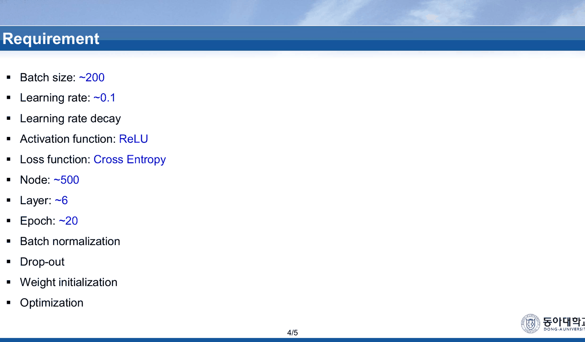
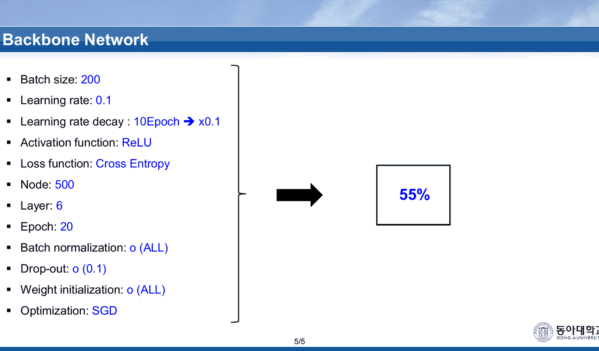
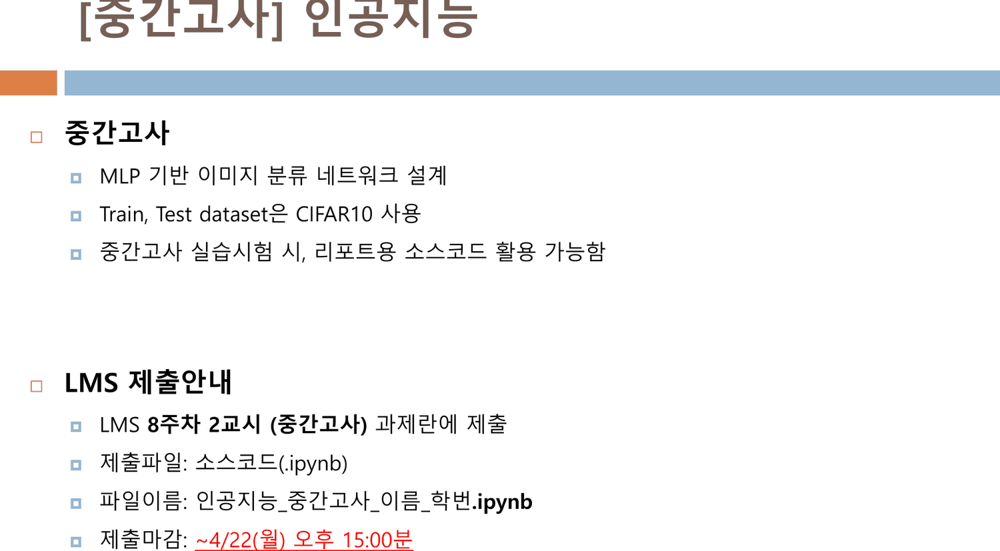
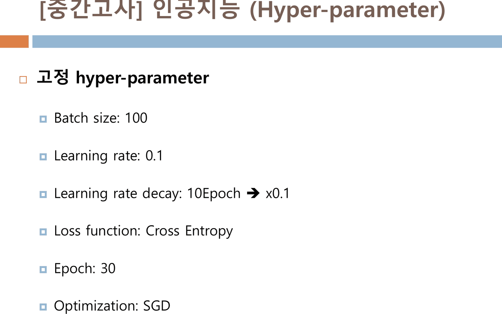
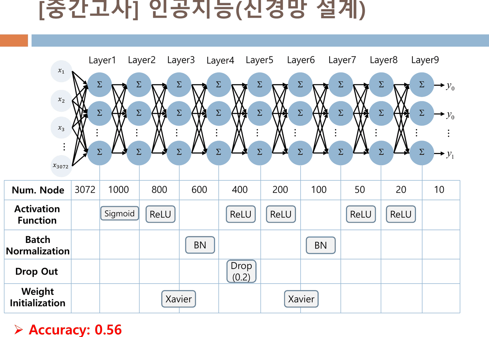
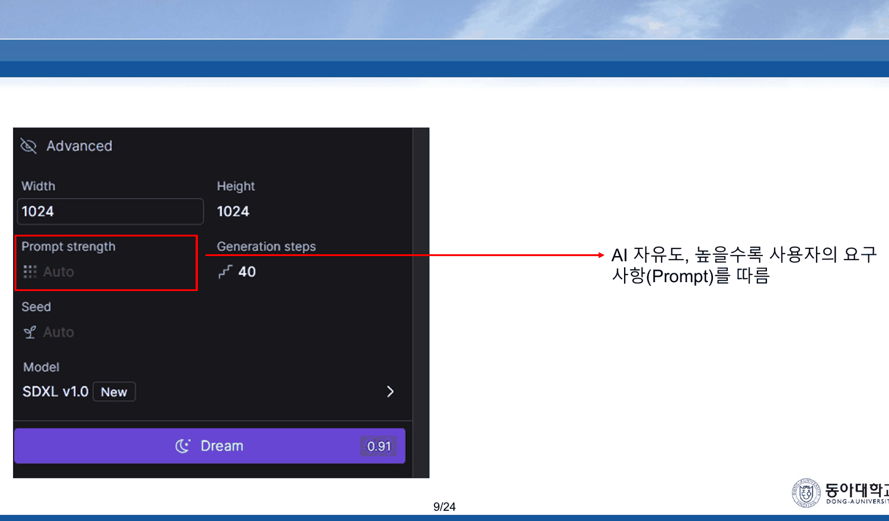
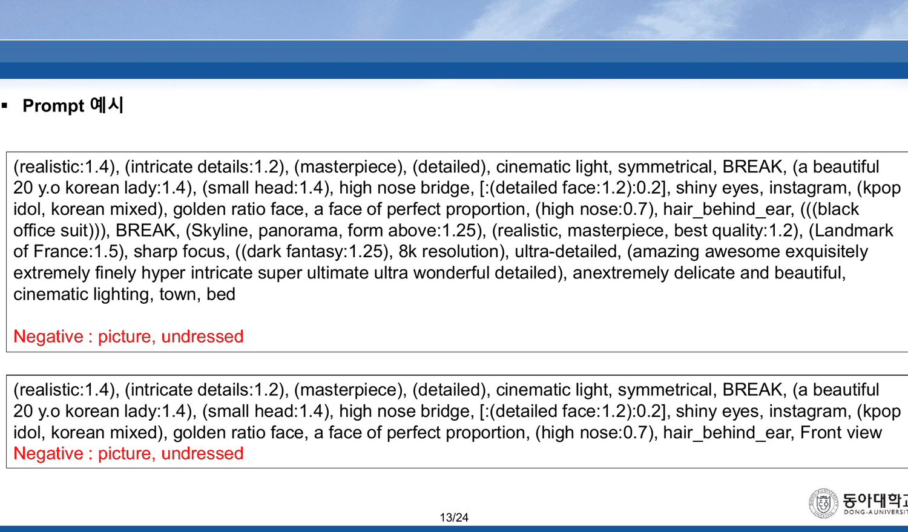
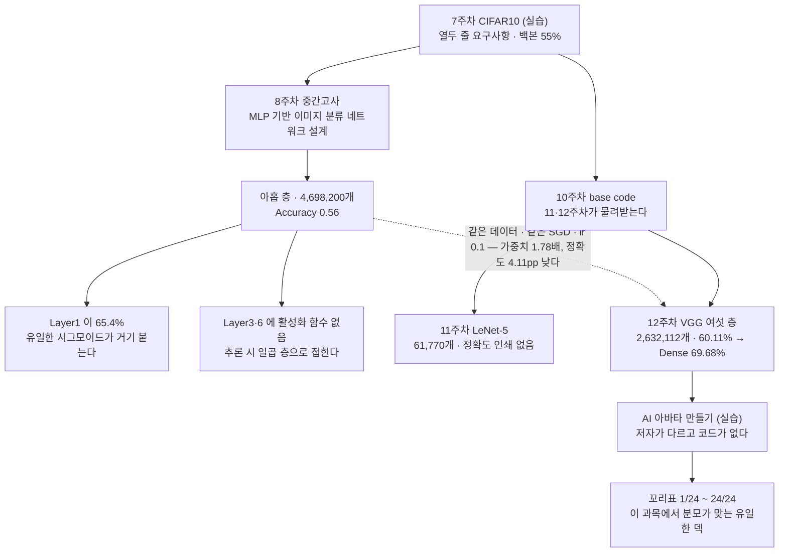

11·12주차 실습은 둘 다 「base code 다운로드」로 시작했다. 학생이 쓰는 것은 모델 클래스 하나였고 나머지는 물려받았다([23. LeNet-5의 가중치 95퍼센트는 합성곱 바깥에 있다](<./23. LeNet-5의 가중치 95퍼센트는 합성곱 바깥에 있다.md>)).

그 물려받은 코드가 `CIFAR10 (실습).pdf` 다. PDF 제목이 `07주_MLP_CIFAR10 실습` 이다 — **합성곱을 배우기 네 주 전에 만든 MLP 실습**이다.

그리고 중간고사가 묻는 것도 그것이다.

---

## CIFAR10 (실습) — 열두 줄의 요구사항과 55%

8쪽짜리 덱이고 꼬리표 분모가 **5** 다. 마지막 장이 `8/5` 다.

4번이 과제 명세다.



> **Requirement**
> Batch size: ~200 · Learning rate: ~0.1 · Learning rate decay · Activation function: ReLU · Loss function: Cross Entropy · Node: ~500 · Layer: ~6 · Epoch: ~20 · Batch normalization · Drop-out · Weight initialization · Optimization

열두 줄이다. 앞의 여덟은 값이 붙어 있고(`~` 는 상한으로 읽힌다) 뒤의 넷은 이름만 있다. 이 열두 줄이 [12. 여섯 가지를 가르치고 셋을 해 본다](<./12. 여섯 가지를 가르치고 셋을 해 본다.md>)와 [13. 덱은 1을 양쪽에서 배제한다](<./13. 덱은 1을 양쪽에서 배제한다.md>)가 읽은 6주차 덱들의 목록과 거의 그대로 겹친다 — 과적합 대책과 기울기 소실 대책을 한자리에 모아 학생에게 전부 쓰라고 한다.

5번이 모범 답안을 준다.



| | |
| --- | --- |
| Batch size | 200 |
| Learning rate | 0.1 |
| Learning rate decay | **10Epoch → ×0.1** |
| Node / Layer | 500 / 6 |
| Epoch | 20 |
| Batch normalization | o (ALL) |
| Drop-out | o (0.1) |
| Weight initialization | o (ALL) |
| Optimization | SGD |
| | **55%** |

**열두 처방을 전부 쓴 6층 MLP 가 55%** 다. 이 값이 이 과목에서 CIFAR-10 에 대해 처음 인쇄된 숫자다.

---

## 중간고사 — 묻는 것과 묻지 않는 것

시험지는 5쪽이다. 1번이 리포트 제출 목록을 적는다.

> (4주차) Perceptron · (5주차) Single Layer Perceptron (SLP), Multi Layer Perceptron (MLP) · (6주차) Vanishing Gradient, Overfitting · (7주차) MLP_CIFAR10

01~14번 노트가 읽은 덱들과 정확히 맞는다. 2번이 시험 자체를 정의한다.



> **중간고사**
> · **MLP 기반 이미지 분류 네트워크 설계**
> · Train, Test dataset은 CIFAR10 사용
> · 중간고사 실습시험 시, 리포트용 소스코드 활용 가능함
>
> 제출파일: 소스코드(.ipynb)

**필기가 아니라 실습 시험**이고, 자기 코드를 들고 들어갈 수 있다. 8주차 2교시에 CIFAR-10 분류기를 짜서 `.ipynb` 로 내는 것이 시험이다.

4번이 고정 하이퍼파라미터를 여섯 줄로 못 박는다.



Batch size 100 · Learning rate 0.1 · Learning rate decay 10Epoch ×0.1 · Cross Entropy · Epoch 30 · SGD. 7주차 백본과 비교하면 **배치가 절반이고 에폭이 1.5배**이며, 나머지 넷은 같다. 학생이 고를 수 있는 것은 **층의 개수와 노드 수, 그리고 각 층에 무엇을 붙일지**뿐이다 — 즉 시험이 평가하는 것은 5번 표를 채우는 능력이다.

5번이 모범 답안의 구조다.



```html preview
<div id="mx" style="font-family:system-ui,-apple-system,sans-serif;color:var(--foreground);background:var(--card);border:1px solid var(--border);border-radius:12px;padding:18px 16px;">
  <p style="margin:0 0 14px;font-size:13px;color:var(--muted-foreground);line-height:1.75;">
    중간고사 5번 표의 아홉 층이다. 층을 누르면 그 층에 붙은 것과 가중치 개수가 나온다.</p>
  <svg id="ms" viewBox="0 0 640 232" style="width:100%;height:auto;display:block;cursor:pointer;"></svg>
  <div id="mo" style="margin-top:10px;font-size:13.5px;line-height:1.95;min-height:4em;"></div>
</div>
<script>
(function(){
  const NS='http://www.w3.org/2000/svg', svg=document.getElementById('ms'), out=document.getElementById('mo');
  const el=(t,a,x)=>{const e=document.createElementNS(NS,t);for(const k in a)e.setAttribute(k,a[k]);
    if(x!==undefined)e.textContent=x;return e;};
  // 5번 표 그대로
  const N=[3072,1000,800,600,400,200,100,50,20,10];
  const ACT=['Sigmoid','ReLU','','ReLU','ReLU','','ReLU','ReLU',''];
  const BN =[false,false,true,false,false,true,false,false,false];
  const DO =[false,false,false,true,false,false,false,false,false];   // Drop (0.2)
  const WI =[false,true,false,false,true,false,false,false,false];    // Xavier
  const W=[]; for(let i=0;i<9;i++) W.push(N[i]*N[i+1]);
  const tot=W.reduce((a,b)=>a+b,0), max=Math.max(...W);
  const L=24,T=52,BW=66,H=104;
  svg.appendChild(el('text',{x:L,y:22,'font-size':11.5,fill:'var(--muted-foreground)','font-weight':700},
    '막대 높이 = 그 층의 가중치 개수 (선형 눈금) · 합계 '+tot.toLocaleString()));
  for(let i=0;i<9;i++){
    const x=L+i*BW, h=Math.max(3,H*W[i]/max);
    const g=el('g',{});
    const noAct = ACT[i]==='' && i<8;
    g.appendChild(el('rect',{x:x,y:T+H-h,width:BW-10,height:h,rx:3,
      fill: i===0?'var(--chart-2)':(noAct?'var(--border)':'var(--chart-1)'),opacity:0.85}));
    g.appendChild(el('text',{x:x+(BW-10)/2,y:T+H+15,'text-anchor':'middle','font-size':10.5,
      fill:'var(--muted-foreground)'},'L'+(i+1)));
    g.appendChild(el('text',{x:x+(BW-10)/2,y:T+H+29,'text-anchor':'middle','font-size':10,
      fill:'var(--foreground)'},String(N[i+1])));
    const tags=[]; if(ACT[i])tags.push(ACT[i]); if(BN[i])tags.push('BN');
    if(DO[i])tags.push('Drop'); if(WI[i])tags.push('Xavier');
    g.appendChild(el('text',{x:x+(BW-10)/2,y:T+H-h-6,'text-anchor':'middle','font-size':9,
      fill: ACT[i]==='Sigmoid'?'var(--chart-2)':'var(--muted-foreground)'},tags.join(' ')||'—'));
    g.addEventListener('click',()=>{
      out.innerHTML='<b>Layer'+(i+1)+'</b> — '+N[i]+' → '+N[i+1]+
        ' · 가중치 <b>'+W[i].toLocaleString()+'</b> (전체의 '+(W[i]/tot*100).toFixed(2)+'%)<br>'+
        '활성화 함수: <b>'+(ACT[i]||'없음')+'</b>'+
        (BN[i]?' · Batch Normalization':'')+(DO[i]?' · Drop Out (0.2)':'')+
        (WI[i]?' · Weight Initialization: Xavier':'')+
        (i===0?'<br><span style="color:var(--chart-2);">이 층 하나가 전체 가중치의 '+
          (W[0]/tot*100).toFixed(1)+'% 이고, 이 네트워크에서 유일한 시그모이드가 여기 붙는다.</span>':'')+
        (noAct?'<br><span style="color:var(--muted-foreground);">활성화 함수가 없다 — 추론 시에는 앞뒤 선형 사상과 하나로 합쳐진다.</span>':'')+
        (i===8?'<br><span style="color:var(--muted-foreground);">출력층이다. CrossEntropyLoss 가 소프트맥스를 품으므로 활성화 함수가 없는 것이 맞는다.</span>':'');
    });
    svg.appendChild(g);
  }
  svg.appendChild(el('text',{x:L,y:T+H+46,'font-size':11,fill:'var(--muted-foreground)'},
    '3072 → 1000 → 800 → 600 → 400 → 200 → 100 → 50 → 20 → 10'));
  out.innerHTML='<span style="color:var(--muted-foreground);">막대를 눌러 층을 고른다. '+
    '<b>Layer1</b> 하나가 '+W[0].toLocaleString()+'개 — 전체 '+tot.toLocaleString()+'개의 <b>'+
    (W[0]/tot*100).toFixed(1)+'%</b> 다. 회색 막대(L3·L6)는 활성화 함수가 없는 층이다.</span>';
})();
</script>
```

표의 네 행을 그대로 옮기면 이렇다.

| 층 | 노드 | 활성화 | BN | Drop Out | 초기화 |
| --- | ---: | --- | --- | --- | --- |
| Layer1 | 1000 | **Sigmoid** | | | |
| Layer2 | 800 | ReLU | | | Xavier |
| Layer3 | 600 | — | BN | | |
| Layer4 | 400 | ReLU | | Drop (0.2) | |
| Layer5 | 200 | ReLU | | | Xavier |
| Layer6 | 100 | — | BN | | |
| Layer7 | 50 | ReLU | | | |
| Layer8 | 20 | ReLU | | | |
| Layer9 | 10 | — | | | |

> **Accuracy: 0.56**

### 시그모이드가 1층에 있다

이 네트워크에 시그모이드는 하나뿐이고, 그것이 **첫 층**에 있다.

[13. 덱은 1을 양쪽에서 배제한다](<./13. 덱은 1을 양쪽에서 배제한다.md>)가 읽은 6주차 덱이 가르친 것이 정확히 이것이었다 — 시그모이드의 도함수 최댓값은 0.25 이고, 여러 층에 걸쳐 곱해지면 기울기가 죽는다. 그 덱의 해결책이 ReLU 계열이었고, 여기 여덟 층이 그것을 따른다.

그런데 남은 하나가 **기울기가 가장 늦게 도착하는 자리**에 놓였다. Layer1 의 기울기는 뒤 여덟 층을 전부 거친 다음 이 시그모이드의 $\sigma'(1-\sigma) \le 0.25$ 를 한 번 더 통과한다. 그리고 그 층이 **전체 가중치의 65.4%**(3,072,000개)를 들고 있다.

| | 값 |
| --- | ---: |
| Layer1 가중치 | 3,072,000 |
| 나머지 여덟 층 합 | 1,626,200 |
| 전체 | **4,698,200** |
| Layer1 의 몫 | **65.4%** |

표는 Layer2 와 Layer5 에 Xavier 초기화를 붙였다. 6주차 덱이 사비에르를 소개한 맥락이 시그모이드·tanh 의 포화를 늦추는 것이었는데, **정작 시그모이드가 붙은 Layer1 에는 초기화가 없다.**

### 3층과 6층은 추론 시 사라진다

Layer3 과 Layer6 에는 활성화 함수가 없다. 붙은 것은 배치 정규화뿐이다.

배치 정규화는 학습 중에는 배치 통계에 의존하지만, **추론 시에는 채널마다 고정된 아핀 변환**이다. 그러면 Layer3 주변은 이렇게 된다.

$$\text{ReLU} \;\to\; \underbrace{\text{Linear}_{800\to600} \;\to\; \text{BN} \;\to\; \text{Linear}_{600\to400}}_{\text{아핀 사상 셋의 합성}} \;\to\; \text{ReLU}$$

가운데 셋의 합성은 **하나의 아핀 사상 $800 \to 400$** 이다. 600 > 400 이므로 계수 제약도 걸리지 않는다. Layer6 도 같다 — $200 \to 100 \to 50$ 이고 100 > 50 이다.

| | 층 수 | 가중치 |
| --- | ---: | ---: |
| 표에 적힌 구조 | 9 | 4,698,200 |
| 추론 시 동등한 구조 | **7** | **4,283,200** |

**아홉 층이라고 적혀 있지만 추론 시 비선형은 여섯 번**(1층 시그모이드 + 2·4·5·7·8층 ReLU)이고, 그것이 만드는 층은 일곱이다. Layer3 과 Layer6 이 학습에 기여하는 것은 배치 정규화의 학습 시 동역학뿐이다. (이 접힘 계산은 원본에 없는 보충이다.)

Drop Out 은 Layer4 에 하나(0.2), 7주차 백본은 전체에 0.1 이었다. 두 문서가 같은 항목에 다른 값을 쓴다.

---

## 다섯 주 사이의 정확도

```html preview
<div id="ld" style="font-family:system-ui,-apple-system,sans-serif;color:var(--foreground);background:var(--card);border:1px solid var(--border);border-radius:12px;padding:18px 16px;">
  <p style="margin:0 0 14px;font-size:13px;color:var(--muted-foreground);line-height:1.75;">
    이 과목이 CIFAR-10 에 대해 인쇄한 모든 정확도를, 그 모델의 가중치 개수와 함께 놓는다.
    가로축은 가중치(로그), 세로축은 시험 정확도다.</p>
  <svg id="lds" viewBox="0 0 640 280" style="width:100%;height:auto;display:block;cursor:pointer;"></svg>
  <div id="ldo" style="margin-top:10px;font-size:13.5px;line-height:1.95;min-height:3.4em;"></div>
</div>
<script>
(function(){
  const NS='http://www.w3.org/2000/svg', svg=document.getElementById('lds'), out=document.getElementById('ldo');
  const el=(t,a,x)=>{const e=document.createElementNS(NS,t);for(const k in a)e.setAttribute(k,a[k]);
    if(x!==undefined)e.textContent=x;return e;};
  const P=[
   {n:'7주차 MLP 백본',   a:55.0, w:null, k:'mlp', d:'6층 · 500노드 · BN 전체 · Drop 0.1 · 초기화 전체 · 20에폭 · batch 200. 가중치 개수는 덱에 없다(노드 수만 인쇄).'},
   {n:'중간고사 MLP',     a:56.0, w:4698200, k:'mlp', d:'9층 3072→1000→…→10 · Sigmoid 하나 + ReLU 다섯 · BN 둘 · Drop(0.2) 하나 · Xavier 둘 · 30에폭 · batch 100.'},
   {n:'12주차 VGG 기준선',a:60.11,w:2632112, k:'cnn', d:'합성곱 여섯 층 + FC 셋 · 평균 풀링 셋 · 20에폭 · batch 100. 정규화 기법을 하나도 쓰지 않는다.'},
   {n:'12주차 + Skip',    a:66.87,w:2798864, k:'cnn', d:'지름길 3x3 합성곱 셋(+166,752).'},
   {n:'12주차 + Dense',   a:69.68,w:2673296, k:'cnn', d:'torch.cat 둘로 채널 35와 99(+41,184). 이 과목이 CIFAR-10 에서 인쇄한 최고값이다.'},
   {n:'12주차 + CA',      a:61.23,w:2640304, k:'cnn', d:'GAP + 1x1 합성곱 둘(+8,192).'}];
  const L=64,R=596,T=18,B=226;
  const lx=v=>Math.log10(v), X0=lx(2.0e6), X1=lx(5.2e6);
  const sx=v=>L+(lx(v)-X0)/(X1-X0)*(R-L), sy=v=>B-(v-52)/(72-52)*(B-T);
  for(let g=55;g<=70;g+=5){
    svg.appendChild(el('line',{x1:L,y1:sy(g),x2:R,y2:sy(g),stroke:'var(--border)',opacity:0.55}));
    svg.appendChild(el('text',{x:L-8,y:sy(g)+4,'text-anchor':'end','font-size':10,
      fill:'var(--muted-foreground)'},g+'%'));
  }
  [2.5e6,3e6,4e6,5e6].forEach(g=>{
    svg.appendChild(el('text',{x:sx(g),y:B+16,'text-anchor':'middle','font-size':10,
      fill:'var(--muted-foreground)'},(g/1e6).toFixed(1)+'M'));
  });
  svg.appendChild(el('text',{x:(L+R)/2,y:B+34,'text-anchor':'middle','font-size':11,
    fill:'var(--muted-foreground)'},'가중치 개수 (로그 눈금)'));
  P.forEach(p=>{
    const g=el('g',{});
    const c = p.k==='mlp' ? 'var(--chart-2)' : 'var(--chart-1)';
    if(p.w===null){
      g.appendChild(el('line',{x1:L,y1:sy(p.a),x2:R,y2:sy(p.a),stroke:c,'stroke-width':1.4,
        'stroke-dasharray':'5 4',opacity:0.8}));
      g.appendChild(el('text',{x:L+6,y:sy(p.a)-6,'font-size':10.5,fill:c},p.n+' '+p.a.toFixed(1)+'% (가중치 미상)'));
    } else {
      g.appendChild(el('circle',{cx:sx(p.w),cy:sy(p.a),r:6,fill:c,opacity:0.9}));
      g.appendChild(el('text',{x:sx(p.w)+10,y:sy(p.a)+4,'font-size':10.5,fill:'var(--foreground)'},
        p.n+' '+p.a.toFixed(2)+'%'));
    }
    g.addEventListener('click',()=>{ out.innerHTML='<b>'+p.n+'</b> — '+p.a.toFixed(2)+'%'+
      (p.w?' · 가중치 '+p.w.toLocaleString()+'개':' · 가중치 개수 미상')+'<br>'+
      '<span style="color:var(--muted-foreground);font-size:12.5px;">'+p.d+'</span>'; });
    svg.appendChild(g);
  });
  out.innerHTML='<span style="color:var(--muted-foreground);">점을 눌러 모델을 고른다. '+
    '중간고사 MLP 는 12주차 CNN 기준선보다 가중치가 <b>'+(4698200/2632112).toFixed(2)+'배</b> 많고 '+
    '정확도는 <b>4.11pp 낮다</b>. 여섯 모델 모두 CIFAR-10, 모두 SGD, 학습률 0.1 이다.</span>';
})();
</script>
```

| 주차 | 모델 | 가중치 | 에폭 | 정확도 |
| --- | --- | ---: | ---: | ---: |
| 7 | MLP 6층 (열두 처방 전부) | 미상 | 20 | 55% |
| 8 (시험) | MLP 9층 | 4,698,200 | 30 | **56%** |
| 11 | LeNet-5 | 61,770 | 미상 | **인쇄 없음** |
| 12 | VGG 여섯 층 기준선 | 2,632,112 | 20 | **60.11%** |
| 12 | + Dense connection | 2,673,296 | 20 | **69.68%** |

> [!important] 11주차 10번의 주장이 여기서 처음으로 검증된다
> `CNN (이론).pdf` 10번은 「CNN에 비해 필요한 weight parameter의 개수가 많음」이라며 FC 를 비난했고, 그 비교는 입력 크기도 출력 개수도 달라 성립하지 않았다([15. 같은 불평이 세 이름으로 세 번 나온다](<./15. 같은 불평이 세 이름으로 세 번 나온다.md>)).
>
> 중간고사와 12주차 실습은 **같은 데이터, 같은 옵티마이저, 같은 학습률**을 쓴다. 거기서 MLP 는 470만 개로 56% 를, CNN 은 263만 개로 60.11% 를 낸다 — **가중치는 1.78배 적고 정확도는 4.11pp 높다.** 덱이 하지 못한 비교를 두 문서가 다섯 주를 사이에 두고 완성한다.
>
> 에폭이 30 대 20 으로 다르다는 점은 CNN 쪽에 불리하게 작용한다. 두 문서 중 어느 쪽도 이 비교를 하지 않는다.

그리고 11주차 LeNet-5 는 여전히 빈칸이다. 61,770 개짜리 모델이 이 사다리의 어디에 놓이는지 이 과목은 끝내 말하지 않는다.

---

## AI 아바타 만들기 (실습) — 코드가 없는 마지막 덱

24쪽이다. 이 덱의 꼬리표는 `1/24` 부터 `24/24` 까지 — **이 과목에서 분자와 분모가 끝까지 맞는 유일한 덱**이다.


2번에 `AI학과(2학년) 인공지능수업 가상아바타` 아래 열 장의 생성 이미지가 있고(전부 `D-ID` 워터마크), 맨 아래 줄이 이렇다 — 「컴퓨터공학과 이영우 학생(지도교수: 전동산)의 도움으로 제작되었습니다.」

24번 Q&A 의 서명이 다른 덱과 다르다.

| | 이 덱 | 다른 모든 덱 |
| --- | --- | --- |
| 서명 | **Youngwoo Lee** (`duddn6464@donga.ac.kr`) | Dongsan Jun (`dsjun@dau.ac.kr`) |

**이 과목에서 저자가 다른 유일한 덱**이다.

내용은 두 부분이다(3번 목차: 「1. 아바타 만들기 / 2. 동영상 만들기」).

| 장 | 하는 일 |
| --- | --- |
| 4~14번 | `dream studio` 접속 → 프롬프트 입력 → 장르 선택 → 세 파라미터 → 프롬프트 예시 |
| 15~23번 | `studio.d-id.com` 접속 → 아바타 업로드 → 클로바 MP3 업로드 → `GENERATE VIDEO` |

9~11번이 세 파라미터를 화살표로 가리키며 설명한다. 이 덱에서 원리에 가장 가까운 세 장이다.



| 장 | 슬라이드의 설명 | 스크린샷의 실제 값 |
| --- | --- | --- |
| 9 | 「AI 자유도, 높을수록 사용자의 요구사항(Prompt)를 따름」 | `Prompt strength: **Auto**` |
| 10 | 「연산횟수가 높을수록 화질 상승」 | `Generation steps: 40` |
| 11 | 「해당 이미지에 미세한 변화를 주기 위해 사용」 | `Seed: **Auto**` |

세 설명 가운데 둘이 가리키는 칸이 **`Auto`** 로 남아 있다. 값을 바꾸면 무엇이 달라지는지 설명하면서, 화면에서는 그 값이 자동으로 설정되어 있다. 같은 화면에 `Width 1024` · `Height 1024` · `Model SDXL v1.0` · `Dream 0.91`(크레딧 비용)이 보이는데 그 넷에는 설명이 없다.

그리고 세 설명 모두 **파라미터의 이름을 쓰지 않는다.** `Prompt strength` 를 「AI 자유도」로, `Generation steps` 를 「연산횟수」로, `Seed` 를 「미세한 변화」로 부른다. 학생이 다른 도구에서 같은 손잡이를 찾으려면 이름이 필요한데, 이 덱은 효과로만 부른다.

13·14번이 프롬프트 예시 다섯 덩어리를 인쇄한다.



가중치 문법(`(realistic:1.4)`), 구간 문법(`[:(detailed face:1.2):0.2]`), 분리자(`BREAK`), LoRA 지정(`lora:koreanDollLikeness_v10:0.2`)이 전부 들어 있다. **문법은 설명되지 않는다** — 숫자가 무엇을 뜻하는지, 대괄호가 무엇인지, `BREAK` 가 왜 필요한지에 대한 줄이 없다. 14번은 출처를 한 줄 준다 — `https://prompthero.com/ 접속`.

내용 면에서 다섯 예시가 모두 같은 대상을 겨냥한다 — 「a beautiful 20 y.o korean lady」 · 「golden ratio face」 · 「a face of perfect proportion」 · 「small_face」 · 「perfect_face, perfect_eyes, perfect_chest, perfect_arms, perfect_hands」. 네거티브 프롬프트는 다섯 번 모두 `picture, undressed` 로 같다. 외모에 대한 특정한 이상을 가중치까지 붙여 적는 것이 이 실습의 입력이고, 덱은 그 점에 대해 한 줄도 쓰지 않는다.

> [!note] 이 덱이 과목의 나머지와 갖는 관계
> 앞선 스물세 편은 전부 직접 만드는 쪽이었다 — 층을 세고, 미분하고, 손실 로그를 읽었다. 이 덱은 완성된 두 서비스를 클릭하는 쪽이다. 학습도, 손실도, 데이터셋도, 코드도 없다.
>
> 두 세계를 잇는 문장은 덱에 없다. `SDXL v1.0` 이라는 모델 이름이 9번 스크린샷 안에 한 번 보이는 것이 이 과목의 나머지와 닿는 유일한 지점이고, 그마저 본문이 언급하지 않는다.

---

## 이 과목의 마지막 세 덱



---

## 근거 자료

세 편, 37쪽.

**`CIFAR10 (실습).pdf` 8쪽** — PDF 제목 `07주_MLP_CIFAR10 실습`, 꼬리표 분모 5

- 2번 — CIFAR-10 형상, Train 50,000 · Test 10,000
- 4번 — Requirement 열두 줄
- 5번 — Backbone Network 열 줄과 **55%**

**`24_인공지능_중간고사.pdf` 5쪽**

- 1번 — 리포트 제출 목록(4·5·6·7주차), `인공지능_중간고사_이름_학번.ZIP`, 제출마감 4/22(월) 15:00
- 2번 — 「MLP 기반 이미지 분류 네트워크 설계」, CIFAR10, 「리포트용 소스코드 활용 가능」, 제출파일 `.ipynb`
- 4번 — Batch size 100 · Learning rate 0.1 · decay 10Epoch ×0.1 · Cross Entropy · Epoch 30 · SGD
- 5번 — 노드 `3072 · 1000 · 800 · 600 · 400 · 200 · 100 · 50 · 20 · 10`, Activation(Sigmoid · ReLU · — · ReLU · ReLU · — · ReLU · ReLU · —), BN(Layer3 · Layer6), Drop Out(Layer4, 0.2), Weight Initialization(Layer2 · Layer5, Xavier), **Accuracy: 0.56**

**`AI 아바타 만들기 (실습).pdf` 24쪽**

- 2번 — 열 장의 생성 이미지(D-ID 워터마크), 「컴퓨터공학과 이영우 학생(지도교수: 전동산)의 도움으로 제작되었습니다.」
- 3번 — 목차 두 항목
- 4~8번 — `dream studio`, 프롬프트와 네거티브 프롬프트 예시, 장르 선택
- 9~11번 — 세 파라미터 설명, 스크린샷의 `Width 1024` · `Height 1024` · `Prompt strength: Auto` · `Generation steps: 40` · `Seed: Auto` · `Model SDXL v1.0` · `Dream 0.91`
- 13·14번 — 프롬프트 예시 다섯 덩어리, `https://prompthero.com/`
- 16~21번 — `studio.d-id.com`, `Create Video`, AI 성우, `ADD` 업로드, 클로바 MP3, `GENERATE VIDEO`
- 24번 — `Youngwoo Lee (duddn6464@donga.ac.kr)`

가중치 개수(4,698,200 · 4,283,200)와 층별 비율은 중간고사 5번 표의 노드 수만으로 파이썬 정수 연산으로 재계산했다. 12주차 모델들의 개수는 [21. 여섯 층은 세 에폭을 ln 10 에 앉아 있다가 빠져나온다](<./21. 여섯 층은 세 에폭을 ln 10 에 앉아 있다가 빠져나온다.md>)·[22. 훈련 손실 1등과 시험 정확도 1등이 다르다](<./22. 훈련 손실 1등과 시험 정확도 1등이 다르다.md>)에서 같은 방식으로 얻은 값이다. Layer3·Layer6 이 추론 시 접힌다는 것과 7층 등가 구조의 4,283,200 은 원본에 없는 보충이며 본문에 그렇게 표시했다.

---

## 이어지는 문서

- [13. 덱은 1을 양쪽에서 배제한다](<./13. 덱은 1을 양쪽에서 배제한다.md>) — 중간고사 Layer1 의 시그모이드를 읽는 데 필요한 6주차 내용
- [14. 다섯 층을 쌓으면 손실이 ln 10 에 붙는다](<./14. 다섯 층을 쌓으면 손실이 ln 10 에 붙는다.md>) — 같은 주 실습. 시그모이드를 깊이 쌓았을 때 무슨 일이 일어나는지
- [23. LeNet-5의 가중치 95퍼센트는 합성곱 바깥에 있다](<./23. LeNet-5의 가중치 95퍼센트는 합성곱 바깥에 있다.md>) — 이 덱의 코드를 물려받는 11주차
- [21. 여섯 층은 세 에폭을 ln 10 에 앉아 있다가 빠져나온다](<./21. 여섯 층은 세 에폭을 ln 10 에 앉아 있다가 빠져나온다.md>) — 60.11% 가 나온 실험
- [15. 같은 불평이 세 이름으로 세 번 나온다](<./15. 같은 불평이 세 이름으로 세 번 나온다.md>) — 여기서 검증되는 그 주장이 제기된 곳
