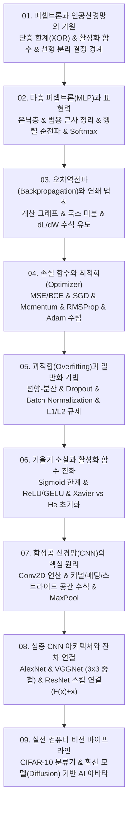

# 📚 인공지능 (Artificial Intelligence & Deep Learning) 전체 강의 로드맵

단층 퍼셉트론과 XOR 문제의 선형 분리 한계, 다층 퍼셉트론(MLP)과 범용 근사 정리, 연쇄 법칙 기반의 오차역전파(Backpropagation) 수학적 유도, 경사하강법과 모멘텀/Adam 최적화, 편향-분산 트레이드오프와 정규화(Dropout, BatchNorm, L1/L2), 기울기 소실과 활성화 함수 진화(Sigmoid ➔ ReLU/GELU) 및 가중치 초기화(Xavier/He), 합성곱 신경망(CNN)의 공간 차원 수식 및 수용장, 대표 심층 비전 아키텍처(AlexNet, VGGNet, ResNet 잔차 학습), 그리고 실전 CIFAR-10 및 생성형 AI 아바타 파이프라인까지 인공지능 딥러닝 전반을 체계적으로 다룹니다.

---

## 🗺️ 강의 목차 (Curriculum Overview)

---

## 📑 개별 정리 문서 목록

1. [01. 퍼셉트론과 인공신경망의 기원 - 단층 한계(XOR), 활성화 함수와 선형 분류](file:///Users/um-yunsang/work/edu/ComputerScience/03_ai-ml-data/artificial-intelligence/notes/01.%20%ED%8D%BC%EC%85%89%ED%8A%B8%EB%A1%A0%EA%B3%BC%20%EC%9D%B8%EA%B3%B5%EC%8B%A0%EA%B2%BD%EB%A7%9D%EC%9D%98%20%EA%B8%B0%EC%9B%90%20-%20%EB%8B%A8%EC%층%20%ED%95%9C%EA%B3%84(XOR),%20%ED%99%9C%EC%84%B1%ED%99%94%20%ED%95%A8%EC%88%98%EC%99%80%20%EC%84%A0%ED%98%95%20%EB%B6%84%EB%A5%98.md)
   - $z = \mathbf{w}^T \mathbf{x} + b$, XOR 선형 분리 불가 증명, 대화형 2D 퍼셉트론 분류기
2. [02. 다층 퍼셉트론(MLP)과 표현력 - 은닉층, 범용 근사 정리와 순전파 연산](file:///Users/um-yunsang/work/edu/ComputerScience/03_ai-ml-data/artificial-intelligence/notes/02.%20%EB%8B%A4%EC%층%20%ED%8D%BC%EC%85%89%ED%8A%B8%EB%A1%A0(MLP)%EA%B3%BC%20%ED%91%9C%ED%98%84%EB%A0%A5%20-%20%EC%9D%80%EB%8B%89%EC%층,%20%EB%B2%94%EC%9A%A9%20%EA%B7%BC%EC%82%AC%20%EC%A0%95%EB%A6%AC%EC%99%80%20%EC%88%9C%EC%A0%84%ED%8C%8C%20%EC%97%B0%EC%82%B0.md)
   - 범용 근사 정리, 행렬 순전파 공식, Softmax 다중 클래스 확률, 실시간 2층 MLP 연산기
3. [03. 오차역전파(Backpropagation)와 연쇄 법칙 - 가중치 그래디언트 유도와 계산 그래프](file:///Users/um-yunsang/work/edu/ComputerScience/03_ai-ml-data/artificial-intelligence/notes/03.%20%EC%98%A4%EC%B0%A8%EC%97%AD%EC%A0%84%ED%8C%8C(Backpropagation)%EC%99%80%20%EC%97%B0%EC%87%84%20%EB%B2%95%EC%B9%99%20-%20%EA%B0%80%EC%A4%91%EC%B9%98%20%EA%B7%B8%EB%9E%98%EB%94%94%EC%96%B8%ED%8A%B8%20%EC%9C%A0%EB%8F%84%EC%99%80%20%EA%B3%84%EC%82%B0%20%EA%B7%B8%EB%9E%98%ED%94%84.md)
   - 미분의 연쇄 법칙, 국소 그래디언트 $\delta$ 유도, 계산 그래프 시퀀스, 실시간 오차역전파 계산기
4. [04. 손실 함수와 경사하강법 및 최적화(Optimizer) - SGD, 모멘텀, RMSProp, Adam](file:///Users/um-yunsang/work/edu/ComputerScience/03_ai-ml-data/artificial-intelligence/notes/04.%20%EC%86%90%EC%8B%A4%20%ED%95%A8%EC%88%98%EC%99%80%20%EA%B2%BD%EC%82%AC%ED%95%98%EA%B0%95%EB%B2%95%20%EB%B0%8F%20%EC%B5%9C%EC%A0%81%ED%99%94(Optimizer)%20-%20SGD,%20%EB%AA%A8%EB%A9%98%ED%85%80,%20RMSProp,%20Adam.md)
   - 4대 옵티마이저 수식 비교, 안장점 탈출 메커니즘, 실시간 수렴 궤적 시뮬레이터
5. [05. 과적합(Overfitting)과 일반화 기법 - 편향-분산 트레이드오프, 드롭아웃, 배치 정규화, L1-L2 규제](file:///Users/um-yunsang/work/edu/ComputerScience/03_ai-ml-data/artificial-intelligence/notes/05.%20%EA%B3%BC%EC%A0%81%ED%95%A9(Overfitting)%EA%B3%BC%20%EC%9D%BC%EB%B0%98%ED%99%94%20%EA%B8%B0%EB%B2%95%20-%20%ED%8E%B8%ED%96%A5-%EB%B6%84%EC%82%B0%20%ED%8A%B8%EB%A0%88%EC%9D%B4%EB%93%9C%EC%98%A4%ED%94%84,%20%EB%93%9C%EB%A1%AD%EC%95%84%EC%9B%83,%20%EB%B0%B0%EC%B9%98%20%EC%A0%95%EA%B7%9C%ED%99%94,%20L1-L2%20%EA%B7%9C%EC%A0%9C.md)
   - L1 vs L2 규제, Dropout 앙상블 효과, BatchNorm 4단계, 실시간 L2 가중치 감쇠 시뮬레이터
6. [06. 기울기 소실(Vanishing Gradient)과 활성화 함수 진화 - Sigmoid의 한계, ReLU, LeakyReLU, GELU 및 가중치 초기화(Xavier-He)](file:///Users/um-yunsang/work/edu/ComputerScience/03_ai-ml-data/artificial-intelligence/notes/06.%20%EA%B8%B0%EC%9A%B8%EA%B8%B0%20%EC%86%8C%EC%8B%A4(Vanishing%20Gradient)%EA%B3%BC%20%ED%99%9C%EC%84%B1%ED%99%94%20%ED%95%A8%EC%88%98%20%EC%A7%84%ED%99%94%20-%20Sigmoid%EC%9D%98%20%ED%95%9C%EA%B3%84,%20ReLU,%20LeakyReLU,%20GELU%20%EB%B0%8F%20%EA%B0%80%EC%A4%91%EC%B9%98%20%EC%B4%88%EA%B8%B0%ED%99%94(Xavier-He).md)
   - $\sigma'(z) \le 0.25$ 소실 수식 유도, ReLU/GELU 비포화성, Xavier/He 분산 보존, 계층별 기울기 감쇠 시뮬레이터
7. [07. 합성곱 신경망(CNN)의 핵심 원리 - 합성곱 연산, 패딩·스트라이드 공간 차원 수식, 풀링과 채널](file:///Users/um-yunsang/work/edu/ComputerScience/03_ai-ml-data/artificial-intelligence/notes/07.%20%ED%95%A9%EC%84%B1%EA%B3%B1%20%EC%8B%A0%EA%B2%BD%EB%A7%9D(CNN)%EC%9D%98%20%ED%95%B5%EC%8B%AC%20%EC%9B%90%EB%A6%AC%20-%20%ED%95%A9%EC%84%B1%EA%B3%B1%20%EC%97%B0%EC%82%B0,%20%ED%8C%A8%EB%94%A9%C2%B7%EC%8A%A4%ED%8A%B8%EB%9D%BC%EC%9D%B4%EB%93%9C%20%EA%B3%B5%EA%B0%84%20%EC%B0%A8%EC%9B%90%20%EC%88%98%EC%8B%9D,%20%ED%92%80%EB%A7%81%EA%B3%BC%20%EC%Bchannel%EB%84%90.md)
   - $O = \lfloor(W-K+2P)/S\rfloor + 1$ 공식, 가중치 공유, 실시간 Conv2D 출력 차원 & 파라미터 계산기
8. [08. 심층 CNN 아키텍처와 잔차 연결 - AlexNet, VGGNet, ResNet의 잔차 블록과 특징 맵](file:///Users/um-yunsang/work/edu/ComputerScience/03_ai-ml-data/artificial-intelligence/notes/08.%20%EC%8B%AC%EC%층%20CNN%20%EC%95%84%ED%82%A4%ED%85%8D%EC%B2%98%EC%99%80%20%EC%9E%94%EC%B0%A8%20%EC%97%B0%EA%B2%B0%20-%20AlexNet,%20VGGNet,%20ResNet%EC%9D%98%20%EC%9E%94%EC%B0%A8%20%EB%B8%94%EB%A1%9D%EA%B3%BC%20%ED%8A%B9%EC%A7%95%20%EB%A7%B5.md)
   - $3 \times 3$ 중첩 수용장, ResNet $\mathcal{H}(\mathbf{x}) = \mathcal{F}(\mathbf{x}) + \mathbf{x}$ 잔차 고속도로, 실시간 스킵 연결 시뮬레이터
9. [09. 실전 컴퓨터 비전 파이프라인 - CIFAR-10 이미지 분류 모델 학습 및 생성형 AI 아바타 실습](file:///Users/um-yunsang/work/edu/ComputerScience/03_ai-ml-data/artificial-intelligence/notes/09.%20%EC%8B%A4%EC%A0%84%20%EC%BB%B4%ED%93%A8%ED%84%B0%20%EB%B9%84%EC%A0%84%20%ED%8C%8C%EC%9D%B4%ED%94%84%EB%9D%BC%EC%9D%B8%20-%20CIFAR-10%20%EC%9D%B4%EB%AF%B8%EC%A7%80%20%EB%B6%84%EB%A5%98%20%EB%AA%A8%EB%8D%B8%20%ED%95%99%EC%8A%B5%20%EB%B0%8F%20%EC%83%9D%EC%84%B1%ED%98%95%20AI%20%EC%95%84%EB%B0%94%ED%83%80%20%EC%8B%A4%EC%8A%B5.md)
   - CIFAR-10 학습 파이프라인, 확산(Diffusion) 모델 기반 AI 아바타 3단계 워크플로, 실시간 이미지 분류기 데모
