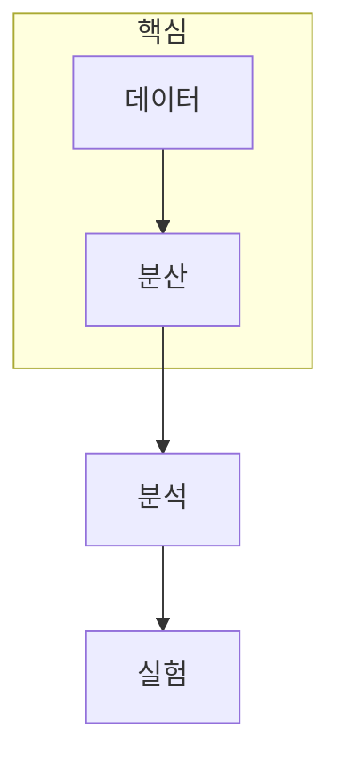

> [!abstract] 한 줄 요약
> 빅데이터 분석은 데이터의 규모와 불확실성, 실행 모델, 의사결정의 연결을 함께 다룬다.

## 강의 흐름 지도

[00. big-data-analysis 강의 흐름 지도](<./notes/00. big-data-analysis 강의 흐름 지도.md>)

## 이 과정의 지도



<Tabs>
  <Tab label="처리">하둡·Spark로 데이터를 저장하고 실행한다.</Tab>
  <Tab label="분석">통계·변수 선택·스트리밍으로 정보를 요약한다.</Tab>
  <Tab label="결정">다목적 최적화와 실험 추적으로 선택을 검증한다.</Tab>
</Tabs>

```html preview
<div style="font-family:system-ui,sans-serif;padding:20px">
  <div id="cards" style="display:flex;gap:14px;flex-wrap:wrap"></div>
  <script>
    var stats = [
      ['처리', '분산', '저장과 실행', 'var(--chart-1)'],
      ['분석', '통계', '요약과 선택', 'var(--chart-2)'],
      ['검증', '추적', '비교와 등록', 'var(--chart-3)']
    ];
    document.getElementById('cards').innerHTML = stats.map(function (s) {
      return '<div style="flex:1;min-width:150px;padding:16px;background:var(--card);' +
        'color:var(--card-foreground);border:1px solid var(--border);' +
        'border-radius:var(--radius)">' +
        '<div style="font-size:13px;color:var(--muted-foreground)">' + s[0] + '</div>' +
        '<div style="font-size:26px;font-weight:700;margin-top:4px">' + s[1] + '</div>' +
        '<div style="font-size:12px;font-weight:600;margin-top:4px;color:' + s[3] + '">' +
        s[2] + '</div>' +
        '</div>';
    }).join('');
  </script>
</div>
```

<details>
<summary>과정 사용법</summary>

각 노트에서 데이터 입력, 계산 가정, 결과를 사용할 의사결정을 먼저 구분한 뒤 점검 질문으로 돌아온다.

</details>

> [!tip] 학습 순서
> ==분산 처리의 비용==을 이해한 뒤 통계·스트리밍·실험 추적을 읽으면, 결과 숫자가 어떤 조건에서 나왔는지 해석하기 쉬워진다.

## 노트 목록

- [빅데이터 분석의 범위](<./notes/01. 빅데이터 분석의 범위.md>)
- [하둡과 분산 아키텍처](<./notes/02. 하둡과 분산 아키텍처.md>)
- [Apache Spark 미리보기](<./notes/03. Apache Spark 미리보기.md>)
- [Apache Spark의 배경](<./notes/04-1. Apache Spark의 배경.md>)
- [Spark RDD와 워크플로](<./notes/04-2. Spark RDD와 워크플로.md>)
- [데이터 통계 기초](<./notes/05. 데이터 통계 기초.md>)
- [변수 선택](<./notes/06. 변수 선택.md>)
- [스트리밍 알고리즘](<./notes/07. 스트리밍 알고리즘.md>)
- [다목적 최적화](<./notes/08. 다목적 최적화.md>)
- [MLFlow 설치와 실행](<./notes/09. MLFlow 설치와 실행.md>)

| 구간 | 학습 질문 | 다음 연결 |
| :-- | :-- | :-- |
| 처리 | 데이터를 어떻게 저장·실행하는가 | 분석 |
| 분석 | 불확실성과 특징을 어떻게 요약하는가 | 결정 |
| 검증 | 어떤 선택을 믿을 수 있는가 | 실험 추적 |

> [!question]- 스스로 점검
> **Q.** 분석 결과를 전달할 때 함께 적어야 하는 조건은 무엇인가?
>
> **A.** 입력 데이터, 계산·모델 가정, 결과를 적용할 의사결정 범위다.

## 출처

- 공개 노트에는 원본 강의 자료, 자산 이미지, 페이지 단위 근거를 포함하지 않는다.
