> [!abstract] 사용법
> 이 지도는 현재 폴더의 원본 PDF를 파일 순서대로 묶어 강의 진행 → 핵심 단서 → 점검 포인트를 연결합니다. 세부 개념은 같은 폴더의 주제 노트와 함께 대조하세요.

## 강의 흐름

```mermaid
flowchart LR
    A["01 — 1 빅데이터 분석이란 (Updated 2025) 2"]
    B["02 — 1 빅데이터 분석이란 (Updated 2025)"]
    C["03 — 2 하둡 및 분산 아키텍쳐"]
    D["04 — 3 아파치 스파크-Preview"]
    E["05 — 4-1 아파치 스파크-History"]
    F["06 — 4-2 아파치 스파크-Basics"]
    G["07 — 5 데이터 통계 기초"]
    H["08 — 6 변수 선택 (Variable Selection) 2"]
    A --> B
    B --> C
    C --> D
    D --> E
    E --> F
    F --> G
    G --> H
```



<Tabs>
  <Tab label="파일 순서">파일명에 포함된 주차·장·버전 표기를 먼저 읽어 강의의 큰 흐름을 잡습니다.</Tab>
  <Tab label="중복 자료">같은 접두사나 버전이 겹치면 앞 자료를 기준으로 뒤 자료의 보충·실습 여부를 비교합니다.</Tab>
  <Tab label="검증">파일명과 쪽수는 탐색용 단서입니다. 정의·식·코드·도식은 각 원본 PDF에서 다시 확인합니다.</Tab>
</Tabs>

## 원본 PDF 목록

| 파일 | 쪽수 | 확인 메모 |
| :-- | --: | :-- |
| 1 빅데이터 분석이란 (Updated 2025) 2.pdf | 75 | 원본 첫 페이지·본문 대조 |
| 1 빅데이터 분석이란 (Updated 2025).pdf | 75 | 원본 첫 페이지·본문 대조 |
| 2 하둡 및 분산 아키텍쳐.pdf | 100 | 원본 첫 페이지·본문 대조 |
| 3 아파치 스파크-Preview.pdf | 19 | 원본 첫 페이지·본문 대조 |
| 4-1 아파치 스파크-History.pdf | 20 | 원본 첫 페이지·본문 대조 |
| 4-2 아파치 스파크-Basics.pdf | 26 | 원본 첫 페이지·본문 대조 |
| 5 데이터 통계 기초.pdf | 19 | 원본 첫 페이지·본문 대조 |
| 6 변수 선택 (Variable Selection) 2.pdf | 71 | 원본 첫 페이지·본문 대조 |
| 6 변수 선택 (Variable Selection).pdf | 71 | 원본 첫 페이지·본문 대조 |
| 7 스트리밍 알고리즘.pdf | 58 | 원본 첫 페이지·본문 대조 |
| 8 다목적 최적화 2.pdf | 20 | 원본 첫 페이지·본문 대조 |
| 8 다목적 최적화.pdf | 20 | 원본 첫 페이지·본문 대조 |
| 개념문제_풀이.pdf | 7 | 원본 첫 페이지·본문 대조 |
| 기본 개념문제-빅데이터분석.pdf | 2 | 원본 첫 페이지·본문 대조 |
| 연습문제_빅데이터분석.pdf | 4 | 원본 첫 페이지·본문 대조 |
| 연습문제_풀이 2.pdf | 15 | 원본 첫 페이지·본문 대조 |
| 연습문제_풀이.pdf | 15 | 원본 첫 페이지·본문 대조 |
| 이론정리.pdf | 9 | 원본 첫 페이지·본문 대조 |
| MLFlow 설치 및 실행.pdf | 3 | 원본 첫 페이지·본문 대조 |

## 원본 단계 인터랙티브

```html preview
<div style="font-family:system-ui,sans-serif;padding:20px;color:var(--foreground)">
  <label for="flow2107210828" style="font-size:14px;font-weight:600">원본 자료 단계</label>
  <div id="flow2107210828-out" style="font-size:24px;font-weight:700;color:var(--chart-1);margin:6px 0">1 빅데이터 분석이란 (Updated 2025) 2</div>
  <input id="flow2107210828" type="range" min="1" max="19" step="1" value="1" style="width:100%;accent-color:var(--primary)" />
  <p style="font-size:13px;color:var(--muted-foreground)">슬라이더를 움직이면 파일명 순서대로 자료의 위치를 확인합니다.</p>
  <script>
    var flow2107210828 = document.getElementById('flow2107210828');
    var flow2107210828Out = document.getElementById('flow2107210828-out');
    var flow2107210828Steps = ["1 빅데이터 분석이란 (Updated 2025) 2","1 빅데이터 분석이란 (Updated 2025)","2 하둡 및 분산 아키텍쳐","3 아파치 스파크-Preview","4-1 아파치 스파크-History","4-2 아파치 스파크-Basics","5 데이터 통계 기초","6 변수 선택 (Variable Selection) 2","6 변수 선택 (Variable Selection)","7 스트리밍 알고리즘","8 다목적 최적화 2","8 다목적 최적화","개념문제_풀이","기본 개념문제-빅데이터분석","연습문제_빅데이터분석","연습문제_풀이 2","연습문제_풀이","이론정리","MLFlow 설치 및 실행"];
    flow2107210828.addEventListener('input', function () {
      flow2107210828Out.textContent = flow2107210828Steps[Number(flow2107210828.value) - 1] || '';
    });
  </script>
</div>
```

## 점검 포인트

- **범위:** 19개 PDF, 총 629쪽.
- **근거:** 쪽수와 파일명은 현재 sources/ 디렉터리에서 직접 수집했습니다.
- **학습 순서:** 흐름도와 슬라이더를 먼저 훑은 뒤, 주제 노트의 정의·절차·실습 결과를 순서대로 대조합니다.

> [!warning] 과해석 방지
> 이 지도에는 파일명·쪽수·확인 메모만 기록했습니다. PDF에 없는 구현 세부, 성능 수치, 권장 설정은 추가하지 않습니다.

<details>
<summary>다음 읽기</summary>

현재 단계의 원본을 열어 제목·절차·도식을 확인한 뒤, 같은 폴더의 주제 노트에 해당 근거가 반영되었는지 점검하세요.

</details>
