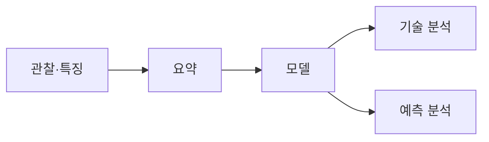

> [!abstract] 한 줄 요약
> 빅데이터 분석은 큰 데이터를 다루는 도구만의 이름이 아니라, 관찰과 특징에서 ==모델·요약·일반화==를 만드는 작업이다.

## 분석이 만드는 두 종류의 결과

강의는 빅데이터를 데이터마이닝·예측 분석·데이터 과학과 연결하며, 데이터의 모델과 요약을 일반화하는 일로 소개한다.

<Tabs>
  <Tab label="기술 분석">
  이미 가진 데이터 자체를 일반화해 표현하고 요약한다.
  </Tab>
  <Tab label="예측 분석">
  새 데이터에도 적용할 수 있는 일반화된 대상을 만든다.
  </Tab>
  <Tab label="공통 기반">
  많은 관찰과 특징을 처리할 수 있는 데이터 프레임워크와 알고리즘이 필요하다.
  </Tab>
</Tabs>



> [!important] 프레임워크와 분석은 역할이 다르다
> Hadoop File System·Spark·Streaming·MapReduce는 데이터를 처리하기 위한 기반이고, 유사도 탐색·선형 모델·추천·그래프 분석·딥러닝은 그 위에서 문제를 푸는 분석의 예다.

```html preview h=175
<div style="font-family:system-ui,sans-serif;padding:16px;color:var(--foreground);background:var(--card);border:1px solid var(--border);border-radius:var(--radius)">
  <div style="font-weight:700;margin-bottom:10px">처리 기반과 분석 목표를 분리해 보기</div>
  <div style="display:flex;gap:12px;flex-wrap:wrap">
    <div style="flex:1;min-width:180px;padding:14px;border:1px solid var(--chart-1);border-radius:var(--radius)"><b>데이터 프레임워크</b><br><span style="font-size:13px;color:var(--muted-foreground)">저장·분산·스트리밍·계산</span></div>
    <div style="flex:1;min-width:180px;padding:14px;border:1px solid var(--chart-2);border-radius:var(--radius)"><b>알고리즘·분석</b><br><span style="font-size:13px;color:var(--muted-foreground)">유사도·추천·모델·그래프</span></div>
  </div>
</div>
```

<details>
<summary>“일반화”를 데이터 요약으로 읽기</summary>

강의의 사례에서는 웹 페이지를 하나의 점수로 요약하거나, 많은 픽셀을 몇 개의 군집으로 요약하고, 구매 기록에서 자주 함께 등장하는 항목을 찾는다. 원본 관찰을 모두 외우는 대신 문제에 맞는 구조를 만든다는 뜻이다.

</details>

## 수업이 다루는 데이터와 계산 모델

강의는 고차원 데이터, 그래프, 끝나지 않는 데이터, 레이블된 데이터를 분석 대상으로 든다. 처리 방법도 하나가 아니라 MapReduce, 스트림·온라인 알고리즘, 단일 머신 메모리 처리, Spark·TensorFlow를 함께 제시한다.

> [!note] 데이터 성질이 모델 선택을 바꾼다
> 그래프의 연결 관계, 계속 들어오는 데이터, 많은 변수, 레이블 유무는 모두 동일한 계산 흐름으로 다루기 어렵다. 그래서 데이터의 성질과 계산 모델을 함께 고른다.

```html preview h=170
<div style="font-family:system-ui,sans-serif;padding:16px;color:var(--foreground)">
  <div style="font-weight:700;margin-bottom:10px">분석 설계의 두 질문</div>
  <svg viewBox="0 0 720 95" width="100%" role="img" aria-label="독자 제작 데이터 성질과 계산 모델 선택 도식"><g font-family="system-ui,sans-serif" text-anchor="middle"><rect x="24" y="22" width="205" height="48" rx="10" fill="var(--card)" stroke="var(--border)"/><rect x="492" y="22" width="205" height="48" rx="10" fill="var(--card)" stroke="var(--border)"/><path d="M244 46h230" stroke="var(--muted-foreground)" stroke-width="3"/><text x="126" y="51" font-size="14" font-weight="700" fill="currentColor">데이터는 어떤 성질인가</text><text x="594" y="51" font-size="14" font-weight="700" fill="currentColor">어떤 계산 모델이 맞는가</text><text x="360" y="33" font-size="12" fill="var(--chart-3)">설계 선택</text></g></svg>
</div>
```

> [!tip] 실제 문제로 검증하기
> 추천 시스템, 장바구니 분석, 스팸·중복 문서 탐지, 지리 정보 부호화는 모두 데이터를 모으는 데서 끝나지 않고 어떤 일반화가 필요한지 묻는 예다.

<details>
<summary>도구 목록을 외우는 대신 물을 질문</summary>

“이 문제는 끝나지 않는 입력인가?”, “관계가 그래프인가?”, “결과가 예측인가 요약인가?”를 먼저 묻는다. 그 다음에 분산 처리·스트리밍·메모리 계산·학습 도구 중 필요한 조합을 결정한다.

</details>

### 분석 설계에서 주의할 점

데이터 양이 늘어도 요약 방식과 모델이 문제에 맞지 않으면 유용한 일반화가 되지 않는다. 강의의 초점은 크기 자체보다 데이터·프레임워크·알고리즘의 연결에 있다.

> [!success] 핵심 정리
> 빅데이터 분석의 목표는 관찰을 줄이는 것이 아니라, 많은 관찰과 특징에서 새 데이터에도 쓸 수 있는 설명 또는 예측을 만드는 것이다.

| 관점 | 질문 | 예 |
| :-- | :-- | :-- |
| 데이터 | 어떤 구조인가 | 고차원·그래프·무한 입력·레이블 |
| 처리 | 어떻게 계산하는가 | MapReduce·스트림·메모리·Spark |
| 분석 | 무엇을 일반화하는가 | 요약·예측·추천·관계 분석 |

### 스스로 점검

**Q.** 기술 분석과 예측 분석의 차이는 무엇인가?

**A.** 기술 분석은 가진 데이터의 구조를 요약해 표현하고, 예측 분석은 새로운 데이터에도 적용할 수 있는 일반화된 대상을 만든다.
