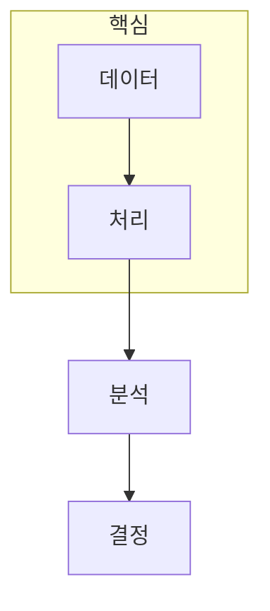

> [!abstract] 한 줄 요약
> 빅데이터 분석은 큰 데이터를 다루는 기술만이 아니라, ==데이터에서 일반화 가능한 판단==을 만드는 과정이다.

## 이 노트의 지도



## 1. 분석은 데이터를 질문에 맞는 표현으로 바꾼다

빅데이터는 데이터마이닝, 예측 분석, 데이터 과학과 겹치는 영역을 가진다. 중요한 것은 데이터 크기 자체보다 어떤 의사결정 질문에 필요한 패턴을 찾고, 그 패턴이 새로운 데이터에도 의미가 있는지 확인하는 일이다.

<details>
<summary>분석 결과를 읽는 세 질문</summary>

무엇을 입력으로 삼았는지, 어떤 처리·모델 가정을 두었는지, 결과가 어떤 의사결정을 바꾸는지를 구분한다. 이 세 질문이 빠지면 예측값만 남고 해석이 사라진다.

</details>

> [!caution] 데이터와 결론의 거리
> 많은 행을 모았다는 사실만으로 편향·누락·측정 오류가 사라지지는 않는다.

## 2. 실제 문제는 계산 모델과 함께 정해진다

그래프 분석, 유사도 검색, 입지 선정 같은 문제는 데이터 구조와 처리 방식이 함께 선택되어야 한다. ==문제 구조==를 먼저 적으면 분산 처리·통계·머신러닝 중 무엇이 필요한지 더 명확해진다.

## 분석 관점 카드

```html preview
<div style="font-family:system-ui,sans-serif;padding:20px">
  <div id="cards" style="display:flex;gap:14px;flex-wrap:wrap"></div>
  <script>
    var stats = [
      ['데이터', '관측', '무엇을 모았는가', 'var(--chart-1)'],
      ['모델', '가정', '무엇을 일반화하는가', 'var(--chart-2)'],
      ['결정', '행동', '무엇을 바꾸는가', 'var(--chart-3)']
    ];
    document.getElementById('cards').innerHTML = stats.map(function (s) {
      return '<div style="flex:1;min-width:150px;padding:16px;background:var(--card);' +
        'color:var(--card-foreground);border:1px solid var(--border);' +
        'border-radius:var(--radius)">' +
        '<div style="font-size:13px;color:var(--muted-foreground)">' + s[0] + '</div>' +
        '<div style="font-size:26px;font-weight:700;margin-top:4px">' + s[1] + '</div>' +
        '<div style="font-size:12px;font-weight:600;margin-top:4px;color:' + s[3] + '">' +
        s[2] + '</div>' +
        '</div>';
    }).join('');
  </script>
</div>
```

<Tabs>
  <Tab label="입력">테이블·그래프·로그처럼 데이터 구조를 확인한다.</Tab>
  <Tab label="처리">집계·검색·학습에 맞는 계산 모델을 고른다.</Tab>
  <Tab label="판단">결과의 적용 범위와 오류 조건을 함께 기록한다.</Tab>
</Tabs>

## 핵심 정리

| 관점 | 확인할 질문 | 학습상 의미 |
| :-- | :-- | :-- |
| 데이터 | 무엇을 관측했는가 | 품질과 대표성 |
| 계산 | 어떻게 처리하는가 | 규모와 자원 |
| 분석 | 무엇을 예측·설명하는가 | 일반화 |
| 적용 | 어떤 선택을 바꾸는가 | 가치와 책임 |

> [!question]- 스스로 점검
> **Q.** 데이터 분석 과제를 시작할 때 모델보다 먼저 써야 할 문장은 무엇인가?
>
> **A.** 어떤 데이터로 어떤 결정을 더 잘 내리려는지다.

## 출처

- 공개 노트에는 원본 강의 자료, 자산 이미지, 페이지 단위 근거를 포함하지 않는다.

---

## 원본 강의 흐름 인터랙티브

```html preview
<div style="font-family:system-ui,sans-serif;padding:20px;color:var(--foreground)">
  <label for="bd01" style="font-size:14px;font-weight:600">빅데이터 분석 단계</label>
  <div id="bd01-out" style="font-size:26px;font-weight:700;color:var(--chart-1);margin:6px 0">범위 파악</div>
  <input id="bd01" type="range" min="1" max="3" step="1" value="1" style="width:100%;accent-color:var(--primary)" />
  <p style="font-size:13px;color:var(--muted-foreground)">슬라이더를 움직이면 이 노트의 원본 주제 순서를 확인합니다.</p>
  <script>
    var bd01 = document.getElementById('bd01');
    var bd01Out = document.getElementById('bd01-out');
    var bd01Steps = ['범위 파악', '계산·구성', '검증·응용'];
    bd01.addEventListener('input', function () { bd01Out.textContent = bd01Steps[Number(bd01.value) - 1]; });
  </script>
</div>
```
