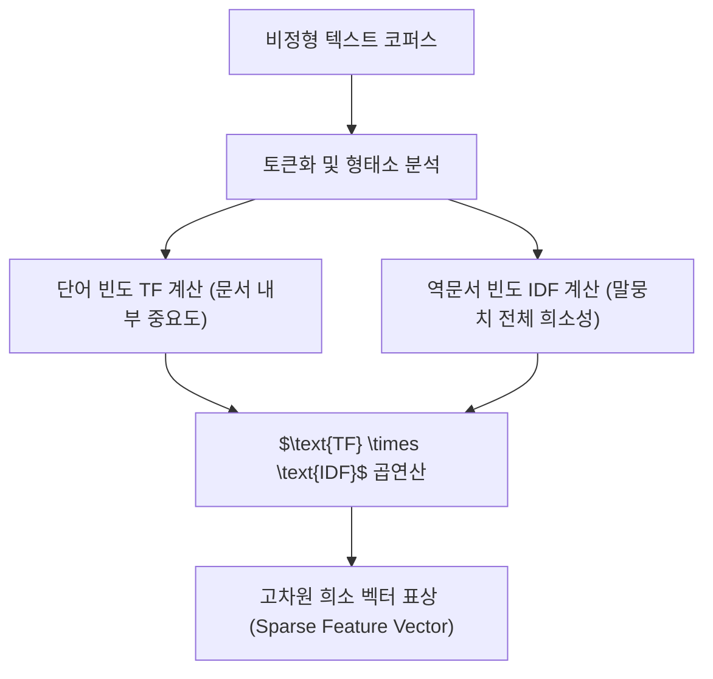

> [!abstract] 핵심 요약
> **빅데이터(Big Data)**는 전통적인 단일 노드 RDBMS의 저장 및 처리 한계를 초과하는 초대규모 데이터셋을 의미하며, 규모(Volume), 속도(Velocity), 다양성(Variety)의 3V 특성으로 정의된다.
> 빅데이터 내의 많은 현상(웹 트래픽, 단어 빈도, 소셜 연결)은 정규분포가 아닌 **멱법칙(Power Law: $P(x) \propto x^{-\alpha}$)**을 따르며, 텍스트 데이터의 특징을 추출하기 위해 특정 단어의 문서 내 출현 빈도와 전체 말뭉치 내 희소성을 결합한 **TF-IDF(Term Frequency-Inverse Document Frequency)** 가중치 모델이 널리 활용된다.

---

## 1. 멱법칙(Power Law)과 TF-IDF 수학적 공식

### 1.1 지프의 법칙과 멱법칙

$$P(X = x) = C \cdot x^{-\alpha} \quad (\alpha > 1)$$

단어의 빈도 순위 $r$과 해당 단어의 출현 빈도 $f(r)$ 사이에는 반비례 관계가 성립한다:

$$f(r) \propto \frac{1}{r^s}$$

### 1.2 TF-IDF 가중치 수식

$$\text{TF-IDF}(t, d, D) = \text{TF}(t, d) \times \text{IDF}(t, D)$$

$$\text{TF}(t, d) = \frac{f_{t, d}}{\sum_{t' \in d} f_{t', d}}, \quad \text{IDF}(t, D) = \log \left( \frac{|D|}{1 + |\{d \in D : t \in d\}|} \right)$$

- $|D|$: 전체 문서 수.
- $|\{d \in D : t \in d\}|$: 단어 $t$가 포함된 문서의 수(Document Frequency, $DF$).



---

## 2. 3V 모델 및 데이터 유형 분류

| 특성 차원 | 핵심 정의 | 엔지니어링 고려 사항 |
| :-- | :-- | :-- |
| **Volume (규모)** | 테라바이트(TB)에서 페타바이트(PB) 이상의 저장 용량 | 분산 파일 시스템(HDFS, S3) 기반 수평 확장 |
| **Velocity (속도)** | 실시간 센서 로그, 금융 거래, 클릭스트림 생성 속도 | 스트리밍 엔진(Spark Streaming, Flink, Kafka) |
| **Variety (다양성)** | 정형(RDBMS), 반정형(JSON, XML), 비정형(텍스트, 영상) | 스키마-온-리드(Schema-on-Read), 멀티모달 파서 |

---

## 3. 실시간 TF-IDF 단어 가중치 계산기

```html preview
<div style="font-family:system-ui,-apple-system,sans-serif;padding:20px;background:var(--card);color:var(--card-foreground);border:1px solid var(--border);border-radius:var(--radius)">
  <div style="font-size:16px;font-weight:700;margin-bottom:14px;color:var(--primary);display:flex;align-items:center;gap:8px">
    <span>📊 TF-IDF 텍스트 가중치 계산기</span>
  </div>

  <div style="display:grid;grid-template-columns:repeat(3, 1fr);gap:10px;margin-bottom:14px">
    <div>
      <label style="font-size:10px;color:var(--muted-foreground)">문서 내 단어 빈도 (TF Count):</label>
      <input id="inTfCount" type="number" value="5" min="1" max="100" style="width:100%;padding:4px;background:var(--background);color:var(--foreground);border:1px solid var(--border);border-radius:var(--radius);font-weight:700" />
    </div>
    <div>
      <label style="font-size:10px;color:var(--muted-foreground)">전체 문서 수 (|D|):</label>
      <input id="inTotalDocs" type="number" value="1000" min="10" max="100000" style="width:100%;padding:4px;background:var(--background);color:var(--foreground);border:1px solid var(--border);border-radius:var(--radius);font-weight:700" />
    </div>
    <div>
      <label style="font-size:10px;color:var(--muted-foreground)">단어 포함 문서 수 (DF):</label>
      <input id="inDfCount" type="number" value="20" min="1" max="1000" style="width:100%;padding:4px;background:var(--background);color:var(--foreground);border:1px solid var(--border);border-radius:var(--radius);font-weight:700" />
    </div>
  </div>

  <div style="display:grid;grid-template-columns:repeat(3, 1fr);gap:10px;margin-bottom:12px">
    <div style="padding:10px;background:var(--background);border:1px solid var(--border);border-radius:var(--radius);text-align:center">
      <div style="font-size:10px;color:var(--muted-foreground)">TF (Normalized)</div>
      <div id="tfOut" style="font-family:monospace;font-size:14px;font-weight:800">0.050</div>
    </div>
    <div style="padding:10px;background:var(--background);border:1px solid var(--border);border-radius:var(--radius);text-align:center">
      <div style="font-size:10px;color:var(--muted-foreground)">IDF Score</div>
      <div id="idfOut" style="font-family:monospace;font-size:14px;font-weight:800;color:var(--chart-1)">3.863</div>
    </div>
    <div style="padding:10px;background:var(--background);border:1px solid var(--border);border-radius:var(--radius);text-align:center">
      <div style="font-size:10px;color:var(--muted-foreground)">최종 TF-IDF</div>
      <div id="tfidfOut" style="font-family:monospace;font-size:14px;font-weight:800;color:var(--primary)">0.193</div>
    </div>
  </div>

  <script>
    function updateTfIdf() {
      var tfC = parseFloat(document.getElementById('inTfCount').value) || 1;
      var totalD = parseFloat(document.getElementById('inTotalDocs').value) || 10;
      var dfC = parseFloat(document.getElementById('inDfCount').value) || 1;

      var tf = tfC / 100.0;
      var idf = Math.log((totalD + 1) / (dfC + 1)) + 1;
      var score = tf * idf;

      document.getElementById('tfOut').textContent = tf.toFixed(3);
      document.getElementById('idfOut').textContent = idf.toFixed(3);
      document.getElementById('tfidfOut').textContent = score.toFixed(4);
    }

    ['inTfCount', 'inTotalDocs', 'inDfCount'].forEach(function(id) {
      document.getElementById(id).addEventListener('input', updateTfIdf);
    });
    updateTfIdf();
  </script>
</div>
```
