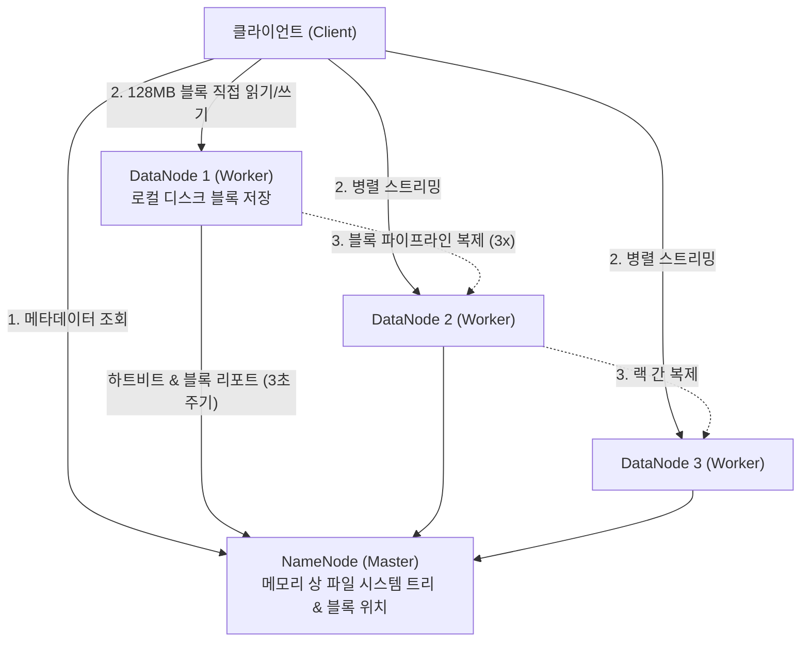

> [!abstract] 핵심 요약
> 대규모 데이터를 중앙 서버로 전송하여 연산하는 기존 방식은 네트워크 대역폭 병목을 유발한다.
> **하둡(Hadoop)**은 데이터를 대용량 블록(기본 128MB)으로 분할하여 여러 노드에 복제 저장하는 **HDFS**와, 데이터가 위치한 물리적 노드로 코드를 전송하여 병렬 처리하는 **데이터 지역성(Data Locality)** 기반의 **맵리듀스(MapReduce)** 엔진을 통해 페타바이트급 분산 연산을 가능하게 했다.

---

## 1. HDFS 마스터-워커 아키텍처 및 복제 정책



---

## 2. 맵리듀스(MapReduce) 3단계 데이터 흐름


---

## 3. 실시간 맵리듀스(MapReduce) 워드 카운트 시뮬레이터

```html preview
<div style="font-family:system-ui,-apple-system,sans-serif;padding:20px;background:var(--card);color:var(--card-foreground);border:1px solid var(--border);border-radius:var(--radius)">
  <div style="font-size:16px;font-weight:700;margin-bottom:14px;color:var(--primary);display:flex;align-items:center;gap:8px">
    <span>⚙️ MapReduce 워드 카운트(Word Count) 파이프라인</span>
  </div>

  <div style="margin-bottom:14px">
    <label style="font-size:11px;color:var(--muted-foreground)">분석할 문장 입력:</label>
    <input id="inMrText" type="text" value="spark hadoop mapreduce hadoop spark spark" style="width:100%;padding:6px;background:var(--background);color:var(--foreground);border:1px solid var(--border);border-radius:var(--radius);font-family:monospace;font-size:12px;font-weight:700" />
  </div>

  <div style="display:grid;grid-template-columns:repeat(3, 1fr);gap:10px;margin-bottom:12px">
    <div style="padding:10px;background:var(--background);border:1px solid var(--border);border-radius:var(--radius)">
      <div style="font-size:10px;font-weight:700;color:var(--muted-foreground);margin-bottom:4px">1. Map 단계 출력</div>
      <div id="mrMapOut" style="font-family:monospace;font-size:10px;white-space:pre-wrap;line-height:1.4"></div>
    </div>
    <div style="padding:10px;background:var(--background);border:1px solid var(--border);border-radius:var(--radius)">
      <div style="font-size:10px;font-weight:700;color:var(--muted-foreground);margin-bottom:4px">2. Shuffle & Sort 그룹화</div>
      <div id="mrShuffleOut" style="font-family:monospace;font-size:10px;white-space:pre-wrap;line-height:1.4"></div>
    </div>
    <div style="padding:10px;background:var(--background);border:1px solid var(--border);border-radius:var(--radius)">
      <div style="font-size:10px;font-weight:700;color:var(--primary);margin-bottom:4px">3. Reduce 최종 집계</div>
      <div id="mrReduceOut" style="font-family:monospace;font-size:10px;font-weight:700;white-space:pre-wrap;line-height:1.4"></div>
    </div>
  </div>

  <script>
    function updateMr() {
      var text = document.getElementById('inMrText').value.trim();
      var words = text.split(/\s+/).filter(Boolean);

      var mapList = words.map(function(w) { return "<" + w + ", 1>"; });
      document.getElementById('mrMapOut').textContent = mapList.join("\n");

      var grouped = {};
      words.forEach(function(w) {
        if (!grouped[w]) grouped[w] = [];
        grouped[w].push(1);
      });

      var shuffleLines = [];
      var reduceLines = [];
      for (var k in grouped) {
        shuffleLines.push("<" + k + ", [" + grouped[k].join(", ") + "]>");
        reduceLines.push("<" + k + ", " + grouped[k].length + ">");
      }

      document.getElementById('mrShuffleOut').textContent = shuffleLines.join("\n");
      document.getElementById('mrReduceOut').textContent = reduceLines.join("\n");
    }

    document.getElementById('inMrText').addEventListener('input', updateMr);
    updateMr();
  </script>
</div>
```
