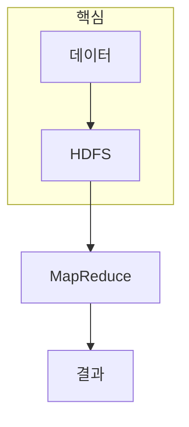

> [!abstract] 한 줄 요약
> 하둡은 ==분산 파일시스템과 계산 모델==을 함께 설계해 큰 데이터와 노드 장애를 다루는 아키텍처다.

## 이 노트의 지도



## 1. 분산 시스템은 실패를 예외가 아니라 조건으로 본다

클러스터에서는 노드·네트워크·디스크가 독립적으로 실패할 수 있다. HDFS는 데이터를 여러 노드에 분산해 저장하고, 계산을 데이터 가까이 보내는 방식으로 대용량 I/O 병목을 줄이려 한다.

<details>
<summary>파일시스템과 계산 모델을 함께 보는 이유</summary>

저장 위치를 모르면 계산이 불필요하게 네트워크를 건넌다. 반대로 계산만 분산해도 입력을 안정적으로 읽고 복구할 수 없으면 작업 전체가 불안정해진다.

</details>

> [!caution] 분산의 비용
> 노드를 늘리면 계산 자원은 늘지만, 조정·복구·네트워크·운영 복잡성도 함께 증가한다.

## 2. MapReduce는 중간 결과를 키 기준으로 모은다

Map 단계는 입력을 키-값 형태의 중간 결과로 바꾸고, Reduce 단계는 같은 키의 값을 묶어 집계한다. ==데이터 지역성==과 키 분배가 성능과 편향된 작업량을 좌우한다.

## 역할 카드

```html preview
<div style="font-family:system-ui,sans-serif;padding:20px">
  <div id="cards" style="display:flex;gap:14px;flex-wrap:wrap"></div>
  <script>
    var stats = [
      ['HDFS', '저장', '분산 파일', 'var(--chart-1)'],
      ['Map', '변환', '키-값 생성', 'var(--chart-2)'],
      ['Reduce', '집계', '같은 키 결합', 'var(--chart-3)']
    ];
    document.getElementById('cards').innerHTML = stats.map(function (s) {
      return '<div style="flex:1;min-width:150px;padding:16px;background:var(--card);' +
        'color:var(--card-foreground);border:1px solid var(--border);' +
        'border-radius:var(--radius)">' +
        '<div style="font-size:13px;color:var(--muted-foreground)">' + s[0] + '</div>' +
        '<div style="font-size:26px;font-weight:700;margin-top:4px">' + s[1] + '</div>' +
        '<div style="font-size:12px;font-weight:600;margin-top:4px;color:' + s[3] + '">' +
        s[2] + '</div>' +
        '</div>';
    }).join('');
  </script>
</div>
```

<Tabs>
  <Tab label="저장">분산된 파일을 장애를 고려해 관리한다.</Tab>
  <Tab label="변환">입력을 독립적인 중간 키-값으로 바꾼다.</Tab>
  <Tab label="집계">키별 그룹을 합쳐 최종 결과를 만든다.</Tab>
</Tabs>

## 핵심 정리

| 구성 | 맡는 일 | 확인할 조건 |
| :-- | :-- | :-- |
| HDFS | 분산 저장 | 복제·지역성·복구 |
| Map | 병렬 변환 | 입력 분할과 키 생성 |
| Shuffle | 키 재배치 | 네트워크와 불균형 |
| Reduce | 그룹 집계 | 결합 연산의 의미 |

> [!question]- 스스로 점검
> **Q.** MapReduce 작업에서 특정 키에 데이터가 몰리면 어떤 문제가 생기는가?
>
> **A.** 그 키를 처리하는 작업이 병목이 되어 전체 완료 시간이 길어질 수 있다.

## 출처

- 공개 노트에는 원본 강의 자료, 자산 이미지, 페이지 단위 근거를 포함하지 않는다.

---

## 원본 강의 흐름 인터랙티브

```html preview
<div style="font-family:system-ui,sans-serif;padding:20px;color:var(--foreground)">
  <label for="noteFlow352560" style="font-size:14px;font-weight:600">하둡과 분산 아키텍처 단계</label>
  <div id="noteFlow352560-out" style="font-size:26px;font-weight:700;color:var(--chart-1);margin:6px 0">하둡과 분산 아키텍처 핵심 개념</div>
  <input id="noteFlow352560" type="range" min="1" max="3" step="1" value="1" style="width:100%;accent-color:var(--primary)" />
  <p style="font-size:13px;color:var(--muted-foreground)">슬라이더를 움직이면 원본 PDF에서 정리한 이 노트의 흐름을 확인합니다.</p>
  <script>
    var noteFlow352560 = document.getElementById('noteFlow352560');
    var noteFlow352560Out = document.getElementById('noteFlow352560-out');
    var noteFlow352560Steps = ["하둡과 분산 아키텍처 핵심 개념","하둡과 분산 아키텍처 처리 절차","하둡과 분산 아키텍처 검증·응용"];
    noteFlow352560.addEventListener('input', function () { noteFlow352560Out.textContent = noteFlow352560Steps[Number(noteFlow352560.value) - 1]; });
  </script>
</div>
```
