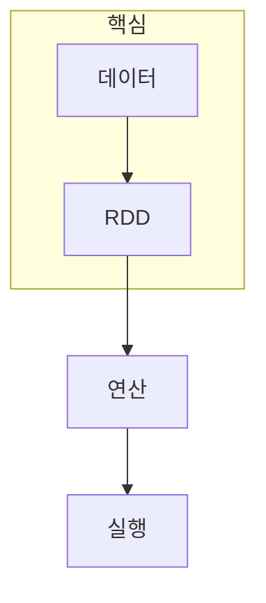

> [!abstract] 한 줄 요약
> Spark는 분산 데이터를 ==변환 그래프와 실행 결과==로 읽으며 SQL·스트리밍·ML 작업을 연결한다.

## 이 노트의 지도



## 1. Spark의 시작점은 데이터를 바로 계산하지 않는 변환이다

Spark shell에서 데이터를 읽고 RDD를 만들면, 연산은 변환 그래프로 쌓일 수 있다. 이때 데이터셋을 어떤 연산자가 만들었는지 보는 것이 결과 숫자만 보는 것보다 디버깅에 유리하다.

<details>
<summary>Spark UI에서 확인할 대상</summary>

작업이 어떤 RDD 연산 그래프로 구성됐는지, 어느 단계가 오래 걸렸는지, 실행이 어떤 단위로 나뉘었는지를 함께 확인한다.

</details>

> [!caution] 미리보기의 한계
> 작은 예제의 shell 실행이 실제 클러스터에서의 데이터 분할·메모리·셔플 비용을 보장하지는 않는다.

## 2. 같은 실행 엔진 위에서 여러 데이터 작업을 연결한다

Spark는 SQL, 스트리밍, 머신러닝을 별도 세계로 보지 않고 데이터셋과 실행 계획의 흐름으로 연결한다. ==연산 그래프==를 읽을 수 있으면 기능이 달라도 공통 병목을 추적할 수 있다.

## 기능 카드

```html preview
<div style="font-family:system-ui,sans-serif;padding:20px">
  <div id="cards" style="display:flex;gap:14px;flex-wrap:wrap"></div>
  <script>
    var stats = [
      ['Shell', '탐색', '대화형 시작', 'var(--chart-1)'],
      ['SQL', '질의', '구조화 데이터', 'var(--chart-2)'],
      ['Streaming', '흐름', '연속 입력', 'var(--chart-3)']
    ];
    document.getElementById('cards').innerHTML = stats.map(function (s) {
      return '<div style="flex:1;min-width:150px;padding:16px;background:var(--card);' +
        'color:var(--card-foreground);border:1px solid var(--border);' +
        'border-radius:var(--radius)">' +
        '<div style="font-size:13px;color:var(--muted-foreground)">' + s[0] + '</div>' +
        '<div style="font-size:26px;font-weight:700;margin-top:4px">' + s[1] + '</div>' +
        '<div style="font-size:12px;font-weight:600;margin-top:4px;color:' + s[3] + '">' +
        s[2] + '</div>' +
        '</div>';
    }).join('');
  </script>
</div>
```

<Tabs>
  <Tab label="생성">입력에서 RDD·데이터셋을 만든다.</Tab>
  <Tab label="변환">filter·join 같은 연산 그래프를 구성한다.</Tab>
  <Tab label="실행">action과 UI로 실제 작업을 확인한다.</Tab>
</Tabs>

## 핵심 정리

| 관점 | Spark에서 보는 것 | 확인할 질문 |
| :-- | :-- | :-- |
| 데이터 | RDD·데이터셋 | 어떤 입력을 읽는가 |
| 계획 | 연산 그래프 | 어떤 변환이 이어지는가 |
| 실행 | 작업·단계 | 어디가 병목인가 |
| 기능 | SQL·Streaming·ML | 같은 흐름에 어떻게 붙는가 |

> [!question]- 스스로 점검
> **Q.** Spark에서 연산 그래프를 보는 습관이 필요한 이유는 무엇인가?
>
> **A.** 결과가 느리거나 틀릴 때 입력·변환·실행 중 어느 단계가 원인인지 구분할 수 있기 때문이다.

## 출처

- 공개 노트에는 원본 강의 자료, 자산 이미지, 페이지 단위 근거를 포함하지 않는다.

---

## 원본 강의 흐름 인터랙티브

```html preview
<div style="font-family:system-ui,sans-serif;padding:20px;color:var(--foreground)">
  <label for="noteFlow198141" style="font-size:14px;font-weight:600">Apache Spark 미리보기 단계</label>
  <div id="noteFlow198141-out" style="font-size:26px;font-weight:700;color:var(--chart-1);margin:6px 0">Apache Spark 미리보기 핵심 개념</div>
  <input id="noteFlow198141" type="range" min="1" max="3" step="1" value="1" style="width:100%;accent-color:var(--primary)" />
  <p style="font-size:13px;color:var(--muted-foreground)">슬라이더를 움직이면 원본 PDF에서 정리한 이 노트의 흐름을 확인합니다.</p>
  <script>
    var noteFlow198141 = document.getElementById('noteFlow198141');
    var noteFlow198141Out = document.getElementById('noteFlow198141-out');
    var noteFlow198141Steps = ["Apache Spark 미리보기 핵심 개념","Apache Spark 미리보기 처리 절차","Apache Spark 미리보기 검증·응용"];
    noteFlow198141.addEventListener('input', function () { noteFlow198141Out.textContent = noteFlow198141Steps[Number(noteFlow198141.value) - 1]; });
  </script>
</div>
```
