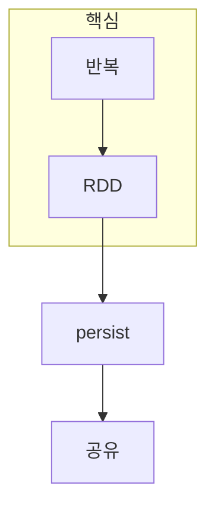

> [!abstract] 한 줄 요약
> Spark는 반복·대화형 데이터 작업에서 중간 결과를 다시 쓰는 비용을 줄이기 위해 ==RDD와 메모리 지속성==을 중심에 둔다.

## 이 노트의 지도



## 1. Spark의 기본 추상화는 RDD다

RDD는 다른 데이터셋의 변환 조합으로 만들어지는 분산 데이터셋이다. SparkContext는 이 흐름의 진입점이며, 작업은 데이터가 어떻게 만들어졌는지의 관계를 따라 복구와 실행을 설명한다.

<details>
<summary>persist는 언제 의미가 있을까?</summary>

같은 중간 데이터셋을 여러 action이나 반복 학습에서 다시 사용할 때 persist가 재계산을 줄일 수 있다. 한 번만 쓰는 데이터까지 무조건 메모리에 두는 선택은 아니다.

</details>

> [!caution] 메모리는 무한하지 않다
> persist는 계산 시간을 줄일 수 있지만, 데이터 크기와 메모리 압박을 함께 고려하지 않으면 오히려 작업을 불안정하게 만들 수 있다.

## 2. 공유할 데이터는 움직임을 줄여야 한다

broadcast는 여러 작업이 같은 읽기 전용 데이터를 사용할 때 전송 방식을 효율화하는 데 쓰인다. ==반복성==과 ==공유성==을 구분하면 어떤 데이터가 유지·배포되어야 하는지 판단할 수 있다.

## 설계 카드

```html preview
<div style="font-family:system-ui,sans-serif;padding:20px">
  <div id="cards" style="display:flex;gap:14px;flex-wrap:wrap"></div>
  <script>
    var stats = [
      ['RDD', '계보', '복구 단서', 'var(--chart-1)'],
      ['Persist', '반복', '재계산 감소', 'var(--chart-2)'],
      ['Broadcast', '공유', '전송 절약', 'var(--chart-3)']
    ];
    document.getElementById('cards').innerHTML = stats.map(function (s) {
      return '<div style="flex:1;min-width:150px;padding:16px;background:var(--card);' +
        'color:var(--card-foreground);border:1px solid var(--border);' +
        'border-radius:var(--radius)">' +
        '<div style="font-size:13px;color:var(--muted-foreground)">' + s[0] + '</div>' +
        '<div style="font-size:26px;font-weight:700;margin-top:4px">' + s[1] + '</div>' +
        '<div style="font-size:12px;font-weight:600;margin-top:4px;color:' + s[3] + '">' +
        s[2] + '</div>' +
        '</div>';
    }).join('');
  </script>
</div>
```

<Tabs>
  <Tab label="추상화">RDD는 변환 관계를 가진 분산 데이터셋이다.</Tab>
  <Tab label="지속성">반복 사용되는 중간 결과를 재활용한다.</Tab>
  <Tab label="공유">여러 작업의 읽기 전용 데이터를 효율적으로 배포한다.</Tab>
</Tabs>

## 핵심 정리

| 선택 | 이점 | 비용·조건 |
| :-- | :-- | :-- |
| RDD 계보 | 복구·재계산 설명 | 그래프가 길어질 수 있다 |
| persist | 반복 작업 단축 | 메모리 사용 |
| broadcast | 공유 전송 감소 | 갱신에는 부적합 |
| SparkContext | 작업 진입점 | 자원 설정의 영향 |

> [!question]- 스스로 점검
> **Q.** 어떤 중간 결과를 persist 후보로 볼 수 있는가?
>
> **A.** 반복적으로 재사용되며 재계산 비용이 큰 데이터셋이다.

## 출처

- 공개 노트에는 원본 강의 자료, 자산 이미지, 페이지 단위 근거를 포함하지 않는다.

---

## 원본 강의 흐름 인터랙티브

```html preview
<div style="font-family:system-ui,sans-serif;padding:20px;color:var(--foreground)">
  <label for="noteFlow216902" style="font-size:14px;font-weight:600">1. Apache Spark의 배경 단계</label>
  <div id="noteFlow216902-out" style="font-size:26px;font-weight:700;color:var(--chart-1);margin:6px 0">1. Apache Spark의 배경 핵심 개념</div>
  <input id="noteFlow216902" type="range" min="1" max="3" step="1" value="1" style="width:100%;accent-color:var(--primary)" />
  <p style="font-size:13px;color:var(--muted-foreground)">슬라이더를 움직이면 원본 PDF에서 정리한 이 노트의 흐름을 확인합니다.</p>
  <script>
    var noteFlow216902 = document.getElementById('noteFlow216902');
    var noteFlow216902Out = document.getElementById('noteFlow216902-out');
    var noteFlow216902Steps = ["1. Apache Spark의 배경 핵심 개념","1. Apache Spark의 배경 처리 절차","1. Apache Spark의 배경 검증·응용"];
    noteFlow216902.addEventListener('input', function () { noteFlow216902Out.textContent = noteFlow216902Steps[Number(noteFlow216902.value) - 1]; });
  </script>
</div>
```
