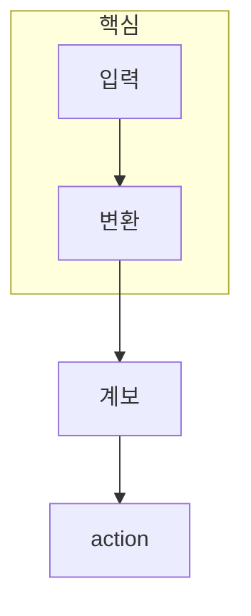

> [!abstract] 한 줄 요약
> Spark 워크플로는 transformation으로 ==계보를 구성==하고 action으로 필요한 부분을 실제 실행한다.

## 이 노트의 지도



## 1. transformation은 새 RDD 관계를 만든다

filter·map·join 같은 transformation은 기존 데이터셋으로부터 새 RDD를 정의한다. 이 단계에서는 결과값을 즉시 모두 계산하기보다, 어떤 변환이 어떤 입력에 의존하는지의 계보를 만든다.

<details>
<summary>계보가 복구에 주는 정보</summary>

어떤 파티션이 사라졌을 때 Spark는 저장된 전체 결과만 찾는 대신, 필요한 변환 경로를 따라 해당 부분을 다시 계산할 수 있다.

</details>

> [!caution] 지연 실행의 오해
> transformation이 즉시 계산하지 않는다고 해서 비용이 없는 것은 아니다. action이 호출될 때 쌓인 그래프의 비용이 함께 실행된다.

## 2. action은 결과·저장·외부 효과를 요구한다

count·collect·save 같은 action은 그래프의 일부 또는 전체를 실행하도록 요청한다. ==어떤 action이 필요한가==를 분명히 하면 불필요하게 큰 데이터를 드라이버로 모으는 실수를 줄일 수 있다.

## 계보 깊이 제어

```html preview
<div style="font-family:system-ui,sans-serif;padding:20px;color:var(--foreground)">
  <label for="amt" style="font-size:14px;font-weight:600">변환 단계 수</label>
  <div id="out" style="font-size:30px;font-weight:700;color:var(--chart-1);margin:6px 0">1 단계</div>
  <input id="amt" type="range" min="1" max="5" step="1" value="1"
    style="width:100%;accent-color:var(--primary)" />
  <p style="font-size:13px;color:var(--muted-foreground)">단계가 늘수록 action 시점에 실행할 계보도 길어진다.</p>
  <script>
    var amt = document.getElementById('amt');
    var out = document.getElementById('out');
    amt.addEventListener('input', function () {
      out.textContent = Number(amt.value) + ' 단계';
    });
  </script>
</div>
```

<Tabs>
  <Tab label="변환">RDD에서 RDD로 가는 관계를 정의한다.</Tab>
  <Tab label="계보">재계산·의존성의 경로를 남긴다.</Tab>
  <Tab label="실행">action이 필요한 결과를 요청한다.</Tab>
</Tabs>

## 핵심 정리

| 구분 | 하는 일 | 확인할 위험 |
| :-- | :-- | :-- |
| Transformation | 새 RDD 정의 | 긴 의존성 |
| Lineage | 생성 경로 보존 | 재계산 비용 |
| Action | 실제 실행 요청 | 큰 결과 수집 |
| Storage | 결과 보관 | 자원 압박 |

> [!question]- 스스로 점검
> **Q.** collect를 무심코 쓰면 왜 위험할 수 있는가?
>
> **A.** 분산된 큰 결과가 드라이버 한 곳으로 모여 메모리 병목을 만들 수 있기 때문이다.

## 출처

- 공개 노트에는 원본 강의 자료, 자산 이미지, 페이지 단위 근거를 포함하지 않는다.
