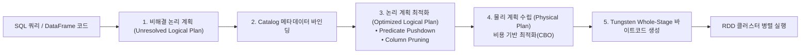

> [!abstract] 핵심 요약
> 단순한 RDD 로우 레벨 코딩을 넘어 **Catalyst 옵티마이저**는 선언적 SQL/DataFrame 쿼리를 분석하여 관계형 대수 최적화(필터 푸시다운, 프로젝션 프루닝)와 JVM 바이트코드 자동 생성(Whole-Stage Code Generation)을 수행한다.
> 대규모 분산 환경에서 학습된 머신러닝 파이프라인은 **MLflow**를 통해 파라미터, 평가 메트릭, 모델 아티팩트 및 버전을 중앙 저장소에서 추적·관리(MLOps)함으로써 완전한 재현성을 달성한다.

---

## 1. Catalyst 옵티마이저 파이프라인



---

## 2. MLflow 4대 핵심 컴포넌트

| 컴포넌트 | 핵심 기능 | MLOps 파이프라인 내 역할 |
| :-- | :-- | :-- |
| **MLflow Tracking** | 하이퍼파라미터, 학습 손실, 평가지표, 그래프 아티팩트 로깅 | 실험 간 성능 비교 및 최적 하이퍼파라미터 선정 |
| **MLflow Projects** | Conda/Docker 기반 의존성 패키징 포맷 | 모든 컴퓨팅 환경에서 코드의 결정론적 재현 보장 |
| **MLflow Models** | 표준 모델 포맷 (PyTorch, Sklearn, Spark ML) 저장 | 일관된 포맷으로 REST API 서빙 및 배치 추론 배포 |
| **Model Registry** | 모델 버전 관리, 스테이지 전환 (Staging ➔ Production) | 승인 워크플로 및 프로덕션 모델 롤백 지원 |

---

## 3. 실시간 MLflow 실험 메트릭 비교 시뮬레이터

```html preview
<div style="font-family:system-ui,-apple-system,sans-serif;padding:20px;background:var(--card);color:var(--card-foreground);border:1px solid var(--border);border-radius:var(--radius)">
  <div style="font-size:16px;font-weight:700;margin-bottom:14px;color:var(--primary);display:flex;align-items:center;gap:8px">
    <span>🧪 MLflow 실험 런(Run) 실시간 비교 대시보드</span>
  </div>

  <div style="display:grid;grid-template-columns:1fr 1fr;gap:12px;margin-bottom:14px">
    <div>
      <div style="font-size:11px;font-weight:700;color:var(--primary);margin-bottom:4px">Run 1: Random Forest</div>
      <div style="display:flex;justify-content:space-between;font-size:11px;color:var(--muted-foreground)">
        <span>Max Depth: 10, N_Estimators: 100</span>
      </div>
      <div style="margin-top:6px;font-size:12px">F1-Score: <b>0.892</b> | Latency: <b>15ms</b></div>
    </div>
    <div>
      <div style="font-size:11px;font-weight:700;color:var(--chart-1);margin-bottom:4px">Run 2: Gradient Boosting</div>
      <div style="display:flex;justify-content:space-between;font-size:11px;color:var(--muted-foreground)">
        <span>Learning Rate: 0.05, Max Depth: 6</span>
      </div>
      <div style="margin-top:6px;font-size:12px">F1-Score: <b>0.935</b> | Latency: <b>28ms</b></div>
    </div>
  </div>

  <div style="padding:10px;background:var(--background);border:1px solid var(--border);border-radius:var(--radius);text-align:center">
    <div style="font-size:10px;color:var(--muted-foreground)">Model Registry 프로덕션 승격 모델</div>
    <div style="font-size:13px;font-weight:800;color:var(--primary);margin-top:4px">🚀 Run 2 (Gradient Boosting v2) ➔ Production 배포 완료</div>
  </div>
</div>
```
