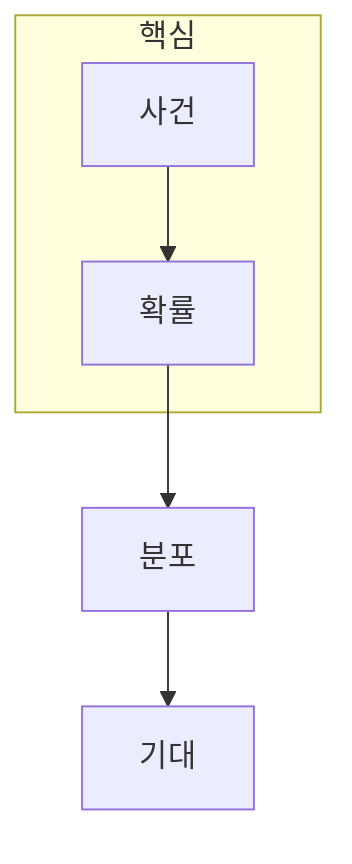

> [!abstract] 한 줄 요약
> 통계는 데이터의 한 값을 외우는 대신, ==가능한 결과와 그 분포==를 이용해 불확실성을 설명한다.

## 이 노트의 지도



## 1. 확률변수는 결과를 수치로 옮긴다

표본공간의 사건에 확률을 부여하고, 확률변수로 결과를 수치화하면 데이터에서 빈도·누적·평균을 같은 언어로 다룰 수 있다. CDF는 특정 값 이하일 확률을, PDF는 연속 변수의 분포 밀도를 표현한다.

$$
\mathbb{E}[X] = \sum_x x\,P(X=x)
$$

<details>
<summary>CDF와 PDF를 구분하는 질문</summary>

CDF는 누적 확률을 읽을 때, PDF는 연속 변수에서 값 주변의 분포 모양을 읽을 때 사용한다. PDF의 한 점 값 자체를 확률로 해석하지 않는다.

</details>

> [!caution] 평균의 한계
> 기댓값이나 평균 하나만으로 분포의 퍼짐·왜도·드문 사건의 위험을 모두 설명할 수는 없다.

## 2. 가우시안은 하나의 분포 모델일 뿐이다

가우시안 분포는 평균과 분산으로 많은 현상을 요약하는 유용한 모델이다. 그러나 데이터가 다봉·치우침·절단을 보이면 ==가우시안 가정==을 먼저 검토해야 한다.

## 확률 제어

```html preview
<div style="font-family:system-ui,sans-serif;padding:20px;color:var(--foreground)">
  <label for="amt" style="font-size:14px;font-weight:600">사건 확률 p</label>
  <div id="out" style="font-size:30px;font-weight:700;color:var(--chart-1);margin:6px 0">0.50</div>
  <input id="amt" type="range" min="0" max="100" step="1" value="50"
    style="width:100%;accent-color:var(--primary)" />
  <p style="font-size:13px;color:var(--muted-foreground)">p는 0과 1 사이의 값을 가지며, 독립 시행의 모델 가정과 함께 해석한다.</p>
  <script>
    var amt = document.getElementById('amt');
    var out = document.getElementById('out');
    amt.addEventListener('input', function () {
      out.textContent = (Number(amt.value) / 100).toFixed(2);
    });
  </script>
</div>
```

<Tabs>
  <Tab label="사건">어떤 결과 집합을 관심 대상으로 둘지 정한다.</Tab>
  <Tab label="분포">값들이 어떻게 퍼지는지 CDF·PDF로 표현한다.</Tab>
  <Tab label="요약">기댓값과 분산으로 중심과 변동을 읽는다.</Tab>
</Tabs>

## 핵심 정리

| 개념 | 답하는 질문 | 주의점 |
| :-- | :-- | :-- |
| 확률 | 사건이 얼마나 가능한가 | 모델 가정 필요 |
| CDF | 값 이하일 가능성은 | 누적 함수 |
| PDF | 연속값이 어떻게 퍼지는가 | 한 점은 확률이 아니다 |
| 기댓값 | 장기 평균은 | 분포 모양을 숨길 수 있다 |

> [!question]- 스스로 점검
> **Q.** PDF가 높은 위치를 곧바로 높은 확률이라고 말하면 안 되는 이유는 무엇인가?
>
> **A.** 연속 변수의 확률은 한 점이 아니라 구간의 밀도를 적분해 얻기 때문이다.

## 출처

- 공개 노트에는 원본 강의 자료, 자산 이미지, 페이지 단위 근거를 포함하지 않는다.
