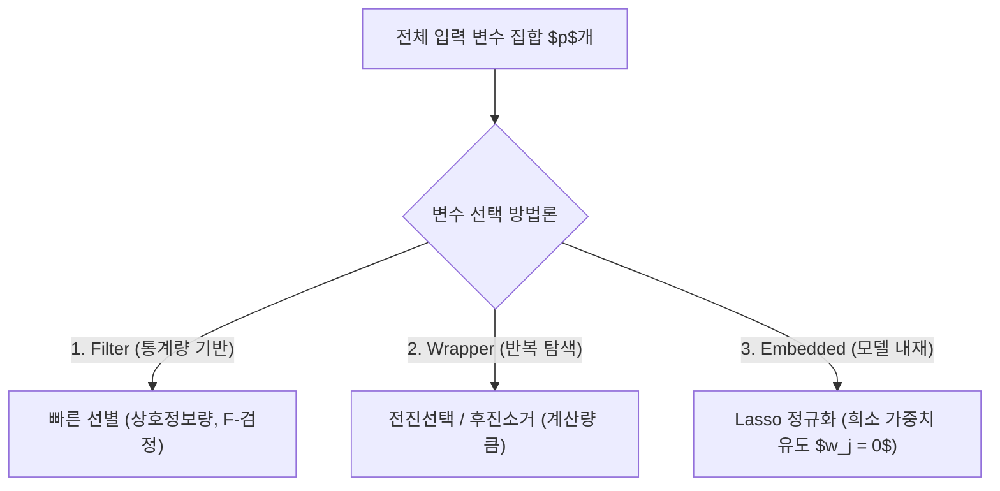

> [!abstract] 핵심 요약
> 입력 변수의 수가 너무 많으면 모델의 계산 복잡도가 급증하고 과적합이 발생한다.
> **필터 기법**은 빠르지만 변수 간 상호작용을 무시하고, **래퍼 기법**은 최적의 부분집합을 찾으나 계산량이 막대하다. **L1 Lasso 임베디드 기법**은 목적 함수에 $L_1$ 페널티를 부과하여 불필요한 계수를 정확히 0으로 수축시킴으로써 변수 선택과 학습을 동시에 완수한다.

---

## 1. 정규화(Regularization) 목적 함수 비교

$$\text{Lasso (L1)}: \quad \min_{\mathbf{w}} \frac{1}{2N} \|\mathbf{y} - X\mathbf{w}\|_2^2 + \lambda \|\mathbf{w}\|_1 \quad \left( \|\mathbf{w}\|_1 = \sum_{j=1}^p |w_j| \right)$$

$$\text{Ridge (L2)}: \quad \min_{\mathbf{w}} \frac{1}{2N} \|\mathbf{y} - X\mathbf{w}\|_2^2 + \frac{\lambda}{2} \|\mathbf{w}\|_2^2 \quad \left( \|\mathbf{w}\|_2^2 = \sum_{j=1}^p w_j^2 \right)$$



---

## 2. 변수 선택 3대 방법론 비교

| 방법론 | 원리 | 장점 | 단점 |
| :-- | :-- | :-- | :-- |
| **Filter** | 모델 학습 전 통계적 지표($\chi^2$, ANOVA $F$, Mutual Info)로 순위 산정 | 계산 속도가 매우 빠름, 모델 독립적 | 변수 간 다중공선성 및 비선형 상호작용 반영 불가 |
| **Wrapper** | 변수 부분집합을 모델에 학습시켜 검증 성능(AIC, BIC, CV)으로 평가 | 모델에 최적화된 변수 조합 탐색 | 계산 비용 $O(2^p)$로 큼, 과적합 위험 |
| **Embedded** | 손실 함수 최적화 과정에서 가중치를 0으로 페널티 수축 (Lasso) | 필터의 속도와 래퍼의 상호작용 반영 결합 | 정규화 강도 하이퍼파라미터 $\lambda$ 튜닝 필요 |

---

## 3. 실시간 Lasso(L1) vs Ridge(L2) 가중치 수축 시뮬레이터

```html preview
<div style="font-family:system-ui,-apple-system,sans-serif;padding:20px;background:var(--card);color:var(--card-foreground);border:1px solid var(--border);border-radius:var(--radius)">
  <div style="font-size:16px;font-weight:700;margin-bottom:14px;color:var(--primary);display:flex;align-items:center;gap:8px">
    <span>📉 Lasso(L1) vs Ridge(L2) 정규화 계수 수축 비교기</span>
  </div>

  <div style="margin-bottom:14px">
    <div style="display:flex;justify-content:space-between;font-size:11px;color:var(--muted-foreground);margin-bottom:4px">
      <span>정규화 페널티 강도 (Lambda):</span>
      <span id="lambdaVal" style="font-weight:700;color:var(--primary)">Lambda = 0.50</span>
    </div>
    <input id="inLambda" type="range" min="0.0" max="2.0" step="0.1" value="0.5" style="width:100%" />
  </div>

  <div style="display:grid;grid-template-columns:1fr 1fr;gap:12px;margin-bottom:12px">
    <div style="padding:10px;background:var(--background);border:1px solid var(--border);border-radius:var(--radius);text-align:center">
      <div style="font-size:10px;color:var(--muted-foreground)">Lasso (L1) 가중치 w1, w2, w3</div>
      <div id="lassoOut" style="font-family:monospace;font-size:13px;font-weight:800;color:var(--primary);margin-top:4px">[0.80, 0.00, 0.00]</div>
    </div>
    <div style="padding:10px;background:var(--background);border:1px solid var(--border);border-radius:var(--radius);text-align:center">
      <div style="font-size:10px;color:var(--muted-foreground)">Ridge (L2) 가중치 w1, w2, w3</div>
      <div id="ridgeOut" style="font-family:monospace;font-size:13px;font-weight:800;color:var(--chart-1);margin-top:4px">[0.85, 0.21, 0.08]</div>
    </div>
  </div>

  <div id="regDesc" style="padding:10px;background:var(--background);border:1px solid var(--border);border-radius:var(--radius);font-size:11px">
    Lasso는 덜 중요한 변수의 가중치를 정확히 0으로 만들어 변수를 완전히 제거합니다 (Feature Selection).
  </div>

  <script>
    document.getElementById('inLambda').oninput = function() {
      var lam = parseFloat(this.value);
      document.getElementById('lambdaVal').textContent = "Lambda = " + lam.toFixed(2);

      var orig = [1.2, 0.4, 0.15];
      // Soft thresholding for Lasso
      var lasso = orig.map(function(w) {
        var s = Math.sign(w) * Math.max(0, Math.abs(w) - lam);
        return s.toFixed(2);
      });
      // Ridge scaling
      var ridge = orig.map(function(w) {
        return (w / (1.0 + lam)).toFixed(2);
      });

      document.getElementById('lassoOut').textContent = "[" + lasso.join(", ") + "]";
      document.getElementById('ridgeOut').textContent = "[" + ridge.join(", ") + "]";
    };
  </script>
</div>
```
