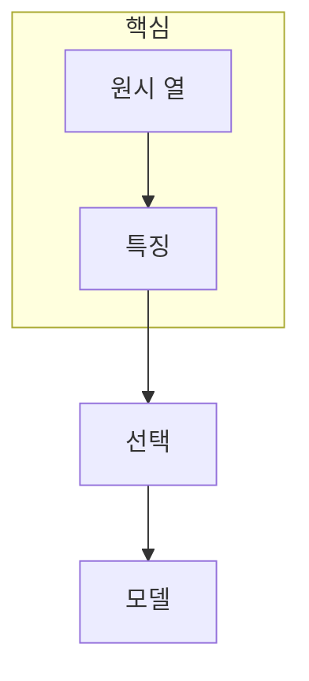

> [!abstract] 한 줄 요약
> 변수 선택은 열을 많이 남기는 일이 아니라, ==예측에 유용하고 안정적인 특징==을 남겨 모델의 복잡도와 일반화 사이를 조절하는 일이다.

## 이 노트의 지도



## 1. 특징 벡터는 수치 표현의 묶음이다

데이터셋의 열은 그대로 모델에 들어가지 않을 수 있다. 범주형 변환, 스케일링, 결측 처리 뒤에 여러 수치 특징을 하나의 feature vector로 묶고, 이 벡터가 만드는 feature space에서 모델이 패턴을 찾는다.

$$
\mathbf{x} = (x_1, x_2, \ldots, x_d)
$$

<details>
<summary>결측이 많은 변수를 먼저 점검하는 이유</summary>

결측이 많은 변수는 모델이 사용할 수 있는 관측을 줄이거나, 결측 처리 방식 자체가 강한 가정이 될 수 있다. 제거·대치·별도 지표화 중 무엇이 타당한지 데이터 생성 과정을 함께 본다.

</details>

> [!caution] 선택과 변환은 다르다
> 선택은 어떤 특징을 유지할지 정하는 일이고, 변환은 특징의 표현을 바꾸는 일이다. 둘을 섞으면 모델 변화의 원인을 분리하기 어렵다.

## 2. 좋은 특징은 예측력만으로 결정되지 않는다

모델 기반 선택, 투표 기반 선택, 분산·연관성 기준은 서로 다른 관점을 제공한다. ==선택 기준==이 바뀌면 유지되는 특징도 달라질 수 있으므로 성능·해석 가능성·데이터 품질을 함께 비교한다.

## 선택 카드

```html preview
<div style="font-family:system-ui,sans-serif;padding:20px">
  <div id="cards" style="display:flex;gap:14px;flex-wrap:wrap"></div>
  <script>
    var stats = [
      ['품질', '결측', '관측 가능성', 'var(--chart-1)'],
      ['정보', '연관', '예측 신호', 'var(--chart-2)'],
      ['안정', '재현', '선택 일관성', 'var(--chart-3)']
    ];
    document.getElementById('cards').innerHTML = stats.map(function (s) {
      return '<div style="flex:1;min-width:150px;padding:16px;background:var(--card);' +
        'color:var(--card-foreground);border:1px solid var(--border);' +
        'border-radius:var(--radius)">' +
        '<div style="font-size:13px;color:var(--muted-foreground)">' + s[0] + '</div>' +
        '<div style="font-size:26px;font-weight:700;margin-top:4px">' + s[1] + '</div>' +
        '<div style="font-size:12px;font-weight:600;margin-top:4px;color:' + s[3] + '">' +
        s[2] + '</div>' +
        '</div>';
    }).join('');
  </script>
</div>
```

<Tabs>
  <Tab label="표현">열을 모델이 읽는 수치 특징으로 바꾼다.</Tab>
  <Tab label="선택">불필요·불안정한 특징을 줄인다.</Tab>
  <Tab label="검증">분할과 모델이 바뀌어도 선택이 유지되는지 본다.</Tab>
</Tabs>

## 핵심 정리

| 관점 | 확인할 질문 | 예시 기준 |
| :-- | :-- | :-- |
| 품질 | 사용할 관측이 충분한가 | 결측 비율 |
| 정보 | 목표와 관계가 있는가 | 연관성·예측력 |
| 중복 | 같은 신호를 반복하는가 | 상관·중복성 |
| 안정성 | 재표본화에도 유지되는가 | 투표·교차 검증 |

> [!question]- 스스로 점검
> **Q.** 모델 성능이 약간 높아도 어떤 변수를 제외할 수 있는가?
>
> **A.** 결측·누수·불안정성 때문에 새로운 데이터에서 신뢰하기 어려운 변수다.

## 출처

- 공개 노트에는 원본 강의 자료, 자산 이미지, 페이지 단위 근거를 포함하지 않는다.
