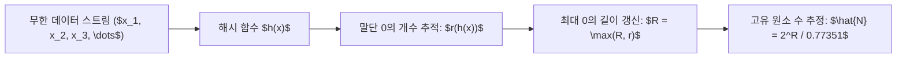

> [!abstract] 핵심 요약
> 실시간 네트워크 패킷이나 클릭스트림처럼 초당 수백만 건씩 유입되는 데이터는 디스크에 영구 저장한 후 쿼리할 수 없다(**Data without a Disk**).
> **스트리밍 알고리즘**은 단 한 번의 데이터 관찰(Single Pass)만을 허용하며, **Flajolet-Martin 알고리즘**은 해시 비트열의 연속된 0의 최대 개수 $R$을 통해 서로 다른 원소 수(Cardinality)를 $2^R / 0.77351$로 추정하고, **Count-Min Sketch**는 $d$개의 독립적 해시 함수로 최소값을 취하여 빈도 상한을 $O(1)$ 공간에서 산출한다.

---

## 1. Flajolet-Martin(FM) 카디널리티 추정 원리

1. 스트림의 각 원소 $x$를 균등 해시 함수 $h(x) \to [0, 2^L - 1]$로 해싱.
2. 해시 결과의 이진수 표현에서 최하위 비트로부터 연속된 0의 개수 $r(h(x))$를 계산.
3. 스트림 전체에서 관찰된 최대 0의 개수를 $R = \max_{x} r(h(x))$라 할 때, 고유 원소 수 $N$ 추정치:

$$\hat{N} = \frac{2^R}{\phi} \quad (\phi \approx 0.77351)$$



---

## 2. 스트리밍 3대 핵심 알고리즘 비교

| 알고리즘 | 해결하는 핵심 문제 | 메모리 공간 복잡도 | 오차 한계 |
| :-- | :-- | :-- | :-- |
| **Flajolet-Martin / HLL** | **고유 원소 수(Cardinality) 추정** (예: 일간 순 방문자 수 UV) | $O(\log \log N)$ (수 KB 메모리로 수십억 개 추정) | 표준 오차 $\approx \frac{1.04}{\sqrt{m}}$ |
| **Count-Min Sketch** | **원소별 출현 빈도수 추정** (예: DDoS 헤비 히터 탐지) | $O\left(\frac{e}{\epsilon} \ln \frac{1}{\delta}\right)$ | 오차 $\le \epsilon N$ (확률 $1-\delta$) |
| **DGIM 알고리즘** | **슬라이딩 윈도우 내 1의 개수 추정** | $O(\log^2 N)$ | 상대 오차 $\le 50\%$ (버킷 분할 시 $O(\epsilon)$) |

---

## 3. 실시간 Flajolet-Martin 해시 비트 카디널리티 시뮬레이터

```html preview
<div style="font-family:system-ui,-apple-system,sans-serif;padding:20px;background:var(--card);color:var(--card-foreground);border:1px solid var(--border);border-radius:var(--radius)">
  <div style="font-size:16px;font-weight:700;margin-bottom:14px;color:var(--primary);display:flex;align-items:center;gap:8px">
    <span>⚡ Flajolet-Martin 고유 원소 수(Cardinality) 추정기</span>
  </div>

  <div style="margin-bottom:14px">
    <div style="display:flex;justify-content:space-between;font-size:11px;color:var(--muted-foreground);margin-bottom:4px">
      <span>관찰된 말단 연속 0의 최대 비트 수 (R):</span>
      <span id="fmRVal" style="font-weight:700;color:var(--primary)">R = 10 bits</span>
    </div>
    <input id="inFmR" type="range" min="1" max="25" value="10" style="width:100%" />
  </div>

  <div style="display:grid;grid-template-columns:1fr 1fr;gap:12px;margin-bottom:12px">
    <div style="padding:10px;background:var(--background);border:1px solid var(--border);border-radius:var(--radius);text-align:center">
      <div style="font-size:10px;color:var(--muted-foreground)">2^R 값</div>
      <div id="fmPowerOut" style="font-family:monospace;font-size:16px;font-weight:800">1,024</div>
    </div>
    <div style="padding:10px;background:var(--background);border:1px solid var(--border);border-radius:var(--radius);text-align:center">
      <div style="font-size:10px;color:var(--muted-foreground)">추정 고유 원소 수 (N_hat)</div>
      <div id="fmEstOut" style="font-family:monospace;font-size:16px;font-weight:800;color:var(--primary)">1,324 개</div>
    </div>
  </div>

  <script>
    document.getElementById('inFmR').oninput = function() {
      var r = parseInt(this.value);
      document.getElementById('fmRVal').textContent = "R = " + r + " bits";

      var pow = Math.pow(2, r);
      var est = pow / 0.77351;

      document.getElementById('fmPowerOut').textContent = pow.toLocaleString();
      document.getElementById('fmEstOut').textContent = Math.round(est).toLocaleString() + " 개";
    };
  </script>
</div>
```
