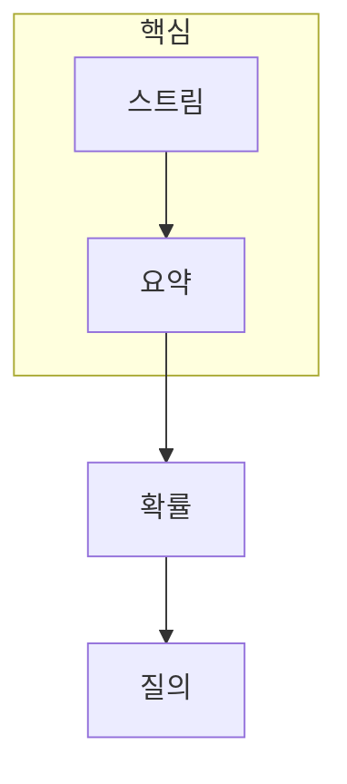

> [!abstract] 한 줄 요약
> 스트리밍 알고리즘은 모든 데이터를 저장하지 못하는 조건에서 ==한 번의 통과와 제한된 메모리==로 필요한 요약을 만든다.

## 이 노트의 지도



## 1. 스트림에서는 미래 길이를 모른 채 결정한다

스트림은 레코드가 계속 들어오고 과거를 다시 읽기 어렵다. 따라서 일반적인 전수 저장 대신 균등 샘플, 멤버십 요약, 고유 원소 수처럼 질의에 맞는 근사 구조를 선택한다.

$$
\Pr(i\text{ retained at time }t)=\frac{m}{t}
$$

<details>
<summary>reservoir sampling이 보장하는 것</summary>

길이를 모르는 스트림에서도 저장소 크기 m을 유지하면서, 현재까지 본 항목 중 각 항목이 같은 확률로 저장소에 남도록 만든다.

</details>

> [!caution] Bloom filter의 오차 방향
> Bloom filter는 false positive를 허용하지만 false negative를 허용하지 않는 방식으로 멤버십을 근사한다. 양성 응답을 곧바로 확정 사실로 읽으면 안 된다.

## 2. 정확도·메모리·지연은 함께 선택한다

샘플 크기가 커지면 요약 품질은 좋아질 수 있지만 메모리와 처리 비용이 늘어난다. ==어떤 오류를 허용하는가==를 먼저 정하면 reservoir sampling, Bloom filter, Flajolet-Martin 같은 선택의 기준이 생긴다.

## 저장소 크기 제어

```html preview
<div style="font-family:system-ui,sans-serif;padding:20px;color:var(--foreground)">
  <label for="amt" style="font-size:14px;font-weight:600">Reservoir 크기 m</label>
  <div id="out" style="font-size:30px;font-weight:700;color:var(--chart-1);margin:6px 0">10 items</div>
  <input id="amt" type="range" min="1" max="100" step="1" value="10"
    style="width:100%;accent-color:var(--primary)" />
  <p style="font-size:13px;color:var(--muted-foreground)">m은 균등 표본으로 유지할 항목 수이며, 더 큰 m은 더 많은 메모리를 사용한다.</p>
  <script>
    var amt = document.getElementById('amt');
    var out = document.getElementById('out');
    amt.addEventListener('input', function () {
      out.textContent = Number(amt.value) + ' items';
    });
  </script>
</div>
```

<Tabs>
  <Tab label="샘플">대표 항목을 제한된 저장소에 유지한다.</Tab>
  <Tab label="필터">멤버십 질의를 빠르게 근사한다.</Tab>
  <Tab label="추정">고유 원소 수처럼 전체 특성을 요약한다.</Tab>
</Tabs>

## 핵심 정리

| 구조 | 답하는 질문 | 허용하는 절충 |
| :-- | :-- | :-- |
| Reservoir sampling | 어떤 항목을 대표로 남길까 | 표본 오차 |
| Bloom filter | 본 적 있는 항목인가 | false positive |
| FM 계열 | 고유 원소가 얼마나 되는가 | 근사 오차 |
| 스트림 모델 | 지금 무엇을 요약할까 | 제한된 메모리 |

> [!question]- 스스로 점검
> **Q.** Bloom filter의 양성 응답 뒤에 정확한 저장소 조회가 필요한 경우는 언제인가?
>
> **A.** false positive가 허용되지 않아 실제 존재 여부를 확정해야 할 때다.

## 출처

- 공개 노트에는 원본 강의 자료, 자산 이미지, 페이지 단위 근거를 포함하지 않는다.
